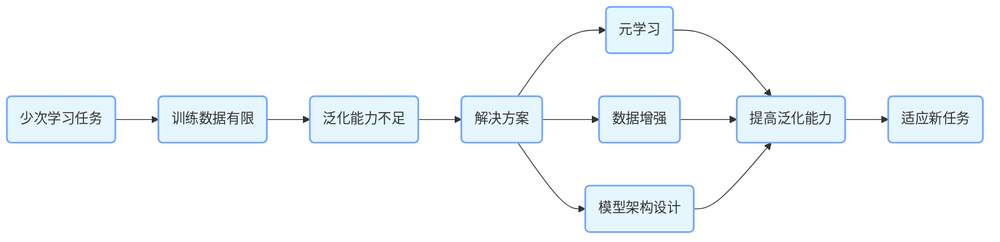

# 提高AI模型在少次学习任务中的泛化能力

> 关键词：AI模型、少次学习、泛化能力、元学习、数据增强

> 摘要：本文聚焦于提高AI模型在少次学习任务中的泛化能力。少次学习场景下，由于训练数据有限，模型难以学习到足够的特征模式，导致泛化性能不佳。文章深入探讨了少次学习和泛化能力的核心概念，详细阐述了相关算法原理，包括基于元学习的方法和数据增强技术，并通过数学模型和公式进行理论支撑。同时，给出了项目实战案例，涵盖开发环境搭建、源代码实现与解读。还介绍了少次学习在图像识别、自然语言处理等领域的实际应用场景，推荐了相关的学习资源、开发工具和研究论文。最后总结了未来发展趋势与挑战，为读者全面理解和解决少次学习中的泛化问题提供了系统的指导。

## 1. 背景介绍 
### 1.1 目的和范围
在许多实际应用场景中，获取大量标注数据往往是昂贵且困难的，例如医疗图像识别中罕见疾病样本稀少、自然语言处理中特定领域的语料不足等。少次学习（Few-Shot Learning）正是为了解决这类数据稀缺问题而提出的技术，其目标是让模型在仅使用少量标注样本的情况下，仍能对新的类别进行准确分类或完成其他任务。然而，少次学习面临的一个关键挑战是模型的泛化能力不足，即模型在训练数据上表现良好，但在未见过的测试数据上性能急剧下降。本文的目的是深入探讨提高AI模型在少次学习任务中泛化能力的方法和技术，涵盖理论原理、算法实现、实际应用等多个方面，旨在为研究人员和开发者提供全面的指导和参考。

### 1.2 预期读者
本文主要面向对人工智能、机器学习领域有一定基础的研究人员、开发者和学生。对于正在从事少次学习相关研究的专业人士，本文可以提供新的思路和方法；对于希望了解少次学习技术的初学者，本文可以作为一个系统的学习资料，帮助他们快速掌握少次学习和泛化能力的核心概念和关键技术。

### 1.3 文档结构概述
本文将按照以下结构进行组织：首先介绍少次学习和泛化能力的核心概念，包括其定义、原理和相互关系，并通过文本示意图和Mermaid流程图进行直观展示；接着详细阐述提高泛化能力的核心算法原理和具体操作步骤，结合Python源代码进行讲解；然后给出相关的数学模型和公式，并通过具体例子进行说明；之后通过项目实战案例，介绍开发环境搭建、源代码实现和代码解读；再介绍少次学习在实际中的应用场景；推荐相关的学习资源、开发工具和研究论文；最后总结未来发展趋势与挑战，并提供常见问题解答和扩展阅读参考资料。

### 1.4 术语表
#### 1.4.1 核心术语定义
- **少次学习（Few-Shot Learning）**：指在仅有少量标注样本（通常每个类别只有几个到几十个样本）的情况下，训练模型以实现对新类别的识别或完成其他任务的学习方法。
- **泛化能力（Generalization Ability）**：模型在未见过的测试数据上的表现能力，即模型能够从训练数据中学习到通用的模式和特征，从而对新数据进行准确预测的能力。
- **元学习（Meta-Learning）**：一种“学会学习”的方法，通过在多个任务上进行训练，让模型学习到如何快速适应新的任务，特别是在少样本情况下。
- **数据增强（Data Augmentation）**：通过对原始数据进行各种变换，如旋转、缩放、裁剪等，生成新的训练数据，从而增加数据的多样性和数量，提高模型的泛化能力。

#### 1.4.2 相关概念解释
- **支持集（Support Set）**：在少次学习中，用于训练模型的少量标注样本集合，每个类别通常只有少数几个样本。
- **查询集（Query Set）**：用于测试模型性能的样本集合，模型需要对查询集中的样本进行分类或其他任务。
- **原型（Prototype）**：在一些少次学习方法中，每个类别的原型是该类别所有样本的特征表示的某种聚合，如均值。模型通过比较样本与原型之间的距离来进行分类。

#### 1.4.3 缩略词列表
- **CNN（Convolutional Neural Network）**：卷积神经网络
- **RNN（Recurrent Neural Network）**：循环神经网络
- **LSTM（Long Short-Term Memory）**：长短期记忆网络
- **GPT（Generative Pretrained Transformer）**：生成式预训练变换器

## 2. 核心概念与联系 

### 少次学习的基本原理
少次学习的目标是在有限的标注数据下，让模型能够快速适应新的任务。传统的机器学习方法通常需要大量的标注数据来学习特征和模式，而少次学习则通过利用先验知识和元学习的思想，让模型在少量样本上也能取得较好的性能。

### 泛化能力的重要性
泛化能力是衡量模型性能的一个重要指标。在少次学习中，由于训练数据有限，模型更容易出现过拟合现象，即模型在训练数据上表现良好，但在测试数据上表现不佳。因此，提高模型的泛化能力对于少次学习任务至关重要。

### 少次学习与泛化能力的联系
少次学习的挑战在于如何在有限的数据下提高模型的泛化能力。通过元学习、数据增强等方法，可以让模型学习到更通用的特征和模式，从而提高其在少样本情况下的泛化能力。

### 文本示意图
```plaintext
少次学习
├── 挑战：数据稀缺，泛化能力不足
├── 解决方案
│   ├── 元学习：学习学习的能力
│   ├── 数据增强：增加数据多样性
│   ├── 模型架构设计：提高特征提取能力
└── 目标：提高泛化能力，适应新任务
```

### Mermaid流程图


## 3. 核心算法原理 & 具体操作步骤 

### 元学习方法
元学习的核心思想是让模型学习到如何快速适应新的任务。其中，MAML（Model-Agnostic Meta-Learning）是一种经典的元学习算法。

#### MAML算法原理
MAML的目标是找到一个初始化参数，使得模型在经过少量梯度更新后，能够在新的任务上取得较好的性能。具体来说，MAML的训练过程分为两个阶段：元训练和元测试。

##### 元训练阶段
在元训练阶段，从多个任务中随机采样一个任务集合，对于每个任务，使用支持集进行一次或多次梯度更新，得到更新后的参数。然后，使用查询集计算更新后参数在该任务上的损失，并对初始参数进行元更新。

##### 元测试阶段
在元测试阶段，使用新的任务，将模型的参数初始化为元训练得到的参数，然后使用支持集进行少量梯度更新，最后使用查询集评估模型的性能。

#### Python代码实现
```python
import torch
import torch.nn as nn
import torch.optim as optim

# 定义一个简单的神经网络模型
class SimpleModel(nn.Module):
    def __init__(self, input_size, hidden_size, output_size):
        super(SimpleModel, self).__init__()
        self.fc1 = nn.Linear(input_size, hidden_size)
        self.relu = nn.ReLU()
        self.fc2 = nn.Linear(hidden_size, output_size)

    def forward(self, x):
        out = self.fc1(x)
        out = self.relu(out)
        out = self.fc2(out)
        return out

# 定义MAML算法
class MAML:
    def __init__(self, model, lr_inner, lr_outer):
        self.model = model
        self.lr_inner = lr_inner
        self.lr_outer = lr_outer
        self.meta_optimizer = optim.Adam(self.model.parameters(), lr=lr_outer)

    def inner_update(self, support_x, support_y):
        # 复制模型参数
        fast_weights = [p.clone() for p in self.model.parameters()]
        criterion = nn.CrossEntropyLoss()
        logits = self.model(support_x)
        loss = criterion(logits, support_y)
        # 计算梯度
        grads = torch.autograd.grad(loss, fast_weights)
        # 更新参数
        fast_weights = [w - self.lr_inner * g for w, g in zip(fast_weights, grads)]
        return fast_weights

    def meta_train(self, tasks):
        meta_loss = 0
        for task in tasks:
            support_x, support_y, query_x, query_y = task
            # 内循环更新
            fast_weights = self.inner_update(support_x, support_y)
            # 使用更新后的参数计算查询集损失
            logits = self.model.forward_with_weights(query_x, fast_weights)
            criterion = nn.CrossEntropyLoss()
            loss = criterion(logits, query_y)
            meta_loss += loss
        # 元更新
        self.meta_optimizer.zero_grad()
        meta_loss.backward()
        self.meta_optimizer.step()
        return meta_loss.item()
```

### 数据增强方法
数据增强是通过对原始数据进行各种变换，生成新的训练数据，从而增加数据的多样性和数量。常见的数据增强方法包括图像领域的旋转、缩放、裁剪，以及自然语言处理领域的同义词替换、插入、删除等。

#### 图像数据增强的Python代码实现
```python
import torchvision.transforms as transforms

# 定义图像数据增强变换
transform = transforms.Compose([
    transforms.RandomRotation(10),  # 随机旋转10度
    transforms.RandomResizedCrop(224),  # 随机裁剪并调整大小为224x224
    transforms.RandomHorizontalFlip(),  # 随机水平翻转
    transforms.ToTensor(),  # 转换为张量
    transforms.Normalize(mean=[0.485, 0.456, 0.406], std=[0.229, 0.224, 0.225])  # 归一化
])
```

#### 自然语言数据增强的Python代码实现
```python
from nlpaug.augmenter.word import SynonymAug

# 定义自然语言数据增强器
aug = SynonymAug()

# 增强文本
text = "This is a sample sentence."
augmented_text = aug.augment(text)
print(augmented_text)
```

## 4. 数学模型和公式 & 详细讲解 & 举例说明 

### MAML的数学模型
#### 内循环更新
设模型的参数为 $\theta$，对于一个任务 $T$，其支持集为 $(x_s, y_s)$，查询集为 $(x_q, y_q)$。内循环更新的目标是找到一个临时参数 $\theta'$，使得在支持集上的损失最小。损失函数通常使用交叉熵损失：
$$
L_{inner}(\theta') = \sum_{(x_s, y_s) \in T} \mathcal{L}(f_{\theta'}(x_s), y_s)
$$
其中，$f_{\theta'}$ 是参数为 $\theta'$ 的模型，$\mathcal{L}$ 是交叉熵损失函数。

使用梯度下降法进行一次更新：
$$
\theta' = \theta - \alpha \nabla_{\theta} L_{inner}(\theta)
$$
其中，$\alpha$ 是内循环的学习率。

#### 外循环更新
外循环的目标是最小化更新后参数 $\theta'$ 在查询集上的损失：
$$
L_{outer}(\theta) = \sum_{T} \sum_{(x_q, y_q) \in T} \mathcal{L}(f_{\theta'}(x_q), y_q)
$$
使用梯度下降法进行元更新：
$$
\theta \leftarrow \theta - \beta \nabla_{\theta} L_{outer}(\theta)
$$
其中，$\beta$ 是外循环的学习率。

### 举例说明
假设我们有一个简单的分类任务，输入是二维向量，输出是三个类别。模型是一个两层的全连接神经网络，输入层有2个神经元，隐藏层有10个神经元，输出层有3个神经元。

设初始参数 $\theta$ 是随机初始化的，支持集有5个样本，查询集有10个样本。内循环学习率 $\alpha = 0.01$，外循环学习率 $\beta = 0.001$。

在内循环中，首先计算支持集上的损失 $L_{inner}(\theta)$，然后根据梯度下降法更新参数得到 $\theta'$。在外循环中，使用 $\theta'$ 计算查询集上的损失 $L_{outer}(\theta)$，并更新初始参数 $\theta$。

### 数据增强的数学原理
数据增强可以看作是对原始数据分布的一种扩展。以图像旋转为例，设原始图像为 $x$，旋转角度为 $\theta$，旋转后的图像为 $x'$，旋转操作可以表示为一个线性变换：
$$
x' = R(\theta)x
$$
其中，$R(\theta)$ 是旋转矩阵。

通过对原始数据进行多次不同的变换，生成新的数据样本，使得模型能够学习到更广泛的数据分布，从而提高泛化能力。

## 5. 项目实战：代码实际案例和详细解释说明 

### 5.1  开发环境搭建
#### 安装Python和必要的库
首先，确保你已经安装了Python 3.x。然后，使用以下命令安装必要的库：
```bash
pip install torch torchvision nlpaug numpy matplotlib
```

#### 下载数据集
以图像分类任务为例，我们可以使用Mini-ImageNet数据集。可以从公开的数据源下载该数据集，并将其解压到指定的目录。

### 5.2  源代码详细实现和代码解读
#### 数据加载和预处理
```python
import torch
from torchvision.datasets import ImageFolder
from torch.utils.data import DataLoader
import torchvision.transforms as transforms

# 定义数据预处理变换
train_transform = transforms.Compose([
    transforms.RandomRotation(10),
    transforms.RandomResizedCrop(84),
    transforms.RandomHorizontalFlip(),
    transforms.ToTensor(),
    transforms.Normalize(mean=[0.485, 0.456, 0.406], std=[0.229, 0.224, 0.225])
])

test_transform = transforms.Compose([
    transforms.Resize(84),
    transforms.CenterCrop(84),
    transforms.ToTensor(),
    transforms.Normalize(mean=[0.485, 0.456, 0.406], std=[0.229, 0.224, 0.225])
])

# 加载数据集
train_dataset = ImageFolder(root='path/to/train/data', transform=train_transform)
test_dataset = ImageFolder(root='path/to/test/data', transform=test_transform)

# 创建数据加载器
train_loader = DataLoader(train_dataset, batch_size=32, shuffle=True)
test_loader = DataLoader(test_dataset, batch_size=32, shuffle=False)
```
**代码解读**：首先定义了训练集和测试集的数据预处理变换，训练集使用了随机旋转、裁剪和翻转等数据增强方法，测试集只进行了简单的缩放和归一化。然后使用 `ImageFolder` 类加载数据集，并使用 `DataLoader` 类创建数据加载器，方便批量加载数据。

#### 定义模型
```python
import torch.nn as nn

class SimpleCNN(nn.Module):
    def __init__(self, num_classes):
        super(SimpleCNN, self).__init__()
        self.conv1 = nn.Conv2d(3, 64, kernel_size=3, padding=1)
        self.relu1 = nn.ReLU()
        self.pool1 = nn.MaxPool2d(2)
        self.conv2 = nn.Conv2d(64, 128, kernel_size=3, padding=1)
        self.relu2 = nn.ReLU()
        self.pool2 = nn.MaxPool2d(2)
        self.fc1 = nn.Linear(128 * 21 * 21, 256)
        self.relu3 = nn.ReLU()
        self.fc2 = nn.Linear(256, num_classes)

    def forward(self, x):
        out = self.conv1(x)
        out = self.relu1(out)
        out = self.pool1(out)
        out = self.conv2(out)
        out = self.relu2(out)
        out = self.pool2(out)
        out = out.view(-1, 128 * 21 * 21)
        out = self.fc1(out)
        out = self.relu3(out)
        out = self.fc2(out)
        return out

# 初始化模型
model = SimpleCNN(num_classes=100)
```
**代码解读**：定义了一个简单的卷积神经网络模型 `SimpleCNN`，包含两个卷积层、两个池化层和两个全连接层。`forward` 方法定义了模型的前向传播过程。

#### 训练模型
```python
import torch.optim as optim

# 定义损失函数和优化器
criterion = nn.CrossEntropyLoss()
optimizer = optim.Adam(model.parameters(), lr=0.001)

# 训练模型
num_epochs = 10
for epoch in range(num_epochs):
    running_loss = 0.0
    for i, (images, labels) in enumerate(train_loader):
        optimizer.zero_grad()
        outputs = model(images)
        loss = criterion(outputs, labels)
        loss.backward()
        optimizer.step()
        running_loss += loss.item()
    print(f'Epoch {epoch+1}, Loss: {running_loss / len(train_loader)}')
```
**代码解读**：使用交叉熵损失函数和Adam优化器进行模型训练。在每个epoch中，遍历训练集的数据，计算损失并进行反向传播和参数更新。

#### 测试模型
```python
correct = 0
total = 0
with torch.no_grad():
    for images, labels in test_loader:
        outputs = model(images)
        _, predicted = torch.max(outputs.data, 1)
        total += labels.size(0)
        correct += (predicted == labels).sum().item()

print(f'Accuracy on test set: {100 * correct / total}%')
```
**代码解读**：在测试集上评估模型的准确率。使用 `torch.no_grad()` 上下文管理器关闭梯度计算，减少内存消耗。

### 5.3  代码解读与分析
#### 数据预处理的作用
数据预处理中的数据增强方法可以增加训练数据的多样性，使得模型能够学习到更广泛的数据分布，从而提高泛化能力。归一化操作可以将数据的特征值缩放到相同的范围，有助于模型的收敛。

#### 模型架构的选择
简单的卷积神经网络模型在图像分类任务中具有较好的性能。卷积层可以自动提取图像的特征，池化层可以降低特征图的维度，减少计算量。全连接层用于将特征映射到分类结果。

#### 训练过程的优化
使用交叉熵损失函数可以有效地衡量模型的分类误差，Adam优化器可以自适应地调整学习率，加快模型的收敛速度。在训练过程中，通过多次迭代更新模型的参数，使得模型的性能不断提高。

## 6. 实际应用场景 
### 图像识别领域
在医学图像识别中，罕见疾病的样本往往非常稀少。少次学习技术可以让模型在少量标注的医学图像上进行训练，从而对新的病例进行准确诊断。例如，对于一些罕见的肿瘤疾病，医生可以使用少次学习模型对少量的肿瘤图像进行学习，然后对新的患者图像进行检测和分类。

在安防监控领域，对于一些特定目标的识别，如特定的车牌号码、人脸等，可能只有少量的样本数据。少次学习模型可以在这些少量样本上进行训练，快速适应新的目标识别任务，提高监控系统的准确性和效率。

### 自然语言处理领域
在特定领域的文本分类任务中，如法律、医学等领域，可能缺乏大量的标注数据。少次学习技术可以让模型在少量标注的文本数据上进行训练，从而对新的文本进行分类。例如，在法律文本分类中，模型可以通过少次学习对少量的法律条文进行学习，然后对新的法律文档进行分类。

在智能客服系统中，对于一些特定问题的回答，可能只有少量的样本数据。少次学习模型可以在这些少量样本上进行训练，快速适应新的问题类型，提高客服系统的回答准确率。

### 语音识别领域
在一些特定口音或方言的语音识别任务中，可能只有少量的标注语音数据。少次学习技术可以让模型在这些少量样本上进行训练，提高对特定口音或方言的识别能力。例如，对于一些少数民族语言的语音识别，少次学习模型可以在少量的标注语音数据上进行学习，从而实现对该语言的准确识别。

## 7. 工具和资源推荐
### 7.1 学习资源推荐
#### 7.1.1 书籍推荐
- 《深度学习》（Deep Learning）：由Ian Goodfellow、Yoshua Bengio和Aaron Courville所著，是深度学习领域的经典教材，涵盖了深度学习的基本概念、算法和应用。
- 《机器学习》（Machine Learning: A Probabilistic Perspective）：作者是Kevin P. Murphy，本书从概率的角度介绍了机器学习的各种方法和算法，对理解少次学习的理论基础有很大帮助。
- 《少样本学习》（Few-Shot Learning）：专门介绍少次学习技术的书籍，详细阐述了少次学习的各种方法和应用。

#### 7.1.2 在线课程
- Coursera上的“深度学习专项课程”（Deep Learning Specialization）：由Andrew Ng教授讲授，包括神经网络、卷积神经网络、循环神经网络等深度学习的核心内容。
- edX上的“人工智能基础”（Fundamentals of Artificial Intelligence）：该课程介绍了人工智能的基本概念、算法和应用，对少次学习的理解有一定的帮助。
- B站（哔哩哔哩）上有许多关于少次学习和深度学习的视频教程，如李宏毅老师的机器学习课程，讲解生动易懂。

#### 7.1.3 技术博客和网站
- arXiv：是一个开放的预印本平台，上面有许多关于少次学习和人工智能的最新研究论文。
- Medium：是一个技术博客平台，有许多人工智能领域的专家和开发者分享他们的研究成果和经验。
- 机器之心：是一个专注于人工智能技术的媒体平台，提供了大量的人工智能领域的新闻、技术文章和研究报告。

### 7.2 开发工具框架推荐
#### 7.2.1 IDE和编辑器
- PyCharm：是一款专门为Python开发设计的集成开发环境（IDE），具有代码编辑、调试、自动补全、版本控制等功能，非常适合开发Python深度学习项目。
- Jupyter Notebook：是一个交互式的开发环境，可以在浏览器中编写和运行代码，同时可以插入文本、图片等元素，方便进行数据分析和模型调试。
- Visual Studio Code：是一款轻量级的代码编辑器，支持多种编程语言和插件扩展，具有丰富的代码编辑和调试功能。

#### 7.2.2 调试和性能分析工具
- TensorBoard：是TensorFlow的可视化工具，可以用于可视化模型的训练过程、损失函数曲线、模型结构等，帮助开发者进行模型调试和性能分析。
- PyTorch Profiler：是PyTorch的性能分析工具，可以分析模型的计算时间、内存使用情况等，帮助开发者优化模型性能。
- NVIDIA Nsight Systems：是一款用于GPU性能分析的工具，可以分析GPU的计算效率、内存带宽等，帮助开发者优化深度学习模型在GPU上的运行性能。

#### 7.2.3 相关框架和库
- PyTorch：是一个开源的深度学习框架，具有动态图、易于使用等特点，广泛应用于少次学习和其他深度学习任务中。
- TensorFlow：是另一个流行的深度学习框架，具有强大的分布式训练和模型部署能力，也可以用于少次学习任务。
- nlpaug：是一个自然语言处理的数据增强库，提供了多种数据增强方法，如同义词替换、插入、删除等，可以用于少次学习中的自然语言数据增强。

### 7.3 相关论文著作推荐
#### 7.3.1 经典论文
- "Model-Agnostic Meta-Learning for Fast Adaptation of Deep Networks"：介绍了MAML算法，是元学习领域的经典论文。
- "Matching Networks for One Shot Learning"：提出了匹配网络（Matching Networks），用于少次学习任务。
- "Prototypical Networks for Few-shot Learning"：提出了原型网络（Prototypical Networks），通过计算样本与原型之间的距离进行分类。

#### 7.3.2 最新研究成果
- 关注arXiv上关于少次学习的最新论文，如一些新的元学习算法、数据增强方法等。
- 参加人工智能领域的顶级会议，如NeurIPS、ICML、CVPR等，了解少次学习领域的最新研究动态。

#### 7.3.3 应用案例分析
- 查看一些实际应用场景中的少次学习案例，如医学图像识别、自然语言处理等领域的论文和报告，了解少次学习技术在实际中的应用效果和挑战。

## 8. 总结：未来发展趋势与挑战
### 未来发展趋势
#### 更强大的元学习算法
随着研究的深入，将会出现更强大的元学习算法，能够更好地利用先验知识，提高模型在少样本情况下的泛化能力。例如，一些基于强化学习的元学习算法正在不断发展，有望在少次学习任务中取得更好的性能。

#### 跨领域的少次学习
未来的少次学习技术将不仅仅局限于单一领域，而是会朝着跨领域的方向发展。例如，将图像识别和自然语言处理相结合，实现更复杂的任务，如基于图像的文本生成。

#### 与其他技术的融合
少次学习技术将与其他人工智能技术，如生成对抗网络（GAN）、强化学习等进行融合，进一步提高模型的性能和应用范围。例如，使用GAN生成更多的训练数据，用于少次学习任务。

### 挑战
#### 数据分布不均衡
在少次学习中，由于训练数据有限，可能会出现数据分布不均衡的问题，即某些类别的样本数量远远多于其他类别。这会导致模型在训练过程中更倾向于学习数量多的类别，从而影响模型的泛化能力。

#### 模型可解释性
少次学习模型通常比较复杂，难以解释其决策过程。在一些对模型可解释性要求较高的领域，如医疗、金融等，模型的可解释性是一个重要的挑战。

#### 计算资源需求
一些先进的少次学习算法，如基于深度学习的元学习算法，需要大量的计算资源进行训练。这对于一些资源有限的机构和开发者来说是一个挑战。

## 9. 附录：常见问题与解答
### 少次学习和零次学习有什么区别？
少次学习是指在每个类别有少量标注样本（通常几个到几十个）的情况下进行学习，而零次学习是指在没有任何标注样本的情况下，通过先验知识和语义信息进行学习。

### 元学习和传统机器学习有什么区别？
传统机器学习通常是在大量标注数据上进行训练，学习到的模型只能适应特定的任务。而元学习是通过在多个任务上进行训练，让模型学习到如何快速适应新的任务，特别是在少样本情况下。

### 数据增强一定会提高模型的泛化能力吗？
数据增强通常可以增加训练数据的多样性，从而提高模型的泛化能力。但如果数据增强的方法不合适，如过度增强导致数据失真，可能会影响模型的性能。因此，需要选择合适的数据增强方法和参数。

### 如何评估少次学习模型的泛化能力？
可以使用测试集上的准确率、召回率、F1值等指标来评估少次学习模型的泛化能力。同时，也可以使用交叉验证等方法来更准确地评估模型的性能。

## 10. 扩展阅读 & 参考资料
### 扩展阅读
- 关注人工智能领域的顶级会议和期刊，如NeurIPS、ICML、CVPR、Journal of Artificial Intelligence Research等，了解少次学习领域的最新研究成果。
- 阅读一些关于机器学习和深度学习的经典书籍，如《统计学习方法》《神经网络与深度学习》等，加深对机器学习理论的理解。

### 参考资料
- Goodfellow, I., Bengio, Y., & Courville, A. (2016). Deep Learning. MIT Press.
- Murphy, K. P. (2012). Machine Learning: A Probabilistic Perspective. MIT Press.
- Finn, C., Abbeel, P., & Levine, S. (2017). Model-Agnostic Meta-Learning for Fast Adaptation of Deep Networks. arXiv preprint arXiv:1703.03400.
- Vinyals, O., Blundell, C., Lillicrap, T., Wierstra, D., & et al. (2016). Matching Networks for One Shot Learning. Advances in Neural Information Processing Systems.
- Snell, J., Swersky, K., & Zemel, R. S. (2017). Prototypical Networks for Few-shot Learning. Advances in Neural Information Processing Systems.

作者：AI天才研究院/AI Genius Institute & 禅与计算机程序设计艺术 /Zen And The Art of Computer Programming