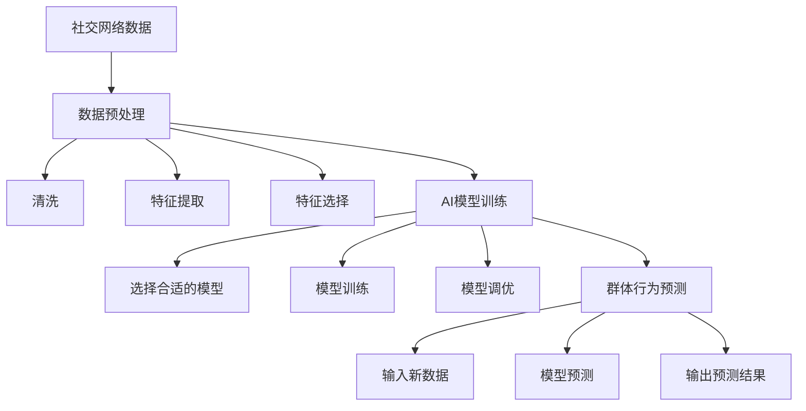

# 提高AI模型在社交网络群体行为预测中的效果

> 关键词：AI模型、社交网络、群体行为预测、模型效果提升、社交数据处理

> 摘要：本文聚焦于如何提高AI模型在社交网络群体行为预测中的效果。首先介绍了研究的背景，包括目的、预期读者、文档结构和相关术语。接着阐述了核心概念，如社交网络和群体行为预测的原理及联系，并给出了对应的文本示意图和Mermaid流程图。详细讲解了核心算法原理，用Python代码展示了具体操作步骤。从数学角度分析了相关模型和公式，并举例说明。通过项目实战，包括开发环境搭建、源代码实现和解读，深入探讨了如何在实际中应用这些技术。还介绍了AI模型在社交网络群体行为预测中的实际应用场景，推荐了相关的学习资源、开发工具框架和论文著作。最后总结了未来发展趋势与挑战，提供了常见问题解答和扩展阅读参考资料。

## 1. 背景介绍 
### 1.1 目的和范围
社交网络已经成为人们生活中不可或缺的一部分，每天产生海量的数据。群体行为预测在社交网络中具有重要意义，例如广告投放、舆情监测、公共安全等领域。本研究的目的是探讨如何提高AI模型在社交网络群体行为预测中的效果，通过分析社交网络数据的特点，优化模型结构和算法，从而更准确地预测群体行为。研究范围涵盖了常见的社交网络平台，如微博、微信、Facebook等，以及多种AI模型，如神经网络、决策树、支持向量机等。

### 1.2 预期读者
本文的预期读者包括从事人工智能、数据挖掘、社交网络分析等领域的研究人员和开发者，也适用于对社交网络群体行为预测感兴趣的相关行业从业者，如市场营销人员、舆情分析师等。

### 1.3 文档结构概述
本文将按照以下结构进行阐述：首先介绍核心概念，明确社交网络和群体行为预测的基本原理和它们之间的联系；然后详细讲解核心算法原理和具体操作步骤，并用Python代码实现；接着分析相关的数学模型和公式，并举例说明；通过项目实战展示如何在实际中应用这些技术；介绍实际应用场景；推荐相关的学习资源、开发工具框架和论文著作；最后总结未来发展趋势与挑战，提供常见问题解答和扩展阅读参考资料。

### 1.4 术语表
#### 1.4.1 核心术语定义
- **社交网络**：是指人与人之间通过互联网建立的各种关系网络，如社交平台上的用户关系、互动记录等。
- **群体行为预测**：根据社交网络中的数据，预测某个群体在未来一段时间内的行为趋势，如购买行为、舆论倾向等。
- **AI模型**：是指利用人工智能技术构建的用于解决特定问题的数学模型，如神经网络模型、决策树模型等。

#### 1.4.2 相关概念解释
- **特征工程**：是指从原始数据中提取和选择对模型有意义的特征的过程，在社交网络群体行为预测中，特征可能包括用户的年龄、性别、好友数量、互动频率等。
- **模型评估**：是指使用特定的指标来衡量模型预测结果的准确性和可靠性，常用的评估指标有准确率、召回率、F1值等。

#### 1.4.3 缩略词列表
- **ML**：Machine Learning，机器学习
- **DL**：Deep Learning，深度学习
- **SVM**：Support Vector Machine，支持向量机
- **CNN**：Convolutional Neural Network，卷积神经网络
- **RNN**：Recurrent Neural Network，循环神经网络

## 2. 核心概念与联系 
### 核心概念原理
#### 社交网络
社交网络是由节点（用户）和边（用户之间的关系）组成的复杂网络。节点代表社交网络中的个体，边表示个体之间的各种关系，如好友关系、关注关系等。社交网络中的数据具有多样性和动态性，包括用户的个人信息、发布的内容、互动记录等。这些数据可以反映用户的兴趣、偏好和行为模式，为群体行为预测提供了丰富的信息。

#### 群体行为预测
群体行为预测是基于社交网络数据，通过分析群体中个体的行为和相互关系，预测整个群体在未来的行为趋势。群体行为受到多种因素的影响，如个体的特征、社交关系、外部环境等。AI模型通过学习这些因素与群体行为之间的关系，实现对群体行为的预测。

### 架构的文本示意图
```plaintext
社交网络数据
|
|-- 数据预处理
|   |-- 清洗
|   |-- 特征提取
|   |-- 特征选择
|
|-- AI模型训练
|   |-- 选择合适的模型
|   |-- 模型训练
|   |-- 模型调优
|
|-- 群体行为预测
|   |-- 输入新数据
|   |-- 模型预测
|   |-- 输出预测结果
```

### Mermaid流程图


## 3. 核心算法原理 & 具体操作步骤 
### 核心算法原理
在社交网络群体行为预测中，常用的AI算法包括机器学习算法和深度学习算法。这里以支持向量机（SVM）和循环神经网络（RNN）为例进行介绍。

#### 支持向量机（SVM）
支持向量机是一种二分类模型，其基本思想是在特征空间中找到一个最优的超平面，使得不同类别的样本能够被最大程度地分开。对于线性可分的数据，SVM可以找到一个线性超平面；对于线性不可分的数据，SVM可以通过核函数将数据映射到高维空间，使其在高维空间中线性可分。

#### 循环神经网络（RNN）
循环神经网络是一种专门处理序列数据的神经网络，它在处理序列数据时能够考虑到数据的先后顺序。RNN通过在网络中引入循环结构，使得网络能够记住之前的输入信息。在社交网络群体行为预测中，RNN可以处理用户的时间序列数据，如用户的发布时间、互动时间等。

### 具体操作步骤及Python代码实现
#### 数据预处理
```python
import pandas as pd
from sklearn.preprocessing import StandardScaler
from sklearn.model_selection import train_test_split

# 读取数据
data = pd.read_csv('social_network_data.csv')

# 分离特征和标签
X = data.drop('label', axis=1)
y = data['label']

# 数据标准化
scaler = StandardScaler()
X_scaled = scaler.fit_transform(X)

# 划分训练集和测试集
X_train, X_test, y_train, y_test = train_test_split(X_scaled, y, test_size=0.2, random_state=42)
```

#### 支持向量机模型训练和预测
```python
from sklearn.svm import SVC
from sklearn.metrics import accuracy_score

# 创建SVM模型
svm_model = SVC()

# 模型训练
svm_model.fit(X_train, y_train)

# 模型预测
y_pred_svm = svm_model.predict(X_test)

# 计算准确率
accuracy_svm = accuracy_score(y_test, y_pred_svm)
print(f"SVM模型准确率: {accuracy_svm}")
```

#### 循环神经网络模型训练和预测
```python
import numpy as np
import tensorflow as tf
from tensorflow.keras.models import Sequential
from tensorflow.keras.layers import SimpleRNN, Dense

# 调整数据形状以适应RNN输入
X_train_rnn = np.reshape(X_train, (X_train.shape[0], X_train.shape[1], 1))
X_test_rnn = np.reshape(X_test, (X_test.shape[0], X_test.shape[1], 1))

# 创建RNN模型
rnn_model = Sequential()
rnn_model.add(SimpleRNN(units=32, input_shape=(X_train_rnn.shape[1], X_train_rnn.shape[2])))
rnn_model.add(Dense(1, activation='sigmoid'))

# 编译模型
rnn_model.compile(optimizer='adam', loss='binary_crossentropy', metrics=['accuracy'])

# 模型训练
rnn_model.fit(X_train_rnn, y_train, epochs=10, batch_size=32)

# 模型预测
y_pred_rnn = rnn_model.predict(X_test_rnn)
y_pred_rnn = (y_pred_rnn > 0.5).astype(int)

# 计算准确率
accuracy_rnn = accuracy_score(y_test, y_pred_rnn)
print(f"RNN模型准确率: {accuracy_rnn}")
```

## 4. 数学模型和公式 & 详细讲解 & 举例说明 
### 支持向量机的数学模型和公式
#### 线性可分情况
对于线性可分的数据，支持向量机的目标是找到一个超平面 $w^T x + b = 0$，使得不同类别的样本能够被最大程度地分开。这个超平面需要满足以下条件：
对于正类样本 $x_i$，有 $w^T x_i + b \geq 1$；
对于负类样本 $x_j$，有 $w^T x_j + b \leq -1$。

同时，为了使超平面具有最大的间隔，需要最小化 $\frac{1}{2} \| w \|^2$，即求解以下优化问题：
$$
\begin{aligned}
\min_{w,b} &\quad \frac{1}{2} \| w \|^2 \\
\text{s.t.} &\quad y_i (w^T x_i + b) \geq 1, \quad i = 1,2,\cdots,n
\end{aligned}
$$
其中，$y_i$ 是样本 $x_i$ 的标签，取值为 $\pm 1$。

#### 线性不可分情况
对于线性不可分的数据，需要引入松弛变量 $\xi_i \geq 0$，允许一些样本违反约束条件。此时的优化问题变为：
$$
\begin{aligned}
\min_{w,b,\xi} &\quad \frac{1}{2} \| w \|^2 + C \sum_{i=1}^{n} \xi_i \\
\text{s.t.} &\quad y_i (w^T x_i + b) \geq 1 - \xi_i, \quad i = 1,2,\cdots,n \\
&\quad \xi_i \geq 0, \quad i = 1,2,\cdots,n
\end{aligned}
$$
其中，$C$ 是惩罚参数，用于控制分类错误和间隔大小之间的平衡。

#### 核函数
为了处理线性不可分的数据，支持向量机引入了核函数 $K(x_i, x_j)$，将数据映射到高维空间。常用的核函数有线性核、多项式核、高斯核等。例如，高斯核函数的定义为：
$$
K(x_i, x_j) = \exp\left(-\frac{\| x_i - x_j \|^2}{2\sigma^2}\right)
$$
其中，$\sigma$ 是核函数的带宽参数。

### 循环神经网络的数学模型和公式
#### 简单循环神经网络（Simple RNN）
简单循环神经网络的核心是循环单元，其数学表达式为：
$$
h_t = \tanh(W_{hh} h_{t-1} + W_{xh} x_t + b_h)
$$
$$
y_t = W_{hy} h_t + b_y
$$
其中，$h_t$ 是时刻 $t$ 的隐藏状态，$x_t$ 是时刻 $t$ 的输入，$y_t$ 是时刻 $t$ 的输出，$W_{hh}$、$W_{xh}$、$W_{hy}$ 是权重矩阵，$b_h$、$b_y$ 是偏置向量。$\tanh$ 是激活函数，用于引入非线性。

### 举例说明
假设我们有一个简单的二维数据集，包含两个类别，我们可以使用支持向量机来进行分类。以下是使用Python的 `sklearn` 库实现的示例代码：
```python
import numpy as np
import matplotlib.pyplot as plt
from sklearn.svm import SVC

# 生成数据集
X = np.array([[3, 4], [1, 2], [4, 5], [2, 1]])
y = np.array([1, -1, 1, -1])

# 创建SVM模型
svm_model = SVC(kernel='linear')

# 模型训练
svm_model.fit(X, y)

# 绘制决策边界
plt.scatter(X[:, 0], X[:, 1], c=y, cmap=plt.cm.Paired)
ax = plt.gca()
xlim = ax.get_xlim()
ylim = ax.get_ylim()

xx = np.linspace(xlim[0], xlim[1], 30)
yy = np.linspace(ylim[0], ylim[1], 30)
YY, XX = np.meshgrid(yy, xx)
xy = np.vstack([XX.ravel(), YY.ravel()]).T
Z = svm_model.decision_function(xy).reshape(XX.shape)

ax.contour(XX, YY, Z, colors='k', levels=[-1, 0, 1], alpha=0.5, linestyles=['--', '-', '--'])
plt.show()
```
在这个例子中，我们使用线性核的支持向量机对二维数据集进行分类，并绘制了决策边界。

## 5. 项目实战：代码实际案例和详细解释说明 
### 5.1  开发环境搭建
#### 安装Python
首先需要安装Python，建议使用Python 3.7及以上版本。可以从Python官方网站（https://www.python.org/downloads/）下载并安装。

#### 安装必要的库
使用以下命令安装项目所需的库：
```sh
pip install pandas numpy scikit-learn tensorflow matplotlib
```

### 5.2  源代码详细实现和代码解读
#### 数据加载和预处理
```python
import pandas as pd
from sklearn.preprocessing import StandardScaler
from sklearn.model_selection import train_test_split

# 读取数据
data = pd.read_csv('social_network_data.csv')

# 分离特征和标签
X = data.drop('label', axis=1)
y = data['label']

# 数据标准化
scaler = StandardScaler()
X_scaled = scaler.fit_transform(X)

# 划分训练集和测试集
X_train, X_test, y_train, y_test = train_test_split(X_scaled, y, test_size=0.2, random_state=42)
```
代码解读：
- 使用 `pandas` 库读取CSV格式的社交网络数据。
- 将特征和标签分离，`X` 表示特征，`y` 表示标签。
- 使用 `StandardScaler` 对特征数据进行标准化处理，使数据具有零均值和单位方差。
- 使用 `train_test_split` 将数据划分为训练集和测试集，测试集占比为20%。

#### 支持向量机模型训练和评估
```python
from sklearn.svm import SVC
from sklearn.metrics import accuracy_score

# 创建SVM模型
svm_model = SVC()

# 模型训练
svm_model.fit(X_train, y_train)

# 模型预测
y_pred_svm = svm_model.predict(X_test)

# 计算准确率
accuracy_svm = accuracy_score(y_test, y_pred_svm)
print(f"SVM模型准确率: {accuracy_svm}")
```
代码解读：
- 使用 `SVC` 类创建支持向量机模型。
- 使用训练集数据对模型进行训练。
- 使用测试集数据进行预测。
- 使用 `accuracy_score` 计算模型的准确率。

#### 循环神经网络模型训练和评估
```python
import numpy as np
import tensorflow as tf
from tensorflow.keras.models import Sequential
from tensorflow.keras.layers import SimpleRNN, Dense

# 调整数据形状以适应RNN输入
X_train_rnn = np.reshape(X_train, (X_train.shape[0], X_train.shape[1], 1))
X_test_rnn = np.reshape(X_test, (X_test.shape[0], X_test.shape[1], 1))

# 创建RNN模型
rnn_model = Sequential()
rnn_model.add(SimpleRNN(units=32, input_shape=(X_train_rnn.shape[1], X_train_rnn.shape[2])))
rnn_model.add(Dense(1, activation='sigmoid'))

# 编译模型
rnn_model.compile(optimizer='adam', loss='binary_crossentropy', metrics=['accuracy'])

# 模型训练
rnn_model.fit(X_train_rnn, y_train, epochs=10, batch_size=32)

# 模型预测
y_pred_rnn = rnn_model.predict(X_test_rnn)
y_pred_rnn = (y_pred_rnn > 0.5).astype(int)

# 计算准确率
accuracy_rnn = accuracy_score(y_test, y_pred_rnn)
print(f"RNN模型准确率: {accuracy_rnn}")
```
代码解读：
- 使用 `np.reshape` 调整数据形状，使其适应RNN的输入要求。
- 使用 `Sequential` 类创建RNN模型，添加一个简单循环层和一个全连接层。
- 使用 `compile` 方法编译模型，指定优化器、损失函数和评估指标。
- 使用 `fit` 方法对模型进行训练，指定训练轮数和批次大小。
- 使用 `predict` 方法进行预测，并将预测结果转换为二进制标签。
- 使用 `accuracy_score` 计算模型的准确率。

### 5.3  代码解读与分析
#### 数据预处理的重要性
数据预处理是提高模型效果的关键步骤。通过数据清洗可以去除噪声数据和缺失值，提高数据的质量；特征提取和选择可以从原始数据中提取有用的信息，减少数据的维度，提高模型的训练效率和预测准确性。

#### 模型选择和调优
不同的模型适用于不同的数据集和问题。在本项目中，支持向量机适用于线性可分或线性近似可分的数据，而循环神经网络适用于处理序列数据。在实际应用中，需要根据数据的特点选择合适的模型，并进行模型调优，如调整模型的参数、选择合适的核函数等。

#### 模型评估
模型评估是衡量模型性能的重要环节。常用的评估指标有准确率、召回率、F1值等。在本项目中，我们使用准确率作为评估指标，它反映了模型预测正确的样本占总样本的比例。但在实际应用中，可能需要根据具体问题选择更合适的评估指标。

## 6. 实际应用场景 
### 广告投放
在社交网络中，通过预测群体的行为和兴趣，可以更精准地投放广告。例如，根据用户的社交关系、互动记录和发布内容，预测某个群体对某种产品或服务的兴趣，然后向该群体投放相关的广告，提高广告的点击率和转化率。

### 舆情监测
社交网络是舆情传播的重要平台，通过预测群体的舆论倾向，可以及时发现潜在的舆情风险。例如，监测某个话题下的群体情绪，预测是否会引发大规模的负面舆情，以便及时采取措施进行引导和处理。

### 公共安全
在社交网络中，一些异常的群体行为可能与公共安全事件相关。通过预测群体的行为趋势，可以提前发现潜在的安全隐患。例如，监测某个地区的社交网络活动，预测是否会发生大规模的集会或冲突，以便相关部门及时做好防范和应对工作。

### 市场营销
了解群体的行为和需求是市场营销的关键。通过预测群体的购买行为和消费偏好，可以制定更有效的市场营销策略。例如，根据群体的购买历史和社交互动，预测某个群体对新产品的接受程度，然后针对性地进行市场推广。

## 7. 工具和资源推荐
### 7.1 学习资源推荐
#### 7.1.1 书籍推荐
- 《Python机器学习》：本书详细介绍了Python在机器学习中的应用，包括数据预处理、模型选择、模型评估等方面的内容，适合初学者入门。
- 《深度学习》：由深度学习领域的三位先驱Ian Goodfellow、Yoshua Bengio和Aaron Courville撰写，全面介绍了深度学习的理论和实践，是深度学习领域的经典著作。
- 《社交网络分析导论》：本书系统地介绍了社交网络分析的基本概念、方法和应用，对于理解社交网络数据和群体行为有很大的帮助。

#### 7.1.2 在线课程
- Coursera上的“机器学习”课程：由斯坦福大学的Andrew Ng教授授课，是机器学习领域的经典课程，涵盖了机器学习的基本概念、算法和应用。
- edX上的“深度学习基础”课程：由微软研究院的课程团队授课，介绍了深度学习的基本原理和实践，包括神经网络、卷积神经网络、循环神经网络等内容。
- 网易云课堂上的“社交网络分析实战”课程：通过实际案例介绍了社交网络分析的方法和工具，帮助学员掌握社交网络数据的处理和分析技巧。

#### 7.1.3 技术博客和网站
- Medium：是一个技术博客平台，上面有很多关于人工智能、机器学习和社交网络分析的优质文章。
- Kaggle：是一个数据科学竞赛平台，上面有很多关于社交网络数据的竞赛和数据集，同时也有很多优秀的数据科学博客和教程。
- 开源中国：是一个国内的开源技术社区，上面有很多关于人工智能和数据挖掘的技术文章和讨论。

### 7.2 开发工具框架推荐
#### 7.2.1 IDE和编辑器
- PyCharm：是一款专门为Python开发设计的集成开发环境，具有代码编辑、调试、版本控制等功能，适合Python项目的开发。
- Jupyter Notebook：是一个交互式的开发环境，支持多种编程语言，尤其适合数据科学和机器学习项目的开发。可以在浏览器中编写和运行代码，方便进行数据探索和模型调试。
- Visual Studio Code：是一款轻量级的代码编辑器，支持多种编程语言和插件扩展，具有丰富的代码编辑和调试功能，适合快速开发和调试代码。

#### 7.2.2 调试和性能分析工具
- TensorBoard：是TensorFlow的可视化工具，可以用于可视化模型的训练过程、损失函数曲线、准确率曲线等，帮助开发者更好地理解模型的性能和训练情况。
- Scikit-learn的交叉验证工具：可以用于评估模型的性能和选择最佳的模型参数，通过交叉验证可以更准确地评估模型的泛化能力。
- PyTorch的Profiler：可以用于分析模型的性能瓶颈，帮助开发者优化模型的训练和推理速度。

#### 7.2.3 相关框架和库
- Scikit-learn：是一个常用的机器学习库，提供了丰富的机器学习算法和工具，包括数据预处理、模型选择、模型评估等功能，适合初学者和快速开发。
- TensorFlow：是一个开源的深度学习框架，由Google开发，具有强大的计算能力和丰富的工具库，支持多种深度学习模型的开发和训练。
- PyTorch：是另一个流行的深度学习框架，由Facebook开发，具有简洁易用的API和动态图机制，适合研究和开发。

### 7.3 相关论文著作推荐
#### 7.3.1 经典论文
- “Support-Vector Networks”：这篇论文是支持向量机的经典论文，详细介绍了支持向量机的原理和算法，是支持向量机领域的奠基之作。
- “Long Short-Term Memory”：这篇论文提出了长短期记忆网络（LSTM），解决了传统循环神经网络的梯度消失和梯度爆炸问题，是循环神经网络领域的重要突破。
- “Social and Economic Networks”：这篇论文从经济学和社会学的角度研究了社交网络的结构和行为，为社交网络分析提供了理论基础。

#### 7.3.2 最新研究成果
- 近年来，关于社交网络群体行为预测的研究不断涌现。可以关注顶级学术会议，如KDD（Knowledge Discovery and Data Mining）、WWW（International World Wide Web Conference）等，上面有很多关于社交网络分析和人工智能的最新研究成果。
- 学术期刊如ACM Transactions on Intelligent Systems and Technology、IEEE Transactions on Knowledge and Data Engineering等也会发表相关的高质量研究论文。

#### 7.3.3 应用案例分析
- 《社交网络分析：方法与应用》：这本书通过实际案例介绍了社交网络分析的方法和应用，包括社交网络的结构分析、群体行为预测、信息传播分析等内容，对实际应用有很大的参考价值。
- 一些知名公司的技术博客，如Google、Facebook等，会分享他们在社交网络分析和人工智能领域的应用案例和经验，也可以从中学习到很多实际应用的技巧和方法。

## 8. 总结：未来发展趋势与挑战
### 未来发展趋势
#### 多模态数据融合
未来的社交网络数据将更加多样化，除了文本、图像和视频等多模态数据将被广泛应用于群体行为预测中。通过融合多模态数据，可以更全面地了解群体的行为和需求，提高预测的准确性。

#### 深度学习模型的优化
随着深度学习技术的不断发展，越来越多的新型深度学习模型将被应用于社交网络群体行为预测中。例如，图神经网络（GNN）可以更好地处理社交网络的图结构数据，提高模型对社交关系的建模能力。

#### 实时预测和动态分析
社交网络数据具有实时性和动态性，未来的预测模型需要具备实时处理和动态分析的能力。例如，实时监测社交网络中的事件和趋势，及时调整预测模型，提高预测的及时性和准确性。

### 挑战
#### 数据隐私和安全
社交网络数据包含大量的用户个人信息，如何在保护用户隐私和安全的前提下进行数据挖掘和分析是一个重要的挑战。需要采用先进的加密技术和隐私保护算法，确保数据的安全性和隐私性。

#### 数据稀疏性和噪声
社交网络数据往往存在稀疏性和噪声问题，这会影响模型的训练和预测效果。需要采用有效的数据预处理方法，如数据填充、特征选择和噪声去除等，提高数据的质量。

#### 模型可解释性
深度学习模型通常是黑盒模型，难以解释其决策过程和结果。在社交网络群体行为预测中，模型的可解释性非常重要，例如在舆情监测和公共安全领域，需要了解模型预测的依据和原因。因此，如何提高模型的可解释性是一个亟待解决的问题。

## 9. 附录：常见问题与解答
### 问题1：如何选择合适的AI模型进行社交网络群体行为预测？
解答：选择合适的AI模型需要考虑多个因素，如数据的特点、问题的类型和模型的性能等。如果数据具有线性可分或线性近似可分的特点，可以选择支持向量机等线性模型；如果数据是序列数据，可以选择循环神经网络等模型；如果数据具有图结构，可以选择图神经网络等模型。同时，还需要进行模型评估和比较，选择性能最优的模型。

### 问题2：数据预处理对模型效果有多大影响？
解答：数据预处理对模型效果有很大的影响。通过数据清洗可以去除噪声数据和缺失值，提高数据的质量；特征提取和选择可以从原始数据中提取有用的信息，减少数据的维度，提高模型的训练效率和预测准确性。如果数据预处理不当，可能会导致模型过拟合或欠拟合，降低模型的性能。

### 问题3：如何提高模型的可解释性？
解答：提高模型的可解释性可以采用以下方法：
- 使用可解释的模型，如决策树、线性回归等，这些模型的决策过程比较容易理解。
- 采用模型解释技术，如特征重要性分析、局部解释等，了解模型的决策依据。
- 结合领域知识和业务经验，对模型的结果进行解释和验证。

## 10. 扩展阅读 & 参考资料
### 扩展阅读
- 《数据挖掘：概念与技术》：本书全面介绍了数据挖掘的基本概念、算法和应用，对于深入理解数据挖掘技术在社交网络群体行为预测中的应用有很大的帮助。
- 《人工智能：一种现代的方法》：这本书是人工智能领域的经典教材，涵盖了人工智能的各个方面，包括机器学习、自然语言处理、计算机视觉等，对于拓宽人工智能的知识面有很大的帮助。

### 参考资料
- Goodfellow, I., Bengio, Y., & Courville, A. (2016). Deep Learning. MIT Press.
- Hastie, T., Tibshirani, R., & Friedman, J. (2009). The Elements of Statistical Learning: Data Mining, Inference, and Prediction. Springer.
- Newman, M. E. J. (2010). Networks: An Introduction. Oxford University Press.

作者：AI天才研究院/AI Genius Institute & 禅与计算机程序设计艺术 /Zen And The Art of Computer Programming