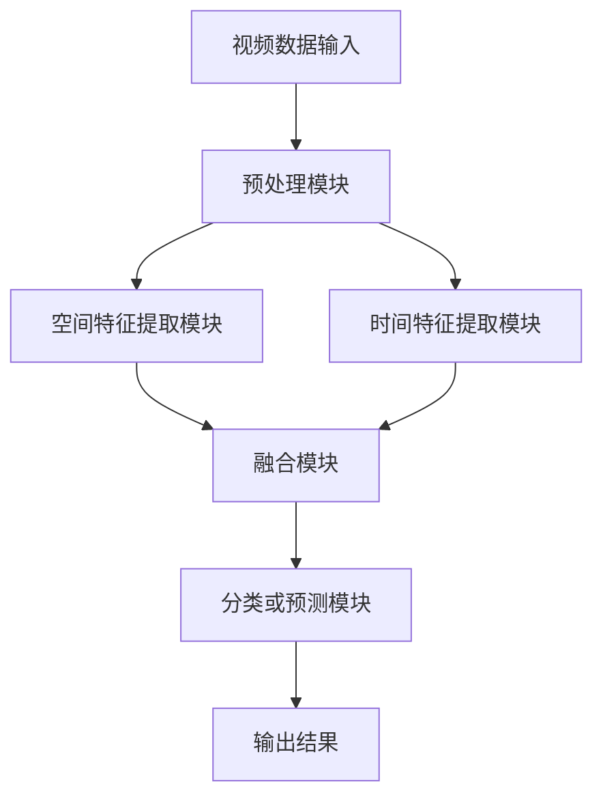

# 提高AI模型在视频内容理解任务中的时空分析能力

> 关键词：AI模型、视频内容理解、时空分析能力、深度学习、计算机视觉

> 摘要：本文聚焦于提高AI模型在视频内容理解任务中的时空分析能力。首先介绍了该研究的背景，包括目的、预期读者、文档结构和相关术语。接着阐述了核心概念与联系，通过文本示意图和Mermaid流程图展示。详细讲解了核心算法原理及具体操作步骤，结合Python源代码进行说明。呈现了相关的数学模型和公式，并举例解释。通过项目实战给出代码实际案例及详细解释。探讨了实际应用场景，推荐了相关工具和资源。最后总结了未来发展趋势与挑战，提供了常见问题解答和扩展阅读参考资料，旨在全面深入地探讨如何提升AI模型在视频内容理解中的时空分析能力。

## 1. 背景介绍 
### 1.1 目的和范围
在当今数字化时代，视频数据呈现出爆炸式增长。从社交媒体上的短视频到监控摄像头的实时视频流，大量的视频内容蕴含着丰富的信息。然而，要从这些海量的视频数据中提取有价值的信息，实现对视频内容的有效理解，是一项极具挑战性的任务。AI模型在视频内容理解中的时空分析能力起着关键作用。时空分析能力能够帮助模型捕捉视频中随时间和空间变化的信息，例如物体的运动轨迹、场景的动态变化等。本文章的目的在于深入探讨如何提高AI模型在视频内容理解任务中的时空分析能力，范围涵盖相关的理论基础、算法原理、实际应用以及未来发展趋势等方面。

### 1.2 预期读者
本文预期读者包括计算机科学、人工智能、计算机视觉等相关领域的研究人员，他们可以从本文中获取最新的研究思路和技术方法，为其科研工作提供参考。对于从事视频处理、智能监控、自动驾驶等行业的工程师，本文提供了实用的技术方案和实践经验，有助于他们在实际项目中提升AI模型的性能。此外，对人工智能和视频技术感兴趣的学生和爱好者也可以通过本文了解相关领域的前沿知识，激发学习和探索的热情。

### 1.3 文档结构概述
本文首先介绍背景信息，包括目的、读者和文档结构等内容。接着阐述核心概念与联系，通过文本示意图和Mermaid流程图直观展示相关概念和架构。详细讲解核心算法原理及具体操作步骤，结合Python代码进行说明。呈现数学模型和公式，并举例解释其应用。通过项目实战给出代码实际案例及详细解释。探讨实际应用场景，推荐相关工具和资源。最后总结未来发展趋势与挑战，提供常见问题解答和扩展阅读参考资料。

### 1.4 术语表
#### 1.4.1 核心术语定义
- **AI模型**：即人工智能模型，是一种基于数据和算法构建的计算模型，能够模拟人类的智能行为，如学习、推理、决策等。
- **视频内容理解**：指的是让计算机能够像人类一样理解视频中所包含的语义信息，包括物体识别、行为分析、场景理解等。
- **时空分析能力**：是指AI模型在处理视频数据时，能够同时分析视频中空间和时间维度的信息，捕捉物体的运动和场景的变化。
- **深度学习**：是一种基于人工神经网络的机器学习方法，通过构建多层神经网络来学习数据的特征和模式。
- **计算机视觉**：是一门研究如何使计算机“看”的科学，即通过图像处理和分析技术，让计算机理解图像和视频中的内容。

#### 1.4.2 相关概念解释
- **空间信息**：指视频帧中物体的位置、形状、大小等特征，这些信息可以帮助模型识别物体和理解场景的布局。
- **时间信息**：指视频中随时间变化的信息，如物体的运动、场景的变化等，时间信息对于理解视频的动态过程至关重要。
- **特征提取**：是指从视频数据中提取出能够代表视频内容的特征，这些特征可以用于后续的分类、识别等任务。
- **模型训练**：是指通过大量的视频数据对AI模型进行训练，调整模型的参数，使其能够更好地完成视频内容理解任务。

#### 1.4.3 缩略词列表
- **CNN**：卷积神经网络（Convolutional Neural Network），是一种常用于图像和视频处理的深度学习模型。
- **RNN**：循环神经网络（Recurrent Neural Network），是一种能够处理序列数据的神经网络，常用于处理视频中的时间信息。
- **LSTM**：长短期记忆网络（Long Short-Term Memory），是一种特殊的RNN，能够更好地处理长序列数据中的长期依赖关系。
- **3D CNN**：三维卷积神经网络（3D Convolutional Neural Network），是在CNN的基础上扩展到三维空间，能够同时处理视频的空间和时间信息。

## 2. 核心概念与联系 
### 核心概念原理
在视频内容理解任务中，空间分析和时间分析是两个关键的方面。空间分析主要关注视频帧中物体的空间特征，例如物体的形状、位置、颜色等。通过对这些空间特征的提取和分析，AI模型可以识别出视频中的物体和场景。时间分析则关注视频中随时间变化的信息，例如物体的运动轨迹、动作的持续时间等。时间分析可以帮助模型理解视频的动态过程，例如人物的行为动作、事件的发展顺序等。

时空分析能力就是将空间分析和时间分析相结合，综合考虑视频中的空间和时间信息。例如，在一个监控视频中，空间分析可以识别出画面中的人物和物体，而时间分析可以跟踪人物的运动轨迹，判断人物是否有异常行为。通过时空分析，AI模型可以更全面、准确地理解视频内容。

### 架构的文本示意图
我们可以将视频内容理解的时空分析架构分为以下几个主要部分：

- **数据输入**：原始的视频数据作为输入，通常以视频文件的形式存在。
- **预处理模块**：对输入的视频数据进行预处理，包括视频解码、帧提取、图像缩放、归一化等操作，将视频数据转换为适合模型处理的格式。
- **空间特征提取模块**：使用CNN等模型对视频帧进行处理，提取空间特征。CNN通过卷积层、池化层等操作，能够自动学习图像的特征表示。
- **时间特征提取模块**：使用RNN、LSTM或3D CNN等模型对空间特征进行处理，提取时间特征。这些模型能够处理序列数据，捕捉视频中的时间信息。
- **融合模块**：将空间特征和时间特征进行融合，得到综合的时空特征。融合的方法可以是简单的拼接，也可以是更复杂的加权融合。
- **分类或预测模块**：使用全连接层等对融合后的时空特征进行处理，完成分类、识别、预测等任务，例如判断视频中人物的行为类别、预测事件的发展趋势等。

### Mermaid流程图


## 3. 核心算法原理 & 具体操作步骤 
### 核心算法原理
在提高AI模型在视频内容理解任务中的时空分析能力方面，常用的算法包括CNN、RNN、LSTM和3D CNN等。

#### CNN（卷积神经网络）
CNN是一种专门用于处理具有网格结构数据的神经网络，如图像和视频帧。CNN的核心是卷积层，卷积层通过卷积核在输入数据上滑动，进行卷积操作，提取数据的局部特征。例如，对于一个图像，卷积核可以提取图像中的边缘、纹理等特征。

以下是一个简单的Python代码示例，使用PyTorch实现一个简单的CNN：
```python
import torch
import torch.nn as nn

class SimpleCNN(nn.Module):
    def __init__(self):
        super(SimpleCNN, self).__init__()
        self.conv1 = nn.Conv2d(3, 16, kernel_size=3, padding=1)
        self.relu1 = nn.ReLU()
        self.pool1 = nn.MaxPool2d(kernel_size=2, stride=2)
        self.conv2 = nn.Conv2d(16, 32, kernel_size=3, padding=1)
        self.relu2 = nn.ReLU()
        self.pool2 = nn.MaxPool2d(kernel_size=2, stride=2)
        self.fc1 = nn.Linear(32 * 8 * 8, 128)
        self.relu3 = nn.ReLU()
        self.fc2 = nn.Linear(128, 10)

    def forward(self, x):
        x = self.pool1(self.relu1(self.conv1(x)))
        x = self.pool2(self.relu2(self.conv2(x)))
        x = x.view(-1, 32 * 8 * 8)
        x = self.relu3(self.fc1(x))
        x = self.fc2(x)
        return x
```

#### RNN（循环神经网络）
RNN是一种能够处理序列数据的神经网络，它通过在网络中引入循环结构，使得网络能够利用之前的信息来处理当前的输入。在视频内容理解中，RNN可以用于处理视频帧的序列，捕捉视频中的时间信息。

以下是一个简单的Python代码示例，使用PyTorch实现一个简单的RNN：
```python
import torch
import torch.nn as nn

class SimpleRNN(nn.Module):
    def __init__(self, input_size, hidden_size, output_size):
        super(SimpleRNN, self).__init__()
        self.hidden_size = hidden_size
        self.rnn = nn.RNN(input_size, hidden_size, batch_first=True)
        self.fc = nn.Linear(hidden_size, output_size)

    def forward(self, x):
        h0 = torch.zeros(1, x.size(0), self.hidden_size).to(x.device)
        out, _ = self.rnn(x, h0)
        out = self.fc(out[:, -1, :])
        return out
```

#### LSTM（长短期记忆网络）
LSTM是一种特殊的RNN，它通过引入门控机制，能够更好地处理长序列数据中的长期依赖关系。在视频内容理解中，LSTM可以更有效地捕捉视频中的时间信息。

以下是一个简单的Python代码示例，使用PyTorch实现一个简单的LSTM：
```python
import torch
import torch.nn as nn

class SimpleLSTM(nn.Module):
    def __init__(self, input_size, hidden_size, output_size):
        super(SimpleLSTM, self).__init__()
        self.hidden_size = hidden_size
        self.lstm = nn.LSTM(input_size, hidden_size, batch_first=True)
        self.fc = nn.Linear(hidden_size, output_size)

    def forward(self, x):
        h0 = torch.zeros(1, x.size(0), self.hidden_size).to(x.device)
        c0 = torch.zeros(1, x.size(0), self.hidden_size).to(x.device)
        out, _ = self.lstm(x, (h0, c0))
        out = self.fc(out[:, -1, :])
        return out
```

#### 3D CNN（三维卷积神经网络）
3D CNN是在CNN的基础上扩展到三维空间，它不仅可以处理图像的空间信息，还可以处理视频的时间信息。3D CNN通过三维卷积核在视频数据上滑动，同时提取空间和时间特征。

以下是一个简单的Python代码示例，使用PyTorch实现一个简单的3D CNN：
```python
import torch
import torch.nn as nn

class Simple3DCNN(nn.Module):
    def __init__(self):
        super(Simple3DCNN, self).__init__()
        self.conv1 = nn.Conv3d(3, 16, kernel_size=(3, 3, 3), padding=(1, 1, 1))
        self.relu1 = nn.ReLU()
        self.pool1 = nn.MaxPool3d(kernel_size=(1, 2, 2), stride=(1, 2, 2))
        self.conv2 = nn.Conv3d(16, 32, kernel_size=(3, 3, 3), padding=(1, 1, 1))
        self.relu2 = nn.ReLU()
        self.pool2 = nn.MaxPool3d(kernel_size=(1, 2, 2), stride=(1, 2, 2))
        self.fc1 = nn.Linear(32 * 8 * 8 * 10, 128)
        self.relu3 = nn.ReLU()
        self.fc2 = nn.Linear(128, 10)

    def forward(self, x):
        x = self.pool1(self.relu1(self.conv1(x)))
        x = self.pool2(self.relu2(self.conv2(x)))
        x = x.view(-1, 32 * 8 * 8 * 10)
        x = self.relu3(self.fc1(x))
        x = self.fc2(x)
        return x
```

### 具体操作步骤
1. **数据准备**：收集和整理视频数据，对视频数据进行标注，例如标注视频中的物体类别、行为动作等。将视频数据划分为训练集、验证集和测试集。
2. **模型选择**：根据任务的需求和数据的特点，选择合适的模型，如CNN、RNN、LSTM或3D CNN等。
3. **模型训练**：使用训练集对模型进行训练，调整模型的参数，使模型能够更好地拟合数据。在训练过程中，可以使用验证集来评估模型的性能，防止过拟合。
4. **模型评估**：使用测试集对训练好的模型进行评估，计算模型的准确率、召回率、F1值等指标，评估模型的性能。
5. **模型优化**：根据评估结果，对模型进行优化，例如调整模型的结构、超参数等，提高模型的性能。

## 4. 数学模型和公式 & 详细讲解 & 举例说明 
### 卷积操作的数学模型
在CNN中，卷积操作是核心操作之一。假设输入的特征图为 $X \in \mathbb{R}^{H \times W \times C}$，其中 $H$ 是高度，$W$ 是宽度，$C$ 是通道数。卷积核为 $K \in \mathbb{R}^{k_h \times k_w \times C \times N}$，其中 $k_h$ 和 $k_w$ 是卷积核的高度和宽度，$N$ 是卷积核的数量。

卷积操作的输出特征图 $Y \in \mathbb{R}^{H' \times W' \times N}$ 可以通过以下公式计算：

$$
Y_{i,j,n} = \sum_{c=0}^{C-1} \sum_{p=0}^{k_h-1} \sum_{q=0}^{k_w-1} X_{i+p,j+q,c} \cdot K_{p,q,c,n} + b_n
$$

其中，$i = 0,1,\cdots,H'-1$，$j = 0,1,\cdots,W'-1$，$n = 0,1,\cdots,N-1$，$b_n$ 是偏置项。

### 举例说明
假设输入的特征图 $X$ 是一个 $3 \times 3$ 的单通道图像，卷积核 $K$ 是一个 $2 \times 2$ 的卷积核，如下所示：

$$
X = \begin{bmatrix}
1 & 2 & 3 \\
4 & 5 & 6 \\
7 & 8 & 9
\end{bmatrix}
$$

$$
K = \begin{bmatrix}
1 & 2 \\
3 & 4
\end{bmatrix}
$$

假设步长为 1，无填充。则卷积操作的输出特征图 $Y$ 可以计算如下：

$$
Y_{0,0} = 1 \times 1 + 2 \times 2 + 4 \times 3 + 5 \times 4 = 37
$$

$$
Y_{0,1} = 2 \times 1 + 3 \times 2 + 5 \times 3 + 6 \times 4 = 47
$$

$$
Y_{1,0} = 4 \times 1 + 5 \times 2 + 7 \times 3 + 8 \times 4 = 67
$$

$$
Y_{1,1} = 5 \times 1 + 6 \times 2 + 8 \times 3 + 9 \times 4 = 77
$$

所以，输出特征图 $Y$ 为：

$$
Y = \begin{bmatrix}
37 & 47 \\
67 & 77
\end{bmatrix}
$$

### RNN的数学模型
RNN的核心是隐藏状态的更新。假设输入序列为 $\mathbf{x}_t \in \mathbb{R}^{d_x}$，隐藏状态为 $\mathbf{h}_t \in \mathbb{R}^{d_h}$，输出为 $\mathbf{y}_t \in \mathbb{R}^{d_y}$。RNN的更新公式如下：

$$
\mathbf{h}_t = \tanh(\mathbf{W}_{hh} \mathbf{h}_{t-1} + \mathbf{W}_{xh} \mathbf{x}_t + \mathbf{b}_h)
$$

$$
\mathbf{y}_t = \mathbf{W}_{hy} \mathbf{h}_t + \mathbf{b}_y
$$

其中，$\mathbf{W}_{hh} \in \mathbb{R}^{d_h \times d_h}$，$\mathbf{W}_{xh} \in \mathbb{R}^{d_h \times d_x}$，$\mathbf{W}_{hy} \in \mathbb{R}^{d_y \times d_h}$ 是权重矩阵，$\mathbf{b}_h \in \mathbb{R}^{d_h}$，$\mathbf{b}_y \in \mathbb{R}^{d_y}$ 是偏置向量。

### LSTM的数学模型
LSTM通过引入门控机制来解决RNN中的长期依赖问题。LSTM的核心包括输入门 $i_t$、遗忘门 $f_t$、输出门 $o_t$ 和细胞状态 $c_t$。

输入门：

$$
i_t = \sigma(\mathbf{W}_{xi} \mathbf{x}_t + \mathbf{W}_{hi} \mathbf{h}_{t-1} + \mathbf{b}_i)
$$

遗忘门：

$$
f_t = \sigma(\mathbf{W}_{xf} \mathbf{x}_t + \mathbf{W}_{hf} \mathbf{h}_{t-1} + \mathbf{b}_f)
$$

细胞状态更新：

$$
\tilde{c}_t = \tanh(\mathbf{W}_{xc} \mathbf{x}_t + \mathbf{W}_{hc} \mathbf{h}_{t-1} + \mathbf{b}_c)
$$

$$
c_t = f_t \odot c_{t-1} + i_t \odot \tilde{c}_t
$$

输出门：

$$
o_t = \sigma(\mathbf{W}_{xo} \mathbf{x}_t + \mathbf{W}_{ho} \mathbf{h}_{t-1} + \mathbf{b}_o)
$$

隐藏状态更新：

$$
\mathbf{h}_t = o_t \odot \tanh(c_t)
$$

其中，$\sigma$ 是 sigmoid 函数，$\odot$ 是逐元素相乘。

### 3D CNN的数学模型
3D CNN的卷积操作与2D CNN类似，只是卷积核扩展到了三维空间。假设输入的视频数据为 $X \in \mathbb{R}^{T \times H \times W \times C}$，其中 $T$ 是时间维度。卷积核为 $K \in \mathbb{R}^{k_t \times k_h \times k_w \times C \times N}$，其中 $k_t$ 是时间维度的卷积核大小。

卷积操作的输出特征图 $Y \in \mathbb{R}^{T' \times H' \times W' \times N}$ 可以通过类似2D CNN的卷积公式计算，只是需要在时间维度上进行扩展。

## 5. 项目实战：代码实际案例和详细解释说明 
### 5.1  开发环境搭建
在进行项目实战之前，需要搭建好开发环境。以下是具体的步骤：

1. **安装Python**：推荐使用Python 3.7及以上版本。可以从Python官方网站（https://www.python.org/downloads/） 下载并安装。
2. **安装深度学习框架**：本文使用PyTorch作为深度学习框架。可以根据自己的CUDA版本和操作系统，从PyTorch官方网站（https://pytorch.org/get-started/locally/） 选择合适的安装命令进行安装。例如，对于使用CUDA 11.1的Linux系统，可以使用以下命令安装：
```bash
pip install torch torchvision torchaudio --extra-index-url https://download.pytorch.org/whl/cu111
```
3. **安装其他依赖库**：还需要安装一些其他的依赖库，如OpenCV、NumPy等。可以使用以下命令进行安装：
```bash
pip install opencv-python numpy
```

### 5.2  源代码详细实现和代码解读
以下是一个使用3D CNN进行视频分类的完整代码示例：

```python
import torch
import torch.nn as nn
import torch.optim as optim
from torch.utils.data import Dataset, DataLoader
import cv2
import numpy as np
import os

# 定义视频数据集类
class VideoDataset(Dataset):
    def __init__(self, video_dir, label_file):
        self.video_dir = video_dir
        self.labels = {}
        with open(label_file, 'r') as f:
            for line in f:
                video_name, label = line.strip().split()
                self.labels[video_name] = int(label)
        self.video_names = list(self.labels.keys())

    def __len__(self):
        return len(self.video_names)

    def __getitem__(self, idx):
        video_name = self.video_names[idx]
        video_path = os.path.join(self.video_dir, video_name)
        cap = cv2.VideoCapture(video_path)
        frames = []
        while cap.isOpened():
            ret, frame = cap.read()
            if not ret:
                break
            frame = cv2.resize(frame, (112, 112))
            frame = frame.transpose(2, 0, 1)
            frames.append(frame)
        cap.release()
        frames = np.array(frames)
        frames = frames[:16]  # 取前16帧
        frames = np.pad(frames, ((0, 16 - frames.shape[0]), (0, 0), (0, 0), (0, 0)), mode='constant')
        frames = torch.from_numpy(frames).float() / 255.0
        label = self.labels[video_name]
        return frames, label

# 定义3D CNN模型
class Simple3DCNN(nn.Module):
    def __init__(self, num_classes):
        super(Simple3DCNN, self).__init__()
        self.conv1 = nn.Conv3d(3, 16, kernel_size=(3, 3, 3), padding=(1, 1, 1))
        self.relu1 = nn.ReLU()
        self.pool1 = nn.MaxPool3d(kernel_size=(1, 2, 2), stride=(1, 2, 2))
        self.conv2 = nn.Conv3d(16, 32, kernel_size=(3, 3, 3), padding=(1, 1, 1))
        self.relu2 = nn.ReLU()
        self.pool2 = nn.MaxPool3d(kernel_size=(1, 2, 2), stride=(1, 2, 2))
        self.fc1 = nn.Linear(32 * 28 * 28 * 16, 128)
        self.relu3 = nn.ReLU()
        self.fc2 = nn.Linear(128, num_classes)

    def forward(self, x):
        x = self.pool1(self.relu1(self.conv1(x)))
        x = self.pool2(self.relu2(self.conv2(x)))
        x = x.view(-1, 32 * 28 * 28 * 16)
        x = self.relu3(self.fc1(x))
        x = self.fc2(x)
        return x

# 训练模型
def train_model(model, dataloader, criterion, optimizer, device, num_epochs=10):
    model.train()
    for epoch in range(num_epochs):
        running_loss = 0.0
        for i, (frames, labels) in enumerate(dataloader):
            frames = frames.to(device)
            labels = labels.to(device)

            optimizer.zero_grad()
            outputs = model(frames)
            loss = criterion(outputs, labels)
            loss.backward()
            optimizer.step()

            running_loss += loss.item()

        print(f'Epoch {epoch + 1}/{num_epochs}, Loss: {running_loss / len(dataloader)}')

# 主函数
if __name__ == '__main__':
    video_dir = 'path/to/video/dir'
    label_file = 'path/to/label/file'
    num_classes = 10
    batch_size = 4
    learning_rate = 0.001
    num_epochs = 10

    device = torch.device('cuda' if torch.cuda.is_available() else 'cpu')

    dataset = VideoDataset(video_dir, label_file)
    dataloader = DataLoader(dataset, batch_size=batch_size, shuffle=True)

    model = Simple3DCNN(num_classes).to(device)
    criterion = nn.CrossEntropyLoss()
    optimizer = optim.Adam(model.parameters(), lr=learning_rate)

    train_model(model, dataloader, criterion, optimizer, device, num_epochs)
```

### 5.3  代码解读与分析
1. **VideoDataset类**：这个类用于加载视频数据。`__init__` 方法读取视频文件路径和对应的标签文件，`__len__` 方法返回数据集的大小，`__getitem__` 方法根据索引获取视频帧和对应的标签。在 `__getitem__` 方法中，使用OpenCV读取视频帧，对帧进行缩放和归一化处理，取前16帧作为输入。
2. **Simple3DCNN类**：这个类定义了一个简单的3D CNN模型。模型包含两个卷积层、两个池化层和两个全连接层。卷积层使用3D卷积核，池化层在空间维度上进行下采样。
3. **train_model函数**：这个函数用于训练模型。在每个epoch中，遍历数据加载器，将视频帧和标签输入到模型中，计算损失，进行反向传播和参数更新。
4. **主函数**：在主函数中，首先定义了视频数据路径、标签文件路径、类别数、批量大小、学习率和训练轮数等参数。然后创建数据集和数据加载器，初始化模型、损失函数和优化器，最后调用 `train_model` 函数进行训练。

## 6. 实际应用场景 
### 智能监控
在智能监控领域，提高AI模型的时空分析能力可以帮助监控系统更好地理解视频内容。例如，通过时空分析可以实时跟踪人员的运动轨迹，检测异常行为，如盗窃、打架等。在大型商场、银行等场所，智能监控系统可以及时发现安全隐患，保障人员和财产的安全。

### 自动驾驶
在自动驾驶中，AI模型需要对车载摄像头采集的视频数据进行实时处理和理解。时空分析能力可以帮助模型识别道路、交通标志、其他车辆和行人等，预测它们的运动轨迹，从而做出合理的驾驶决策。例如，当检测到前方车辆突然减速时，自动驾驶系统可以及时做出制动反应，避免碰撞事故的发生。

### 视频内容推荐
在视频内容推荐系统中，通过分析用户观看视频的时空信息，可以更好地了解用户的兴趣和偏好。例如，分析用户观看视频的时间、地点、观看时长等信息，结合视频的内容特征，为用户推荐更符合其兴趣的视频。这样可以提高用户的观看体验，增加用户的粘性。

### 体育赛事分析
在体育赛事分析中，时空分析能力可以帮助教练和运动员更好地了解比赛情况。例如，通过分析球员的运动轨迹、传球路线、射门时机等信息，可以评估球员的表现，制定更有效的战术策略。同时，也可以为观众提供更丰富的赛事信息和分析，提高观众的观赛体验。

## 7. 工具和资源推荐
### 7.1 学习资源推荐
#### 7.1.1 书籍推荐
- 《深度学习》（Deep Learning）：由Ian Goodfellow、Yoshua Bengio和Aaron Courville合著，是深度学习领域的经典教材，涵盖了深度学习的基本原理、算法和应用。
- 《计算机视觉：算法与应用》（Computer Vision: Algorithms and Applications）：由Richard Szeliski编写，全面介绍了计算机视觉的各种算法和应用，包括图像和视频处理、特征提取、目标检测等。
- 《动手学深度学习》（Dive into Deep Learning）：由李沐等编写，提供了丰富的深度学习实践案例和代码，适合初学者快速上手。

#### 7.1.2 在线课程
- Coursera上的“深度学习专项课程”（Deep Learning Specialization）：由Andrew Ng教授讲授，包括五门课程，系统地介绍了深度学习的各个方面。
- edX上的“计算机视觉基础”（Foundations of Computer Vision）：由UC Berkeley的教授讲授，介绍了计算机视觉的基本概念和算法。
- B站的“沐神的深度学习课”：由李沐主讲，以生动易懂的方式讲解深度学习的知识和实践。

#### 7.1.3 技术博客和网站
- arXiv：是一个预印本平台，提供了大量的计算机科学、人工智能等领域的最新研究论文。
- Medium：有许多关于人工智能和深度学习的技术博客，其中包含了很多优秀的文章和教程。
- AI研习社：专注于人工智能领域的知识分享和交流，提供了丰富的技术文章、案例和资源。

### 7.2 开发工具框架推荐
#### 7.2.1 IDE和编辑器
- PyCharm：是一款专门为Python开发设计的集成开发环境，提供了丰富的代码编辑、调试和版本控制等功能。
- Visual Studio Code：是一款轻量级的代码编辑器，支持多种编程语言，有丰富的插件可以扩展功能。
- Jupyter Notebook：是一个交互式的编程环境，适合进行数据探索、模型训练和实验记录。

#### 7.2.2 调试和性能分析工具
- PyTorch Profiler：是PyTorch提供的性能分析工具，可以帮助开发者分析模型的性能瓶颈，优化代码。
- TensorBoard：是TensorFlow提供的可视化工具，也可以与PyTorch结合使用，用于可视化模型的训练过程和性能指标。
- NVIDIA Nsight Systems：是NVIDIA提供的性能分析工具，专门用于分析GPU加速的应用程序的性能。

#### 7.2.3 相关框架和库
- PyTorch：是一个开源的深度学习框架，提供了丰富的神经网络模块和优化算法，易于使用和扩展。
- TensorFlow：是另一个广泛使用的深度学习框架，具有强大的分布式训练和部署能力。
- OpenCV：是一个开源的计算机视觉库，提供了各种图像处理和分析的算法和工具。

### 7.3 相关论文著作推荐
#### 7.3.1 经典论文
- “ImageNet Classification with Deep Convolutional Neural Networks”：AlexNet的论文，开创了深度学习在图像分类领域的先河。
- “Long Short-Term Memory”：LSTM的原始论文，介绍了LSTM的原理和应用。
- “Going Deeper with Convolutions”：GoogLeNet的论文，提出了Inception模块，提高了卷积神经网络的性能。

#### 7.3.2 最新研究成果
- 关注顶级学术会议如CVPR、ICCV、ECCV等的最新论文，这些会议涵盖了计算机视觉领域的最新研究成果。
- 关注顶级期刊如TPAMI、IJCV等的最新文章，这些期刊发表了计算机视觉领域的高质量研究论文。

#### 7.3.3 应用案例分析
- 一些开源项目的文档和博客文章中会有详细的应用案例分析，例如GitHub上的一些视频理解相关的项目。
- 企业的技术博客也会分享一些实际应用案例，如百度、谷歌等公司的AI技术博客。

## 8. 总结：未来发展趋势与挑战
### 未来发展趋势
- **多模态融合**：未来的AI模型将不仅仅依赖于视频数据，还会融合音频、文本等多模态信息，以更全面地理解视频内容。例如，在视频理解中结合音频的语音信息和文本的字幕信息，可以提高对视频语义的理解。
- **端到端学习**：端到端的学习方法将越来越受到关注，通过直接从原始视频数据到最终任务的输出，避免了中间特征提取和处理的复杂过程，提高了模型的效率和性能。
- **强化学习的应用**：强化学习可以在视频内容理解中发挥重要作用，通过智能体与视频环境的交互，学习到最优的行为策略，例如在视频监控中实现智能的巡逻和决策。
- **可解释性增强**：随着AI模型的复杂性增加，模型的可解释性变得越来越重要。未来的研究将致力于提高AI模型在视频内容理解中的可解释性，让用户更好地理解模型的决策过程。

### 挑战
- **数据不足**：高质量的视频数据标注成本高、难度大，导致可用的标注数据有限。这限制了AI模型的训练效果，需要研究更有效的数据增强和半监督学习方法。
- **计算资源需求大**：提高AI模型的时空分析能力通常需要更复杂的模型结构和大量的计算资源。在实际应用中，如何在有限的计算资源下实现高效的模型训练和推理是一个挑战。
- **场景适应性**：不同的视频场景具有不同的特点和复杂性，例如光照变化、遮挡、运动模糊等。AI模型需要具备更强的场景适应性，能够在各种复杂场景下准确地理解视频内容。
- **伦理和隐私问题**：在视频内容理解中，涉及到大量的个人隐私信息。如何在保护用户隐私的前提下，实现有效的视频内容理解是一个需要解决的伦理和法律问题。

## 9. 附录：常见问题与解答
### 问题1：如何选择合适的AI模型来提高视频内容理解的时空分析能力？
解答：选择合适的模型需要考虑多个因素，如任务的需求、数据的特点、计算资源等。如果视频数据的时间信息比较重要，可以选择RNN、LSTM或3D CNN等模型；如果更注重空间特征，可以选择CNN模型。同时，也可以尝试不同模型的组合，如CNN + RNN，以充分利用空间和时间信息。

### 问题2：在训练AI模型时，如何处理视频数据的长序列问题？
解答：可以采用以下方法处理视频数据的长序列问题：
- **截断序列**：将长视频序列截断为较短的子序列进行处理。
- **使用LSTM或GRU**：这些模型能够更好地处理长序列数据中的长期依赖关系。
- **分层处理**：采用分层的结构，先对视频进行粗粒度的处理，再对感兴趣的部分进行细粒度的处理。

### 问题3：如何评估AI模型在视频内容理解任务中的时空分析能力？
解答：可以使用以下指标来评估模型的时空分析能力：
- **准确率**：预测结果与真实标签的匹配程度。
- **召回率**：模型正确预测出的正样本占所有正样本的比例。
- **F1值**：综合考虑准确率和召回率的指标。
- **平均精度均值（mAP）**：在目标检测和行为识别等任务中常用的评估指标。

### 问题4：如何优化AI模型的性能，提高时空分析能力？
解答：可以从以下几个方面优化模型的性能：
- **数据增强**：通过对视频数据进行随机裁剪、旋转、翻转等操作，增加数据的多样性。
- **模型结构优化**：调整模型的层数、卷积核大小、隐藏单元数量等参数，优化模型的结构。
- **超参数调整**：调整学习率、批量大小、训练轮数等超参数，找到最优的训练配置。
- **使用预训练模型**：利用在大规模数据集上预训练的模型，初始化模型的参数，加快模型的收敛速度。

## 10. 扩展阅读 & 参考资料
- Goodfellow, I., Bengio, Y., & Courville, A. (2016). Deep Learning. MIT Press.
- Szeliski, R. (2010). Computer Vision: Algorithms and Applications. Springer.
- Li, M., Zhang, A., Li, Z., & Smola, A. J. (2020). Dive into Deep Learning.
- Krizhevsky, A., Sutskever, I., & Hinton, G. E. (2012). ImageNet Classification with Deep Convolutional Neural Networks. Advances in Neural Information Processing Systems.
- Hochreiter, S., & Schmidhuber, J. (1997). Long Short-Term Memory. Neural Computation.
- Szegedy, C., Liu, W., Jia, Y., Sermanet, P., Reed, S., Anguelov, D., ... & Rabinovich, A. (2015). Going Deeper with Convolutions. Proceedings of the IEEE conference on computer vision and pattern recognition.

作者：AI天才研究院/AI Genius Institute & 禅与计算机程序设计艺术 /Zen And The Art of Computer Programming