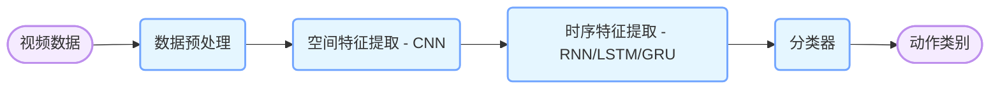

# 提高AI模型在视频动作识别任务中的准确性

> 关键词：AI模型、视频动作识别、准确性提升、深度学习、特征提取

> 摘要：本文聚焦于如何提高AI模型在视频动作识别任务中的准确性。首先介绍了视频动作识别的背景信息，包括目的、预期读者等。接着阐述了核心概念及联系，通过示意图和流程图进行说明。详细讲解了核心算法原理和具体操作步骤，并结合Python代码进行分析。深入探讨了相关数学模型和公式，给出了具体示例。通过项目实战展示代码实现和解读。列举了实际应用场景，推荐了学习资源、开发工具框架和相关论文著作。最后总结了未来发展趋势与挑战，并提供常见问题解答和扩展阅读参考资料，旨在为研究者和开发者提供全面的技术指导。

## 1. 背景介绍 
### 1.1 目的和范围
视频动作识别在众多领域有着广泛的应用，如智能监控、体育分析、人机交互等。提高AI模型在该任务中的准确性，能够提升系统的性能和可靠性，为各行业带来更精准的决策支持。本文的范围涵盖了从基础概念到实际应用的多个方面，旨在全面探讨提高准确性的方法和策略。

### 1.2 预期读者
本文预期读者包括计算机科学、人工智能领域的研究者、开发者，以及对视频动作识别技术感兴趣的相关人员。无论是初学者还是有一定经验的专业人士，都能从本文中获取有价值的信息。

### 1.3 文档结构概述
本文将按照以下结构展开：首先介绍核心概念与联系，让读者对视频动作识别有一个清晰的认识；接着阐述核心算法原理和具体操作步骤，结合Python代码进行详细说明；然后介绍相关数学模型和公式，并举例说明；通过项目实战展示代码的实际应用和解读；列举实际应用场景；推荐学习资源、开发工具框架和相关论文著作；最后总结未来发展趋势与挑战，提供常见问题解答和扩展阅读参考资料。

### 1.4 术语表
#### 1.4.1 核心术语定义
- **视频动作识别**：指通过计算机技术对视频中的人体动作进行分类和识别的过程。
- **AI模型**：基于人工智能技术构建的用于解决特定问题的模型，如卷积神经网络（CNN）、循环神经网络（RNN）等。
- **特征提取**：从原始视频数据中提取出具有代表性的特征，以便后续的分类和识别。
- **准确性**：模型预测结果与真实结果的相符程度，通常用准确率、召回率等指标来衡量。

#### 1.4.2 相关概念解释
- **深度学习**：一种基于人工神经网络的机器学习方法，通过多层神经网络自动学习数据的特征和模式。
- **卷积神经网络（CNN）**：一种专门用于处理具有网格结构数据（如图像、视频）的深度学习模型，能够自动提取数据的空间特征。
- **循环神经网络（RNN）**：一种能够处理序列数据的深度学习模型，适用于处理视频中的时序信息。

#### 1.4.3 缩略词列表
- **CNN**：Convolutional Neural Network（卷积神经网络）
- **RNN**：Recurrent Neural Network（循环神经网络）
- **LSTM**：Long Short-Term Memory（长短期记忆网络）
- **GRU**：Gated Recurrent Unit（门控循环单元）

## 2. 核心概念与联系 

### 核心概念原理
视频动作识别的核心在于从视频序列中提取有效的特征，并根据这些特征对动作进行分类。一般来说，视频数据包含空间信息和时序信息。空间信息反映了视频中每一帧的图像特征，而时序信息则体现了动作在时间上的变化。

#### 空间特征提取
通常使用卷积神经网络（CNN）来提取视频帧的空间特征。CNN通过卷积层、池化层等操作，自动学习图像中的局部特征，如边缘、纹理等。例如，在处理视频帧时，可以将每一帧图像输入到预训练的CNN模型中，提取其特征向量。

#### 时序特征提取
为了捕捉视频中的时序信息，可以使用循环神经网络（RNN）及其变体，如长短期记忆网络（LSTM）和门控循环单元（GRU）。这些模型能够处理序列数据，通过对前一时刻的状态和当前输入进行计算，更新当前时刻的状态，从而捕捉到动作的时序变化。

### 架构示意图


### 核心概念联系
空间特征和时序特征是相互关联的，它们共同构成了视频动作的完整特征表示。通过CNN提取的空间特征为后续的时序特征提取提供了基础，而RNN等模型则利用这些空间特征进一步捕捉动作的时序变化。最后，将提取的特征输入到分类器中，进行动作类别的预测。

## 3. 核心算法原理 & 具体操作步骤 

### 核心算法原理
#### CNN原理
卷积神经网络（CNN）的核心是卷积操作。卷积操作通过卷积核在输入数据上滑动，进行元素相乘并求和，从而提取数据的局部特征。例如，对于一个二维图像，卷积核可以看作是一个小的矩阵，它在图像上滑动，计算每个局部区域的卷积结果。

以下是一个简单的Python代码示例，使用PyTorch实现一个简单的CNN层：
```python
import torch
import torch.nn as nn

# 定义一个简单的CNN层
class SimpleCNN(nn.Module):
    def __init__(self):
        super(SimpleCNN, self).__init__()
        self.conv1 = nn.Conv2d(in_channels=3, out_channels=16, kernel_size=3, padding=1)
        self.relu = nn.ReLU()

    def forward(self, x):
        x = self.conv1(x)
        x = self.relu(x)
        return x

# 测试代码
input_tensor = torch.randn(1, 3, 32, 32)  # 输入数据，batch_size=1，通道数=3，高度=32，宽度=32
model = SimpleCNN()
output = model(input_tensor)
print(output.shape)
```

#### RNN原理
循环神经网络（RNN）通过在每个时间步更新隐藏状态来处理序列数据。在每个时间步，RNN接收当前输入和前一时刻的隐藏状态，计算当前时刻的隐藏状态和输出。

以下是一个简单的Python代码示例，使用PyTorch实现一个简单的RNN层：
```python
import torch
import torch.nn as nn

# 定义一个简单的RNN层
class SimpleRNN(nn.Module):
    def __init__(self, input_size, hidden_size):
        super(SimpleRNN, self).__init__()
        self.rnn = nn.RNN(input_size, hidden_size, batch_first=True)

    def forward(self, x):
        output, hidden = self.rnn(x)
        return output, hidden

# 测试代码
input_size = 10
hidden_size = 20
batch_size = 1
seq_length = 5
input_tensor = torch.randn(batch_size, seq_length, input_size)  # 输入数据
model = SimpleRNN(input_size, hidden_size)
output, hidden = model(input_tensor)
print(output.shape)
print(hidden.shape)
```

### 具体操作步骤
#### 数据预处理
- **视频解码**：将视频文件解码为图像帧序列。
- **图像缩放**：将图像帧调整为统一的尺寸，以便输入到CNN模型中。
- **归一化**：对图像帧进行归一化处理，将像素值缩放到[0, 1]或[-1, 1]范围内。

#### 特征提取
- **空间特征提取**：使用预训练的CNN模型对每一帧图像进行特征提取。
- **时序特征提取**：将提取的空间特征序列输入到RNN或其变体中，提取时序特征。

#### 分类预测
将提取的时序特征输入到分类器（如全连接层）中，进行动作类别的预测。

## 4. 数学模型和公式 & 详细讲解 & 举例说明 

### CNN数学模型和公式
#### 卷积操作
卷积操作可以用以下公式表示：
$$y_{i,j}^k = \sum_{m=0}^{M-1} \sum_{n=0}^{N-1} x_{i+m,j+n}^l \cdot w_{m,n}^{l,k} + b^k$$
其中，$x$ 是输入数据，$w$ 是卷积核，$b$ 是偏置，$y$ 是卷积结果，$l$ 是输入通道数，$k$ 是输出通道数，$M$ 和 $N$ 是卷积核的尺寸。

#### 池化操作
池化操作通常用于减小特征图的尺寸，常见的池化操作有最大池化和平均池化。最大池化的公式如下：
$$y_{i,j}^k = \max_{m=0}^{M-1} \max_{n=0}^{N-1} x_{i \cdot s + m,j \cdot s + n}^k$$
其中，$s$ 是池化步长。

### RNN数学模型和公式
#### RNN单元
RNN单元的计算公式如下：
$$h_t = \tanh(W_{ih} x_t + W_{hh} h_{t-1} + b_h)$$
$$y_t = W_{hy} h_t + b_y$$
其中，$x_t$ 是当前时刻的输入，$h_t$ 是当前时刻的隐藏状态，$y_t$ 是当前时刻的输出，$W_{ih}$、$W_{hh}$ 和 $W_{hy}$ 是权重矩阵，$b_h$ 和 $b_y$ 是偏置向量。

### 举例说明
假设我们有一个输入图像 $x$，尺寸为 $3 \times 32 \times 32$（通道数为3，高度为32，宽度为32），使用一个卷积核 $w$，尺寸为 $3 \times 3$，输出通道数为16。在进行卷积操作时，卷积核会在输入图像上滑动，计算每个局部区域的卷积结果，最终得到一个尺寸为 $16 \times 32 \times 32$ 的特征图。

对于RNN，假设输入序列的长度为5，每个时间步的输入维度为10，隐藏状态的维度为20。在每个时间步，RNN会根据当前输入和前一时刻的隐藏状态更新当前时刻的隐藏状态，最终得到一个长度为5，维度为20的隐藏状态序列。

## 5. 项目实战：代码实际案例和详细解释说明 

### 5.1  开发环境搭建
#### 安装Python
首先需要安装Python，建议使用Python 3.7及以上版本。可以从Python官方网站（https://www.python.org/downloads/）下载并安装。

#### 安装深度学习框架
本文使用PyTorch作为深度学习框架，可以通过以下命令进行安装：
```sh
pip install torch torchvision
```

#### 安装其他依赖库
还需要安装一些其他的依赖库，如OpenCV用于视频处理，可以使用以下命令进行安装：
```sh
pip install opencv-python
```

### 5.2  源代码详细实现和代码解读
以下是一个完整的视频动作识别项目示例，使用PyTorch实现：
```python
import torch
import torch.nn as nn
import torch.optim as optim
import cv2
import numpy as np

# 定义CNN模型
class CNN(nn.Module):
    def __init__(self):
        super(CNN, self).__init__()
        self.conv1 = nn.Conv2d(3, 16, kernel_size=3, padding=1)
        self.relu = nn.ReLU()
        self.pool = nn.MaxPool2d(2, 2)
        self.fc1 = nn.Linear(16 * 16 * 16, 128)

    def forward(self, x):
        x = self.pool(self.relu(self.conv1(x)))
        x = x.view(-1, 16 * 16 * 16)
        x = self.relu(self.fc1(x))
        return x

# 定义RNN模型
class RNN(nn.Module):
    def __init__(self, input_size, hidden_size, num_classes):
        super(RNN, self).__init__()
        self.rnn = nn.LSTM(input_size, hidden_size, batch_first=True)
        self.fc = nn.Linear(hidden_size, num_classes)

    def forward(self, x):
        out, _ = self.rnn(x)
        out = self.fc(out[:, -1, :])
        return out

# 数据预处理函数
def preprocess_video(video_path):
    cap = cv2.VideoCapture(video_path)
    frames = []
    while cap.isOpened():
        ret, frame = cap.read()
        if not ret:
            break
        frame = cv2.resize(frame, (32, 32))
        frame = frame / 255.0
        frame = np.transpose(frame, (2, 0, 1))
        frames.append(frame)
    cap.release()
    frames = np.array(frames)
    frames = torch.tensor(frames, dtype=torch.float32)
    return frames

# 主函数
def main():
    # 初始化模型
    cnn = CNN()
    rnn = RNN(input_size=128, hidden_size=64, num_classes=10)

    # 定义损失函数和优化器
    criterion = nn.CrossEntropyLoss()
    optimizer = optim.Adam(list(cnn.parameters()) + list(rnn.parameters()), lr=0.001)

    # 数据预处理
    video_path = 'test_video.mp4'
    frames = preprocess_video(video_path)

    # 提取空间特征
    spatial_features = []
    for frame in frames:
        frame = frame.unsqueeze(0)
        feature = cnn(frame)
        spatial_features.append(feature)
    spatial_features = torch.stack(spatial_features, dim=0).squeeze(1)

    # 训练模型
    num_epochs = 10
    for epoch in range(num_epochs):
        optimizer.zero_grad()
        outputs = rnn(spatial_features.unsqueeze(0))
        labels = torch.tensor([0], dtype=torch.long)  # 假设标签为0
        loss = criterion(outputs, labels)
        loss.backward()
        optimizer.step()
        print(f'Epoch [{epoch+1}/{num_epochs}], Loss: {loss.item():.4f}')

if __name__ == '__main__':
    main()
```

### 5.3  代码解读与分析
#### CNN模型
`CNN` 类定义了一个简单的卷积神经网络，包含一个卷积层、一个ReLU激活函数、一个最大池化层和一个全连接层。卷积层用于提取图像的局部特征，池化层用于减小特征图的尺寸，全连接层用于将特征向量映射到一个固定维度的向量。

#### RNN模型
`RNN` 类定义了一个基于LSTM的循环神经网络，用于处理序列数据。LSTM能够有效地捕捉序列中的长时依赖关系。最后通过一个全连接层将LSTM的输出映射到动作类别上。

#### 数据预处理
`preprocess_video` 函数用于将视频文件解码为图像帧序列，并对每一帧图像进行缩放和归一化处理。

#### 训练过程
在主函数中，首先初始化CNN和RNN模型，定义损失函数和优化器。然后对视频数据进行预处理，提取空间特征。最后将空间特征输入到RNN模型中进行训练，通过反向传播更新模型的参数。

## 6. 实际应用场景 
### 智能监控
在智能监控领域，视频动作识别技术可以用于检测异常行为，如盗窃、打架等。通过提高模型的准确性，可以更及时、准确地发现异常情况，保障公共安全。

### 体育分析
在体育领域，视频动作识别技术可以用于分析运动员的动作姿势、技术水平等。教练可以根据分析结果为运动员制定个性化的训练计划，提高训练效果。

### 人机交互
在人机交互领域，视频动作识别技术可以实现手势识别、姿态控制等功能。用户可以通过手势或姿态与计算机进行交互，提高交互的便捷性和自然性。

### 虚拟现实和增强现实
在虚拟现实和增强现实领域，视频动作识别技术可以用于跟踪用户的动作，实现更加真实的交互体验。例如，在虚拟现实游戏中，用户可以通过身体动作控制游戏角色的行为。

## 7. 工具和资源推荐
### 7.1 学习资源推荐
#### 7.1.1 书籍推荐
- 《深度学习》（Deep Learning）：由Ian Goodfellow、Yoshua Bengio和Aaron Courville所著，是深度学习领域的经典教材，涵盖了深度学习的基本概念、算法和应用。
- 《Python深度学习》（Deep Learning with Python）：由Francois Chollet所著，介绍了如何使用Python和Keras框架进行深度学习开发，适合初学者入门。

#### 7.1.2 在线课程
- Coursera上的“深度学习专项课程”（Deep Learning Specialization）：由Andrew Ng教授主讲，系统地介绍了深度学习的各个方面，包括神经网络、卷积神经网络、循环神经网络等。
- edX上的“人工智能基础”（Foundations of Artificial Intelligence）：介绍了人工智能的基本概念、算法和应用，为学习视频动作识别提供了理论基础。

#### 7.1.3 技术博客和网站
- Medium上的Towards Data Science：汇集了众多数据科学和人工智能领域的优秀文章，涵盖了最新的研究成果和技术应用。
- arXiv：一个预印本数据库，提供了大量的学术论文，包括视频动作识别领域的最新研究。

### 7.2 开发工具框架推荐
#### 7.2.1 IDE和编辑器
- PyCharm：一款专业的Python集成开发环境，提供了丰富的代码编辑、调试和项目管理功能。
- Jupyter Notebook：一个交互式的开发环境，适合进行数据分析和模型实验，支持Python、R等多种编程语言。

#### 7.2.2 调试和性能分析工具
- TensorBoard：TensorFlow提供的可视化工具，可以用于监控模型的训练过程、可视化模型结构和分析性能指标。
- PyTorch Profiler：PyTorch提供的性能分析工具，可以帮助开发者找出代码中的性能瓶颈，优化代码性能。

#### 7.2.3 相关框架和库
- PyTorch：一个开源的深度学习框架，提供了丰富的神经网络层和优化算法，支持GPU加速，易于使用和扩展。
- OpenCV：一个开源的计算机视觉库，提供了丰富的图像处理和视频处理函数，可用于视频解码、图像缩放等操作。

### 7.3 相关论文著作推荐
#### 7.3.1 经典论文
- Simonyan, K., & Zisserman, A. (2014). Two-stream convolutional networks for action recognition in videos. In Advances in neural information processing systems.
- Karpathy, A., Toderici, G., Shetty, S., Leung, T., Sukthankar, R., & Fei-Fei, L. (2014). Large-scale video classification with convolutional neural networks. In Proceedings of the IEEE conference on computer vision and pattern recognition.

#### 7.3.2 最新研究成果
- Feichtenhofer, C., Fan, H., Malik, J., & He, K. (2020). SlowFast networks for video recognition. In Proceedings of the IEEE/CVF Conference on Computer Vision and Pattern Recognition.
- Wang, L., Xiong, Y., Wang, Z., Qiao, Y., Lin, D., Tang, X., & Van Gool, L. (2018). Non-local neural networks. In Proceedings of the IEEE conference on computer vision and pattern recognition.

#### 7.3.3 应用案例分析
- Liu, W., Anguelov, D., Erhan, D., Szegedy, C., Reed, S., Fu, C. Y., & Berg, A. C. (2016). SSD: Single shot multibox detector. In European conference on computer vision.
- Redmon, J., & Farhadi, A. (2018). YOLOv3: An incremental improvement. arXiv preprint arXiv:1804.02767.

## 8. 总结：未来发展趋势与挑战
### 未来发展趋势
#### 多模态融合
未来的视频动作识别模型将越来越多地融合多种模态的信息，如图像、音频、深度信息等。通过多模态融合，可以更全面地描述动作的特征，提高识别的准确性。

#### 端到端学习
端到端学习可以直接从原始视频数据中学习到动作的特征和分类，避免了手工特征提取的繁琐过程。未来的模型将更加注重端到端学习的方法，提高模型的学习效率和性能。

#### 实时性要求
随着应用场景的不断扩展，对视频动作识别的实时性要求也越来越高。未来的模型将需要在保证准确性的前提下，提高识别的速度，以满足实时应用的需求。

### 挑战
#### 数据标注困难
视频动作识别需要大量的标注数据来训练模型，但数据标注是一项耗时、耗力的工作。如何有效地获取和标注数据是一个亟待解决的问题。

#### 复杂动作识别
现实生活中的动作往往非常复杂，具有多样性和可变性。如何准确地识别这些复杂动作，是视频动作识别领域面临的一个挑战。

#### 模型泛化能力
不同的数据集和应用场景可能存在差异，模型在一个数据集上表现良好，但在另一个数据集上可能效果不佳。如何提高模型的泛化能力，是提高模型准确性的关键。

## 9. 附录：常见问题与解答
### 问题1：如何选择合适的CNN模型进行空间特征提取？
答：可以根据数据集的大小和复杂度来选择合适的CNN模型。对于小数据集，可以选择一些轻量级的CNN模型，如MobileNet、ShuffleNet等；对于大数据集，可以选择一些更复杂的预训练模型，如ResNet、VGG等。

### 问题2：RNN和LSTM/GRU有什么区别？
答：RNN在处理长序列数据时容易出现梯度消失或梯度爆炸的问题，而LSTM和GRU通过引入门控机制，能够有效地解决这个问题，更好地捕捉序列中的长时依赖关系。

### 问题3：如何提高模型的训练效率？
答：可以采用以下方法提高模型的训练效率：使用GPU加速、调整学习率、采用批量归一化等技术、使用数据增强等方法扩充数据集。

### 问题4：如何评估模型的准确性？
答：可以使用准确率、召回率、F1值等指标来评估模型的准确性。在实际应用中，还可以根据具体的需求选择合适的评估指标。

## 10. 扩展阅读 & 参考资料
- LeCun, Y., Bengio, Y., & Hinton, G. (2015). Deep learning. Nature, 521(7553), 436-444.
- Goodfellow, I. J., Bengio, Y., & Courville, A. (2016). Deep learning. MIT press.
- Chollet, F. (2017). Deep learning with Python. Manning Publications.

作者：AI天才研究院/AI Genius Institute & 禅与计算机程序设计艺术 /Zen And The Art of Computer Programming