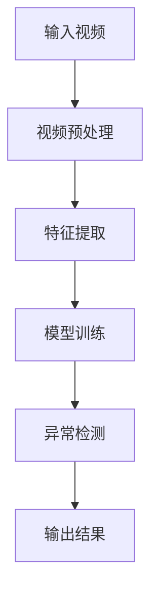

# 提高AI模型在视频异常事件检测任务中的准确性与实时性

> 关键词：AI模型、视频异常事件检测、准确性、实时性、深度学习

> 摘要：本文聚焦于如何提高AI模型在视频异常事件检测任务中的准确性与实时性。首先介绍了该研究的背景、目的、预期读者等内容。接着阐述了核心概念及联系，分析了相关算法原理和操作步骤，给出了数学模型和公式。通过项目实战展示了代码实现与解读，探讨了实际应用场景。还推荐了相关的工具和资源，最后总结了未来发展趋势与挑战，并提供常见问题解答和扩展阅读资料。旨在为相关领域的研究和实践提供全面而深入的参考。

## 1. 背景介绍 
### 1.1 目的和范围
视频异常事件检测在众多领域具有重要的应用价值，如安防监控、交通管理、工业生产监控等。然而，当前的AI模型在进行视频异常事件检测时，面临着准确性和实时性难以兼顾的问题。本文章的目的在于深入探讨提高AI模型在视频异常事件检测任务中准确性与实时性的方法和策略。研究范围涵盖了从核心概念的阐述、算法原理的分析、数学模型的构建，到实际项目的开发与应用等多个方面。

### 1.2 预期读者
本文预期读者包括从事计算机视觉、人工智能领域的研究人员、开发者，以及对视频异常事件检测技术感兴趣的工程师和爱好者。对于那些希望提升AI模型在视频处理任务中性能的专业人士，本文将提供有价值的参考和技术指导。

### 1.3 文档结构概述
本文将按照以下结构展开：首先介绍背景信息，包括目的、预期读者和文档结构概述等。接着阐述核心概念与联系，通过文本示意图和Mermaid流程图展示相关原理和架构。然后详细讲解核心算法原理和具体操作步骤，并给出Python源代码示例。随后介绍数学模型和公式，并结合实例进行说明。通过项目实战部分展示代码的实际实现和详细解读。之后探讨实际应用场景，推荐相关的工具和资源。最后总结未来发展趋势与挑战，提供常见问题解答和扩展阅读资料。

### 1.4 术语表
#### 1.4.1 核心术语定义
- **AI模型**：即人工智能模型，是基于机器学习、深度学习等技术构建的算法模型，用于处理和分析数据，实现特定的任务，如分类、预测、检测等。
- **视频异常事件检测**：指从视频序列中识别出不符合正常模式或预期行为的事件，如盗窃、火灾、交通事故等。
- **准确性**：在视频异常事件检测中，准确性是指模型正确检测出异常事件的比例，通常用准确率、召回率等指标来衡量。
- **实时性**：指模型能够在短时间内对视频数据进行处理和分析，并及时输出检测结果，以满足实际应用中的及时性需求。
- **深度学习**：是机器学习的一个分支，通过构建多层神经网络来自动学习数据的特征和模式，在图像、视频处理等领域取得了显著的成果。

#### 1.4.2 相关概念解释
- **特征提取**：从视频数据中提取具有代表性的特征，以便模型能够更好地理解和分析视频内容。常见的特征包括颜色特征、纹理特征、运动特征等。
- **模型训练**：使用标注好的数据集对AI模型进行训练，调整模型的参数，使其能够学习到数据中的模式和规律，从而提高模型的性能。
- **目标检测**：在视频帧中定位和识别特定的目标对象，是视频异常事件检测的重要基础。

#### 1.4.3 缩略词列表
- **CNN**：Convolutional Neural Network，卷积神经网络，是一种常用的深度学习模型，在图像和视频处理中广泛应用。
- **RNN**：Recurrent Neural Network，循环神经网络，适用于处理序列数据，如视频中的时间序列信息。
- **LSTM**：Long Short-Term Memory，长短期记忆网络，是RNN的一种改进形式，能够有效处理长序列数据。
- **YOLO**：You Only Look Once，一种实时目标检测算法，具有较高的检测速度。

## 2. 核心概念与联系 

### 核心概念原理
视频异常事件检测的核心在于通过对视频数据的分析，识别出其中的异常模式。这通常涉及到以下几个关键步骤：
1. **视频预处理**：对原始视频进行解码、裁剪、缩放等操作，以提高数据的质量和一致性。
2. **特征提取**：从预处理后的视频帧中提取有用的特征，如视觉特征、运动特征等。这些特征可以帮助模型更好地理解视频内容。
3. **模型训练**：使用提取的特征和标注好的数据集对AI模型进行训练，使模型能够学习到正常和异常事件的模式。
4. **异常检测**：将新的视频数据输入到训练好的模型中，模型根据学习到的模式判断视频中是否存在异常事件，并输出检测结果。

### 架构的文本示意图
```plaintext
输入视频 -> 视频预处理 -> 特征提取 -> 模型训练 -> 异常检测 -> 输出结果
```

### Mermaid流程图


## 3. 核心算法原理 & 具体操作步骤 

### 核心算法原理
在视频异常事件检测中，常用的算法包括基于深度学习的方法，如卷积神经网络（CNN）和循环神经网络（RNN）。下面以基于CNN的方法为例，介绍其核心算法原理。

CNN是一种专门用于处理具有网格结构数据的神经网络，如图像和视频。它通过卷积层、池化层和全连接层等组件，自动提取数据的特征。在视频异常事件检测中，CNN可以用于提取视频帧的视觉特征。

具体来说，CNN的卷积层通过卷积核与输入数据进行卷积操作，提取数据的局部特征。池化层则用于对卷积层的输出进行下采样，减少数据的维度，同时保留重要的特征信息。全连接层将池化层的输出进行扁平化处理，并通过一系列的神经元进行分类或回归任务。

### 具体操作步骤
以下是使用Python和PyTorch库实现基于CNN的视频异常事件检测的具体操作步骤：

```python
import torch
import torch.nn as nn
import torch.optim as optim
from torch.utils.data import DataLoader, Dataset

# 定义CNN模型
class CNNModel(nn.Module):
    def __init__(self):
        super(CNNModel, self).__init__()
        self.conv1 = nn.Conv2d(3, 16, kernel_size=3, padding=1)
        self.relu1 = nn.ReLU()
        self.pool1 = nn.MaxPool2d(kernel_size=2, stride=2)
        self.conv2 = nn.Conv2d(16, 32, kernel_size=3, padding=1)
        self.relu2 = nn.ReLU()
        self.pool2 = nn.MaxPool2d(kernel_size=2, stride=2)
        self.fc1 = nn.Linear(32 * 8 * 8, 128)
        self.relu3 = nn.ReLU()
        self.fc2 = nn.Linear(128, 2)  # 2 classes: normal and abnormal

    def forward(self, x):
        x = self.pool1(self.relu1(self.conv1(x)))
        x = self.pool2(self.relu2(self.conv2(x)))
        x = x.view(-1, 32 * 8 * 8)
        x = self.relu3(self.fc1(x))
        x = self.fc2(x)
        return x

# 定义数据集类
class VideoDataset(Dataset):
    def __init__(self, data, labels):
        self.data = data
        self.labels = labels

    def __len__(self):
        return len(self.data)

    def __getitem__(self, idx):
        return self.data[idx], self.labels[idx]

# 数据准备
# 假设data是视频帧数据，labels是对应的标签
data = torch.randn(100, 3, 32, 32)
labels = torch.randint(0, 2, (100,))
dataset = VideoDataset(data, labels)
dataloader = DataLoader(dataset, batch_size=10, shuffle=True)

# 初始化模型、损失函数和优化器
model = CNNModel()
criterion = nn.CrossEntropyLoss()
optimizer = optim.Adam(model.parameters(), lr=0.001)

# 训练模型
num_epochs = 10
for epoch in range(num_epochs):
    running_loss = 0.0
    for i, (inputs, labels) in enumerate(dataloader):
        optimizer.zero_grad()
        outputs = model(inputs)
        loss = criterion(outputs, labels)
        loss.backward()
        optimizer.step()
        running_loss += loss.item()
    print(f'Epoch {epoch + 1}, Loss: {running_loss / len(dataloader)}')

# 测试模型
test_data = torch.randn(10, 3, 32, 32)
with torch.no_grad():
    test_outputs = model(test_data)
    _, predicted = torch.max(test_outputs, 1)
    print(f'Predicted labels: {predicted}')
```

### 代码解释
1. **定义CNN模型**：`CNNModel`类继承自`nn.Module`，定义了一个简单的CNN模型，包括两个卷积层、两个池化层和两个全连接层。
2. **定义数据集类**：`VideoDataset`类继承自`Dataset`，用于封装视频数据和对应的标签。
3. **数据准备**：生成随机的视频帧数据和标签，并创建数据加载器。
4. **初始化模型、损失函数和优化器**：使用`CrossEntropyLoss`作为损失函数，`Adam`作为优化器。
5. **训练模型**：通过多个epoch对模型进行训练，每个epoch中迭代数据集，计算损失并更新模型参数。
6. **测试模型**：使用测试数据对模型进行测试，并输出预测结果。

## 4. 数学模型和公式 & 详细讲解 & 举例说明 

### 卷积操作
卷积操作是CNN的核心操作之一，其数学公式如下：
$$
y_{i,j} = \sum_{m=0}^{M-1} \sum_{n=0}^{N-1} x_{i+m,j+n} \cdot w_{m,n} + b
$$
其中，$x$ 是输入数据，$w$ 是卷积核，$b$ 是偏置项，$y$ 是卷积输出。$M$ 和 $N$ 分别是卷积核的高度和宽度。

### 举例说明
假设输入数据 $x$ 是一个 $3 \times 3$ 的矩阵：
$$
x = 
\begin{bmatrix}
1 & 2 & 3 \\
4 & 5 & 6 \\
7 & 8 & 9
\end{bmatrix}
$$
卷积核 $w$ 是一个 $2 \times 2$ 的矩阵：
$$
w = 
\begin{bmatrix}
1 & 0 \\
0 & 1
\end{bmatrix}
$$
偏置项 $b = 0$。

首先，将卷积核 $w$ 与输入数据 $x$ 的左上角 $2 \times 2$ 子矩阵进行逐元素相乘，并求和：
$$
y_{0,0} = 1 \times 1 + 2 \times 0 + 4 \times 0 + 5 \times 1 = 6
$$
然后，将卷积核 $w$ 向右移动一个位置，继续进行卷积操作：
$$
y_{0,1} = 2 \times 1 + 3 \times 0 + 5 \times 0 + 6 \times 1 = 8
$$
以此类推，最终得到卷积输出：
$$
y = 
\begin{bmatrix}
6 & 8 \\
12 & 14
\end{bmatrix}
$$

### 池化操作
池化操作用于对卷积层的输出进行下采样，常见的池化操作有最大池化和平均池化。以最大池化为例，其数学公式如下：
$$
y_{i,j} = \max_{m=0}^{M-1} \max_{n=0}^{N-1} x_{iM + m, jN + n}
$$
其中，$x$ 是输入数据，$y$ 是池化输出，$M$ 和 $N$ 分别是池化窗口的高度和宽度。

### 举例说明
假设输入数据 $x$ 是一个 $4 \times 4$ 的矩阵：
$$
x = 
\begin{bmatrix}
1 & 2 & 3 & 4 \\
5 & 6 & 7 & 8 \\
9 & 10 & 11 & 12 \\
13 & 14 & 15 & 16
\end{bmatrix}
$$
池化窗口大小为 $2 \times 2$。

首先，将池化窗口放在输入数据的左上角 $2 \times 2$ 子矩阵上，取其中的最大值：
$$
y_{0,0} = \max(1, 2, 5, 6) = 6
$$
然后，将池化窗口向右移动一个位置，继续进行池化操作：
$$
y_{0,1} = \max(3, 4, 7, 8) = 8
$$
以此类推，最终得到池化输出：
$$
y = 
\begin{bmatrix}
6 & 8 \\
14 & 16
\end{bmatrix}
$$

### 交叉熵损失函数
交叉熵损失函数常用于分类任务，其数学公式如下：
$$
L = - \sum_{i=1}^{C} y_i \log(p_i)
$$
其中，$C$ 是类别数，$y_i$ 是真实标签的第 $i$ 个分量，$p_i$ 是模型预测的第 $i$ 个类别的概率。

### 举例说明
假设真实标签 $y = [1, 0]$，模型预测的概率分布 $p = [0.8, 0.2]$。

则交叉熵损失为：
$$
L = - (1 \times \log(0.8) + 0 \times \log(0.2)) \approx 0.223
$$

## 5. 项目实战：代码实际案例和详细解释说明 

### 5.1  开发环境搭建
为了实现视频异常事件检测项目，我们需要搭建相应的开发环境。以下是具体的步骤：

1. **安装Python**：建议使用Python 3.7及以上版本，可以从Python官方网站（https://www.python.org/downloads/）下载并安装。
2. **安装深度学习框架**：我们使用PyTorch作为深度学习框架，可以根据自己的CUDA版本和操作系统选择合适的安装方式。可以参考PyTorch官方网站（https://pytorch.org/get-started/locally/）进行安装。
3. **安装其他依赖库**：还需要安装一些其他的依赖库，如OpenCV、NumPy等。可以使用pip命令进行安装：
```sh
pip install opencv-python numpy
```

### 5.2  源代码详细实现和代码解读
以下是一个完整的视频异常事件检测项目的源代码：

```python
import cv2
import torch
import torch.nn as nn
import torch.optim as optim
from torch.utils.data import DataLoader, Dataset
import numpy as np

# 定义CNN模型
class CNNModel(nn.Module):
    def __init__(self):
        super(CNNModel, self).__init__()
        self.conv1 = nn.Conv2d(3, 16, kernel_size=3, padding=1)
        self.relu1 = nn.ReLU()
        self.pool1 = nn.MaxPool2d(kernel_size=2, stride=2)
        self.conv2 = nn.Conv2d(16, 32, kernel_size=3, padding=1)
        self.relu2 = nn.ReLU()
        self.pool2 = nn.MaxPool2d(kernel_size=2, stride=2)
        self.fc1 = nn.Linear(32 * 8 * 8, 128)
        self.relu3 = nn.ReLU()
        self.fc2 = nn.Linear(128, 2)  # 2 classes: normal and abnormal

    def forward(self, x):
        x = self.pool1(self.relu1(self.conv1(x)))
        x = self.pool2(self.relu2(self.conv2(x)))
        x = x.view(-1, 32 * 8 * 8)
        x = self.relu3(self.fc1(x))
        x = self.fc2(x)
        return x

# 定义数据集类
class VideoDataset(Dataset):
    def __init__(self, video_paths, labels):
        self.video_paths = video_paths
        self.labels = labels

    def __len__(self):
        return len(self.video_paths)

    def __getitem__(self, idx):
        video_path = self.video_paths[idx]
        cap = cv2.VideoCapture(video_path)
        frames = []
        while cap.isOpened():
            ret, frame = cap.read()
            if not ret:
                break
            frame = cv2.resize(frame, (32, 32))
            frame = frame.transpose(2, 0, 1)  # (H, W, C) -> (C, H, W)
            frames.append(frame)
        cap.release()
        frames = np.array(frames)
        frames = torch.tensor(frames, dtype=torch.float32)
        label = torch.tensor(self.labels[idx], dtype=torch.long)
        return frames, label

# 数据准备
video_paths = ['video1.mp4', 'video2.mp4',...]  # 替换为实际的视频文件路径
labels = [0, 1,...]  # 替换为实际的标签
dataset = VideoDataset(video_paths, labels)
dataloader = DataLoader(dataset, batch_size=10, shuffle=True)

# 初始化模型、损失函数和优化器
model = CNNModel()
criterion = nn.CrossEntropyLoss()
optimizer = optim.Adam(model.parameters(), lr=0.001)

# 训练模型
num_epochs = 10
for epoch in range(num_epochs):
    running_loss = 0.0
    for i, (inputs, labels) in enumerate(dataloader):
        optimizer.zero_grad()
        outputs = []
        for frames in inputs:
            frame_outputs = model(frames)
            frame_outputs = torch.mean(frame_outputs, dim=0, keepdim=True)
            outputs.append(frame_outputs)
        outputs = torch.cat(outputs, dim=0)
        loss = criterion(outputs, labels)
        loss.backward()
        optimizer.step()
        running_loss += loss.item()
    print(f'Epoch {epoch + 1}, Loss: {running_loss / len(dataloader)}')

# 实时检测
cap = cv2.VideoCapture('test_video.mp4')  # 替换为实际的测试视频文件路径
while cap.isOpened():
    ret, frame = cap.read()
    if not ret:
        break
    frame = cv2.resize(frame, (32, 32))
    frame = frame.transpose(2, 0, 1)
    frame = torch.tensor(frame, dtype=torch.float32).unsqueeze(0)
    with torch.no_grad():
        output = model(frame)
        _, predicted = torch.max(output, 1)
        if predicted.item() == 1:
            cv2.putText(frame, 'Abnormal Event', (10, 30), cv2.FONT_HERSHEY_SIMPLEX, 1, (0, 0, 255), 2)
    frame = frame.squeeze(0).transpose(1, 2, 0).numpy().astype(np.uint8)
    cv2.imshow('Video', frame)
    if cv2.waitKey(1) & 0xFF == ord('q'):
        break
cap.release()
cv2.destroyAllWindows()
```

### 5.3  代码解读与分析
1. **定义CNN模型**：与之前的代码类似，定义了一个简单的CNN模型用于视频异常事件检测。
2. **定义数据集类**：`VideoDataset`类用于读取视频文件，并将视频帧转换为模型可以处理的格式。
3. **数据准备**：将视频文件路径和对应的标签封装到数据集中，并创建数据加载器。
4. **初始化模型、损失函数和优化器**：使用`CrossEntropyLoss`作为损失函数，`Adam`作为优化器。
5. **训练模型**：通过多个epoch对模型进行训练，每个epoch中迭代数据集，计算损失并更新模型参数。
6. **实时检测**：使用训练好的模型对测试视频进行实时检测，并在视频帧上标注异常事件。

## 6. 实际应用场景 
视频异常事件检测技术在多个领域具有广泛的应用场景：

### 安防监控
在安防监控领域，视频异常事件检测可以实时监测公共场所、建筑物内部等区域的异常行为，如盗窃、打架、非法入侵等。一旦检测到异常事件，系统可以及时发出警报，通知安保人员采取相应的措施，提高安全性。

### 交通管理
在交通管理中，视频异常事件检测可以用于监测交通事故、交通拥堵、违规驾驶等情况。通过实时分析交通视频数据，系统可以及时发现异常事件，并向交通管理部门提供准确的信息，以便采取有效的交通疏导措施。

### 工业生产监控
在工业生产环境中，视频异常事件检测可以用于监测设备故障、工人违规操作等情况。通过对生产车间的视频进行实时分析，系统可以及时发现异常事件，并通知相关人员进行处理，避免生产事故的发生，提高生产效率。

### 医疗护理
在医疗护理领域，视频异常事件检测可以用于监测患者的异常行为，如跌倒、突发疾病等。通过对病房、养老院等场所的视频进行实时分析，系统可以及时发现异常事件，并通知医护人员进行救援，提高患者的安全性。

## 7. 工具和资源推荐
### 7.1 学习资源推荐
#### 7.1.1 书籍推荐
- 《深度学习》（Deep Learning）：由Ian Goodfellow、Yoshua Bengio和Aaron Courville合著，是深度学习领域的经典教材，涵盖了深度学习的基本原理、算法和应用。
- 《Python深度学习》（Deep Learning with Python）：由Francois Chollet著，以Python和Keras为基础，介绍了深度学习的基本概念和实践方法。
- 《计算机视觉：算法与应用》（Computer Vision: Algorithms and Applications）：由Richard Szeliski著，全面介绍了计算机视觉的基本算法和应用，包括图像特征提取、目标检测、图像分割等。

#### 7.1.2 在线课程
- Coursera上的“深度学习专项课程”（Deep Learning Specialization）：由Andrew Ng教授授课，包括深度学习基础、卷积神经网络、循环神经网络等多个课程，是学习深度学习的优质资源。
- edX上的“计算机视觉基础”（Foundations of Computer Vision）：由UC Berkeley的教授授课，介绍了计算机视觉的基本概念和算法。
- 哔哩哔哩（B站）上有许多关于深度学习和计算机视觉的教学视频，可以根据自己的需求进行搜索和学习。

#### 7.1.3 技术博客和网站
- Medium：是一个技术博客平台，上面有许多关于深度学习、计算机视觉等领域的优质文章。
- arXiv：是一个预印本论文平台，提供了大量的最新研究成果和技术报告。
- OpenCV官方文档：OpenCV是一个广泛使用的计算机视觉库，其官方文档提供了详细的API文档和教程。

### 7.2 开发工具框架推荐
#### 7.2.1 IDE和编辑器
- PyCharm：是一款专门为Python开发设计的集成开发环境（IDE），提供了丰富的代码编辑、调试、版本控制等功能。
- Jupyter Notebook：是一个交互式的开发环境，适合进行数据分析、模型训练和实验。
- Visual Studio Code：是一款轻量级的代码编辑器，支持多种编程语言，具有丰富的插件生态系统。

#### 7.2.2 调试和性能分析工具
- PyTorch Profiler：是PyTorch提供的性能分析工具，可以帮助开发者分析模型的运行时间、内存使用等情况。
- TensorBoard：是TensorFlow提供的可视化工具，也可以与PyTorch集成，用于可视化模型的训练过程和性能指标。
- cProfile：是Python标准库中的性能分析工具，可以帮助开发者分析代码的运行时间和函数调用情况。

#### 7.2.3 相关框架和库
- PyTorch：是一个开源的深度学习框架，具有动态图、易于使用等特点，广泛应用于计算机视觉、自然语言处理等领域。
- OpenCV：是一个开源的计算机视觉库，提供了丰富的图像和视频处理算法，如特征提取、目标检测、图像分割等。
- NumPy：是Python中用于科学计算的基础库，提供了高效的多维数组对象和各种数学函数。

### 7.3 相关论文著作推荐
#### 7.3.1 经典论文
- "ImageNet Classification with Deep Convolutional Neural Networks"：由Alex Krizhevsky、Ilya Sutskever和Geoffrey E. Hinton发表，介绍了AlexNet模型，开启了深度学习在计算机视觉领域的应用热潮。
- "You Only Look Once: Unified, Real-Time Object Detection"：由Joseph Redmon等人发表，提出了YOLO目标检测算法，具有较高的检测速度。
- "Long Short-Term Memory"：由Sepp Hochreiter和Jürgen Schmidhuber发表，介绍了长短期记忆网络（LSTM），解决了循环神经网络中的梯度消失问题。

#### 7.3.2 最新研究成果
- 可以通过arXiv、ACM Digital Library、IEEE Xplore等学术数据库搜索最新的关于视频异常事件检测的研究成果。
- 关注计算机视觉领域的顶级会议，如CVPR、ICCV、ECCV等，这些会议上会发表许多最新的研究成果。

#### 7.3.3 应用案例分析
- 可以参考一些实际应用案例的论文和报告，了解视频异常事件检测技术在不同领域的应用情况和解决方案。
- 关注一些知名企业和研究机构的官方网站，他们会发布一些关于视频异常事件检测的应用案例和技术分享。

## 8. 总结：未来发展趋势与挑战
### 未来发展趋势
1. **多模态融合**：将视频数据与其他模态的数据，如音频、传感器数据等进行融合，以提高异常事件检测的准确性和可靠性。
2. **实时性提升**：随着硬件技术的不断发展，如GPU、TPU等的性能不断提高，未来的AI模型将能够在更短的时间内处理和分析视频数据，实现更高的实时性。
3. **可解释性增强**：为了更好地理解模型的决策过程，未来的研究将更加关注AI模型的可解释性，使模型的决策结果更加可信和可靠。
4. **自适应学习**：模型将具备自适应学习的能力，能够根据不同的应用场景和数据特点自动调整模型的参数和结构，提高模型的泛化能力。

### 挑战
1. **数据标注困难**：视频异常事件检测需要大量的标注数据，但异常事件的发生频率较低，导致标注数据的获取和标注成本较高。
2. **计算资源需求大**：深度学习模型通常需要大量的计算资源进行训练和推理，这对于一些资源有限的设备和场景来说是一个挑战。
3. **环境适应性问题**：视频数据的质量和特征受到环境因素的影响较大，如光照、天气等，模型在不同的环境下可能会出现性能下降的问题。
4. **隐私和安全问题**：视频数据涉及到用户的隐私和安全问题，如何在保证检测准确性的同时，保护用户的隐私和数据安全是一个需要解决的问题。

## 9. 附录：常见问题与解答
### 1. 如何提高模型的准确性？
- **增加训练数据**：使用更多的标注数据对模型进行训练，可以提高模型的泛化能力和准确性。
- **优化模型结构**：尝试不同的模型结构和参数，如增加卷积层的数量、调整全连接层的神经元数量等，以找到最优的模型结构。
- **使用数据增强技术**：对训练数据进行随机裁剪、翻转、旋转等操作，增加数据的多样性，提高模型的鲁棒性。

### 2. 如何提高模型的实时性？
- **选择轻量级模型**：使用轻量级的深度学习模型，如MobileNet、ShuffleNet等，减少模型的计算量和参数量。
- **优化模型推理过程**：使用模型量化、剪枝等技术，减少模型的计算量和内存占用，提高推理速度。
- **使用硬件加速**：使用GPU、TPU等硬件设备对模型进行加速，提高模型的处理速度。

### 3. 如何处理不平衡数据集？
- **过采样**：对少数类样本进行复制或生成新的样本，以增加少数类样本的数量。
- **欠采样**：对多数类样本进行随机删除，以减少多数类样本的数量。
- **使用加权损失函数**：在损失函数中对少数类样本赋予更高的权重，以提高模型对少数类样本的关注度。

### 4. 如何评估模型的性能？
- **准确率（Accuracy）**：模型正确预测的样本数占总样本数的比例。
- **召回率（Recall）**：模型正确预测的正样本数占实际正样本数的比例。
- **精确率（Precision）**：模型正确预测的正样本数占预测为正样本数的比例。
- **F1值（F1-Score）**：综合考虑准确率和召回率的指标，计算公式为 $F1 = 2 \times \frac{Precision \times Recall}{Precision + Recall}$。

## 10. 扩展阅读 & 参考资料
### 扩展阅读
- 《人工智能：现代方法》（Artificial Intelligence: A Modern Approach）：全面介绍了人工智能的基本概念、算法和应用，是人工智能领域的经典教材。
- 《深度学习实战》（Deep Learning in Practice）：通过实际案例介绍了深度学习的应用和实践方法，适合有一定基础的读者。
- 《计算机视觉中的多视图几何》（Multiple View Geometry in Computer Vision）：深入介绍了计算机视觉中的多视图几何理论和算法，是计算机视觉领域的经典著作。

### 参考资料
- PyTorch官方文档：https://pytorch.org/docs/stable/index.html
- OpenCV官方文档：https://docs.opencv.org/
- arXiv：https://arxiv.org/
- ACM Digital Library：https://dl.acm.org/
- IEEE Xplore：https://ieeexplore.ieee.org/

作者：AI天才研究院/AI Genius Institute & 禅与计算机程序设计艺术 /Zen And The Art of Computer Programming