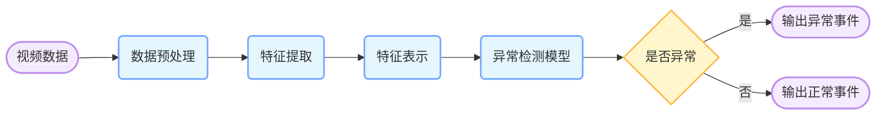

# 提高AI模型在视频异常事件检测任务中的泛化能力

> 关键词：AI模型、视频异常事件检测、泛化能力、深度学习、特征提取、数据增强、正则化

> 摘要：本文聚焦于提高AI模型在视频异常事件检测任务中的泛化能力。首先介绍了视频异常事件检测的背景和重要性，阐述了泛化能力的概念及在该任务中的关键意义。接着深入探讨了核心概念，包括视频数据特点、异常事件定义等，并给出相应的原理和架构示意图。详细讲解了核心算法原理，通过Python代码进行说明，同时介绍了相关的数学模型和公式。在项目实战部分，给出了开发环境搭建、源代码实现与解读。还探讨了实际应用场景，推荐了相关的学习资源、开发工具框架以及论文著作。最后总结了未来发展趋势与挑战，并对常见问题进行了解答，提供了扩展阅读和参考资料，旨在为提升AI模型在视频异常事件检测中的泛化能力提供全面的技术指导。

## 1. 背景介绍 
### 1.1 目的和范围
视频异常事件检测在众多领域具有重要的应用价值，如安防监控、智能交通、工业生产监测等。然而，现有的AI模型在该任务中面临着泛化能力不足的问题，即模型在训练数据上表现良好，但在新的、未见过的数据上性能大幅下降。本文章的目的在于深入探讨提高AI模型在视频异常事件检测任务中泛化能力的方法和技术，范围涵盖从理论原理到实际应用的各个方面，包括核心概念的阐述、算法原理的讲解、项目实战的演示以及相关资源的推荐等。

### 1.2 预期读者
本文预期读者包括对视频异常事件检测和AI模型泛化能力感兴趣的研究人员、工程师、学生等。对于正在从事相关领域研究和开发的专业人士，可作为技术参考和深入研究的资料；对于初学者，可作为了解该领域知识和技术的入门指南。

### 1.3 文档结构概述
本文首先介绍背景信息，包括目的、预期读者和文档结构。接着阐述核心概念与联系，展示相关的原理和架构示意图。然后详细讲解核心算法原理和具体操作步骤，结合Python代码进行说明。随后介绍数学模型和公式，并举例说明。在项目实战部分，给出开发环境搭建、源代码实现与解读。之后探讨实际应用场景，推荐相关工具和资源。最后总结未来发展趋势与挑战，解答常见问题，提供扩展阅读和参考资料。

### 1.4 术语表
#### 1.4.1 核心术语定义
- **AI模型**：人工智能模型，是利用机器学习、深度学习等技术构建的，能够从数据中学习模式和规律，并进行预测和决策的算法模型。
- **视频异常事件检测**：从视频序列中识别出与正常情况不同的事件或行为的过程。
- **泛化能力**：模型在未见过的数据上能够保持良好性能的能力，即模型对新数据的适应能力。
- **深度学习**：一类基于人工神经网络的机器学习方法，通过构建多层神经网络来学习数据的复杂特征和模式。
- **特征提取**：从原始数据中提取出能够代表数据本质特征的过程，以便于后续的分析和处理。

#### 1.4.2 相关概念解释
- **正常事件**：在视频场景中符合预期和常见模式的事件或行为。
- **异常事件**：偏离正常模式、具有潜在危险或特殊意义的事件或行为。
- **数据分布**：数据在不同特征空间中的分布情况，不同的数据集可能具有不同的数据分布。
- **过拟合**：模型在训练数据上表现过于良好，但在测试数据上性能较差的现象，通常是由于模型过于复杂或训练数据不足导致的。

#### 1.4.3 缩略词列表
- **CNN**：Convolutional Neural Network，卷积神经网络
- **RNN**：Recurrent Neural Network，循环神经网络
- **LSTM**：Long Short-Term Memory，长短期记忆网络
- **GAN**：Generative Adversarial Network，生成对抗网络
- **SVM**：Support Vector Machine，支持向量机

## 2. 核心概念与联系 
### 2.1 视频数据特点
视频数据具有高维度、时序性和动态性等特点。视频由一系列连续的帧组成，每帧图像包含大量的像素信息，因此数据维度较高。同时，视频中的事件是随时间变化的，具有明显的时序性，相邻帧之间存在着一定的关联。此外，视频场景中的物体和事件可能会发生动态变化，如物体的运动、光照的变化等。

### 2.2 异常事件定义
异常事件的定义通常是相对的，取决于具体的应用场景和任务需求。一般来说，异常事件是指在特定场景下不符合正常模式或预期的事件。例如，在安防监控场景中，盗窃、暴力冲突等事件属于异常事件；在工业生产监测中，设备故障、生产事故等属于异常事件。

### 2.3 泛化能力的重要性
在视频异常事件检测任务中，泛化能力至关重要。由于实际应用中的视频数据具有多样性和复杂性，模型需要能够在不同的场景、光照条件、拍摄角度等情况下准确地检测出异常事件。如果模型的泛化能力不足，就会导致在新的数据上出现漏检或误检的情况，从而影响系统的可靠性和实用性。

### 2.4 核心概念原理和架构示意图
下面是一个简单的视频异常事件检测模型的原理和架构示意图：



该示意图展示了视频异常事件检测的基本流程，包括数据预处理、特征提取、特征表示、异常检测模型和决策输出等步骤。

## 3. 核心算法原理 & 具体操作步骤 
### 3.1 数据预处理
数据预处理是视频异常事件检测的重要步骤，主要包括视频解码、图像增强、归一化等操作。以下是一个使用Python和OpenCV进行视频解码和图像增强的示例代码：

```python
import cv2
import numpy as np

def preprocess_video(video_path):
    cap = cv2.VideoCapture(video_path)
    frames = []
    while cap.isOpened():
        ret, frame = cap.read()
        if not ret:
            break
        # 图像增强：直方图均衡化
        gray = cv2.cvtColor(frame, cv2.COLOR_BGR2GRAY)
        equalized = cv2.equalizeHist(gray)
        frames.append(equalized)
    cap.release()
    frames = np.array(frames)
    # 归一化
    frames = frames / 255.0
    return frames
```

### 3.2 特征提取
特征提取是从视频数据中提取出能够代表异常事件的特征。常用的特征提取方法包括基于手工特征的方法和基于深度学习的方法。以下是一个使用卷积神经网络（CNN）进行特征提取的示例代码：

```python
import tensorflow as tf
from tensorflow.keras.applications.vgg16 import VGG16
from tensorflow.keras.layers import Input

def extract_features(frames):
    input_shape = frames[0].shape
    base_model = VGG16(weights='imagenet', include_top=False, input_tensor=Input(shape=input_shape))
    features = []
    for frame in frames:
        frame = np.expand_dims(frame, axis=0)
        frame = np.repeat(frame, 3, axis=-1)  # 扩展为三通道
        feature = base_model.predict(frame)
        features.append(feature.flatten())
    features = np.array(features)
    return features
```

### 3.3 异常检测模型
异常检测模型用于判断视频中是否存在异常事件。常用的异常检测模型包括基于机器学习的模型和基于深度学习的模型。以下是一个使用支持向量机（SVM）进行异常检测的示例代码：

```python
from sklearn.svm import OneClassSVM

def train_anomaly_detector(features):
    clf = OneClassSVM(nu=0.1, kernel="rbf", gamma=0.1)
    clf.fit(features)
    return clf

def detect_anomaly(clf, features):
    predictions = clf.predict(features)
    return predictions
```

### 3.4 具体操作步骤
1. 数据预处理：使用`preprocess_video`函数对视频数据进行解码、图像增强和归一化处理。
2. 特征提取：使用`extract_features`函数从预处理后的视频数据中提取特征。
3. 模型训练：使用`train_anomaly_detector`函数对异常检测模型进行训练。
4. 异常检测：使用`detect_anomaly`函数对新的视频数据进行异常检测。

## 4. 数学模型和公式 & 详细讲解 & 举例说明 
### 4.1 支持向量机（SVM）原理
支持向量机是一种常用的机器学习算法，用于分类和回归分析。在异常检测任务中，通常使用一类支持向量机（One-Class SVM）。一类支持向量机的目标是找到一个超平面，使得训练数据尽可能地落在超平面的一侧，而将异常数据划分到另一侧。

一类支持向量机的数学模型可以表示为：

$$\min_{w,\xi,\rho} \frac{1}{2} \|w\|^2 + \frac{1}{\nu n} \sum_{i=1}^{n} \xi_i - \rho$$

$$\text{s.t. } \langle w, \phi(x_i) \rangle \geq \rho - \xi_i, \quad \xi_i \geq 0, \quad i = 1, \ldots, n$$

其中，$w$ 是超平面的法向量，$\xi_i$ 是松弛变量，$\rho$ 是超平面到原点的距离，$\nu$ 是一个控制参数，$\phi(x_i)$ 是将输入数据 $x_i$ 映射到高维特征空间的函数。

### 4.2 卷积神经网络（CNN）原理
卷积神经网络是一种专门用于处理具有网格结构数据的深度学习模型，如图像和视频。CNN的核心是卷积层、池化层和全连接层。

卷积层的数学公式可以表示为：

$$y_{i,j}^l = \sum_{m=0}^{M-1} \sum_{n=0}^{N-1} x_{i+m,j+n}^{l-1} \cdot k_{m,n}^l + b^l$$

其中，$y_{i,j}^l$ 是第 $l$ 层卷积层的输出特征图中的第 $(i,j)$ 个元素，$x_{i+m,j+n}^{l-1}$ 是第 $l-1$ 层输入特征图中的第 $(i+m,j+n)$ 个元素，$k_{m,n}^l$ 是第 $l$ 层的卷积核中的第 $(m,n)$ 个元素，$b^l$ 是偏置项。

池化层的作用是对特征图进行下采样，常用的池化方法包括最大池化和平均池化。最大池化的数学公式可以表示为：

$$y_{i,j}^l = \max_{m=0}^{M-1} \max_{n=0}^{N-1} x_{i \cdot s + m, j \cdot s + n}^{l-1}$$

其中，$y_{i,j}^l$ 是第 $l$ 层池化层的输出特征图中的第 $(i,j)$ 个元素，$x_{i \cdot s + m, j \cdot s + n}^{l-1}$ 是第 $l-1$ 层输入特征图中的第 $(i \cdot s + m, j \cdot s + n)$ 个元素，$s$ 是池化步长。

### 4.3 举例说明
假设我们有一个包含100个正常视频帧的数据集，我们可以使用上述的一类支持向量机和卷积神经网络进行异常检测。首先，使用卷积神经网络提取每个视频帧的特征，然后使用一类支持向量机对这些特征进行训练。训练完成后，我们可以对新的视频帧进行异常检测，如果预测结果为 -1，则表示该视频帧为异常帧。

## 5. 项目实战：代码实际案例和详细解释说明 
### 5.1  开发环境搭建
- **操作系统**：Windows、Linux或macOS
- **Python版本**：Python 3.6及以上
- **深度学习框架**：TensorFlow 2.x 或 PyTorch
- **计算机视觉库**：OpenCV
- **机器学习库**：Scikit-learn

可以使用以下命令安装所需的库：

```sh
pip install tensorflow opencv-python scikit-learn
```

### 5.2  源代码详细实现和代码解读
以下是一个完整的视频异常事件检测的代码示例：

```python
import cv2
import numpy as np
from tensorflow.keras.applications.vgg16 import VGG16
from tensorflow.keras.layers import Input
from sklearn.svm import OneClassSVM

def preprocess_video(video_path):
    cap = cv2.VideoCapture(video_path)
    frames = []
    while cap.isOpened():
        ret, frame = cap.read()
        if not ret:
            break
        # 图像增强：直方图均衡化
        gray = cv2.cvtColor(frame, cv2.COLOR_BGR2GRAY)
        equalized = cv2.equalizeHist(gray)
        frames.append(equalized)
    cap.release()
    frames = np.array(frames)
    # 归一化
    frames = frames / 255.0
    return frames

def extract_features(frames):
    input_shape = frames[0].shape
    base_model = VGG16(weights='imagenet', include_top=False, input_tensor=Input(shape=input_shape))
    features = []
    for frame in frames:
        frame = np.expand_dims(frame, axis=0)
        frame = np.repeat(frame, 3, axis=-1)  # 扩展为三通道
        feature = base_model.predict(frame)
        features.append(feature.flatten())
    features = np.array(features)
    return features

def train_anomaly_detector(features):
    clf = OneClassSVM(nu=0.1, kernel="rbf", gamma=0.1)
    clf.fit(features)
    return clf

def detect_anomaly(clf, features):
    predictions = clf.predict(features)
    return predictions

# 主函数
if __name__ == "__main__":
    # 视频路径
    video_path = "path/to/your/video.mp4"
    # 数据预处理
    frames = preprocess_video(video_path)
    # 特征提取
    features = extract_features(frames)
    # 模型训练
    clf = train_anomaly_detector(features)
    # 异常检测
    predictions = detect_anomaly(clf, features)
    # 输出结果
    for i, pred in enumerate(predictions):
        if pred == -1:
            print(f"Frame {i} is an anomaly.")
        else:
            print(f"Frame {i} is normal.")
```

### 5.3  代码解读与分析
- **数据预处理**：`preprocess_video`函数用于对视频数据进行解码、图像增强和归一化处理。通过直方图均衡化可以增强图像的对比度，提高特征提取的效果。
- **特征提取**：`extract_features`函数使用预训练的VGG16模型提取视频帧的特征。将灰度图像扩展为三通道图像以适应VGG16模型的输入要求。
- **模型训练**：`train_anomaly_detector`函数使用一类支持向量机对提取的特征进行训练。
- **异常检测**：`detect_anomaly`函数使用训练好的模型对新的视频帧进行异常检测。
- **主函数**：在主函数中，依次调用上述函数完成视频异常事件检测的整个流程，并输出检测结果。

## 6. 实际应用场景 
### 6.1 安防监控
在安防监控领域，视频异常事件检测可以实时监测公共场所、建筑物内部等区域的异常行为，如盗窃、暴力冲突、非法入侵等。通过提高AI模型的泛化能力，可以在不同的光照条件、拍摄角度和场景下准确地检测出异常事件，及时发出警报，保障人员和财产的安全。

### 6.2 智能交通
在智能交通系统中，视频异常事件检测可以用于监测道路上的交通事故、交通拥堵、违规驾驶等异常情况。通过分析监控摄像头拍摄的视频数据，及时发现异常事件并采取相应的措施，如交通疏导、救援等，提高交通运行效率和安全性。

### 6.3 工业生产监测
在工业生产过程中，视频异常事件检测可以用于监测设备的运行状态、生产流程的合规性等。例如，检测设备是否出现故障、工人是否违规操作等。通过及时发现异常事件，可以减少生产事故的发生，提高生产效率和产品质量。

### 6.4 医疗监测
在医疗领域，视频异常事件检测可以用于监测患者的行为和生理状态。例如，监测患者是否摔倒、是否出现异常的肢体动作等。通过及时发现异常事件，可以为医护人员提供及时的预警，保障患者的安全。

## 7. 工具和资源推荐
### 7.1 学习资源推荐
#### 7.1.1 书籍推荐
- 《深度学习》（Deep Learning），作者：Ian Goodfellow、Yoshua Bengio和Aaron Courville。这本书是深度学习领域的经典教材，全面介绍了深度学习的基本概念、算法和应用。
- 《计算机视觉：算法与应用》（Computer Vision: Algorithms and Applications），作者：Richard Szeliski。这本书系统地介绍了计算机视觉的基本算法和应用，包括图像特征提取、目标检测、图像分割等。
- 《机器学习》（Machine Learning），作者：Tom M. Mitchell。这本书是机器学习领域的经典教材，详细介绍了机器学习的基本概念、算法和模型。

#### 7.1.2 在线课程
- Coursera上的“深度学习专项课程”（Deep Learning Specialization），由Andrew Ng教授授课，涵盖了深度学习的各个方面，包括神经网络、卷积神经网络、循环神经网络等。
- edX上的“计算机视觉基础”（Foundations of Computer Vision），由Berkeley University的教授授课，介绍了计算机视觉的基本原理和算法。
- Udemy上的“机器学习A-Z™：Python与R实战”（Machine Learning A-Z™: Hands-On Python & R In Data Science），通过实际案例介绍了机器学习的各种算法和应用。

#### 7.1.3 技术博客和网站
- Medium上的“Towards Data Science”，是一个专注于数据科学和机器学习的技术博客，提供了大量的技术文章和案例分析。
- arXiv.org是一个预印本服务器，提供了大量的计算机科学、机器学习、人工智能等领域的最新研究论文。
- Kaggle是一个数据科学竞赛平台，提供了丰富的数据集和竞赛项目，可以通过参与竞赛来提高自己的技术水平。

### 7.2 开发工具框架推荐
#### 7.2.1 IDE和编辑器
- PyCharm：是一款专门为Python开发设计的集成开发环境（IDE），提供了丰富的代码编辑、调试和项目管理功能。
- Jupyter Notebook：是一个交互式的开发环境，适合进行数据探索、模型训练和可视化等工作。
- Visual Studio Code：是一款轻量级的代码编辑器，支持多种编程语言，具有丰富的插件和扩展功能。

#### 7.2.2 调试和性能分析工具
- TensorBoard：是TensorFlow提供的一个可视化工具，可以用于可视化模型的训练过程、损失函数、准确率等指标，帮助用户调试和优化模型。
- PyTorch Profiler：是PyTorch提供的一个性能分析工具，可以用于分析模型的计算性能、内存使用情况等，帮助用户优化模型的性能。
- NVIDIA Nsight Systems：是NVIDIA提供的一个性能分析工具，可以用于分析GPU加速的深度学习模型的性能，帮助用户优化GPU资源的使用。

#### 7.2.3 相关框架和库
- TensorFlow：是一个开源的深度学习框架，提供了丰富的深度学习模型和工具，支持多种硬件平台。
- PyTorch：是一个开源的深度学习框架，具有动态计算图的特点，适合进行快速原型开发和研究。
- OpenCV：是一个开源的计算机视觉库，提供了丰富的计算机视觉算法和工具，包括图像特征提取、目标检测、图像分割等。

### 7.3 相关论文著作推荐
#### 7.3.1 经典论文
- “ImageNet Classification with Deep Convolutional Neural Networks”，作者：Alex Krizhevsky、Ilya Sutskever和Geoffrey E. Hinton。这篇论文提出了AlexNet，开创了深度学习在计算机视觉领域的新纪元。
- “Long Short-Term Memory”，作者：Sepp Hochreiter和Jürgen Schmidhuber。这篇论文提出了长短期记忆网络（LSTM），解决了循环神经网络中的梯度消失问题。
- “Generative Adversarial Nets”，作者：Ian J. Goodfellow等。这篇论文提出了生成对抗网络（GAN），为生成模型的发展提供了新的思路。

#### 7.3.2 最新研究成果
- 关注arXiv.org上关于视频异常事件检测和AI模型泛化能力的最新研究论文，了解该领域的最新进展和研究趋势。
- 参加相关的学术会议，如CVPR（Computer Vision and Pattern Recognition）、ICCV（International Conference on Computer Vision）等，获取最新的研究成果和技术报告。

#### 7.3.3 应用案例分析
- 研究一些实际应用中的视频异常事件检测案例，了解如何在实际项目中提高AI模型的泛化能力。可以参考一些开源项目和工业界的应用案例，分析其技术方案和实现细节。

## 8. 总结：未来发展趋势与挑战
### 8.1 未来发展趋势
- **多模态融合**：将视频数据与其他模态的数据，如音频、传感器数据等进行融合，提高异常事件检测的准确性和可靠性。
- **端到端学习**：构建端到端的深度学习模型，直接从原始视频数据中学习异常事件的特征和模式，减少人工特征工程的工作量。
- **强化学习**：引入强化学习算法，让模型能够在动态环境中自适应地调整检测策略，提高泛化能力。
- **边缘计算**：将异常事件检测模型部署到边缘设备上，实现实时、高效的检测，减少数据传输和处理的延迟。

### 8.2 挑战
- **数据多样性**：实际应用中的视频数据具有多样性和复杂性，如何收集和标注足够的、具有代表性的数据是一个挑战。
- **模型复杂度**：为了提高检测性能，模型往往需要具有较高的复杂度，这会导致模型的训练时间和计算资源消耗增加。
- **泛化能力评估**：如何准确地评估模型的泛化能力，以及如何在不同的数据集和场景下进行公平的比较是一个需要解决的问题。
- **实时性要求**：在一些应用场景中，如安防监控和智能交通，对异常事件检测的实时性要求较高，如何在保证准确性的前提下提高检测速度是一个挑战。

## 9. 附录：常见问题与解答
### 9.1 如何处理视频数据中的噪声和干扰？
可以使用图像滤波、去噪算法等对视频数据进行预处理，减少噪声和干扰的影响。例如，使用高斯滤波、中值滤波等方法对图像进行平滑处理。

### 9.2 如何选择合适的特征提取方法？
选择特征提取方法需要考虑数据的特点、任务的需求和模型的性能等因素。对于视频数据，可以使用基于手工特征的方法，如HOG、SIFT等，也可以使用基于深度学习的方法，如CNN、RNN等。

### 9.3 如何提高模型的泛化能力？
可以通过增加训练数据的多样性、使用数据增强技术、正则化方法、模型融合等方式提高模型的泛化能力。

### 9.4 如何评估模型的性能？
可以使用准确率、召回率、F1值、ROC曲线等指标评估模型的性能。同时，还需要考虑模型的实时性、计算资源消耗等因素。

## 10. 扩展阅读 & 参考资料
- Goodfellow, I., Bengio, Y., & Courville, A. (2016). Deep Learning. MIT Press.
- Szeliski, R. (2010). Computer Vision: Algorithms and Applications. Springer.
- Mitchell, T. M. (1997). Machine Learning. McGraw-Hill.
- Krizhevsky, A., Sutskever, I., & Hinton, G. E. (2012). ImageNet Classification with Deep Convolutional Neural Networks. Advances in Neural Information Processing Systems.
- Hochreiter, S., & Schmidhuber, J. (1997). Long Short-Term Memory. Neural Computation.
- Goodfellow, I. J., et al. (2014). Generative Adversarial Nets. Advances in Neural Information Processing Systems.

作者：AI天才研究院/AI Genius Institute & 禅与计算机程序设计艺术 /Zen And The Art of Computer Programming