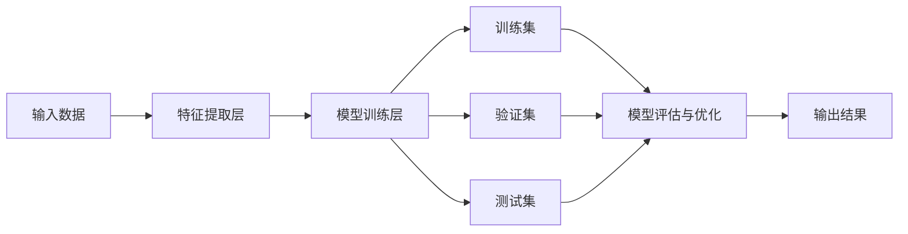

# 提高AI模型泛化能力的新方法探索

> 关键词：AI模型、泛化能力、新方法、正则化、数据增强

> 摘要：本文围绕提高AI模型泛化能力的新方法展开深入探讨。首先介绍了研究的背景、目的、预期读者等基本信息，接着阐述了与泛化能力相关的核心概念及其联系，详细讲解了核心算法原理并给出Python代码示例，分析了相关数学模型和公式，通过项目实战展示新方法的应用，探讨了实际应用场景，推荐了学习所需的工具和资源，最后总结了未来发展趋势与挑战，并提供常见问题解答和扩展阅读参考资料。旨在为相关领域的研究者和开发者提供全面的技术指导和思路启发。

## 1. 背景介绍 
### 1.1 目的和范围
在人工智能领域，模型的泛化能力是衡量其性能的关键指标之一。一个具有良好泛化能力的模型能够在未见过的数据上表现出稳定且准确的预测能力。然而，当前许多AI模型在训练数据上表现出色，但在实际应用场景中却容易出现过拟合现象，导致泛化能力不佳。本研究的目的在于探索提高AI模型泛化能力的新方法，范围涵盖了常见的机器学习和深度学习模型，如神经网络、决策树等。

### 1.2 预期读者
本文的预期读者包括人工智能领域的研究者、开发者、数据科学家以及对AI技术感兴趣的学生。对于正在从事AI模型开发和优化工作的专业人士，本文可以提供新的思路和方法；对于初学者，有助于他们深入理解模型泛化能力的重要性以及相关技术。

### 1.3 文档结构概述
本文将按照以下结构进行阐述：首先介绍相关背景信息，接着讲解与泛化能力相关的核心概念及其联系，然后详细分析核心算法原理和具体操作步骤，给出数学模型和公式，通过项目实战展示新方法的应用，探讨实际应用场景，推荐学习所需的工具和资源，最后总结未来发展趋势与挑战，并提供常见问题解答和扩展阅读参考资料。

### 1.4 术语表
#### 1.4.1 核心术语定义
- **泛化能力**：指模型在未参与训练的新数据上能够准确预测和表现的能力。一个泛化能力强的模型能够捕捉数据的内在规律，而不是仅仅记住训练数据。
- **过拟合**：模型在训练数据上表现过于良好，但在新数据上表现不佳的现象。过拟合通常是由于模型过于复杂，学习到了训练数据中的噪声和异常值。
- **正则化**：一种用于防止过拟合、提高模型泛化能力的技术。通过在损失函数中添加额外的惩罚项，限制模型的复杂度。

#### 1.4.2 相关概念解释
- **欠拟合**：与过拟合相反，欠拟合是指模型未能充分学习到数据的内在规律，在训练数据和新数据上的表现都较差。通常是由于模型过于简单，无法捕捉数据的复杂特征。
- **训练集、验证集和测试集**：训练集用于模型的训练，验证集用于调整模型的超参数，测试集用于评估模型的最终性能。合理划分数据集对于评估模型的泛化能力至关重要。

#### 1.4.3 缩略词列表
- **ML**：Machine Learning，机器学习
- **DL**：Deep Learning，深度学习
- **L1**：L1正则化，也称为Lasso正则化
- **L2**：L2正则化，也称为Ridge正则化

## 2. 核心概念与联系 
### 核心概念原理
#### 泛化能力的本质
泛化能力的本质是模型能够从训练数据中学习到通用的模式和规律，并将这些规律应用到未见过的数据上。一个具有良好泛化能力的模型应该能够忽略训练数据中的噪声和异常值，只关注数据的本质特征。

#### 过拟合和欠拟合的影响
过拟合会导致模型在训练数据上的误差很小，但在新数据上的误差很大。这是因为模型过于复杂，学习到了训练数据中的噪声和异常值，而这些特征在新数据中并不存在。欠拟合则是由于模型过于简单，无法捕捉数据的复杂特征，导致在训练数据和新数据上的表现都不佳。

#### 正则化的作用
正则化是一种常用的提高模型泛化能力的方法。它通过在损失函数中添加额外的惩罚项，限制模型的复杂度。例如，L1正则化会使模型的部分参数变为零，从而实现特征选择；L2正则化会使模型的参数值变小，避免参数过大导致过拟合。

### 架构的文本示意图
```plaintext
              输入数据
                 |
                 v
          特征提取层
                 |
                 v
          模型训练层
        /        |        \
  训练集     验证集     测试集
        \        |        /
                 v
      模型评估与优化
                 |
                 v
            输出结果
```

### Mermaid流程图


## 3. 核心算法原理 & 具体操作步骤 
### 正则化算法原理
#### L1正则化
L1正则化通过在损失函数中添加参数的绝对值之和作为惩罚项，公式如下：
$$J(\theta) = J_0(\theta) + \lambda \sum_{i=1}^{n} |\theta_i|$$
其中，$J_0(\theta)$ 是原始的损失函数，$\lambda$ 是正则化系数，$\theta_i$ 是模型的参数。

#### L2正则化
L2正则化通过在损失函数中添加参数的平方和作为惩罚项，公式如下：
$$J(\theta) = J_0(\theta) + \lambda \sum_{i=1}^{n} \theta_i^2$$

### Python代码示例
```python
import numpy as np
from sklearn.linear_model import Lasso, Ridge
from sklearn.datasets import make_regression
from sklearn.model_selection import train_test_split

# 生成示例数据
X, y = make_regression(n_samples=100, n_features=10, noise=0.5, random_state=42)
X_train, X_test, y_train, y_test = train_test_split(X, y, test_size=0.2, random_state=42)

# 使用L1正则化（Lasso回归）
lasso = Lasso(alpha=0.1)
lasso.fit(X_train, y_train)
lasso_pred = lasso.predict(X_test)

# 使用L2正则化（Ridge回归）
ridge = Ridge(alpha=0.1)
ridge.fit(X_train, y_train)
ridge_pred = ridge.predict(X_test)

print("Lasso预测结果:", lasso_pred)
print("Ridge预测结果:", ridge_pred)
```

### 具体操作步骤
1. **数据准备**：收集和整理数据集，并将其划分为训练集、验证集和测试集。
2. **模型选择**：根据具体问题选择合适的模型，如线性回归、神经网络等。
3. **正则化设置**：在模型训练过程中，添加正则化项。可以选择L1正则化、L2正则化或两者结合。
4. **超参数调整**：使用验证集调整正则化系数 $\lambda$ 等超参数，以达到最佳的泛化效果。
5. **模型评估**：使用测试集评估模型的性能，计算相关指标，如均方误差、准确率等。

## 4. 数学模型和公式 & 详细讲解 & 举例说明 
### 损失函数与正则化
#### 原始损失函数
对于线性回归问题，常用的损失函数是均方误差（MSE），公式如下：
$$J_0(\theta) = \frac{1}{2m} \sum_{i=1}^{m} (h_{\theta}(x^{(i)}) - y^{(i)})^2$$
其中，$m$ 是样本数量，$h_{\theta}(x^{(i)})$ 是模型的预测值，$y^{(i)}$ 是真实值。

#### 添加正则化后的损失函数
如前文所述，添加L1正则化后的损失函数为：
$$J(\theta) = \frac{1}{2m} \sum_{i=1}^{m} (h_{\theta}(x^{(i)}) - y^{(i)})^2 + \lambda \sum_{j=1}^{n} |\theta_j|$$
添加L2正则化后的损失函数为：
$$J(\theta) = \frac{1}{2m} \sum_{i=1}^{m} (h_{\theta}(x^{(i)}) - y^{(i)})^2 + \lambda \sum_{j=1}^{n} \theta_j^2$$

### 梯度下降法求解
为了最小化损失函数 $J(\theta)$，可以使用梯度下降法。对于L2正则化的线性回归，其梯度更新公式如下：
$$\theta_j := \theta_j - \alpha \left( \frac{1}{m} \sum_{i=1}^{m} (h_{\theta}(x^{(i)}) - y^{(i)}) x_j^{(i)} + \frac{\lambda}{m} \theta_j \right)$$
其中，$\alpha$ 是学习率。

### 举例说明
假设我们有一个简单的线性回归问题，数据集包含5个样本，每个样本有2个特征。原始损失函数为：
$$J_0(\theta) = \frac{1}{2\times5} \sum_{i=1}^{5} (h_{\theta}(x^{(i)}) - y^{(i)})^2$$
添加L2正则化后，损失函数变为：
$$J(\theta) = \frac{1}{10} \sum_{i=1}^{5} (h_{\theta}(x^{(i)}) - y^{(i)})^2 + 0.1 \sum_{j=1}^{2} \theta_j^2$$
使用梯度下降法更新参数 $\theta$，经过多次迭代后，模型的泛化能力将得到提高。

## 5. 项目实战：代码实际案例和详细解释说明 
### 5.1  开发环境搭建
#### 安装Python
首先需要安装Python，建议使用Python 3.7及以上版本。可以从Python官方网站（https://www.python.org/downloads/）下载并安装。

#### 安装必要的库
使用以下命令安装必要的库：
```sh
pip install numpy pandas scikit-learn tensorflow keras
```

### 5.2  源代码详细实现和代码解读
#### 数据加载与预处理
```python
import numpy as np
import pandas as pd
from sklearn.datasets import load_iris
from sklearn.model_selection import train_test_split
from sklearn.preprocessing import StandardScaler

# 加载鸢尾花数据集
iris = load_iris()
X = iris.data
y = iris.target

# 数据划分
X_train, X_test, y_train, y_test = train_test_split(X, y, test_size=0.2, random_state=42)

# 数据标准化
scaler = StandardScaler()
X_train = scaler.fit_transform(X_train)
X_test = scaler.transform(X_test)
```
代码解读：首先使用 `load_iris` 函数加载鸢尾花数据集，然后使用 `train_test_split` 函数将数据集划分为训练集和测试集，最后使用 `StandardScaler` 对数据进行标准化处理，以提高模型的训练效果。

#### 构建神经网络模型并添加正则化
```python
import tensorflow as tf
from tensorflow.keras.models import Sequential
from tensorflow.keras.layers import Dense
from tensorflow.keras.regularizers import l2

# 构建模型
model = Sequential([
    Dense(10, activation='relu', input_shape=(4,), kernel_regularizer=l2(0.01)),
    Dense(3, activation='softmax')
])

# 编译模型
model.compile(optimizer='adam',
              loss='sparse_categorical_crossentropy',
              metrics=['accuracy'])

# 训练模型
history = model.fit(X_train, y_train, epochs=50, validation_split=0.1)
```
代码解读：使用 `Sequential` 模型构建一个简单的神经网络，包含一个具有10个神经元的隐藏层和一个具有3个神经元的输出层。在隐藏层中添加了L2正则化，正则化系数为0.01。使用 `compile` 方法编译模型，指定优化器、损失函数和评估指标。最后使用 `fit` 方法训练模型，并记录训练过程中的损失和准确率。

#### 模型评估
```python
# 评估模型
test_loss, test_acc = model.evaluate(X_test, y_test)
print(f"测试集损失: {test_loss}, 测试集准确率: {test_acc}")
```
代码解读：使用 `evaluate` 方法对模型在测试集上的性能进行评估，输出测试集的损失和准确率。

### 5.3  代码解读与分析
通过上述代码，我们展示了如何在神经网络模型中添加正则化来提高模型的泛化能力。在数据预处理阶段，对数据进行标准化处理可以加快模型的收敛速度。在模型构建阶段，添加L2正则化可以限制模型的复杂度，避免过拟合。在训练过程中，使用验证集可以及时发现模型的过拟合问题，并调整超参数。最后，通过在测试集上评估模型的性能，可以得到模型的泛化能力的客观评价。

## 6. 实际应用场景 
### 图像识别
在图像识别领域，提高模型的泛化能力至关重要。由于图像数据的多样性和复杂性，模型容易出现过拟合现象。通过使用正则化、数据增强等方法，可以提高模型在不同场景下的识别准确率。例如，在人脸识别系统中，模型需要能够准确识别不同姿态、表情和光照条件下的人脸。

### 自然语言处理
在自然语言处理任务中，如文本分类、情感分析等，模型的泛化能力直接影响其性能。由于语言的多样性和歧义性，模型需要能够从训练数据中学习到通用的语言模式。通过使用预训练模型、正则化等方法，可以提高模型在不同数据集和任务上的泛化能力。

### 金融预测
在金融预测领域，如股票价格预测、信用风险评估等，模型的泛化能力对于准确预测和决策至关重要。金融数据具有高度的不确定性和复杂性，模型容易受到噪声和异常值的影响。通过使用正则化、特征选择等方法，可以提高模型的稳定性和泛化能力。

## 7. 工具和资源推荐
### 7.1 学习资源推荐
#### 7.1.1 书籍推荐
- 《机器学习》（周志华）：全面介绍了机器学习的基本概念、算法和应用，是机器学习领域的经典教材。
- 《深度学习》（Ian Goodfellow、Yoshua Bengio、Aaron Courville）：深度学习领域的权威著作，涵盖了深度学习的理论、算法和实践。
- 《Python机器学习实战》（Sebastian Raschka）：通过实际案例介绍了Python在机器学习中的应用，适合初学者入门。

#### 7.1.2 在线课程
- Coursera上的“机器学习”课程（Andrew Ng教授）：经典的机器学习课程，内容丰富，讲解详细。
- edX上的“深度学习”课程：由知名学者和企业专家授课，涵盖了深度学习的最新技术和应用。
- 吴恩达老师的“机器学习专项课程”：深入讲解了机器学习的各个方面，包括模型评估、优化等。

#### 7.1.3 技术博客和网站
- Medium：有许多机器学习和人工智能领域的优秀博客文章，涵盖了最新的研究成果和实践经验。
- Towards Data Science：专注于数据科学和机器学习领域的技术博客，提供了丰富的教程和案例。
- Kaggle：一个数据科学竞赛平台，不仅可以参与竞赛，还可以学习其他选手的优秀代码和经验。

### 7.2 开发工具框架推荐
#### 7.2.1 IDE和编辑器
- PyCharm：功能强大的Python集成开发环境，支持代码调试、自动补全、版本控制等功能。
- Jupyter Notebook：交互式的开发环境，适合进行数据探索和模型实验。
- Visual Studio Code：轻量级的代码编辑器，支持多种编程语言和插件扩展。

#### 7.2.2 调试和性能分析工具
- TensorBoard：TensorFlow的可视化工具，可以用于监控模型的训练过程、分析模型的性能等。
- PyTorch Profiler：PyTorch的性能分析工具，可以帮助开发者找出模型的性能瓶颈。
- Scikit-learn的GridSearchCV：用于超参数调优的工具，可以帮助开发者找到最优的超参数组合。

#### 7.2.3 相关框架和库
- TensorFlow：谷歌开发的深度学习框架，支持多种深度学习模型和算法。
- PyTorch：Facebook开发的深度学习框架，具有动态图的特点，易于使用和调试。
- Scikit-learn：一个简单而高效的机器学习库，提供了多种机器学习算法和工具。

### 7.3 相关论文著作推荐
#### 7.3.1 经典论文
- “Gradient-Based Learning Applied to Document Recognition”（Yann LeCun、Léon Bottou、Yoshua Bengio、Patrick Haffner）：介绍了卷积神经网络（CNN）在文档识别中的应用，是CNN领域的经典论文。
- “ImageNet Classification with Deep Convolutional Neural Networks”（Alex Krizhevsky、Ilya Sutskever、Geoffrey E. Hinton）：提出了AlexNet模型，开启了深度学习在图像识别领域的热潮。
- “Attention Is All You Need”（Ashish Vaswani、Noam Shazeer、Niki Parmar等）：提出了Transformer模型，在自然语言处理领域取得了巨大成功。

#### 7.3.2 最新研究成果
- 关注顶级学术会议，如NeurIPS、ICML、CVPR等，这些会议上发表的论文代表了人工智能领域的最新研究成果。
- 关注知名学术期刊，如Journal of Artificial Intelligence Research（JAIR）、Artificial Intelligence等，这些期刊上发表的论文具有较高的学术水平。

#### 7.3.3 应用案例分析
- 可以在Kaggle上找到许多实际应用案例，了解不同领域的模型设计和优化方法。
- 关注各大科技公司的技术博客，如谷歌、Facebook、微软等，他们会分享一些实际项目中的经验和成果。

## 8. 总结：未来发展趋势与挑战
### 未来发展趋势
#### 自适应正则化方法
未来可能会出现更加自适应的正则化方法，能够根据数据的特点和模型的状态自动调整正则化系数，从而更好地提高模型的泛化能力。

#### 融合多种方法
单一的方法可能无法完全解决模型的泛化问题，未来会更多地融合正则化、数据增强、模型融合等多种方法，以提高模型的性能和泛化能力。

#### 可解释性与泛化能力的结合
随着人工智能在一些关键领域的应用，如医疗、金融等，模型的可解释性变得越来越重要。未来的研究可能会将可解释性与泛化能力相结合，开发出既具有良好泛化能力又可解释的模型。

### 挑战
#### 数据质量和多样性
数据的质量和多样性对模型的泛化能力有着重要影响。获取高质量、多样化的数据仍然是一个挑战，特别是在一些特定领域，如医疗数据、金融数据等。

#### 计算资源和时间成本
提高模型的泛化能力通常需要进行大量的实验和调优，这会消耗大量的计算资源和时间。如何在有限的资源下快速有效地提高模型的泛化能力是一个亟待解决的问题。

#### 对抗攻击
随着模型的广泛应用，对抗攻击成为了一个严重的威胁。模型需要具备更强的鲁棒性，能够抵御各种对抗攻击，同时保持良好的泛化能力。

## 9. 附录：常见问题与解答
### 问题1：正则化系数 $\lambda$ 如何选择？
答：正则化系数 $\lambda$ 的选择通常需要通过交叉验证的方法。可以在验证集上尝试不同的 $\lambda$ 值，选择使模型性能最佳的 $\lambda$。一般来说，可以从较小的值开始尝试，如0.001、0.01、0.1等，然后逐步增大。

### 问题2：数据增强会对模型的训练时间有影响吗？
答：数据增强会增加训练数据的数量，从而增加模型的训练时间。但是，数据增强可以提高模型的泛化能力，减少过拟合的风险。在实际应用中，需要根据具体情况权衡训练时间和模型性能。

### 问题3：如何判断模型是否过拟合？
答：可以通过比较模型在训练集和验证集上的性能来判断是否过拟合。如果模型在训练集上的性能很好，但在验证集上的性能很差，说明模型可能过拟合。另外，也可以观察训练过程中的损失曲线和准确率曲线，如果训练集的损失不断下降，而验证集的损失开始上升，也说明模型可能过拟合。

## 10. 扩展阅读 & 参考资料
### 扩展阅读
- 《人工智能：一种现代的方法》（Stuart Russell、Peter Norvig）：全面介绍了人工智能的各个方面，包括知识表示、推理、机器学习等。
- 《强化学习：原理与Python实现》（杉山将）：详细介绍了强化学习的理论和算法，并提供了Python代码示例。

### 参考资料
- Scikit-learn官方文档：https://scikit-learn.org/stable/documentation.html
- TensorFlow官方文档：https://www.tensorflow.org/api_docs
- PyTorch官方文档：https://pytorch.org/docs/stable/index.html

作者：AI天才研究院/AI Genius Institute & 禅与计算机程序设计艺术 /Zen And The Art of Computer Programming