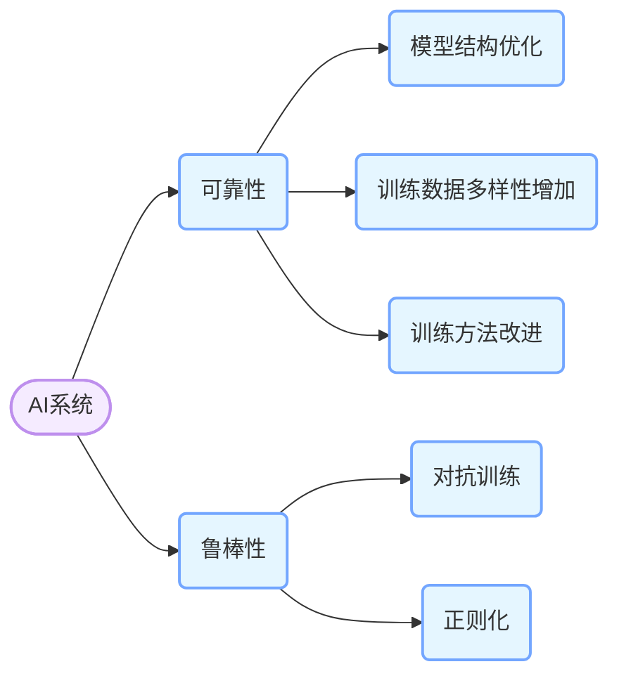

# 提高AI系统可靠性和鲁棒性的新方法

> 关键词：AI系统、可靠性、鲁棒性、新方法、对抗训练、模型融合

> 摘要：本文聚焦于提高AI系统可靠性和鲁棒性的新方法。首先介绍了相关背景知识，包括研究目的、预期读者、文档结构和术语表。接着阐述了核心概念及其联系，给出了原理和架构的文本示意图与Mermaid流程图。详细讲解了核心算法原理和具体操作步骤，并结合Python源代码进行说明。深入探讨了数学模型和公式，辅以举例。通过项目实战展示代码实际案例并进行详细解释。分析了实际应用场景，推荐了学习资源、开发工具框架和相关论文著作。最后总结了未来发展趋势与挑战，还设置了附录解答常见问题，并提供了扩展阅读和参考资料，旨在为提升AI系统的可靠性和鲁棒性提供全面且深入的指导。

## 1. 背景介绍 
### 1.1 目的和范围
随着AI技术在各个领域的广泛应用，如自动驾驶、医疗诊断、金融风控等，AI系统的可靠性和鲁棒性变得至关重要。可靠性指的是系统在规定条件下和规定时间内完成规定功能的能力，而鲁棒性则强调系统在面对各种干扰、噪声、异常输入等情况下仍能保持稳定性能的能力。本文章的目的在于探索和介绍提高AI系统可靠性和鲁棒性的新方法，涵盖从理论原理到实际应用的多个方面，包括算法设计、模型训练、实际项目中的应用等，为相关领域的研究者和开发者提供全面的参考。

### 1.2 预期读者
本文的预期读者包括AI领域的研究人员、软件开发工程师、数据科学家、对AI技术感兴趣的学生以及从事与AI系统应用相关行业的专业人士。无论是希望深入研究AI理论的学术人员，还是致力于将AI技术应用到实际项目中的工程人员，都能从本文中获取有价值的信息。

### 1.3 文档结构概述
本文将按照以下结构进行阐述：首先介绍核心概念与联系，让读者对AI系统的可靠性和鲁棒性有清晰的认识；接着详细讲解核心算法原理和具体操作步骤，结合Python代码进行说明；然后深入探讨数学模型和公式，并举例说明其应用；通过项目实战展示如何在实际中应用这些方法；分析实际应用场景；推荐相关的学习资源、开发工具框架和论文著作；最后总结未来发展趋势与挑战，解答常见问题并提供扩展阅读和参考资料。

### 1.4 术语表
#### 1.4.1 核心术语定义
- **AI系统**：人工智能系统，是利用计算机技术模拟人类智能的系统，能够进行学习、推理、决策等智能活动。
- **可靠性**：系统在规定的条件下和规定的时间内，完成规定功能的能力。在AI系统中，可靠性表现为模型在正常情况下准确执行任务的能力。
- **鲁棒性**：系统在存在不确定性、干扰、噪声等因素的情况下，仍能保持稳定性能的能力。在AI系统中，鲁棒性体现为模型对异常输入的适应能力。
- **对抗训练**：一种通过生成对抗样本并让模型学习应对这些样本的训练方法，旨在提高模型的鲁棒性。
- **模型融合**：将多个不同的模型组合起来，综合它们的预测结果，以提高系统的可靠性和性能。

#### 1.4.2 相关概念解释
- **对抗样本**：通过对正常输入进行微小的、精心设计的扰动而生成的样本，这些样本能够使模型产生错误的预测。例如，在图像识别中，对一张猫的图片添加微小的噪声，可能会使模型将其误识别为狗。
- **集成学习**：模型融合的一种常见方法，通过组合多个弱学习器来构建一个强学习器。常见的集成学习方法包括Bagging、Boosting和Stacking等。

#### 1.4.3 缩略词列表
- **ML**：Machine Learning，机器学习
- **DL**：Deep Learning，深度学习
- **GAN**：Generative Adversarial Networks，生成对抗网络

## 2. 核心概念与联系 

### 核心概念原理
AI系统的可靠性和鲁棒性是两个密切相关但又有所区别的概念。可靠性主要关注系统在正常情况下的稳定运行，而鲁棒性则侧重于系统在异常情况下的应对能力。提高可靠性可以通过优化模型结构、增加训练数据的多样性、改进训练方法等方式实现。例如，采用更复杂的神经网络结构可以提高模型的表达能力，从而更准确地完成任务；增加训练数据的多样性可以使模型学习到更多的特征，减少过拟合的风险。

提高鲁棒性的方法则主要集中在对抗训练、正则化等方面。对抗训练通过生成对抗样本并让模型学习应对这些样本，使模型能够更好地抵御外界的干扰。正则化则是通过在损失函数中添加额外的约束项，限制模型的复杂度，从而提高模型的泛化能力。

### 架构的文本示意图
```plaintext
AI系统
|-- 可靠性
|   |-- 模型结构优化
|   |-- 训练数据多样性增加
|   |-- 训练方法改进
|-- 鲁棒性
|   |-- 对抗训练
|   |-- 正则化
```

### Mermaid流程图


## 3. 核心算法原理 & 具体操作步骤 

### 对抗训练算法原理
对抗训练的核心思想是通过生成对抗样本，让模型学习如何应对这些样本，从而提高模型的鲁棒性。常见的生成对抗样本的方法有快速梯度符号法（FGSM）。FGSM的原理是通过计算损失函数关于输入的梯度，然后根据梯度的符号对输入进行微小的扰动，生成对抗样本。

### 具体操作步骤
1. **计算损失函数关于输入的梯度**：设输入为 $x$，标签为 $y$，模型为 $f(x)$，损失函数为 $L(f(x), y)$。则梯度为 $\nabla_x L(f(x), y)$。
2. **生成对抗样本**：根据梯度的符号对输入进行扰动，生成对抗样本 $x_{adv} = x + \epsilon \cdot sign(\nabla_x L(f(x), y))$，其中 $\epsilon$ 是扰动的步长。
3. **使用对抗样本进行训练**：将生成的对抗样本 $x_{adv}$ 输入到模型中进行训练，更新模型的参数。

### Python源代码实现
```python
import torch
import torch.nn as nn
import torch.optim as optim
import torchvision
import torchvision.transforms as transforms

# 定义一个简单的卷积神经网络
class SimpleCNN(nn.Module):
    def __init__(self):
        super(SimpleCNN, self).__init__()
        self.conv1 = nn.Conv2d(3, 6, 5)
        self.pool = nn.MaxPool2d(2, 2)
        self.conv2 = nn.Conv2d(6, 16, 5)
        self.fc1 = nn.Linear(16 * 5 * 5, 120)
        self.fc2 = nn.Linear(120, 84)
        self.fc3 = nn.Linear(84, 10)

    def forward(self, x):
        x = self.pool(torch.relu(self.conv1(x)))
        x = self.pool(torch.relu(self.conv2(x)))
        x = x.view(-1, 16 * 5 * 5)
        x = torch.relu(self.fc1(x))
        x = torch.relu(self.fc2(x))
        x = self.fc3(x)
        return x

# 加载数据集
transform = transforms.Compose(
    [transforms.ToTensor(),
     transforms.Normalize((0.5, 0.5, 0.5), (0.5, 0.5, 0.5))])

trainset = torchvision.datasets.CIFAR10(root='./data', train=True,
                                        download=True, transform=transform)
trainloader = torch.utils.data.DataLoader(trainset, batch_size=4,
                                          shuffle=True, num_workers=2)

testset = torchvision.datasets.CIFAR10(root='./data', train=False,
                                       download=True, transform=transform)
testloader = torch.utils.data.DataLoader(testset, batch_size=4,
                                         shuffle=False, num_workers=2)

# 初始化模型、损失函数和优化器
net = SimpleCNN()
criterion = nn.CrossEntropyLoss()
optimizer = optim.SGD(net.parameters(), lr=0.001, momentum=0.9)

# 对抗训练
epsilon = 0.01
for epoch in range(2):  # 训练2个epoch
    running_loss = 0.0
    for i, data in enumerate(trainloader, 0):
        inputs, labels = data
        inputs.requires_grad = True

        # 前向传播
        outputs = net(inputs)
        loss = criterion(outputs, labels)

        # 计算梯度
        optimizer.zero_grad()
        loss.backward()
        data_grad = inputs.grad.data

        # 生成对抗样本
        sign_data_grad = data_grad.sign()
        perturbed_inputs = inputs + epsilon * sign_data_grad
        perturbed_inputs = torch.clamp(perturbed_inputs, 0, 1)

        # 使用对抗样本进行训练
        outputs_adv = net(perturbed_inputs)
        loss_adv = criterion(outputs_adv, labels)
        loss_adv.backward()
        optimizer.step()

        running_loss += loss_adv.item()
        if i % 2000 == 1999:    # 每2000个batch打印一次损失
            print(f'[{epoch + 1}, {i + 1:5d}] loss: {running_loss / 2000:.3f}')
            running_loss = 0.0

print('Finished Training')
```

## 4. 数学模型和公式 & 详细讲解 & 举例说明 

### 快速梯度符号法（FGSM）公式
FGSM的核心公式为：
$$x_{adv} = x + \epsilon \cdot sign(\nabla_x L(f(x), y))$$
其中，$x$ 是原始输入，$y$ 是对应的标签，$f(x)$ 是模型的输出，$L(f(x), y)$ 是损失函数，$\nabla_x L(f(x), y)$ 是损失函数关于输入 $x$ 的梯度，$\epsilon$ 是扰动的步长，$sign(\cdot)$ 是符号函数。

### 详细讲解
- **梯度计算**：$\nabla_x L(f(x), y)$ 表示损失函数关于输入 $x$ 的梯度，它反映了输入的微小变化对损失函数值的影响。通过计算梯度，我们可以知道在哪个方向上对输入进行扰动可以使损失函数值增大。
- **符号函数**：$sign(\cdot)$ 函数将梯度的每个元素转换为其符号（正为1，负为 -1，零为0）。这样做的目的是为了快速确定扰动的方向，而不考虑梯度的具体大小。
- **扰动步长**：$\epsilon$ 控制了扰动的大小。如果 $\epsilon$ 过大，生成的对抗样本可能与原始输入相差过大，模型可能无法学习到有效的应对策略；如果 $\epsilon$ 过小，对抗样本对模型的影响可能不够明显，无法达到提高鲁棒性的目的。

### 举例说明
假设我们有一个简单的线性模型 $f(x) = wx + b$，其中 $w$ 和 $b$ 是模型的参数，输入 $x$ 是一个标量。损失函数采用均方误差损失 $L(f(x), y) = (f(x) - y)^2$。

首先计算梯度：
$$\nabla_x L(f(x), y) = 2(f(x) - y)w$$

假设 $w = 1$，$x = 2$，$y = 3$，则 $f(x) = 2 + b$，$L(f(x), y) = (2 + b - 3)^2 = (b - 1)^2$。$\nabla_x L(f(x), y) = 2(2 + b - 3) \times 1 = 2(b - 1)$。

如果 $b = 2$，则 $\nabla_x L(f(x), y) = 2$，$sign(\nabla_x L(f(x), y)) = 1$。假设 $\epsilon = 0.1$，则生成的对抗样本 $x_{adv} = 2 + 0.1 \times 1 = 2.1$。

## 5. 项目实战：代码实际案例和详细解释说明 

### 5.1  开发环境搭建
- **操作系统**：推荐使用Linux系统，如Ubuntu 18.04及以上版本，因为Linux系统在AI开发中具有良好的稳定性和兼容性。
- **Python环境**：安装Python 3.7及以上版本。可以使用Anaconda来管理Python环境，通过以下命令创建一个新的虚拟环境：
```bash
conda create -n ai_robustness python=3.8
conda activate ai_robustness
```
- **深度学习框架**：安装PyTorch，根据自己的CUDA版本选择合适的安装命令。例如，如果使用CUDA 11.1，可以使用以下命令安装：
```bash
pip install torch torchvision torchaudio --extra-index-url https://download.pytorch.org/whl/cu111
```

### 5.2  源代码详细实现和代码解读
```python
import torch
import torch.nn as nn
import torch.optim as optim
import torchvision
import torchvision.transforms as transforms

# 定义一个简单的卷积神经网络
class SimpleCNN(nn.Module):
    def __init__(self):
        super(SimpleCNN, self).__init__()
        self.conv1 = nn.Conv2d(3, 6, 5)  # 输入通道数为3，输出通道数为6，卷积核大小为5
        self.pool = nn.MaxPool2d(2, 2)  # 最大池化层，池化核大小为2，步长为2
        self.conv2 = nn.Conv2d(6, 16, 5)  # 输入通道数为6，输出通道数为16，卷积核大小为5
        self.fc1 = nn.Linear(16 * 5 * 5, 120)  # 全连接层，输入维度为16 * 5 * 5，输出维度为120
        self.fc2 = nn.Linear(120, 84)  # 全连接层，输入维度为120，输出维度为84
        self.fc3 = nn.Linear(84, 10)  # 全连接层，输入维度为84，输出维度为10

    def forward(self, x):
        x = self.pool(torch.relu(self.conv1(x)))  # 第一个卷积层 + ReLU激活函数 + 最大池化层
        x = self.pool(torch.relu(self.conv2(x)))  # 第二个卷积层 + ReLU激活函数 + 最大池化层
        x = x.view(-1, 16 * 5 * 5)  # 将特征图展平为一维向量
        x = torch.relu(self.fc1(x))  # 第一个全连接层 + ReLU激活函数
        x = torch.relu(self.fc2(x))  # 第二个全连接层 + ReLU激活函数
        x = self.fc3(x)  # 第三个全连接层
        return x

# 加载数据集
transform = transforms.Compose(
    [transforms.ToTensor(),
     transforms.Normalize((0.5, 0.5, 0.5), (0.5, 0.5, 0.5))])

trainset = torchvision.datasets.CIFAR10(root='./data', train=True,
                                        download=True, transform=transform)
trainloader = torch.utils.data.DataLoader(trainset, batch_size=4,
                                          shuffle=True, num_workers=2)

testset = torchvision.datasets.CIFAR10(root='./data', train=False,
                                       download=True, transform=transform)
testloader = torch.utils.data.DataLoader(testset, batch_size=4,
                                         shuffle=False, num_workers=2)

# 初始化模型、损失函数和优化器
net = SimpleCNN()
criterion = nn.CrossEntropyLoss()
optimizer = optim.SGD(net.parameters(), lr=0.001, momentum=0.9)

# 对抗训练
epsilon = 0.01
for epoch in range(2):  # 训练2个epoch
    running_loss = 0.0
    for i, data in enumerate(trainloader, 0):
        inputs, labels = data
        inputs.requires_grad = True  # 允许计算输入的梯度

        # 前向传播
        outputs = net(inputs)
        loss = criterion(outputs, labels)

        # 计算梯度
        optimizer.zero_grad()
        loss.backward()
        data_grad = inputs.grad.data

        # 生成对抗样本
        sign_data_grad = data_grad.sign()
        perturbed_inputs = inputs + epsilon * sign_data_grad
        perturbed_inputs = torch.clamp(perturbed_inputs, 0, 1)  # 确保输入值在[0, 1]范围内

        # 使用对抗样本进行训练
        outputs_adv = net(perturbed_inputs)
        loss_adv = criterion(outputs_adv, labels)
        loss_adv.backward()
        optimizer.step()

        running_loss += loss_adv.item()
        if i % 2000 == 1999:    # 每2000个batch打印一次损失
            print(f'[{epoch + 1}, {i + 1:5d}] loss: {running_loss / 2000:.3f}')
            running_loss = 0.0

print('Finished Training')
```

### 5.3  代码解读与分析
- **模型定义**：`SimpleCNN` 类定义了一个简单的卷积神经网络，包含两个卷积层、两个最大池化层和三个全连接层。通过 `forward` 方法定义了模型的前向传播过程。
- **数据集加载**：使用 `torchvision` 库加载CIFAR-10数据集，并进行预处理，包括转换为张量和归一化操作。
- **训练过程**：在每个epoch中，遍历训练数据集，对于每个batch的数据，首先进行前向传播计算损失，然后计算梯度。接着生成对抗样本，再次进行前向传播计算对抗样本的损失，并更新模型的参数。
- **对抗训练的作用**：通过使用对抗样本进行训练，模型能够学习到如何应对外界的干扰，从而提高模型的鲁棒性。

## 6. 实际应用场景 
### 自动驾驶
在自动驾驶领域，AI系统需要对各种复杂的路况和环境信息进行准确的感知和决策。提高AI系统的可靠性和鲁棒性可以确保自动驾驶车辆在面对恶劣天气、光照变化、道路损坏等异常情况时仍能安全行驶。例如，通过对抗训练可以使目标检测模型对图像中的噪声和干扰具有更强的抵抗力，减少误检测和漏检测的情况。

### 医疗诊断
医疗诊断中的AI系统用于辅助医生进行疾病诊断和治疗方案制定。可靠性和鲁棒性对于这些系统至关重要，因为错误的诊断结果可能会对患者的健康造成严重影响。通过模型融合等方法，可以综合多个不同模型的预测结果，提高诊断的准确性和可靠性。同时，对抗训练可以使模型对医学图像中的噪声和伪影具有更好的鲁棒性。

### 金融风控
金融风控领域的AI系统用于识别欺诈行为、评估信用风险等。提高系统的可靠性和鲁棒性可以有效防止金融诈骗和风险事件的发生。例如，通过正则化方法可以限制模型的复杂度，提高模型的泛化能力，从而更好地应对不同类型的金融数据和异常交易。

## 7. 工具和资源推荐
### 7.1 学习资源推荐
#### 7.1.1 书籍推荐
- 《深度学习》（Deep Learning）：由Ian Goodfellow、Yoshua Bengio和Aaron Courville所著，是深度学习领域的经典教材，全面介绍了深度学习的基本概念、算法和应用。
- 《Python深度学习》（Deep Learning with Python）：作者是Francois Chollet，结合Keras框架详细介绍了深度学习的实践方法，适合初学者快速入门。
- 《机器学习》（Machine Learning）：周志华教授所著，也被称为“西瓜书”，系统地介绍了机器学习的基本原理和常用算法。

#### 7.1.2 在线课程
- Coursera上的“深度学习专项课程”（Deep Learning Specialization）：由Andrew Ng教授授课，涵盖了深度学习的各个方面，包括神经网络、卷积神经网络、循环神经网络等。
- edX上的“人工智能基础”（Introduction to Artificial Intelligence）：介绍了人工智能的基本概念、算法和应用，适合初学者了解AI领域的全貌。
- 哔哩哔哩（B站）上有许多关于AI和深度学习的优质视频教程，如李沐老师的“动手学深度学习”系列课程。

#### 7.1.3 技术博客和网站
- Medium：上面有很多AI领域的专家分享的技术文章和实践经验。
- arXiv：是一个预印本平台，提供了大量最新的AI研究论文。
- 机器之心、新智元等国内的AI媒体网站，会及时报道AI领域的最新动态和技术进展。

### 7.2 开发工具框架推荐
#### 7.2.1 IDE和编辑器
- PyCharm：是一款专业的Python集成开发环境，具有强大的代码编辑、调试和项目管理功能。
- Jupyter Notebook：是一个交互式的开发环境，适合进行数据探索、模型训练和结果可视化等工作。
- Visual Studio Code：是一款轻量级的代码编辑器，支持多种编程语言和插件扩展，对Python开发也有很好的支持。

#### 7.2.2 调试和性能分析工具
- TensorBoard：是TensorFlow提供的可视化工具，可以用于监控模型的训练过程、查看损失函数和准确率的变化等。
- PyTorch Profiler：可以帮助开发者分析模型的性能瓶颈，找出耗时较长的操作和模块。
- NVIDIA Nsight Systems：用于分析GPU的性能，帮助开发者优化GPU代码。

#### 7.2.3 相关框架和库
- PyTorch：是一个开源的深度学习框架，具有动态图机制，易于使用和调试，广泛应用于学术界和工业界。
- TensorFlow：是另一个流行的深度学习框架，提供了丰富的工具和库，支持分布式训练和模型部署。
- Scikit-learn：是一个用于机器学习的Python库，提供了各种常用的机器学习算法和工具，如分类、回归、聚类等。

### 7.3 相关论文著作推荐
#### 7.3.1 经典论文
- Goodfellow, I. J., Shlens, J., & Szegedy, C. (2014). Explaining and harnessing adversarial examples. arXiv preprint arXiv:1412.6572. 该论文首次提出了对抗样本的概念，并介绍了快速梯度符号法（FGSM）。
- Breiman, L. (2001). Random forests. Machine learning, 45(1), 5-32. 介绍了随机森林算法，是集成学习领域的经典论文。
- Hinton, G. E., Osindero, S., & Teh, Y. W. (2006). A fast learning algorithm for deep belief nets. Neural computation, 18(7), 1527-1554. 提出了深度信念网络的快速学习算法，推动了深度学习的发展。

#### 7.3.2 最新研究成果
- 关注arXiv上的最新论文，特别是关于对抗鲁棒性、模型可靠性等方面的研究。例如，一些研究提出了新的对抗训练方法、鲁棒性评估指标等。
- 参加顶级的AI学术会议，如NeurIPS、ICML、CVPR等，了解最新的研究动态和成果。

#### 7.3.3 应用案例分析
- 许多大型科技公司会在自己的博客或技术报告中分享AI系统在实际应用中的案例和经验，如Google、Microsoft、Facebook等。
- Kaggle上有很多关于AI竞赛的案例和解决方案，可以学习到不同领域的实际应用技巧和方法。

## 8. 总结：未来发展趋势与挑战
### 未来发展趋势
- **多模态融合**：未来的AI系统将融合多种模态的数据，如图像、文本、语音等，以提高系统的可靠性和鲁棒性。例如，在自动驾驶中，结合摄像头图像、激光雷达数据和传感器信息可以更全面地感知环境。
- **自适应学习**：AI系统将具备自适应学习的能力，能够在运行过程中根据环境的变化自动调整模型参数和结构，以保持良好的性能。
- **可解释性和可靠性评估**：随着AI系统在关键领域的应用越来越广泛，对模型的可解释性和可靠性评估的需求也越来越高。未来的研究将更加关注如何让AI系统的决策过程可解释，以及如何准确评估系统的可靠性和鲁棒性。

### 挑战
- **对抗攻击的多样性**：随着对抗攻击技术的不断发展，攻击者可以使用更加复杂和隐蔽的方法生成对抗样本，这对AI系统的鲁棒性提出了更高的挑战。
- **数据质量和隐私问题**：提高AI系统的可靠性和鲁棒性需要大量高质量的数据，但数据的收集、标注和管理面临着诸多问题，如数据隐私、数据偏见等。
- **计算资源和效率**：一些提高可靠性和鲁棒性的方法，如对抗训练和模型融合，通常需要大量的计算资源和时间，如何在有限的资源下实现高效的训练和推理是一个亟待解决的问题。

## 9. 附录：常见问题与解答
### 问题1：对抗训练一定会提高模型的鲁棒性吗？
不一定。对抗训练虽然是提高模型鲁棒性的有效方法，但如果参数设置不当，如扰动步长 $\epsilon$ 过大或过小，或者训练数据不具有代表性，可能会导致模型的性能下降。此外，对抗训练可能会降低模型在正常样本上的准确率，需要在鲁棒性和准确性之间进行权衡。

### 问题2：模型融合的方法有哪些？
常见的模型融合方法包括投票法、平均法、Stacking和Blending等。投票法是根据多个模型的预测结果进行投票，选择得票最多的类别作为最终预测结果；平均法是将多个模型的预测结果进行平均；Stacking是通过训练一个新的模型来综合多个基模型的预测结果；Blending与Stacking类似，但在验证集上进行模型融合。

### 问题3：如何评估AI系统的可靠性和鲁棒性？
评估AI系统的可靠性可以通过计算模型在正常样本上的准确率、召回率、F1值等指标。评估鲁棒性可以使用对抗样本攻击测试，计算模型在对抗样本上的准确率；也可以使用鲁棒性评估指标，如Lp范数距离、可迁移性等。

## 10. 扩展阅读 & 参考资料
### 扩展阅读
- 《人工智能：现代方法》（Artificial Intelligence: A Modern Approach）：全面介绍了人工智能的各个领域，包括搜索算法、知识表示、机器学习、自然语言处理等。
- 《强化学习：原理与Python实现》：详细介绍了强化学习的基本原理和算法，并通过Python代码进行实现。

### 参考资料
- Goodfellow, I. J., Bengio, Y., & Courville, A. (2016). Deep learning. MIT press.
- Chollet, F. (2017). Deep learning with Python. Manning Publications.
- Zhou, Z. H. (2016). Machine learning. Tsinghua University Press.

作者：AI天才研究院/AI Genius Institute & 禅与计算机程序设计艺术 /Zen And The Art of Computer Programming