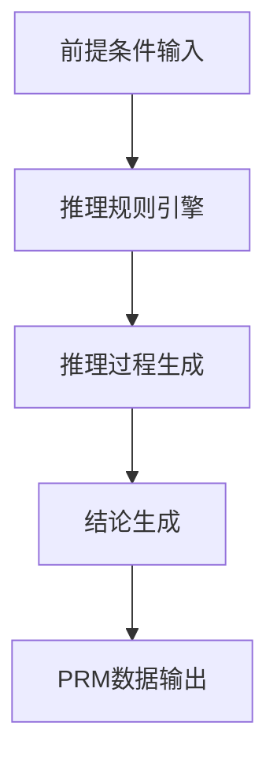

# 数学推理任务中PRM数据合成的推荐方法

> 关键词：数学推理任务、PRM数据合成、推荐方法、数据增强、推理算法

> 摘要：本文围绕数学推理任务中PRM（Premise - Reasoning - Conclusion，前提 - 推理 - 结论）数据合成的推荐方法展开深入探讨。首先介绍了相关背景，包括研究目的、预期读者、文档结构和术语定义等。接着阐述了核心概念与联系，通过文本示意图和Mermaid流程图展示其原理和架构。详细讲解了核心算法原理和具体操作步骤，并用Python源代码进行了阐述。分析了相关数学模型和公式，并举例说明。通过项目实战给出代码实际案例及详细解释。探讨了实际应用场景，推荐了相关的工具和资源。最后总结了未来发展趋势与挑战，提供了常见问题解答和扩展阅读参考资料。旨在为数学推理领域的数据合成提供全面且深入的技术指导。

## 1. 背景介绍 
### 1.1 目的和范围
在数学推理任务中，高质量的数据对于训练准确有效的推理模型至关重要。然而，现实中可用的标注数据往往有限，这限制了模型的性能。PRM数据合成的推荐方法旨在通过合成具有前提、推理过程和结论的结构化数据，来扩充训练数据集，提高数学推理模型的泛化能力和准确性。本文的范围涵盖了PRM数据合成的核心概念、算法原理、数学模型、实际应用案例以及相关工具资源等方面，旨在为研究人员和开发者提供全面的技术指导。

### 1.2 预期读者
本文预期读者包括从事数学推理、自然语言处理、机器学习等领域的研究人员、开发者，以及对人工智能在数学教育、智能解题等应用场景感兴趣的专业人士。无论您是初学者希望了解PRM数据合成的基本原理，还是有一定经验的从业者寻求更深入的技术细节和实践经验，本文都将为您提供有价值的信息。

### 1.3 文档结构概述
本文共分为十个部分。第一部分是背景介绍，阐述研究目的、预期读者、文档结构和术语表。第二部分介绍核心概念与联系，通过文本示意图和Mermaid流程图展示PRM数据合成的原理和架构。第三部分详细讲解核心算法原理和具体操作步骤，并给出Python源代码。第四部分分析相关数学模型和公式，并举例说明。第五部分通过项目实战给出代码实际案例及详细解释。第六部分探讨实际应用场景。第七部分推荐相关的工具和资源。第八部分总结未来发展趋势与挑战。第九部分是附录，提供常见问题解答。第十部分给出扩展阅读和参考资料。

### 1.4 术语表
#### 1.4.1 核心术语定义
- **PRM数据**：即Premise - Reasoning - Conclusion数据，由前提条件、推理过程和最终结论三部分组成的结构化数据，用于数学推理任务的训练和评估。
- **数据合成**：通过一定的算法和规则，从已有的数据或知识中生成新的数据的过程。
- **数学推理任务**：涉及对数学问题进行逻辑分析、推导和求解的任务，如代数证明、几何推理等。
- **泛化能力**：模型在未见过的数据上的表现能力，即能够从训练数据中学习到通用的模式并应用到新的数据上。

#### 1.4.2 相关概念解释
- **前提条件（Premise）**：是数学问题的初始设定和已知信息，是进行推理的基础。
- **推理过程（Reasoning）**：根据前提条件，运用数学规则和逻辑方法逐步推导得出结论的步骤序列。
- **结论（Conclusion）**：是经过推理过程得到的最终结果。

#### 1.4.3 缩略词列表
- **PRM**：Premise - Reasoning - Conclusion
- **NLP**：Natural Language Processing（自然语言处理）
- **ML**：Machine Learning（机器学习）

## 2. 核心概念与联系 

### 核心概念原理
PRM数据合成的核心原理是基于数学知识和逻辑规则，从给定的前提条件出发，通过一系列的推理步骤生成合理的结论，并记录整个推理过程。其基本思想是模拟人类的数学推理思维，将数学问题的解决过程形式化为前提、推理和结论的结构化数据。

在实际应用中，我们可以利用已有的数学知识库，如数学定理、公式和算法，结合一定的推理策略，生成不同类型的PRM数据。例如，在代数推理中，我们可以根据已知的方程和运算法则，推导出方程的解，并记录每一步的推理依据。

### 架构的文本示意图
```plaintext
+----------------+
|  前提条件输入  |
+----------------+
        |
        v
+----------------+
|  推理规则引擎  |
+----------------+
        |
        v
+----------------+
|  推理过程生成  |
+----------------+
        |
        v
+----------------+
|  结论生成      |
+----------------+
        |
        v
+----------------+
|  PRM数据输出  |
+----------------+
```

### Mermaid流程图


这个流程图展示了PRM数据合成的基本流程。首先，输入前提条件，然后通过推理规则引擎根据数学规则和逻辑进行推理，生成推理过程，进而得出结论，最终输出PRM数据。

## 3. 核心算法原理 & 具体操作步骤 

### 核心算法原理
PRM数据合成的核心算法可以基于规则推理和机器学习相结合的方法。规则推理部分使用预定义的数学规则和逻辑规则，对前提条件进行逐步推导。机器学习部分可以用于学习推理模式和规则，提高推理的准确性和效率。

具体来说，算法的主要步骤包括：
1. **前提条件解析**：将输入的前提条件进行解析，提取关键信息，如变量、常量、运算符等。
2. **推理规则匹配**：根据解析后的前提条件，在规则库中查找适用的推理规则。
3. **推理步骤生成**：应用匹配到的推理规则，生成新的中间结论，并记录推理过程。
4. **终止条件判断**：判断是否达到推理的终止条件，如得出最终结论或无法继续推理。
5. **结论生成**：如果达到终止条件，输出最终结论。

### 具体操作步骤及Python源代码

```python
# 定义前提条件类
class Premise:
    def __init__(self, statement):
        self.statement = statement

    def parse(self):
        # 简单示例：解析前提条件为一个字符串列表
        return self.statement.split()

# 定义推理规则类
class ReasoningRule:
    def __init__(self, premise_pattern, conclusion_pattern):
        self.premise_pattern = premise_pattern
        self.conclusion_pattern = conclusion_pattern

    def match(self, premise):
        # 简单示例：检查前提条件是否匹配规则的前提模式
        parsed_premise = premise.parse()
        return parsed_premise == self.premise_pattern

    def apply(self, premise):
        # 简单示例：应用规则生成结论
        return self.conclusion_pattern

# 定义推理引擎类
class ReasoningEngine:
    def __init__(self, rules):
        self.rules = rules

    def reason(self, premise):
        reasoning_process = []
        current_premise = premise
        while True:
            matched_rule = None
            for rule in self.rules:
                if rule.match(current_premise):
                    matched_rule = rule
                    break
            if matched_rule is None:
                break
            conclusion = matched_rule.apply(current_premise)
            reasoning_process.append((current_premise.statement, conclusion))
            current_premise = Premise(conclusion)
        final_conclusion = current_premise.statement
        return reasoning_process, final_conclusion

# 示例使用
if __name__ == "__main__":
    # 定义前提条件
    premise = Premise("2 + 3")
    # 定义推理规则
    rule = ReasoningRule(["2", "+", "3"], "5")
    rules = [rule]
    # 创建推理引擎
    engine = ReasoningEngine(rules)
    # 进行推理
    reasoning_process, final_conclusion = engine.reason(premise)
    print("推理过程:", reasoning_process)
    print("最终结论:", final_conclusion)
```

### 代码解释
- `Premise`类：用于表示前提条件，`parse`方法将前提条件解析为一个字符串列表。
- `ReasoningRule`类：表示推理规则，`match`方法检查前提条件是否匹配规则的前提模式，`apply`方法应用规则生成结论。
- `ReasoningEngine`类：推理引擎，`reason`方法进行推理，记录推理过程并返回最终结论。

通过这个示例，我们可以看到如何实现一个简单的PRM数据合成算法。

## 4. 数学模型和公式 & 详细讲解 & 举例说明 

### 数学模型
PRM数据合成的数学模型可以基于逻辑推理和概率模型。在逻辑推理方面，我们可以使用一阶逻辑或命题逻辑来表示前提条件、推理规则和结论。例如，在一阶逻辑中，前提条件可以表示为一组谓词公式，推理规则可以表示为蕴含式，结论可以表示为通过推理得到的新的谓词公式。

在概率模型方面，我们可以使用贝叶斯网络或马尔可夫逻辑网络来处理不确定性和概率推理。例如，在贝叶斯网络中，每个节点表示一个随机变量，边表示变量之间的依赖关系，通过计算条件概率来进行推理。

### 数学公式
#### 一阶逻辑示例
假设我们有以下前提条件和推理规则：
- 前提条件：$P(x)$（表示$x$具有属性$P$）
- 推理规则：$\forall x (P(x) \to Q(x))$（表示对于所有的$x$，如果$x$具有属性$P$，则$x$具有属性$Q$）
- 结论：$Q(x)$

通过应用推理规则，我们可以从前提条件推导出结论。

#### 贝叶斯网络示例
假设我们有一个简单的贝叶斯网络，包含两个节点$A$和$B$，它们之间的条件概率为$P(B|A)$。根据贝叶斯定理，我们可以计算$P(A|B)$：
$$P(A|B) = \frac{P(B|A)P(A)}{P(B)}$$

### 详细讲解
在一阶逻辑中，推理过程是基于逻辑规则进行的，如肯定前件规则（Modus Ponens）：如果我们有$P$和$P \to Q$，那么我们可以推出$Q$。在贝叶斯网络中，推理过程是基于概率计算的，通过已知的条件概率和先验概率来计算后验概率。

### 举例说明
#### 一阶逻辑举例
假设我们有以下前提条件和推理规则：
- 前提条件：“所有的人都会死亡”，可以表示为$\forall x (Person(x) \to Mortal(x))$；“苏格拉底是人”，可以表示为$Person(Socrates)$。
- 推理规则：肯定前件规则。
- 结论：“苏格拉底会死亡”，可以表示为$Mortal(Socrates)$。

通过应用肯定前件规则，我们可以从前提条件推导出结论。

#### 贝叶斯网络举例
假设我们要根据天气情况预测是否会下雨。我们有一个简单的贝叶斯网络，包含两个节点：“多云”（$A$）和“下雨”（$B$）。已知$P(A) = 0.3$（多云的先验概率），$P(B|A) = 0.7$（在多云的情况下下雨的条件概率），$P(B|\neg A) = 0.2$（在非多云的情况下下雨的条件概率）。

首先，我们需要计算$P(B)$：
$$P(B) = P(B|A)P(A) + P(B|\neg A)P(\neg A) = 0.7 \times 0.3 + 0.2 \times (1 - 0.3) = 0.35$$

然后，我们可以计算$P(A|B)$：
$$P(A|B) = \frac{P(B|A)P(A)}{P(B)} = \frac{0.7 \times 0.3}{0.35} = 0.6$$

这意味着在下雨的情况下，多云的概率为$0.6$。

## 5. 项目实战：代码实际案例和详细解释说明 

### 5.1  开发环境搭建
为了实现PRM数据合成的项目，我们可以使用Python作为开发语言，并安装一些必要的库，如`sympy`用于符号计算，`numpy`用于数值计算。以下是搭建开发环境的步骤：

1. 安装Python：可以从Python官方网站（https://www.python.org/downloads/）下载并安装Python 3.x版本。
2. 创建虚拟环境：使用`venv`模块创建一个虚拟环境，以隔离项目的依赖。
```bash
python -m venv prm_env
source prm_env/bin/activate  # 在Windows上使用 prm_env\Scripts\activate
```
3. 安装依赖库：
```bash
pip install sympy numpy
```

### 5.2  源代码详细实现和代码解读
以下是一个使用`sympy`库进行代数推理的PRM数据合成的代码示例：

```python
import sympy as sp

# 定义前提条件
x = sp.Symbol('x')
premise = sp.Eq(x + 2, 5)

# 定义推理规则：等式两边同时减去一个数，等式仍然成立
def subtract_rule(equation, value):
    new_equation = sp.Eq(equation.lhs - value, equation.rhs - value)
    return new_equation

# 进行推理
step1 = subtract_rule(premise, 2)
solution = sp.solve(step1, x)[0]

# 生成PRM数据
prm_data = {
    "前提条件": str(premise),
    "推理过程": [
        f"等式两边同时减去2：{premise} -> {step1}"
    ],
    "结论": f"x = {solution}"
}

# 输出PRM数据
print("PRM数据:")
for key, value in prm_data.items():
    print(f"{key}: {value}")
```

### 代码解读与分析
- **前提条件定义**：使用`sympy`库定义一个符号变量`x`，并创建一个等式`x + 2 = 5`作为前提条件。
- **推理规则定义**：定义一个`subtract_rule`函数，用于实现等式两边同时减去一个数的推理规则。
- **推理过程**：应用推理规则，将等式两边同时减去2，得到新的等式`x = 3`。
- **结论生成**：使用`sympy`的`solve`函数求解方程，得到`x`的值。
- **PRM数据生成**：将前提条件、推理过程和结论存储在一个字典中，生成PRM数据。

通过这个示例，我们可以看到如何使用`sympy`库进行代数推理，并生成PRM数据。

## 6. 实际应用场景 
### 数学教育
在数学教育中，PRM数据合成可以用于生成多样化的练习题和解答过程，帮助学生更好地理解数学概念和推理方法。例如，教师可以使用PRM数据合成工具生成不同难度级别的代数方程、几何证明题等，并提供详细的推理过程和解答，让学生进行练习和学习。

### 智能解题系统
智能解题系统可以利用PRM数据合成技术，自动生成数学问题的解答过程。当用户输入一个数学问题时，系统可以根据问题的前提条件，通过PRM数据合成算法生成推理过程和结论，并展示给用户。这样可以帮助用户快速解决数学问题，同时提供详细的解题思路。

### 数学研究
在数学研究中，PRM数据合成可以用于验证数学猜想和发现新的数学规律。研究人员可以通过合成大量的PRM数据，分析推理过程和结论，寻找潜在的数学模式和规律。例如，在数论研究中，可以通过合成不同的数论问题的PRM数据，探索数的性质和关系。

### 机器学习模型训练
在机器学习领域，PRM数据合成可以用于扩充训练数据集，提高模型的泛化能力。例如，在数学推理任务的机器学习模型训练中，可以使用PRM数据合成算法生成更多的训练数据，让模型学习到更丰富的推理模式和规则，从而提高模型的性能。

## 7. 工具和资源推荐
### 7.1 学习资源推荐
#### 7.1.1 书籍推荐
- 《数学分析原理》（Walter Rudin）：经典的数学分析教材，介绍了数学分析的基本概念和方法，对于理解数学推理的基础非常有帮助。
- 《人工智能：一种现代的方法》（Stuart Russell, Peter Norvig）：全面介绍了人工智能的各个领域，包括逻辑推理、机器学习等，对于了解人工智能在数学推理中的应用有很大的帮助。
- 《Python科学计算》（Travis Oliphant）：介绍了使用Python进行科学计算的方法和工具，包括`numpy`、`sympy`等库的使用，对于实现PRM数据合成的代码有指导作用。

#### 7.1.2 在线课程
- Coursera上的“Mathematics for Machine Learning”课程：介绍了机器学习中所需的数学知识，包括线性代数、概率论等，对于理解数学推理在机器学习中的应用有帮助。
- edX上的“Artificial Intelligence”课程：由麻省理工学院（MIT）提供，全面介绍了人工智能的基本概念和方法，包括逻辑推理和搜索算法等。
- 中国大学MOOC上的“Python语言程序设计”课程：适合初学者学习Python编程，掌握Python的基本语法和常用库的使用，为实现PRM数据合成的代码打下基础。

#### 7.1.3 技术博客和网站
- arXiv（https://arxiv.org/）：提供了大量的学术论文，包括数学推理、人工智能等领域的最新研究成果，可以及时了解该领域的前沿动态。
- Towards Data Science（https://towardsdatascience.com/）：一个专注于数据科学和机器学习的技术博客，有很多关于数学推理和数据合成的文章和教程。
- Stack Overflow（https://stackoverflow.com/）：一个程序员社区，提供了大量的技术问题解答和代码示例，对于解决PRM数据合成过程中遇到的技术问题非常有帮助。

### 7.2 开发工具框架推荐
#### 7.2.1 IDE和编辑器
- PyCharm：一款功能强大的Python集成开发环境（IDE），提供了代码编辑、调试、版本控制等功能，适合开发PRM数据合成的Python代码。
- Jupyter Notebook：一个交互式的开发环境，支持Python等多种编程语言，可以方便地进行代码的编写、运行和可视化，适合进行算法的实验和验证。
- Visual Studio Code：一款轻量级的代码编辑器，支持多种编程语言和插件扩展，具有丰富的代码编辑和调试功能，适合快速开发和调试PRM数据合成的代码。

#### 7.2.2 调试和性能分析工具
- pdb：Python内置的调试器，可以在代码中设置断点，逐行调试代码，帮助定位和解决代码中的问题。
- cProfile：Python标准库中的性能分析工具，可以分析代码的运行时间和函数调用次数，帮助优化代码的性能。
- Py-Spy：一个用于Python代码的性能分析工具，可以实时监控代码的运行状态，找出性能瓶颈。

#### 7.2.3 相关框架和库
- sympy：一个用于符号计算的Python库，可以进行代数运算、微积分、方程求解等，适合实现数学推理的符号计算部分。
- numpy：一个用于数值计算的Python库，提供了高效的数组和矩阵运算功能，适合处理大规模的数值数据。
- scikit-learn：一个用于机器学习的Python库，提供了各种机器学习算法和工具，如分类、回归、聚类等，可以用于训练数学推理模型。

### 7.3 相关论文著作推荐
#### 7.3.1 经典论文
- "Automated Theorem Proving: A Logical Basis"（Donald W. Loveland）：介绍了自动定理证明的基本原理和方法，对于理解数学推理的自动化过程有重要的参考价值。
- "Probabilistic Reasoning in Intelligent Systems: Networks of Plausible Inference"（Judea Pearl）：阐述了概率推理的理论和方法，特别是贝叶斯网络的应用，对于处理不确定性推理有很大的帮助。
- "Learning to Reason: End - to - End Module Networks for Visual Question Answering"（Jacob Andreas et al.）：提出了一种用于视觉问答的端到端模块网络，展示了如何将推理和学习相结合，对于数学推理任务的模型设计有启发作用。

#### 7.3.2 最新研究成果
- 在每年的人工智能和机器学习领域的顶级会议（如NeurIPS、ICML、ACL等）上，都会有关于数学推理和数据合成的最新研究成果发表。可以关注这些会议的论文，了解该领域的最新动态。
- 一些知名的学术期刊（如Journal of Artificial Intelligence Research、Artificial Intelligence等）也会发表相关的高质量研究论文。

#### 7.3.3 应用案例分析
- 可以参考一些实际应用中使用PRM数据合成技术的案例分析，了解如何将理论方法应用到实际项目中。例如，一些智能教育平台或解题软件的技术文档和博客文章，会介绍他们在数学推理和数据合成方面的实践经验。

## 8. 总结：未来发展趋势与挑战
### 未来发展趋势
#### 与深度学习的深度融合
随着深度学习技术的不断发展，PRM数据合成将与深度学习模型更加紧密地结合。例如，利用深度学习模型学习推理模式和规则，提高推理的准确性和效率。同时，PRM数据合成也可以为深度学习模型提供更多高质量的训练数据，进一步提升模型的性能。

#### 多模态数据合成
未来的PRM数据合成将不仅仅局限于文本数据，还将涉及图像、语音等多模态数据。例如，在几何推理中，可以结合图像信息进行推理和数据合成；在数学讲解中，可以将语音信息与推理过程相结合，生成更加丰富的PRM数据。

#### 跨领域应用拓展
PRM数据合成技术将在更多的领域得到应用，如物理、化学、生物等科学领域，以及金融、医疗等应用领域。通过将数学推理与其他领域的知识相结合，可以解决更加复杂的问题，推动各领域的智能化发展。

### 挑战
#### 知识表示和推理规则的复杂性
数学知识和推理规则非常复杂，如何有效地表示和管理这些知识，以及如何设计高效的推理算法，是一个巨大的挑战。特别是在处理高阶逻辑和复杂的数学概念时，现有的方法还存在一定的局限性。

#### 数据质量和多样性
虽然数据合成可以扩充训练数据集，但生成的数据质量和多样性仍然是一个问题。如果生成的数据与实际数据存在较大差异，或者缺乏足够的多样性，可能会导致模型的泛化能力下降。因此，如何生成高质量、多样化的PRM数据是一个需要解决的关键问题。

#### 计算资源和效率
PRM数据合成通常需要大量的计算资源和时间，特别是在处理大规模的数据集和复杂的推理任务时。如何优化算法，提高计算效率，降低计算成本，是未来发展需要面对的挑战之一。

## 9. 附录：常见问题与解答
### 问题1：PRM数据合成是否可以应用于所有类型的数学问题？
解答：PRM数据合成可以应用于许多类型的数学问题，如代数、几何、逻辑推理等。但对于一些非常复杂和开放的数学问题，目前的技术还存在一定的局限性。例如，一些需要创造性思维和直觉的数学问题，可能难以通过现有的数据合成方法来解决。

### 问题2：如何评估生成的PRM数据的质量？
解答：可以从以下几个方面评估生成的PRM数据的质量：
- **逻辑正确性**：推理过程和结论是否符合数学逻辑和规则。
- **完整性**：推理过程是否完整，是否包含了所有必要的步骤。
- **多样性**：生成的数据是否具有足够的多样性，是否涵盖了不同类型的问题和推理方法。
- **与实际数据的相似度**：生成的数据是否与实际的数学推理数据相似。

### 问题3：在实际应用中，如何选择合适的推理规则和算法？
解答：选择合适的推理规则和算法需要考虑以下因素：
- **问题类型**：不同类型的数学问题可能需要不同的推理规则和算法。例如，代数问题可能更适合使用符号计算和方程求解算法，而几何问题可能需要使用图形推理和空间分析算法。
- **数据特点**：如果数据具有一定的概率分布或不确定性，可能需要使用概率推理算法；如果数据是结构化的，可以使用基于规则的推理算法。
- **计算资源和效率**：考虑实际应用中的计算资源和时间限制，选择计算效率高的算法。

### 问题4：PRM数据合成与传统的数据增强方法有什么区别？
解答：传统的数据增强方法主要是对已有数据进行变换和扩充，如图像数据的旋转、翻转等。而PRM数据合成是基于数学知识和逻辑规则，从前提条件出发生成新的数据，包括推理过程和结论。PRM数据合成更加注重数据的逻辑性和推理过程的完整性，而不仅仅是数据的表面变换。

## 10. 扩展阅读 & 参考资料
### 扩展阅读
- 《离散数学及其应用》（Kenneth H. Rosen）：介绍了离散数学的基本概念和方法，包括逻辑、集合、图论等，对于理解数学推理的基础非常有帮助。
- 《深度学习》（Ian Goodfellow, Yoshua Bengio, Aaron Courville）：全面介绍了深度学习的理论和方法，对于了解深度学习在数学推理中的应用有很大的帮助。
- 《人工智能中的不确定性》（Bonnie Berger, Thomas S. Ferguson, Robert M. Freund）：探讨了人工智能中处理不确定性的方法和技术，对于处理PRM数据合成中的不确定性推理有参考价值。

### 参考资料
- [SymPy官方文档](https://docs.sympy.org/latest/index.html)：提供了`sympy`库的详细文档和使用示例，对于使用`sympy`进行符号计算非常有帮助。
- [NumPy官方文档](https://numpy.org/doc/stable/)：提供了`numpy`库的详细文档和使用教程，对于使用`numpy`进行数值计算有指导作用。
- [scikit-learn官方文档](https://scikit-learn.org/stable/)：提供了`scikit-learn`库的详细文档和示例代码，对于使用`scikit-learn`进行机器学习模型训练有帮助。

作者：AI天才研究院/AI Genius Institute & 禅与计算机程序设计艺术 /Zen And The Art of Computer Programming