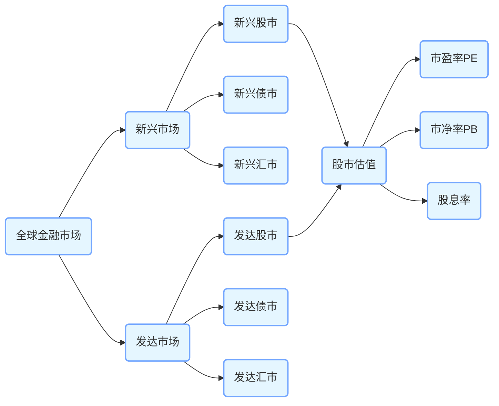

# 新兴市场vs发达市场:股市估值比较

> 关键词：新兴市场、发达市场、股市估值、估值比较、投资分析

> 摘要：本文旨在深入比较新兴市场和发达市场的股市估值情况。通过对核心概念的阐述、相关算法原理的分析、数学模型的构建，结合实际项目案例，探讨两个市场在股市估值上的差异。同时分析不同市场估值的实际应用场景，推荐相关学习资源、开发工具和论文著作。最后总结未来股市估值的发展趋势与挑战，并提供常见问题解答和扩展阅读资料，为投资者和研究人员全面了解新兴市场和发达市场股市估值提供有价值的参考。

## 1. 背景介绍 
### 1.1 目的和范围
本研究的主要目的是系统地比较新兴市场和发达市场的股市估值。随着全球经济的不断发展，新兴市场在国际金融领域的地位日益重要，其股市表现也吸引了越来越多投资者的关注。与发达市场相比，新兴市场在经济结构、政策环境、市场成熟度等方面存在显著差异，这些差异反映在股市估值上，会对投资者的决策产生重要影响。本文将涵盖新兴市场和发达市场股市估值的多个方面，包括常用的估值指标、影响估值的因素、不同市场估值的特点及差异等，旨在为投资者和研究人员提供全面的视角和深入的分析。

### 1.2 预期读者
本文预期读者包括金融投资者、金融分析师、学术研究人员以及对金融市场感兴趣的人士。对于投资者来说，了解新兴市场和发达市场的股市估值差异有助于优化投资组合，提高投资收益；金融分析师可以借助本文的分析方法和结论，为客户提供更专业的投资建议；学术研究人员可以将本文作为进一步研究的参考，深入探讨股市估值的相关理论和实践问题；而对金融市场感兴趣的人士可以通过本文初步了解新兴市场和发达市场股市估值的基本概念和分析方法。

### 1.3 文档结构概述
本文将按照以下结构进行阐述：首先介绍核心概念，明确新兴市场、发达市场和股市估值的定义及相互关系，并通过文本示意图和 Mermaid 流程图进行展示；接着讲解核心算法原理和具体操作步骤，使用 Python 源代码详细阐述估值计算方法；然后介绍相关的数学模型和公式，并结合实际例子进行说明；再通过项目实战，展示代码实际案例并进行详细解释；之后分析新兴市场和发达市场股市估值的实际应用场景；推荐相关的学习资源、开发工具和论文著作；最后总结未来发展趋势与挑战，提供常见问题解答和扩展阅读资料。

### 1.4 术语表
#### 1.4.1 核心术语定义
- **新兴市场**：指的是一些发展中国家或地区的金融市场，这些市场通常具有较高的经济增长率，但市场成熟度相对较低，法律法规和监管体系可能不够完善。新兴市场的股市往往具有较大的波动性和增长潜力。
- **发达市场**：是指那些经济发展水平较高、市场机制较为完善、法律法规健全、监管严格的国家或地区的金融市场。发达市场的股市通常较为稳定，投资者结构相对成熟。
- **股市估值**：是指对股票市场整体或个别股票的价值进行评估的过程。通过各种估值指标和方法，判断股票价格是否合理，是否具有投资价值。

#### 1.4.2 相关概念解释
- **市盈率（PE）**：是最常用的股市估值指标之一，它是指股票价格与每股收益的比率。市盈率反映了投资者为获得公司每一元盈利所愿意支付的价格。较高的市盈率通常表示市场对公司未来盈利增长的预期较高，但也可能意味着股票被高估；较低的市盈率则可能表示股票被低估或市场对公司未来盈利前景不乐观。
- **市净率（PB）**：是股票价格与每股净资产的比率。市净率反映了股票价格相对于公司净资产的倍数。一般来说，市净率较低的股票可能具有一定的投资价值，因为投资者可以以较低的价格购买到公司的净资产。
- **股息率**：是指股息与股票价格的比率。股息率反映了投资者从股票投资中获得的股息收益水平。较高的股息率通常表示公司具有较好的盈利能力和现金分红能力，对追求稳定收益的投资者具有吸引力。

#### 1.4.3 缩略词列表
- **PE**：市盈率（Price - Earnings Ratio）
- **PB**：市净率（Price - Book Ratio）

## 2. 核心概念与联系 

### 核心概念原理
新兴市场和发达市场是根据经济发展水平、市场成熟度等因素对全球金融市场进行的分类。新兴市场国家通常处于经济快速发展阶段，具有较高的潜在增长率，但面临着政治不稳定、金融体系脆弱等风险；发达市场国家经济发展较为成熟，市场机制完善，风险相对较低。

股市估值是评估股票市场投资价值的重要手段。通过各种估值指标，如市盈率、市净率、股息率等，可以对股票市场的整体或个别股票的价值进行量化分析。不同市场的股市估值受到多种因素的影响，包括宏观经济环境、行业发展趋势、公司盈利状况、投资者情绪等。

### 文本示意图
```plaintext
            全球金融市场
               /       \
          新兴市场    发达市场
         /   |   \     /   |   \
      股市  债市  汇市  股市  债市  汇市
      |
    股市估值
    /  |  \
  PE  PB  股息率
```

### Mermaid 流程图


## 3. 核心算法原理 & 具体操作步骤 

### 市盈率（PE）计算原理及 Python 代码实现
市盈率（PE）的计算公式为：
$$PE = \frac{股票价格}{每股收益}$$

以下是使用 Python 实现市盈率计算的代码：
```python
def calculate_pe(stock_price, earnings_per_share):
    """
    计算市盈率
    :param stock_price: 股票价格
    :param earnings_per_share: 每股收益
    :return: 市盈率
    """
    if earnings_per_share == 0:
        return float('nan')
    return stock_price / earnings_per_share

# 示例数据
stock_price = 50
earnings_per_share = 2
pe = calculate_pe(stock_price, earnings_per_share)
print(f"市盈率: {pe}")
```
在上述代码中，定义了一个名为 `calculate_pe` 的函数，该函数接受股票价格和每股收益作为参数，返回计算得到的市盈率。如果每股收益为 0，则返回 `nan` 表示无法计算。

### 市净率（PB）计算原理及 Python 代码实现
市净率（PB）的计算公式为：
$$PB = \frac{股票价格}{每股净资产}$$

以下是使用 Python 实现市净率计算的代码：
```python
def calculate_pb(stock_price, book_value_per_share):
    """
    计算市净率
    :param stock_price: 股票价格
    :param book_value_per_share: 每股净资产
    :return: 市净率
    """
    if book_value_per_share == 0:
        return float('nan')
    return stock_price / book_value_per_share

# 示例数据
stock_price = 50
book_value_per_share = 10
pb = calculate_pb(stock_price, book_value_per_share)
print(f"市净率: {pb}")
```
在上述代码中，定义了一个名为 `calculate_pb` 的函数，该函数接受股票价格和每股净资产作为参数，返回计算得到的市净率。如果每股净资产为 0，则返回 `nan` 表示无法计算。

### 股息率计算原理及 Python 代码实现
股息率的计算公式为：
$$股息率 = \frac{每股股息}{股票价格} \times 100\%$$

以下是使用 Python 实现股息率计算的代码：
```python
def calculate_dividend_yield(dividend_per_share, stock_price):
    """
    计算股息率
    :param dividend_per_share: 每股股息
    :param stock_price: 股票价格
    :return: 股息率
    """
    if stock_price == 0:
        return float('nan')
    return (dividend_per_share / stock_price) * 100

# 示例数据
dividend_per_share = 1
stock_price = 50
dividend_yield = calculate_dividend_yield(dividend_per_share, stock_price)
print(f"股息率: {dividend_yield}%")
```
在上述代码中，定义了一个名为 `calculate_dividend_yield` 的函数，该函数接受每股股息和股票价格作为参数，返回计算得到的股息率。如果股票价格为 0，则返回 `nan` 表示无法计算。

## 4. 数学模型和公式 & 详细讲解 & 举例说明 

### 市盈率（PE）模型
#### 公式
$$PE = \frac{股票价格}{每股收益}$$

#### 详细讲解
市盈率反映了市场对公司盈利的预期和投资者为获得公司盈利所愿意支付的价格。一般来说，高市盈率可能意味着市场对公司未来盈利增长有较高的预期，但也可能表示股票被高估；低市盈率可能表示股票被低估或市场对公司未来盈利前景不乐观。

#### 举例说明
假设 A 公司的股票价格为 100 元，每股收益为 5 元，则该公司的市盈率为：
$$PE = \frac{100}{5} = 20$$
这意味着投资者为获得 A 公司每一元的盈利愿意支付 20 元。如果同行业的平均市盈率为 15，那么 A 公司的市盈率相对较高，可能表示市场对 A 公司的未来盈利增长预期较高，或者 A 公司的股票被高估。

### 市净率（PB）模型
#### 公式
$$PB = \frac{股票价格}{每股净资产}$$

#### 详细讲解
市净率反映了股票价格相对于公司净资产的倍数。市净率较低的股票可能具有一定的投资价值，因为投资者可以以较低的价格购买到公司的净资产。但市净率也受到公司资产质量、盈利能力等因素的影响。

#### 举例说明
假设 B 公司的股票价格为 50 元，每股净资产为 10 元，则该公司的市净率为：
$$PB = \frac{50}{10} = 5$$
如果同行业的平均市净率为 3，那么 B 公司的市净率相对较高，可能表示市场对 B 公司的资产质量和未来盈利能力有较高的预期，或者 B 公司的股票被高估。

### 股息率模型
#### 公式
$$股息率 = \frac{每股股息}{股票价格} \times 100\%$$

#### 详细讲解
股息率反映了投资者从股票投资中获得的股息收益水平。较高的股息率通常表示公司具有较好的盈利能力和现金分红能力，对追求稳定收益的投资者具有吸引力。

#### 举例说明
假设 C 公司的每股股息为 2 元，股票价格为 40 元，则该公司的股息率为：
$$股息率 = \frac{2}{40} \times 100\% = 5\%$$
如果市场上同类股票的平均股息率为 3%，那么 C 公司的股息率相对较高，说明 C 公司在分红方面表现较好，对追求股息收益的投资者有一定的吸引力。

## 5. 项目实战：代码实际案例和详细解释说明 

### 5.1 开发环境搭建
- **操作系统**：可以选择 Windows、Linux 或 macOS 操作系统。
- **Python 版本**：建议使用 Python 3.7 及以上版本。
- **开发工具**：可以使用 PyCharm、Jupyter Notebook 等开发工具。
- **安装必要的库**：使用 `pip` 安装 `pandas`、`numpy` 等库，用于数据处理和分析。
```bash
pip install pandas numpy
```

### 5.2 源代码详细实现和代码解读
以下是一个简单的项目，用于比较新兴市场和发达市场的股市估值。假设我们已经从数据源获取了新兴市场和发达市场的股票价格、每股收益、每股净资产和每股股息数据，并存储在 CSV 文件中。

```python
import pandas as pd

# 读取新兴市场和发达市场的数据
emerging_market_data = pd.read_csv('emerging_market_data.csv')
developed_market_data = pd.read_csv('developed_market_data.csv')

# 定义计算估值指标的函数
def calculate_valuation_metrics(data):
    """
    计算市盈率、市净率和股息率
    :param data: 包含股票价格、每股收益、每股净资产和每股股息的数据框
    :return: 包含估值指标的数据框
    """
    data['PE'] = data['Stock_Price'] / data['Earnings_Per_Share']
    data['PB'] = data['Stock_Price'] / data['Book_Value_Per_Share']
    data['Dividend_Yield'] = (data['Dividend_Per_Share'] / data['Stock_Price']) * 100
    return data

# 计算新兴市场和发达市场的估值指标
emerging_market_valuation = calculate_valuation_metrics(emerging_market_data)
developed_market_valuation = calculate_valuation_metrics(developed_market_data)

# 计算平均估值指标
emerging_market_avg_pe = emerging_market_valuation['PE'].mean()
emerging_market_avg_pb = emerging_market_valuation['PB'].mean()
emerging_market_avg_dividend_yield = emerging_market_valuation['Dividend_Yield'].mean()

developed_market_avg_pe = developed_market_valuation['PE'].mean()
developed_market_avg_pb = developed_market_valuation['PB'].mean()
developed_market_avg_dividend_yield = developed_market_valuation['Dividend_Yield'].mean()

# 输出结果
print("新兴市场平均估值指标:")
print(f"平均市盈率: {emerging_market_avg_pe}")
print(f"平均市净率: {emerging_market_avg_pb}")
print(f"平均股息率: {emerging_market_avg_dividend_yield}%")

print("\n发达市场平均估值指标:")
print(f"平均市盈率: {developed_market_avg_pe}")
print(f"平均市净率: {developed_market_avg_pb}")
print(f"平均股息率: {developed_market_avg_dividend_yield}%")
```

### 代码解读与分析
- **数据读取**：使用 `pandas` 库的 `read_csv` 函数读取新兴市场和发达市场的数据文件。
- **估值指标计算**：定义了 `calculate_valuation_metrics` 函数，该函数接受一个数据框作为输入，计算市盈率、市净率和股息率，并将结果添加到数据框中。
- **平均估值指标计算**：使用 `mean` 函数计算新兴市场和发达市场的平均市盈率、平均市净率和平均股息率。
- **结果输出**：将计算得到的平均估值指标输出到控制台，方便比较新兴市场和发达市场的股市估值情况。

通过这个项目，我们可以直观地看到新兴市场和发达市场在市盈率、市净率和股息率方面的差异，从而为投资决策提供参考。

## 6. 实际应用场景 
### 投资决策
投资者在进行股票投资时，可以通过比较新兴市场和发达市场的股市估值，选择具有投资价值的市场和股票。例如，如果新兴市场的股市估值相对较低，而经济增长前景较好，投资者可以考虑增加对新兴市场股票的投资；反之，如果发达市场的股市估值较低且市场稳定性较高，投资者可以选择投资发达市场的股票。

### 资产配置
资产配置是投资者分散风险、实现投资目标的重要手段。通过对新兴市场和发达市场股市估值的分析，投资者可以合理分配资产在不同市场的比例。例如，在市场波动较大时，投资者可以适当增加对发达市场股票的配置，以降低风险；在市场行情较好时，投资者可以增加对新兴市场股票的配置，以获取更高的收益。

### 市场研究
金融分析师和研究人员可以通过比较新兴市场和发达市场的股市估值，研究不同市场的发展趋势和特点。例如，分析新兴市场和发达市场股市估值的变化趋势，可以了解全球经济格局的变化和金融市场的动态；研究不同行业在新兴市场和发达市场的估值差异，可以发现行业发展的机会和风险。

## 7. 工具和资源推荐
### 7.1 学习资源推荐
#### 7.1.1 书籍推荐
- 《聪明的投资者》（The Intelligent Investor）：作者本杰明·格雷厄姆（Benjamin Graham），这本书是价值投资的经典之作，介绍了股票投资的基本原理和方法，对股市估值有深入的探讨。
- 《证券分析》（Security Analysis）：同样由本杰明·格雷厄姆所著，是投资领域的权威著作，详细讲解了股票和债券的分析方法，包括股市估值的各种指标和模型。
- 《金融市场与金融机构》（Financial Markets and Institutions）：作者弗雷德里克·S·米什金（Frederic S. Mishkin），这本书全面介绍了金融市场和金融机构的基本知识，对理解新兴市场和发达市场的金融体系和股市估值有很大帮助。

#### 7.1.2 在线课程
- Coursera 上的“投资学原理”（Principles of Investing）课程：由宾夕法尼亚大学沃顿商学院教授授课，介绍了投资的基本概念、资产定价模型和投资组合理论，对股市估值有详细的讲解。
- edX 上的“金融市场”（Financial Markets）课程：由耶鲁大学教授罗伯特·席勒（Robert Shiller）授课，探讨了金融市场的各种现象和理论，包括股市估值的影响因素和分析方法。

#### 7.1.3 技术博客和网站
- 雪球网（xueqiu.com）：是国内知名的投资社区，提供了丰富的股票行情、研究报告和投资者交流平台，对新兴市场和发达市场的股市估值有很多讨论和分析。
- Seeking Alpha（seekingalpha.com）：是国外知名的金融投资网站，提供了全球股市的分析和评论，对新兴市场和发达市场的股市估值有深入的研究和见解。

### 7.2 开发工具框架推荐
#### 7.2.1 IDE和编辑器
- PyCharm：是一款专业的 Python 集成开发环境，具有强大的代码编辑、调试和分析功能，适合开发金融数据分析和股市估值相关的 Python 程序。
- Jupyter Notebook：是一个交互式的开发环境，支持多种编程语言，尤其适合数据探索和分析。可以使用 Jupyter Notebook 进行股市估值数据的可视化和分析。

#### 7.2.2 调试和性能分析工具
- PySnooper：是一个简单易用的 Python 调试工具，可以在不修改代码的情况下，自动记录函数的执行过程和变量的值，方便调试股市估值计算程序。
- cProfile：是 Python 内置的性能分析工具，可以分析程序的运行时间和函数调用次数，帮助优化股市估值计算程序的性能。

#### 7.2.3 相关框架和库
- pandas：是一个强大的数据处理和分析库，提供了丰富的数据结构和函数，适合处理和分析股市估值数据。
- numpy：是 Python 的科学计算库，提供了高效的数组和矩阵运算功能，可用于股市估值计算中的数值计算。
- matplotlib：是一个常用的 Python 绘图库，可用于绘制股市估值数据的可视化图表，如折线图、柱状图等。

### 7.3 相关论文著作推荐
#### 7.3.1 经典论文
- “Market Efficiency, Long - Term Returns, and Behavioral Finance”（市场效率、长期回报与行为金融学）：作者理查德·泰勒（Richard Thaler），该论文探讨了市场效率和投资者行为对股市估值的影响，是行为金融学领域的经典之作。
- “The Cross - Section of Expected Stock Returns”（股票预期回报的横截面分析）：作者尤金·法玛（Eugene F. Fama）和肯尼斯·弗伦奇（Kenneth R. French），提出了著名的 Fama - French 三因子模型，对股市估值和资产定价有重要的影响。

#### 7.3.2 最新研究成果
- 关注《Journal of Finance》（金融杂志）、《Review of Financial Studies》（金融研究评论）等顶级金融学术期刊，这些期刊会发表关于新兴市场和发达市场股市估值的最新研究成果。

#### 7.3.3 应用案例分析
- 国际货币基金组织（IMF）和世界银行发布的报告中，经常会有关于新兴市场和发达市场金融市场和股市估值的分析和案例研究，可以作为实际应用的参考。

## 8. 总结：未来发展趋势与挑战
### 未来发展趋势
- **新兴市场崛起**：随着新兴市场国家经济的不断发展和金融市场的逐步完善，新兴市场在全球金融市场中的地位将不断提高。新兴市场的股市估值可能会受到更多投资者的关注，市场规模和流动性也将不断增加。
- **技术创新驱动**：随着人工智能、大数据、区块链等技术的不断发展，金融科技将在股市估值领域得到更广泛的应用。这些技术可以提高估值的准确性和效率，为投资者提供更全面的信息和决策支持。
- **全球一体化加深**：全球经济一体化的趋势将继续加强，新兴市场和发达市场之间的联系将更加紧密。股市估值将受到全球宏观经济环境、政策变化等因素的共同影响，投资者需要更加关注全球市场的动态。

### 挑战
- **市场波动性**：新兴市场由于经济和政治环境的不稳定，股市波动性较大。投资者在进行新兴市场股票投资时，需要承担更高的风险。同时，全球金融市场的联动性增强，也会导致市场波动性的传导，增加投资决策的难度。
- **数据质量和透明度**：新兴市场的金融数据质量和透明度可能相对较低，这会影响股市估值的准确性和可靠性。投资者需要花费更多的时间和精力来收集和分析数据，同时也需要关注数据的真实性和完整性。
- **政策不确定性**：新兴市场和发达市场的政策环境都存在一定的不确定性，如货币政策、财政政策、监管政策等。这些政策的变化会对股市估值产生重要影响，投资者需要及时关注政策动态，调整投资策略。

## 9. 附录：常见问题与解答
### 问题 1：新兴市场的股市估值一定比发达市场低吗？
不一定。虽然一般情况下新兴市场的股市估值可能相对较低，但这并不是绝对的。股市估值受到多种因素的影响，如宏观经济环境、行业发展趋势、公司盈利状况等。在某些情况下，新兴市场的某些行业或公司可能具有较高的估值，而发达市场的某些行业或公司可能估值较低。

### 问题 2：如何判断股市估值是否合理？
判断股市估值是否合理需要综合考虑多个因素。可以通过比较同行业、同市场的平均估值水平，以及与历史估值水平进行对比来初步判断。同时，还需要考虑公司的盈利增长前景、行业竞争格局、宏观经济环境等因素。此外，不同的估值指标可能会给出不同的结论，需要综合使用多种估值指标进行分析。

### 问题 3：新兴市场和发达市场的股市估值差异会一直存在吗？
随着新兴市场的不断发展和全球经济一体化的加深，新兴市场和发达市场的股市估值差异可能会逐渐缩小。但由于两个市场在经济结构、政策环境、市场成熟度等方面存在本质差异，这种差异不会完全消失。在不同的经济周期和市场环境下，两个市场的股市估值差异可能会有所波动。

## 10. 扩展阅读 & 参考资料
### 扩展阅读
- 《金融炼金术》（The Alchemy of Finance）：作者乔治·索罗斯（George Soros），探讨了金融市场的反身性理论，对理解股市估值和市场波动有一定的启示。
- 《漫步华尔街》（A Random Walk Down Wall Street）：作者伯顿·马尔基尔（Burton G. Malkiel），介绍了有效市场假说和随机漫步理论，对股市投资和估值有深入的分析。

### 参考资料
- 国际货币基金组织（IMF）官方网站：https://www.imf.org/
- 世界银行官方网站：https://www.worldbank.org/
- 彭博社（Bloomberg）：https://www.bloomberg.com/
- 路透社（Reuters）：https://www.reuters.com/

作者：AI天才研究院/AI Genius Institute & 禅与计算机程序设计艺术 /Zen And The Art of Computer Programming