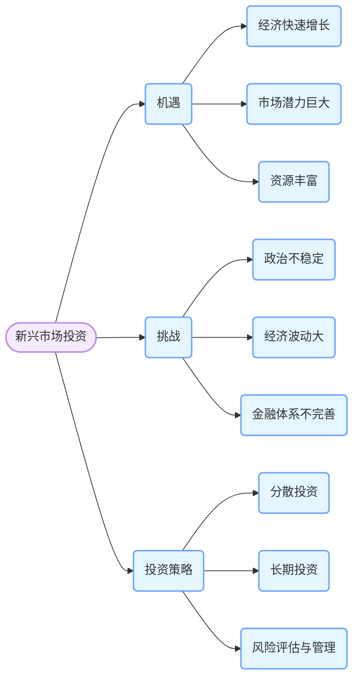

# 新兴市场投资：高风险高回报的机遇与挑战

> 关键词：新兴市场投资、高风险高回报、机遇、挑战、投资策略

> 摘要：本文聚焦于新兴市场投资这一具有高风险高回报特性的领域。深入探讨了新兴市场投资的背景、核心概念、算法原理、数学模型等理论知识，通过项目实战案例详细展示了投资过程，分析了其实际应用场景。同时推荐了相关的学习资源、开发工具和论文著作。最后对新兴市场投资的未来发展趋势与挑战进行了总结，并解答了常见问题，为投资者提供全面的参考，助力其在新兴市场投资中做出更明智的决策。

## 1. 背景介绍 
### 1.1 目的和范围
本文章旨在全面剖析新兴市场投资这一复杂且充满潜力的领域。通过对新兴市场投资的各个方面进行深入研究，包括核心概念、算法原理、数学模型等，帮助投资者更好地理解新兴市场投资的本质和规律。同时，通过实际案例分析，展示如何在新兴市场中进行投资操作，以及可能面临的机遇和挑战。范围涵盖了新兴市场投资的理论基础、实践操作、应用场景以及未来发展趋势等多个维度。

### 1.2 预期读者
本文预期读者主要包括对新兴市场投资感兴趣的投资者，无论是个人投资者还是机构投资者，都可以从本文中获取有价值的信息和投资思路。同时，金融专业的学生、研究人员以及从事金融行业的从业者也可以通过本文加深对新兴市场投资的理解和认识。

### 1.3 文档结构概述
本文将按照以下结构进行阐述：首先介绍新兴市场投资的背景知识，包括目的、预期读者和文档结构概述等；接着详细讲解核心概念与联系，通过文本示意图和 Mermaid 流程图展示其原理和架构；然后阐述核心算法原理和具体操作步骤，并使用 Python 源代码进行详细说明；再介绍数学模型和公式，通过举例加深理解；之后通过项目实战案例，包括开发环境搭建、源代码实现和解读等，展示实际投资过程；分析新兴市场投资的实际应用场景；推荐相关的学习资源、开发工具和论文著作；最后总结未来发展趋势与挑战，解答常见问题，并提供扩展阅读和参考资料。

### 1.4 术语表
#### 1.4.1 核心术语定义
- **新兴市场**：指的是发展中国家或地区的金融市场，这些市场通常具有较高的经济增长率，但也伴随着较高的政治、经济和市场风险。
- **新兴市场投资**：投资者将资金投入到新兴市场的各种资产中，如股票、债券、基金等，以获取投资收益。
- **风险溢价**：投资者为了承担更高的风险而要求获得的额外回报。在新兴市场投资中，由于风险较高，投资者通常要求更高的风险溢价。
- **夏普比率**：一种衡量投资组合风险调整后收益的指标，它反映了投资组合每承担一单位风险所能获得的超过无风险收益的额外收益。

#### 1.4.2 相关概念解释
- **经济周期**：经济活动在扩张和收缩之间的周期性波动。新兴市场的经济周期通常比发达市场更加剧烈，这会对投资产生重要影响。
- **汇率风险**：由于汇率波动而导致的投资价值变化的风险。在新兴市场投资中，汇率风险是一个重要的考虑因素，因为新兴市场的货币通常比发达市场的货币更加不稳定。
- **政治风险**：由于政治事件或政策变化而导致的投资价值变化的风险。新兴市场的政治环境通常比发达市场更加不稳定，政治风险也更高。

#### 1.4.3 缩略词列表
- **GDP**：国内生产总值，衡量一个国家或地区经济活动总量的指标。
- **CPI**：消费者物价指数，衡量物价水平变化的指标。
- **FDI**：外国直接投资，指外国投资者在本国进行的直接投资活动。

## 2. 核心概念与联系 
### 核心概念原理
新兴市场投资的核心在于利用新兴市场的经济增长潜力获取高额回报，但同时也需要承担较高的风险。新兴市场通常具有以下特点：
- **经济快速增长**：新兴市场国家或地区的经济增长率通常高于发达市场，这为投资提供了良好的机会。例如，一些亚洲和非洲的新兴市场国家在过去几十年中实现了高速的经济增长。
- **市场潜力巨大**：新兴市场的人口众多，消费市场潜力巨大。随着经济的发展，居民的消费能力不断提高，为相关企业带来了广阔的发展空间。
- **资源丰富**：许多新兴市场国家拥有丰富的自然资源，如石油、天然气、矿产等。这些资源的开发和利用为投资提供了机会。

然而，新兴市场也面临着诸多风险：
- **政治不稳定**：新兴市场的政治环境相对不稳定，政治事件和政策变化可能对投资产生重大影响。例如，一些国家可能会发生政治动荡、政权更迭等情况。
- **经济波动大**：新兴市场的经济周期通常比发达市场更加剧烈，经济波动可能导致企业盈利下降、市场估值调整等问题。
- **金融体系不完善**：新兴市场的金融体系相对不完善，金融监管能力较弱，可能存在金融风险。例如，银行体系的不良资产率可能较高，资本市场的流动性可能较差。

### 架构的文本示意图
```plaintext
新兴市场投资
|
|-- 机遇
|   |-- 经济快速增长
|   |-- 市场潜力巨大
|   |-- 资源丰富
|
|-- 挑战
|   |-- 政治不稳定
|   |-- 经济波动大
|   |-- 金融体系不完善
|
|-- 投资策略
|   |-- 分散投资
|   |-- 长期投资
|   |-- 风险评估与管理
```

### Mermaid 流程图


## 3. 核心算法原理 & 具体操作步骤 
### 核心算法原理
在新兴市场投资中，常用的算法之一是风险评估算法。风险评估的目的是通过对各种风险因素的分析和量化，评估投资组合的风险水平。以下是一个简单的风险评估算法原理：

假设我们有一个投资组合，包含 $n$ 种资产，每种资产的权重为 $w_i$，$i = 1,2,\cdots,n$，且 $\sum_{i = 1}^{n} w_i = 1$。每种资产的预期收益率为 $\mu_i$，收益率的标准差为 $\sigma_i$，资产之间的协方差矩阵为 $\Sigma$。

投资组合的预期收益率 $\mu_p$ 可以通过以下公式计算：
$$\mu_p = \sum_{i = 1}^{n} w_i \mu_i$$

投资组合的收益率标准差 $\sigma_p$ 可以通过以下公式计算：
$$\sigma_p = \sqrt{\sum_{i = 1}^{n} \sum_{j = 1}^{n} w_i w_j \sigma_{ij}}$$
其中，$\sigma_{ij}$ 是资产 $i$ 和资产 $j$ 之间的协方差。

### 具体操作步骤
以下是使用 Python 实现上述风险评估算法的具体步骤：

```python
import numpy as np

# 定义资产的预期收益率
mu = np.array([0.1, 0.15, 0.2])

# 定义资产的收益率标准差
sigma = np.array([0.2, 0.25, 0.3])

# 定义资产之间的协方差矩阵
cov_matrix = np.array([[0.04, 0.03, 0.02],
                       [0.03, 0.0625, 0.045],
                       [0.02, 0.045, 0.09]])

# 定义投资组合的权重
weights = np.array([0.3, 0.4, 0.3])

# 计算投资组合的预期收益率
portfolio_mu = np.dot(weights, mu)

# 计算投资组合的收益率标准差
portfolio_sigma = np.sqrt(np.dot(weights.T, np.dot(cov_matrix, weights)))

print(f"投资组合的预期收益率: {portfolio_mu}")
print(f"投资组合的收益率标准差: {portfolio_sigma}")
```

### 代码解释
1. **导入必要的库**：使用 `numpy` 库进行数值计算。
2. **定义资产的预期收益率、标准差和协方差矩阵**：通过 `np.array` 函数定义这些参数。
3. **定义投资组合的权重**：确保权重之和为 1。
4. **计算投资组合的预期收益率**：使用 `np.dot` 函数计算权重和预期收益率的点积。
5. **计算投资组合的收益率标准差**：使用 `np.dot` 函数计算权重、协方差矩阵和权重的乘积，并取平方根。
6. **输出结果**：打印投资组合的预期收益率和收益率标准差。

## 4. 数学模型和公式 & 详细讲解 & 举例说明 
### 夏普比率模型
夏普比率是一种常用的衡量投资组合风险调整后收益的指标，其公式为：
$$Sharpe Ratio = \frac{\mu_p - r_f}{\sigma_p}$$
其中，$\mu_p$ 是投资组合的预期收益率，$r_f$ 是无风险收益率，$\sigma_p$ 是投资组合的收益率标准差。

### 详细讲解
夏普比率反映了投资组合每承担一单位风险所能获得的超过无风险收益的额外收益。夏普比率越高，说明投资组合的风险调整后收益越好。

### 举例说明
假设无风险收益率 $r_f = 0.03$，投资组合的预期收益率 $\mu_p = 0.1$，收益率标准差 $\sigma_p = 0.2$，则夏普比率为：
$$Sharpe Ratio = \frac{0.1 - 0.03}{0.2} = 0.35$$

这意味着该投资组合每承担一单位风险可以获得 0.35 单位的超过无风险收益的额外收益。

### 资本资产定价模型（CAPM）
资本资产定价模型用于描述资产的预期收益率与市场风险之间的关系，其公式为：
$$\mu_i = r_f + \beta_i (\mu_m - r_f)$$
其中，$\mu_i$ 是资产 $i$ 的预期收益率，$r_f$ 是无风险收益率，$\beta_i$ 是资产 $i$ 的贝塔系数，$\mu_m$ 是市场组合的预期收益率。

### 详细讲解
贝塔系数 $\beta_i$ 衡量了资产 $i$ 的收益率相对于市场组合收益率的波动程度。如果 $\beta_i > 1$，说明资产 $i$ 的收益率波动比市场组合更大；如果 $\beta_i < 1$，说明资产 $i$ 的收益率波动比市场组合更小。

### 举例说明
假设无风险收益率 $r_f = 0.03$，市场组合的预期收益率 $\mu_m = 0.1$，资产 $i$ 的贝塔系数 $\beta_i = 1.2$，则资产 $i$ 的预期收益率为：
$$\mu_i = 0.03 + 1.2 \times (0.1 - 0.03) = 0.114$$

这意味着资产 $i$ 的预期收益率为 11.4%。

## 5. 项目实战：代码实际案例和详细解释说明 
### 5.1  开发环境搭建
- **安装 Python**：从 Python 官方网站（https://www.python.org/downloads/）下载并安装 Python 3.x 版本。
- **安装必要的库**：使用 `pip` 命令安装所需的库，如 `numpy`、`pandas`、`matplotlib` 等。
```bash
pip install numpy pandas matplotlib
```

### 5.2  源代码详细实现和代码解读
以下是一个简单的新兴市场投资组合优化的代码示例：

```python
import numpy as np
import pandas as pd
import matplotlib.pyplot as plt

# 定义资产的预期收益率
mu = np.array([0.1, 0.15, 0.2])

# 定义资产的收益率标准差
sigma = np.array([0.2, 0.25, 0.3])

# 定义资产之间的协方差矩阵
cov_matrix = np.array([[0.04, 0.03, 0.02],
                       [0.03, 0.0625, 0.045],
                       [0.02, 0.045, 0.09]])

# 生成随机投资组合
num_portfolios = 1000
weights_matrix = np.random.random((num_portfolios, len(mu)))
weights_matrix = weights_matrix / weights_matrix.sum(axis=1)[:, np.newaxis]

# 计算每个投资组合的预期收益率和标准差
portfolio_mus = np.dot(weights_matrix, mu)
portfolio_sigmas = []
for weights in weights_matrix:
    portfolio_sigma = np.sqrt(np.dot(weights.T, np.dot(cov_matrix, weights)))
    portfolio_sigmas.append(portfolio_sigma)
portfolio_sigmas = np.array(portfolio_sigmas)

# 计算夏普比率
risk_free_rate = 0.03
portfolio_sharpe_ratios = (portfolio_mus - risk_free_rate) / portfolio_sigmas

# 找到最优投资组合
optimal_index = np.argmax(portfolio_sharpe_ratios)
optimal_weights = weights_matrix[optimal_index]
optimal_mu = portfolio_mus[optimal_index]
optimal_sigma = portfolio_sigmas[optimal_index]
optimal_sharpe_ratio = portfolio_sharpe_ratios[optimal_index]

# 绘制有效前沿
plt.scatter(portfolio_sigmas, portfolio_mus, c=portfolio_sharpe_ratios, cmap='viridis')
plt.colorbar(label='Sharpe Ratio')
plt.scatter(optimal_sigma, optimal_mu, marker='*', color='r', s=500, label='Optimal Portfolio')
plt.xlabel('Portfolio Standard Deviation')
plt.ylabel('Portfolio Expected Return')
plt.title('Efficient Frontier')
plt.legend()
plt.show()

print(f"最优投资组合的权重: {optimal_weights}")
print(f"最优投资组合的预期收益率: {optimal_mu}")
print(f"最优投资组合的收益率标准差: {optimal_sigma}")
print(f"最优投资组合的夏普比率: {optimal_sharpe_ratio}")
```

### 代码解读与分析
1. **导入必要的库**：使用 `numpy` 进行数值计算，`pandas` 进行数据处理，`matplotlib` 进行可视化。
2. **定义资产的预期收益率、标准差和协方差矩阵**：这些参数是投资组合优化的基础。
3. **生成随机投资组合**：通过 `np.random.random` 函数生成随机的投资组合权重，并进行归一化处理。
4. **计算每个投资组合的预期收益率和标准差**：使用之前介绍的公式进行计算。
5. **计算夏普比率**：根据夏普比率公式计算每个投资组合的夏普比率。
6. **找到最优投资组合**：通过 `np.argmax` 函数找到夏普比率最大的投资组合。
7. **绘制有效前沿**：使用 `plt.scatter` 函数绘制所有投资组合的预期收益率和标准差，并使用颜色表示夏普比率。标记出最优投资组合。
8. **输出结果**：打印最优投资组合的权重、预期收益率、收益率标准差和夏普比率。

## 6. 实际应用场景 
### 股票投资
投资者可以通过分析新兴市场国家的宏观经济数据、行业发展趋势和公司基本面等因素，选择具有潜力的股票进行投资。例如，在一些新兴市场国家，科技、消费和金融等行业具有较高的增长潜力，可以作为投资的重点领域。

### 债券投资
新兴市场国家的债券市场也为投资者提供了机会。投资者可以通过购买新兴市场国家的政府债券或企业债券，获取固定的利息收益。然而，新兴市场债券的信用风险相对较高，投资者需要进行充分的风险评估。

### 基金投资
对于普通投资者来说，投资新兴市场基金是一种较为便捷的方式。新兴市场基金通常由专业的基金经理管理，他们会根据市场情况进行资产配置和投资决策。投资者可以根据自己的风险偏好选择不同类型的新兴市场基金，如股票型基金、债券型基金或混合型基金。

### 直接投资
一些大型企业或机构投资者可以通过直接投资的方式参与新兴市场的发展。例如，投资新兴市场国家的基础设施建设项目、能源开发项目等。直接投资需要投资者具备较强的资金实力和风险管理能力。

## 7. 工具和资源推荐
### 7.1 学习资源推荐
#### 7.1.1 书籍推荐
- 《新兴市场投资手册》：全面介绍了新兴市场投资的理论和实践，包括新兴市场的经济、政治、金融等方面的知识。
- 《聪明的投资者》：虽然不是专门针对新兴市场投资，但书中的价值投资理念对新兴市场投资同样具有重要的指导意义。
- 《金融市场与金融机构》：帮助读者了解金融市场的基本原理和金融机构的运作方式，为新兴市场投资提供基础知识。

#### 7.1.2 在线课程
- Coursera 上的“新兴市场投资”课程：由知名大学的教授授课，内容涵盖新兴市场的投资策略、风险评估等方面。
- edX 上的“金融市场分析”课程：提供了金融市场分析的方法和工具，对新兴市场投资分析有很大帮助。

#### 7.1.3 技术博客和网站
- 金融界网站：提供新兴市场的财经新闻、数据分析和投资策略等内容。
- 晨星网：专注于基金评级和分析，为投资者提供新兴市场基金的相关信息。

### 7.2 开发工具框架推荐
#### 7.2.1 IDE和编辑器
- PyCharm：一款功能强大的 Python 集成开发环境，适合进行新兴市场投资相关的数据分析和算法实现。
- Jupyter Notebook：交互式的开发环境，方便进行数据探索和可视化，适合初学者和研究者使用。

#### 7.2.2 调试和性能分析工具
- `pdb`：Python 自带的调试工具，用于调试 Python 代码。
- `cProfile`：Python 内置的性能分析工具，用于分析代码的运行时间和性能瓶颈。

#### 7.2.3 相关框架和库
- `numpy`：用于数值计算和数组操作，是新兴市场投资数据分析的基础库。
- `pandas`：用于数据处理和分析，提供了丰富的数据结构和数据分析工具。
- `matplotlib`：用于数据可视化，帮助投资者直观地展示投资数据和结果。

### 7.3 相关论文著作推荐
#### 7.3.1 经典论文
- “The Arbitrage Theory of Capital Asset Pricing”：提出了套利定价理论，对资产定价和投资组合理论有重要贡献。
- “A Capital Asset Pricing Model with Time-varying Covariances”：研究了资产收益率的时变协方差，为投资组合风险管理提供了新的思路。

#### 7.3.2 最新研究成果
- 关注国际知名金融学术期刊，如《Journal of Finance》《Review of Financial Studies》等，获取新兴市场投资的最新研究成果。

#### 7.3.3 应用案例分析
- 一些知名金融机构会发布新兴市场投资的应用案例分析报告，投资者可以通过这些报告了解实际投资中的策略和经验。

## 8. 总结：未来发展趋势与挑战
### 未来发展趋势
- **经济持续增长**：新兴市场国家的经济有望继续保持较高的增长率，尤其是亚洲和非洲的一些国家。随着基础设施建设的不断完善、消费市场的扩大和科技创新的推动，新兴市场的经济发展前景广阔。
- **金融市场开放**：越来越多的新兴市场国家将进一步开放金融市场，吸引更多的国际资本流入。这将提高新兴市场金融市场的流动性和效率，为投资者提供更多的投资机会。
- **科技创新引领**：新兴市场国家在科技创新方面的投入不断增加，一些新兴技术如人工智能、大数据、区块链等在新兴市场得到了广泛应用。科技创新将推动新兴市场的产业升级和经济转型，为投资带来新的机遇。

### 挑战
- **全球经济不确定性**：全球经济增长的不确定性、贸易摩擦、货币政策调整等因素可能对新兴市场的经济和金融市场产生负面影响。例如，美元加息可能导致新兴市场资本外流，汇率贬值。
- **政治风险**：新兴市场国家的政治环境相对不稳定，政治事件和政策变化可能对投资产生重大影响。投资者需要密切关注新兴市场国家的政治动态，做好风险防范。
- **金融体系脆弱性**：新兴市场的金融体系相对不完善，金融监管能力较弱，可能存在金融风险。例如，银行体系的不良资产率可能较高，资本市场的流动性可能较差。投资者需要加强对新兴市场金融体系的研究和分析，降低投资风险。

## 9. 附录：常见问题与解答
### 问题 1：新兴市场投资的风险真的很高吗？
答：新兴市场投资确实存在较高的风险。新兴市场国家的政治、经济和金融环境相对不稳定，可能面临政治动荡、经济波动、汇率风险等问题。然而，高风险也伴随着高回报的可能性。投资者可以通过合理的资产配置和风险管理，降低投资风险。

### 问题 2：如何选择适合自己的新兴市场投资方式？
答：投资者可以根据自己的风险偏好、投资目标和资金实力等因素选择适合自己的新兴市场投资方式。如果风险承受能力较高，且希望获取较高的回报，可以选择股票投资或直接投资；如果风险承受能力较低，可以选择债券投资或基金投资。

### 问题 3：新兴市场投资需要关注哪些宏观经济指标？
答：投资者需要关注新兴市场国家的 GDP 增长率、通货膨胀率、利率、汇率等宏观经济指标。这些指标可以反映新兴市场国家的经济状况和发展趋势，对投资决策有重要的参考价值。

## 10. 扩展阅读 & 参考资料
### 扩展阅读
- 《新兴市场的崛起》：深入探讨了新兴市场国家的经济发展历程和未来趋势。
- 《投资新兴市场的艺术》：介绍了新兴市场投资的技巧和策略。

### 参考资料
- 国际货币基金组织（IMF）发布的《世界经济展望》报告。
- 世界银行发布的《全球经济展望》报告。

作者：AI天才研究院/AI Genius Institute & 禅与计算机程序设计艺术 /Zen And The Art of Computer Programming