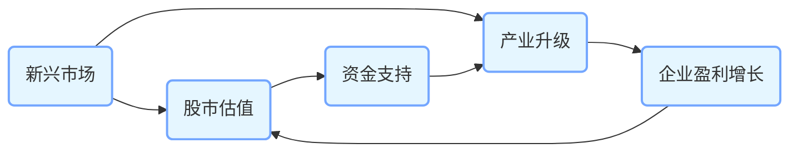

# 新兴市场股市估值与产业升级的互动

> 关键词：新兴市场、股市估值、产业升级、互动关系、经济发展

> 摘要：本文旨在深入探讨新兴市场股市估值与产业升级之间的互动关系。通过对相关核心概念的阐述、算法原理的分析、数学模型的构建，结合实际案例和应用场景，揭示两者相互影响的内在机制。研究发现，产业升级能推动股市估值上升，而合理的股市估值又能为产业升级提供资金支持和市场信号。同时，文章还对未来发展趋势与挑战进行了展望，并提供了相关的学习资源、开发工具和参考资料，以期为投资者、政策制定者和研究人员提供有益的参考。

## 1. 背景介绍 
### 1.1 目的和范围
新兴市场在全球经济格局中扮演着越来越重要的角色。股市作为经济的重要组成部分，其估值水平反映了市场对企业未来盈利的预期。而产业升级则是新兴市场实现经济可持续发展的关键。本研究的目的在于系统地分析新兴市场股市估值与产业升级之间的互动关系，探讨两者如何相互促进、相互影响。研究范围涵盖了主要新兴市场国家和地区的股市数据以及产业发展情况。

### 1.2 预期读者
本文的预期读者包括金融投资者、企业管理者、政策制定者以及对新兴市场经济和金融领域感兴趣的研究人员。投资者可以通过了解股市估值与产业升级的互动关系，更好地把握投资机会；企业管理者可以从中获取产业发展的方向和趋势，制定合理的战略规划；政策制定者可以根据研究结果制定相关政策，促进新兴市场的经济发展和产业升级；研究人员则可以在此基础上进行更深入的学术研究。

### 1.3 文档结构概述
本文首先介绍了研究的背景、目的和范围，明确了预期读者和文档结构。接着阐述了新兴市场、股市估值和产业升级的核心概念及其联系，并通过示意图和流程图进行了直观展示。然后详细讲解了核心算法原理和具体操作步骤，同时构建了数学模型并进行举例说明。在项目实战部分，给出了代码实际案例和详细解释。之后分析了两者的实际应用场景，并推荐了相关的工具和资源。最后对未来发展趋势与挑战进行了总结，提供了常见问题与解答以及扩展阅读和参考资料。

### 1.4 术语表
#### 1.4.1 核心术语定义
- **新兴市场**：指那些经济发展较快、市场潜力较大，但金融市场和制度相对不够成熟的国家和地区。通常具有较高的经济增长率、较低的人均收入水平和较大的发展空间。
- **股市估值**：是对股票价值的评估，反映了市场参与者对上市公司未来盈利和现金流的预期。常见的估值方法包括市盈率（P/E）、市净率（P/B）等。
- **产业升级**：指产业结构从低附加值向高附加值、从劳动密集型向技术密集型、从传统产业向新兴产业的转变过程。产业升级通常伴随着技术创新、生产效率提高和产品质量提升。

#### 1.4.2 相关概念解释
- **市盈率（P/E）**：是指股票价格与每股盈利的比率，反映了投资者为获取每一元盈利所愿意支付的价格。较高的市盈率通常表示市场对该股票的未来盈利增长预期较高。
- **市净率（P/B）**：是指股票价格与每股净资产的比率，反映了市场对公司净资产的估值。较低的市净率可能表示股票被低估。
- **产业结构**：是指各产业在国民经济中的比重和相互关系。合理的产业结构有助于提高经济效率和竞争力。

#### 1.4.3 缩略词列表
- **P/E**：Price-to-Earnings Ratio，市盈率
- **P/B**：Price-to-Book Ratio，市净率

## 2. 核心概念与联系 

### 核心概念原理
#### 新兴市场
新兴市场国家和地区通常处于经济快速发展阶段，具有以下特点：
- 经济增长迅速：新兴市场国家的GDP增长率往往高于发达国家，吸引了大量的国际资本流入。
- 市场潜力大：随着经济的发展，新兴市场的消费需求不断增长，为企业提供了广阔的市场空间。
- 金融市场发展不完善：新兴市场的金融市场相对不成熟，存在着信息不对称、市场效率低下等问题。

#### 股市估值
股市估值是投资者对股票价值的判断，其原理基于对公司未来盈利和现金流的预期。常见的估值方法包括：
- 相对估值法：通过与同行业其他公司或市场平均水平进行比较，来评估股票的价值。例如，市盈率法就是将股票的价格与每股盈利进行比较。
- 绝对估值法：通过对公司未来现金流进行折现，来计算股票的内在价值。例如，现金流折现模型（DCF）就是一种常用的绝对估值方法。

#### 产业升级
产业升级是产业结构优化和升级的过程，其原理主要包括：
- 技术创新：新技术的应用可以提高生产效率、降低成本、提升产品质量，从而推动产业升级。
- 需求升级：随着消费者收入水平的提高和消费观念的变化，对产品和服务的需求也在不断升级，促使企业进行产业升级。
- 政策引导：政府可以通过制定相关政策，如产业政策、税收政策等，引导企业进行产业升级。

### 核心概念架构的文本示意图
```plaintext
           新兴市场
           /       \
    股市估值     产业升级
      |           |
  资金支持      企业盈利增长
      |           |
  推动产业升级  提升股市估值
```

### Mermaid流程图


从流程图可以看出，新兴市场为股市估值和产业升级提供了基础环境。股市估值通过为企业提供资金支持，推动产业升级；而产业升级带来的企业盈利增长又会提升股市估值，形成一个相互促进的循环。

## 3. 核心算法原理 & 具体操作步骤 

### 股市估值算法原理
#### 市盈率法
市盈率法是最常用的股市估值方法之一，其原理是通过比较股票的市盈率与同行业平均市盈率或市场平均市盈率，来判断股票是否被高估或低估。计算公式为：

$$P/E = \frac{股价}{每股盈利}$$

其中，$P/E$ 表示市盈率，股价是指股票的市场价格，每股盈利是指公司每股普通股的盈利。

#### 具体操作步骤
1. 收集同行业其他公司或市场的市盈率数据。
2. 计算目标公司的市盈率。
3. 将目标公司的市盈率与同行业平均市盈率或市场平均市盈率进行比较。
4. 如果目标公司的市盈率高于同行业平均市盈率或市场平均市盈率，则认为该股票可能被高估；反之，则认为该股票可能被低估。

### Python源代码实现
```python
# 示例：计算股票的市盈率并与同行业平均市盈率进行比较
# 假设已知股票价格和每股盈利，以及同行业平均市盈率
stock_price = 50  # 股票价格
earnings_per_share = 2  # 每股盈利
industry_pe_average = 20  # 同行业平均市盈率

# 计算股票的市盈率
stock_pe = stock_price / earnings_per_share

# 比较股票市盈率与同行业平均市盈率
if stock_pe > industry_pe_average:
    print("该股票可能被高估")
elif stock_pe < industry_pe_average:
    print("该股票可能被低估")
else:
    print("该股票估值合理")
```

### 产业升级评估算法原理
#### 产业结构比例法
产业升级可以通过产业结构的变化来评估，产业结构比例法的原理是计算不同产业在国民经济中的比重，并观察其随时间的变化。通常，随着产业升级的推进，高技术产业和服务业的比重会逐渐增加，而传统制造业的比重会逐渐下降。

#### 具体操作步骤
1. 收集不同产业的产值数据。
2. 计算各产业在国民经济中的比重。
3. 分析各产业比重随时间的变化趋势。
4. 如果高技术产业和服务业的比重上升，传统制造业的比重下降，则认为产业升级正在进行。

### Python源代码实现
```python
# 示例：计算不同产业的比重并分析产业升级趋势
# 假设已知三个产业的产值数据，分别为传统制造业、高技术产业和服务业
traditional_manufacturing = 300  # 传统制造业产值
high_tech_industry = 200  # 高技术产业产值
service_industry = 500  # 服务业产值

# 计算总产值
total_output = traditional_manufacturing + high_tech_industry + service_industry

# 计算各产业的比重
traditional_manufacturing_ratio = traditional_manufacturing / total_output
high_tech_industry_ratio = high_tech_industry / total_output
service_industry_ratio = service_industry / total_output

# 输出各产业的比重
print(f"传统制造业比重: {traditional_manufacturing_ratio * 100:.2f}%")
print(f"高技术产业比重: {high_tech_industry_ratio * 100:.2f}%")
print(f"服务业比重: {service_industry_ratio * 100:.2f}%")

# 分析产业升级趋势
if high_tech_industry_ratio > traditional_manufacturing_ratio and service_industry_ratio > traditional_manufacturing_ratio:
    print("产业升级正在进行")
else:
    print("产业升级尚未明显体现")
```

## 4. 数学模型和公式 & 详细讲解 & 举例说明 

### 股市估值数学模型
#### 现金流折现模型（DCF）
现金流折现模型是一种绝对估值方法，其基本原理是将公司未来的现金流折现到当前时刻，以计算公司的内在价值。公式如下：

$$V = \sum_{t=1}^{n} \frac{CF_t}{(1 + r)^t} + \frac{TV}{(1 + r)^n}$$

其中，$V$ 表示公司的内在价值，$CF_t$ 表示第 $t$ 期的现金流，$r$ 表示折现率，$n$ 表示预测期数，$TV$ 表示终值。

#### 详细讲解
- **现金流（$CF_t$）**：是指公司在未来各期产生的现金流量，可以通过对公司的财务报表进行分析和预测得到。
- **折现率（$r$）**：反映了投资者对资金时间价值和风险的要求。通常可以使用资本资产定价模型（CAPM）来计算折现率。
- **终值（$TV$）**：是指预测期结束后公司的价值，可以使用永续增长模型来计算。

#### 举例说明
假设某公司未来三年的现金流分别为100万元、120万元和150万元，折现率为10%，预测期为三年，三年后公司的终值为1000万元。则该公司的内在价值为：

$$V = \frac{100}{(1 + 0.1)^1} + \frac{120}{(1 + 0.1)^2} + \frac{150}{(1 + 0.1)^3} + \frac{1000}{(1 + 0.1)^3}$$

```python
import math

# 现金流
cf1 = 100
cf2 = 120
cf3 = 150
tv = 1000

# 折现率
r = 0.1

# 计算内在价值
v = cf1 / (1 + r) + cf2 / math.pow(1 + r, 2) + cf3 / math.pow(1 + r, 3) + tv / math.pow(1 + r, 3)

print(f"公司的内在价值为: {v:.2f}万元")
```

### 产业升级数学模型
#### 产业升级指数模型
产业升级指数可以综合考虑多个产业指标，来衡量产业升级的程度。假设我们选择高技术产业比重、研发投入占比和劳动生产率三个指标，产业升级指数的计算公式如下：

$$I = w_1 \times H + w_2 \times R + w_3 \times L$$

其中，$I$ 表示产业升级指数，$w_1$、$w_2$ 和 $w_3$ 分别表示高技术产业比重、研发投入占比和劳动生产率的权重，$H$ 表示高技术产业比重，$R$ 表示研发投入占比，$L$ 表示劳动生产率。

#### 详细讲解
- **权重（$w_1$、$w_2$ 和 $w_3$）**：可以根据各指标的重要性进行确定，且 $w_1 + w_2 + w_3 = 1$。
- **高技术产业比重（$H$）**：反映了产业结构的优化程度。
- **研发投入占比（$R$）**：体现了企业对技术创新的重视程度。
- **劳动生产率（$L$）**：衡量了产业的生产效率。

#### 举例说明
假设高技术产业比重的权重为0.4，研发投入占比的权重为0.3，劳动生产率的权重为0.3。某地区的高技术产业比重为30%，研发投入占比为5%，劳动生产率为10万元/人。则该地区的产业升级指数为：

$$I = 0.4 \times 0.3 + 0.3 \times 0.05 + 0.3 \times 10$$

```python
# 权重
w1 = 0.4
w2 = 0.3
w3 = 0.3

# 指标值
H = 0.3
R = 0.05
L = 10

# 计算产业升级指数
I = w1 * H + w2 * R + w3 * L

print(f"该地区的产业升级指数为: {I:.2f}")
```

## 5. 项目实战：代码实际案例和详细解释说明 

### 5.1  开发环境搭建
#### 安装Python
首先需要安装Python环境，建议使用Python 3.x版本。可以从Python官方网站（https://www.python.org/downloads/）下载安装包，按照安装向导进行安装。

#### 安装必要的库
本项目需要使用一些Python库，如`pandas`、`numpy`等。可以使用`pip`命令进行安装：
```sh
pip install pandas numpy
```

### 5.2  源代码详细实现和代码解读
#### 数据获取
假设我们从CSV文件中获取新兴市场的股市数据和产业数据。以下是读取数据的代码：
```python
import pandas as pd

# 读取股市数据
stock_data = pd.read_csv('stock_data.csv')

# 读取产业数据
industry_data = pd.read_csv('industry_data.csv')

print("股市数据信息：")
stock_data.info()

print("产业数据信息：")
industry_data.info()
```
**代码解读**：
- `pandas`库是一个强大的数据处理库，`read_csv`函数用于读取CSV文件。
- `info`方法用于查看数据的基本信息，包括列名、数据类型、非空值数量等。

#### 股市估值计算
```python
# 计算市盈率
stock_data['PE'] = stock_data['股价'] / stock_data['每股盈利']

# 计算同行业平均市盈率
industry_pe_average = stock_data.groupby('行业')['PE'].mean()

# 将同行业平均市盈率合并到股票数据中
stock_data = stock_data.merge(industry_pe_average, on='行业', suffixes=('', '_行业平均'))

# 判断股票是否被高估或低估
stock_data['估值情况'] = '合理'
stock_data.loc[stock_data['PE'] > stock_data['PE_行业平均'], '估值情况'] = '高估'
stock_data.loc[stock_data['PE'] < stock_data['PE_行业平均'], '估值情况'] = '低估'

print("股市估值结果：")
print(stock_data[['股票代码', 'PE', 'PE_行业平均', '估值情况']])
```
**代码解读**：
- 首先计算每只股票的市盈率。
- 然后使用`groupby`方法按行业分组，计算同行业平均市盈率。
- 使用`merge`方法将同行业平均市盈率合并到股票数据中。
- 最后根据市盈率的比较结果，判断股票是否被高估或低估。

#### 产业升级评估
```python
# 计算各产业的比重
total_output = industry_data[['传统制造业产值', '高技术产业产值', '服务业产值']].sum(axis=1)
industry_data['传统制造业比重'] = industry_data['传统制造业产值'] / total_output
industry_data['高技术产业比重'] = industry_data['高技术产业产值'] / total_output
industry_data['服务业比重'] = industry_data['服务业产值'] / total_output

# 分析产业升级趋势
industry_data['产业升级情况'] = '未明显体现'
industry_data.loc[(industry_data['高技术产业比重'] > industry_data['传统制造业比重']) & (industry_data['服务业比重'] > industry_data['传统制造业比重']), '产业升级情况'] = '正在进行'

print("产业升级评估结果：")
print(industry_data[['年份', '传统制造业比重', '高技术产业比重', '服务业比重', '产业升级情况']])
```
**代码解读**：
- 首先计算各产业的总产值。
- 然后计算各产业的比重。
- 最后根据产业比重的比较结果，判断产业升级是否正在进行。

### 5.3  代码解读与分析
#### 数据处理
通过使用`pandas`库，我们可以方便地读取和处理数据。数据处理的过程包括计算市盈率、产业比重等指标，以及进行数据合并和比较。

#### 估值判断
根据市盈率的比较结果，我们可以判断股票是否被高估或低估。这有助于投资者做出投资决策。

#### 产业升级评估
通过计算产业比重并进行比较，我们可以评估产业升级的趋势。这对于政策制定者和企业管理者了解产业发展情况具有重要意义。

## 6. 实际应用场景 
### 投资者决策
投资者可以通过分析新兴市场股市估值与产业升级的互动关系，选择具有潜力的股票进行投资。当产业升级趋势明显时，相关产业的企业盈利增长可能会推动股市估值上升，投资者可以提前布局这些产业的股票。例如，在新兴市场国家大力发展新能源产业的过程中，新能源相关企业的业绩可能会不断提升，其股票估值也可能随之上升。

### 企业战略规划
企业管理者可以根据产业升级的趋势，调整企业的战略规划。当产业升级带来新的市场机会时，企业可以加大研发投入，进行技术创新，实现产业升级。同时，合理的股市估值可以为企业提供融资支持，帮助企业扩大生产规模，提升市场竞争力。例如，一家传统制造业企业可以通过观察股市对新兴产业的估值情况，决定是否向高技术产业转型。

### 政策制定
政策制定者可以通过制定相关政策，促进新兴市场的产业升级和股市健康发展。例如，政府可以出台税收优惠政策，鼓励企业加大研发投入，推动产业升级；同时，加强对股市的监管，维护市场秩序，提高股市的透明度和效率。此外，政策制定者还可以通过引导资金流向新兴产业，促进产业升级和股市估值的良性互动。

## 7. 工具和资源推荐
### 7.1 学习资源推荐
#### 7.1.1 书籍推荐
- 《证券分析》（Security Analysis）：由本杰明·格雷厄姆（Benjamin Graham）和大卫·多德（David Dodd）所著，是价值投资的经典著作，详细介绍了股票估值的方法和原理。
- 《产业经济学》：系统阐述了产业结构、产业组织、产业政策等方面的理论和方法，对于理解产业升级具有重要的参考价值。
- 《新兴市场的崛起》（The Rise of Emerging Markets）：深入分析了新兴市场的经济发展特点和趋势，以及新兴市场在全球经济中的地位和作用。

#### 7.1.2 在线课程
- Coursera上的“金融市场”（Financial Markets）课程：由耶鲁大学教授罗伯特·席勒（Robert Shiller）主讲，介绍了金融市场的基本原理和投资策略。
- edX上的“产业经济学”（Industrial Economics）课程：提供了产业经济学的理论和实证分析方法，有助于理解产业升级的内在机制。
- 中国大学MOOC上的“新兴市场金融”课程：结合中国和其他新兴市场国家的实际情况，讲解了新兴市场金融的特点和发展趋势。

#### 7.1.3 技术博客和网站
- 雪球（https://xueqiu.com/）：是一个股票投资社区，提供了丰富的股票分析和研究报告，以及投资者的交流平台。
- 东方财富网（https://www.eastmoney.com/）：是国内知名的财经网站，提供了全面的金融信息和数据，包括股市行情、产业动态等。
- CEIC数据库（https://www.ceicdata.com/）：提供了全球范围内的经济数据和分析报告，对于研究新兴市场的经济和金融状况具有重要的参考价值。

### 7.2 开发工具框架推荐
#### 7.2.1 IDE和编辑器
- PyCharm：是一款专门为Python开发设计的集成开发环境（IDE），具有强大的代码编辑、调试和项目管理功能。
- Jupyter Notebook：是一个交互式的开发环境，适合进行数据探索和分析。可以方便地编写和运行Python代码，并展示数据分析结果。
- Visual Studio Code：是一款轻量级的代码编辑器，支持多种编程语言和插件扩展。可以通过安装Python相关插件，实现Python代码的编写和调试。

#### 7.2.2 调试和性能分析工具
- PDB：是Python自带的调试工具，可以帮助开发者定位代码中的错误。通过设置断点、单步执行等操作，逐步调试代码。
- cProfile：是Python的性能分析工具，可以分析代码的执行时间和函数调用关系。通过分析性能瓶颈，优化代码的执行效率。
- Py-Spy：是一个轻量级的Python性能分析工具，可以实时监测Python程序的运行状态，分析CPU使用率和函数调用情况。

#### 7.2.3 相关框架和库
- Pandas：是一个强大的数据处理和分析库，提供了丰富的数据结构和数据操作方法，适合处理各种类型的数据。
- Numpy：是Python的数值计算库，提供了高效的多维数组对象和数学函数，用于进行数值计算和科学计算。
- Scikit-learn：是一个机器学习库，提供了各种机器学习算法和工具，可用于股票估值预测和产业升级趋势分析。

### 7.3 相关论文著作推荐
#### 7.3.1 经典论文
- Fama, E. F., & French, K. R. (1992). The cross-section of expected stock returns. The Journal of Finance, 47(2), 427-465. 该论文提出了著名的Fama-French三因子模型，用于解释股票收益率的横截面差异。
- Porter, M. E. (1990). The competitive advantage of nations. Harvard business review, 68(2), 73-93. 迈克尔·波特（Michael Porter）的这篇论文提出了国家竞争优势理论，对于理解产业升级和国家经济发展具有重要的启示作用。

#### 7.3.2 最新研究成果
- 可以关注《Journal of Financial Economics》、《Review of Financial Studies》、《Journal of Industrial Economics》等国际知名学术期刊，了解新兴市场股市估值和产业升级领域的最新研究成果。

#### 7.3.3 应用案例分析
- 可以参考一些咨询公司和研究机构发布的报告，如麦肯锡（McKinsey）、波士顿咨询集团（BCG）等，了解新兴市场国家和地区在产业升级和股市发展方面的成功案例和经验教训。

## 8. 总结：未来发展趋势与挑战
### 未来发展趋势
#### 产业升级加速
随着科技的不断进步和新兴市场国家对创新的重视，未来新兴市场的产业升级将加速进行。高技术产业、数字经济、绿色产业等将成为产业升级的重点领域，推动新兴市场的经济结构不断优化。

#### 股市估值与产业升级的互动更加紧密
随着新兴市场金融市场的不断发展和完善，股市估值与产业升级的互动将更加紧密。合理的股市估值将为产业升级提供更多的资金支持和市场信号，而产业升级带来的企业盈利增长将进一步提升股市估值。

#### 国际化程度提高
新兴市场将更加融入全球经济体系，与国际金融市场的联系将更加紧密。国际资本的流入和流出将对新兴市场的股市估值和产业升级产生更大的影响。

### 挑战
#### 金融市场波动
新兴市场的金融市场相对不成熟，容易受到国际金融市场波动的影响。股市估值可能会出现大幅波动，给投资者和企业带来不确定性。

#### 技术创新能力不足
虽然新兴市场国家在技术创新方面取得了一定的进展，但与发达国家相比，仍存在较大差距。技术创新能力不足可能会制约产业升级的速度和质量。

#### 政策协调难度大
产业升级和股市发展需要政府制定相关政策进行引导和支持。然而，不同政策之间可能存在冲突和协调难度，需要政府加强政策的统筹和协调。

## 9. 附录：常见问题与解答
### 1. 新兴市场股市估值与发达市场股市估值有何不同？
新兴市场股市估值通常具有较高的波动性和不确定性。由于新兴市场的经济发展较快，但金融市场和制度相对不够成熟，投资者对新兴市场的预期和风险偏好也较为复杂，因此股市估值可能会出现较大的波动。相比之下，发达市场的股市估值相对较为稳定，市场效率较高。

### 2. 产业升级对股市估值的影响是长期还是短期的？
产业升级对股市估值的影响通常是长期的。产业升级需要一定的时间和过程，随着产业升级的推进，企业的盈利能力和竞争力将逐渐提升，从而推动股市估值的上升。然而，在产业升级的过程中，也可能会出现短期的波动和调整。

### 3. 如何判断新兴市场的产业升级是否成功？
可以从多个方面判断新兴市场的产业升级是否成功。例如，观察产业结构的变化，高技术产业和服务业的比重是否上升；企业的创新能力和生产效率是否提高；产品和服务的质量和附加值是否提升等。此外，还可以参考产业升级指数等量化指标进行评估。

### 4. 股市估值过高或过低对产业升级有什么影响？
股市估值过高可能会导致资本泡沫，吸引大量资金流入股市，而不是实体经济。这可能会造成资源配置不合理，影响产业升级的进程。股市估值过低则可能会导致企业融资困难，缺乏资金进行技术创新和产业升级。

## 10. 扩展阅读 & 参考资料
### 扩展阅读
- 《金融炼金术》（The Alchemy of Finance）：由乔治·索罗斯（George Soros）所著，探讨了金融市场的反身性原理，对于理解股市估值的波动具有一定的启示作用。
- 《创新者的窘境》（The Innovator's Dilemma）：由克莱顿·克里斯坦森（Clayton Christensen）所著，分析了企业在面对技术创新和市场变化时所面临的困境和挑战，对于理解产业升级的过程具有重要的参考价值。

### 参考资料
- 世界银行（https://www.worldbank.org/）：提供了全球各国的经济数据和发展报告，对于研究新兴市场的经济和金融状况具有重要的参考价值。
- 国际货币基金组织（https://www.imf.org/）：发布了关于全球经济和金融形势的分析报告和预测，对于了解新兴市场的宏观经济环境具有重要的参考意义。
- 各国证券交易所官方网站：可以获取新兴市场国家和地区的股市数据和相关信息。

作者：AI天才研究院/AI Genius Institute & 禅与计算机程序设计艺术 /Zen And The Art of Computer Programming