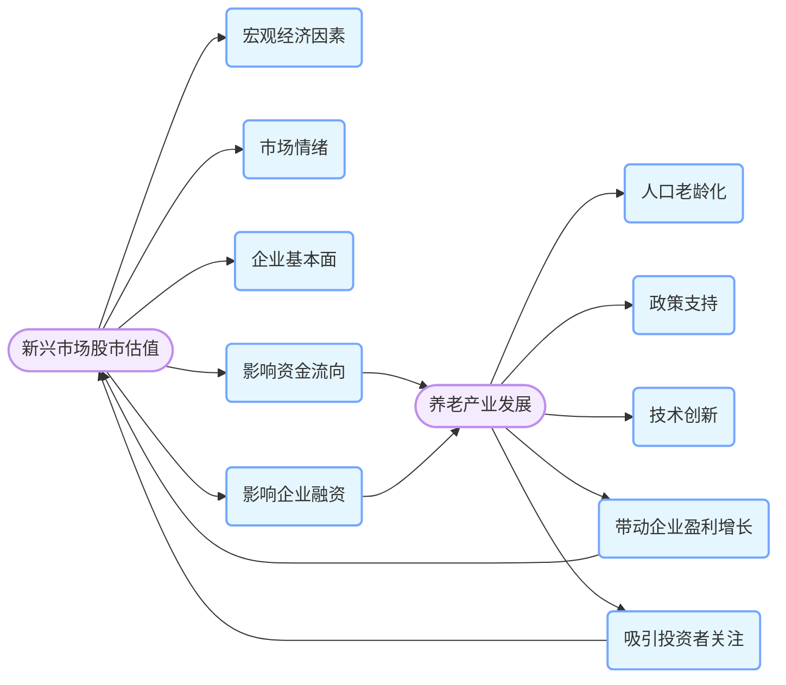

# 新兴市场股市估值与养老产业发展的互动

> 关键词：新兴市场、股市估值、养老产业发展、互动关系、金融市场

> 摘要：本文深入探讨了新兴市场股市估值与养老产业发展之间的互动关系。首先介绍了研究的背景、目的、预期读者、文档结构和相关术语。接着阐述了新兴市场股市估值和养老产业发展的核心概念及联系，分析了其中的原理和架构，并给出了相应的示意图和流程图。然后详细讲解了相关的核心算法原理和具体操作步骤，结合数学模型和公式进行举例说明。通过项目实战，展示了代码实际案例并进行详细解释。还探讨了新兴市场股市估值与养老产业发展互动在实际中的应用场景，推荐了相关的学习资源、开发工具框架和论文著作。最后总结了未来的发展趋势与挑战，解答了常见问题，并提供了扩展阅读和参考资料。

## 1. 背景介绍 
### 1.1 目的和范围
本研究旨在全面剖析新兴市场股市估值与养老产业发展之间的互动机制。新兴市场在全球经济格局中扮演着越来越重要的角色，其股市的发展状况不仅反映了经济的活力，也对各类产业的发展产生着深远影响。养老产业作为一个具有巨大发展潜力的领域，与金融市场尤其是股市密切相关。本研究将探讨新兴市场股市估值的变化如何影响养老产业的发展，以及养老产业的发展又如何反馈到股市估值上。研究范围涵盖了新兴市场的主要国家和地区，分析不同市场环境下两者的互动情况。

### 1.2 预期读者
本文的预期读者包括金融领域的从业者，如股票分析师、基金经理等，他们可以通过了解新兴市场股市估值与养老产业发展的互动关系，优化投资策略，把握市场机会。养老产业的企业管理者和创业者能够从研究中获取有关金融市场的信息，为企业的战略规划和融资决策提供参考。此外，学术界的研究人员也可以将本文作为进一步深入研究的基础，拓展相关领域的学术探讨。

### 1.3 文档结构概述
本文将按照以下结构展开：首先介绍新兴市场股市估值和养老产业发展的核心概念及联系，包括原理和架构的文本示意图和 Mermaid 流程图。接着详细阐述核心算法原理和具体操作步骤，使用 Python 源代码进行说明。然后引入数学模型和公式，结合实际例子进行详细讲解。通过项目实战，展示代码实际案例并进行解读。探讨两者互动在实际中的应用场景，推荐相关的学习资源、开发工具框架和论文著作。最后总结未来发展趋势与挑战，解答常见问题，并提供扩展阅读和参考资料。

### 1.4 术语表
#### 1.4.1 核心术语定义
- **新兴市场**：指的是一些发展中国家或地区的金融市场，这些市场通常具有较高的经济增长率，但也伴随着较高的风险和波动性。与成熟市场相比，新兴市场在市场规模、制度建设、投资者结构等方面存在一定差距。
- **股市估值**：是对股票市场中股票价值的评估，通常通过各种估值指标来衡量，如市盈率（P/E）、市净率（P/B）等。股市估值反映了市场对股票未来收益的预期，是投资者进行投资决策的重要依据。
- **养老产业**：是为老年人提供产品和服务的产业集合，包括养老地产、养老金融、养老医疗、养老服务等多个领域。养老产业的发展与人口老龄化趋势密切相关，具有巨大的市场潜力。

#### 1.4.2 相关概念解释
- **市盈率（P/E）**：是指股票价格与每股收益的比率，反映了投资者为获得公司每一元盈利所愿意支付的价格。市盈率越高，说明市场对该股票的预期越高，但也可能意味着股票被高估。
- **市净率（P/B）**：是指股票价格与每股净资产的比率，反映了市场对公司净资产的估值。市净率小于 1 时，通常被认为股票可能被低估；市净率大于 1 时，股票可能被高估。
- **人口老龄化**：是指人口生育率降低和人均寿命延长导致的总人口中因年轻人口数量减少、年长人口数量增加而导致的老年人口比例相应增长的动态。人口老龄化是养老产业发展的重要驱动力。

#### 1.4.3 缩略词列表
- **P/E**：市盈率（Price-to-Earnings Ratio）
- **P/B**：市净率（Price-to-Book Ratio）

## 2. 核心概念与联系 
### 核心概念原理
#### 新兴市场股市估值原理
新兴市场股市估值受到多种因素的影响。宏观经济因素是重要的影响因素之一，如 GDP 增长率、通货膨胀率、利率等。当 GDP 增长率较高时，企业的盈利预期通常会增加，从而推动股市估值上升；通货膨胀率过高可能会导致企业成本上升，盈利受到影响，进而压低股市估值；利率的变化会影响资金的流向，利率下降时，资金可能会从债券等固定收益产品流向股市，提高股市估值。

市场情绪也对新兴市场股市估值有着重要作用。投资者的乐观或悲观情绪会影响他们对股票的买卖决策，从而影响股市价格和估值。例如，当市场出现利好消息时，投资者情绪高涨，会增加对股票的需求，推动股市估值上升；反之，当市场出现利空消息时，投资者情绪低落，会减少对股票的需求，导致股市估值下降。

企业基本面也是决定股市估值的关键因素。企业的盈利能力、资产质量、行业竞争力等都会影响投资者对其股票的估值。盈利能力强、资产质量好、行业竞争力高的企业，其股票通常会获得较高的估值。

#### 养老产业发展原理
养老产业的发展主要受到人口老龄化趋势的驱动。随着全球人口老龄化程度的加深，老年人口数量不断增加，对养老产品和服务的需求也日益增长。这为养老产业提供了广阔的市场空间。

政策支持也是养老产业发展的重要保障。政府通过出台相关政策，如税收优惠、财政补贴、土地供应等，鼓励社会资本进入养老产业，促进养老产业的发展。例如，一些国家和地区对养老机构给予税收减免，降低了养老机构的运营成本，提高了其盈利能力，从而吸引了更多的投资。

技术创新为养老产业的发展提供了新的动力。随着信息技术、生物技术、智能技术等的不断发展，养老产业也不断涌现出新的产品和服务模式。例如，智能养老设备的出现，为老年人提供了更加便捷、高效的生活服务；远程医疗技术的应用，提高了老年人的医疗服务可及性。

### 核心概念架构
新兴市场股市估值与养老产业发展之间存在着复杂的互动架构。新兴市场股市估值的变化会通过资金流向、企业融资等途径影响养老产业的发展。当股市估值上升时，投资者的财富增加，可能会增加对养老产业的投资；同时，养老产业相关企业也更容易通过股市融资，扩大企业规模，促进产业发展。

养老产业的发展也会对新兴市场股市估值产生反馈作用。养老产业的发展会带动相关企业的盈利增长，从而提高这些企业的股票估值，进而推动整个股市估值的上升。此外，养老产业的发展还会吸引更多的投资者关注新兴市场股市，增加市场的流动性和活跃度，对股市估值产生积极影响。

### 文本示意图
```plaintext
新兴市场股市估值
|
|-- 宏观经济因素（GDP、通胀、利率）
|-- 市场情绪
|-- 企业基本面
|
|-- 影响资金流向
|-- 影响企业融资
|
V
养老产业发展
|
|-- 人口老龄化
|-- 政策支持
|-- 技术创新
|
|-- 带动企业盈利增长
|-- 吸引投资者关注
|
V
新兴市场股市估值
```

### Mermaid 流程图


## 3. 核心算法原理 & 具体操作步骤 
### 核心算法原理
为了研究新兴市场股市估值与养老产业发展的互动关系，我们可以采用时间序列分析方法。时间序列分析是一种用于分析时间序列数据的统计方法，它可以揭示数据随时间变化的规律和趋势。

我们可以构建一个向量自回归（VAR）模型来分析两者之间的动态关系。VAR 模型是一种多变量时间序列模型，它将每个变量表示为自身滞后值和其他变量滞后值的线性组合。在我们的研究中，我们可以将新兴市场股市估值指标（如市盈率）和养老产业发展指标（如养老产业企业的营业收入）作为 VAR 模型的变量。

VAR 模型的一般形式为：
$$Y_t = c + \sum_{i=1}^{p} A_i Y_{t - i} + \epsilon_t$$
其中，$Y_t$ 是一个 $k$ 维向量，包含了我们要研究的变量（如股市估值和养老产业发展指标）；$c$ 是一个 $k$ 维常数向量；$A_i$ 是 $k \times k$ 维的系数矩阵，表示变量之间的动态关系；$p$ 是滞后阶数；$\epsilon_t$ 是一个 $k$ 维的误差向量，满足均值为零、协方差矩阵为 $\Sigma$ 的条件。

### 具体操作步骤
#### 数据收集
首先，我们需要收集新兴市场股市估值和养老产业发展的相关数据。股市估值数据可以从金融数据提供商（如 Bloomberg、Wind 等）获取，包括市盈率、市净率等指标。养老产业发展数据可以从相关的统计机构、行业协会或企业财报中获取，如养老产业企业的营业收入、利润等。

#### 数据预处理
收集到的数据可能存在缺失值、异常值等问题，需要进行预处理。对于缺失值，可以采用插值法（如线性插值、样条插值等）进行填充；对于异常值，可以采用 Winsorization 方法进行处理，即对超出一定范围的值进行替换。

#### 确定滞后阶数
在构建 VAR 模型之前，需要确定合适的滞后阶数 $p$。可以采用信息准则（如 Akaike 信息准则（AIC）、Schwarz 信息准则（SIC）等）来选择最优的滞后阶数。

#### 模型估计
使用预处理后的数据对 VAR 模型进行估计。可以采用最小二乘法（OLS）或极大似然估计法（MLE）来估计模型的参数。

#### 模型检验
对估计得到的 VAR 模型进行检验，包括平稳性检验、残差检验等。平稳性检验可以采用单位根检验（如 Augmented Dickey - Fuller 检验）来判断模型的稳定性；残差检验可以检验残差是否存在自相关、异方差等问题。

#### 脉冲响应分析和方差分解
通过脉冲响应分析可以研究一个变量的冲击对其他变量的动态影响；方差分解可以分析每个变量的预测误差方差中由自身和其他变量解释的比例，从而了解变量之间的相互作用程度。

### Python 源代码实现
```python
import pandas as pd
import numpy as np
import statsmodels.api as sm
from statsmodels.tsa.stattools import adfuller
from statsmodels.tsa.vector_ar.var_model import VAR

# 数据收集和预处理
# 假设我们已经从金融数据提供商获取了股市估值和养老产业发展数据
# 这里使用随机生成的数据作为示例
np.random.seed(0)
n = 100
stock_valuation = np.random.randn(n)
pension_industry_development = np.random.randn(n)

# 创建 DataFrame
data = pd.DataFrame({
    'stock_valuation': stock_valuation,
    'pension_industry_development': pension_industry_development
})

# 平稳性检验
def adf_test(series):
    result = adfuller(series)
    print('ADF Statistic: {}'.format(result[0]))
    print('p-value: {}'.format(result[1]))
    print('Critical Values:')
    for key, value in result[4].items():
        print('\t{}: {}'.format(key, value))
    if result[1] <= 0.05:
        print("Series is stationary")
    else:
        print("Series is non-stationary")

# 对每个变量进行平稳性检验
for column in data.columns:
    print(f"Stationarity test for {column}:")
    adf_test(data[column])

# 确定滞后阶数
model = VAR(data)
lag_order = model.select_order(maxlags=10)
print("Selected lag order:", lag_order.summary())

# 模型估计
var_model = model.fit(lag_order.selected_orders['aic'])
print(var_model.summary())

# 脉冲响应分析
irf = var_model.irf(10)
irf.plot()

# 方差分解
fevd = var_model.fevd(10)
fevd.plot()
```

## 4. 数学模型和公式 & 详细讲解 & 举例说明 
### 向量自回归（VAR）模型
向量自回归（VAR）模型是一种用于分析多变量时间序列数据的统计模型。在我们的研究中，我们将新兴市场股市估值指标（如市盈率 $P/E_t$）和养老产业发展指标（如养老产业企业的营业收入 $R_t$）作为 VAR 模型的变量。

VAR 模型的一般形式为：
$$
\begin{bmatrix}
P/E_t \\
R_t
\end{bmatrix}
=
\begin{bmatrix}
c_1 \\
c_2
\end{bmatrix}
+
\sum_{i=1}^{p}
\begin{bmatrix}
a_{11}^{(i)} & a_{12}^{(i)} \\
a_{21}^{(i)} & a_{22}^{(i)}
\end{bmatrix}
\begin{bmatrix}
P/E_{t - i} \\
R_{t - i}
\end{bmatrix}
+
\begin{bmatrix}
\epsilon_{1t} \\
\epsilon_{2t}
\end{bmatrix}
$$
其中，$c_1$ 和 $c_2$ 是常数项；$a_{ij}^{(i)}$ 是系数，表示第 $i$ 个变量的第 $j$ 阶滞后项对当前变量的影响；$p$ 是滞后阶数；$\epsilon_{1t}$ 和 $\epsilon_{2t}$ 是误差项，满足均值为零、协方差矩阵为 $\Sigma$ 的条件。

### 详细讲解
- **常数项**：$c_1$ 和 $c_2$ 表示在没有任何滞后项影响的情况下，股市估值和养老产业发展指标的初始值。
- **系数矩阵**：系数矩阵 $A_i = \begin{bmatrix} a_{11}^{(i)} & a_{12}^{(i)} \\ a_{21}^{(i)} & a_{22}^{(i)} \end{bmatrix}$ 描述了变量之间的动态关系。例如，$a_{12}^{(i)}$ 表示养老产业发展指标的第 $i$ 阶滞后项对股市估值的影响；$a_{21}^{(i)}$ 表示股市估值的第 $i$ 阶滞后项对养老产业发展指标的影响。
- **误差项**：误差项 $\epsilon_{1t}$ 和 $\epsilon_{2t}$ 表示模型无法解释的随机因素。这些误差项的协方差矩阵 $\Sigma$ 反映了变量之间的同期相关性。

### 举例说明
假设我们有以下 VAR(1) 模型：
$$
\begin{bmatrix}
P/E_t \\
R_t
\end{bmatrix}
=
\begin{bmatrix}
1 \\
2
\end{bmatrix}
+
\begin{bmatrix}
0.5 & 0.2 \\
0.3 & 0.6
\end{bmatrix}
\begin{bmatrix}
P/E_{t - 1} \\
R_{t - 1}
\end{bmatrix}
+
\begin{bmatrix}
\epsilon_{1t} \\
\epsilon_{2t}
\end{bmatrix}
$$
如果上一期的股市估值 $P/E_{t - 1} = 10$，养老产业发展指标 $R_{t - 1} = 20$，且误差项 $\epsilon_{1t} = 0.1$，$\epsilon_{2t} = 0.2$，则本期的股市估值和养老产业发展指标可以计算如下：

对于股市估值：
$$
P/E_t = 1 + 0.5 \times 10 + 0.2 \times 20 + 0.1 = 1 + 5 + 4 + 0.1 = 10.1
$$

对于养老产业发展指标：
$$
R_t = 2 + 0.3 \times 10 + 0.6 \times 20 + 0.2 = 2 + 3 + 12 + 0.2 = 17.2
$$

这个例子展示了如何使用 VAR 模型根据上一期的变量值预测本期的变量值。通过估计 VAR 模型的参数，我们可以分析新兴市场股市估值和养老产业发展之间的动态关系。

## 5. 项目实战：代码实际案例和详细解释说明 
### 5.1  开发环境搭建
#### 安装 Python
首先，需要安装 Python 环境。可以从 Python 官方网站（https://www.python.org/downloads/）下载适合自己操作系统的 Python 安装包，并按照安装向导进行安装。建议安装 Python 3.7 及以上版本。

#### 安装必要的库
在安装好 Python 后，需要安装一些必要的库来进行数据分析和建模。可以使用以下命令来安装所需的库：
```sh
pip install pandas numpy statsmodels matplotlib
```
- **pandas**：用于数据处理和分析，提供了强大的数据结构和数据操作功能。
- **numpy**：用于数值计算，提供了高效的数组操作和数学函数。
- **statsmodels**：用于统计建模和分析，提供了多种统计模型和方法。
- **matplotlib**：用于数据可视化，提供了丰富的绘图功能。

### 5.2  源代码详细实现和代码解读
```python
import pandas as pd
import numpy as np
import statsmodels.api as sm
from statsmodels.tsa.stattools import adfuller
from statsmodels.tsa.vector_ar.var_model import VAR
import matplotlib.pyplot as plt

# 数据收集和预处理
# 假设我们已经从金融数据提供商获取了股市估值和养老产业发展数据
# 这里使用随机生成的数据作为示例
np.random.seed(0)
n = 100
stock_valuation = np.random.randn(n)
pension_industry_development = np.random.randn(n)

# 创建 DataFrame
data = pd.DataFrame({
    'stock_valuation': stock_valuation,
    'pension_industry_development': pension_industry_development
})

# 平稳性检验
def adf_test(series):
    result = adfuller(series)
    print('ADF Statistic: {}'.format(result[0]))
    print('p-value: {}'.format(result[1]))
    print('Critical Values:')
    for key, value in result[4].items():
        print('\t{}: {}'.format(key, value))
    if result[1] <= 0.05:
        print("Series is stationary")
    else:
        print("Series is non-stationary")

# 对每个变量进行平稳性检验
for column in data.columns:
    print(f"Stationarity test for {column}:")
    adf_test(data[column])

# 确定滞后阶数
model = VAR(data)
lag_order = model.select_order(maxlags=10)
print("Selected lag order:", lag_order.summary())

# 模型估计
var_model = model.fit(lag_order.selected_orders['aic'])
print(var_model.summary())

# 脉冲响应分析
irf = var_model.irf(10)
irf.plot()

# 方差分解
fevd = var_model.fevd(10)
fevd.plot()

# 显示图形
plt.show()
```

### 代码解读与分析
#### 数据收集和预处理
```python
np.random.seed(0)
n = 100
stock_valuation = np.random.randn(n)
pension_industry_development = np.random.randn(n)

# 创建 DataFrame
data = pd.DataFrame({
    'stock_valuation': stock_valuation,
    'pension_industry_development': pension_industry_development
})
```
在实际项目中，需要从金融数据提供商获取新兴市场股市估值和养老产业发展的真实数据。这里为了演示方便，使用 `numpy` 库随机生成了 100 个数据点，并将其存储在 `pandas` 的 `DataFrame` 中。

#### 平稳性检验
```python
def adf_test(series):
    result = adfuller(series)
    print('ADF Statistic: {}'.format(result[0]))
    print('p-value: {}'.format(result[1]))
    print('Critical Values:')
    for key, value in result[4].items():
        print('\t{}: {}'.format(key, value))
    if result[1] <= 0.05:
        print("Series is stationary")
    else:
        print("Series is non-stationary")

# 对每个变量进行平稳性检验
for column in data.columns:
    print(f"Stationarity test for {column}:")
    adf_test(data[column])
```
使用 `statsmodels` 库中的 `adfuller` 函数进行单位根检验，以判断时间序列数据是否平稳。如果 p 值小于等于 0.05，则认为序列是平稳的；否则，序列是非平稳的。对于非平稳序列，可能需要进行差分处理使其平稳。

#### 确定滞后阶数
```python
model = VAR(data)
lag_order = model.select_order(maxlags=10)
print("Selected lag order:", lag_order.summary())
```
使用 `VAR` 模型的 `select_order` 方法，通过信息准则（如 AIC、SIC 等）来选择最优的滞后阶数。这里设置最大滞后阶数为 10。

#### 模型估计
```python
var_model = model.fit(lag_order.selected_orders['aic'])
print(var_model.summary())
```
使用最优的滞后阶数对 VAR 模型进行估计，并打印模型的摘要信息，包括系数估计值、标准误差、t 值、p 值等。

#### 脉冲响应分析和方差分解
```python
irf = var_model.irf(10)
irf.plot()

fevd = var_model.fevd(10)
fevd.plot()

# 显示图形
plt.show()
```
使用 `irf` 方法进行脉冲响应分析，研究一个变量的冲击对其他变量的动态影响；使用 `fevd` 方法进行方差分解，分析每个变量的预测误差方差中由自身和其他变量解释的比例。最后使用 `matplotlib` 库将结果可视化。

## 6. 实际应用场景 
### 投资决策
对于股票投资者来说，了解新兴市场股市估值与养老产业发展的互动关系可以帮助他们优化投资策略。当新兴市场股市估值上升时，投资者可以关注养老产业相关股票的投资机会，因为股市估值上升可能会带动养老产业企业的融资和发展，从而提高企业的盈利能力和股票价值。反之，当股市估值下降时，投资者可以适当减少对养老产业股票的投资。

### 养老产业企业战略规划
养老产业企业可以根据新兴市场股市估值的变化来制定战略规划。当股市估值较高时，企业可以考虑通过股权融资来扩大企业规模，加大研发投入，提高企业的竞争力。当股市估值较低时，企业可以采取保守的战略，加强内部管理，降低成本，等待市场机会。

### 政策制定
政府部门在制定养老产业相关政策时，可以参考新兴市场股市估值与养老产业发展的互动关系。例如，当股市估值较低，养老产业发展面临资金瓶颈时，政府可以出台相关政策，如税收优惠、财政补贴等，鼓励社会资本进入养老产业，促进产业发展。同时，政府也可以通过政策引导，稳定股市估值，为养老产业的发展创造良好的金融环境。

### 风险管理
金融机构在进行风险管理时，需要考虑新兴市场股市估值与养老产业发展的互动关系。例如，银行在为养老产业企业提供贷款时，需要评估股市估值变化对企业还款能力的影响。保险公司在设计养老相关保险产品时，也需要考虑股市估值波动对保险资金投资收益的影响，合理制定保险费率和投资策略。

## 7. 工具和资源推荐
### 7.1 学习资源推荐
#### 7.1.1 书籍推荐
- 《金融时间序列分析》（Analysis of Financial Time Series）：作者 Ruey S. Tsay，这本书系统地介绍了金融时间序列分析的理论和方法，包括 VAR 模型、GARCH 模型等，对于研究新兴市场股市估值和养老产业发展的互动关系具有重要的参考价值。
- 《养老金融理论与实践》：全面介绍了养老金融的相关理论和实践案例，包括养老产业的融资、投资等方面，有助于深入了解养老产业与金融市场的关系。
- 《新兴市场金融》（Emerging Markets Finance）：该书深入探讨了新兴市场金融市场的特点、风险和发展趋势，为研究新兴市场股市估值提供了理论基础。

#### 7.1.2 在线课程
- Coursera 上的“Financial Markets”课程：由耶鲁大学教授 Robert Shiller 授课，该课程涵盖了金融市场的基本概念、理论和实践，对于理解股市估值和金融市场的运行机制非常有帮助。
- edX 上的“Time Series Analysis”课程：介绍了时间序列分析的基本方法和应用，包括 VAR 模型的建模和分析，适合学习如何使用时间序列分析方法研究新兴市场股市估值与养老产业发展的互动关系。
- 中国大学 MOOC 上的“养老产业发展与创新”课程：系统介绍了养老产业的发展现状、趋势和创新模式，有助于了解养老产业的发展动态。

#### 7.1.3 技术博客和网站
- Seeking Alpha：提供了丰富的金融市场分析和投资建议，包括新兴市场股市的研究报告和评论，对于关注新兴市场股市估值的投资者和研究者来说是一个重要的信息来源。
- Pension & Investments：专注于养老产业和投资领域的新闻和分析，涵盖了养老基金、养老金融等方面的内容，有助于了解养老产业的最新动态。
- 东方财富网：国内知名的金融信息网站，提供了丰富的股市数据和分析工具，同时也有关于养老产业的相关报道和研究，方便国内读者获取相关信息。

### 7.2 开发工具框架推荐
#### 7.2.1 IDE和编辑器
- PyCharm：一款功能强大的 Python 集成开发环境（IDE），提供了代码编辑、调试、版本控制等一系列功能，适合进行数据分析和建模项目的开发。
- Jupyter Notebook：一种交互式的开发环境，支持 Python、R 等多种编程语言，适合进行数据探索、模型实验和结果展示。

#### 7.2.2 调试和性能分析工具
- PDB：Python 自带的调试工具，可以帮助开发者在代码运行过程中进行调试，定位问题所在。
- cProfile：Python 的性能分析工具，可以分析代码的运行时间和函数调用情况，帮助开发者优化代码性能。

#### 7.2.3 相关框架和库
- pandas：用于数据处理和分析，提供了强大的数据结构和数据操作功能，是数据分析项目中不可或缺的库。
- numpy：用于数值计算，提供了高效的数组操作和数学函数，是进行科学计算的基础库。
- statsmodels：用于统计建模和分析，提供了多种统计模型和方法，如 VAR 模型、线性回归模型等。
- scikit-learn：用于机器学习和数据挖掘，提供了丰富的机器学习算法和工具，可用于预测和分类等任务。

### 7.3 相关论文著作推荐
#### 7.3.1 经典论文
- Campbell, J. Y., & Shiller, R. J. (1988). The dividend-price ratio and expectations of future dividends and discount factors. The Review of Financial Studies, 1(3), 195-228. 该论文提出了用股息 - 价格比来预测股票市场回报的方法，对于理解股市估值的变化具有重要意义。
- Granger, C. W. J. (1969). Investigating causal relations by econometric models and cross-spectral methods. Econometrica: Journal of the Econometric Society, 424-438. 这篇论文提出了 Granger 因果检验方法，可用于分析新兴市场股市估值与养老产业发展之间的因果关系。

#### 7.3.2 最新研究成果
- 近年来，一些学者开始关注新兴市场股市估值与养老产业发展的互动关系。例如，某些研究通过实证分析发现，新兴市场股市估值的上升会促进养老产业的投资和发展，而养老产业的发展也会对股市估值产生积极影响。这些研究成果可以在国际知名的金融和经济学期刊上找到，如 the Journal of Financial Economics、the Review of Financial Studies 等。

#### 7.3.3 应用案例分析
- 一些实际案例分析了新兴市场国家在不同股市估值环境下养老产业的发展情况。例如，某新兴市场国家在股市估值较高时，养老产业企业通过股权融资扩大了规模，提高了服务质量；而在股市估值较低时，政府出台了相关政策，引导社会资本进入养老产业，促进了产业的稳定发展。这些案例可以在行业研究报告和相关的财经媒体上找到。

## 8. 总结：未来发展趋势与挑战
### 未来发展趋势
#### 新兴市场股市估值的变化趋势
随着新兴市场国家经济的不断发展和金融市场的逐步完善，新兴市场股市估值有望呈现出更加稳定和合理的趋势。一方面，新兴市场国家的经济增长潜力巨大，企业的盈利能力不断提高，这将为股市估值提供支撑。另一方面，金融市场的制度建设和监管力度不断加强，将有助于降低市场的波动性，提高股市估值的合理性。

#### 养老产业的发展趋势
养老产业将迎来快速发展的时期。随着全球人口老龄化程度的加深，老年人口数量不断增加，对养老产品和服务的需求将持续增长。同时，技术创新将为养老产业带来新的发展机遇，如智能养老设备、远程医疗等的应用将提高养老服务的质量和效率。此外，养老金融市场也将不断发展壮大，为养老产业的发展提供更多的资金支持。

#### 两者互动关系的发展趋势
新兴市场股市估值与养老产业发展的互动关系将更加紧密。股市估值的变化将更加敏锐地反映养老产业的发展状况，而养老产业的发展也将对股市估值产生更大的影响。未来，可能会出现更多的养老产业相关的金融产品和投资策略，进一步促进两者的互动发展。

### 挑战
#### 新兴市场股市的波动性
新兴市场股市通常具有较高的波动性，这给研究新兴市场股市估值与养老产业发展的互动关系带来了一定的挑战。股市的剧烈波动可能会掩盖两者之间的真实关系，增加了分析和预测的难度。

#### 养老产业发展的不确定性
养老产业的发展受到多种因素的影响，如政策变化、技术创新、市场需求等，存在一定的不确定性。这使得难以准确预测养老产业的发展趋势，从而影响对两者互动关系的研究。

#### 数据质量和可得性
研究新兴市场股市估值与养老产业发展的互动关系需要大量高质量的数据。然而，新兴市场的数据质量和可得性可能存在问题，如数据缺失、数据不准确等，这会影响研究结果的可靠性。

#### 国际经济环境的影响
新兴市场股市和养老产业的发展都受到国际经济环境的影响。全球经济增长放缓、贸易摩擦、汇率波动等因素都可能对新兴市场股市估值和养老产业发展产生不利影响，增加了研究的复杂性。

## 9. 附录：常见问题与解答
### 问题 1：如何判断新兴市场股市估值是否合理？
答：可以通过多种估值指标来判断新兴市场股市估值是否合理，如市盈率（P/E）、市净率（P/B）等。一般来说，与历史数据和其他市场进行比较，如果估值指标处于合理范围内，则认为股市估值相对合理。同时，还需要考虑宏观经济因素、市场情绪等对股市估值的影响。

### 问题 2：养老产业的发展对新兴市场股市估值有哪些具体影响？
答：养老产业的发展会带动相关企业的盈利增长，从而提高这些企业的股票估值，进而推动整个股市估值的上升。此外，养老产业的发展还会吸引更多的投资者关注新兴市场股市，增加市场的流动性和活跃度，对股市估值产生积极影响。

### 问题 3：在研究新兴市场股市估值与养老产业发展的互动关系时，如何选择合适的时间序列模型？
答：可以根据数据的特点和研究目的选择合适的时间序列模型。如果研究变量之间的动态关系，可以选择向量自回归（VAR）模型；如果研究变量的波动特征，可以选择 GARCH 模型等。同时，还需要对模型进行检验和评估，确保模型的合理性和有效性。

### 问题 4：新兴市场股市估值与养老产业发展的互动关系在不同国家和地区是否存在差异？
答：是的，新兴市场股市估值与养老产业发展的互动关系在不同国家和地区可能存在差异。这是因为不同国家和地区的经济发展水平、金融市场制度、人口结构、政策环境等因素不同，会影响两者之间的互动机制和程度。在进行研究时，需要考虑这些因素的差异，进行具体的分析。

## 10. 扩展阅读 & 参考资料
### 扩展阅读
- 《金融市场与金融机构》：深入介绍了金融市场和金融机构的运作机制，有助于进一步理解新兴市场股市和养老金融市场的相关知识。
- 《人口老龄化经济学》：探讨了人口老龄化对经济和社会的影响，为研究养老产业发展提供了经济学视角。
- 《投资学》：全面介绍了投资的基本理论和方法，对于理解股市投资和养老产业投资具有重要的参考价值。

### 参考资料
- Bloomberg 金融数据库：提供了全球金融市场的实时数据和分析报告，是获取新兴市场股市估值数据的重要来源。
- 联合国人口司发布的《世界人口展望》：提供了全球人口老龄化的相关数据和预测，为研究养老产业发展提供了人口学基础。
- 各国政府发布的统计年鉴和政策文件：可以获取各国经济、金融和养老产业的相关数据和政策信息。

作者：AI天才研究院/AI Genius Institute & 禅与计算机程序设计艺术 /Zen And The Art of Computer Programming