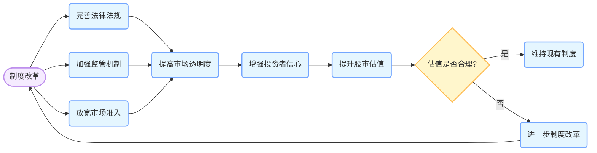

# 新兴市场股市估值与制度改革的相关性

> 关键词：新兴市场股市、股市估值、制度改革、相关性分析、金融市场发展

> 摘要：本文旨在深入探讨新兴市场股市估值与制度改革之间的相关性。通过对新兴市场股市估值的核心概念、影响因素进行剖析，阐述制度改革的原理和架构。详细讲解了用于分析两者相关性的核心算法原理及操作步骤，并结合数学模型和公式进行理论推导与举例说明。通过项目实战，给出实际代码案例并进行解读。同时探讨了新兴市场股市估值与制度改革相关性在实际中的应用场景，推荐了相关的学习资源、开发工具框架和论文著作。最后总结了未来发展趋势与挑战，解答常见问题并提供扩展阅读与参考资料，全面展现了两者之间的复杂关系及其对新兴市场金融发展的重要意义。

## 1. 背景介绍 
### 1.1 目的和范围
本研究的主要目的是探究新兴市场股市估值与制度改革之间的内在联系。新兴市场在全球经济格局中扮演着日益重要的角色，其股市的发展对于吸引投资、促进经济增长具有关键作用。股市估值反映了市场对股票价值的判断，而制度改革则涵盖了从法律法规到市场监管等多个方面的变革。了解两者之间的相关性，有助于投资者更好地把握新兴市场的投资机会，也为政策制定者提供参考，以制定更有效的制度改革措施来促进股市健康发展。

研究范围主要聚焦于新兴市场国家的股市，包括亚洲、非洲、拉丁美洲等地区具有代表性的新兴经济体。同时，考虑到制度改革的多维度性，将涉及公司治理、信息披露、交易规则等多个领域的制度变革。

### 1.2 预期读者
本文的预期读者包括金融领域的投资者、研究人员、政策制定者以及对新兴市场金融发展感兴趣的人士。对于投资者而言，能够从文章中获取有关新兴市场股市估值与制度改革关系的信息，辅助投资决策；研究人员可以在此基础上开展更深入的学术研究；政策制定者则可以借鉴相关结论，优化制度改革方案。

### 1.3 文档结构概述
本文将按照以下结构展开：首先介绍核心概念与联系，明确新兴市场股市估值和制度改革的定义、原理及相互关系；接着阐述核心算法原理和具体操作步骤，为分析两者相关性提供技术手段；然后给出数学模型和公式，并进行详细讲解和举例说明；通过项目实战，展示代码实现和分析过程；探讨实际应用场景；推荐相关的工具和资源；总结未来发展趋势与挑战；在附录中解答常见问题；最后提供扩展阅读和参考资料。

### 1.4 术语表
#### 1.4.1 核心术语定义
- **新兴市场股市**：指发展中国家或地区的股票市场，通常具有较高的增长潜力，但也伴随着较大的风险和不确定性。
- **股市估值**：是对股票价值的评估，通过各种估值方法来确定股票价格是否合理，常见的估值指标包括市盈率（P/E）、市净率（P/B）等。
- **制度改革**：指对金融市场相关制度进行的调整和完善，包括法律法规的修订、监管政策的改变、市场机制的创新等，旨在提高市场效率、增强市场稳定性和保护投资者权益。

#### 1.4.2 相关概念解释
- **市盈率（P/E）**：是股票价格与每股收益的比率，反映了市场对公司未来盈利的预期。较高的市盈率通常意味着市场对公司的增长前景较为乐观，但也可能暗示股票价格被高估。
- **市净率（P/B）**：是股票价格与每股净资产的比率，衡量了股票价格相对于公司净资产的倍数。市净率较低的股票可能被认为具有投资价值，但也可能反映公司存在潜在问题。
- **公司治理**：是一套规范公司管理层、股东和其他利益相关者之间关系的制度安排，良好的公司治理有助于提高公司的运营效率和透明度。

#### 1.4.3 缩略词列表
- **P/E**：Price-to-Earnings Ratio，市盈率
- **P/B**：Price-to-Book Ratio，市净率

## 2. 核心概念与联系 

### 新兴市场股市估值
新兴市场股市估值是一个复杂的过程，受到多种因素的影响。从基本的财务指标来看，公司的盈利能力、资产质量、现金流状况等都会对股票估值产生影响。例如，一家盈利能力强、资产质量高的公司，其股票往往会获得较高的估值。

此外，宏观经济因素也起着重要作用。新兴市场国家的经济增长速度、通货膨胀率、利率水平等都会影响股市的整体估值。经济增长较快的国家，企业的盈利预期通常较高，股市估值也可能相应提升；而高通货膨胀率和高利率则可能对股市估值产生负面影响。

### 制度改革
制度改革涵盖了多个方面，包括法律法规的完善、监管机制的加强、市场准入的放宽等。法律法规的完善可以为市场参与者提供明确的行为准则，减少违规行为的发生；监管机制的加强可以提高市场的透明度和公正性，保护投资者的合法权益；市场准入的放宽可以吸引更多的投资者和企业进入市场，增加市场的活力和竞争力。

### 两者的联系
制度改革对新兴市场股市估值有着重要的影响。一方面，良好的制度环境可以提高市场的效率和稳定性，增强投资者的信心，从而提升股市的整体估值。例如，完善的信息披露制度可以使投资者更准确地了解公司的真实情况，减少信息不对称，降低投资风险，进而提高市场对股票的估值。另一方面，股市估值的变化也可以反馈给制度改革。如果股市估值长期偏低，可能反映出市场存在一些制度性问题，需要进行相应的改革来改善市场环境。

下面是一个描述新兴市场股市估值与制度改革关系的 Mermaid 流程图：


## 3. 核心算法原理 & 具体操作步骤 

### 算法原理
为了分析新兴市场股市估值与制度改革的相关性，我们可以采用多元线性回归模型。该模型的基本思想是，将股市估值作为因变量，将制度改革的相关指标作为自变量，通过建立回归方程来分析自变量对因变量的影响程度。

假设我们有 $n$ 个样本，每个样本包含股市估值指标 $y$ 和 $k$ 个制度改革指标 $x_1, x_2, \cdots, x_k$，则多元线性回归模型可以表示为：

$$y_i = \beta_0 + \beta_1x_{i1} + \beta_2x_{i2} + \cdots + \beta_kx_{ik} + \epsilon_i$$

其中，$y_i$ 是第 $i$ 个样本的股市估值，$x_{ij}$ 是第 $i$ 个样本的第 $j$ 个制度改革指标，$\beta_0$ 是截距项，$\beta_1, \beta_2, \cdots, \beta_k$ 是回归系数，$\epsilon_i$ 是误差项。

### 具体操作步骤
1. **数据收集**：收集新兴市场国家的股市估值数据和制度改革相关数据。股市估值数据可以选择市盈率、市净率等指标；制度改革数据可以包括法律法规完善程度、监管强度、市场开放度等指标。
2. **数据预处理**：对收集到的数据进行清洗和预处理，包括去除缺失值、异常值处理、数据标准化等操作，以提高数据的质量和可比性。
3. **模型建立**：使用 Python 的 `statsmodels` 库建立多元线性回归模型，并进行参数估计。
4. **模型评估**：通过计算回归系数的显著性、决定系数 $R^2$ 等指标来评估模型的拟合效果。
5. **结果分析**：根据模型的回归系数和显著性水平，分析制度改革指标对股市估值的影响程度和方向。

以下是使用 Python 实现多元线性回归模型的代码示例：

```python
import pandas as pd
import statsmodels.api as sm

# 假设我们已经收集到了数据，并存储在一个 CSV 文件中
data = pd.read_csv('emerging_market_data.csv')

# 分离自变量和因变量
X = data[['regulation_index', 'market_openness', 'governance_score']]  # 制度改革指标
y = data['pe_ratio']  # 股市估值指标（市盈率）

# 添加常数项
X = sm.add_constant(X)

# 建立多元线性回归模型
model = sm.OLS(y, X)

# 拟合模型
results = model.fit()

# 输出模型结果
print(results.summary())
```

## 4. 数学模型和公式 & 详细讲解 & 举例说明 

### 多元线性回归模型
多元线性回归模型的一般形式为：

$$y = \beta_0 + \beta_1x_1 + \beta_2x_2 + \cdots + \beta_kx_k + \epsilon$$

其中，$y$ 是因变量，$x_1, x_2, \cdots, x_k$ 是自变量，$\beta_0$ 是截距项，$\beta_1, \beta_2, \cdots, \beta_k$ 是回归系数，$\epsilon$ 是误差项。误差项 $\epsilon$ 表示模型无法解释的随机因素，通常假设其服从均值为 0、方差为 $\sigma^2$ 的正态分布，即 $\epsilon \sim N(0, \sigma^2)$。

### 最小二乘法估计
为了估计回归系数 $\beta_0, \beta_1, \cdots, \beta_k$，我们通常采用最小二乘法。最小二乘法的目标是使残差平方和最小，即：

$$\min_{\beta_0, \beta_1, \cdots, \beta_k} \sum_{i=1}^{n} (y_i - \hat{y}_i)^2$$

其中，$y_i$ 是第 $i$ 个样本的实际值，$\hat{y}_i$ 是第 $i$ 个样本的预测值，$\hat{y}_i = \beta_0 + \beta_1x_{i1} + \beta_2x_{i2} + \cdots + \beta_kx_{ik}$。

通过求解上述最小化问题，可以得到回归系数的估计值 $\hat{\beta}_0, \hat{\beta}_1, \cdots, \hat{\beta}_k$。在矩阵形式下，回归系数的估计值可以表示为：

$$\hat{\beta} = (X^TX)^{-1}X^Ty$$

其中，$X$ 是自变量矩阵，$y$ 是因变量向量。

### 决定系数 $R^2$
决定系数 $R^2$ 是衡量回归模型拟合优度的一个重要指标，它表示因变量的变异中可以由自变量解释的比例。$R^2$ 的计算公式为：

$$R^2 = 1 - \frac{\sum_{i=1}^{n} (y_i - \hat{y}_i)^2}{\sum_{i=1}^{n} (y_i - \bar{y})^2}$$

其中，$\bar{y}$ 是因变量的均值。$R^2$ 的取值范围是 $[0, 1]$，$R^2$ 越接近 1，表示模型的拟合效果越好。

### 举例说明
假设我们有以下数据：

| 样本编号 | 市盈率（$y$） | 监管指数（$x_1$） | 市场开放度（$x_2$） | 公司治理得分（$x_3$） |
|----------|--------------|-------------------|---------------------|-----------------------|
| 1        | 20           | 70                | 0.8                 | 80                    |
| 2        | 22           | 75                | 0.85                | 85                    |
| 3        | 18           | 65                | 0.7                 | 75                    |
| 4        | 25           | 80                | 0.9                 | 90                    |
| 5        | 19           | 68                | 0.75                | 78                    |

使用上述数据，我们可以建立多元线性回归模型，并计算回归系数和决定系数。

```python
import numpy as np
import statsmodels.api as sm

# 定义自变量和因变量
X = np.array([[70, 0.8, 80], [75, 0.85, 85], [65, 0.7, 75], [80, 0.9, 90], [68, 0.75, 78]])
y = np.array([20, 22, 18, 25, 19])

# 添加常数项
X = sm.add_constant(X)

# 建立多元线性回归模型
model = sm.OLS(y, X)

# 拟合模型
results = model.fit()

# 输出回归系数
print("回归系数：", results.params)

# 输出决定系数
print("决定系数 R^2：", results.rsquared)
```

通过上述代码，我们可以得到回归系数和决定系数的值，从而分析制度改革指标对股市估值的影响程度和模型的拟合效果。

## 5. 项目实战：代码实际案例和详细解释说明 

### 5.1  开发环境搭建
为了完成本项目实战，我们需要搭建以下开发环境：
1. **Python 环境**：建议使用 Python 3.7 及以上版本。可以从 Python 官方网站（https://www.python.org/downloads/）下载并安装。
2. **必要的库**：需要安装 `pandas`、`statsmodels`、`numpy` 等库。可以使用 `pip` 命令进行安装：
```sh
pip install pandas statsmodels numpy
```
3. **集成开发环境（IDE）**：推荐使用 PyCharm 或 Jupyter Notebook。PyCharm 是一款功能强大的 Python IDE，适合进行大规模项目开发；Jupyter Notebook 则更适合进行数据分析和代码演示。

### 5.2  源代码详细实现和代码解读
以下是一个完整的项目实战代码示例，用于分析新兴市场股市估值与制度改革的相关性：

```python
import pandas as pd
import statsmodels.api as sm
import numpy as np
import matplotlib.pyplot as plt

# 读取数据
data = pd.read_csv('emerging_market_data.csv')

# 数据预处理
# 去除缺失值
data = data.dropna()

# 分离自变量和因变量
X = data[['regulation_index', 'market_openness', 'governance_score']]  # 制度改革指标
y = data['pe_ratio']  # 股市估值指标（市盈率）

# 数据标准化
X = (X - X.mean()) / X.std()

# 添加常数项
X = sm.add_constant(X)

# 建立多元线性回归模型
model = sm.OLS(y, X)

# 拟合模型
results = model.fit()

# 输出模型结果
print(results.summary())

# 绘制回归系数的柱状图
coefficients = results.params[1:]
plt.bar(coefficients.index, coefficients.values)
plt.xlabel('制度改革指标')
plt.ylabel('回归系数')
plt.title('制度改革指标对股市估值的影响')
plt.show()

# 预测
new_data = pd.DataFrame({
    'regulation_index': [75],
    'market_openness': [0.8],
    'governance_score': [80]
})
new_data = (new_data - X.drop('const', axis=1).mean()) / X.drop('const', axis=1).std()
new_data = sm.add_constant(new_data)
predicted_value = results.predict(new_data)
print("预测的市盈率：", predicted_value[0])
```

### 代码解读与分析
1. **数据读取和预处理**：使用 `pandas` 库读取存储在 CSV 文件中的数据，并去除缺失值。对自变量进行数据标准化处理，以消除不同变量之间的量纲差异。
2. **模型建立和拟合**：使用 `statsmodels` 库的 `OLS` 函数建立多元线性回归模型，并使用 `fit` 方法进行模型拟合。
3. **模型结果输出**：使用 `summary` 方法输出模型的详细结果，包括回归系数、显著性水平、决定系数等。
4. **可视化分析**：使用 `matplotlib` 库绘制回归系数的柱状图，直观展示制度改革指标对股市估值的影响程度。
5. **预测**：使用训练好的模型对新的数据进行预测，输出预测的市盈率。

通过以上代码和分析，我们可以深入了解新兴市场股市估值与制度改革的相关性，并对未来的股市估值进行预测。

## 6. 实际应用场景 
### 投资者决策
对于投资者来说，了解新兴市场股市估值与制度改革的相关性可以帮助他们做出更明智的投资决策。如果制度改革能够显著提升股市估值，投资者可以在制度改革推进的过程中，提前布局相关股票，获取潜在的投资收益。例如，当一个新兴市场国家加强监管机制、完善信息披露制度时，市场的透明度和公正性将得到提高，投资者对市场的信心增强，股市估值可能会上升，此时投资者可以增加对该市场股票的投资。

### 政策制定
政策制定者可以根据两者的相关性来制定更有效的制度改革政策。如果发现某项制度改革对股市估值有积极的影响，政策制定者可以加大对该领域的改革力度。例如，如果研究表明放宽市场准入能够显著提升股市估值，政策制定者可以考虑进一步降低外资进入门槛，吸引更多的国际资本进入本国股市。

### 市场研究
金融研究机构和学者可以通过研究新兴市场股市估值与制度改革的相关性，深入了解新兴市场金融市场的运行机制和发展规律。这有助于他们提出更有针对性的理论和建议，推动新兴市场金融市场的健康发展。

## 7. 工具和资源推荐
### 7.1 学习资源推荐
#### 7.1.1 书籍推荐
- 《金融市场学》：全面介绍了金融市场的基本概念、运行机制和分析方法，对于理解新兴市场股市和制度改革有很大帮助。
- 《计量经济学》：详细讲解了计量经济学的理论和方法，包括多元线性回归模型等，是进行相关性分析的重要参考书籍。
- 《新兴市场投资》：专门探讨了新兴市场的投资机会和风险，以及如何在新兴市场进行有效的投资决策。

#### 7.1.2 在线课程
- Coursera 上的“金融市场分析”课程：由知名大学的教授授课，涵盖了金融市场的各个方面，包括股市估值和制度改革。
- edX 上的“计量经济学入门”课程：系统介绍了计量经济学的基本原理和方法，适合初学者学习。

#### 7.1.3 技术博客和网站
- 金融界网站：提供了丰富的金融市场资讯和分析报告，包括新兴市场股市的动态和制度改革的相关信息。
- 量化投资与机器学习博客：分享了量化投资和数据分析的技术和方法，对于进行股市估值和相关性分析有一定的参考价值。

### 7.2 开发工具框架推荐
#### 7.2.1 IDE和编辑器
- PyCharm：功能强大的 Python IDE，具有代码编辑、调试、版本控制等功能，适合进行大规模的数据分析和模型开发。
- Jupyter Notebook：交互式的开发环境，支持代码、文本、图表等多种形式的展示，非常适合进行数据探索和分析。

#### 7.2.2 调试和性能分析工具
- `pdb`：Python 自带的调试工具，可以帮助开发者定位代码中的错误和问题。
- `cProfile`：Python 的性能分析工具，可以分析代码的运行时间和内存使用情况，帮助优化代码性能。

#### 7.2.3 相关框架和库
- `pandas`：用于数据处理和分析的 Python 库，提供了高效的数据结构和数据操作方法。
- `statsmodels`：用于统计建模和分析的 Python 库，支持多种统计模型，包括多元线性回归模型。
- `numpy`：Python 的数值计算库，提供了高效的数组操作和数学函数，是进行数据分析和模型计算的基础库。

### 7.3 相关论文著作推荐
#### 7.3.1 经典论文
- “The Impact of Institutional Reforms on Stock Market Valuation in Emerging Economies”：该论文深入研究了新兴市场制度改革对股市估值的影响，提出了一些重要的理论和实证结果。
- “Stock Market Valuation and Corporate Governance in Emerging Markets”：探讨了公司治理与股市估值之间的关系，为理解新兴市场股市的运行机制提供了新的视角。

#### 7.3.2 最新研究成果
- 关注顶尖金融学术期刊，如《Journal of Financial Economics》、《Review of Financial Studies》等，这些期刊上经常发表关于新兴市场金融和制度改革的最新研究成果。

#### 7.3.3 应用案例分析
- 世界银行和国际货币基金组织发布的相关报告，其中包含了许多新兴市场国家金融市场改革和发展的实际案例，可以为我们提供实践经验和启示。

## 8. 总结：未来发展趋势与挑战
### 未来发展趋势
1. **制度改革持续深化**：随着新兴市场国家经济的发展和金融市场的不断完善，制度改革将持续推进。未来可能会在公司治理、信息披露、市场监管等方面进行更深入的改革，以提高市场的效率和稳定性。
2. **科技赋能金融市场**：科技的快速发展将为新兴市场股市和制度改革带来新的机遇。例如，区块链技术可以提高信息的透明度和安全性，人工智能可以用于市场分析和风险预警，这些技术的应用将推动新兴市场金融市场的创新发展。
3. **国际合作加强**：新兴市场国家在金融领域的国际合作将不断加强。通过与国际金融机构和其他国家的合作，新兴市场国家可以借鉴先进的制度和经验，提升自身的金融市场竞争力。

### 挑战
1. **经济不确定性**：新兴市场国家的经济发展往往受到国际经济环境的影响，全球经济增长放缓、贸易摩擦等因素可能会给新兴市场股市带来不确定性。制度改革需要在这种复杂的经济环境中寻找平衡，以确保市场的稳定发展。
2. **制度改革难度大**：制度改革涉及到多个利益主体和复杂的社会经济关系，改革过程中可能会遇到各种阻力。如何协调各方利益，推动制度改革的顺利实施，是新兴市场国家面临的一大挑战。
3. **数据质量和可得性**：进行新兴市场股市估值与制度改革相关性分析需要大量高质量的数据，但新兴市场国家的数据质量和可得性可能存在问题。数据的不准确和不完整可能会影响分析结果的可靠性。

## 9. 附录：常见问题与解答
### 问题 1：多元线性回归模型的假设条件有哪些？
答：多元线性回归模型有以下几个主要假设条件：
1. **线性关系**：因变量与自变量之间存在线性关系。
2. **独立性**：误差项之间相互独立。
3. **同方差性**：误差项的方差是常数，不随自变量的取值而变化。
4. **正态性**：误差项服从正态分布。

### 问题 2：如何判断回归系数的显著性？
答：可以通过 $t$ 检验来判断回归系数的显著性。在回归分析结果中，通常会给出每个回归系数的 $t$ 值和 $p$ 值。如果 $p$ 值小于设定的显著性水平（通常为 0.05），则可以认为该回归系数是显著的，即自变量对因变量有显著的影响。

### 问题 3：数据标准化的作用是什么？
答：数据标准化的作用主要有以下几点：
1. **消除量纲影响**：不同变量的量纲可能不同，标准化可以使不同变量具有相同的量纲，便于进行比较和分析。
2. **提高模型的稳定性**：标准化可以减少数据的波动，使模型的训练更加稳定，避免某些变量因数值过大或过小而对模型产生过大的影响。
3. **加快模型收敛速度**：在一些机器学习算法中，标准化可以加快模型的收敛速度，提高训练效率。

## 10. 扩展阅读 & 参考资料
### 扩展阅读
- 《金融科技前沿》：介绍了金融科技的最新发展趋势和应用案例，对于了解科技如何影响新兴市场金融市场有很大帮助。
- 《新兴市场的崛起与挑战》：深入探讨了新兴市场国家在经济发展和金融市场建设过程中面临的机遇和挑战。

### 参考资料
1. 金融数据提供商：如 Bloomberg、Wind 等，提供了丰富的金融市场数据。
2. 国际金融机构报告：世界银行、国际货币基金组织等发布的关于新兴市场金融发展的报告。
3. 学术数据库：如 Web of Science、EBSCOhost 等，可获取相关的学术论文和研究成果。

作者：AI天才研究院/AI Genius Institute & 禅与计算机程序设计艺术 /Zen And The Art of Computer Programming