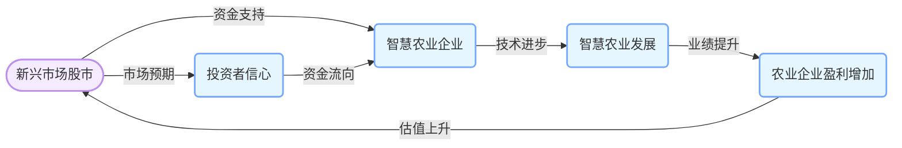

# 新兴市场股市估值与智慧农业发展的互动

> 关键词：新兴市场、股市估值、智慧农业、互动关系、经济发展

> 摘要：本文深入探讨了新兴市场股市估值与智慧农业发展之间的互动关系。首先介绍了研究的背景、目的、预期读者等内容，接着阐述了核心概念及其联系，详细讲解了相关算法原理和操作步骤，分析了数学模型和公式。通过项目实战案例，展示了两者互动在实际中的体现。同时探讨了实际应用场景，推荐了相关的学习资源、开发工具框架和论文著作。最后总结了未来发展趋势与挑战，并对常见问题进行了解答，提供了扩展阅读和参考资料。旨在全面揭示新兴市场股市估值与智慧农业发展相互影响的机制和内在逻辑，为相关领域的研究和实践提供有价值的参考。

## 1. 背景介绍 
### 1.1 目的和范围
新兴市场在全球经济格局中扮演着越来越重要的角色，其股市的表现不仅反映了市场对企业未来盈利能力的预期，也与国家和地区的经济发展紧密相连。而智慧农业作为农业现代化的重要方向，对于保障粮食安全、提高农业生产效率、促进农村经济发展具有关键意义。本研究的目的在于深入探究新兴市场股市估值与智慧农业发展之间的互动关系，明确两者相互影响的机制和路径。研究范围涵盖了多个具有代表性的新兴市场国家和地区，分析其股市中与农业相关企业的估值变化，以及智慧农业发展的现状和趋势。

### 1.2 预期读者
本文预期读者包括金融领域的投资者、分析师，农业领域的科研人员、从业者，政策制定者以及对新兴市场经济和智慧农业发展感兴趣的学者和爱好者。对于投资者和分析师而言，了解两者的互动关系有助于优化投资决策，把握市场趋势；对于农业从业者和科研人员，可从金融市场的角度获取智慧农业发展的支持和动力；政策制定者则能依据研究结果制定更合理的政策，促进新兴市场股市和智慧农业的协同发展。

### 1.3 文档结构概述
本文首先介绍研究的背景信息，包括目的、预期读者和文档结构概述等内容。接着阐述新兴市场股市估值与智慧农业发展的核心概念及其联系，通过文本示意图和 Mermaid 流程图展示其内在逻辑。然后详细讲解相关的核心算法原理和具体操作步骤，结合 Python 源代码进行说明。之后分析数学模型和公式，并举例说明。通过项目实战案例，介绍开发环境搭建、源代码实现和代码解读。探讨实际应用场景，推荐相关的学习资源、开发工具框架和论文著作。最后总结未来发展趋势与挑战，解答常见问题，提供扩展阅读和参考资料。

### 1.4 术语表
#### 1.4.1 核心术语定义
- **新兴市场**：指发展中国家或地区的金融市场，具有较高的经济增长潜力，但也伴随着较高的风险和不稳定性。
- **股市估值**：对股票市场中上市公司价值的评估，通常通过各种估值指标如市盈率、市净率等进行衡量。
- **智慧农业**：将物联网、大数据、人工智能等现代信息技术与农业生产、经营、管理和服务深度融合的现代农业发展模式。

#### 1.4.2 相关概念解释
- **金融市场效率**：指金融市场将信息迅速、准确地反映在资产价格中的能力，高效的金融市场有助于合理的股市估值。
- **农业现代化**：包括农业生产技术现代化、农业经营管理现代化等多个方面，智慧农业是农业现代化的重要组成部分。

#### 1.4.3 缩略词列表
- **AI**：Artificial Intelligence，人工智能
- **IoT**：Internet of Things，物联网
- **PE**：Price-to-Earnings Ratio，市盈率
- **PB**：Price-to-Book Ratio，市净率

## 2. 核心概念与联系 

### 核心概念原理
#### 新兴市场股市估值原理
新兴市场股市估值受到多种因素的影响。宏观经济因素如 GDP 增长率、通货膨胀率、利率等会对整个股市的估值水平产生影响。当经济增长强劲时，企业的盈利预期增加，股市估值往往会上升；而高通货膨胀率和利率上升可能会导致股市估值下降。行业因素也很重要，不同行业的发展前景和盈利能力不同，其估值水平也会有差异。例如，新兴的科技行业通常具有较高的估值倍数，而传统的制造业估值相对较低。公司自身的财务状况、管理水平、市场竞争力等因素也是决定其股票估值的关键。

#### 智慧农业发展原理
智慧农业的发展基于现代信息技术的应用。物联网技术通过在农业生产环境中部署大量的传感器，实时采集土壤湿度、温度、光照强度等数据，实现对农业生产环境的精准监测。大数据技术对这些海量数据进行存储、分析和挖掘，为农业生产决策提供依据。人工智能技术则可以实现农业生产过程的自动化控制，如智能灌溉、智能施肥、病虫害智能预警等。通过这些技术的综合应用，提高农业生产效率、降低生产成本、提升农产品质量。

### 架构的文本示意图
新兴市场股市与智慧农业之间存在着复杂的互动关系。一方面，智慧农业的发展会影响新兴市场股市中农业相关企业的估值。当智慧农业技术得到广泛应用，农业企业的生产效率提高、成本降低、盈利能力增强，其股票的估值也会相应上升。另一方面，新兴市场股市的估值变化也会对智慧农业的发展产生影响。如果股市对农业相关企业的估值较高，企业可以通过股权融资获得更多的资金，用于智慧农业技术的研发和应用，从而推动智慧农业的发展。

### Mermaid 流程图


## 3. 核心算法原理 & 具体操作步骤 

### 股市估值算法原理
常用的股市估值方法有市盈率法、市净率法和现金流折现法等。这里以市盈率法为例进行说明。市盈率（PE）是指股票价格与每股收益的比值，计算公式为：$PE=\frac{P}{EPS}$，其中 $P$ 为股票价格，$EPS$ 为每股收益。通过与同行业其他公司的市盈率进行比较，或者与历史市盈率水平进行对比，可以判断股票的估值是否合理。

### Python 代码实现
```python
# 定义计算市盈率的函数
def calculate_pe(stock_price, earnings_per_share):
    if earnings_per_share == 0:
        return None
    else:
        return stock_price / earnings_per_share

# 示例数据
stock_price = 50
earnings_per_share = 2

# 计算市盈率
pe_ratio = calculate_pe(stock_price, earnings_per_share)
print(f"市盈率: {pe_ratio}")
```

### 操作步骤
1. 收集股票的价格数据和每股收益数据。可以从金融数据提供商如 Bloomberg、Wind 等获取相关数据。
2. 使用上述 Python 代码计算市盈率。
3. 将计算得到的市盈率与同行业其他公司的市盈率进行比较，或者与历史市盈率水平进行对比，判断股票的估值是否合理。

### 智慧农业数据分析算法原理
在智慧农业中，需要对大量的传感器数据进行分析，以实现精准农业生产。例如，通过对土壤湿度数据的分析，可以确定何时进行灌溉。可以使用时间序列分析算法如 ARIMA（自回归积分滑动平均模型）对土壤湿度数据进行预测。

### Python 代码实现
```python
import pandas as pd
from statsmodels.tsa.arima.model import ARIMA

# 示例土壤湿度数据
humidity_data = pd.Series([20, 22, 24, 26, 28, 30, 32, 34, 36, 38])

# 拟合 ARIMA 模型
model = ARIMA(humidity_data, order=(1, 1, 1))
model_fit = model.fit()

# 预测未来的土壤湿度
forecast = model_fit.get_forecast(steps=3)
print(f"未来 3 期的土壤湿度预测值: {forecast.predicted_mean}")
```

### 操作步骤
1. 收集土壤湿度等传感器数据。可以通过物联网设备实时采集数据。
2. 将数据整理成时间序列数据格式，如 Pandas 的 Series 或 DataFrame。
3. 使用上述 Python 代码拟合 ARIMA 模型，并进行预测。
4. 根据预测结果，制定相应的农业生产决策，如灌溉计划。

## 4. 数学模型和公式 & 详细讲解 & 举例说明 

### 股市估值数学模型
#### 市盈率模型
市盈率模型的基本公式为 $P = PE \times EPS$，其中 $P$ 为股票价格，$PE$ 为市盈率，$EPS$ 为每股收益。该模型假设股票的价格与每股收益成正比，市盈率反映了市场对公司未来盈利增长的预期。例如，某公司的每股收益为 2 元，同行业平均市盈率为 15 倍，则该公司的股票合理价格为 $P = 15 \times 2 = 30$ 元。

#### 现金流折现模型
现金流折现模型（DCF）的基本公式为 $V=\sum_{t=1}^{n}\frac{FCF_t}{(1+r)^t}$，其中 $V$ 为公司的价值，$FCF_t$ 为第 $t$ 期的自由现金流，$r$ 为折现率，$n$ 为预测期数。该模型的核心思想是将公司未来的自由现金流折现到当前时刻，以评估公司的内在价值。例如，某公司未来 3 年的自由现金流分别为 100 万元、120 万元、150 万元，折现率为 10%，则该公司的价值为：

$$
\begin{align*}
V&=\frac{100}{(1 + 0.1)^1}+\frac{120}{(1 + 0.1)^2}+\frac{150}{(1 + 0.1)^3}\\
&=\frac{100}{1.1}+\frac{120}{1.21}+\frac{150}{1.331}\\
&\approx 90.91 + 99.17 + 112.69\\
&=302.77 \text{ 万元}
\end{align*}
$$

### 智慧农业数学模型
#### 作物生长模型
作物生长模型可以描述作物生长过程中各种生理和生态过程与环境因素之间的关系。例如，常用的 WOFOST 模型（World Food Studies 模型），其基本原理是通过模拟作物的光合作用、呼吸作用、蒸腾作用等生理过程，预测作物的生长发育和产量。该模型的数学表达式较为复杂，涉及多个参数和方程。

#### 病虫害预测模型
病虫害预测模型可以根据气象数据、作物生长状态等因素预测病虫害的发生概率和程度。例如，基于逻辑回归模型的病虫害预测公式为 $P(Y = 1|X)=\frac{1}{1 + e^{-(\beta_0+\beta_1X_1+\beta_2X_2+\cdots+\beta_nX_n)}}$，其中 $P(Y = 1|X)$ 为病虫害发生的概率，$X_1,X_2,\cdots,X_n$ 为影响病虫害发生的因素，如温度、湿度、作物品种等，$\beta_0,\beta_1,\cdots,\beta_n$ 为模型的参数。

## 5. 项目实战：代码实际案例和详细解释说明 

### 5.1  开发环境搭建
#### 软件环境
- **Python 环境**：建议使用 Python 3.7 及以上版本。可以从 Python 官方网站（https://www.python.org/downloads/）下载安装。
- **集成开发环境（IDE）**：推荐使用 PyCharm 或 Jupyter Notebook。PyCharm 是一款功能强大的 Python IDE，适合进行大型项目的开发；Jupyter Notebook 则更适合进行数据分析和代码演示。
- **数据处理库**：安装 Pandas、NumPy 等数据处理库，用于数据的读取、处理和分析。可以使用以下命令进行安装：
```sh
pip install pandas numpy
```
- **机器学习库**：安装 Scikit-learn、Statsmodels 等机器学习库，用于实现相关的算法模型。可以使用以下命令进行安装：
```sh
pip install scikit-learn statsmodels
```

#### 硬件环境
- **计算机**：建议使用配置较高的计算机，至少具备 8GB 以上的内存和 500GB 以上的硬盘空间。

### 5.2  源代码详细实现和代码解读
#### 股市估值分析代码
```python
import pandas as pd

# 模拟股票数据
stock_data = {
    '股票代码': ['000001', '000002', '000003'],
    '股票价格': [50, 60, 70],
    '每股收益': [2, 3, 4]
}

# 创建 DataFrame
df = pd.DataFrame(stock_data)

# 计算市盈率
df['市盈率'] = df['股票价格'] / df['每股收益']

# 打印结果
print(df)
```
**代码解读**：
1. 首先，使用字典模拟了股票的价格和每股收益数据。
2. 然后，使用 Pandas 的 DataFrame 来存储这些数据。
3. 接着，通过将股票价格除以每股收益，计算出市盈率，并将结果添加到 DataFrame 中。
4. 最后，打印出包含市盈率的 DataFrame。

#### 智慧农业数据分析代码
```python
import pandas as pd
from statsmodels.tsa.arima.model import ARIMA
import matplotlib.pyplot as plt

# 模拟土壤湿度数据
humidity_data = pd.Series([20, 22, 24, 26, 28, 30, 32, 34, 36, 38])

# 拟合 ARIMA 模型
model = ARIMA(humidity_data, order=(1, 1, 1))
model_fit = model.fit()

# 预测未来的土壤湿度
forecast = model_fit.get_forecast(steps=3)
forecast_mean = forecast.predicted_mean

# 绘制原始数据和预测数据
plt.plot(humidity_data, label='原始数据')
plt.plot(range(len(humidity_data), len(humidity_data) + len(forecast_mean)), forecast_mean, label='预测数据')
plt.xlabel('时间')
plt.ylabel('土壤湿度')
plt.title('土壤湿度预测')
plt.legend()
plt.show()
```
**代码解读**：
1. 首先，使用 Pandas 的 Series 模拟了土壤湿度数据。
2. 然后，使用 ARIMA 模型对数据进行拟合。
3. 接着，使用拟合好的模型预测未来 3 期的土壤湿度。
4. 最后，使用 Matplotlib 库绘制原始数据和预测数据的折线图，直观展示土壤湿度的变化趋势。

### 5.3  代码解读与分析
#### 股市估值代码分析
上述股市估值代码通过简单的数学运算计算了股票的市盈率。在实际应用中，还可以进一步扩展代码，例如从金融数据库中读取真实的股票数据，对不同行业的股票进行分类分析，计算行业平均市盈率等。此外，还可以结合其他估值方法，如市净率法、现金流折现法等，进行综合估值分析。

#### 智慧农业数据分析代码分析
智慧农业数据分析代码使用 ARIMA 模型对土壤湿度数据进行了预测。在实际应用中，需要根据具体的数据集和问题，调整模型的参数，以提高预测的准确性。此外，还可以结合其他传感器数据，如温度、光照强度等，构建更复杂的模型，实现对农业生产环境的全面监测和预测。

## 6. 实际应用场景 
### 金融投资领域
投资者可以通过分析新兴市场股市中农业相关企业的估值变化，结合智慧农业的发展趋势，制定投资策略。如果智慧农业技术的发展前景良好，相关企业的盈利能力有望提升，其股票估值可能会上升，投资者可以适时买入这些股票。同时，金融机构也可以开发与智慧农业相关的金融产品，如农业产业基金、农业债券等，为智慧农业的发展提供资金支持。

### 农业生产领域
智慧农业企业可以根据股市的估值变化，合理安排融资计划。当股市对企业的估值较高时，企业可以通过股权融资获得更多的资金，用于技术研发和扩大生产规模。同时，企业可以利用大数据和人工智能技术，对股市数据进行分析，了解市场对智慧农业的需求和预期，优化产品和服务。

### 政策制定领域
政策制定者可以通过研究新兴市场股市估值与智慧农业发展的互动关系，制定相应的政策。例如，出台税收优惠政策、财政补贴政策等，鼓励金融机构加大对智慧农业的支持力度，促进农业企业的发展。同时，加强对智慧农业技术研发和应用的引导，提高农业生产的效率和质量。

## 7. 工具和资源推荐
### 7.1 学习资源推荐
#### 7.1.1 书籍推荐
- 《金融市场学》：全面介绍了金融市场的基本概念、运行机制和分析方法，对于理解股市估值有很大帮助。
- 《智慧农业：概念、技术与应用》：详细阐述了智慧农业的相关技术和应用案例