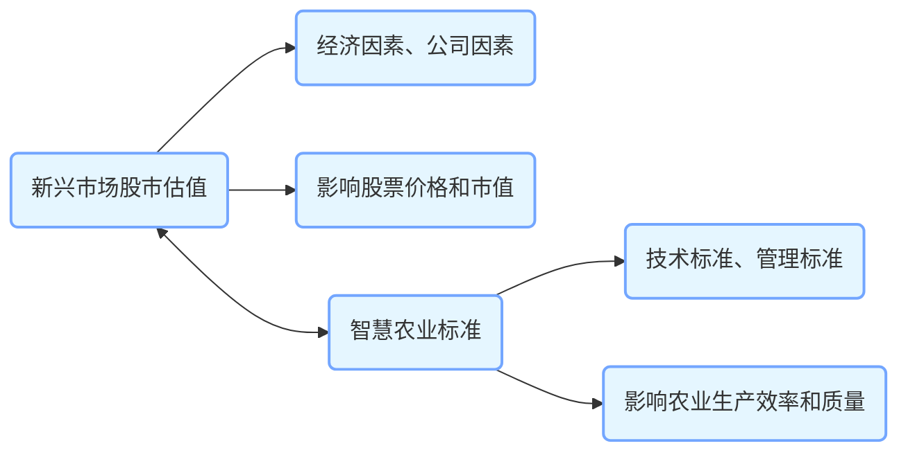

# 新兴市场股市估值与智慧农业标准的互动

> 关键词：新兴市场股市估值、智慧农业标准、互动关系、金融市场、农业科技

> 摘要：本文聚焦于新兴市场股市估值与智慧农业标准之间的互动关系。首先介绍了研究的背景、目的、预期读者、文档结构和相关术语。接着阐述了新兴市场股市估值和智慧农业标准的核心概念及其联系，并通过流程图进行直观展示。详细讲解了涉及的核心算法原理和具体操作步骤，给出了Python源代码示例。同时，运用数学模型和公式对两者的互动关系进行了深入分析，并举例说明。通过项目实战，展示了如何在实际中研究这种互动关系，包括开发环境搭建、源代码实现和代码解读。探讨了两者互动在实际中的应用场景，推荐了相关的学习资源、开发工具框架和论文著作。最后总结了未来发展趋势与挑战，提供了常见问题解答和扩展阅读参考资料，旨在为读者全面深入地理解新兴市场股市估值与智慧农业标准的互动提供理论和实践依据。

## 1. 背景介绍 
### 1.1 目的和范围
随着全球经济的发展，新兴市场在国际经济舞台上的地位日益重要。新兴市场股市作为经济的重要组成部分，其估值受到多种因素的影响。与此同时，智慧农业作为农业现代化的重要发展方向，其标准的制定和完善对于农业产业的升级和发展具有关键作用。本研究的目的在于深入探究新兴市场股市估值与智慧农业标准之间的互动关系，分析两者相互影响的机制和程度。研究范围涵盖了多个新兴市场国家和地区的股市数据，以及智慧农业领域的相关标准和产业发展情况。

### 1.2 预期读者
本文预期读者包括金融市场从业者，如股票分析师、投资经理等，他们可以从本文中了解新兴市场股市估值的新影响因素，为投资决策提供参考；农业科技领域的研究者和从业者，能够通过本文认识到智慧农业标准对金融市场的潜在影响，促进智慧农业产业与金融市场的融合发展；以及对新兴市场经济和农业现代化感兴趣的学者和学生，帮助他们拓宽研究视野，丰富相关知识体系。

### 1.3 文档结构概述
本文将按照以下结构进行阐述：首先介绍研究的背景信息，包括目的、预期读者、文档结构和术语表；接着详细讲解新兴市场股市估值和智慧农业标准的核心概念及其联系，并用流程图进行直观展示；然后阐述核心算法原理和具体操作步骤，给出Python源代码示例；再运用数学模型和公式对两者的互动关系进行分析，并举例说明；通过项目实战展示如何在实际中研究这种互动关系；探讨两者互动在实际中的应用场景；推荐相关的学习资源、开发工具框架和论文著作；最后总结未来发展趋势与挑战，提供常见问题解答和扩展阅读参考资料。

### 1.4 术语表
#### 1.4.1 核心术语定义
- **新兴市场股市估值**：指对新兴市场国家和地区股票市场中上市公司股票价值的评估，通常通过多种估值方法，如市盈率、市净率等，来判断股票价格是否合理。
- **智慧农业标准**：是指在智慧农业领域，为了规范农业生产、经营、管理等活动，提高农业生产效率和质量，保障农产品安全而制定的一系列技术规范、操作流程和质量标准。

#### 1.4.2 相关概念解释
- **新兴市场**：是指一些发展中国家或地区的金融市场，这些市场通常具有较高的经济增长率、快速的工业化进程和不断完善的金融体系，但也伴随着较高的风险和不确定性。
- **智慧农业**：是将物联网、大数据、人工智能等现代信息技术与农业生产、经营、管理深度融合的新型农业发展模式，旨在实现农业生产的智能化、精准化和高效化。

#### 1.4.3 缩略词列表
- **PE**：市盈率（Price-to-Earnings Ratio），是指股票价格除以每股收益的比率，用于衡量股票的估值水平。
- **PB**：市净率（Price-to-Book Ratio），是指股票价格除以每股净资产的比率，反映了市场对公司净资产的估值。

## 2. 核心概念与联系 
### 新兴市场股市估值核心概念
新兴市场股市估值是一个复杂的过程，它受到多种因素的综合影响。从宏观层面来看，经济增长、通货膨胀、利率水平等因素会影响整个股市的估值。例如，经济增长较快的新兴市场国家，企业的盈利预期通常较高，股市估值也可能相应提高。从微观层面来看，公司的财务状况、行业竞争力、管理层能力等因素会影响个别股票的估值。常用的估值方法包括市盈率法、市净率法、现金流折现法等。

### 智慧农业标准核心概念
智慧农业标准涵盖了多个方面，包括农业传感器标准、农业物联网通信标准、农业大数据处理标准、农业机器人操作标准等。这些标准的制定旨在确保智慧农业系统的兼容性、互操作性和可靠性，提高农业生产的效率和质量。例如，农业传感器标准规定了传感器的精度、测量范围、响应时间等参数，保证了传感器数据的准确性和一致性。

### 两者的联系
新兴市场股市估值与智慧农业标准之间存在着密切的联系。一方面，智慧农业标准的完善和推广有助于提高智慧农业企业的生产效率和竞争力，从而提升企业的盈利水平，进而影响新兴市场股市中智慧农业相关股票的估值。另一方面，新兴市场股市的估值情况也会影响智慧农业企业的融资环境和发展动力。如果股市估值较高，智慧农业企业更容易通过股权融资获得资金，加大研发投入，推动智慧农业标准的进一步完善。

### 文本示意图
```plaintext
新兴市场股市估值 <----> 智慧农业标准
         |                    |
  经济因素、公司因素      技术标准、管理标准
         |                    |
  影响股票价格和市值      影响农业生产效率和质量
```

### Mermaid 流程图


## 3. 核心算法原理 & 具体操作步骤 
### 核心算法原理
为了研究新兴市场股市估值与智慧农业标准的互动关系，我们可以采用多元线性回归分析方法。多元线性回归分析是一种统计方法，用于研究一个因变量与多个自变量之间的线性关系。在本研究中，我们将新兴市场股市估值（如市盈率）作为因变量，将智慧农业标准的相关指标（如标准的完善程度、推广程度等）以及其他可能影响股市估值的因素（如经济增长率、通货膨胀率等）作为自变量。

### 具体操作步骤
1. **数据收集**：收集新兴市场国家和地区的股市数据，包括市盈率、市净率等估值指标；收集智慧农业标准的相关数据，如标准的发布数量、实施范围等；收集宏观经济数据，如经济增长率、通货膨胀率等。
2. **数据预处理**：对收集到的数据进行清洗、整理和标准化处理，去除异常值和缺失值，使数据具有可比性。
3. **模型建立**：根据多元线性回归分析的原理，建立回归模型。假设因变量为 $y$（新兴市场股市估值），自变量为 $x_1, x_2, \cdots, x_n$（智慧农业标准相关指标和其他影响因素），则回归模型可以表示为：
$$y = \beta_0 + \beta_1x_1 + \beta_2x_2 + \cdots + \beta_nx_n + \epsilon$$
其中，$\beta_0$ 为截距项，$\beta_1, \beta_2, \cdots, \beta_n$ 为回归系数，$\epsilon$ 为误差项。
4. **模型估计**：使用最小二乘法估计回归模型的参数 $\beta_0, \beta_1, \beta_2, \cdots, \beta_n$。最小二乘法的目标是使误差项的平方和最小，即：
$$\min \sum_{i=1}^{m}(y_i - \hat{y}_i)^2$$
其中，$y_i$ 为实际观测值，$\hat{y}_i$ 为模型预测值。
5. **模型检验**：对估计得到的回归模型进行检验，包括显著性检验、拟合优度检验等。显著性检验用于检验回归系数是否显著不为零，拟合优度检验用于评估模型对数据的拟合程度。
6. **结果分析**：根据模型估计和检验的结果，分析新兴市场股市估值与智慧农业标准之间的关系，判断智慧农业标准对股市估值的影响程度和方向。

### Python源代码示例
```python
import pandas as pd
import numpy as np
from sklearn.linear_model import LinearRegression
from sklearn.model_selection import train_test_split
from sklearn.metrics import mean_squared_error

# 数据收集和预处理
# 假设 data.csv 文件包含了新兴市场股市估值、智慧农业标准相关指标和其他影响因素的数据
data = pd.read_csv('data.csv')
X = data.drop('stock_valuation', axis=1)  # 自变量
y = data['stock_valuation']  # 因变量

# 划分训练集和测试集
X_train, X_test, y_train, y_test = train_test_split(X, y, test_size=0.2, random_state=42)

# 模型建立和估计
model = LinearRegression()
model.fit(X_train, y_train)

# 模型预测
y_pred = model.predict(X_test)

# 模型评估
mse = mean_squared_error(y_test, y_pred)
print(f"均方误差: {mse}")

# 回归系数分析
coefficients = pd.DataFrame({'特征': X.columns, '系数': model.coef_})
print(coefficients)
```

## 4. 数学模型和公式 & 详细讲解 & 举例说明 
### 数学模型和公式
如前所述，我们使用多元线性回归模型来研究新兴市场股市估值与智慧农业标准的互动关系，模型表达式为：
$$y = \beta_0 + \beta_1x_1 + \beta_2x_2 + \cdots + \beta_nx_n + \epsilon$$
其中，$y$ 为新兴市场股市估值（如市盈率），$x_1, x_2, \cdots, x_n$ 为自变量，包括智慧农业标准相关指标（如标准的完善程度、推广程度等）和其他影响因素（如经济增长率、通货膨胀率等），$\beta_0$ 为截距项，$\beta_1, \beta_2, \cdots, \beta_n$ 为回归系数，$\epsilon$ 为误差项。

### 详细讲解
- **截距项 $\beta_0$**：表示当所有自变量都为零时，因变量 $y$ 的取值。在实际应用中，截距项可能没有明确的经济意义，但它是回归模型的重要组成部分。
- **回归系数 $\beta_i$**：表示当其他自变量保持不变时，自变量 $x_i$ 每变化一个单位，因变量 $y$ 的平均变化量。回归系数的正负号表示自变量与因变量之间的正相关或负相关关系，回归系数的绝对值大小表示自变量对因变量的影响程度。
- **误差项 $\epsilon$**：表示因变量 $y$ 中不能被自变量解释的部分，它反映了模型的不确定性和随机误差。误差项通常假设服从均值为零、方差为常数的正态分布。

### 举例说明
假设我们收集了某新兴市场国家 10 年的股市市盈率数据、智慧农业标准的完善程度数据（用 0 - 10 分表示）和经济增长率数据，建立多元线性回归模型如下：
$$PE = \beta_0 + \beta_1 \times 智慧农业标准完善程度 + \beta_2 \times 经济增长率 + \epsilon$$
通过最小二乘法估计得到回归系数 $\beta_0 = 10$，$\beta_1 = 0.5$，$\beta_2 = 2$。这意味着当智慧农业标准完善程度为 0 分，经济增长率为 0 时，股市市盈率的预测值为 10；当智慧农业标准完善程度每提高 1 分，在经济增长率不变的情况下，股市市盈率平均提高 0.5；当经济增长率每提高 1%，在智慧农业标准完善程度不变的情况下，股市市盈率平均提高 2。

## 5. 项目实战：代码实际案例和详细解释说明 
### 5.1  开发环境搭建
- **操作系统**：推荐使用 Windows 10、Linux（如 Ubuntu）或 macOS。
- **Python 环境**：安装 Python 3.7 及以上版本。可以从 Python 官方网站（https://www.python.org/downloads/）下载安装包进行安装。
- **Python 库**：安装必要的 Python 库，包括 pandas、numpy、scikit-learn 等。可以使用以下命令进行安装：
```sh
pip install pandas numpy scikit-learn
```

### 5.2  源代码详细实现和代码解读
```python
import pandas as pd
import numpy as np
from sklearn.linear_model import LinearRegression
from sklearn.model_selection import train_test_split
from sklearn.metrics import mean_squared_error

# 数据收集和预处理
# 假设 data.csv 文件包含了新兴市场股市估值、智慧农业标准相关指标和其他影响因素的数据
data = pd.read_csv('data.csv')
X = data.drop('stock_valuation', axis=1)  # 自变量
y = data['stock_valuation']  # 因变量

# 代码解读：
# 首先使用 pandas 库的 read_csv 函数读取数据文件 data.csv。
# 然后将数据集中除了 'stock_valuation' 列以外的其他列作为自变量 X，'stock_valuation' 列作为因变量 y。

# 划分训练集和测试集
X_train, X_test, y_train, y_test = train_test_split(X, y, test_size=0.2, random_state=42)

# 代码解读：
# 使用 sklearn 库的 train_test_split 函数将数据集划分为训练集和测试集，其中测试集占总数据集的 20%。
# random_state 参数用于保证每次划分的结果相同，便于结果的复现。

# 模型建立和估计
model = LinearRegression()
model.fit(X_train, y_train)

# 代码解读：
# 使用 sklearn 库的 LinearRegression 类创建一个线性回归模型对象。
# 调用模型的 fit 方法，使用训练集数据对模型进行训练，估计回归系数。

# 模型预测
y_pred = model.predict(X_test)

# 代码解读：
# 调用模型的 predict 方法，使用训练好的模型对测试集数据进行预测，得到预测值 y_pred。

# 模型评估
mse = mean_squared_error(y_test, y_pred)
print(f"均方误差: {mse}")

# 代码解读：
# 使用 sklearn 库的 mean_squared_error 函数计算预测值与实际值之间的均方误差，用于评估模型的预测性能。
# 均方误差越小，说明模型的预测性能越好。

# 回归系数分析
coefficients = pd.DataFrame({'特征': X.columns, '系数': model.coef_})
print(coefficients)

# 代码解读：
# 将自变量的名称和对应的回归系数存储在一个 DataFrame 中，便于查看和分析。
# 回归系数的正负号和大小反映了自变量对因变量的影响方向和程度。
```

### 5.3  代码解读与分析
通过上述代码，我们完成了新兴市场股市估值与智慧农业标准互动关系的研究。首先，我们对数据进行了收集和预处理，确保数据的质量和可用性。然后，将数据集划分为训练集和测试集，使用训练集数据对线性回归模型进行训练，得到回归系数。接着，使用训练好的模型对测试集数据进行预测，并计算预测值与实际值之间的均方误差，评估模型的预测性能。最后，分析回归系数，了解各个自变量对新兴市场股市估值的影响程度和方向。

需要注意的是，在实际应用中，我们可能需要对数据进行更深入的预处理，如特征选择、特征工程等，以提高模型的性能。同时，还可以尝试使用其他机器学习算法，如决策树、随机森林等，进行对比分析，选择最合适的模型。

## 6. 实际应用场景 
### 投资决策
对于金融市场的投资者来说，了解新兴市场股市估值与智慧农业标准的互动关系可以帮助他们做出更明智的投资决策。如果智慧农业标准不断完善和推广，可能会带动智慧农业相关企业的发展，从而提升这些企业的股票估值。投资者可以根据这一趋势，选择投资新兴市场中智慧农业相关的股票。

### 政策制定
政府和监管机构可以根据新兴市场股市估值与智慧农业标准的互动关系，制定相关的政策。例如，如果发现智慧农业标准的完善对股市估值有积极影响，政府可以加大对智慧农业标准制定和推广的支持力度，促进智慧农业产业的发展，同时也有助于提升新兴市场股市的整体估值。

### 农业企业战略规划
智慧农业企业可以通过研究新兴市场股市估值与智慧农业标准的互动关系，制定合理的战略规划。如果股市估值较高，企业可以考虑通过股权融资等方式获得资金，加大研发投入，提高智慧农业标准的实施水平，进一步提升企业的竞争力。

### 学术研究
学术界可以深入研究新兴市场股市估值与智慧农业标准的互动关系，探索其中的内在机制和规律。这有助于丰富金融市场和农业经济领域的理论研究，为相关领域的发展提供理论支持。

## 7. 工具和资源推荐
### 7.1 学习资源推荐
#### 7.1.1 书籍推荐
- 《金融市场学》：全面介绍了金融市场的基本概念、运行机制和主要金融工具，对于理解新兴市场股市估值有很大帮助。
- 《农业大数据与智慧农业》：详细阐述了农业大数据和智慧农业的相关技术和应用，有助于了解智慧农业标准的制定和实施。
- 《多元统计分析》：深入讲解了多元线性回归分析等多元统计方法的原理和应用，为研究两者的互动关系提供了理论基础。

#### 7.1.2 在线课程
- Coursera 上的“Financial Markets”课程：由耶鲁大学教授授课，系统介绍了金融市场的知识和分析方法。
- edX 上的“Smart Agriculture: Precision Farming and Big Data”课程：涵盖了智慧农业的各个方面，包括传感器技术、物联网应用和大数据分析等。
- 中国大学 MOOC 上的“多元统计分析”课程：国内高校教师讲解多元统计分析的原理和实践，适合初学者学习。

#### 7.1.3 技术博客和网站
- 金融界（https://www.jrj.com.cn/）：提供了丰富的金融市场资讯和分析文章，有助于了解新兴市场股市的动态。
- 智慧农业网（http://www.smartagri.cn/）：专注于智慧农业领域的新闻、技术和政策信息，是了解智慧农业标准的重要渠道。
- Towards Data Science（https://towardsdatascience.com/）：发布了大量关于数据分析、机器学习和统计方法的文章，对于学习相关技术有很大帮助。

### 7.2 开发工具框架推荐
#### 7.2.1 IDE和编辑器
- PyCharm：是一款功能强大的 Python 集成开发环境，提供了代码编辑、调试、版本控制等多种功能，适合开发 Python 项目。
- Jupyter Notebook：是一个基于网页的交互式开发环境，支持 Python 等多种编程语言，方便进行数据探索、模型开发和结果展示。

#### 7.2.2 调试和性能分析工具
- pdb：Python 自带的调试工具，可以帮助开发者逐行调试代码，查找问题。
- cProfile：Python 标准库中的性能分析工具，可以分析代码的运行时间和函数调用情况，找出性能瓶颈。

#### 7.2.3 相关框架和库
- pandas：是一个用于数据处理和分析的 Python 库，提供了高效的数据结构和数据操作方法，适合处理金融和农业领域的数据。
- numpy：是一个用于科学计算的 Python 库，提供了多维数组对象和各种数学函数，为数据分析和模型开发提供了基础支持。
- scikit-learn：是一个用于机器学习的 Python 库，提供了丰富的机器学习算法和工具，如线性回归、决策树、随机森林等，方便进行模型开发和评估。

### 7.3 相关论文著作推荐
#### 7.3.1 经典论文
- Fama, E. F., & French, K. R. (1992). The cross-section of expected stock returns. Journal of Finance, 47(2), 427 - 465. 该论文提出了著名的 Fama - French 三因子模型，对于理解股票收益率的影响因素具有重要意义。
- Chen, N. F., Roll, R., & Ross, S. A. (1986). Economic forces and the stock market. Journal of Business, 59(3), 383 - 403. 这篇论文研究了宏观经济因素与股票市场的关系，为分析新兴市场股市估值提供了宏观视角。

#### 7.3.2 最新研究成果
- 近年来，一些学者开始关注智慧农业与金融市场的融合发展，发表了一系列相关论文。可以通过学术数据库（如知网、万方、Web of Science 等）搜索“智慧农业”、“新兴市场股市估值”等关键词，获取最新的研究成果。

#### 7.3.3 应用案例分析
- 一些国际组织和研究机构会发布关于新兴市场和智慧农业的应用案例分析报告，如世界银行、联合国粮农组织等。这些报告可以帮助我们了解实际应用中新兴市场股市估值与智慧农业标准的互动情况，为实践提供参考。

## 8. 总结：未来发展趋势与挑战
### 未来发展趋势
- **深度融合**：新兴市场股市估值与智慧农业标准将进一步深度融合。随着智慧农业技术的不断发展和应用，智慧农业企业在新兴市场股市中的地位将越来越重要，其估值也将受到智慧农业标准的更大影响。同时，股市的发展也将为智慧农业产业提供更多的资金支持，促进智慧农业标准的完善和推广。
- **国际化**：新兴市场和智慧农业都是全球性的话题，未来两者的互动将更加国际化。不同国家和地区的新兴市场股市和智慧农业标准将相互影响、相互借鉴，形成更加开放和竞争的市场环境。
- **技术驱动**：人工智能、大数据、区块链等新兴技术将在新兴市场股市估值和智慧农业标准的互动中发挥重要作用。例如，人工智能可以用于股市估值的预测和分析，区块链可以用于智慧农业标准的认证和追溯。

### 挑战
- **数据质量和可用性**：研究新兴市场股市估值与智慧农业标准的互动关系需要大量高质量的数据，但目前相关数据的收集和整理存在一定困难，数据的质量和可用性有待提高。
- **不确定性**：新兴市场本身具有较高的不确定性，智慧农业技术的发展也存在一定的不确定性。这些不确定性因素增加了研究两者互动关系的难度，也给投资决策和政策制定带来了挑战。
- **标准差异**：不同国家和地区的智慧农业标准存在差异，这可能会影响智慧农业企业的跨国发展和新兴市场股市的国际化进程。需要加强国际合作，推动智慧农业标准的统一和协调。

## 9. 附录：常见问题与解答
### 问题 1：新兴市场股市估值的方法有哪些？
解答：常见的新兴市场股市估值方法包括市盈率法、市净率法、现金流折现法等。市盈率法是用股票价格除以每股收益，反映了市场对公司盈利的预期；市净率法是用股票价格除以每股净资产，反映了市场对公司净资产的估值；现金流折现法是将公司未来的现金流折现到当前，计算出公司的内在价值。

### 问题 2：智慧农业标准的制定主体有哪些？
解答：智慧农业标准的制定主体包括政府部门、行业协会、科研机构和企业等。政府部门通常会制定一些基础性的标准和规范，以保障农业生产的安全和质量；行业协会会组织企业和专家制定行业标准，促进行业的健康发展；科研机构会开展相关研究，为标准的制定提供技术支持；企业也会根据自身的需求和发展制定企业标准。

### 问题 3：如何判断智慧农业标准对新兴市场股市估值的影响是积极还是消极的？
解答：可以通过分析回归系数的正负号来判断。在多元线性回归模型中，如果智慧农业标准相关指标的回归系数为正，说明智慧农业标准的提高对新兴市场股市估值有积极影响；如果回归系数为负，则说明有消极影响。同时，还需要结合实际情况进行综合分析，考虑其他因素的影响。

### 问题 4：研究新兴市场股市估值与智慧农业标准的互动关系有什么实际意义？
解答：研究两者的互动关系具有多方面的实际意义。对于投资者来说，可以帮助他们做出更明智的投资决策；对于政府和监管机构来说，可以制定相关政策，促进新兴市场和智慧农业的发展；对于智慧农业企业来说，可以制定合理的战略规划，提升企业的竞争力；对于学术界来说，可以丰富相关领域的理论研究。

## 10. 扩展阅读 & 参考资料
### 扩展阅读
- 《新兴市场金融发展与经济增长》：深入探讨了新兴市场金融发展的模式和路径，以及金融市场与经济增长的关系，有助于进一步理解新兴市场股市的发展。
- 《智慧农业技术与应用》：详细介绍了智慧农业的各种技术和应用案例，为了解智慧农业标准的实施提供了实践参考。

### 参考资料
- 相关的学术论文、研究报告和统计数据，如世界银行的《全球经济展望》、联合国粮农组织的《农业统计年鉴》等。
- 金融市场和农业领域的官方网站和数据库，如证券交易所网站、农业部门网站等。

作者：AI天才研究院/AI Genius Institute & 禅与计算机程序设计艺术 /Zen And The Art of Computer Programming