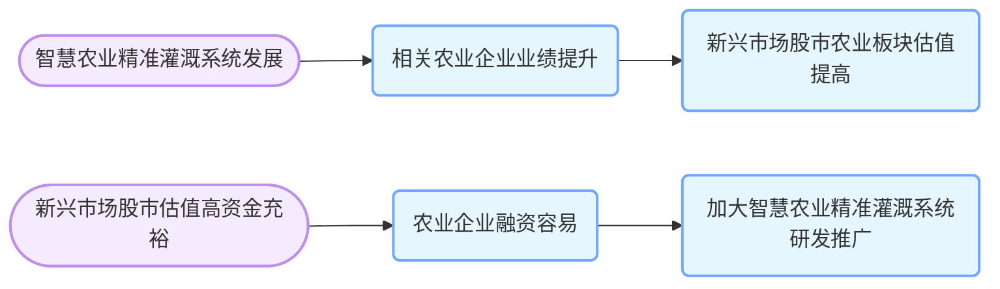

# 新兴市场股市估值与智慧农业精准灌溉系统的互动

> 关键词：新兴市场股市估值、智慧农业精准灌溉系统、互动关系、经济分析、技术应用

> 摘要：本文聚焦于新兴市场股市估值与智慧农业精准灌溉系统之间的互动关系。通过对新兴市场股市估值的原理、影响因素以及智慧农业精准灌溉系统的技术架构、应用优势等方面进行深入剖析，探讨两者在经济、技术层面的相互作用。同时，运用数学模型和实际案例，分析这种互动关系在实际场景中的表现和影响，并对未来的发展趋势和挑战进行展望，旨在为投资者、农业从业者和相关研究人员提供有价值的参考。

## 1. 背景介绍 
### 1.1 目的和范围
本研究的目的在于全面揭示新兴市场股市估值与智慧农业精准灌溉系统之间的内在联系和互动机制。新兴市场股市作为全球金融市场的重要组成部分，其估值波动不仅反映了市场的宏观经济状况，还受到行业发展前景等多种因素的影响。而智慧农业精准灌溉系统作为现代农业技术的重要代表，其发展和应用对于提高农业生产效率、保障粮食安全具有重要意义。通过研究两者的互动关系，我们可以更好地理解金融市场与农业技术创新之间的相互作用，为投资者提供决策参考，为农业企业的战略规划提供依据。

本研究的范围涵盖了新兴市场股市估值的基本理论、影响因素，智慧农业精准灌溉系统的技术原理、应用场景，以及两者之间的相互影响和作用机制。同时，结合实际案例和数据，对这种互动关系进行实证分析。

### 1.2 预期读者
本文预期读者包括金融市场投资者、农业企业管理者、农业技术研究人员、相关领域的学者以及对新兴市场和农业科技感兴趣的人士。投资者可以通过了解两者的互动关系，更好地把握投资机会，优化投资组合；农业企业管理者可以从中获取有关市场趋势和技术应用的信息，制定合理的发展战略；研究人员和学者可以为进一步的学术研究提供参考和启示；而对新兴市场和农业科技感兴趣的人士则可以通过本文了解相关领域的最新动态和发展趋势。

### 1.3 文档结构概述
本文共分为十个部分。第一部分为背景介绍，阐述了研究的目的、范围、预期读者和文档结构概述。第二部分介绍了新兴市场股市估值和智慧农业精准灌溉系统的核心概念，并分析了它们之间的联系。第三部分详细讲解了与两者相关的核心算法原理和具体操作步骤。第四部分介绍了相关的数学模型和公式，并通过举例进行了详细说明。第五部分通过项目实战，给出了代码实际案例并进行了详细解释。第六部分探讨了两者在实际应用中的场景。第七部分推荐了相关的工具和资源，包括学习资源、开发工具框架和相关论文著作。第八部分总结了未来的发展趋势和挑战。第九部分为附录，解答了常见问题。最后一部分提供了扩展阅读和参考资料。

### 1.4 术语表
#### 1.4.1 核心术语定义
- **新兴市场股市估值**：指对新兴市场中上市公司股票价值的评估，通常通过各种估值方法，如市盈率、市净率等，来确定股票的合理价格。
- **智慧农业精准灌溉系统**：利用传感器、物联网、大数据等技术，根据农作物的生长需求和土壤水分状况，精确控制灌溉水量和时间的农业灌溉系统。
- **互动关系**：指新兴市场股市估值与智慧农业精准灌溉系统之间相互影响、相互作用的关系。

#### 1.4.2 相关概念解释
- **新兴市场**：指那些经济发展较快、市场潜力较大的发展中国家或地区的金融市场，通常具有较高的波动性和增长潜力。
- **股市估值方法**：包括绝对估值法和相对估值法。绝对估值法如现金流折现法，通过预测公司未来的现金流并折现来计算股票的内在价值；相对估值法如市盈率法，通过比较同行业公司的市盈率来评估股票的价值。
- **物联网**：通过各种信息传感器、射频识别技术、全球定位系统等技术，实时采集任何需要监控、连接、互动的物体或过程的数据，通过网络实现物与物、物与人的泛在连接，实现对物品和过程的智能化感知、识别和管理。

#### 1.4.3 缩略词列表
- **PE**：市盈率（Price-to-Earnings Ratio），指股票价格除以每股收益的比率，用于衡量股票的估值水平。
- **PB**：市净率（Price-to-Book Ratio），指股票价格除以每股净资产的比率，反映了市场对公司净资产的估值。
- **IoT**：物联网（Internet of Things）

## 2. 核心概念与联系 
### 新兴市场股市估值
新兴市场股市估值是金融领域的一个重要概念，它反映了市场对新兴市场上市公司股票价值的判断。其核心原理基于对公司未来盈利能力、资产质量、行业前景等因素的综合评估。常见的估值方法有市盈率法、市净率法、现金流折现法等。

从架构上看，新兴市场股市估值受到宏观经济环境、政策法规、行业竞争等多种因素的影响。宏观经济环境包括 GDP 增长率、通货膨胀率、利率等，这些因素会影响整个市场的资金供求和投资者的风险偏好。政策法规的变化，如税收政策、监管政策等，也会对上市公司的经营和估值产生重要影响。行业竞争状况则决定了公司在市场中的地位和盈利能力。

### 智慧农业精准灌溉系统
智慧农业精准灌溉系统是现代农业技术的重要创新，它融合了传感器技术、物联网技术、大数据分析等多种先进技术。其核心原理是通过传感器实时监测土壤水分、温度、光照等环境参数，将数据传输到物联网平台，平台利用大数据分析算法，根据农作物的生长需求和环境条件，精确计算出灌溉水量和时间，并控制灌溉设备进行精准灌溉。

从架构上看，智慧农业精准灌溉系统主要由传感器层、网络传输层、数据处理层和执行层组成。传感器层负责采集环境数据，网络传输层将数据传输到数据处理层，数据处理层对数据进行分析和处理，生成灌溉决策，执行层根据决策控制灌溉设备进行灌溉。

### 两者的联系
新兴市场股市估值与智慧农业精准灌溉系统之间存在着密切的联系。一方面，智慧农业精准灌溉系统的发展前景和市场潜力会影响相关农业企业的盈利能力和估值，进而影响新兴市场股市中农业板块的估值。如果智慧农业精准灌溉系统得到广泛应用，能够提高农业生产效率、降低生产成本，那么相关农业企业的业绩将得到提升，其股票估值也会相应提高。另一方面，新兴市场股市的估值水平和资金流向也会影响智慧农业精准灌溉系统的研发和推广。如果股市估值较高，资金充裕，那么农业企业将更容易获得融资，从而加大对智慧农业精准灌溉系统的研发和推广投入。

下面是两者联系的 Mermaid 流程图：


## 3. 核心算法原理 & 具体操作步骤 
### 新兴市场股市估值算法
#### 市盈率法
市盈率法是一种常用的相对估值方法，其基本原理是通过比较同行业公司的市盈率来评估股票的价值。计算公式为：

$$股票价值 = 每股收益 \times 行业平均市盈率$$

下面是使用 Python 实现市盈率法估值的代码示例：
```python
def pe_valuation(eps, industry_pe):
    """
    使用市盈率法计算股票价值
    :param eps: 每股收益
    :param industry_pe: 行业平均市盈率
    :return: 股票价值
    """
    return eps * industry_pe

# 示例数据
eps = 2.0  # 每股收益
industry_pe = 15  # 行业平均市盈率

stock_value = pe_valuation(eps, industry_pe)
print(f"股票价值为: {stock_value}")
```
#### 操作步骤
1. 收集目标公司的每股收益数据。可以通过公司的财务报表或金融数据提供商获取。
2. 确定同行业的平均市盈率。可以通过统计同行业多家公司的市盈率并计算平均值得到。
3. 将每股收益和行业平均市盈率代入公式计算股票价值。

### 智慧农业精准灌溉系统算法
#### 基于土壤水分的灌溉决策算法
该算法的基本原理是根据土壤水分传感器采集的数据，判断土壤水分是否低于设定的阈值，如果低于阈值则进行灌溉。以下是使用 Python 实现的示例代码：
```python
def irrigation_decision(soil_moisture, threshold):
    """
    根据土壤水分判断是否需要灌溉
    :param soil_moisture: 土壤水分含量
    :param threshold: 灌溉阈值
    :return: 是否需要灌溉的布尔值
    """
    if soil_moisture < threshold:
        return True
    else:
        return False

# 示例数据
soil_moisture = 20  # 土壤水分含量
threshold = 30  # 灌溉阈值

need_irrigation = irrigation_decision(soil_moisture, threshold)
print(f"是否需要灌溉: {need_irrigation}")
```
#### 操作步骤
1. 安装土壤水分传感器，并将其部署在农田中合适的位置。
2. 定期采集土壤水分数据，并将数据传输到数据处理中心。
3. 设定灌溉阈值，根据实际农作物的生长需求和土壤特性进行调整。
4. 将采集到的土壤水分数据和灌溉阈值代入算法，判断是否需要灌溉。
5. 如果需要灌溉，则控制灌溉设备进行灌溉。

## 4. 数学模型和公式 & 详细讲解 & 举例说明 
### 新兴市场股市估值的数学模型
#### 现金流折现模型（DCF）
现金流折现模型是一种绝对估值方法，其基本原理是将公司未来的现金流折现到当前时刻，从而得到公司的内在价值。公式如下：

$$V = \sum_{t=1}^{n} \frac{CF_t}{(1 + r)^t} + \frac{TV}{(1 + r)^n}$$

其中，$V$ 表示公司的内在价值，$CF_t$ 表示第 $t$ 期的现金流，$r$ 表示折现率，$n$ 表示预测期数，$TV$ 表示终值。

详细讲解：
- 现金流 $CF_t$：可以是公司的自由现金流，即公司在满足了所有运营和投资需求后剩余的现金流量。预测现金流需要考虑公司的营业收入、成本、资本支出等因素。
- 折现率 $r$：反映了投资者对该投资的预期回报率，通常可以使用加权平均资本成本（WACC）来计算。
- 终值 $TV$：表示预测期结束后公司的价值，通常可以使用永续增长模型来计算：

$$TV = \frac{CF_{n+1}}{r - g}$$

其中，$CF_{n+1}$ 表示预测期结束后下一期的现金流，$g$ 表示永续增长率。

举例说明：
假设某公司未来三年的自由现金流分别为 100 万元、120 万元、150 万元，折现率为 10%，预测期为三年，三年后公司的现金流以 3% 的增长率永续增长。则可以按照以下步骤计算公司的内在价值：
1. 计算各期现金流的折现值：
    - 第一年现金流的折现值：$\frac{100}{(1 + 0.1)^1} \approx 90.91$（万元）
    - 第二年现金流的折现值：$\frac{120}{(1 + 0.1)^2} \approx 99.17$（万元）
    - 第三年现金流的折现值：$\frac{150}{(1 + 0.1)^3} \approx 112.69$（万元）
2. 计算终值：
    - 第三年后下一期的现金流：$CF_{4} = 150 \times (1 + 0.03) = 154.5$（万元）
    - 终值：$TV = \frac{154.5}{0.1 - 0.03} \approx 2207.14$（万元）
    - 终值的折现值：$\frac{2207.14}{(1 + 0.1)^3} \approx 1659.24$（万元）
3. 计算公司的内在价值：
    - $V = 90.91 + 99.17 + 112.69 + 1659.24 = 1962.01$（万元）

### 智慧农业精准灌溉系统的数学模型
#### 水量平衡模型
水量平衡模型是智慧农业精准灌溉系统中常用的数学模型，用于计算农田的水分收支情况，从而确定灌溉水量。公式如下：

$$P + I = ET + R + D + \Delta S$$

其中，$P$ 表示降水量，$I$ 表示灌溉水量，$ET$ 表示作物蒸散量，$R$ 表示地表径流量，$D$ 表示深层渗漏量，$\Delta S$ 表示土壤水分变化量。

详细讲解：
- 降水量 $P$：可以通过气象站获取。
- 作物蒸散量 $ET$：是指作物蒸腾和土壤蒸发的总水量，与作物种类、生长阶段、气象条件等因素有关。可以使用经验公式或模型进行计算，如彭曼 - 蒙蒂斯公式。
- 地表径流量 $R$：与地形、土壤类型、降水强度等因素有关，可以通过实地测量或经验公式估算。
- 深层渗漏量 $D$：与土壤质地、地下水位等因素有关，可以通过实验或经验公式估算。
- 土壤水分变化量 $\Delta S$：可以通过土壤水分传感器测量得到。

举例说明：
假设某农田在一段时间内的降水量为 50 毫米，作物蒸散量为 80 毫米，地表径流量为 10 毫米，深层渗漏量为 5 毫米，土壤水分变化量为 -10 毫米（表示土壤水分减少）。则可以计算灌溉水量 $I$ 为：

$$I = ET + R + D + \Delta S - P = 80 + 10 + 5 - 10 - 50 = 35$$（毫米）

## 5. 项目实战：代码实际案例和详细解释说明 
### 5.1  开发环境搭建
#### 新兴市场股市估值项目
- **编程语言**：Python
- **开发工具**：PyCharm 或 Jupyter Notebook
- **所需库**：pandas、numpy、matplotlib 等
安装命令：
```sh
pip install pandas numpy matplotlib
```

#### 智慧农业精准灌溉系统项目
- **硬件设备**：土壤水分传感器、数据采集模块、灌溉控制器等
- **软件环境**：Python、Arduino IDE（如果使用 Arduino 开发板）
- **所需库**：pyserial（用于串口通信）
安装命令：
```sh
pip install pyserial
```

### 5.2  源代码详细实现和代码解读
#### 新兴市场股市估值项目
以下是一个简单的股市估值分析项目，使用市盈率法对多只股票进行估值，并绘制估值结果的柱状图。
```python
import pandas as pd
import matplotlib.pyplot as plt

# 示例数据：每股收益和行业平均市盈率
data = {
    '股票代码': ['000001', '000002', '000003'],
    '每股收益': [2.0, 1.5, 1.8],
    '行业平均市盈率': [15, 15, 15]
}

df = pd.DataFrame(data)

# 计算股票价值
df['股票价值'] = df['每股收益'] * df['行业平均市盈率']

# 绘制柱状图
plt.bar(df['股票代码'], df['股票价值'])
plt.xlabel('股票代码')
plt.ylabel('股票价值')
plt.title('股票估值结果')
plt.show()

print(df)
```
代码解读：
1. 导入所需的库：pandas 用于数据处理，matplotlib.pyplot 用于绘制图表。
2. 定义示例数据，包括股票代码、每股收益和行业平均市盈率。
3. 使用 pandas 的 DataFrame 存储数据。
4. 计算股票价值，将每股收益和行业平均市盈率相乘。
5. 使用 matplotlib 绘制柱状图，展示股票估值结果。
6. 打印数据框，显示详细的估值信息。

#### 智慧农业精准灌溉系统项目
以下是一个模拟的智慧农业精准灌溉系统项目，通过串口通信读取土壤水分传感器的数据，并根据阈值判断是否需要灌溉。
```python
import serial
import time

# 串口配置
ser = serial.Serial('COM3', 9600, timeout=1)

# 灌溉阈值
threshold = 30

while True:
    try:
        # 读取土壤水分数据
        if ser.in_waiting:
            line = ser.readline().decode('utf-8').rstrip()
            soil_moisture = float(line)
            print(f"土壤水分含量: {soil_moisture}")

            # 判断是否需要灌溉
            if soil_moisture < threshold:
                print("需要灌溉")
                # 这里可以添加控制灌溉设备的代码
            else:
                print("不需要灌溉")
    except ValueError:
        print("数据读取错误")
    except KeyboardInterrupt:
        print("程序终止")
        ser.close()
        break
    time.sleep(1)
```
代码解读：
1. 导入所需的库：serial 用于串口通信，time 用于延时。
2. 配置串口，指定串口名称、波特率和超时时间。
3. 设定灌溉阈值。
4. 进入循环，不断读取土壤水分数据。
5. 如果有数据可读，将数据解码并转换为浮点数。
6. 根据土壤水分数据和阈值判断是否需要灌溉，并输出相应的信息。
7. 可以在需要灌溉的条件下添加控制灌溉设备的代码。
8. 捕获可能的异常，如数据读取错误和键盘中断，确保程序的稳定性。

### 5.3  代码解读与分析
#### 新兴市场股市估值项目
通过这个项目，我们可以看到如何使用 Python 进行股市估值分析。pandas 库提供了强大的数据处理功能，方便我们存储和计算数据。matplotlib 库则可以将估值结果可视化，直观地展示不同股票的估值情况。这种分析方法可以帮助投资者快速了解股票的估值水平，为投资决策提供参考。

#### 智慧农业精准灌溉系统项目
该项目模拟了智慧农业精准灌溉系统的基本功能。通过串口通信读取土壤水分传感器的数据，并根据阈值进行灌溉决策。这种基于传感器数据的自动化灌溉系统可以提高灌溉效率，减少水资源浪费。同时，代码中的异常处理机制保证了程序的稳定性，确保系统能够持续运行。

## 6. 实际应用场景 
### 新兴市场股市估值的应用场景
#### 投资决策
投资者可以通过对新兴市场股市估值的分析，选择被低估的股票进行投资。例如，如果某只股票的市盈率低于行业平均水平，且公司的基本面良好，那么该股票可能具有投资价值。投资者可以根据估值结果调整投资组合，降低风险，提高收益。

#### 企业融资
新兴市场的上市公司在进行股权融资时，需要确定合理的股票发行价格。股市估值可以为企业提供参考，帮助企业确定合适的发行价格，吸引投资者。同时，合理的估值也有助于提高企业的市场形象和融资能力。

#### 宏观经济分析
新兴市场股市估值的变化可以反映宏观经济的运行状况。当股市估值整体上升时，可能意味着经济形势向好，投资者对市场前景乐观；反之，当股市估值下降时，可能预示着经济面临挑战。政府和监管机构可以通过监测股市估值，制定相应的宏观经济政策。

### 智慧农业精准灌溉系统的应用场景
#### 大规模农田灌溉
在大规模农田中，智慧农业精准灌溉系统可以实现自动化、智能化的灌溉管理。通过实时监测土壤水分和气象条件，系统可以精确控制灌溉水量和时间，提高灌溉效率，减少水资源浪费。同时，系统还可以根据不同作物的生长需求，提供个性化的灌溉方案，提高农作物的产量和质量。

#### 温室种植
在温室种植中，环境条件相对可控，智慧农业精准灌溉系统可以更好地发挥作用。系统可以根据温室内部的温度、湿度、光照等环境参数，精确调节灌溉水量和频率，为作物提供适宜的生长环境。此外，系统还可以与温室的其他控制系统集成，实现全方位的智能化管理。

#### 城市绿化灌溉
在城市绿化中，智慧农业精准灌溉系统可以根据不同植物的需水特性和土壤条件，进行精准灌溉。这不仅可以提高城市绿化的效果，还可以节约水资源，降低城市绿化的维护成本。同时，系统可以通过远程监控和管理，方便园林管理人员对城市绿化进行统一调度和管理。

### 两者互动的实际应用场景
#### 农业企业上市融资
当智慧农业精准灌溉系统在农业领域得到广泛应用时，相关农业企业的业绩和发展前景将得到提升。这些企业在准备上市融资时，其股票估值会受到市场的关注。投资者会根据企业的技术实力、市场份额、应用案例等因素，对企业的股票进行估值。如果企业的智慧农业精准灌溉系统具有创新性和竞争力，那么其股票可能会获得较高的估值，从而为企业的上市融资提供有利条件。

#### 金融机构支持农业发展
金融机构可以根据新兴市场股市估值和智慧农业精准灌溉系统的发展情况，为农业企业提供融资支持。例如，银行可以对采用智慧农业精准灌溉系统的农业企业提供低息贷款，证券机构可以为相关企业的上市和再融资提供服务。同时，金融机构还可以开发与智慧农业相关的金融产品，如农业产业基金、农业保险等，促进农业产业的发展。

#### 农业投资决策
投资者在进行农业投资时，会考虑新兴市场股市估值和智慧农业精准灌溉系统的发展趋势。如果新兴市场股市中农业板块的估值较低，且智慧农业精准灌溉系统具有广阔的应用前景，那么投资者可能会加大对农业领域的投资。他们可以通过投资农业企业的股票、参与农业项目的股权投资等方式，分享农业产业发展的红利。

## 7. 工具和资源推荐
### 7.1 学习资源推荐
#### 7.1.1 书籍推荐
- 《证券分析》（Security Analysis）：由本杰明·格雷厄姆（Benjamin Graham）和戴维·多德（David Dodd）所著，是价值投资领域的经典著作，详细介绍了股票估值的基本原理和方法。
- 《智慧农业：原理与实践》（Smart Agriculture: Principles and Practices）：全面介绍了智慧农业的技术原理、应用案例和发展趋势，对于了解智慧农业精准灌溉系统具有重要参考价值。
- 《Python 数据分析实战》（Python Data Analysis实战）：通过实际案例介绍了如何使用 Python 进行数据分析，对于股市估值分析和智慧农业数据处理非常有帮助。

#### 7.1.2 在线课程
- Coursera 上的“Financial Markets”：由耶鲁大学教授罗伯特·席勒（Robert Shiller）主讲，课程涵盖了金融市场的基本原理、资产定价等内容，对于理解新兴市场股市估值有很大帮助。
- edX 上的“Smart Farming: Precision Agriculture”：介绍了智慧农业的最新技术和应用，包括精准灌溉系统的设计和实现。
- 中国大学 MOOC 上的“Python 语言程序设计”：适合初学者学习 Python 编程语言，为后续的项目开发打下基础。

#### 7.1.3 技术博客和网站
- Seeking Alpha：提供全球金融市场的分析和评论，包括新兴市场股市的估值分析和投资建议。
- PrecisionAg：专注于精准农业领域的技术和市场动态，提供智慧农业精准灌溉系统的最新信息和案例。
- 开源中国：提供丰富的技术文章和开源项目，对于学习和实践 Python 编程和相关技术非常有帮助。

### 7.2 开发工具框架推荐
#### 7.2.1 IDE和编辑器
- PyCharm：一款专业的 Python 集成开发环境，具有代码编辑、调试、版本控制等功能，适合开发复杂的 Python 项目。
- Jupyter Notebook：一种交互式的开发环境，支持 Python、R 等多种编程语言，方便进行数据探索和分析。
- Visual Studio Code：一款轻量级的代码编辑器，支持多种编程语言和插件扩展，可用于快速开发和调试代码。

#### 7.2.2 调试和性能分析工具
- Py-Spy：一个用于分析 Python 程序性能的工具，可以实时监控程序的 CPU 使用率和函数调用情况。
- pdb：Python 内置的调试器，可以帮助开发者定位和解决代码中的问题。
- Memory Profiler：用于分析 Python 程序的内存使用情况，找出内存泄漏和性能瓶颈。

#### 7.2.3 相关框架和库
- Pandas：一个强大的数据处理和分析库，提供了 DataFrame 等数据结构，方便进行数据清洗、转换和分析。
- NumPy：用于科学计算的基础库，提供了高效的数组操作和数学函数。
- Scikit-learn：一个机器学习库，提供了各种机器学习算法和工具，可用于股市估值预测和智慧农业数据分析。

### 7.3 相关论文著作推荐
#### 7.3.1 经典论文
- Fama, E. F., & French, K. R. (1992). The cross-section of expected stock returns. The Journal of Finance, 47(2), 427-465. 该论文提出了著名的 Fama - French 三因子模型，用于解释股票收益率的差异，对于股市估值研究具有重要意义。
- Allen, R. G., Pereira, L. S., Raes, D., & Smith, M. (1998). Crop evapotranspiration - Guidelines for computing crop water requirements - FAO Irrigation and drainage paper 56. FAO, Rome. 该论文介绍了彭曼 - 蒙蒂斯公式，用于计算作物蒸散量，是智慧农业精准灌溉系统中水量平衡模型的重要基础。

#### 7.3.2 最新研究成果
- 在 SSRN（Social Science Research Network）和 arXiv 等学术平台上，可以搜索到关于新兴市场股市估值和智慧农业精准灌溉系统的最新研究成果。这些研究成果通常涵盖了最新的理论模型、实证分析和技术应用。

#### 7.3.3 应用案例分析
- 国际粮食政策研究所（IFPRI）的报告中包含了许多智慧农业精准灌溉系统的应用案例分析，展示了这些系统在不同地区和作物上的应用效果和经济效益。
- 一些金融研究机构的报告中会对新兴市场股市中农业板块的估值和投资案例进行分析，为投资者提供参考。

## 8. 总结：未来发展趋势与挑战
### 未来发展趋势
#### 新兴市场股市估值
- **智能化估值方法的应用**：随着人工智能和大数据技术的发展，未来新兴市场股市估值将更多地采用智能化的方法。例如，利用机器学习算法对大量的市场数据和公司基本面数据进行分析，提高估值的准确性和效率。
- **跨市场估值联动增强**：全球金融市场的一体化趋势将导致新兴市场股市估值与其他市场的联动性增强。投资者将更加关注全球市场的动态，新兴市场股市估值将受到国际经济形势、货币政策等因素的影响。
- **绿色金融和可持续发展因素的纳入**：随着社会对环境保护和可持续发展的关注度不断提高，新兴市场股市估值将逐渐纳入绿色金融和可持续发展因素。具有良好环境、社会和治理（ESG）表现的企业可能会获得更高的估值。

#### 智慧农业精准灌溉系统
- **物联网和大数据的深度融合**：未来智慧农业精准灌溉系统将更加注重物联网和大数据的深度融合。通过传感器网络采集更多的环境数据和作物生长数据，利用大数据分析算法进行精准的灌溉决策和作物管理。
- **智能化设备的普及**：随着技术的不断进步，智能化的灌溉设备将得到更广泛的应用。例如，智能喷头、智能阀门等设备可以实现更精确的灌溉控制，提高灌溉效率。
- **与其他农业技术的集成**：智慧农业精准灌溉系统将与其他农业技术，如无人机、卫星遥感、精准施肥等进行集成，实现全方位的农业智能化管理。

#### 两者互动关系
- **金融支持力度加大**：金融机构将更加重视智慧农业领域的发展，加大对相关企业的融资支持力度。新兴市场股市将为智慧农业企业提供更多的融资渠道，促进智慧农业技术的研发和推广。
- **投资机会增加**：随着智慧农业精准灌溉系统的应用和发展，新兴市场股市中农业板块的投资机会将增加。投资者将更加关注具有技术创新和市场竞争力的农业企业，推动农业产业的升级和发展。
- **政策引导作用增强**：政府将出台更多的政策支持智慧农业的发展，引导金融资源向农业领域倾斜。这些政策将进一步加强新兴市场股市估值与智慧农业精准灌溉系统之间的互动关系。

### 挑战
#### 新兴市场股市估值
- **数据质量和可靠性问题**：新兴市场的金融数据质量和可靠性可能存在一定问题，这会影响股市估值的准确性。例如，公司财务报表的真实性、市场交易数据的完整性等都需要进一步提高。
- **市场波动性和不确定性**：新兴市场股市通常具有较高的波动性和不确定性，受到政治、经济、社会等多种因素的影响。这给股市估值带来了一定的挑战，投资者需要更加谨慎地评估风险。
- **估值方法的局限性**：现有的股市估值方法存在一定的局限性，无法完全准确地反映公司的真实价值。例如，市盈率法忽略了公司的成长潜力和风险因素，现金流折现模型对未来现金流的预测存在较大的不确定性。

#### 智慧农业精准灌溉系统
- **技术成本和推广难度**：智慧农业精准灌溉系统的技术成本较高，包括传感器、物联网设备、数据分析软件等方面的投入。这使得一些小型农业企业和农户难以承受，推广难度较大。
- **数据安全和隐私问题**：智慧农业精准灌溉系统涉及大量的农业数据，如土壤水分数据、作物生长数据等。这些数据的安全和隐私保护是一个重要问题，如果数据泄露可能会给农业生产和农民利益带来损失。
- **标准和规范不完善**：目前智慧农业精准灌溉系统的标准和规范还不完善，不同厂家的设备和系统之间可能存在兼容性问题。这给系统的集成和推广带来了一定的困难。

#### 两者互动关系
- **金融市场与农业产业的脱节**：由于金融市场和农业产业的特点不同，两者之间可能存在一定的脱节。例如，金融市场更关注短期的投资回报，而农业产业的投资回报周期较长。这可能导致金融资源无法有效地流向智慧农业领域。
- **政策协调难度大**：促进新兴市场股市估值与智慧农业精准灌溉系统的互动需要政府多个部门的政策协调，包括金融监管部门、农业部门等。政策协调难度较大，可能会影响政策的实施效果。

## 9. 附录：常见问题与解答
### 新兴市场股市估值相关问题
#### 问：市盈率法估值的准确性如何？
答：市盈率法是一种相对简单和常用的估值方法，但它的准确性受到多种因素的影响。市盈率法假设同行业公司具有相似的盈利能力和风险水平，但实际上不同公司之间可能存在较大差异。此外，行业平均市盈率的计算也可能存在偏差。因此，市盈率法只能作为一种初步的估值参考，不能完全准确地反映股票的真实价值。

#### 问：现金流折现模型中的折现率如何确定？
答：折现率反映了投资者对该投资的预期回报率，通常可以使用加权平均资本成本（WACC）来计算。WACC 的计算公式为：

$$WACC = E/V \times Re + D/V \times Rd \times (1 - Tc)$$

其中，$E$ 表示股权价值，$D$ 表示债务价值，$V = E + D$ 表示公司总价值，$Re$ 表示股权成本，$Rd$ 表示债务成本，$Tc$ 表示公司所得税税率。股权成本可以使用资本资产定价模型（CAPM）来计算，债务成本可以根据公司的债务利率确定。

### 智慧农业精准灌溉系统相关问题
#### 问：智慧农业精准灌溉系统的安装和维护复杂吗？
答：智慧农业精准灌溉系统的安装和维护相对传统灌溉系统来说较为复杂。安装过程需要专业的技术人员进行传感器的部署、网络的搭建和设备的调试。维护过程需要定期检查传感器的工作状态、设备的运行情况以及数据的准确性。但是，随着技术的不断发展和成熟，系统的安装和维护难度正在逐渐降低。

#### 问：智慧农业精准灌溉系统能节约多少水资源？
答：智慧农业精准灌溉系统能够根据作物的实际需水情况进行精准灌溉，相比传统的大水漫灌方式，可以显著节约水资源。具体的节约水量因地区、作物种类、灌溉方式等因素而异。一般来说，采用智慧农业精准灌溉系统可以节约 30% - 50% 的水资源。

### 两者互动关系相关问题
#### 问：新兴市场股市估值对智慧农业精准灌溉系统的发展有多大影响？
答：新兴市场股市估值对智慧农业精准灌溉系统的发展具有重要影响。如果股市估值较高，相关农业企业的融资能力将增强，能够获得更多的资金用于技术研发和市场推广，从而促进智慧农业精准灌溉系统的发展。反之，如果股市估值较低，企业的融资难度将增加，可能会影响系统的研发和推广进度。

#### 问：如何利用两者的互动关系进行投资？
答：投资者可以关注新兴市场股市中与智慧农业精准灌溉系统相关的企业，分析其技术实力、市场份额和发展前景。如果企业的智慧农业精准灌溉系统具有创新性和竞争力，且股市估值相对合理，那么可以考虑进行投资。同时，投资者还可以关注政策动态，政府对智慧农业的支持政策可能会推动相关企业的发展，带来投资机会。

## 10. 扩展阅读 & 参考资料
### 扩展阅读
- 《金融炼金术》（The Alchemy of Finance）：乔治·索罗斯（George Soros）所著，探讨了金融市场的运行规律和投资者的心理行为，对于理解新兴市场股市的波动和估值有一定的启示。
- 《农业大数据：理论、方法与应用》：介绍了农业大数据在农业生产、管理和决策中的应用，与智慧农业精准灌溉系统密切相关。
- 《投资最重要的事》（The Most Important Thing Illuminated: Uncommon Sense for the Thoughtful Investor）：霍华德·马克斯（Howard Marks）所著，分享了投资的经验和智慧，对于在新兴市场进行投资具有指导意义。

### 参考资料
- 世界银行（World Bank）的相关报告和数据，提供了新兴市场的经济和金融信息。
- 联合国粮食及农业组织（FAO）的出版物，包含了农业技术和政策方面的信息。
- 各大证券交易所的官方网站，提供了上市公司的财务报表和市场交易数据。

作者：AI天才研究院/AI Genius Institute & 禅与计算机程序设计艺术 /Zen And The Art of Computer Programming