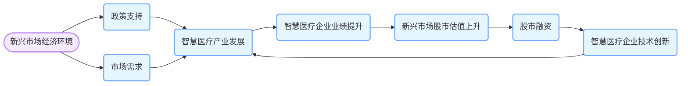

# 新兴市场股市估值与智慧医疗个性化治疗的互动

> 关键词：新兴市场股市估值、智慧医疗、个性化治疗、互动关系、金融与医疗融合

> 摘要：本文旨在深入探讨新兴市场股市估值与智慧医疗个性化治疗之间的互动关系。随着科技的发展和全球经济格局的变化，新兴市场在全球经济中扮演着越来越重要的角色，其股市估值的波动备受关注。与此同时，智慧医疗个性化治疗作为医疗领域的前沿发展方向，正逐渐改变着传统医疗模式。文章将从背景介绍入手，阐述相关核心概念及联系，剖析核心算法原理与操作步骤，通过数学模型和公式进一步解释互动机制，结合项目实战案例进行详细说明，探讨实际应用场景，推荐相关工具和资源，最后总结未来发展趋势与挑战，为金融和医疗领域的研究者与从业者提供有价值的参考。

## 1. 背景介绍 
### 1.1 目的和范围
本研究的目的在于全面揭示新兴市场股市估值与智慧医疗个性化治疗之间的内在联系和互动机制。范围涵盖新兴市场股市的基本特征、智慧医疗个性化治疗的技术与应用，以及两者在不同层面的相互影响。通过对相关理论和实践的研究，为投资者、医疗从业者和政策制定者提供决策依据，促进金融与医疗领域的协同发展。

### 1.2 预期读者
本文预期读者包括金融领域的投资者、分析师、基金经理，医疗行业的科研人员、临床医生、医院管理人员，以及关注金融与医疗交叉领域的学者、政策制定者和行业从业者。

### 1.3 文档结构概述
本文首先介绍研究的背景信息，包括目的、预期读者和文档结构。接着阐述核心概念及联系，呈现相关原理和架构的文本示意图与 Mermaid 流程图。然后详细讲解核心算法原理和具体操作步骤，给出数学模型和公式并举例说明。通过项目实战案例展示两者互动的实际应用，探讨在不同场景下的应用情况。推荐相关的学习资源、开发工具框架和论文著作。最后总结未来发展趋势与挑战，解答常见问题并提供扩展阅读和参考资料。

### 1.4 术语表
#### 1.4.1 核心术语定义
- **新兴市场股市估值**：指对新兴市场中上市公司股票价值的评估，通常基于公司的财务状况、盈利能力、市场前景等因素，通过各种估值方法来确定股票的合理价格。
- **智慧医疗**：利用物联网、大数据、人工智能等技术，实现医疗信息的数字化、智能化管理，提高医疗服务的效率和质量，包括远程医疗、电子病历、医疗机器人等应用。
- **个性化治疗**：根据患者的个体特征，如基因信息、生理指标、生活习惯等，制定个性化的治疗方案，以提高治疗效果和减少副作用。

#### 1.4.2 相关概念解释
- **金融市场联动性**：不同金融市场之间存在的相互影响和关联关系，新兴市场股市估值可能受到全球金融市场波动、宏观经济政策等因素的影响。
- **医疗技术创新**：智慧医疗个性化治疗的发展依赖于不断的医疗技术创新，如基因测序技术、人工智能诊断算法等，这些创新推动着医疗模式的变革。

#### 1.4.3 缩略词列表
- **AI**：Artificial Intelligence，人工智能
- **IoT**：Internet of Things，物联网
- **EMs**：Emerging Markets，新兴市场

## 2. 核心概念与联系 
### 核心概念原理
新兴市场股市估值是基于对上市公司基本面和市场预期的综合评估。上市公司的财务报表、行业竞争地位、未来发展战略等因素都会影响其股票的估值。在新兴市场中，由于经济发展速度较快、市场环境变化较大，股市估值的波动也相对较大。

智慧医疗个性化治疗则是利用先进的信息技术和生物技术，实现医疗服务的精准化和个性化。通过收集患者的多源数据，如基因数据、临床检查数据、生活方式数据等，利用人工智能算法进行分析和挖掘，为患者制定个性化的治疗方案。

### 架构的文本示意图
新兴市场股市估值与智慧医疗个性化治疗之间存在着复杂的互动关系。从宏观层面来看，新兴市场的经济发展和政策环境会影响智慧医疗产业的发展，进而影响相关企业的业绩和股市估值。从微观层面来看，智慧医疗企业的技术创新和市场竞争力会影响其在股市中的表现，同时股市的融资功能也为智慧医疗企业的发展提供资金支持。

### Mermaid 流程图


## 3. 核心算法原理 & 具体操作步骤 
### 核心算法原理
在分析新兴市场股市估值与智慧医疗个性化治疗的互动关系时，可以使用多元回归分析算法。该算法可以帮助我们确定多个自变量（如智慧医疗企业的研发投入、市场份额、技术创新指标等）与因变量（新兴市场股市估值）之间的定量关系。

### Python 源代码详细阐述
```python
import pandas as pd
import numpy as np
from sklearn.linear_model import LinearRegression
from sklearn.model_selection import train_test_split
from sklearn.metrics import mean_squared_error

# 假设我们有以下数据集，包含智慧医疗企业的相关指标和新兴市场股市估值
data = {
    '研发投入': [100, 200, 300, 400, 500],
    '市场份额': [0.1, 0.2, 0.3, 0.4, 0.5],
    '技术创新指标': [20, 30, 40, 50, 60],
    '股市估值': [1000, 1500, 2000, 2500, 3000]
}

df = pd.DataFrame(data)

# 提取自变量和因变量
X = df[['研发投入', '市场份额', '技术创新指标']]
y = df['股市估值']

# 划分训练集和测试集
X_train, X_test, y_train, y_test = train_test_split(X, y, test_size=0.2, random_state=42)

# 创建线性回归模型
model = LinearRegression()

# 训练模型
model.fit(X_train, y_train)

# 预测测试集
y_pred = model.predict(X_test)

# 计算均方误差
mse = mean_squared_error(y_test, y_pred)
print(f"均方误差: {mse}")

# 输出模型系数
print(f"模型系数: {model.coef_}")
print(f"模型截距: {model.intercept_}")
```

### 具体操作步骤
1. **数据收集**：收集新兴市场股市估值和智慧医疗企业的相关数据，包括财务数据、技术指标、市场数据等。
2. **数据预处理**：对收集到的数据进行清洗、转换和标准化处理，以提高数据质量和模型的准确性。
3. **特征选择**：选择与新兴市场股市估值和智慧医疗个性化治疗相关的特征作为自变量。
4. **模型训练**：使用多元回归分析算法对训练数据进行训练，得到模型的系数和截距。
5. **模型评估**：使用测试数据对模型进行评估，计算均方误差等指标，评估模型的性能。
6. **结果分析**：根据模型的系数和截距，分析智慧医疗企业的相关指标对新兴市场股市估值的影响。

## 4. 数学模型和公式 & 详细讲解 & 举例说明 
### 数学模型和公式
多元回归分析的数学模型可以表示为：

$$y = \beta_0 + \beta_1x_1 + \beta_2x_2 + \cdots + \beta_nx_n + \epsilon$$

其中，$y$ 是因变量（新兴市场股市估值），$x_1, x_2, \cdots, x_n$ 是自变量（智慧医疗企业的相关指标），$\beta_0$ 是截距，$\beta_1, \beta_2, \cdots, \beta_n$ 是回归系数，$\epsilon$ 是误差项。

回归系数 $\beta_i$ 可以通过最小二乘法来估计，使得误差项的平方和最小。最小二乘法的目标函数为：

$$\min_{\beta_0, \beta_1, \cdots, \beta_n} \sum_{i=1}^{m} (y_i - \beta_0 - \sum_{j=1}^{n} \beta_jx_{ij})^2$$

其中，$m$ 是样本数量，$y_i$ 是第 $i$ 个样本的因变量值，$x_{ij}$ 是第 $i$ 个样本的第 $j$ 个自变量值。

### 详细讲解
多元回归分析通过寻找自变量和因变量之间的线性关系，来预测因变量的值。回归系数 $\beta_i$ 表示自变量 $x_i$ 对因变量 $y$ 的影响程度。如果 $\beta_i$ 为正，则表示 $x_i$ 增加时，$y$ 也会增加；如果 $\beta_i$ 为负，则表示 $x_i$ 增加时，$y$ 会减少。

误差项 $\epsilon$ 表示模型无法解释的部分，通常假设 $\epsilon$ 服从均值为 0、方差为 $\sigma^2$ 的正态分布。

### 举例说明
假设我们通过多元回归分析得到的模型为：

$$y = 500 + 2x_1 + 3x_2 + 4x_3$$

其中，$x_1$ 是研发投入，$x_2$ 是市场份额，$x_3$ 是技术创新指标。

如果一家智慧医疗企业的研发投入为 200，市场份额为 0.3，技术创新指标为 40，则预测的新兴市场股市估值为：

$$y = 500 + 2\times200 + 3\times0.3 + 4\times40 = 500 + 400 + 0.9 + 160 = 1060.9$$

这意味着根据模型预测，该企业的相关指标对应的新兴市场股市估值约为 1060.9。

## 5. 项目实战：代码实际案例和详细解释说明 
### 5.1  开发环境搭建
1. **安装 Python**：从 Python 官方网站（https://www.python.org/downloads/）下载并安装 Python 3.x 版本。
2. **安装必要的库**：使用 pip 命令安装所需的库，如 pandas、numpy、scikit-learn 等。
```bash
pip install pandas numpy scikit-learn
```

### 5.2  源代码详细实现和代码解读
```python
import pandas as pd
import numpy as np
from sklearn.linear_model import LinearRegression
from sklearn.model_selection import train_test_split
from sklearn.metrics import mean_squared_error

# 读取数据集
data = pd.read_csv('emerging_market_data.csv')

# 提取自变量和因变量
X = data[['研发投入', '市场份额', '技术创新指标']]
y = data['股市估值']

# 划分训练集和测试集
X_train, X_test, y_train, y_test = train_test_split(X, y, test_size=0.2, random_state=42)

# 创建线性回归模型
model = LinearRegression()

# 训练模型
model.fit(X_train, y_train)

# 预测测试集
y_pred = model.predict(X_test)

# 计算均方误差
mse = mean_squared_error(y_test, y_pred)
print(f"均方误差: {mse}")

# 输出模型系数
print(f"模型系数: {model.coef_}")
print(f"模型截距: {model.intercept_}")
```

### 代码解读与分析
1. **数据读取**：使用 `pandas` 库的 `read_csv` 函数读取存储在 CSV 文件中的数据集。
2. **数据划分**：使用 `train_test_split` 函数将数据集划分为训练集和测试集，测试集占比为 20%。
3. **模型创建**：使用 `LinearRegression` 类创建线性回归模型。
4. **模型训练**：使用 `fit` 方法对训练数据进行训练，得到模型的系数和截距。
5. **模型预测**：使用 `predict` 方法对测试数据进行预测，得到预测值。
6. **模型评估**：使用 `mean_squared_error` 函数计算预测值和真实值之间的均方误差，评估模型的性能。
7. **结果输出**：输出模型的系数和截距，分析自变量对因变量的影响。

## 6. 实际应用场景 
### 投资决策
投资者可以通过分析新兴市场股市估值与智慧医疗个性化治疗的互动关系，选择具有潜力的智慧医疗企业进行投资。例如，如果一家智慧医疗企业在个性化治疗技术方面有重大突破，可能会导致其业绩提升，进而推动新兴市场股市估值上升，投资者可以提前布局该企业的股票。

### 医疗资源配置
医疗管理者可以根据新兴市场股市估值的变化，合理配置医疗资源。当股市估值上升时，意味着智慧医疗产业发展前景较好，可以加大对智慧医疗个性化治疗的投入，如引进先进的医疗设备、培养专业的医疗人才等。

### 政策制定
政策制定者可以参考新兴市场股市估值与智慧医疗个性化治疗的互动关系，制定相关政策。例如，为了促进智慧医疗产业的发展，可以出台税收优惠、资金扶持等政策，提高智慧医疗企业的创新能力和市场竞争力，从而推动新兴市场股市的健康发展。

## 7. 工具和资源推荐
### 7.1 学习资源推荐
#### 7.1.1 书籍推荐
- 《金融市场学》：全面介绍金融市场的基本概念、运行机制和投资策略，帮助读者了解新兴市场股市的特点和估值方法。
- 《人工智能医疗应用》：深入探讨人工智能在医疗领域的应用，包括智慧医疗个性化治疗的技术原理和实践案例。
- 《多元统计分析》：详细讲解多元回归分析等统计方法的原理和应用，为分析新兴市场股市估值与智慧医疗个性化治疗的互动关系提供理论支持。

#### 7.1.2 在线课程
- Coursera 上的“Financial Markets”课程：由知名教授授课，系统讲解金融市场的理论和实践。
- edX 上的“Artificial Intelligence in Healthcare”课程：介绍人工智能在医疗领域的应用，包括智慧医疗的最新发展趋势。
- 中国大学 MOOC 上的“多元统计分析”课程：提供多元统计分析的基础知识和应用案例。

#### 7.1.3 技术博客和网站
- 金融界网站：提供新兴市场股市的实时行情、分析报告和投资建议。
- 医谷网：专注于医疗行业的资讯和动态，介绍智慧医疗个性化治疗的最新技术和应用案例。
- Medium 上的金融和医疗相关博客：分享行业专家的观点和研究成果。

### 7.2 开发工具框架推荐
#### 7.2.1 IDE和编辑器
- PyCharm：功能强大的 Python 集成开发环境，提供代码编辑、调试、版本控制等功能。
- Jupyter Notebook：交互式的开发环境，适合进行数据分析和模型训练。
- Visual Studio Code：轻量级的代码编辑器，支持多种编程语言和插件扩展。

#### 7.2.2 调试和性能分析工具
- PDB：Python 内置的调试工具，可用于调试 Python 代码。
- cProfile：Python 标准库中的性能分析工具，可用于分析代码的性能瓶颈。
- TensorBoard：用于可视化深度学习模型的训练过程和性能指标。

#### 7.2.3 相关框架和库
- pandas：用于数据处理和分析的 Python 库，提供高效的数据结构和数据操作方法。
- numpy：用于科学计算的 Python 库，提供多维数组和数学函数。
- scikit-learn：用于机器学习的 Python 库，提供多种机器学习算法和工具。

### 7.3 相关论文著作推荐
#### 7.3.1 经典论文
- Fama, E. F., & French, K. R. (1992). The cross-section of expected stock returns. Journal of Finance, 47(2), 427-465. 该论文提出了 Fama-French 三因子模型，对股票估值和投资组合理论有重要影响。
- Topol, E. J. (2019). High-performance medicine: the convergence of human and artificial intelligence. Nature Medicine, 25(1), 44-56. 探讨了人工智能在医疗领域的应用和发展趋势，对智慧医疗个性化治疗有重要启示。

#### 7.3.2 最新研究成果
- 关注《Journal of Financial Economics》、《Nature Biotechnology》等顶级学术期刊上的相关研究论文，了解新兴市场股市估值和智慧医疗个性化治疗的最新研究进展。

#### 7.3.3 应用案例分析
- 分析国内外智慧医疗企业的成功案例，如平安好医生、IBM Watson Health 等，了解它们在个性化治疗和股市估值方面的经验和做法。

## 8. 总结：未来发展趋势与挑战
### 未来发展趋势
1. **深度融合**：新兴市场股市估值与智慧医疗个性化治疗将实现更深度的融合，智慧医疗企业的技术创新和市场表现将对股市估值产生更大的影响，同时股市的融资功能也将为智慧医疗产业的发展提供更强的支持。
2. **技术创新驱动**：随着人工智能、物联网、基因测序等技术的不断发展，智慧医疗个性化治疗将不断取得突破，为新兴市场股市带来新的投资机会。
3. **政策支持加强**：政府将加大对智慧医疗产业的政策支持力度，推动智慧医疗个性化治疗的普及和应用，促进新兴市场股市的健康发展。

### 挑战
1. **数据安全和隐私问题**：智慧医疗个性化治疗涉及大量患者的敏感数据，数据安全和隐私保护面临严峻挑战。如果数据泄露，不仅会损害患者的利益，还会影响智慧医疗企业的声誉和股市估值。
2. **技术标准和规范不完善**：目前智慧医疗个性化治疗的技术标准和规范还不完善，不同企业和机构之间的数据共享和互操作性存在困难，制约了智慧医疗产业的发展和股市估值的提升。
3. **市场不确定性**：新兴市场股市的波动性较大，受到全球经济形势、政治局势等多种因素的影响。智慧医疗个性化治疗的发展也面临技术风险、市场竞争等不确定性，增加了投资决策的难度。

## 9. 附录：常见问题与解答
### 问题 1：新兴市场股市估值与智慧医疗个性化治疗的互动关系是否稳定？
答：这种互动关系受到多种因素的影响，如宏观经济环境、政策变化、技术创新等，因此不是完全稳定的。但从长期来看，随着智慧医疗产业的发展和新兴市场的成熟，两者之间的互动关系将更加紧密和稳定。

### 问题 2：如何准确评估智慧医疗企业的技术创新对新兴市场股市估值的影响？
答：可以通过建立多元回归模型等方法，综合考虑智慧医疗企业的研发投入、专利数量、临床实验结果等指标，来评估技术创新对股市估值的影响。同时，还需要结合市场预期、行业竞争等因素进行分析。

### 问题 3：智慧医疗个性化治疗的发展会对传统医疗行业产生哪些影响？
答：智慧医疗个性化治疗的发展将推动传统医疗行业的变革，提高医疗服务的效率和质量。传统医疗行业需要加快数字化转型，与智慧医疗企业合作，共同推动医疗产业的发展。

## 10. 扩展阅读 & 参考资料
1. 《金融炼金术》，乔治·索罗斯著
2. 《医学的真相》，悉达多·穆克吉著
3. 世界银行发布的《全球经济展望》报告
4. 国际医疗技术创新协会的相关研究报告

作者：AI天才研究院/AI Genius Institute & 禅与计算机程序设计艺术 /Zen And The Art of Computer Programming