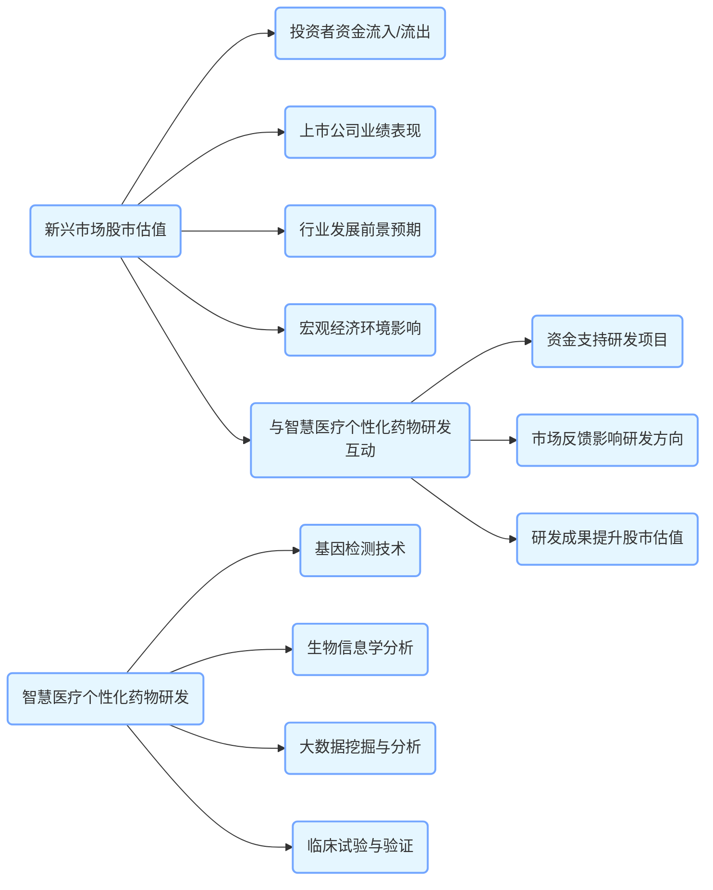

# 新兴市场股市估值与智慧医疗个性化药物研发的互动

> 关键词：新兴市场股市估值、智慧医疗、个性化药物研发、互动关系、金融与医疗融合

> 摘要：本文聚焦于新兴市场股市估值与智慧医疗个性化药物研发之间的互动关系。通过对相关核心概念的阐释、算法原理的剖析、数学模型的构建、实际案例的分析，深入探讨二者相互影响的内在机制。旨在揭示新兴市场股市估值如何为智慧医疗个性化药物研发提供资金与市场反馈，以及个性化药物研发的进展又如何反作用于股市估值。同时，分析其在实际应用场景中的表现，推荐相关学习资源、开发工具和研究论文，最后总结未来发展趋势与挑战，为金融和医疗领域的研究者与从业者提供有价值的参考。

## 1. 背景介绍 
### 1.1 目的和范围
本研究的主要目的是深入探究新兴市场股市估值与智慧医疗个性化药物研发之间的互动关系。新兴市场由于其快速发展和高增长潜力，吸引了全球投资者的关注，而智慧医疗个性化药物研发作为医疗领域的前沿方向，具有巨大的商业价值和社会意义。研究二者的互动关系，有助于理解金融市场与医疗科技创新之间的相互作用机制，为投资者、医疗企业和政策制定者提供决策依据。

研究范围涵盖新兴市场的股票市场，包括亚洲、非洲、拉丁美洲等地区的主要证券交易所。同时，聚焦于智慧医疗个性化药物研发领域，涉及基因检测、生物信息学、大数据分析等相关技术和产业。

### 1.2 预期读者
本文的预期读者包括金融领域的投资者、分析师、基金经理，他们可以通过了解新兴市场股市估值与智慧医疗个性化药物研发的互动关系，发现潜在的投资机会；医疗行业的企业管理者、研发人员，有助于他们从金融市场的角度审视研发项目的价值和发展前景；政策制定者可以根据研究结果制定促进金融与医疗融合发展的政策；此外，对金融和医疗交叉领域感兴趣的学者和学生也可以从本文中获取相关知识和研究思路。

### 1.3 文档结构概述
本文首先介绍研究的背景信息，包括目的、范围、预期读者和文档结构。接着阐述核心概念，包括新兴市场股市估值、智慧医疗和个性化药物研发，并展示它们之间的联系。然后详细讲解核心算法原理和具体操作步骤，运用 Python 代码进行说明。再通过数学模型和公式进一步分析二者的互动关系，并举例说明。之后通过项目实战案例，展示代码实现和解读。分析实际应用场景，推荐相关的学习资源、开发工具和研究论文。最后总结未来发展趋势与挑战，解答常见问题，并提供扩展阅读和参考资料。

### 1.4 术语表
#### 1.4.1 核心术语定义
- **新兴市场股市估值**：指对新兴市场中上市公司股票价值的评估，通常基于公司的财务状况、盈利能力、市场前景等因素，采用市盈率、市净率等方法进行计算。
- **智慧医疗**：利用信息技术，如物联网、大数据、人工智能等，实现医疗信息的智能化采集、传输、存储、分析和应用，提高医疗服务的效率和质量。
- **个性化药物研发**：根据患者的基因信息、生理特征、疾病状态等个体差异，研发针对性的药物，以提高药物的疗效和安全性。

#### 1.4.2 相关概念解释
- **基因检测**：通过对人体 DNA 进行分析，检测基因序列中的变异和多态性，为个性化药物研发提供基础数据。
- **生物信息学**：运用计算机科学和数学方法，对生物数据进行存储、管理、分析和解释，在个性化药物研发中用于基因数据分析和药物靶点预测。
- **大数据分析**：对海量的医疗数据进行挖掘和分析，发现潜在的规律和模式，为智慧医疗和个性化药物研发提供决策支持。

#### 1.4.3 缩略词列表
- **AI**：Artificial Intelligence，人工智能
- **DNA**：Deoxyribonucleic Acid，脱氧核糖核酸
- **PE**：Price-to-Earnings Ratio，市盈率
- **PB**：Price-to-Book Ratio，市净率

## 2. 核心概念与联系 

### 核心概念原理
#### 新兴市场股市估值
新兴市场股市估值是投资者评估股票投资价值的重要依据。其原理基于对上市公司未来现金流的预期和风险评估。常用的估值方法包括相对估值法和绝对估值法。相对估值法通过比较同行业或类似公司的市盈率、市净率等指标，来判断目标公司股票的相对价值；绝对估值法如现金流折现模型（DCF），则是通过预测公司未来的现金流，并将其折现到当前时刻，计算出股票的内在价值。

#### 智慧医疗
智慧医疗利用先进的信息技术，实现医疗信息的数字化和智能化。其核心原理包括物联网技术实现医疗设备的互联互通，实时采集患者的生理数据；大数据技术对海量的医疗数据进行存储和分析，挖掘潜在的医疗知识；人工智能技术如机器学习、深度学习算法，用于疾病诊断、治疗方案推荐等。

#### 个性化药物研发
个性化药物研发的原理是基于个体基因差异和疾病特征，开发针对性的药物。通过基因检测技术，分析患者的基因信息，确定药物作用的靶点和可能的不良反应。利用生物信息学和大数据分析，筛选出最适合患者的药物候选物，并进行临床试验验证。

### 架构的文本示意图
```plaintext
新兴市场股市估值
|
|-- 投资者资金流入/流出
|
|-- 上市公司业绩表现
|
|-- 行业发展前景预期
|
|-- 宏观经济环境影响
|
|-- 与智慧医疗个性化药物研发互动
|       |
|       |-- 资金支持研发项目
|       |
|       |-- 市场反馈影响研发方向
|       |
|       |-- 研发成果提升股市估值
|
智慧医疗个性化药物研发
|
|-- 基因检测技术
|
|-- 生物信息学分析
|
|-- 大数据挖掘与分析
|
|-- 临床试验与验证
```

### Mermaid 流程图


## 3. 核心算法原理 & 具体操作步骤 

### 新兴市场股市估值算法原理
#### 市盈率法（PE 法）
市盈率是股票价格与每股收益的比率，计算公式为：
$$PE = \frac{P}{EPS}$$
其中，$P$ 为股票价格，$EPS$ 为每股收益。通过比较目标公司的市盈率与同行业平均市盈率，可以判断股票的相对估值水平。如果目标公司的市盈率低于行业平均水平，可能被低估；反之，则可能被高估。

#### 现金流折现模型（DCF 模型）
DCF 模型的基本原理是将公司未来的现金流折现到当前时刻，计算出股票的内在价值。具体步骤如下：
1. 预测公司未来的自由现金流（FCF），通常采用多阶段模型，分为高速增长阶段、稳定增长阶段等。
2. 确定折现率（r），通常采用加权平均资本成本（WACC）。
3. 计算各阶段现金流的现值，并求和得到公司的企业价值（EV）。
4. 减去公司的债务价值，得到股权价值，再除以总股本，得到每股内在价值。

### Python 代码实现
```python
import numpy as np

# 市盈率法示例
def pe_valuation(price, eps, industry_pe):
    """
    市盈率法估值
    :param price: 股票价格
    :param eps: 每股收益
    :param industry_pe: 行业平均市盈率
    :return: 估值判断
    """
    pe = price / eps
    if pe < industry_pe:
        return "低估"
    elif pe > industry_pe:
        return "高估"
    else:
        return "合理"

# 现金流折现模型示例
def dcf_valuation(fcf, growth_rates, discount_rate, debt_value, shares_outstanding):
    """
    现金流折现模型估值
    :param fcf: 初始自由现金流
    :param growth_rates: 各阶段增长率列表
    :param discount_rate: 折现率
    :param debt_value: 债务价值
    :param shares_outstanding: 总股本
    :return: 每股内在价值
    """
    n = len(growth_rates)
    cash_flows = [fcf * (1 + growth_rates[i])**(i + 1) for i in range(n)]
    present_values = [cash_flows[i] / ((1 + discount_rate)**(i + 1)) for i in range(n)]
    terminal_value = cash_flows[-1] * (1 + growth_rates[-1]) / (discount_rate - growth_rates[-1])
    terminal_present_value = terminal_value / ((1 + discount_rate)**n)
    enterprise_value = sum(present_values) + terminal_present_value
    equity_value = enterprise_value - debt_value
    intrinsic_value = equity_value / shares_outstanding
    return intrinsic_value

# 示例数据
price = 50
eps = 2
industry_pe = 25
fcf = 100
growth_rates = [0.2, 0.15, 0.1]
discount_rate = 0.1
debt_value = 200
shares_outstanding = 100

# 市盈率法估值结果
pe_result = pe_valuation(price, eps, industry_pe)
print(f"市盈率法估值结果: {pe_result}")

# 现金流折现模型估值结果
intrinsic_value = dcf_valuation(fcf, growth_rates, discount_rate, debt_value, shares_outstanding)
print(f"现金流折现模型估值结果: {intrinsic_value}")
```

### 具体操作步骤
#### 市盈率法操作步骤
1. 收集目标公司的股票价格和每股收益数据。
2. 查找同行业的平均市盈率数据。
3. 计算目标公司的市盈率，并与行业平均市盈率进行比较。
4. 根据比较结果判断股票的估值水平。

#### 现金流折现模型操作步骤
1. 预测公司未来各阶段的自由现金流增长率。
2. 确定折现率，可通过计算加权平均资本成本得到。
3. 预测公司的债务价值和总股本。
4. 按照 DCF 模型的计算公式，计算股票的内在价值。

## 4. 数学模型和公式 & 详细讲解 & 举例说明 

### 新兴市场股市估值与智慧医疗个性化药物研发互动的数学模型
#### 基于回归分析的互动模型
假设新兴市场股市估值（用市盈率 $PE$ 表示）与智慧医疗个性化药物研发投入（用 $R$ 表示）之间存在线性关系，可以建立如下回归模型：
$$PE = \beta_0 + \beta_1R + \epsilon$$
其中，$\beta_0$ 为截距项，$\beta_1$ 为斜率项，表示研发投入对股市估值的影响系数，$\epsilon$ 为误差项。

#### 模型参数估计
可以使用最小二乘法（OLS）来估计回归模型的参数。最小二乘法的目标是使残差平方和最小，即：
$$\min_{\beta_0, \beta_1} \sum_{i=1}^{n}(PE_i - (\beta_0 + \beta_1R_i))^2$$
对 $\beta_0$ 和 $\beta_1$ 分别求偏导数，并令其等于 0，得到如下方程组：
$$\begin{cases}
\sum_{i=1}^{n}(PE_i - (\beta_0 + \beta_1R_i)) = 0 \\
\sum_{i=1}^{n}R_i(PE_i - (\beta_0 + \beta_1R_i)) = 0
\end{cases}$$
解方程组可得：
$$\beta_1 = \frac{\sum_{i=1}^{n}(R_i - \bar{R})(PE_i - \bar{PE})}{\sum_{i=1}^{n}(R_i - \bar{R})^2}$$
$$\beta_0 = \bar{PE} - \beta_1\bar{R}$$
其中，$\bar{R}$ 和 $\bar{PE}$ 分别为研发投入和股市估值的样本均值。

### 举例说明
假设我们收集了某新兴市场 10 家智慧医疗企业的市盈率和研发投入数据，如下表所示：

| 企业编号 | 研发投入（万元）$R$ | 市盈率 $PE$ |
| ---- | ---- | ---- |
| 1 | 100 | 20 |
| 2 | 150 | 25 |
| 3 | 200 | 30 |
| 4 | 250 | 35 |
| 5 | 300 | 40 |
| 6 | 350 | 45 |
| 7 | 400 | 50 |
| 8 | 450 | 55 |
| 9 | 500 | 60 |
| 10 | 550 | 65 |

首先，计算研发投入和市盈率的样本均值：
$$\bar{R} = \frac{1}{n}\sum_{i=1}^{n}R_i = \frac{100 + 150 + \cdots + 550}{10} = 325$$
$$\bar{PE} = \frac{1}{n}\sum_{i=1}^{n}PE_i = \frac{20 + 25 + \cdots + 65}{10} = 42.5$$

然后，计算 $\beta_1$ 和 $\beta_0$：
$$\beta_1 = \frac{\sum_{i=1}^{n}(R_i - \bar{R})(PE_i - \bar{PE})}{\sum_{i=1}^{n}(R_i - \bar{R})^2}$$
$$\beta_0 = \bar{PE} - \beta_1\bar{R}$$

使用 Python 代码实现：
```python
import numpy as np

# 数据
R = np.array([100, 150, 200, 250, 300, 350, 400, 450, 500, 550])
PE = np.array([20, 25, 30, 35, 40, 45, 50, 55, 60, 65])

# 计算均值
R_mean = np.mean(R)
PE_mean = np.mean(PE)

# 计算 beta_1
numerator = np.sum((R - R_mean) * (PE - PE_mean))
denominator = np.sum((R - R_mean)**2)
beta_1 = numerator / denominator

# 计算 beta_0
beta_0 = PE_mean - beta_1 * R_mean

print(f"beta_0: {beta_0}")
print(f"beta_1: {beta_1}")
```

运行代码后，得到 $\beta_0$ 和 $\beta_1$ 的值，从而得到回归方程：
$$PE = \beta_0 + \beta_1R$$

这个方程可以用来预测研发投入对股市估值的影响。例如，如果一家企业的研发投入为 600 万元，代入回归方程可以得到预测的市盈率。

## 5. 项目实战：代码实际案例和详细解释说明 

### 5.1  开发环境搭建
#### 操作系统
可以选择 Windows、Linux 或 macOS 操作系统。建议使用 Linux 系统，如 Ubuntu，因为它对 Python 开发环境的支持较好。

#### Python 安装
从 Python 官方网站（https://www.python.org/downloads/）下载并安装 Python 3.x 版本。安装完成后，确保在命令行中可以使用 `python` 和 `pip` 命令。

#### 第三方库安装
使用 `pip` 安装以下必要的第三方库：
```bash
pip install numpy pandas matplotlib scikit-learn
```
- `numpy`：用于数值计算。
- `pandas`：用于数据处理和分析。
- `matplotlib`：用于数据可视化。
- `scikit-learn`：用于机器学习算法的实现。

### 5.2  源代码详细实现和代码解读
#### 数据收集与预处理
假设我们从金融数据库和医疗行业报告中收集了新兴市场股市估值和智慧医疗个性化药物研发投入的数据，并保存为 CSV 文件 `data.csv`。以下是数据预处理的代码：
```python
import pandas as pd

# 读取数据
data = pd.read_csv('data.csv')

# 查看数据基本信息
print(data.info())

# 处理缺失值
data = data.dropna()

# 提取特征和目标变量
X = data['研发投入'].values.reshape(-1, 1)
y = data['市盈率'].values
```
代码解读：
- `pd.read_csv('data.csv')`：读取 CSV 文件中的数据。
- `data.info()`：查看数据的基本信息，包括列名、数据类型和缺失值情况。
- `data.dropna()`：删除包含缺失值的行。
- `X = data['研发投入'].values.reshape(-1, 1)`：提取研发投入作为特征，并将其转换为二维数组。
- `y = data['市盈率'].values`：提取市盈率作为目标变量。

#### 模型训练与评估
使用线性回归模型对数据进行训练和评估：
```python
from sklearn.model_selection import train_test_split
from sklearn.linear_model import LinearRegression
from sklearn.metrics import mean_squared_error, r2_score

# 划分训练集和测试集
X_train, X_test, y_train, y_test = train_test_split(X, y, test_size=0.2, random_state=42)

# 创建线性回归模型
model = LinearRegression()

# 模型训练
model.fit(X_train, y_train)

# 模型预测
y_pred = model.predict(X_test)

# 模型评估
mse = mean_squared_error(y_test, y_pred)
r2 = r2_score(y_test, y_pred)

print(f"均方误差 (MSE): {mse}")
print(f"决定系数 (R^2): {r2}")
```
代码解读：
- `train_test_split(X, y, test_size=0.2, random_state=42)`：将数据集划分为训练集和测试集，测试集占比为 20%。
- `LinearRegression()`：创建线性回归模型。
- `model.fit(X_train, y_train)`：使用训练集数据对模型进行训练。
- `model.predict(X_test)`：使用训练好的模型对测试集数据进行预测。
- `mean_squared_error(y_test, y_pred)`：计算预测值和真实值之间的均方误差。
- `r2_score(y_test, y_pred)`：计算模型的决定系数，评估模型的拟合优度。

#### 数据可视化
使用 `matplotlib` 库将训练数据和预测结果进行可视化：
```python
import matplotlib.pyplot as plt

# 绘制训练数据散点图
plt.scatter(X_train, y_train, color='blue', label='Training Data')

# 绘制预测结果直线
plt.plot(X_test, y_pred, color='red', linewidth=2, label='Prediction')

# 添加图例和标签
plt.legend()
plt.xlabel('研发投入')
plt.ylabel('市盈率')
plt.title('新兴市场股市估值与智慧医疗个性化药物研发投入关系')

# 显示图形
plt.show()
```
代码解读：
- `plt.scatter(X_train, y_train, color='blue', label='Training Data')`：绘制训练数据的散点图。
- `plt.plot(X_test, y_pred, color='red', linewidth=2, label='Prediction')`：绘制预测结果的直线。
- `plt.legend()`：添加图例。
- `plt.xlabel('研发投入')` 和 `plt.ylabel('市盈率')`：添加坐标轴标签。
- `plt.title('新兴市场股市估值与智慧医疗个性化药物研发投入关系')`：添加标题。
- `plt.show()`：显示图形。

### 5.3  代码解读与分析
#### 数据预处理的重要性
在实际项目中，数据往往存在缺失值、异常值等问题。通过数据预处理，可以提高数据的质量，减少模型训练的误差。例如，删除包含缺失值的行可以避免模型在训练过程中出现错误。

#### 模型评估指标的意义
均方误差（MSE）衡量了预测值和真实值之间的平均误差，值越小表示模型的预测效果越好。决定系数（$R^2$）表示模型对数据的拟合优度，取值范围在 0 到 1 之间，越接近 1 表示模型的拟合效果越好。

#### 数据可视化的作用
数据可视化可以直观地展示数据之间的关系和模型的预测结果。通过绘制散点图和预测直线，可以帮助我们更好地理解新兴市场股市估值与智慧医疗个性化药物研发投入之间的关系。

## 6. 实际应用场景 
### 投资者决策
投资者可以根据新兴市场股市估值与智慧医疗个性化药物研发的互动关系，制定投资策略。当发现智慧医疗企业的研发投入增加，且股市估值有上升趋势时，可以考虑买入相关股票。例如，一家智慧医疗企业宣布加大个性化药物研发投入，投资者通过分析历史数据和行业趋势，预测该企业的股市估值将上升，从而提前布局投资。

### 医疗企业战略规划
医疗企业可以根据股市估值的反馈，调整个性化药物研发的战略。如果股市对研发项目的预期较高，企业可以加大研发投入，加速项目推进；反之，如果股市反应不佳，企业可以重新评估研发项目的可行性和方向。例如，某企业的个性化药物研发项目在股市上表现不佳，企业可以分析原因，可能是研发周期过长、市场前景不明确等，然后调整研发策略。

### 政策制定
政策制定者可以通过研究二者的互动关系，制定促进金融与医疗融合发展的政策。例如，政府可以出台税收优惠政策，鼓励投资者投资智慧医疗个性化药物研发项目；或者设立专项基金，支持医疗企业的研发工作。同时，加强对新兴市场股市的监管，确保市场的公平、公正、透明，为医疗科技创新提供良好的金融环境。

## 7. 工具和资源推荐
### 7.1 学习资源推荐
#### 7.1.1 书籍推荐
- 《金融市场学》：系统介绍金融市场的基本概念、运行机制和投资分析方法，有助于理解新兴市场股市估值的原理。
- 《智慧医疗：开启未来医疗新时代》：全面阐述智慧医疗的技术架构、应用场景和发展趋势，为了解智慧医疗提供理论基础。
- 《药物研发过程与实践》：详细介绍药物研发的流程、方法和技术，对个性化药物研发有深入的讲解。

#### 7.1.2 在线课程
- Coursera 平台上的“金融市场分析”课程：由知名大学教授授课，讲解金融市场的分析方法和工具。
- edX 平台上的“人工智能与医疗健康”课程：介绍人工智能在医疗领域的应用，包括智慧医疗和个性化药物研发。
- Udemy 平台上的“Python 数据分析实战”课程：通过实际案例，教授使用 Python 进行数据分析和建模的技能。

#### 7.1.3 技术博客和网站
- 金融界（https://www.jrj.com.cn/）：提供金融市场的实时行情、分析报告和投资策略，对新兴市场股市估值有深入的研究。
- 医谷（https://www.yigoonet.com/）：专注于医疗行业的资讯和深度报道，涵盖智慧医疗和个性化药物研发的最新动态。
- Towards Data Science（https://towardsdatascience.com/）：汇聚了众多数据科学和人工智能领域的优秀博客文章，对数据分析和建模有很多实用的技巧和案例。

### 7.2 开发工具框架推荐
#### 7.2.1 IDE和编辑器
- PyCharm：功能强大的 Python 集成开发环境，提供代码编辑、调试、版本控制等功能，适合专业的 Python 开发。
- Jupyter Notebook：交互式的开发环境，支持代码、文本、图像等多种格式的展示，方便进行数据分析和模型验证。
- Visual Studio Code：轻量级的代码编辑器，支持多种编程语言和插件扩展，可用于 Python 开发和数据处理。

#### 7.2.2 调试和性能分析工具
- PDB：Python 自带的调试器，可以帮助开发者定位代码中的错误和问题。
- cProfile：Python 标准库中的性能分析工具，用于分析代码的运行时间和资源消耗。
- Py-Spy：一个快速的 Python 性能分析工具，可以实时监控 Python 程序的性能。

#### 7.2.3 相关框架和库
- TensorFlow：开源的深度学习框架，广泛应用于人工智能和机器学习领域，可用于智慧医疗中的图像识别、疾病预测等任务。
- PyTorch：另一个流行的深度学习框架，具有动态图和易于使用的特点，适合研究和开发个性化药物研发中的模型。
- Scikit-learn：简单易用的机器学习库，提供了各种机器学习算法和工具，可用于新兴市场股市估值的建模和分析。

### 7.3 相关论文著作推荐
#### 7.3.1 经典论文
- “The Capital Asset Pricing Model: Theory and Evidence”：阐述了资本资产定价模型（CAPM）的理论和实证研究，对理解股市估值有重要的参考价值。
- “Precision Medicine: Personalized, Predictive, Preventive, Participatory”：介绍了精准医学的概念、发展和应用，为个性化药物研发提供了理论基础。
- “Big Data in Healthcare: Management, Analysis and Future Prospects”：探讨了大数据在医疗领域的应用和挑战，对智慧医疗的发展有重要的指导意义。

#### 7.3.2 最新研究成果
- 可以关注顶级学术期刊如《New England Journal of Medicine》、《Nature Medicine》、《Science Translational Medicine》等，这些期刊经常发表智慧医疗和个性化药物研发的最新研究成果。
- 在金融领域，可以关注《Journal of Finance》、《Review of Financial Studies》等期刊，了解新兴市场股市估值的最新研究动态。

#### 7.3.3 应用案例分析
- 可以参考一些知名企业的案例分析，如谷歌的 DeepMind 在医疗领域的应用、辉瑞制药的个性化药物研发项目等。这些案例可以帮助我们了解实际应用中的经验和教训。

## 8. 总结：未来发展趋势与挑战
### 未来发展趋势
#### 金融与医疗深度融合
随着科技的发展和市场的需求，新兴市场股市估值与智慧医疗个性化药物研发的互动将更加紧密。金融市场将为医疗科技创新提供更多的资金支持和市场反馈，而医疗研发的成果也将为股市带来更多的投资机会和增长动力。

#### 技术创新推动发展
人工智能、大数据、基因编辑等技术的不断创新将为智慧医疗个性化药物研发带来新的突破。这些技术的应用将提高研发效率、降低成本、提高药物的疗效和安全性，从而进一步影响新兴市场股市估值。

#### 国际化合作加强
新兴市场将加强与国际金融市场和医疗科研机构的合作。通过引进国际资本和先进技术，提升自身的研发能力和市场竞争力。同时，新兴市场的医疗企业也将有更多机会参与国际市场的竞争。

### 挑战
#### 技术风险
智慧医疗个性化药物研发涉及到众多前沿技术，如基因检测、人工智能等。这些技术的发展还不够成熟，存在一定的技术风险，如数据安全、算法可靠性等问题。这些风险可能会影响研发项目的进度和成果，进而影响股市估值。

#### 政策法规不确定性
新兴市场的政策法规环境相对不稳定，对于金融市场和医疗行业的监管政策可能会发生变化。政策法规的不确定性可能会给投资者和医疗企业带来风险，影响二者的互动关系。

#### 市场竞争激烈
随着智慧医疗个性化药物研发的发展，市场竞争将日益激烈。新兴市场的企业需要面对来自国际巨头和国内同行的竞争压力。如何在激烈的市场竞争中脱颖而出，是企业面临的重要挑战。

## 9. 附录：常见问题与解答
### 问题 1：新兴市场股市估值与发达国家股市估值有什么区别？
解答：新兴市场股市估值通常具有较高的波动性和不确定性。新兴市场的经济发展速度较快，但市场机制相对不完善，政策法规环境也不够稳定。相比之下，发达国家股市估值相对较为稳定，市场成熟度较高。此外，新兴市场股市的行业结构和投资者结构也与发达国家有所不同，这些因素都会影响股市估值。

### 问题 2：智慧医疗个性化药物研发的成本高吗？
解答：智慧医疗个性化药物研发的成本通常较高。研发过程需要进行大量的基因检测、临床试验和数据分析，这些都需要投入大量的资金和人力。此外，研发失败的风险也较高，一旦研发失败，前期的投入将无法收回。因此，个性化药物研发需要有强大的资金支持和技术实力。

### 问题 3：如何判断智慧医疗企业的研发项目是否有投资价值？
解答：可以从以下几个方面进行判断：
1. 研发团队的实力：包括研发人员的专业背景、经验和成果。
2. 研发项目的创新性：是否具有独特的技术和理念，能否解决现有医疗问题。
3. 市场前景：目标疾病的患者数量、市场需求和竞争情况。
4. 研发进度：项目处于哪个阶段，预计何时能够上市。
5. 财务状况：企业的资金实力和盈利能力，能否支持研发项目的持续进行。

### 问题 4：新兴市场股市估值与宏观经济环境有什么关系？
解答：新兴市场股市估值与宏观经济环境密切相关。宏观经济环境的好坏会影响企业的盈利能力和市场前景，从而影响股市估值。例如，经济增长速度较快时，企业的业绩通常会较好，股市估值也会相应上升；反之，经济衰退时，股市估值可能会下降。此外，宏观经济政策如货币政策、财政政策等也会对股市估值产生影响。

## 10. 扩展阅读 & 参考资料
### 扩展阅读
- 《金融炼金术》：乔治·索罗斯的经典著作，探讨了金融市场的运行规律和投资者的心理行为。
- 《众病之王：癌症传》：讲述了癌症的历史、研究和治疗进展，对理解个性化药物研发在癌症治疗中的应用有很大帮助。
- 《第四次工业革命》：克劳斯·施瓦布的著作，介绍了当前科技革命的发展趋势和影响，包括智慧医疗领域的变革。

### 参考资料
- 金融数据库：如 Bloomberg、Wind 等，提供金融市场的实时数据和分析报告。
- 医疗行业报告：如 Frost & Sullivan、EvaluatePharma 等，提供医疗行业的市场研究和分析。
- 学术数据库：如 IEEE Xplore、ACM Digital Library 等，提供计算机科学和信息技术领域的学术论文。

作者：AI天才研究院/AI Genius Institute & 禅与计算机程序设计艺术 /Zen And The Art of Computer Programming