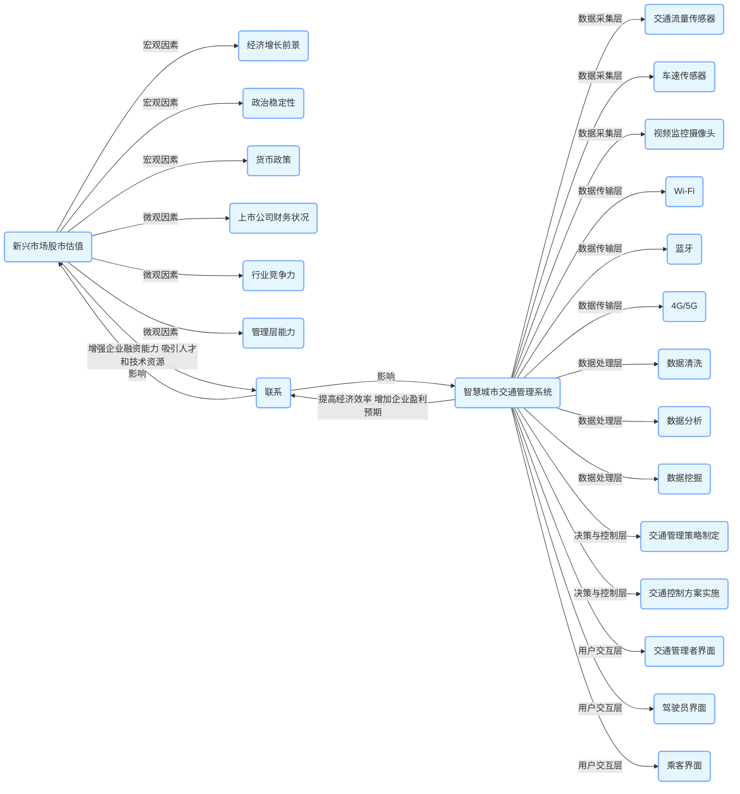

# 新兴市场股市估值与智慧城市交通管理系统的互动

> 关键词：新兴市场股市估值、智慧城市交通管理系统、互动关系、经济影响、数据驱动决策

> 摘要：本文旨在深入探讨新兴市场股市估值与智慧城市交通管理系统之间的互动关系。通过对两者核心概念的剖析、相关算法原理的阐述、数学模型的构建以及实际案例的分析，揭示它们相互影响的内在机制。研究新兴市场股市估值与智慧城市交通管理系统的互动，不仅有助于理解经济领域与城市建设领域的跨领域联系，还能为投资者、城市规划者和政策制定者提供有价值的决策依据。同时，本文还介绍了相关的工具和资源，对未来发展趋势与挑战进行了总结，并提供了常见问题的解答和扩展阅读参考资料。

## 1. 背景介绍 
### 1.1 目的和范围
本研究的主要目的是全面分析新兴市场股市估值与智慧城市交通管理系统之间的互动关系。具体范围涵盖了新兴市场股市估值的影响因素、智慧城市交通管理系统的构成与功能、两者之间相互作用的机制以及这种互动在实际经济和城市发展中的应用。通过对这些方面的研究，旨在为相关领域的决策者提供科学的理论支持和实践指导。

### 1.2 预期读者
本文预期读者包括金融领域的投资者、分析师、研究人员，城市规划与交通管理部门的专业人员，以及对新兴市场经济和智慧城市建设感兴趣的学者和爱好者。对于金融从业者，本文可以帮助他们更好地理解新兴市场股市估值的影响因素，从而做出更明智的投资决策；对于城市规划者和交通管理人员，本文能够提供关于智慧城市交通管理系统对经济影响的新视角，为城市交通规划和管理提供参考；对于学者和爱好者，本文可以作为进一步研究和学习的基础资料。

### 1.3 文档结构概述
本文共分为十个部分。第一部分为背景介绍，阐述了研究的目的、范围、预期读者和文档结构概述，并对相关术语进行了解释。第二部分介绍了新兴市场股市估值和智慧城市交通管理系统的核心概念及其联系，包括原理和架构的文本示意图以及 Mermaid 流程图。第三部分详细讲解了核心算法原理和具体操作步骤，并使用 Python 源代码进行了阐述。第四部分构建了数学模型和公式，进行了详细讲解并举例说明。第五部分通过项目实战，给出了代码实际案例和详细解释说明，包括开发环境搭建、源代码实现和代码解读。第六部分探讨了新兴市场股市估值与智慧城市交通管理系统互动的实际应用场景。第七部分推荐了相关的学习资源、开发工具框架和论文著作。第八部分总结了未来发展趋势与挑战。第九部分为附录，解答了常见问题。第十部分提供了扩展阅读和参考资料。

### 1.4 术语表
#### 1.4.1 核心术语定义
- **新兴市场股市估值**：指对新兴市场国家或地区股票市场中上市公司的价值进行评估的过程和结果。新兴市场通常是指经济发展较快、具有较高增长潜力但市场成熟度相对较低的国家或地区的市场。股市估值是通过各种方法和指标来衡量股票的内在价值，以判断股票是否被高估或低估。
- **智慧城市交通管理系统**：是利用先进的信息技术、通信技术、传感器技术等，对城市交通进行全面、实时、智能管理的系统。该系统旨在提高城市交通效率、减少交通拥堵、降低交通事故发生率、改善交通环境，实现城市交通的可持续发展。

#### 1.4.2 相关概念解释
- **新兴市场**：一般具有经济增长速度快、市场潜力大、政策环境不稳定、金融市场不完善等特点。新兴市场国家或地区通常处于工业化和城市化进程中，其经济结构和市场机制正在不断发展和完善。
- **股市估值方法**：常见的股市估值方法包括市盈率法（P/E）、市净率法（P/B）、现金流折现法（DCF）等。这些方法通过不同的指标和模型来评估股票的价值。
- **智慧城市**：是运用物联网、云计算、大数据、空间地理信息集成等新一代信息技术，促进城市规划、建设、管理和服务智慧化的新理念和新模式。智慧城市交通管理系统是智慧城市建设的重要组成部分。

#### 1.4.3 缩略词列表
- **P/E**：Price-to-Earnings Ratio，市盈率
- **P/B**：Price-to-Book Ratio，市净率
- **DCF**：Discounted Cash Flow，现金流折现法
- **IoT**：Internet of Things，物联网
- **GIS**：Geographic Information System，地理信息系统

## 2. 核心概念与联系 

### 新兴市场股市估值核心概念
新兴市场股市估值是一个复杂的过程，涉及到多个因素的综合考虑。从宏观层面来看，新兴市场的经济增长前景、政治稳定性、货币政策等因素会对股市整体估值产生影响。例如，经济增长较快的新兴市场国家，其企业盈利预期通常较高，从而推动股市估值上升；而政治不稳定可能导致投资者信心下降，股市估值受到抑制。

从微观层面来看，上市公司的财务状况、行业竞争力、管理层能力等因素也会影响其股票的估值。财务指标如净利润、营业收入、资产负债率等是评估上市公司价值的重要依据。行业竞争力则体现在公司的市场份额、技术创新能力、产品质量等方面。

### 智慧城市交通管理系统核心概念
智慧城市交通管理系统主要由以下几个部分组成：
1. **数据采集层**：通过各种传感器（如交通流量传感器、车速传感器、视频监控摄像头等）实时采集城市交通的各种数据，包括交通流量、车速、车辆位置、交通事故信息等。
2. **数据传输层**：将采集到的数据通过有线或无线通信网络传输到数据处理中心。常见的通信技术包括 Wi-Fi、蓝牙、4G/5G 等。
3. **数据处理层**：对传输过来的数据进行清洗、分析和挖掘，提取有价值的信息。例如，通过数据分析可以预测交通拥堵的发生时间和地点，为交通管理决策提供依据。
4. **决策与控制层**：根据数据处理结果，制定交通管理策略和控制方案。例如，调整交通信号灯的时间、发布交通诱导信息、实施交通管制等。
5. **用户交互层**：为交通管理者、驾驶员、乘客等用户提供交互界面，方便他们获取交通信息和进行操作。例如，驾驶员可以通过手机应用程序获取实时交通路况信息，选择最佳出行路线。

### 两者的联系
新兴市场股市估值与智慧城市交通管理系统之间存在着密切的联系。一方面，智慧城市交通管理系统的建设和发展会对新兴市场的经济产生积极影响，从而影响股市估值。例如，高效的交通管理系统可以提高城市的物流效率，降低企业的运营成本，促进经济增长。这将增加上市公司的盈利预期，推动股市估值上升。

另一方面，新兴市场股市的表现也会影响智慧城市交通管理系统的建设和发展。如果股市表现良好，企业的融资能力增强，将有更多的资金投入到智慧城市交通管理系统的研发和建设中。同时，股市的繁荣也会吸引更多的人才和技术资源进入该领域，推动交通管理系统的不断创新和升级。

### 核心概念原理和架构的文本示意图
```plaintext
新兴市场股市估值
|-- 宏观因素
|   |-- 经济增长前景
|   |-- 政治稳定性
|   |-- 货币政策
|-- 微观因素
|   |-- 上市公司财务状况
|   |-- 行业竞争力
|   |-- 管理层能力

智慧城市交通管理系统
|-- 数据采集层
|   |-- 交通流量传感器
|   |-- 车速传感器
|   |-- 视频监控摄像头
|-- 数据传输层
|   |-- Wi-Fi
|   |-- 蓝牙
|   |-- 4G/5G
|-- 数据处理层
|   |-- 数据清洗
|   |-- 数据分析
|   |-- 数据挖掘
|-- 决策与控制层
|   |-- 交通管理策略制定
|   |-- 交通控制方案实施
|-- 用户交互层
|   |-- 交通管理者界面
|   |-- 驾驶员界面
|   |-- 乘客界面

两者联系
|-- 智慧城市交通管理系统 -> 新兴市场股市估值
|   |-- 提高经济效率
|   |-- 增加企业盈利预期
|-- 新兴市场股市估值 -> 智慧城市交通管理系统
|   |-- 增强企业融资能力
|   |-- 吸引人才和技术资源
```

### Mermaid 流程图


## 3. 核心算法原理 & 具体操作步骤 

### 新兴市场股市估值算法原理
在新兴市场股市估值中，市盈率法是一种常用的方法。市盈率（P/E）是指股票价格与每股收益的比率，计算公式为：

$P/E = \frac{股票价格}{每股收益}$

通过计算市盈率，可以比较不同股票或整个股市的估值水平。一般来说，市盈率越高，说明市场对该股票或股市的预期越高，但也可能意味着股票被高估；市盈率越低，则可能表示股票被低估。

### Python 代码实现
```python
# 定义市盈率计算函数
def calculate_pe(stock_price, earnings_per_share):
    if earnings_per_share == 0:
        return None
    return stock_price / earnings_per_share

# 示例数据
stock_price = 50
earnings_per_share = 5

# 计算市盈率
pe_ratio = calculate_pe(stock_price, earnings_per_share)

if pe_ratio is not None:
    print(f"该股票的市盈率为: {pe_ratio}")
else:
    print("每股收益为 0，无法计算市盈率。")
```

### 智慧城市交通管理系统中的算法原理
在智慧城市交通管理系统中，交通流量预测是一个重要的任务。常用的交通流量预测算法是时间序列分析方法，如 ARIMA（Autoregressive Integrated Moving Average）模型。

ARIMA 模型是一种用于时间序列预测的统计模型，它结合了自回归（AR）、差分（I）和移动平均（MA）三个部分。其基本思想是通过对历史交通流量数据的分析，建立一个数学模型，然后利用该模型对未来的交通流量进行预测。

### Python 代码实现
```python
import pandas as pd
from statsmodels.tsa.arima.model import ARIMA

# 示例交通流量数据
traffic_data = [100, 120, 130, 150, 160, 180, 200]
index = pd.date_range(start='2023-01-01', periods=len(traffic_data), freq='D')
df = pd.DataFrame(traffic_data, index=index, columns=['Traffic Flow'])

# 拟合 ARIMA 模型
model = ARIMA(df['Traffic Flow'], order=(1, 1, 1))
model_fit = model.fit()

# 预测未来 3 天的交通流量
forecast = model_fit.forecast(steps=3)

print("未来 3 天的交通流量预测值:")
print(forecast)
```

### 具体操作步骤
#### 新兴市场股市估值操作步骤
1. 收集上市公司的财务数据，包括股票价格和每股收益。
2. 使用市盈率计算公式计算市盈率。
3. 比较不同股票或整个股市的市盈率，评估其估值水平。

#### 智慧城市交通管理系统操作步骤
1. 收集历史交通流量数据。
2. 对数据进行预处理，如缺失值处理、数据平滑等。
3. 选择合适的时间序列模型（如 ARIMA 模型）。
4. 拟合模型并进行参数估计。
5. 使用拟合好的模型进行交通流量预测。

## 4. 数学模型和公式 & 详细讲解 & 举例说明 

### 新兴市场股市估值数学模型
#### 市盈率模型
市盈率模型是一种简单而常用的股市估值模型，其公式为：

$P = E \times P/E$

其中，$P$ 表示股票价格，$E$ 表示每股收益，$P/E$ 表示市盈率。

该模型的基本思想是，股票价格应该与每股收益成正比，并且受到市场整体市盈率的影响。通过比较不同股票的市盈率，可以判断其相对估值水平。

例如，假设某股票的每股收益为 $2$ 元，市场平均市盈率为 $20$ 倍，则该股票的合理价格为：

$P = 2 \times 20 = 40$（元）

#### 现金流折现模型
现金流折现模型（DCF）是一种更复杂但更准确的股市估值模型。其基本思想是，股票的价值等于其未来现金流的现值之和。公式为：

$V = \sum_{t=1}^{n} \frac{CF_t}{(1 + r)^t} + \frac{TV}{(1 + r)^n}$

其中，$V$ 表示股票的价值，$CF_t$ 表示第 $t$ 期的现金流，$r$ 表示折现率，$TV$ 表示终值，$n$ 表示预测期数。

现金流折现模型考虑了股票未来的盈利能力和风险因素，通过对未来现金流进行折现，得到股票的内在价值。

例如，假设某公司未来 3 年的现金流分别为 $100$ 万元、$120$ 万元、$150$ 万元，折现率为 $10\%$，第 3 年末的终值为 $2000$ 万元，则该公司股票的价值为：

$V = \frac{100}{(1 + 0.1)^1} + \frac{120}{(1 + 0.1)^2} + \frac{150}{(1 + 0.1)^3} + \frac{2000}{(1 + 0.1)^3}$

$V \approx 90.91 + 99.17 + 112.70 + 1502.63 = 1805.41$（万元）

### 智慧城市交通管理系统数学模型
#### ARIMA 模型
ARIMA 模型的一般形式为：

$\phi(B)(1 - B)^d Y_t = \theta(B) \epsilon_t$

其中，$\phi(B)$ 是自回归多项式，$\theta(B)$ 是移动平均多项式，$B$ 是滞后算子，$d$ 是差分阶数，$Y_t$ 是时间序列数据，$\epsilon_t$ 是白噪声序列。

ARIMA 模型的参数包括自回归阶数 $p$、差分阶数 $d$ 和移动平均阶数 $q$，通常表示为 ARIMA$(p, d, q)$。

例如，对于一个 ARIMA$(1, 1, 1)$ 模型，其具体形式为：

$(1 - \phi_1 B)(1 - B) Y_t = (1 + \theta_1 B) \epsilon_t$

其中，$\phi_1$ 和 $\theta_1$ 是模型的参数，需要通过历史数据进行估计。

### 举例说明
#### 新兴市场股市估值举例
假设新兴市场中有两家上市公司 A 和 B。公司 A 的每股收益为 $3$ 元，当前股票价格为 $60$ 元；公司 B 的每股收益为 $2$ 元，当前股票价格为 $30$ 元。市场平均市盈率为 $25$ 倍。

首先，计算公司 A 和 B 的市盈率：

公司 A 的市盈率：$P/E_A = \frac{60}{3} = 20$（倍）

公司 B 的市盈率：$P/E_B = \frac{30}{2} = 15$（倍）

然后，根据市盈率模型评估两家公司的估值水平。由于市场平均市盈率为 $25$ 倍，公司 A 的市盈率低于市场平均水平，可能被低估；公司 B 的市盈率也低于市场平均水平，同样可能被低估。但相比之下，公司 B 的估值更低。

#### 智慧城市交通管理系统举例
假设某城市的交通管理部门收集了过去 30 天的交通流量数据，如下表所示：

| 日期 | 交通流量（辆） |
|------|----------------|
| 1    | 100            |
| 2    | 120            |
| 3    | 130            |
|...  |...            |
| 30   | 200            |

使用 ARIMA$(1, 1, 1)$ 模型对未来 5 天的交通流量进行预测。具体步骤如下：

1. 导入必要的库：
```python
import pandas as pd
from statsmodels.tsa.arima.model import ARIMA
```

2. 加载数据并创建时间序列：
```python
traffic_data = [100, 120, 130,..., 200]
index = pd.date_range(start='2023-01-01', periods=30, freq='D')
df = pd.DataFrame(traffic_data, index=index, columns=['Traffic Flow'])
```

3. 拟合 ARIMA 模型：
```python
model = ARIMA(df['Traffic Flow'], order=(1, 1, 1))
model_fit = model.fit()
```

4. 进行预测：
```python
forecast = model_fit.forecast(steps=5)
print("未来 5 天的交通流量预测值:")
print(forecast)
```

通过上述步骤，可以得到未来 5 天的交通流量预测值，为交通管理部门制定交通管理策略提供参考。

## 5. 项目实战：代码实际案例和详细解释说明 

### 5.1  开发环境搭建
#### 安装 Python
首先，需要安装 Python 环境。可以从 Python 官方网站（https://www.python.org/downloads/）下载适合自己操作系统的 Python 安装包，并按照安装向导进行安装。

#### 安装必要的库
在本项目中，需要使用一些 Python 库，如 pandas、statsmodels 等。可以使用 pip 命令进行安装：
```sh
pip install pandas statsmodels
```

### 5.2  源代码详细实现和代码解读
#### 新兴市场股市估值代码实现
```python
# 定义市盈率计算函数
def calculate_pe(stock_price, earnings_per_share):
    if earnings_per_share == 0:
        return None
    return stock_price / earnings_per_share

# 示例数据
stock_prices = [50, 60, 70]
earnings_per_shares = [5, 6, 7]

# 计算每只股票的市盈率
pe_ratios = []
for price, eps in zip(stock_prices, earnings_per_shares):
    pe_ratio = calculate_pe(price, eps)
    if pe_ratio is not None:
        pe_ratios.append(pe_ratio)
        print(f"股票价格: {price} 元，每股收益: {eps} 元，市盈率: {pe_ratio}")
    else:
        print(f"股票价格: {price} 元，每股收益为 0，无法计算市盈率。")
```

#### 代码解读
1. `calculate_pe` 函数：该函数接受股票价格和每股收益作为输入，计算并返回市盈率。如果每股收益为 0，则返回 `None`。
2. 示例数据：`stock_prices` 和 `earnings_per_shares` 分别存储了三只股票的价格和每股收益。
3. 循环计算：使用 `zip` 函数将股票价格和每股收益一一对应，调用 `calculate_pe` 函数计算市盈率，并将结果存储在 `pe_ratios` 列表中。同时，打印出每只股票的相关信息。

#### 智慧城市交通管理系统代码实现
```python
import pandas as pd
from statsmodels.tsa.arima.model import ARIMA

# 示例交通流量数据
traffic_data = [100, 120, 130, 150, 160, 180, 200]
index = pd.date_range(start='2023-01-01', periods=len(traffic_data), freq='D')
df = pd.DataFrame(traffic_data, index=index, columns=['Traffic Flow'])

# 拟合 ARIMA 模型
model = ARIMA(df['Traffic Flow'], order=(1, 1, 1))
model_fit = model.fit()

# 预测未来 3 天的交通流量
forecast = model_fit.forecast(steps=3)

print("未来 3 天的交通流量预测值:")
print(forecast)
```

#### 代码解读
1. 导入库：导入 `pandas` 和 `statsmodels.tsa.arima.model` 库，用于数据处理和 ARIMA 模型拟合。
2. 示例数据：`traffic_data` 存储了历史交通流量数据，使用 `pd.date_range` 函数创建时间索引，将数据转换为 `pandas` 的 `DataFrame` 对象。
3. 拟合 ARIMA 模型：使用 `ARIMA` 类创建模型对象，指定模型的阶数为 $(1, 1, 1)$，调用 `fit` 方法拟合模型。
4. 预测：使用 `forecast` 方法预测未来 3 天的交通流量，并打印预测结果。

### 5.3  代码解读与分析
#### 新兴市场股市估值代码分析
- **优点**：代码简单易懂，通过定义函数实现了市盈率的计算，方便复用。使用循环处理多只股票的数据，提高了代码的灵活性。
- **缺点**：代码仅实现了市盈率的计算，没有考虑更多的股市估值方法和因素。示例数据是硬编码的，实际应用中需要从数据源（如数据库、API 等）获取数据。

#### 智慧城市交通管理系统代码分析
- **优点**：使用 `pandas` 进行数据处理，方便对时间序列数据进行操作。`statsmodels` 库提供了成熟的 ARIMA 模型实现，简化了模型的拟合和预测过程。
- **缺点**：模型的阶数 $(1, 1, 1)$ 是手动指定的，实际应用中需要通过模型选择方法（如信息准则）来确定最优阶数。代码没有对预测结果进行可视化展示，不利于直观理解。

## 6. 实际应用场景 
### 金融投资领域
在金融投资领域，新兴市场股市估值与智慧城市交通管理系统的互动关系具有重要的应用价值。投资者可以通过关注智慧城市交通管理系统的建设和发展情况，评估其对新兴市场经济的影响，从而调整自己的投资策略。

例如，如果某个新兴市场国家正在大力推进智慧城市交通管理系统的建设，预计将提高城市的交通效率和经济活力，那么相关行业的上市公司（如交通设备制造商、信息技术服务提供商等）的盈利预期可能会增加。投资者可以根据这一趋势，增加对这些行业股票的投资。

同时，股市的表现也会影响投资者对智慧城市交通管理系统相关企业的信心。如果股市繁荣，投资者更愿意为这些企业提供资金支持，促进其技术创新和业务拓展。

### 城市规划与管理领域
在城市规划与管理领域，新兴市场股市估值与智慧城市交通管理系统的互动关系可以为城市规划者和交通管理人员提供决策依据。

城市规划者可以通过分析新兴市场股市的表现，了解市场对智慧城市交通管理系统的需求和预期。如果股市中相关企业的估值较高，说明市场对智慧城市交通管理系统的发展前景看好，城市规划者可以加大对该领域的投资和建设力度。

交通管理人员可以利用股市数据来评估交通管理政策的效果。例如，如果实施某项交通管理措施后，相关上市公司的股价上涨，说明该措施得到了市场的认可，可能对改善交通状况起到了积极作用。

### 政策制定领域
政府政策制定者可以根据新兴市场股市估值与智慧城市交通管理系统的互动关系，制定相关的政策。

一方面，政府可以出台鼓励智慧城市交通管理系统建设的政策，如财政补贴、税收优惠等，以促进该领域的发展。这些政策可能会吸引更多的企业参与，推动股市中相关企业的估值上升，从而进一步促进经济增长。

另一方面，政府也可以通过监测股市的表现，评估政策的实施效果。如果政策实施后股市中相关企业的估值没有明显变化，说明政策可能需要调整或加强。

## 7. 工具和资源推荐
### 7.1 学习资源推荐
#### 7.1.1 书籍推荐
- 《金融市场与金融机构》：本书系统介绍了金融市场和金融机构的基本概念、运行机制和监管体系，对于理解新兴市场股市估值具有重要的参考价值。
- 《智慧城市：大数据、互联网时代的城市治理》：详细阐述了智慧城市的概念、技术和应用，包括智慧城市交通管理系统的相关内容，适合对智慧城市建设感兴趣的读者。
- 《时间序列分析：预测与控制》：全面介绍了时间序列分析的理论和方法，包括 ARIMA 模型等，是学习智慧城市交通管理系统中交通流量预测的经典教材。

#### 7.1.2 在线课程
- Coursera 上的“Financial Markets”：由耶鲁大学教授罗伯特·席勒（Robert Shiller）授课，深入讲解了金融市场的原理和实践，包括股市估值方法。
- edX 上的“Smart Cities and the Future of Urban Technology”：介绍了智慧城市的发展趋势和关键技术，以及如何应用这些技术解决城市面临的问题。
- Udemy 上的“Time Series Analysis in Python”：通过实际案例和代码演示，教授如何使用 Python 进行时间序列分析和预测。

#### 7.1.3 技术博客和网站
- Seeking Alpha：提供全球金融市场的分析和评论，包括新兴市场股市的研究报告和投资建议。
- CityLab：专注于城市问题的研究和报道，涵盖了智慧城市交通管理系统的最新动态和创新实践。
- Towards Data Science：分享数据科学和机器学习领域的技术文章和案例，对于学习相关算法和模型有很大帮助。

### 7.2 开发工具框架推荐
#### 7.2.1 IDE和编辑器
- PyCharm：是一款专业的 Python 集成开发环境，提供了丰富的代码编辑、调试和分析功能，适合开发新兴市场股市估值和智慧城市交通管理系统相关的 Python 代码。
- Jupyter Notebook：是一个交互式的开发环境，支持多种编程语言，特别适合进行数据分析和模型实验。可以使用 Jupyter Notebook 进行数据探索、模型训练和结果可视化。

#### 7.2.2 调试和性能分析工具
- pdb：是 Python 自带的调试器，可以帮助开发者在代码中设置断点、单步执行和查看变量值，方便调试代码。
- cProfile：是 Python 的性能分析工具，可以分析代码的执行时间和函数调用情况，找出代码中的性能瓶颈。

#### 7.2.3 相关框架和库
- pandas：是一个强大的数据处理和分析库，提供了丰富的数据结构和函数，方便处理和分析新兴市场股市数据和智慧城市交通管理系统中的时间序列数据。
- statsmodels：是一个用于统计建模和数据分析的 Python 库，提供了多种统计模型的实现，包括 ARIMA 模型，可用于交通流量预测。
- scikit-learn：是一个常用的机器学习库，提供了各种机器学习算法和工具，可用于股市估值模型的训练和评估。

### 7.3 相关论文著作推荐
#### 7.3.1 经典论文
- Fama, E. F., & French, K. R. (1992). The cross-section of expected stock returns. The Journal of Finance, 47(2), 427-465. 该论文提出了著名的 Fama-French 三因子模型，用于解释股票收益率的横截面差异，对股市估值研究具有重要影响。
- Koppenjan, J. F., & Enserink, B. (2009). Governance in public-private partnerships: A review of the literature. Public Administration, 87(3), 587-613. 论文探讨了公私合作在基础设施建设中的治理问题，对于理解智慧城市交通管理系统的建设模式和融资机制有一定的参考价值。

#### 7.3.2 最新研究成果
- 可以关注顶级学术期刊如《Journal of Financial Economics》、《Transportation Research Part C: Emerging Technologies》等，这些期刊经常发表关于新兴市场股市估值和智慧城市交通管理系统的最新研究成果。

#### 7.3.3 应用案例分析
- 可以查阅相关的行业报告和案例集，了解新兴市场国家在智慧城市交通管理系统建设和股市发展方面的实际应用案例。例如，世界银行和国际货币基金组织发布的一些报告中可能包含相关的案例分析。

## 8. 总结：未来发展趋势与挑战
### 未来发展趋势
#### 数据驱动决策的深化
随着信息技术的不断发展，新兴市场股市估值和智慧城市交通管理系统将越来越依赖于大数据和数据分析。通过收集和分析更多的相关数据，如企业财务数据、交通流量数据、社交媒体数据等，可以更准确地评估股市估值和预测交通流量，为决策提供更科学的依据。

#### 技术融合与创新
新兴市场股市估值和智慧城市交通管理系统将与人工智能、物联网、区块链等新兴技术深度融合。例如，人工智能算法可以用于股市估值模型的优化和交通流量预测的改进；物联网技术可以实现交通数据的实时采集和传输；区块链技术可以提高金融交易的安全性和透明度。

#### 国际合作与交流的加强
新兴市场国家之间以及与发达国家之间在股市估值和智慧城市交通管理系统方面的合作与交流将不断加强。通过分享经验、技术和资源，可以促进新兴市场股市的健康发展和智慧城市交通管理系统的完善。

### 挑战
#### 数据质量和安全问题
在数据驱动决策的背景下，数据质量和安全是至关重要的。新兴市场国家可能面临数据采集不规范、数据准确性低、数据泄露等问题，这将影响股市估值和交通管理决策的准确性和可靠性。因此，需要加强数据质量管理和安全保障措施。

#### 技术应用的难度
新兴技术的应用需要具备一定的技术能力和专业知识。新兴市场国家在技术人才培养、技术基础设施建设等方面可能存在不足，这将增加技术应用的难度。需要加大对技术研发和人才培养的投入，提高技术应用水平。

#### 政策协调与监管
新兴市场股市估值和智慧城市交通管理系统涉及多个领域和部门，需要政策的协调和监管。不同政策之间可能存在冲突和不协调的问题，需要建立有效的政策协调机制和监管体系，确保各项政策的顺利实施。

## 9. 附录：常见问题与解答
### 问题 1：新兴市场股市估值的方法有哪些？
解答：常见的新兴市场股市估值方法包括市盈率法（P/E）、市净率法（P/B）、现金流折现法（DCF）等。市盈率法是通过计算股票价格与每股收益的比率来评估股票的估值水平；市净率法是计算股票价格与每股净资产的比率；现金流折现法是将股票未来的现金流折现到当前，得到股票的内在价值。

### 问题 2：智慧城市交通管理系统的主要功能有哪些？
解答：智慧城市交通管理系统的主要功能包括交通数据采集、交通流量监测与分析、交通拥堵预测与预警、交通信号控制、交通诱导信息发布、交通事故处理等。通过这些功能，可以提高城市交通效率、减少交通拥堵、降低交通事故发生率。

### 问题 3：如何确定 ARIMA 模型的阶数？
解答：确定 ARIMA 模型的阶数通常需要使用信息准则，如 AIC（Akaike Information Criterion）和 BIC（Bayesian Information Criterion）。可以通过尝试不同的阶数组合，计算相应的 AIC 和 BIC 值，选择使 AIC 或 BIC 值最小的阶数作为最优阶数。此外，还可以结合自相关函数（ACF）和偏自相关函数（PACF）图来初步确定阶数。

### 问题 4：新兴市场股市估值与智慧城市交通管理系统的互动关系对投资者有什么影响？
解答：这种互动关系可以为投资者提供更多的投资机会和决策依据。如果智慧城市交通管理系统的建设和发展对新兴市场经济产生积极影响，相关行业的上市公司盈利预期可能增加，投资者可以关注这些行业的股票。同时，股市的表现也会影响投资者对智慧城市交通管理系统相关企业的信心和投资意愿。

### 问题 5：在实际应用中，如何保证新兴市场股市估值和智慧城市交通管理系统数据的准确性？
解答：为保证数据的准确性，需要采取以下措施：
1. 建立规范的数据采集流程，确保数据来源可靠。
2. 对采集到的数据进行清洗和预处理，去除错误数据和异常值。
3. 定期对数据进行质量评估和验证，及时发现和纠正数据问题。
4. 采用多种数据源进行数据融合，提高数据的完整性和准确性。

## 10. 扩展阅读 & 参考资料
### 扩展阅读
- 《金融炼金术》：作者乔治·索罗斯（George Soros）通过讲述自己的投资经历，探讨了金融市场的运作规律和投资者的心理因素，对理解新兴市场股市有一定的启发。
- 《智能交通系统概论》：全面介绍了智能交通系统的概念、技术和应用，包括智慧城市交通管理系统的相关内容，适合进一步深入学习。

### 参考资料
1. Brealey, R. A., Myers, S. C., & Allen, F. (2020). Principles of Corporate Finance. McGraw-Hill Education.
2. Hall, R. W., & Lieberman, M. (2019). Microeconomics: Principles and Applications. Cengage Learning.
3. Kitchin, R. (2014). The data-driven city: Big data, smart urbanism, and urban futures. Dialogues in Human Geography, 4(1), 6-28.
4. Makridakis, S., Wheelwright, S. C., & Hyndman, R. J. (1998). Forecasting: methods and applications. John Wiley & Sons.

作者：AI天才研究院/AI Genius Institute & 禅与计算机程序设计艺术 /Zen And The Art of Computer Programming