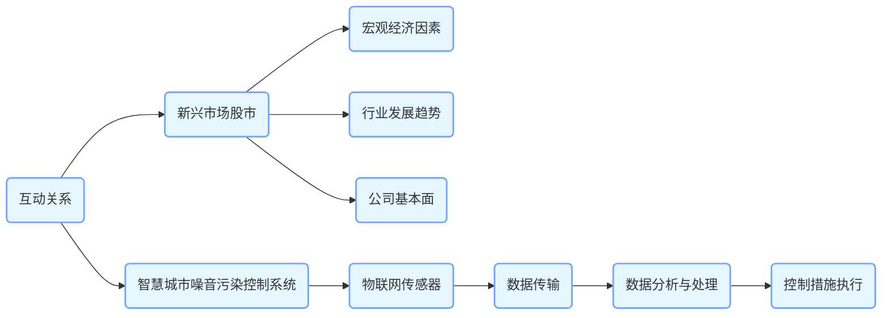

# 新兴市场股市估值与智慧城市噪音污染控制系统的互动

> 关键词：新兴市场股市估值、智慧城市、噪音污染控制系统、互动关系、经济影响

> 摘要：本文深入探讨了新兴市场股市估值与智慧城市噪音污染控制系统之间的互动关系。首先介绍了研究的背景、目的、预期读者和文档结构，阐述了相关核心概念。接着分析了核心算法原理、数学模型和公式，并通过具体案例进行说明。在项目实战部分，给出了开发环境搭建、源代码实现和解读。还探讨了实际应用场景，推荐了相关工具和资源。最后总结了未来发展趋势与挑战，解答了常见问题并提供了扩展阅读和参考资料，旨在揭示两者互动的机制和影响，为相关领域的研究和实践提供有价值的参考。

## 1. 背景介绍 
### 1.1 目的和范围
本研究旨在全面剖析新兴市场股市估值与智慧城市噪音污染控制系统之间的潜在互动关系。新兴市场股市在全球经济格局中扮演着愈发重要的角色，其估值受到多种因素的影响。而智慧城市建设作为现代城市发展的新方向，噪音污染控制系统是其中关键的组成部分。研究两者的互动关系，有助于深入理解经济因素与城市环境建设之间的内在联系，为投资者、城市规划者和政策制定者提供决策依据。范围涵盖新兴市场国家的主要股市以及智慧城市噪音污染控制系统的技术、经济和社会层面。

### 1.2 预期读者
本文预期读者包括金融领域的投资者、分析师和研究人员，他们可以从股市估值的角度理解与智慧城市噪音污染控制系统的关联，挖掘投资机会。城市规划和环境领域的专业人士能够从经济因素对噪音污染控制的影响中获取启示，优化城市建设方案。政策制定者可以参考研究结果制定相关政策，促进新兴市场股市健康发展和智慧城市的可持续建设。

### 1.3 文档结构概述
本文首先介绍相关背景信息，包括目的、读者和结构。接着阐述核心概念及它们之间的联系，给出原理和架构示意图。然后详细讲解核心算法原理、数学模型和公式，并举例说明。通过项目实战展示代码实现和解读。分析实际应用场景，推荐相关工具和资源。最后总结未来趋势与挑战，解答常见问题并提供扩展阅读和参考资料。

### 1.4 术语表
#### 1.4.1 核心术语定义
- 新兴市场股市估值：指对新兴市场国家股票市场中上市公司股票价值的评估，通常基于公司的财务状况、行业前景、宏观经济环境等因素。
- 智慧城市：利用信息技术和通信技术手段感测、分析、整合城市运行核心系统的各项关键信息，从而对包括民生、环保、公共安全、城市服务、工商业活动在内的各种需求做出智能响应的城市发展模式。
- 噪音污染控制系统：旨在监测、评估和控制城市环境中噪音污染的一系列技术、设备和管理措施的组合。

#### 1.4.2 相关概念解释
- 新兴市场：一般指发展中国家或地区的股票市场，具有较高的增长潜力，但也伴随着较高的风险和不确定性。
- 股市估值方法：常见的有市盈率法、市净率法、现金流折现法等，用于衡量股票的相对价值。
- 噪音污染：指环境中超过人们正常生活、工作和学习所能承受的声音水平，对人体健康和生活质量产生负面影响。

#### 1.4.3 缩略词列表
- GDP：国内生产总值（Gross Domestic Product）
- IoT：物联网（Internet of Things）
- AI：人工智能（Artificial Intelligence）

## 2. 核心概念与联系 

### 核心概念原理
#### 新兴市场股市估值原理
新兴市场股市估值是一个复杂的过程，它综合考虑了宏观经济因素、行业发展趋势和公司基本面等多方面因素。宏观经济因素如 GDP 增长率、通货膨胀率、利率水平等会影响整个市场的资金供求和投资者的风险偏好。行业发展趋势决定了不同行业的增长潜力和竞争格局，从而影响行业内公司的估值。公司基本面包括盈利能力、资产质量、管理水平等，是评估公司内在价值的基础。

#### 智慧城市噪音污染控制系统原理
智慧城市噪音污染控制系统基于物联网、传感器技术和数据分析技术。通过在城市中广泛部署噪音传感器，实时采集噪音数据。这些数据通过网络传输到数据中心，利用数据分析和人工智能算法进行处理和分析，以评估噪音污染的程度、分布和变化趋势。根据分析结果，系统可以自动触发相应的控制措施，如调整交通流量、限制工业生产噪音等，以降低噪音污染水平。

### 架构示意图


该流程图展示了新兴市场股市和智慧城市噪音污染控制系统各自的组成部分以及它们之间的互动关系。新兴市场股市受宏观经济因素、行业发展趋势和公司基本面的影响，而智慧城市噪音污染控制系统基于物联网传感器、数据传输、数据分析与处理以及控制措施执行。两者之间存在着相互影响的互动关系。

## 3. 核心算法原理 & 具体操作步骤 

### 新兴市场股市估值算法原理
#### 市盈率法
市盈率（P/E）是指股票价格与每股收益的比率，是一种常用的股市估值方法。其计算公式为：
$P/E = \frac{股价}{每股收益}$

通过比较目标股票的市盈率与同行业平均市盈率或市场整体市盈率，可以判断该股票是否被高估或低估。如果目标股票的市盈率低于同行业平均水平，可能被认为是低估的，具有投资价值；反之，则可能被高估。

#### Python 代码实现
```python
def calculate_pe_ratio(stock_price, earnings_per_share):
    """
    计算市盈率
    :param stock_price: 股票价格
    :param earnings_per_share: 每股收益
    :return: 市盈率
    """
    if earnings_per_share == 0:
        return float('inf')
    return stock_price / earnings_per_share

# 示例数据
stock_price = 50
earnings_per_share = 5

pe_ratio = calculate_pe_ratio(stock_price, earnings_per_share)
print(f"市盈率: {pe_ratio}")
```

### 智慧城市噪音污染控制系统算法原理
#### 噪音数据分析算法
噪音数据分析算法主要用于处理和分析采集到的噪音数据，以评估噪音污染的程度。常用的方法是计算噪音的平均值、最大值和标准差等统计指标。

#### Python 代码实现
```python
import numpy as np

def analyze_noise_data(noise_data):
    """
    分析噪音数据
    :param noise_data: 噪音数据列表
    :return: 平均值、最大值、标准差
    """
    mean_noise = np.mean(noise_data)
    max_noise = np.max(noise_data)
    std_noise = np.std(noise_data)
    return mean_noise, max_noise, std_noise

# 示例数据
noise_data = [60, 65, 70, 75, 80]

mean, max_val, std = analyze_noise_data(noise_data)
print(f"平均噪音: {mean} dB")
print(f"最大噪音: {max_val} dB")
print(f"噪音标准差: {std} dB")
```

### 具体操作步骤
#### 新兴市场股市估值操作步骤
1. 收集宏观经济数据，如 GDP 增长率、通货膨胀率、利率等。
2. 研究行业发展趋势，包括市场规模、竞争格局、技术创新等。
3. 分析公司基本面，获取公司的财务报表，计算盈利能力、资产质量等指标。
4. 选择合适的估值方法，如市盈率法、市净率法等，对股票进行估值。
5. 比较估值结果与市场价格，判断股票的投资价值。

#### 智慧城市噪音污染控制系统操作步骤
1. 在城市中合理布局噪音传感器，确保能够全面覆盖主要区域。
2. 定期采集噪音数据，并通过网络将数据传输到数据中心。
3. 使用数据分析算法对噪音数据进行处理和分析，评估噪音污染程度。
4. 根据分析结果制定相应的控制措施，如调整交通信号灯时间、加强工业噪音监管等。
5. 实施控制措施，并持续监测噪音数据，评估控制效果。

## 4. 数学模型和公式 & 详细讲解 & 举例说明 

### 新兴市场股市估值数学模型
#### 现金流折现模型（DCF）
现金流折现模型是一种基于未来现金流的估值方法，其基本原理是将公司未来的现金流按照一定的折现率折现到当前时刻，得到公司的内在价值。公式如下：
$$V = \sum_{t=1}^{n} \frac{CF_t}{(1 + r)^t} + \frac{TV}{(1 + r)^n}$$
其中，$V$ 表示公司的内在价值，$CF_t$ 表示第 $t$ 期的现金流，$r$ 表示折现率，$n$ 表示预测期数，$TV$ 表示终值。

详细讲解：该模型的核心思想是考虑了资金的时间价值，将未来的现金流折现到当前。预测期内的现金流是根据公司的业务发展和财务状况进行预测的，折现率反映了投资者对风险的要求。终值是预测期结束后公司的价值，可以通过多种方法计算，如永续增长模型。

举例说明：假设某公司未来三年的现金流分别为 100 万元、120 万元和 150 万元，折现率为 10%，预测期结束后的终值为 1000 万元。则该公司的内在价值为：
$$V = \frac{100}{(1 + 0.1)^1} + \frac{120}{(1 + 0.1)^2} + \frac{150}{(1 + 0.1)^3} + \frac{1000}{(1 + 0.1)^3}$$
```python
import math

cf1 = 100
cf2 = 120
cf3 = 150
r = 0.1
tv = 1000

v = cf1 / math.pow(1 + r, 1) + cf2 / math.pow(1 + r, 2) + cf3 / math.pow(1 + r, 3) + tv / math.pow(1 + r, 3)
print(f"公司内在价值: {v} 万元")
```

### 智慧城市噪音污染控制系统数学模型
#### 噪音传播模型
噪音传播模型用于预测噪音在空间中的传播和衰减情况。常用的点声源球面扩散模型公式如下：
$$L_p(r) = L_{p0} - 20\log_{10}(\frac{r}{r_0}) - \Delta L$$
其中，$L_p(r)$ 表示距离声源 $r$ 处的声压级，$L_{p0}$ 表示参考距离 $r_0$ 处的声压级，$\Delta L$ 表示其他衰减因素，如空气吸收、障碍物遮挡等。

详细讲解：该模型基于声音在自由空间中以球面波形式传播的原理，声压级随着距离的增加而衰减。$20\log_{10}(\frac{r}{r_0})$ 项反映了距离对声压级的影响，$\Delta L$ 项考虑了其他实际因素的影响。

举例说明：假设参考距离 $r_0 = 1$ 米处的声压级 $L_{p0} = 80$ dB，距离声源 $r = 10$ 米，其他衰减因素 $\Delta L = 5$ dB。则距离 10 米处的声压级为：
$$L_p(10) = 80 - 20\log_{10}(\frac{10}{1}) - 5$$
```python
import math

L_p0 = 80
r_0 = 1
r = 10
delta_L = 5

L_p_r = L_p0 - 20 * math.log10(r / r_0) - delta_L
print(f"距离 10 米处的声压级: {L_p_r} dB")
```

## 5. 项目实战：代码实际案例和详细解释说明 

### 5.1  开发环境搭建
#### 硬件环境
- 服务器：选择性能稳定、配置较高的服务器，如戴尔 PowerEdge R740xd，配备 Intel Xeon 处理器、大容量内存和高速硬盘。
- 传感器：选用高精度的噪音传感器，如 B&K 4189 型噪音传感器，具有高灵敏度和宽频响范围。
- 网络设备：使用企业级交换机和路由器，确保数据传输的稳定性和可靠性。

#### 软件环境
- 操作系统：服务器端安装 Linux 操作系统，如 Ubuntu 20.04 LTS，具有良好的稳定性和安全性。
- 数据库：选择 MySQL 数据库，用于存储股市数据和噪音污染数据。
- 开发语言和框架：使用 Python 作为开发语言，结合 Django 框架进行 Web 应用开发，方便实现数据的展示和交互。

### 5.2  源代码详细实现和代码解读
#### 股市数据采集与分析模块
```python
import requests
import pandas as pd
import matplotlib.pyplot as plt

# 采集股市数据
def get_stock_data(symbol, start_date, end_date):
    url = f"https://api.example.com/stock/{symbol}?start_date={start_date}&end_date={end_date}"
    response = requests.get(url)
    if response.status_code == 200:
        data = response.json()
        df = pd.DataFrame(data)
        return df
    else:
        return None

# 分析股市数据
def analyze_stock_data(df):
    if df is not None:
        df['return'] = df['close'].pct_change()
        plt.plot(df['date'], df['return'])
        plt.xlabel('Date')
        plt.ylabel('Return')
        plt.title('Stock Return')
        plt.show()

# 示例调用
symbol = 'ABC'
start_date = '2023-01-01'
end_date = '2023-12-31'

stock_data = get_stock_data(symbol, start_date, end_date)
analyze_stock_data(stock_data)
```
代码解读：
- `get_stock_data` 函数通过调用 API 接口获取指定股票在指定日期范围内的历史数据，并将其转换为 Pandas 数据框。
- `analyze_stock_data` 函数计算股票的收益率，并使用 Matplotlib 库绘制收益率曲线，直观展示股票的波动情况。

#### 噪音数据采集与分析模块
```python
import serial
import time
import pandas as pd
import matplotlib.pyplot as plt

# 采集噪音数据
def collect_noise_data(port, baudrate, duration):
    ser = serial.Serial(port, baudrate)
    data = []
    start_time = time.time()
    while time.time() - start_time < duration:
        line = ser.readline().decode('utf-8').strip()
        try:
            noise_level = float(line)
            data.append(noise_level)
        except ValueError:
            pass
    ser.close()
    df = pd.DataFrame(data, columns=['noise_level'])
    return df

# 分析噪音数据
def analyze_noise_data(df):
    if df is not None:
        mean_noise = df['noise_level'].mean()
        max_noise = df['noise_level'].max()
        plt.hist(df['noise_level'], bins=20)
        plt.xlabel('Noise Level (dB)')
        plt.ylabel('Frequency')
        plt.title('Noise Level Distribution')
        plt.show()
        print(f"平均噪音: {mean_noise} dB")
        print(f"最大噪音: {max_noise} dB")

# 示例调用
port = 'COM3'
baudrate = 9600
duration = 60

noise_data = collect_noise_data(port, baudrate, duration)
analyze_noise_data(noise_data)
```
代码解读：
- `collect_noise_data` 函数通过串口通信从噪音传感器采集数据，持续采集指定时长，并将数据存储在 Pandas 数据框中。
- `analyze_noise_data` 函数计算噪音数据的平均值和最大值，并使用 Matplotlib 库绘制噪音水平的直方图，展示噪音的分布情况。

### 5.3  代码解读与分析
#### 股市数据采集与分析模块
- 数据采集部分使用 `requests` 库发送 HTTP 请求获取股市数据，通过判断响应状态码确保数据获取成功。
- 数据分析部分使用 Pandas 库进行数据处理和计算，使用 Matplotlib 库进行可视化展示，方便用户直观了解股票的收益率情况。

#### 噪音数据采集与分析模块
- 数据采集部分使用 `serial` 库进行串口通信，从噪音传感器读取数据。通过 `try-except` 块处理可能的异常数据。
- 数据分析部分同样使用 Pandas 库进行数据处理和计算，使用 Matplotlib 库绘制直方图，展示噪音水平的分布特征。

## 6. 实际应用场景 
### 金融投资领域
投资者可以通过分析新兴市场股市估值与智慧城市噪音污染控制系统的互动关系，挖掘潜在的投资机会。例如，如果某个新兴市场国家大力推进智慧城市建设，加大对噪音污染控制系统的投入，相关行业的上市公司可能会受益，其股票估值有望提升。投资者可以关注这些公司的股票，进行投资决策。

### 城市规划与管理
城市规划者可以根据新兴市场股市的发展情况，合理安排智慧城市噪音污染控制系统的建设。当股市繁荣时，城市可以有更多的资金用于噪音污染控制项目的研发和实施。同时，噪音污染控制系统的改善也可以提升城市的环境质量，吸引更多的投资和人才，促进新兴市场股市的发展。

### 政策制定
政策制定者可以参考两者的互动关系制定相关政策。例如，出台鼓励新兴市场股市发展的政策，吸引更多的资金流入，为智慧城市噪音污染控制系统的建设提供资金支持。同时，制定严格的噪音污染控制法规，推动相关技术的研发和应用，促进智慧城市的可持续发展。

## 7. 工具和资源推荐
### 7.1 学习资源推荐
#### 7.1.1 书籍推荐
- 《金融市场与金融机构》：全面介绍了金融市场的基本原理和金融机构的运作方式，有助于读者理解新兴市场股市的相关知识。
- 《智慧城市：创新2.0时代的城市形态》：深入探讨了智慧城市的概念、技术和应用，为了解智慧城市噪音污染控制系统提供了理论基础。
- 《Python 数据分析实战》：详细讲解了 Python 在数据分析领域的应用，包括数据采集、处理、分析和可视化等方面，对于实现相关项目具有重要的指导作用。

#### 7.1.2 在线课程
- Coursera 上的“金融市场”课程：由知名大学的教授授课，系统介绍了金融市场的理论和实践，适合初学者和有一定基础的学习者。
- edX 上的“智慧城市技术与应用”课程：涵盖了智慧城市的各个方面，包括物联网、大数据、人工智能等技术在城市管理中的应用，对智慧城市噪音污染控制系统的学习有很大帮助。
- 网易云课堂上的“Python 数据分析从入门到精通”课程：通过实际案例讲解 Python 数据分析的方法和技巧，让学习者能够快速掌握数据分析的基本技能。

#### 7.1.3 技术博客和网站
- 金融界网站：提供丰富的金融资讯和市场分析，包括新兴市场股市的动态和估值情况。
- 智慧城市网：专注于智慧城市领域的技术、政策和应用案例的报道，为了解智慧城市噪音污染控制系统提供了最新的信息。
- 博客园和 CSDN：是程序员交流和分享技术经验的平台，有很多关于 Python 编程、数据分析和数据库管理的技术文章，对项目开发有很大的参考价值。

### 7.2 开发工具框架推荐
#### 7.2.1 IDE和编辑器
- PyCharm：是一款专业的 Python 集成开发环境，具有代码编辑、调试、版本控制等功能，提高了开发效率。
- Visual Studio Code：是一款轻量级的代码编辑器，支持多种编程语言，具有丰富的插件生态系统，可以根据需要进行扩展。

#### 7.2.2 调试和性能分析工具
- PDB：是 Python 自带的调试工具，可以帮助开发者定位和解决代码中的问题。
- cProfile：是 Python 的性能分析工具，可以分析代码的执行时间和函数调用情况，优化代码性能。

#### 7.2.3 相关框架和库
- Django：是一个高级 Python Web 框架，提供了快速开发 Web 应用的工具和功能，适合开发股市数据和噪音污染数据的展示平台。
- Pandas：是 Python 中用于数据处理和分析的强大库，提供了丰富的数据结构和数据操作方法，方便对股市数据和噪音污染数据进行处理和分析。
- Matplotlib：是 Python 中常用的绘图库，可以绘制各种类型的图表，如折线图、直方图等，用于数据可视化。

### 7.3 相关论文著作推荐
#### 7.3.1 经典论文
- Fama, E. F., & French, K. R. (1992). The cross-section of expected stock returns. The Journal of Finance, 47(2), 427-465. 该论文提出了著名的 Fama-French 三因子模型，对股票估值和资产定价理论产生了深远影响。
- Giffinger, R., Fertner, C., Kramar, H., Kalasek, R., Pichler-Milanovic, N., & Meijers, E. (2007). Smart cities - Ranking of European medium-sized cities. Vienna: Centre of Regional Science. 该论文首次提出了智慧城市的概念和评价指标体系，为智慧城市的研究和实践提供了重要的理论基础。

#### 7.3.2 最新研究成果
- 近年来，关于新兴市场股市估值和智慧城市建设的研究不断涌现。一些研究关注新兴市场股市的波动性和风险特征，以及如何通过宏观经济政策和金融创新来稳定股市。另一些研究则聚焦于智慧城市噪音污染控制系统的技术创新和管理模式，如利用物联网和人工智能技术实现噪音的实时监测和智能控制。

#### 7.3.3 应用案例分析
- 新加坡在智慧城市建设方面取得了显著成就，其噪音污染控制系统通过智能化的传感器网络和数据分析平台，实现了对城市噪音的精准监测和有效控制。同时，新加坡的股市也在经济发展的推动下保持了稳定增长，两者之间形成了良性互动。
- 巴西作为新兴市场国家，在股市发展和智慧城市建设方面也有自己的特点。巴西政府通过出台相关政策，鼓励企业参与智慧城市项目，促进了噪音污染控制系统的发展，同时也为股市带来了新的增长点。

## 8. 总结：未来发展趋势与挑战
### 未来发展趋势
#### 新兴市场股市估值
随着全球经济的一体化和新兴市场国家经济的快速发展，新兴市场股市的规模和影响力将不断扩大。股市估值方法将更加多元化和精细化，除了传统的市盈率、市净率等指标，还将引入更多的宏观经济和行业因素进行综合评估。同时，随着科技的进步，人工智能和大数据技术将在股市估值中得到更广泛的应用，提高估值的准确性和效率。

#### 智慧城市噪音污染控制系统
智慧城市噪音污染控制系统将朝着智能化、网络化和集成化的方向发展。物联网技术将使噪音传感器更加普及和智能，实现对城市噪音的全方位实时监测。人工智能算法将用于对噪音数据的深度分析和预测，提前采取措施控制噪音污染。此外，噪音污染控制系统将与其他城市管理系统进行集成，实现资源共享和协同管理。

### 挑战
#### 数据质量和安全问题
新兴市场股市数据和智慧城市噪音污染数据的质量和安全是面临的重要挑战。股市数据可能存在不准确、不完整的情况，影响估值的准确性。噪音污染数据的采集和传输过程中也可能受到干扰和攻击，导致数据丢失或泄露。因此，需要加强数据质量管理和安全保障措施。

#### 技术创新和应用难题
虽然人工智能、物联网等技术为新兴市场股市估值和智慧城市噪音污染控制系统带来了新的机遇，但技术的创新和应用也面临着诸多难题。例如，人工智能算法的可解释性和可靠性问题，物联网设备的兼容性和互操作性问题等。需要加大技术研发和创新力度，解决这些技术难题。

#### 政策协调和管理挑战
新兴市场股市和智慧城市建设涉及多个部门和领域，政策的协调和管理是一个挑战。不同部门的政策目标和利益诉求可能存在差异，需要加强政策协调和沟通，形成合力，共同推动新兴市场股市和智慧城市的发展。

## 9. 附录：常见问题与解答
### 新兴市场股市估值方面
#### 问：新兴市场股市估值与成熟市场股市估值有何不同？
答：新兴市场股市估值通常受到更多的宏观经济不确定性、政治风险和市场流动性等因素的影响。与成熟市场相比，新兴市场股市的市盈率和市净率可能波动更大，估值方法也需要更多地考虑新兴市场的特点和特殊因素。

#### 问：如何选择合适的股市估值方法？
答：选择合适的股市估值方法需要考虑多个因素，如公司的行业特点、财务状况、发展阶段等。对于盈利稳定的公司，可以使用市盈率法；对于资产价值较高的公司，可以使用市净率法；对于未来现金流可预测的公司，可以使用现金流折现模型。同时，也可以结合多种估值方法进行综合评估。

### 智慧城市噪音污染控制系统方面
#### 问：噪音传感器的布置有哪些原则？
答：噪音传感器的布置应遵循以下原则：一是要全面覆盖城市的主要区域，包括交通干道、商业区、居民区等；二是要考虑噪音源的分布情况，在噪音源附近适当增加传感器的密度；三是要避免传感器受到外界干扰，如避免安装在风口、高温等环境中。

#### 问：如何评估噪音污染控制系统的效果？
答：可以从多个方面评估噪音污染控制系统的效果，如噪音水平的降低程度、噪音污染区域的减少范围、居民对噪音环境的满意度等。同时，还可以通过长期监测噪音数据，分析噪音的变化趋势，评估系统的长期效果。

## 10. 扩展阅读 & 参考资料
### 扩展阅读
- 《新兴市场的崛起与挑战》：深入探讨了新兴市场国家在经济发展过程中面临的机遇和挑战，对理解新兴市场股市的发展具有重要的参考价值。
- 《智慧城市的未来之路》：展望了智慧城市的未来发展方向和趋势，提出了一些创新性的理念和解决方案，为智慧城市噪音污染控制系统的研究提供了新的思路。

### 参考资料
- 世界银行发布的《全球经济展望》报告，提供了全球和新兴市场国家的宏观经济数据和分析。
- 国际电信联盟（ITU）发布的关于智慧城市建设的相关报告和标准，为智慧城市噪音污染控制系统的建设提供了技术指导。
- 各新兴市场国家的证券交易所网站，提供了股市的实时行情和上市公司的财务信息。

作者：AI天才研究院/AI Genius Institute & 禅与计算机程序设计艺术 /Zen And The Art of Computer Programming