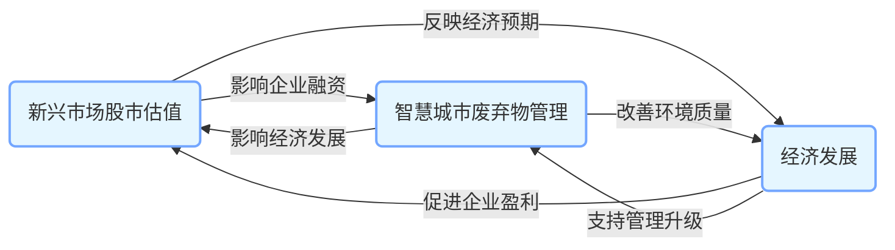

# 新兴市场股市估值与智慧城市废弃物管理的互动

> 关键词：新兴市场股市估值、智慧城市废弃物管理、互动关系、金融与环保、经济可持续发展

> 摘要：本文聚焦于新兴市场股市估值与智慧城市废弃物管理之间的互动关系。首先介绍了研究的背景、目的、预期读者和文档结构等内容。接着阐述了相关核心概念及其联系，分析了背后的核心算法原理和操作步骤，并运用数学模型和公式进行深入解读。通过实际项目案例展示了两者互动在实际中的体现，探讨了具体的应用场景。同时推荐了学习相关知识的工具和资源，最后总结了未来发展趋势与挑战，解答常见问题并提供扩展阅读和参考资料。旨在揭示金融市场与环保领域之间的内在联系，为经济的可持续发展提供新的视角和思路。

## 1. 背景介绍 
### 1.1 目的和范围
本研究的主要目的是深入探究新兴市场股市估值与智慧城市废弃物管理之间的互动关系。新兴市场在全球经济中扮演着越来越重要的角色，其股市估值受到多种因素的影响。而智慧城市废弃物管理作为城市可持续发展的关键环节，不仅关系到环境质量，还可能对经济产生深远影响。通过分析两者之间的互动，我们可以更好地理解金融市场与环保领域之间的内在联系，为投资者、政策制定者和城市管理者提供有价值的决策依据。

研究范围涵盖了多个新兴市场国家和地区的股市数据，以及不同智慧城市的废弃物管理实践。我们将综合运用金融、环境科学、统计学等多学科知识，从宏观和微观层面进行分析。

### 1.2 预期读者
本文的预期读者包括金融投资者、政策制定者、城市管理者、环保专家以及对金融与环保交叉领域感兴趣的研究人员。对于金融投资者来说，了解新兴市场股市估值与智慧城市废弃物管理的互动关系可以帮助他们发现潜在的投资机会；政策制定者可以根据研究结果制定更加合理的经济和环境政策；城市管理者可以借鉴相关经验，优化智慧城市废弃物管理策略；环保专家可以从金融角度为废弃物管理提供新的思路；研究人员则可以在该领域开展进一步的深入研究。

### 1.3 文档结构概述
本文将按照以下结构进行阐述：首先介绍核心概念与联系，明确新兴市场股市估值和智慧城市废弃物管理的定义和相互关系；接着分析核心算法原理和具体操作步骤，运用Python代码进行详细说明；然后通过数学模型和公式对两者的互动关系进行量化分析，并举例说明；之后展示项目实战案例，包括开发环境搭建、源代码实现和代码解读；再探讨实际应用场景；推荐相关的工具和资源；总结未来发展趋势与挑战；解答常见问题；最后提供扩展阅读和参考资料。

### 1.4 术语表
#### 1.4.1 核心术语定义
- **新兴市场股市估值**：指对新兴市场国家或地区股票市场中上市公司股票价值的评估。通常采用市盈率、市净率等指标来衡量。新兴市场一般是指经济发展较快、市场潜力较大但金融体系相对不够成熟的国家和地区的市场。
- **智慧城市废弃物管理**：是指利用信息技术和智能化手段，对城市废弃物的产生、收集、运输、处理和处置等全过程进行优化管理，以实现废弃物的减量化、资源化和无害化目标，提高城市环境质量和资源利用效率。

#### 1.4.2 相关概念解释
- **金融市场与环保领域的交叉影响**：金融市场的资金流向和资产估值会受到环保政策、环保产业发展等因素的影响；同时，金融市场也可以为环保项目提供融资支持，促进环保产业的发展。在新兴市场中，这种交叉影响可能更为明显，因为新兴市场的经济发展和环境保护面临着更多的挑战和机遇。
- **可持续发展**：强调经济、社会和环境的协调发展，既要满足当代人的需求，又不损害后代人满足其需求的能力。新兴市场股市估值与智慧城市废弃物管理的互动关系与可持续发展密切相关，合理的互动可以促进经济的可持续增长和环境的可持续改善。

#### 1.4.3 缩略词列表
- **PE**：市盈率（Price - Earnings Ratio），是指股票价格除以每股收益的比率，用于衡量股票的估值水平。
- **PB**：市净率（Price - Book Ratio），是指股票价格除以每股净资产的比率，也是常用的股票估值指标之一。
- **GIS**：地理信息系统（Geographic Information System），在智慧城市废弃物管理中可用于废弃物收集点的规划、运输路线的优化等。

## 2. 核心概念与联系 
### 核心概念原理
#### 新兴市场股市估值原理
新兴市场股市估值受到多种因素的影响。从宏观经济层面来看，经济增长速度、通货膨胀率、利率水平等都会对股市估值产生重要影响。例如，经济增长较快时，企业的盈利预期增加，股票价格可能上涨，市盈率等估值指标也会相应提高；而高通货膨胀率可能导致利率上升，增加企业的融资成本，从而降低股市估值。

从行业层面来看，不同行业的发展前景和盈利能力也会影响其在股市中的估值。在新兴市场中，一些新兴产业如科技、环保等行业可能具有较高的估值，因为它们具有较大的发展潜力。

从企业层面来看，公司的财务状况、经营管理水平、市场竞争力等是决定其股票估值的关键因素。例如，一家盈利能力强、资产质量好、管理层优秀的公司，其股票往往会获得较高的估值。

#### 智慧城市废弃物管理原理
智慧城市废弃物管理的核心原理是利用信息技术和智能化手段提高废弃物管理的效率和效果。通过建立废弃物管理信息系统，可以实时监测废弃物的产生量、收集情况、运输路线等信息，实现对废弃物管理全过程的精细化管理。

例如，利用物联网技术可以在垃圾桶上安装传感器，实时监测垃圾桶的满溢状态，当垃圾桶快满时自动通知垃圾收集车辆进行清理，避免垃圾桶外溢造成环境污染。同时，通过数据分析和优化算法，可以合理规划垃圾收集路线，降低运输成本。

### 架构的文本示意图
新兴市场股市估值与智慧城市废弃物管理之间存在着复杂的互动关系。一方面，智慧城市废弃物管理的发展会影响新兴市场股市估值。良好的废弃物管理可以改善城市环境质量，吸引更多的投资和人才，促进城市经济的发展，从而提高相关企业的盈利预期，推动股市估值上升。例如，废弃物处理企业的业绩可能会因为废弃物管理的优化而提高，其股票价格也会相应上涨。

另一方面，新兴市场股市估值也会对智慧城市废弃物管理产生影响。当股市估值较高时，废弃物处理企业可以通过股权融资等方式获得更多的资金，用于技术研发和设备更新，进一步提高废弃物管理的水平。反之，股市估值较低时，企业的融资难度可能增加，影响废弃物管理项目的推进。

以下是两者互动关系的示意图：

新兴市场股市估值 <----> 智慧城市废弃物管理
    |                     |
    | 经济发展促进        | 资金投入推动
    |                     |
    V                     V
企业盈利增加              管理水平提高

### Mermaid 流程图


## 3. 核心算法原理 & 具体操作步骤 
### 核心算法原理
为了分析新兴市场股市估值与智慧城市废弃物管理的互动关系，我们可以采用回归分析算法。回归分析是一种统计方法，用于研究自变量与因变量之间的关系。在本研究中，我们可以将新兴市场股市估值指标（如市盈率、市净率）作为因变量，将智慧城市废弃物管理相关指标（如废弃物处理率、资源化利用率等）作为自变量，建立回归模型，分析两者之间的定量关系。

### 具体操作步骤
#### 数据收集
首先，我们需要收集新兴市场股市估值数据和智慧城市废弃物管理数据。股市估值数据可以从金融数据提供商（如 Bloomberg、Wind 等）获取，包括不同行业和公司的市盈率、市净率等指标。智慧城市废弃物管理数据可以从城市政府部门、环保机构或相关研究报告中获取，包括废弃物产生量、处理量、资源化利用率等指标。

#### 数据预处理
收集到的数据可能存在缺失值、异常值等问题，需要进行预处理。对于缺失值，可以采用均值填充、中位数填充等方法进行处理；对于异常值，可以采用基于统计方法（如 Z - score 方法）进行识别和处理。

#### 模型建立
使用 Python 的`statsmodels`库建立回归模型。以下是一个简单的 Python 代码示例：

```python
import pandas as pd
import statsmodels.api as sm

# 假设我们已经有了股市估值数据和废弃物管理数据
# 读取数据
data = pd.read_csv('data.csv')

# 定义自变量和因变量
X = data[['waste_processing_rate', 'resource_recovery_rate']]  # 废弃物处理率和资源化利用率
y = data['PE_ratio']  # 市盈率

# 添加常数项
X = sm.add_constant(X)

# 建立回归模型
model = sm.OLS(y, X)

# 拟合模型
results = model.fit()

# 输出模型结果
print(results.summary())
```

#### 模型评估
使用 R - squared（决定系数）、调整后的 R - squared、F - 检验等指标对回归模型进行评估。R - squared 表示自变量对因变量的解释程度，值越接近 1 表示模型的拟合效果越好。

#### 结果分析
根据回归模型的结果，分析自变量对因变量的影响方向和程度。例如，如果回归系数为正，表示废弃物处理率或资源化利用率的提高会导致市盈率的上升；反之，如果回归系数为负，则表示两者呈负相关关系。

## 4. 数学模型和公式 & 详细讲解 & 举例说明 
### 数学模型
我们建立的回归模型可以表示为：

$$Y = \beta_0 + \beta_1X_1 + \beta_2X_2 + \cdots + \beta_nX_n + \epsilon$$

其中，$Y$ 是因变量（新兴市场股市估值指标，如市盈率），$X_1, X_2, \cdots, X_n$ 是自变量（智慧城市废弃物管理相关指标，如废弃物处理率、资源化利用率等），$\beta_0$ 是截距项，$\beta_1, \beta_2, \cdots, \beta_n$ 是回归系数，$\epsilon$ 是误差项，服从均值为 0、方差为 $\sigma^2$ 的正态分布。

### 详细讲解
- **截距项 $\beta_0$**：表示当所有自变量都为 0 时，因变量的取值。在实际应用中，它可能没有实际的物理意义，但在数学模型中是必要的。
- **回归系数 $\beta_i$**：表示自变量 $X_i$ 每变化一个单位，因变量 $Y$ 的平均变化量。例如，如果 $\beta_1$ 是废弃物处理率的回归系数，且 $\beta_1 = 0.5$，则表示废弃物处理率每提高 1 个百分点，市盈率平均提高 0.5。
- **误差项 $\epsilon$**：反映了除自变量以外的其他因素对因变量的影响。由于实际情况中存在很多无法精确测量和控制的因素，这些因素的综合影响就体现在误差项中。

### 举例说明
假设我们收集了某新兴市场城市 10 年的股市市盈率数据和废弃物处理率、资源化利用率数据，经过数据预处理后，使用上述回归模型进行分析，得到以下结果：

$$PE = 10 + 0.2\times waste\_processing\_rate + 0.3\times resource\_recovery\_rate + \epsilon$$

这意味着当废弃物处理率和资源化利用率都为 0 时，市盈率的估计值为 10。废弃物处理率每提高 1 个百分点，市盈率平均提高 0.2；资源化利用率每提高 1 个百分点，市盈率平均提高 0.3。

例如，某一年该城市的废弃物处理率为 80%，资源化利用率为 30%，则根据回归模型预测的市盈率为：

$$PE = 10 + 0.2\times80 + 0.3\times30 = 10 + 16+9 = 35$$

当然，这只是一个预测值，实际的市盈率还会受到误差项 $\epsilon$ 的影响。

## 5. 项目实战：代码实际案例和详细解释说明 
### 5.1  开发环境搭建
#### 安装 Python
首先，需要安装 Python 环境。建议使用 Python 3.7 及以上版本。可以从 Python 官方网站（https://www.python.org/downloads/）下载适合自己操作系统的安装包，按照安装向导进行安装。

#### 安装必要的库
在安装好 Python 后，需要安装一些必要的库，包括`pandas`、`statsmodels`、`numpy`等。可以使用`pip`命令进行安装：

```bash
pip install pandas statsmodels numpy
```

### 5.2  源代码详细实现和代码解读
以下是一个完整的 Python 代码示例，用于分析新兴市场股市估值与智慧城市废弃物管理的互动关系：

```python
import pandas as pd
import statsmodels.api as sm
import numpy as np

# 模拟数据生成
np.random.seed(0)
n = 100  # 样本数量
waste_processing_rate = np.random.uniform(50, 100, n)  # 废弃物处理率
resource_recovery_rate = np.random.uniform(10, 50, n)  # 资源化利用率
# 假设市盈率与废弃物处理率和资源化利用率存在线性关系，同时加入一些随机噪声
PE_ratio = 10 + 0.2 * waste_processing_rate + 0.3 * resource_recovery_rate + np.random.normal(0, 5, n)

# 创建 DataFrame
data = pd.DataFrame({
    'waste_processing_rate': waste_processing_rate,
    'resource_recovery_rate': resource_recovery_rate,
    'PE_ratio': PE_ratio
})

# 定义自变量和因变量
X = data[['waste_processing_rate', 'resource_recovery_rate']]
y = data['PE_ratio']

# 添加常数项
X = sm.add_constant(X)

# 建立回归模型
model = sm.OLS(y, X)

# 拟合模型
results = model.fit()

# 输出模型结果
print(results.summary())

# 预测新数据
new_data = pd.DataFrame({
    'const': [1],
    'waste_processing_rate': [85],
    'resource_recovery_rate': [35]
})
predicted_PE = results.predict(new_data)
print(f"预测的市盈率: {predicted_PE[0]}")
```

### 代码解读与分析
#### 数据生成部分
```python
np.random.seed(0)
n = 100  # 样本数量
waste_processing_rate = np.random.uniform(50, 100, n)  # 废弃物处理率
resource_recovery_rate = np.random.uniform(10, 50, n)  # 资源化利用率
PE_ratio = 10 + 0.2 * waste_processing_rate + 0.3 * resource_recovery_rate + np.random.normal(0, 5, n)
```
这部分代码使用`numpy`库生成了模拟数据。`np.random.seed(0)`用于设置随机数种子，保证结果的可重复性。`waste_processing_rate`和`resource_recovery_rate`分别是废弃物处理率和资源化利用率的随机数据，`PE_ratio`是根据假设的线性关系生成的市盈率数据，并加入了一些随机噪声。

#### 数据处理和模型建立部分
```python
data = pd.DataFrame({
    'waste_processing_rate': waste_processing_rate,
    'resource_recovery_rate': resource_recovery_rate,
    'PE_ratio': PE_ratio
})
X = data[['waste_processing_rate', 'resource_recovery_rate']]
y = data['PE_ratio']
X = sm.add_constant(X)
model = sm.OLS(y, X)
results = model.fit()
```
这部分代码使用`pandas`库将生成的数据转换为 DataFrame 格式，然后定义自变量`X`和因变量`y`。`sm.add_constant(X)`用于给自变量添加常数项，`sm.OLS(y, X)`建立普通最小二乘回归模型，`results = model.fit()`拟合模型。

#### 结果输出和预测部分
```python
print(results.summary())
new_data = pd.DataFrame({
    'const': [1],
    'waste_processing_rate': [85],
    'resource_recovery_rate': [35]
})
predicted_PE = results.predict(new_data)
print(f"预测的市盈率: {predicted_PE[0]}")
```
`print(results.summary())`输出回归模型的详细结果，包括回归系数、R - squared 等指标。`new_data`是新的输入数据，`results.predict(new_data)`用于预测新数据对应的市盈率。

## 6. 实际应用场景 
### 投资决策
对于金融投资者来说，了解新兴市场股市估值与智慧城市废弃物管理的互动关系可以帮助他们做出更明智的投资决策。例如，如果发现某个新兴市场城市的废弃物管理水平不断提高，废弃物处理率和资源化利用率持续上升，根据我们的分析，该城市相关企业的股市估值可能会上升。投资者可以关注这些企业的股票，寻找潜在的投资机会。

### 政策制定
政策制定者可以根据两者的互动关系制定更加合理的经济和环境政策。例如，政府可以出台鼓励废弃物处理和资源化利用的政策，提高城市废弃物管理水平。这不仅有助于改善环境质量，还可能促进相关产业的发展，推动股市估值上升，实现经济和环境的双赢。

### 城市规划
城市管理者在进行城市规划时，可以考虑废弃物管理对股市估值和经济发展的影响。合理规划废弃物处理设施和收集网络，提高废弃物管理效率，可以提升城市的吸引力和竞争力，促进城市经济的可持续发展。

### 企业战略规划
废弃物处理企业可以根据股市估值的变化调整自身的战略规划。当股市估值较高时，企业可以通过股权融资等方式获得更多的资金，用于技术研发和设备更新，扩大业务规模；当股市估值较低时，企业可以加强内部管理，降低成本，提高自身的盈利能力。

## 7. 工具和资源推荐
### 7.1 学习资源推荐
#### 7.1.1 书籍推荐
- 《金融市场学》：全面介绍了金融市场的基本概念、运行机制和各种金融工具，对于理解新兴市场股市估值有很大的帮助。
- 《智慧城市：技术、应用与案例》：详细阐述了智慧城市的相关技术和应用，包括废弃物管理等方面的内容。
- 《统计学原理》：为回归分析等统计方法提供了理论基础，有助于深入理解本文所使用的核心算法。

#### 7.1.2 在线课程
- Coursera 上的“金融市场分析”课程：由知名大学的教授授课，系统讲解金融市场的分析方法和工具。
- edX 上的“智慧城市技术与应用”课程：介绍了智慧城市的最新技术和实践案例，包括废弃物管理的智能化解决方案。
- 中国大学 MOOC 上的“统计学基础”课程：适合初学者学习统计学的基本原理和方法。

#### 7.1.3 技术博客和网站
- 金融界网站：提供丰富的金融市场资讯和分析报告，包括新兴市场股市的动态。
- 智慧城市网：专注于智慧城市领域的技术、应用和政策等方面的报道，有很多关于废弃物管理的案例和经验分享。
- 统计之都：国内知名的统计学社区，有很多关于统计方法和数据分析的技术文章。

### 7.2 开发工具框架推荐
#### 7.2.1 IDE和编辑器
- PyCharm：一款功能强大的 Python 集成开发环境，提供代码编辑、调试、版本控制等多种功能，适合 Python 项目的开发。
- Jupyter Notebook：交互式的编程环境，方便进行数据探索、模型构建和结果展示，非常适合数据分析和机器学习项目。

#### 7.2.2 调试和性能分析工具
- `pdb`：Python 自带的调试工具，可以帮助开发者定位代码中的问题。
- `cProfile`：Python 的性能分析工具，可以分析代码的运行时间和函数调用情况，帮助优化代码性能。

#### 7.2.3 相关框架和库
- `pandas`：强大的数据处理和分析库，提供了丰富的数据结构和数据操作方法，适用于数据清洗、预处理和分析。
- `statsmodels`：用于统计建模和计量经济学分析的 Python 库，支持多种回归模型和统计检验。
- `scikit - learn`：机器学习库，提供了各种机器学习算法和工具，可用于进一步的数据分析和预测。

### 7.3 相关论文著作推荐
#### 7.3.1 经典论文
- "The Relationship between Environmental Performance and Financial Performance: A Meta - analysis"：该论文通过元分析方法研究了企业环境绩效与财务绩效之间的关系，为理解新兴市场股市估值与智慧城市废弃物管理的互动提供了理论基础。
- "Smart City Waste Management: A Review of Technologies and Strategies"：对智慧城市废弃物管理的技术和策略进行了全面的综述，介绍了最新的研究成果和实践经验。

#### 7.3.2 最新研究成果
- 近年来，一些国际顶级学术期刊如《Journal of Environmental Economics and Management》、《Urban Studies》等发表了很多关于新兴市场金融与环保领域交叉研究的论文，可以关注这些期刊获取最新的研究成果。

#### 7.3.3 应用案例分析
- 世界银行和联合国环境规划署发布的一些报告中包含了很多新兴市场城市在废弃物管理和经济发展方面的应用案例，可以从中学习借鉴实际经验。

## 8. 总结：未来发展趋势与挑战
### 未来发展趋势
#### 金融与环保深度融合
随着可持续发展理念的深入人心，新兴市场股市估值与智慧城市废弃物管理的互动将更加紧密。金融市场将更加关注环保产业的发展，为废弃物处理和资源化利用项目提供更多的融资支持；同时，良好的废弃物管理也将成为提升企业股市估值和城市经济竞争力的重要因素。

#### 智能化和数字化发展
智慧城市废弃物管理将越来越多地采用智能化和数字化技术，如物联网、大数据、人工智能等。这些技术的应用将提高废弃物管理的效率和精准度，同时也会产生更多的数据，为金融市场分析和股市估值提供更丰富的信息。

#### 国际合作加强
新兴市场国家和地区将加强在废弃物管理和金融领域的国际合作。一方面，分享废弃物管理的先进技术和经验；另一方面，吸引国际金融资本参与新兴市场的废弃物处理项目，促进经济和环境的共同发展。

### 挑战
#### 数据质量和获取难度
准确的新兴市场股市估值数据和智慧城市废弃物管理数据是进行分析的基础。然而，在一些新兴市场国家和地区，数据的质量和获取难度较大，可能存在数据缺失、不准确等问题，影响分析结果的可靠性。

#### 政策协调难度
金融政策和环境政策的协调是一个挑战。不同部门的政策目标和利益诉求可能存在差异，如何制定协调一致的政策，促进新兴市场股市估值与智慧城市废弃物管理的良性互动，需要政府部门之间的密切合作和有效沟通。

#### 技术创新和应用成本
虽然智能化和数字化技术在废弃物管理中有很大的应用潜力，但技术创新和应用成本较高。对于一些新兴市场国家和地区来说，可能面临资金和技术瓶颈，难以大规模推广应用这些技术。

## 9. 附录：常见问题与解答
### 问题 1：新兴市场股市估值与发达国家股市估值有什么不同？
解答：新兴市场股市估值通常受到更多的不确定性因素影响，如政治稳定性、经济政策变化、金融体系不完善等。相比之下，发达国家股市估值相对更加稳定，市场机制更加成熟。新兴市场股市的市盈率和市净率波动可能更大，同时也可能存在更多的投资机会和风险。

### 问题 2：智慧城市废弃物管理只适用于大城市吗？
解答：不是的。智慧城市废弃物管理的理念和技术适用于各种规模的城市。虽然大城市在废弃物管理方面面临更大的挑战，但中小城市也可以通过引入智能化和数字化手段，提高废弃物管理的效率和效果。例如，一些中小城市可以利用物联网技术实现垃圾桶的智能监测，优化垃圾收集路线，降低管理成本。

### 问题 3：回归分析模型的结果一定准确吗？
解答：回归分析模型的结果只是一个估计值，存在一定的误差。模型的准确性受到多种因素的影响，如数据质量、模型假设的合理性、样本的代表性等。在实际应用中，需要对模型的结果进行合理的评估和分析，结合其他信息进行综合判断。

### 问题 4：如何衡量智慧城市废弃物管理的水平？
解答：可以从多个方面衡量智慧城市废弃物管理的水平，如废弃物处理率、资源化利用率、垃圾收集效率、处理设施的运行状况等。同时，还可以考虑公众对废弃物管理的满意度、环境质量的改善程度等指标。综合这些指标可以更全面地评估智慧城市废弃物管理的水平。

## 10. 扩展阅读 & 参考资料
### 扩展阅读
- 《循环经济与可持续发展》：深入探讨了循环经济的理论和实践，与智慧城市废弃物管理中的资源化利用理念密切相关。
- 《新兴市场金融发展》：详细介绍了新兴市场金融体系的发展历程和现状，有助于进一步理解新兴市场股市估值的影响因素。

### 参考资料
- Bloomberg 金融数据库：提供全球金融市场的实时数据和分析报告。
- 世界银行数据库：包含了各个国家和地区的经济、环境等方面的数据。
- 联合国环境规划署报告：发布了很多关于全球环境问题和可持续发展的研究报告。

作者：AI天才研究院/AI Genius Institute & 禅与计算机程序设计艺术 /Zen And The Art of Computer Programming