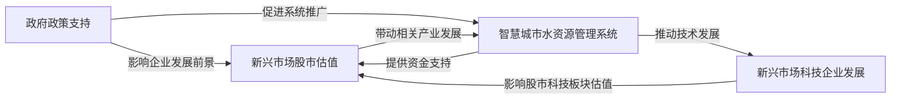

# 新兴市场股市估值与智慧城市水资源管理系统的互动

> 关键词：新兴市场股市估值、智慧城市、水资源管理系统、互动关系、经济影响、技术应用、可持续发展

> 摘要：本文深入探讨了新兴市场股市估值与智慧城市水资源管理系统之间的互动关系。在新兴市场不断发展的背景下，股市估值受到多种因素影响，而智慧城市水资源管理系统作为新兴技术应用，其发展状况也对经济和金融市场产生作用。文章首先介绍相关背景知识，阐述核心概念及其联系，分析核心算法原理和具体操作步骤，运用数学模型进行详细讲解并举例说明。通过项目实战案例，展示两者互动在实际中的体现。同时探讨了实际应用场景，推荐了相关工具和资源。最后总结未来发展趋势与挑战，解答常见问题并提供扩展阅读和参考资料，旨在为相关领域的研究和实践提供全面且深入的见解。

## 1. 背景介绍 
### 1.1 目的和范围
本研究的主要目的是揭示新兴市场股市估值与智慧城市水资源管理系统之间的内在互动机制。随着新兴市场在全球经济中的地位日益重要，其股市的表现不仅反映了当地经济的发展状况，还受到各种新兴技术和产业发展的影响。智慧城市水资源管理系统作为智慧城市建设的重要组成部分，对于城市的可持续发展至关重要。通过研究两者的互动关系，有助于投资者更好地理解新兴市场股市的走势，为政府和企业在智慧城市水资源管理系统的规划和投资提供决策依据，同时也为相关领域的学术研究提供新的视角。

本研究的范围涵盖了新兴市场股市估值的主要影响因素、智慧城市水资源管理系统的技术架构和运营模式，以及两者之间的相互作用方式。研究将结合理论分析和实际案例，对不同新兴市场的情况进行比较和分析。

### 1.2 预期读者
本文的预期读者包括金融投资者、城市规划者、水资源管理专家、技术开发者以及相关领域的研究人员。对于金融投资者来说，了解新兴市场股市估值与智慧城市水资源管理系统的互动关系可以帮助他们发现潜在的投资机会，优化投资组合。城市规划者和水资源管理专家可以从本文中获取关于智慧城市水资源管理系统对经济和金融市场影响的信息，以便更好地制定城市发展战略和水资源管理政策。技术开发者可以了解市场需求，为智慧城市水资源管理系统的研发提供方向。研究人员则可以将本文作为进一步研究的参考，拓展相关领域的学术研究。

### 1.3 文档结构概述
本文共分为十个部分。第一部分为背景介绍，阐述了研究的目的、范围、预期读者和文档结构。第二部分介绍核心概念与联系，包括新兴市场股市估值、智慧城市水资源管理系统的定义和原理，并通过文本示意图和 Mermaid 流程图展示两者的联系。第三部分分析核心算法原理和具体操作步骤，运用 Python 源代码详细阐述相关算法。第四部分使用数学模型和公式进行详细讲解，并举例说明。第五部分通过项目实战案例，介绍开发环境搭建、源代码实现和代码解读。第六部分探讨实际应用场景。第七部分推荐相关工具和资源，包括学习资源、开发工具框架和相关论文著作。第八部分总结未来发展趋势与挑战。第九部分为附录，解答常见问题。第十部分提供扩展阅读和参考资料。

### 1.4 术语表
#### 1.4.1 核心术语定义
- **新兴市场股市估值**：指对新兴市场中上市公司股票价值的评估，通常基于公司的财务状况、盈利能力、市场前景等因素，采用多种估值方法（如市盈率法、市净率法等）来确定股票的合理价格。
- **智慧城市水资源管理系统**：利用物联网、大数据、人工智能等先进技术，对城市水资源的供应、使用、排放等环节进行实时监测、分析和管理的智能化系统，旨在提高水资源利用效率，保障城市水资源的可持续供应。
- **互动关系**：指新兴市场股市估值与智慧城市水资源管理系统之间相互影响、相互作用的关系，包括经济层面、技术层面和政策层面的互动。

#### 1.4.2 相关概念解释
- **新兴市场**：指那些经济发展速度较快、市场潜力较大但金融市场相对不够成熟的国家和地区的市场。新兴市场通常具有较高的经济增长率和投资回报率，但也伴随着较高的风险。
- **智慧城市**：运用信息和通信技术手段感测、分析、整合城市运行核心系统的各项关键信息，从而对包括民生、环保、公共安全、城市服务、工商业活动在内的各种需求做出智能响应的城市发展模式。
- **水资源管理**：对水资源的开发、利用、保护和调配等活动进行的计划、组织、协调和控制，以实现水资源的合理利用和可持续发展。

#### 1.4.3 缩略词列表
- **IoT**：Internet of Things，物联网
- **AI**：Artificial Intelligence，人工智能
- **GIS**：Geographic Information System，地理信息系统
- **PE**：Price - Earnings Ratio，市盈率
- **PB**：Price - to - Book Ratio，市净率

## 2. 核心概念与联系 

### 新兴市场股市估值的原理
新兴市场股市估值是一个复杂的过程，受到多种因素的影响。从基本面来看，公司的盈利能力是决定股票价值的关键因素之一。投资者通常会关注公司的净利润、营业收入等指标，通过计算市盈率（$PE=\frac{股价}{每股收益}$）和市净率（$PB=\frac{股价}{每股净资产}$）等估值指标来评估股票的相对价值。此外，宏观经济环境、行业发展趋势、政策法规等因素也会对股市估值产生重要影响。在新兴市场中，由于经济发展速度较快，行业的发展前景和政策的支持力度对股市估值的影响更为显著。

### 智慧城市水资源管理系统的架构
智慧城市水资源管理系统主要由数据采集层、传输层、处理层和应用层组成。数据采集层通过各种传感器（如水位传感器、流量传感器、水质传感器等）实时采集水资源的相关数据。传输层利用物联网技术将采集到的数据传输到数据中心。处理层运用大数据和人工智能技术对数据进行分析和处理，挖掘数据背后的规律和趋势。应用层则根据处理结果提供各种应用服务，如水资源调度、用水预警、水质监测等。

### 两者的联系
新兴市场股市估值与智慧城市水资源管理系统之间存在着密切的联系。从经济层面来看，智慧城市水资源管理系统的发展可以带动相关产业的发展，如传感器制造、软件开发、系统集成等，这些产业的发展会提高相关上市公司的盈利能力，从而提升股市估值。同时，股市的繁荣也可以为智慧城市水资源管理系统的研发和推广提供资金支持，促进其技术创新和应用普及。

从技术层面来看，智慧城市水资源管理系统的发展需要大量的先进技术支持，如物联网、大数据、人工智能等。这些技术的应用和发展会推动相关科技企业的发展，进而影响股市中科技板块的估值。反之，股市的资金流向也会影响这些技术的研发和应用速度，从而影响智慧城市水资源管理系统的发展进程。

从政策层面来看，政府对智慧城市建设和水资源管理的政策支持会影响相关企业的发展前景和股市估值。例如，政府出台的鼓励水资源节约和循环利用的政策会促进智慧城市水资源管理系统的推广应用，提高相关企业的市场竞争力，从而提升其股市估值。

### 文本示意图
```plaintext
新兴市场股市估值
    |
    | 经济层面影响
    |
智慧城市水资源管理系统
    |
    | 技术层面影响
    |
新兴市场科技企业发展
    |
    | 政策层面影响
    |
政府政策支持
```

### Mermaid 流程图


## 3. 核心算法原理 & 具体操作步骤 

### 新兴市场股市估值算法
在新兴市场股市估值中，常用的算法之一是基于市盈率的估值方法。以下是一个简单的 Python 代码示例，用于计算股票的合理价格：

```python
def pe_valuation(earnings_per_share, industry_pe):
    """
    基于市盈率的股票估值方法
    :param earnings_per_share: 每股收益
    :param industry_pe: 行业平均市盈率
    :return: 股票的合理价格
    """
    return earnings_per_share * industry_pe

# 示例数据
earnings_per_share = 2.5
industry_pe = 15

# 计算股票合理价格
fair_price = pe_valuation(earnings_per_share, industry_pe)
print(f"股票的合理价格为: {fair_price}")
```

在上述代码中，`pe_valuation` 函数接受每股收益和行业平均市盈率作为输入，通过将两者相乘得到股票的合理价格。

### 智慧城市水资源管理系统数据分析算法
在智慧城市水资源管理系统中，数据分析是关键环节之一。以下是一个简单的 Python 代码示例，用于对水位数据进行异常检测：

```python
import numpy as np

def detect_water_level_anomaly(water_levels, threshold):
    """
    水位数据异常检测
    :param water_levels: 水位数据列表
    :param threshold: 异常阈值
    :return: 异常数据的索引列表
    """
    mean_level = np.mean(water_levels)
    std_level = np.std(water_levels)
    anomalies = []
    for i, level in enumerate(water_levels):
        if abs(level - mean_level) > threshold * std_level:
            anomalies.append(i)
    return anomalies

# 示例数据
water_levels = [1.2, 1.3, 1.5, 2.0, 1.1, 1.4, 3.0]
threshold = 2

# 检测异常数据
anomaly_indices = detect_water_level_anomaly(water_levels, threshold)
print(f"异常数据的索引为: {anomaly_indices}")
```

在上述代码中，`detect_water_level_anomaly` 函数接受水位数据列表和异常阈值作为输入，通过计算水位数据的均值和标准差，判断每个数据点是否超过阈值范围，将超过阈值的数据点的索引添加到异常列表中。

### 具体操作步骤
#### 新兴市场股市估值操作步骤
1. 收集上市公司的财务数据，包括每股收益、净资产等。
2. 确定行业平均市盈率或其他估值指标的参考值。
3. 运用估值算法计算股票的合理价格。
4. 结合市场情况和其他因素，对计算结果进行调整和分析。

#### 智慧城市水资源管理系统操作步骤
1. 安装和部署各种传感器，实时采集水资源相关数据。
2. 通过物联网技术将采集到的数据传输到数据中心。
3. 运用数据分析算法对数据进行处理和分析，如异常检测、趋势预测等。
4. 根据分析结果提供相应的应用服务，如水资源调度、用水预警等。

## 4. 数学模型和公式 & 详细讲解 & 举例说明 

### 新兴市场股市估值数学模型
#### 市盈率模型
市盈率（PE）是最常用的股市估值指标之一，其计算公式为：
$$PE = \frac{P}{EPS}$$
其中，$P$ 为股票价格，$EPS$ 为每股收益。通过变形可得股票价格的计算公式：
$$P = PE \times EPS$$

例如，某新兴市场上市公司的每股收益为 $3$ 元，行业平均市盈率为 $12$，则该股票的合理价格为：
$$P = 12 \times 3 = 36\text{（元）}$$

#### 股息贴现模型
股息贴现模型（DDM）是另一种常用的股市估值模型，其基本思想是将股票的价值视为未来股息的现值之和。对于固定增长的股息贴现模型，其计算公式为：
$$V = \frac{D_1}{r - g}$$
其中，$V$ 为股票价值，$D_1$ 为下一期预计股息，$r$ 为必要收益率，$g$ 为股息增长率。

例如，某新兴市场上市公司预计下一期股息为 $2$ 元，必要收益率为 $10\%$，股息增长率为 $5\%$，则该股票的价值为：
$$V = \frac{2}{0.1 - 0.05} = 40\text{（元）}$$

### 智慧城市水资源管理系统数学模型
#### 水资源供需平衡模型
水资源供需平衡模型用于描述城市水资源的供应和需求关系，其基本公式为：
$$S = I - O + R$$
其中，$S$ 为水资源的储存量变化，$I$ 为水资源的输入量（如降雨量、外来调水量等），$O$ 为水资源的输出量（如用水量、排水量等），$R$ 为水资源的再生量（如污水处理后的回用量等）。

例如，某城市在某一时间段内的降雨量为 $100$ 万立方米，外来调水量为 $50$ 万立方米，用水量为 $80$ 万立方米，排水量为 $30$ 万立方米，污水处理后的回用量为 $20$ 万立方米，则该城市水资源的储存量变化为：
$$S = (100 + 50) - (80 + 30) + 20 = 60\text{（万立方米）}$$

#### 水质预测模型
水质预测模型用于预测水体的水质变化情况，常用的模型之一是一阶线性回归模型：
$$y_t = \beta_0 + \beta_1 x_{t - 1} + \epsilon_t$$
其中，$y_t$ 为 $t$ 时刻的水质指标值，$x_{t - 1}$ 为 $t - 1$ 时刻的相关影响因素值（如污染物排放量、水温等），$\beta_0$ 和 $\beta_1$ 为回归系数，$\epsilon_t$ 为随机误差项。

例如，通过对某河流的水质数据进行分析，得到回归系数 $\beta_0 = 0.5$，$\beta_1 = 0.8$，上一时刻的污染物排放量为 $10$ 吨，则预测当前时刻的水质指标值为：
$$y_t = 0.5 + 0.8 \times 10 = 8.5$$

## 5. 项目实战：代码实际案例和详细解释说明 

### 5.1  开发环境搭建
#### 新兴市场股市估值项目
- **操作系统**：Windows 10 或 Linux（如 Ubuntu）
- **编程语言**：Python 3.7 及以上
- **开发工具**：PyCharm 或 Jupyter Notebook
- **相关库**：`pandas`、`numpy`、`matplotlib`

#### 智慧城市水资源管理系统项目
- **操作系统**：Linux（如 CentOS）
- **编程语言**：Python 3.7 及以上
- **开发工具**：Visual Studio Code
- **相关库**：`pandas`、`numpy`、`scikit - learn`、`tensorflow`
- **数据库**：MySQL 或 PostgreSQL
- **物联网平台**：阿里云 IoT 平台或腾讯云 IoT 平台

### 5.2  源代码详细实现和代码解读
#### 新兴市场股市估值项目
以下是一个完整的新兴市场股市估值项目代码示例，用于分析多只股票的估值情况：

```python
import pandas as pd
import numpy as np
import matplotlib.pyplot as plt

# 模拟股票数据
data = {
    'stock_name': ['Stock A', 'Stock B', 'Stock C'],
    'earnings_per_share': [2.0, 3.0, 1.5],
    'industry_pe': [12, 15, 10]
}

df = pd.DataFrame(data)

# 计算股票合理价格
df['fair_price'] = df['earnings_per_share'] * df['industry_pe']

# 可视化结果
plt.bar(df['stock_name'], df['fair_price'])
plt.xlabel('Stock Name')
plt.ylabel('Fair Price')
plt.title('Stock Valuation in Emerging Markets')
plt.show()

print(df)
```

代码解读：
1. 导入所需的库，包括 `pandas`、`numpy` 和 `matplotlib`。
2. 模拟股票数据，创建一个包含股票名称、每股收益和行业平均市盈率的 DataFrame。
3. 运用市盈率模型计算每只股票的合理价格，并将结果添加到 DataFrame 中。
4. 使用 `matplotlib` 库绘制柱状图，可视化股票的合理价格。
5. 打印包含股票估值信息的 DataFrame。

#### 智慧城市水资源管理系统项目
以下是一个简单的智慧城市水资源管理系统项目代码示例，用于对水质数据进行分类：

```python
import pandas as pd
from sklearn.model_selection import train_test_split
from sklearn.tree import DecisionTreeClassifier
from sklearn.metrics import accuracy_score

# 加载水质数据
data = pd.read_csv('water_quality.csv')

# 分离特征和标签
X = data.drop('quality_label', axis=1)
y = data['quality_label']

# 划分训练集和测试集
X_train, X_test, y_train, y_test = train_test_split(X, y, test_size=0.2, random_state=42)

# 创建决策树分类器
clf = DecisionTreeClassifier()

# 训练模型
clf.fit(X_train, y_train)

# 预测测试集
y_pred = clf.predict(X_test)

# 计算准确率
accuracy = accuracy_score(y_test, y_pred)
print(f"模型准确率: {accuracy}")
```

代码解读：
1. 导入所需的库，包括 `pandas`、`sklearn` 中的相关模块。
2. 加载水质数据，假设数据文件名为 `water_quality.csv`。
3. 分离特征和标签，将除 `quality_label` 列以外的所有列作为特征，`quality_label` 列作为标签。
4. 使用 `train_test_split` 函数将数据集划分为训练集和测试集，测试集占比为 $20\%$。
5. 创建决策树分类器，并使用训练集进行训练。
6. 使用训练好的模型对测试集进行预测，并计算预测准确率。

### 5.3  代码解读与分析
#### 新兴市场股市估值项目分析
通过上述代码，我们可以清晰地看到如何使用 Python 进行新兴市场股市估值。代码的核心在于运用市盈率模型计算股票的合理价格，并通过可视化工具直观地展示结果。这种方法简单易懂，但也存在一定的局限性，如市盈率的选择可能受到市场情绪和行业波动的影响。在实际应用中，还需要结合其他估值方法和因素进行综合分析。

#### 智慧城市水资源管理系统项目分析
该代码展示了如何使用机器学习算法对水质数据进行分类。决策树分类器是一种常用的分类算法，具有简单易懂、可解释性强的特点。通过对水质数据的训练和预测，我们可以评估模型的准确率，从而判断模型的性能。在实际应用中，还可以尝试使用其他机器学习算法（如神经网络、支持向量机等）来提高模型的性能，同时需要注意数据的质量和特征工程的优化。

## 6. 实际应用场景 

### 金融投资领域
在金融投资领域，新兴市场股市估值与智慧城市水资源管理系统的互动关系为投资者提供了新的投资机会。投资者可以关注与智慧城市水资源管理系统相关的上市公司，如传感器制造商、软件开发商和系统集成商等。随着智慧城市水资源管理系统的发展，这些公司的业绩有望得到提升，从而推动其股价上涨。同时，投资者也可以通过分析新兴市场股市的整体估值情况，判断市场的投资价值，合理配置资产。

### 城市规划与管理领域
在城市规划与管理领域，智慧城市水资源管理系统的建设和发展需要大量的资金投入。通过与新兴市场股市的互动，城市政府可以吸引更多的社会资本参与到水资源管理项目中。例如，政府可以通过发行专项债券或引导企业上市融资等方式，为智慧城市水资源管理系统的建设提供资金支持。同时，股市的反馈也可以为城市规划者提供决策依据，帮助他们优化水资源管理策略，提高城市的可持续发展能力。

### 水资源管理企业领域
对于水资源管理企业来说，了解新兴市场股市估值与智慧城市水资源管理系统的互动关系可以帮助他们制定合理的发展战略。企业可以通过提升自身的技术水平和市场竞争力，提高在股市中的估值，从而获得更多的融资机会。同时，企业也可以利用股市的资金进行技术研发和市场拓展，推动智慧城市水资源管理系统的创新和应用。

### 科研与教育领域
在科研与教育领域，新兴市场股市估值与智慧城市水资源管理系统的互动关系为学术研究提供了新的课题。研究人员可以深入探讨两者之间的内在机制，建立更加完善的理论模型。同时，相关的研究成果也可以应用到教学中，培养学生的跨学科思维和实践能力。

## 7. 工具和资源推荐
### 7.1 学习资源推荐
#### 7.1.1 书籍推荐
- 《新兴市场投资指南》：本书详细介绍了新兴市场的投资环境、风险和机会，对于了解新兴市场股市估值具有重要的参考价值。
- 《智慧城市：技术与应用》：全面介绍了智慧城市的相关技术和应用案例，包括智慧城市水资源管理系统的技术架构和运营模式。
- 《机器学习实战》：通过实际案例介绍了机器学习的基本算法和应用，对于学习智慧城市水资源管理系统中的数据分析算法非常有帮助。

#### 7.1.2 在线课程
- Coursera 上的“新兴市场金融”课程：由知名教授授课，系统介绍了新兴市场的金融体系和投资策略。
- edX 上的“智慧城市技术与应用”课程：涵盖了智慧城市的各个方面，包括水资源管理系统的相关知识。
- 网易云课堂上的“Python 机器学习实战”课程：通过实际项目讲解 Python 在机器学习中的应用，适合初学者学习。

#### 7.1.3 技术博客和网站
- 金融界网站：提供新兴市场股市的实时行情、分析报告和投资建议。
- 智慧城市网：专注于智慧城市的技术动态、应用案例和政策法规。
- 机器学习算法社区：分享机器学习的最新研究成果和实践经验。

### 7.2 开发工具框架推荐
#### 7.2.1 IDE和编辑器
- PyCharm：一款功能强大的 Python 集成开发环境，提供代码编辑、调试、版本控制等功能。
- Visual Studio Code：轻量级的代码编辑器，支持多种编程语言和插件扩展，适合快速开发。
- Jupyter Notebook：交互式的编程环境，适合数据分析和模型验证。

#### 7.2.2 调试和性能分析工具
- Py-Spy：用于分析 Python 程序的性能瓶颈，找出耗时较长的代码段。
- TensorBoard：TensorFlow 提供的可视化工具，用于监控模型的训练过程和性能指标。
- Profiler：Python 内置的性能分析工具，可用于分析程序的时间和内存使用情况。

#### 7.2.3 相关框架和库
- Pandas：用于数据处理和分析的 Python 库，提供高效的数据结构和数据分析工具。
- NumPy：Python 的科学计算基础库，提供多维数组和数学函数。
- Scikit-learn：机器学习库，提供多种机器学习算法和工具，如分类、回归、聚类等。
- TensorFlow：开源的深度学习框架，用于构建和训练神经网络模型。

### 7.3 相关论文著作推荐
#### 7.3.1 经典论文
- "Emerging Markets and Global Financial Integration"：探讨了新兴市场与全球金融市场的融合问题，对理解新兴市场股市估值的影响因素具有重要意义。
- "Smart City Water Management Systems: A Review"：对智慧城市水资源管理系统的技术和应用进行了全面综述，为相关研究提供了理论基础。
- "Machine Learning for Water Quality Prediction"：介绍了机器学习在水质预测中的应用，为智慧城市水资源管理系统中的数据分析提供了参考。

#### 7.3.2 最新研究成果
- 近年来，关于新兴市场股市估值和智慧城市水资源管理系统的研究不断涌现。可以通过学术数据库（如 IEEE Xplore、ACM Digital Library 等）搜索最新的研究论文，了解该领域的前沿动态。

#### 7.3.3 应用案例分析
- 一些国际组织（如世界银行、联合国教科文组织等）和企业发布的报告中包含了智慧城市水资源管理系统的应用案例分析。这些案例可以帮助我们了解实际项目中的经验和教训，为实际应用提供参考。

## 8. 总结：未来发展趋势与挑战
### 未来发展趋势
#### 技术融合趋势
未来，新兴市场股市估值与智慧城市水资源管理系统将更加紧密地结合，随着物联网、大数据、人工智能等技术的不断发展，两者之间的互动将更加频繁和深入。例如，通过实时监测水资源管理系统的数据，可以更准确地评估相关企业的业绩和发展前景，从而影响股市估值。同时，股市的资金也将更多地流向与智慧城市水资源管理系统相关的技术研发和创新领域，推动技术的不断进步。

#### 可持续发展趋势
在全球可持续发展的背景下，智慧城市水资源管理系统的重要性将日益凸显。新兴市场国家将更加注重水资源的合理利用和保护，加大对智慧城市水资源管理系统的投入。这将为相关企业带来更多的发展机会，也将对新兴市场股市的结构和估值产生影响。例如，环保、节能型企业的估值可能会得到提升。

#### 国际化趋势
随着全球经济一体化的发展，新兴市场股市与国际金融市场的联系将更加紧密。智慧城市水资源管理系统也将面临国际化的竞争和合作。新兴市场国家可以借鉴国际先进经验，引进国外的技术和资金，推动本国智慧城市水资源管理系统的发展。同时，相关企业也可以通过国际市场融资，提高自身的竞争力。

### 挑战
#### 技术挑战
虽然物联网、大数据、人工智能等技术为智慧城市水资源管理系统的发展提供了有力支持，但这些技术的应用也面临着一些挑战。例如，数据安全和隐私保护问题，如何确保水资源管理系统中大量敏感数据的安全是一个亟待解决的问题。此外，技术的复杂性和成本也是制约其推广应用的因素之一。

#### 政策挑战
新兴市场国家的政策环境相对不稳定，政策的变化可能会对股市估值和智慧城市水资源管理系统的发展产生影响。例如，政府对水资源管理的政策调整可能会影响相关企业的业绩和市场预期，从而导致股市波动。此外，不同地区的政策差异也会给企业的跨区域发展带来困难。

#### 市场挑战
新兴市场股市的波动性较大，投资者的风险偏好和市场情绪对股市估值的影响较为显著。在智慧城市水资源管理系统市场中，也存在着市场竞争激烈、技术标准不统一等问题。企业需要不断提高自身的核心竞争力，适应市场的变化。

## 9. 附录：常见问题与解答
### 新兴市场股市估值的准确性如何保证？
新兴市场股市估值受到多种因素的影响，其准确性难以完全保证。为了提高估值的准确性，可以采用多种估值方法进行综合分析，如市盈率法、市净率法、股息贴现模型等。同时，要充分考虑宏观经济环境、行业发展趋势、政策法规等因素的影响，对估值结果进行合理调整。此外，及时获取和分析上市公司的财务数据和相关信息，也有助于提高估值的准确性。

### 智慧城市水资源管理系统的建设成本高吗？
智慧城市水资源管理系统的建设成本因系统的规模、功能和技术水平而异。一般来说，建设一个完整的智慧城市水资源管理系统需要投入大量的资金，包括传感器设备的采购、数据传输网络的搭建、数据分析平台的开发等。然而，从长远来看，智慧城市水资源管理系统可以提高水资源利用效率，减少水资源浪费和污染，降低城市的运营成本，具有显著的经济效益和社会效益。

### 新兴市场股市估值与智慧城市水资源管理系统的互动关系会一直存在吗？
新兴市场股市估值与智慧城市水资源管理系统的互动关系是由经济、技术和政策等多种因素共同作用的结果。随着社会的发展和技术的进步，两者之间的互动关系可能会发生变化，但从总体趋势来看，这种互动关系将长期存在。随着新兴市场的不断发展和智慧城市建设的深入推进，两者之间的联系将更加紧密，互动将更加频繁。

### 如何判断智慧城市水资源管理系统相关企业的投资价值？
判断智慧城市水资源管理系统相关企业的投资价值需要综合考虑多个因素。首先，要关注企业的技术实力和创新能力，包括是否掌握核心技术、是否有持续的研发投入等。其次，要考察企业的市场竞争力，如市场份额、客户资源、品牌影响力等。此外，企业的财务状况、管理团队的能力和经验等也是重要的考量因素。还可以结合新兴市场股市的整体估值情况和行业发展趋势，对企业的投资价值进行评估。

## 10. 扩展阅读 & 参考资料
### 扩展阅读
- 《金融市场学》：深入学习金融市场的基本原理和运行机制，有助于更好地理解新兴市场股市估值。
- 《物联网技术与应用》：详细介绍物联网的技术架构和应用场景，对智慧城市水资源管理系统的技术实现有更深入的了解。
- 《人工智能：现代方法》：全面介绍人工智能的基本概念、算法和应用，为智慧城市水资源管理系统中的数据分析和决策提供理论支持。

### 参考资料
- 国际货币基金组织（IMF）发布的《世界经济展望》报告，提供了新兴市场国家的经济数据和分析。
- 世界银行发布的《智慧城市发展报告》，包含了智慧城市建设的相关案例和经验。
- 相关学术期刊，如《金融研究》、《水利学报》、《计算机学报》等，发表了大量关于新兴市场股市估值和智慧城市水资源管理系统的研究论文。

作者：AI天才研究院/AI Genius Institute & 禅与计算机程序设计艺术 /Zen And The Art of Computer Programming