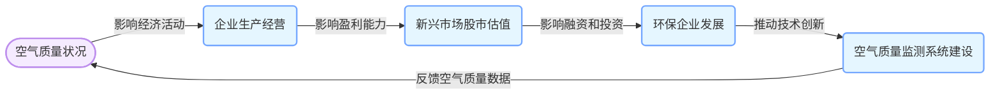

# 新兴市场股市估值与智慧城市空气质量监测系统的互动

> 关键词：新兴市场股市估值、智慧城市、空气质量监测系统、互动关系、金融与环境数据关联

> 摘要：本文深入探讨新兴市场股市估值与智慧城市空气质量监测系统之间的互动关系。通过对相关核心概念的介绍，阐述两者的联系架构。详细讲解涉及的核心算法原理，并给出Python代码示例。运用数学模型和公式进一步分析两者互动的内在逻辑，并举例说明。通过项目实战展示如何结合两者数据进行分析，探讨实际应用场景。同时推荐学习资源、开发工具框架及相关论文著作。最后总结未来发展趋势与挑战，解答常见问题，并提供扩展阅读和参考资料，旨在为理解金融市场与环境监测领域的跨界互动提供全面的视角。

## 1. 背景介绍 
### 1.1 目的和范围
本研究的目的在于揭示新兴市场股市估值与智慧城市空气质量监测系统之间的潜在互动关系。随着全球经济的发展，新兴市场在国际金融领域的地位日益重要，其股市估值受到多种因素的影响。与此同时，智慧城市建设方兴未艾，空气质量监测系统作为其中的重要组成部分，不仅反映了城市环境质量，还可能与经济活动存在关联。本研究将范围界定在新兴市场的股市估值数据以及智慧城市的空气质量监测数据，旨在分析两者之间是否存在相互影响以及影响的方式和程度。

### 1.2 预期读者
本文预期读者包括金融分析师、环境科学家、智慧城市建设者、计算机科学家以及对金融与环境领域交叉研究感兴趣的学者和从业者。金融分析师可以从环境数据的角度寻找影响股市估值的新因素；环境科学家可以了解经济活动对空气质量的反馈；智慧城市建设者可以考虑金融因素对环境监测系统建设的影响；计算机科学家可以关注如何处理和分析跨领域的数据；而学者和从业者则可以从跨学科的视角拓展研究思路。

### 1.3 文档结构概述
本文首先介绍相关的核心概念，阐述新兴市场股市估值和智慧城市空气质量监测系统的定义、特点以及两者之间的联系架构。接着详细讲解分析两者互动关系所涉及的核心算法原理，并给出具体的Python代码实现步骤。然后运用数学模型和公式对两者的互动关系进行量化分析，并举例说明。通过项目实战，展示如何搭建开发环境，实现相关代码并进行解读和分析。之后探讨两者互动关系在实际中的应用场景。同时推荐学习所需的资源、开发工具框架以及相关的论文著作。最后总结未来发展趋势与挑战，解答常见问题，并提供扩展阅读和参考资料。

### 1.4 术语表
#### 1.4.1 核心术语定义
- **新兴市场股市估值**：指对新兴市场中上市公司股票价值的评估，通常通过各种估值方法，如市盈率、市净率等，来衡量股票的相对价值。新兴市场一般是指经济发展较快、市场潜力较大但金融市场相对不够成熟的国家和地区的股票市场。
- **智慧城市空气质量监测系统**：是利用传感器技术、通信技术和数据分析技术，对城市空气质量进行实时监测、数据采集、传输和分析的系统。该系统可以提供城市不同区域的空气质量指标，如PM2.5、PM10、二氧化硫、氮氧化物等污染物的浓度信息。

#### 1.4.2 相关概念解释
- **新兴市场**：是一个相对概念，通常指那些在经济、金融等方面具有较高增长潜力，但在市场制度、监管体系等方面还不够完善的国家和地区的市场。新兴市场的经济发展往往伴随着快速的工业化和城市化进程。
- **智慧城市**：是运用物联网、云计算、大数据、空间地理信息集成等新一代信息技术，促进城市规划、建设、管理和服务智慧化的新理念和新模式。智慧城市建设旨在提高城市的运行效率、改善居民生活质量、实现可持续发展。

#### 1.4.3 缩略词列表
- **PM2.5**：细颗粒物，指环境空气中空气动力学当量直径小于等于 2.5 微米的颗粒物。
- **PM10**：可吸入颗粒物，指环境空气中空气动力学当量直径小于等于 10 微米的颗粒物。
- **SO₂**：二氧化硫，一种常见的大气污染物，主要来源于含硫燃料的燃烧。
- **NOₓ**：氮氧化物，包括一氧化氮（NO）和二氧化氮（NO₂）等，主要来源于汽车尾气、工业废气等。

## 2. 核心概念与联系 

### 核心概念原理
#### 新兴市场股市估值原理
新兴市场股市估值是基于对上市公司未来盈利能力、资产价值和市场预期等因素的综合评估。常见的估值方法包括市盈率（P/E）法、市净率（P/B）法、现金流折现（DCF）法等。市盈率是指股票价格与每股收益的比率，反映了市场对公司盈利的预期；市净率是指股票价格与每股净资产的比率，反映了市场对公司资产价值的评估；现金流折现法是通过预测公司未来的现金流，并将其折现到当前时点来计算公司的内在价值。

#### 智慧城市空气质量监测系统原理
智慧城市空气质量监测系统主要由传感器层、传输层和应用层组成。传感器层负责实时采集空气质量数据，如各种污染物的浓度、温度、湿度等；传输层将采集到的数据通过有线或无线通信网络传输到数据中心；应用层对数据进行处理、分析和展示，为城市管理者、居民和相关企业提供空气质量信息和决策支持。

### 架构的文本示意图
新兴市场股市估值与智慧城市空气质量监测系统之间的联系可以通过以下架构来描述：

首先，空气质量状况可能会影响新兴市场的经济活动。恶劣的空气质量可能导致居民健康问题增加，劳动生产率下降，从而影响企业的生产经营和盈利能力，进而对股市估值产生负面影响。例如，在空气污染严重的地区，一些依赖户外作业的行业，如建筑、旅游等，可能会受到较大影响。

其次，新兴市场的经济发展和股市表现也可能对空气质量监测系统产生影响。经济的快速发展可能会导致能源消耗增加，污染物排放增多，从而对空气质量造成压力，促使政府和企业加大对空气质量监测系统的投入和建设。同时，股市的繁荣也可能为相关环保企业提供更多的融资机会，推动空气质量监测技术的创新和发展。

### Mermaid 流程图


## 3. 核心算法原理 & 具体操作步骤 

### 算法原理
为了分析新兴市场股市估值与智慧城市空气质量监测系统之间的互动关系，我们可以采用时间序列分析方法。时间序列分析是一种基于历史数据预测未来趋势的统计方法，它可以揭示数据随时间变化的规律和模式。具体来说，我们可以使用自回归积分滑动平均模型（ARIMA）来分别对股市估值数据和空气质量数据进行建模和预测，然后通过格兰杰因果检验来判断两者之间是否存在因果关系。

### Python 代码实现步骤
```python
import pandas as pd
import numpy as np
import matplotlib.pyplot as plt
from statsmodels.tsa.arima.model import ARIMA
from statsmodels.tsa.stattools import grangercausalitytests

# 步骤 1: 数据加载和预处理
# 假设我们有两个 CSV 文件，分别存储股市估值数据和空气质量数据
stock_data = pd.read_csv('stock_valuation.csv', index_col='date', parse_dates=True)
air_quality_data = pd.read_csv('air_quality.csv', index_col='date', parse_dates=True)

# 步骤 2: 数据可视化
plt.figure(figsize=(12, 6))
plt.subplot(2, 1, 1)
plt.plot(stock_data)
plt.title('新兴市场股市估值')
plt.subplot(2, 1, 2)
plt.plot(air_quality_data)
plt.title('智慧城市空气质量')
plt.show()

# 步骤 3: 数据平稳性检验和差分处理
def test_stationarity(timeseries):
    # 进行 ADF 检验
    from statsmodels.tsa.stattools import adfuller
    result = adfuller(timeseries)
    print('ADF Statistic: {}'.format(result[0]))
    print('p-value: {}'.format(result[1]))
    print('Critical Values:')
    for key, value in result[4].items():
        print('\t{}: {}'.format(key, value))
    if result[1] <= 0.05:
        print("数据平稳")
    else:
        print("数据不平稳，需要差分处理")

test_stationarity(stock_data['valuation'])
test_stationarity(air_quality_data['pm25'])

# 差分处理
stock_diff = stock_data['valuation'].diff().dropna()
air_quality_diff = air_quality_data['pm25'].diff().dropna()

# 步骤 4: ARIMA 模型拟合和预测
# 确定 ARIMA 模型的参数 (p, d, q)
# 这里简单假设 p=1, d=1, q=1
p, d, q = 1, 1, 1

stock_model = ARIMA(stock_data['valuation'], order=(p, d, q))
stock_model_fit = stock_model.fit()
stock_forecast = stock_model_fit.get_forecast(steps=10)

air_quality_model = ARIMA(air_quality_data['pm25'], order=(p, d, q))
air_quality_model_fit = air_quality_model.fit()
air_quality_forecast = air_quality_model_fit.get_forecast(steps=10)

# 步骤 5: 格兰杰因果检验
# 合并数据
combined_data = pd.concat([stock_data['valuation'], air_quality_data['pm25']], axis=1)
combined_data.columns = ['stock_valuation', 'air_quality']

# 进行格兰杰因果检验
granger_test = grangercausalitytests(combined_data, maxlag=2)
```

### 代码解释
1. **数据加载和预处理**：使用 `pandas` 库读取存储股市估值数据和空气质量数据的 CSV 文件，并将日期列设置为索引。
2. **数据可视化**：使用 `matplotlib` 库绘制股市估值和空气质量数据的时间序列图，以便直观观察数据的变化趋势。
3. **数据平稳性检验和差分处理**：使用 `statsmodels` 库中的 `adfuller` 函数进行 ADF 检验，判断数据是否平稳。如果数据不平稳，则进行差分处理，使数据变得平稳。
4. **ARIMA 模型拟合和预测**：使用 `statsmodels` 库中的 `ARIMA` 类拟合 ARIMA 模型，并进行未来 10 步的预测。
5. **格兰杰因果检验**：使用 `statsmodels` 库中的 `grangercausalitytests` 函数进行格兰杰因果检验，判断股市估值和空气质量数据之间是否存在因果关系。

## 4. 数学模型和公式 & 详细讲解 & 举例说明 

### ARIMA 模型数学公式
自回归积分滑动平均模型（ARIMA）是一种常用的时间序列预测模型，其数学公式可以表示为：

$$
(1 - \sum_{i=1}^{p} \phi_i B^i)(1 - B)^d Y_t = (1 + \sum_{j=1}^{q} \theta_j B^j) \epsilon_t
$$

其中：
- $Y_t$ 是时间序列在时刻 $t$ 的值；
- $B$ 是后移算子，即 $B Y_t = Y_{t-1}$；
- $p$ 是自回归阶数，表示使用过去 $p$ 个时刻的值来预测当前值；
- $d$ 是差分阶数，表示对时间序列进行 $d$ 次差分处理以使其平稳；
- $q$ 是滑动平均阶数，表示使用过去 $q$ 个时刻的误差项来修正预测值；
- $\phi_i$ 是自回归系数；
- $\theta_j$ 是滑动平均系数；
- $\epsilon_t$ 是白噪声序列。

### 详细讲解
ARIMA 模型的核心思想是将时间序列的变化分解为自回归部分、差分部分和滑动平均部分。自回归部分表示当前值与过去值之间的线性关系；差分部分用于消除时间序列的非平稳性；滑动平均部分表示当前值与过去误差项之间的线性关系。

### 举例说明
假设我们有一个时间序列 $Y_t$，其 ARIMA 模型的参数为 $p = 1$，$d = 1$，$q = 1$。则模型的具体形式为：

$$
(1 - \phi_1 B)(1 - B) Y_t = (1 + \theta_1 B) \epsilon_t
$$

展开可得：

$$
Y_t - Y_{t-1} - \phi_1 (Y_{t-1} - Y_{t-2}) = \epsilon_t + \theta_1 \epsilon_{t-1}
$$

即：

$$
Y_t = (1 + \phi_1) Y_{t-1} - \phi_1 Y_{t-2} + \epsilon_t + \theta_1 \epsilon_{t-1}
$$

假设 $\phi_1 = 0.5$，$\theta_1 = 0.3$，$Y_{t-1} = 10$，$Y_{t-2} = 9$，$\epsilon_t = 0.1$，$\epsilon_{t-1} = 0.2$，则可以计算出 $Y_t$ 的值为：

$$
Y_t = (1 + 0.5) \times 10 - 0.5 \times 9 + 0.1 + 0.3 \times 0.2 = 15 - 4.5 + 0.1 + 0.06 = 10.66
$$

### 格兰杰因果检验数学公式
格兰杰因果检验用于判断一个时间序列是否可以帮助预测另一个时间序列。其原假设为：一个时间序列不是另一个时间序列的格兰杰原因。

假设我们有两个时间序列 $X_t$ 和 $Y_t$，格兰杰因果检验的回归模型可以表示为：

$$
Y_t = \sum_{i=1}^{k} \alpha_i Y_{t-i} + \sum_{i=1}^{k} \beta_i X_{t-i} + \epsilon_t
$$

其中：
- $k$ 是滞后阶数；
- $\alpha_i$ 和 $\beta_i$ 是回归系数；
- $\epsilon_t$ 是误差项。

格兰杰因果检验的统计量为：

$$
F = \frac{(SSE_R - SSE_U) / k}{SSE_U / (n - 2k - 1)}
$$

其中：
- $SSE_R$ 是受约束回归模型（即不包含 $X_t$ 的滞后项）的残差平方和；
- $SSE_U$ 是无约束回归模型（即包含 $X_t$ 的滞后项）的残差平方和；
- $n$ 是样本数量。

如果 $F$ 统计量大于临界值，则拒绝原假设，认为 $X_t$ 是 $Y_t$ 的格兰杰原因。

## 5. 项目实战：代码实际案例和详细解释说明 

### 5.1  开发环境搭建
#### 操作系统
本项目可以在 Windows、Linux 或 macOS 操作系统上进行开发。建议使用较新的操作系统版本，以确保兼容性和性能。

#### Python 环境
需要安装 Python 3.6 及以上版本。可以从 Python 官方网站（https://www.python.org/downloads/）下载并安装。

#### 依赖库安装
使用 `pip` 命令安装项目所需的依赖库：
```sh
pip install pandas numpy matplotlib statsmodels
```

### 5.2  源代码详细实现和代码解读
```python
import pandas as pd
import numpy as np
import matplotlib.pyplot as plt
from statsmodels.tsa.arima.model import ARIMA
from statsmodels.tsa.stattools import grangercausalitytests

# 步骤 1: 数据加载和预处理
# 假设我们有两个 CSV 文件，分别存储股市估值数据和空气质量数据
stock_data = pd.read_csv('stock_valuation.csv', index_col='date', parse_dates=True)
air_quality_data = pd.read_csv('air_quality.csv', index_col='date', parse_dates=True)

# 代码解读：使用 pandas 的 read_csv 函数读取 CSV 文件，并将日期列设置为索引。
# parse_dates=True 表示将日期列解析为日期类型。

# 步骤 2: 数据可视化
plt.figure(figsize=(12, 6))
plt.subplot(2, 1, 1)
plt.plot(stock_data)
plt.title('新兴市场股市估值')
plt.subplot(2, 1, 2)
plt.plot(air_quality_data)
plt.title('智慧城市空气质量')
plt.show()

# 代码解读：使用 matplotlib 的 figure 函数创建一个图形对象，使用 subplot 函数将图形分为上下两个子图。
# 分别绘制股市估值和空气质量数据的时间序列图，并添加标题。最后使用 show 函数显示图形。

# 步骤 3: 数据平稳性检验和差分处理
def test_stationarity(timeseries):
    # 进行 ADF 检验
    from statsmodels.tsa.stattools import adfuller
    result = adfuller(timeseries)
    print('ADF Statistic: {}'.format(result[0]))
    print('p-value: {}'.format(result[1]))
    print('Critical Values:')
    for key, value in result[4].items():
        print('\t{}: {}'.format(key, value))
    if result[1] <= 0.05:
        print("数据平稳")
    else:
        print("数据不平稳，需要差分处理")

test_stationarity(stock_data['valuation'])
test_stationarity(air_quality_data['pm25'])

# 差分处理
stock_diff = stock_data['valuation'].diff().dropna()
air_quality_diff = air_quality_data['pm25'].diff().dropna()

# 代码解读：定义一个函数 test_stationarity 用于进行 ADF 检验，判断时间序列是否平稳。
# 如果 p 值小于等于 0.05，则认为数据平稳；否则需要进行差分处理。
# 使用 diff 函数对时间序列进行一阶差分，并使用 dropna 函数删除缺失值。

# 步骤 4: ARIMA 模型拟合和预测
# 确定 ARIMA 模型的参数 (p, d, q)
# 这里简单假设 p=1, d=1, q=1
p, d, q = 1, 1, 1

stock_model = ARIMA(stock_data['valuation'], order=(p, d, q))
stock_model_fit = stock_model.fit()
stock_forecast = stock_model_fit.get_forecast(steps=10)

air_quality_model = ARIMA(air_quality_data['pm25'], order=(p, d, q))
air_quality_model_fit = air_quality_model.fit()
air_quality_forecast = air_quality_model_fit.get_forecast(steps=10)

# 代码解读：使用 statsmodels 的 ARIMA 类创建 ARIMA 模型对象，并指定参数 (p, d, q)。
# 使用 fit 方法拟合模型，使用 get_forecast 方法进行未来 10 步的预测。

# 步骤 5: 格兰杰因果检验
# 合并数据
combined_data = pd.concat([stock_data['valuation'], air_quality_data['pm25']], axis=1)
combined_data.columns = ['stock_valuation', 'air_quality']

# 进行格兰杰因果检验
granger_test = grangercausalitytests(combined_data, maxlag=2)

# 代码解读：使用 pandas 的 concat 函数将股市估值和空气质量数据合并为一个 DataFrame。
# 使用 statsmodels 的 grangercausalitytests 函数进行格兰杰因果检验，指定最大滞后阶数为 2。
```

### 5.3  代码解读与分析
#### 数据加载和预处理
通过 `pandas` 库的 `read_csv` 函数读取 CSV 文件，并将日期列设置为索引，方便后续的时间序列分析。同时，使用 `parse_dates=True` 参数将日期列解析为日期类型，以便进行时间相关的操作。

#### 数据可视化
使用 `matplotlib` 库绘制股市估值和空气质量数据的时间序列图，直观展示数据的变化趋势。通过图形可以初步判断数据是否存在季节性、周期性等特征。

#### 数据平稳性检验和差分处理
使用 `statsmodels` 库的 `adfuller` 函数进行 ADF 检验，判断时间序列是否平稳。平稳性是时间序列分析的重要前提，非平稳数据可能会导致模型的不稳定和预测误差。如果数据不平稳，则进行差分处理，使数据变得平稳。

#### ARIMA 模型拟合和预测
使用 `statsmodels` 库的 `ARIMA` 类创建 ARIMA 模型对象，并指定参数 (p, d, q)。通过 `fit` 方法拟合模型，使用 `get_forecast` 方法进行未来 10 步的预测。在实际应用中，需要通过网格搜索等方法确定最优的 (p, d, q) 参数。

#### 格兰杰因果检验
使用 `statsmodels` 库的 `grangercausalitytests` 函数进行格兰杰因果检验，判断股市估值和空气质量数据之间是否存在因果关系。通过检验结果可以了解两者之间的相互影响方向和程度。

## 6. 实际应用场景 
### 金融投资决策
金融投资者可以将智慧城市空气质量监测数据作为新兴市场股市估值的一个参考因素。例如，当空气质量恶化时，某些行业的股票可能会受到负面影响，投资者可以提前调整投资组合，减少对这些行业股票的持仓。相反，一些环保相关的行业可能会受益于空气质量问题，投资者可以增加对这些行业股票的投资。

### 城市规划和环境管理
城市规划者可以结合新兴市场股市估值数据和空气质量监测数据，制定更加科学合理的城市发展规划。例如，如果股市表现良好，经济发展较快，可能会导致能源消耗增加和污染物排放增多，城市规划者可以提前规划建设更多的环保设施，加强环境管理，以应对可能出现的空气质量问题。

### 企业战略决策
企业可以根据新兴市场股市估值和空气质量监测数据，制定相应的战略决策。例如，对于那些依赖空气质量的行业，如旅游业、农业等，企业可以根据空气质量的变化调整生产经营策略。同时，企业也可以关注环保相关的政策和市场趋势，加大对环保技术和产品的研发投入，以适应市场的变化。

### 政策制定
政府可以根据新兴市场股市估值和空气质量监测数据，制定更加有效的经济政策和环境政策。例如，当股市过热时，政府可以采取适当的宏观调控措施，避免经济过度增长对环境造成压力。同时，政府也可以加大对环保产业的扶持力度，推动空气质量监测系统的建设和完善。

## 7. 工具和资源推荐
### 7.1 学习资源推荐
#### 7.1.1 书籍推荐
- 《时间序列分析：预测与控制》（*Time Series Analysis: Forecasting and Control*）：这本书是时间序列分析领域的经典著作，详细介绍了时间序列分析的理论和方法，包括 ARIMA 模型、季节性时间序列分析等。
- 《金融时间序列分析》（*Financial Time Series Analysis*）：该书专注于金融时间序列数据的分析方法，包括股票价格、汇率、利率等数据的建模和预测，适合金融分析师和研究者阅读。
- 《Python 数据分析实战》（*Python for Data Analysis*）：这本书介绍了如何使用 Python 进行数据分析，包括数据处理、可视化、机器学习等方面的内容，是学习 Python 数据分析的优秀教材。

#### 7.1.2 在线课程
- Coursera 上的“时间序列分析与预测”（*Time Series Analysis and Forecasting*）课程：由知名大学的教授授课，系统介绍时间序列分析的基本概念、方法和应用。
- edX 上的“金融数据分析与机器学习”（*Financial Data Analysis and Machine Learning*）课程：结合金融领域的实际案例，介绍如何使用机器学习方法进行金融数据分析和预测。
- 慕课网上的“Python 数据分析实战”课程：适合初学者学习 Python 数据分析的基本技能和方法。

#### 7.1.3 技术博客和网站
- Towards Data Science：一个专注于数据科学和机器学习的技术博客平台，上面有很多关于时间序列分析、金融数据分析等方面的优质文章。
- Kaggle：一个数据科学竞赛平台，上面有很多关于金融和环境数据的数据集和分析案例，可以从中学习到实际应用中的数据分析技巧。
- Statsmodels 官方文档：Statsmodels 是 Python 中用于统计分析的重要库，其官方文档详细介绍了各种统计模型和方法的使用。

### 7.2 开发工具框架推荐
#### 7.2.1 IDE和编辑器
- PyCharm：一款功能强大的 Python 集成开发环境，提供代码编辑、调试、版本控制等功能，适合专业的 Python 开发者使用。
- Jupyter Notebook：一个交互式的开发环境，可以在浏览器中编写和运行 Python 代码，同时可以添加文本说明和可视化图表，非常适合数据分析和探索性研究。
- Visual Studio Code：一款轻量级的代码编辑器，支持多种编程语言，通过安装 Python 扩展可以实现 Python 代码的编辑和调试。

#### 7.2.2 调试和性能分析工具
- Py-Spy：一个用于 Python 代码性能分析的工具，可以实时监控 Python 程序的 CPU 使用情况和函数调用栈，帮助开发者找出性能瓶颈。
- PDB：Python 自带的调试器，可以在代码中设置断点，逐行执行代码，查看变量的值和程序的执行流程，方便调试代码。
- Memory Profiler：一个用于 Python 代码内存分析的工具，可以帮助开发者找出内存泄漏和内存使用过高的问题。

#### 7.2.3 相关框架和库
- Pandas：一个用于数据处理和分析的 Python 库，提供了高效的数据结构和数据操作方法，如数据读取、清洗、转换等。
- Numpy：一个用于科学计算的 Python 库，提供了高效的多维数组对象和数学函数，是很多数据分析和机器学习库的基础。
- Matplotlib：一个用于数据可视化的 Python 库，可以绘制各种类型的图表，如折线图、柱状图、散点图等。
- Statsmodels：一个用于统计分析的 Python 库，提供了各种统计模型和方法，如线性回归、时间序列分析等。

### 7.3 相关论文著作推荐
#### 7.3.1 经典论文
- “The Econometrics of Financial Markets”（《金融市场计量经济学》）：该论文系统介绍了金融市场计量经济学的理论和方法，对金融时间序列分析、资产定价等方面进行了深入探讨。
- “Time Series Analysis and Its Applications: With R Examples”（《时间序列分析及其应用：R 语言实例》）：结合 R 语言实例，详细介绍了时间序列分析的各种方法和应用，是时间序列分析领域的经典论文之一。
- “Granger Causality”（《格兰杰因果关系》）：该论文是格兰杰因果检验的经典文献，详细介绍了格兰杰因果检验的原理和方法。

#### 7.3.2 最新研究成果
- 在学术数据库如 IEEE Xplore、ACM Digital Library、ScienceDirect 等上搜索关于新兴市场股市估值和智慧城市空气质量监测系统的最新研究论文。这些论文通常涉及到最新的理论、方法和应用案例。
- 关注相关领域的顶级学术会议，如 ACM SIGKDD（知识发现与数据挖掘会议）、IEEE ICDM（国际数据挖掘会议）等，会议上的论文往往代表了该领域的最新研究成果。

#### 7.3.3 应用案例分析
- 一些国际组织和机构发布的报告，如世界银行、国际货币基金组织等，可能会包含新兴市场股市估值和环境监测方面的应用案例分析。
- 企业和政府部门发布的研究报告和案例分析，这些报告通常结合实际业务场景，介绍如何应用相关技术和方法解决实际问题。

## 8. 总结：未来发展趋势与挑战
### 未来发展趋势
#### 数据融合与深度分析
随着数据采集技术的不断发展，新兴市场股市估值数据和智慧城市空气质量监测数据将更加丰富和精确。未来，将进一步加强两者的数据融合，通过深度分析挖掘更多潜在的互动关系和规律，为金融投资、城市规划等领域提供更准确的决策支持。

#### 人工智能与机器学习的应用
人工智能和机器学习技术将在该领域得到更广泛的应用。例如，使用深度学习模型对股市估值和空气质量数据进行建模和预测，提高预测的准确性和可靠性。同时，通过强化学习算法优化投资策略和环境管理方案。

#### 跨领域合作与创新
新兴市场股市估值与智慧城市空气质量监测系统的研究涉及金融、环境、计算机等多个领域，未来将加强跨领域的合作与创新。不同领域的专家将共同参与研究和实践，推动该领域的发展和应用。

### 挑战
#### 数据质量和一致性
新兴市场股市估值数据和智慧城市空气质量监测数据可能存在质量参差不齐、数据格式不一致等问题。如何保证数据的准确性、完整性和一致性，是进行有效分析的关键挑战。

#### 模型复杂性和解释性
随着分析方法的不断复杂，如深度学习模型的应用，模型的复杂性也会增加。如何在保证模型准确性的同时，提高模型的解释性，让决策者能够理解模型的输出结果，是一个重要的挑战。

#### 政策和法规的适应性
新兴市场股市估值和智慧城市空气质量监测系统的互动关系涉及到金融和环境等多个领域的政策和法规。如何制定适应这种跨领域互动的政策和法规，促进两者的良性发展，是政策制定者面临的挑战。

## 9. 附录：常见问题与解答
### 问题 1：为什么要进行数据平稳性检验？
答：时间序列分析的很多模型和方法都假设数据是平稳的。如果数据不平稳，可能会导致模型的不稳定和预测误差。通过数据平稳性检验，可以判断数据是否平稳，并采取相应的处理措施，如差分处理，使数据变得平稳，从而提高模型的准确性和可靠性。

### 问题 2：如何确定 ARIMA 模型的参数 (p, d, q)？
答：确定 ARIMA 模型的参数 (p, d, q) 通常需要结合多种方法。可以先通过观察时间序列的自相关函数（ACF）和偏自相关函数（PACF）图，初步确定 p 和 q 的取值范围。然后使用网格搜索等方法，在取值范围内尝试不同的参数组合，选择使模型拟合效果最好（如最小化 AIC、BIC 等信息准则）的参数组合。

### 问题 3：格兰杰因果检验的结果如何解释？
答：格兰杰因果检验的原假设是一个时间序列不是另一个时间序列的格兰杰原因。如果检验的 p 值小于设定的显著性水平（通常为 0.05），则拒绝原假设，认为一个时间序列是另一个时间序列的格兰杰原因。需要注意的是，格兰杰因果关系并不等同于真正的因果关系，只是表明一个时间序列的过去值可以帮助预测另一个时间序列的未来值。

### 问题 4：如何处理数据中的缺失值？
答：处理数据中的缺失值有多种方法。可以使用简单的方法，如删除包含缺失值的行或列，但这种方法可能会导致数据丢失。也可以使用插值方法，如线性插值、多项式插值等，根据已知数据估计缺失值。还可以使用机器学习方法，如随机森林、支持向量机等，根据其他特征预测缺失值。

## 10. 扩展阅读 & 参考资料
### 扩展阅读
- 《环境经济学》：深入了解环境与经济之间的关系，有助于更好地理解新兴市场股市估值与智慧城市空气质量监测系统之间的互动关系。
- 《大数据与智慧城市》：介绍大数据技术在智慧城市建设中的应用，包括空气质量监测系统的数据分析和管理。
- 《金融风险管理》：学习金融风险管理的理论和方法，了解如何将环境因素纳入金融风险评估中。

### 参考资料
- 相关的学术论文和研究报告，可以从学术数据库如 IEEE Xplore、ACM Digital Library、ScienceDirect 等获取。
- 政府部门和国际组织发布的统计数据和报告，如世界银行、国际货币基金组织、国家统计局等。
- 相关的开源代码和数据集，可以从 GitHub、Kaggle 等平台获取。

作者：AI天才研究院/AI Genius Institute & 禅与计算机程序设计艺术 /Zen And The Art of Computer Programming