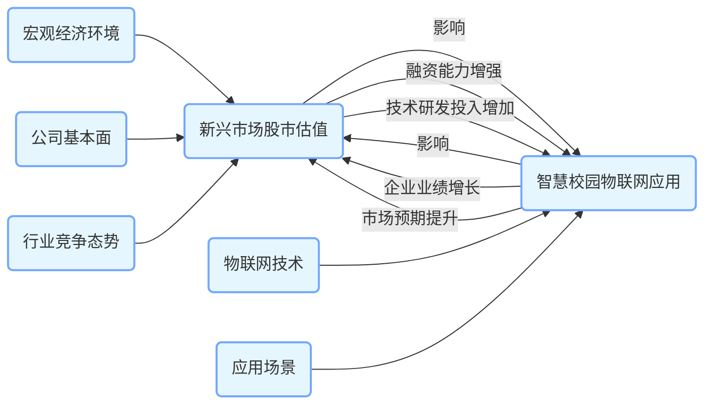

# 新兴市场股市估值与智慧校园物联网应用的互动

> 关键词：新兴市场股市估值、智慧校园物联网应用、互动关系、金融市场、教育科技

> 摘要：本文旨在深入探讨新兴市场股市估值与智慧校园物联网应用之间的互动关系。通过对新兴市场股市估值的原理、影响因素以及智慧校园物联网应用的核心概念、发展现状进行分析，阐述两者之间相互影响的机制。同时，结合数学模型和实际案例，详细说明这种互动在金融市场和教育科技领域的具体表现。此外，还提供了相关的工具和资源推荐，以帮助读者进一步研究和实践。最后，对未来的发展趋势和挑战进行总结，并解答常见问题，为相关领域的研究和实践提供有价值的参考。

## 1. 背景介绍 
### 1.1 目的和范围
本研究的目的是全面剖析新兴市场股市估值与智慧校园物联网应用之间的互动关系。新兴市场股市在全球金融体系中扮演着日益重要的角色，其估值受到多种因素的影响。而智慧校园物联网应用作为教育科技领域的新兴趋势，正逐渐改变着传统的教育模式和校园管理方式。本研究将探讨这两个看似不同领域之间的内在联系，以及这种联系对金融市场和教育科技发展的影响。研究范围涵盖了新兴市场股市估值的理论和实践、智慧校园物联网应用的技术和应用场景，以及两者之间的相互作用机制。

### 1.2 预期读者
本文的预期读者包括金融市场分析师、投资者、教育科技从业者、学术研究人员以及对新兴市场和教育科技感兴趣的人士。对于金融市场分析师和投资者来说，了解新兴市场股市估值与智慧校园物联网应用的互动关系可以帮助他们更好地评估投资机会和风险。教育科技从业者可以从金融市场的角度审视智慧校园物联网应用的发展前景，为业务决策提供参考。学术研究人员可以将本文作为进一步研究的基础，拓展相关领域的研究深度和广度。而对新兴市场和教育科技感兴趣的人士则可以通过本文了解这两个领域的最新动态和发展趋势。

### 1.3 文档结构概述
本文将按照以下结构进行组织：首先，介绍新兴市场股市估值和智慧校园物联网应用的核心概念，并分析它们之间的联系。接着，阐述核心算法原理和具体操作步骤，通过Python源代码进行详细说明。然后，引入数学模型和公式，对两者之间的互动关系进行量化分析，并举例说明。之后，通过实际案例展示新兴市场股市估值与智慧校园物联网应用的互动在项目中的具体体现，并进行详细的代码解读和分析。再探讨这种互动在实际应用中的场景和影响。随后，推荐相关的学习资源、开发工具框架和论文著作，帮助读者进一步深入研究。最后，总结未来的发展趋势和挑战，解答常见问题，并提供扩展阅读和参考资料。

### 1.4 术语表
#### 1.4.1 核心术语定义
- **新兴市场股市估值**：指对新兴市场中上市公司股票价值的评估，通常基于公司的财务状况、行业前景、市场预期等因素，通过一定的估值方法来确定股票的合理价格。
- **智慧校园物联网应用**：利用物联网技术，将校园内的各种设备、设施和人员进行连接和管理，实现智能化的教学、管理和服务，提高校园的运行效率和教育质量。
- **互动关系**：指新兴市场股市估值和智慧校园物联网应用之间相互影响、相互作用的关系，包括股市估值对智慧校园物联网应用发展的推动作用，以及智慧校园物联网应用对股市估值的影响。

#### 1.4.2 相关概念解释
- **新兴市场**：指发展中国家或地区的金融市场，具有较高的增长潜力和风险。与发达市场相比，新兴市场的经济发展水平相对较低，但在政策支持、人口红利等因素的推动下，经济增长速度较快。
- **物联网**：通过各种信息传感器、射频识别技术、全球定位系统等技术和装置，实时采集任何需要监控、连接、互动的物体或过程，采集其声、光、热、电、力学、化学、生物、位置等各种需要的信息，通过各类可能的网络接入，实现物与物、物与人的泛在连接，实现对物品和过程的智能化感知、识别和管理。
- **股市估值方法**：常见的股市估值方法包括市盈率法（P/E）、市净率法（P/B）、现金流折现法（DCF）等。这些方法通过不同的指标和模型来评估股票的价值。

#### 1.4.3 缩略词列表
- **P/E**：市盈率（Price-to-Earnings Ratio）
- **P/B**：市净率（Price-to-Book Ratio）
- **DCF**：现金流折现法（Discounted Cash Flow）
- **IoT**：物联网（Internet of Things）

## 2. 核心概念与联系 
### 2.1 新兴市场股市估值的核心概念
新兴市场股市估值是金融领域的重要研究内容。其核心目标是确定新兴市场中上市公司股票的合理价值，为投资者提供决策依据。股市估值受到多种因素的影响，包括宏观经济环境、公司基本面、行业竞争态势等。宏观经济环境方面，新兴市场的经济增长速度、通货膨胀率、利率水平等因素会影响整个股市的估值水平。例如，经济增长较快的新兴市场往往具有较高的股市估值，因为投资者对未来的盈利预期较高。公司基本面则包括公司的营业收入、净利润、资产负债状况等。一家业绩良好、财务健康的公司通常会有较高的估值。行业竞争态势也会对股市估值产生影响，处于新兴、高增长行业的公司往往会获得更高的估值。

### 2.2 智慧校园物联网应用的核心概念
智慧校园物联网应用是利用物联网技术构建智能化校园环境的一种创新应用模式。其核心在于通过传感器、网络通信设备等将校园内的各种设备和设施连接起来，实现数据的实时采集、传输和处理。例如，在教学方面，通过物联网技术可以实现智能教室的管理，包括自动调节教室的温度、灯光，实时监控教学设备的使用情况等。在校园管理方面，可以对校园的水电设施、安防设备等进行远程监控和管理，提高校园的运行效率和安全性。在学生服务方面，物联网技术可以实现校园一卡通的智能化应用，学生可以通过一卡通完成考勤、消费、借阅图书等功能。

### 2.3 两者之间的联系
新兴市场股市估值与智慧校园物联网应用之间存在着密切的联系。一方面，智慧校园物联网应用的发展会对新兴市场股市估值产生影响。随着智慧校园物联网应用的不断推广和普及，相关的企业会获得更多的业务机会和收入增长，从而提升其在股市中的估值。例如，一些专门从事智慧校园物联网解决方案的企业，其业绩可能会随着市场需求的增加而大幅增长，进而推动其股价上涨和估值提升。另一方面，新兴市场股市估值也会影响智慧校园物联网应用的发展。当股市估值较高时，相关企业可以通过融资获得更多的资金，用于技术研发和市场拓展，从而加速智慧校园物联网应用的发展。反之，如果股市估值较低，企业的融资难度会增加，可能会影响其发展速度。

### 2.4 核心概念原理和架构的文本示意图
```plaintext
新兴市场股市估值
|--宏观经济环境
|   |--经济增长速度
|   |--通货膨胀率
|   |--利率水平
|--公司基本面
|   |--营业收入
|   |--净利润
|   |--资产负债状况
|--行业竞争态势
|   |--行业发展前景
|   |--市场份额

智慧校园物联网应用
|--物联网技术
|   |--传感器
|   |--网络通信设备
|   |--数据处理平台
|--应用场景
|   |--教学管理
|   |--校园设施管理
|   |--学生服务

互动关系
|--智慧校园物联网应用对股市估值的影响
|   |--企业业绩增长
|   |--市场预期提升
|--股市估值对智慧校园物联网应用的影响
|   |--融资能力增强
|   |--技术研发投入增加
```

### 2.5 Mermaid 流程图


## 3. 核心算法原理 & 具体操作步骤 
### 3.1 新兴市场股市估值算法原理
#### 3.1.1 市盈率法（P/E）
市盈率法是一种常用的股市估值方法，其原理是通过比较公司的股票价格与每股收益（EPS）来评估股票的价值。计算公式为：

$P/E = \frac{股票价格}{每股收益}$

每股收益（EPS）是指公司净利润除以总股本。市盈率反映了投资者为获得每一元的净利润所愿意支付的价格。一般来说，市盈率越高，说明市场对公司的未来盈利预期越高，但也可能意味着股票被高估。

#### 3.1.2 市净率法（P/B）
市净率法是通过比较公司的股票价格与每股净资产（BVPS）来评估股票的价值。计算公式为：

$P/B = \frac{股票价格}{每股净资产}$

每股净资产是指公司的净资产除以总股本。市净率反映了投资者为获得每一元的净资产所愿意支付的价格。一般来说，市净率越低，说明股票的投资价值越高，但也可能意味着公司的盈利能力较弱。

#### 3.1.3 现金流折现法（DCF）
现金流折现法是一种基于未来现金流预测的估值方法。其原理是将公司未来的自由现金流按照一定的折现率折现到当前时刻，得到公司的内在价值。具体步骤如下：
1. 预测公司未来的自由现金流。自由现金流是指公司在满足了所有运营和投资需求后剩余的现金流量。
2. 确定折现率。折现率通常是投资者要求的最低回报率，考虑了资金的时间价值和风险因素。
3. 将未来的自由现金流按照折现率折现到当前时刻。
4. 计算公司的内在价值，即所有折现后的自由现金流之和。

### 3.2 智慧校园物联网应用相关算法原理
#### 3.2.1 传感器数据处理算法
在智慧校园物联网应用中，传感器会实时采集各种数据，如温度、湿度、光照强度等。这些数据需要进行处理和分析，以实现智能化的决策和控制。常见的传感器数据处理算法包括滤波算法、特征提取算法和异常检测算法。

滤波算法用于去除传感器数据中的噪声和干扰，提高数据的质量。常见的滤波算法有均值滤波、中值滤波和卡尔曼滤波等。

特征提取算法用于从传感器数据中提取有用的特征，以便进行进一步的分析和处理。例如，通过提取温度数据的变化趋势，可以判断教室的使用情况。

异常检测算法用于检测传感器数据中的异常值，及时发现设备故障或异常情况。常见的异常检测算法有基于统计的方法、基于机器学习的方法等。

#### 3.2.2 物联网设备管理算法
智慧校园物联网应用中涉及大量的物联网设备，需要对这些设备进行有效的管理和维护。物联网设备管理算法包括设备注册、设备状态监测、设备故障诊断和设备远程控制等。

设备注册算法用于将新的物联网设备添加到系统中，并分配唯一的标识符。设备状态监测算法用于实时监测设备的运行状态，如设备的在线状态、电量、信号强度等。设备故障诊断算法用于分析设备的故障原因，并提供相应的解决方案。设备远程控制算法用于通过网络对设备进行远程操作，如开关设备、调整参数等。

### 3.3 具体操作步骤及 Python 代码实现
#### 3.3.1 新兴市场股市估值的 Python 代码实现
```python
# 市盈率法（P/E）计算示例
def calculate_pe_ratio(stock_price, eps):
    """
    计算市盈率
    :param stock_price: 股票价格
    :param eps: 每股收益
    :return: 市盈率
    """
    return stock_price / eps

# 市净率法（P/B）计算示例
def calculate_pb_ratio(stock_price, bvps):
    """
    计算市净率
    :param stock_price: 股票价格
    :param bvps: 每股净资产
    :return: 市净率
    """
    return stock_price / bvps

# 示例数据
stock_price = 50
eps = 2
bvps = 10

# 计算市盈率和市净率
pe_ratio = calculate_pe_ratio(stock_price, eps)
pb_ratio = calculate_pb_ratio(stock_price, bvps)

print(f"市盈率 (P/E): {pe_ratio}")
print(f"市净率 (P/B): {pb_ratio}")
```

#### 3.3.2 智慧校园物联网应用传感器数据处理的 Python 代码实现
```python
import numpy as np

# 均值滤波算法示例
def mean_filter(data, window_size):
    """
    均值滤波
    :param data: 输入数据
    :param window_size: 窗口大小
    :return: 滤波后的数据
    """
    filtered_data = []
    for i in range(len(data)):
        if i < window_size - 1:
            filtered_data.append(np.mean(data[:i + 1]))
        else:
            filtered_data.append(np.mean(data[i - window_size + 1:i + 1]))
    return filtered_data

# 示例数据
sensor_data = [10, 12, 11, 13, 15, 14, 16, 18, 17, 19]
window_size = 3

# 进行均值滤波
filtered_data = mean_filter(sensor_data, window_size)

print("原始数据:", sensor_data)
print("滤波后的数据:", filtered_data)
```

## 4. 数学模型和公式 & 详细讲解 & 举例说明 
### 4.1 新兴市场股市估值的数学模型和公式
#### 4.1.1 市盈率法（P/E）
市盈率法的基本公式为：

$P/E = \frac{股票价格}{每股收益}$

可以变形为：

$股票价格 = P/E \times 每股收益$

这个公式表明，股票价格与市盈率和每股收益成正比。例如，假设一家公司的每股收益为 2 元，市场上同类公司的平均市盈率为 20 倍，那么该公司的股票价格理论上应该为：

$股票价格 = 20 \times 2 = 40$（元）

#### 4.1.2 市净率法（P/B）
市净率法的基本公式为：

$P/B = \frac{股票价格}{每股净资产}$

变形为：

$股票价格 = P/B \times 每股净资产$

例如，一家公司的每股净资产为 10 元，市场上同类公司的平均市净率为 2 倍，那么该公司的股票价格理论上应该为：

$股票价格 = 2 \times 10 = 20$（元）

#### 4.1.3 现金流折现法（DCF）
现金流折现法的核心公式为：

$V = \sum_{t=1}^{n} \frac{FCF_t}{(1 + r)^t}$

其中，$V$ 表示公司的内在价值，$FCF_t$ 表示第 $t$ 期的自由现金流，$r$ 表示折现率，$n$ 表示预测期数。

例如，假设一家公司未来 3 年的自由现金流分别为 100 万元、120 万元和 150 万元，折现率为 10%，则该公司的内在价值为：

$V = \frac{100}{(1 + 0.1)^1} + \frac{120}{(1 + 0.1)^2} + \frac{150}{(1 + 0.1)^3}$

$V = \frac{100}{1.1} + \frac{120}{1.21} + \frac{150}{1.331}$

$V \approx 90.91 + 99.17 + 112.69$

$V \approx 302.77$（万元）

### 4.2 智慧校园物联网应用的数学模型和公式
#### 4.2.1 传感器数据处理模型
以均值滤波为例，假设输入的传感器数据为 $x_1, x_2, \cdots, x_n$，窗口大小为 $m$，则滤波后的数据 $y_i$ 可以表示为：

当 $i < m - 1$ 时，

$y_i = \frac{1}{i + 1} \sum_{j=1}^{i + 1} x_j$

当 $i \geq m - 1$ 时，

$y_i = \frac{1}{m} \sum_{j=i - m + 1}^{i} x_j$

例如，对于输入数据 $[10, 12, 11, 13, 15]$，窗口大小为 3：

- 当 $i = 0$ 时，$y_0 = \frac{10}{1} = 10$
- 当 $i = 1$ 时，$y_1 = \frac{10 + 12}{2} = 11$
- 当 $i = 2$ 时，$y_2 = \frac{10 + 12 + 11}{3} = 11$
- 当 $i = 3$ 时，$y_3 = \frac{12 + 11 + 13}{3} = 12$
- 当 $i = 4$ 时，$y_4 = \frac{11 + 13 + 15}{3} = 13$

#### 4.2.2 物联网设备管理模型
在物联网设备管理中，设备的状态可以用一个向量来表示，例如设备的在线状态、电量、信号强度等。假设设备的状态向量为 $\mathbf{S} = [s_1, s_2, \cdots, s_k]$，其中 $s_i$ 表示第 $i$ 个状态指标。设备的故障诊断可以通过建立一个故障诊断模型来实现，例如基于机器学习的分类模型。假设分类模型的输入为设备的状态向量 $\mathbf{S}$，输出为故障类型 $f$，则可以表示为：

$f = g(\mathbf{S})$

其中，$g$ 是分类模型的函数。

## 5. 项目实战：代码实际案例和详细解释说明 
### 5.1 开发环境搭建
#### 5.1.1 硬件环境
为了实现智慧校园物联网应用的项目实战，我们需要以下硬件设备：
- **传感器节点**：用于采集校园内的各种环境数据，如温度传感器、湿度传感器、光照传感器等。可以选择常见的 Arduino 开发板搭配相应的传感器模块。
- **网关设备**：负责将传感器节点采集的数据传输到云端服务器。可以使用 Raspberry Pi 作为网关设备，通过 Wi-Fi 或以太网连接到网络。
- **服务器**：用于存储和处理传感器数据，以及运行相关的应用程序。可以选择云服务器，如阿里云、腾讯云等，也可以使用本地服务器。

#### 5.1.2 软件环境
- **操作系统**：在网关设备上安装 Raspberry Pi OS，在服务器上安装 Linux 操作系统，如 Ubuntu。
- **开发语言**：使用 Python 作为主要的开发语言，因为 Python 具有丰富的库和工具，适合进行数据处理和物联网应用开发。
- **数据库**：使用 MySQL 数据库来存储传感器数据和相关的业务信息。
- **Web 框架**：使用 Flask 作为 Web 框架，用于开发 Web 应用程序，实现数据的可视化和用户交互。

### 5.2 源代码详细实现和代码解读
#### 5.2.1 传感器数据采集代码
```python
import time
import board
import adafruit_dht

# 初始化 DHT 传感器
dhtDevice = adafruit_dht.DHT11(board.D4)

while True:
    try:
        # 读取温度和湿度数据
        temperature_c = dhtDevice.temperature
        humidity = dhtDevice.humidity

        if temperature_c is not None and humidity is not None:
            print(f"温度: {temperature_c}°C, 湿度: {humidity}%")
        else:
            print("无法读取传感器数据")

    except RuntimeError as error:
        print(error.args[0])

    time.sleep(2)
```

**代码解读**：
- 导入必要的库，包括 `time` 用于时间控制，`board` 和 `adafruit_dht` 用于与 DHT 传感器进行交互。
- 初始化 DHT 传感器，指定传感器连接的引脚。
- 使用 `while True` 循环不断读取传感器数据。
- 在循环中，尝试读取温度和湿度数据，如果读取成功，则打印数据；如果读取失败，则打印错误信息。
- 使用 `time.sleep(2)` 暂停 2 秒，避免频繁读取数据。

#### 5.2.2 数据传输代码
```python
import requests
import time
import board
import adafruit_dht

# 初始化 DHT 传感器
dhtDevice = adafruit_dht.DHT11(board.D4)

# 服务器地址
server_url = "http://your_server_ip/api/data"

while True:
    try:
        # 读取温度和湿度数据
        temperature_c = dhtDevice.temperature
        humidity = dhtDevice.humidity

        if temperature_c is not None and humidity is not None:
            # 构建数据字典
            data = {
                "temperature": temperature_c,
                "humidity": humidity
            }

            # 发送 POST 请求将数据上传到服务器
            response = requests.post(server_url, json=data)

            if response.status_code == 200:
                print("数据上传成功")
            else:
                print(f"数据上传失败，状态码: {response.status_code}")
        else:
            print("无法读取传感器数据")

    except RuntimeError as error:
        print(error.args[0])

    time.sleep(2)
```

**代码解读**：
- 导入 `requests` 库用于发送 HTTP 请求。
- 初始化 DHT 传感器，指定传感器连接的引脚。
- 定义服务器地址 `server_url`。
- 在 `while True` 循环中，读取传感器数据，并构建包含温度和湿度数据的字典。
- 使用 `requests.post` 方法将数据以 JSON 格式发送到服务器。
- 根据服务器的响应状态码判断数据上传是否成功。

#### 5.2.3 服务器端代码（Flask 应用）
```python
from flask import Flask, request, jsonify
import mysql.connector

app = Flask(__name__)

# 数据库连接配置
db_config = {
    "host": "localhost",
    "user": "your_username",
    "password": "your_password",
    "database": "your_database"
}

# 连接数据库
conn = mysql.connector.connect(**db_config)
cursor = conn.cursor()

# 创建数据表（如果不存在）
create_table_query = """
CREATE TABLE IF NOT EXISTS sensor_data (
    id INT AUTO_INCREMENT PRIMARY KEY,
    temperature FLOAT,
    humidity FLOAT,
    timestamp TIMESTAMP DEFAULT CURRENT_TIMESTAMP
)
"""
cursor.execute(create_table_query)

@app.route('/api/data', methods=['POST'])
def receive_data():
    data = request.get_json()
    temperature = data.get('temperature')
    humidity = data.get('humidity')

    # 插入数据到数据库
    insert_query = "INSERT INTO sensor_data (temperature, humidity) VALUES (%s, %s)"
    cursor.execute(insert_query, (temperature, humidity))
    conn.commit()

    return jsonify({"message": "数据接收成功"})

if __name__ == '__main__':
    app.run(host='0.0.0.0', port=5000)
```

**代码解读**：
- 导入 Flask 库和 MySQL 连接库。
- 创建 Flask 应用实例。
- 配置数据库连接信息，并连接到数据库。
- 创建 `sensor_data` 数据表（如果不存在），用于存储传感器数据。
- 定义 `/api/data` 路由，用于接收传感器数据。
- 在路由处理函数中，获取请求中的 JSON 数据，提取温度和湿度信息。
- 将数据插入到数据库中，并提交事务。
- 返回 JSON 响应，表示数据接收成功。

### 5.3 代码解读与分析
#### 5.3.1 传感器数据采集代码分析
传感器数据采集代码的主要功能是从 DHT 传感器中读取温度和湿度数据。使用 `adafruit_dht` 库可以方便地与 DHT 传感器进行交互。在代码中，使用 `while True` 循环不断读取数据，确保数据的实时性。同时，使用 `try-except` 语句捕获可能的运行时错误，提高代码的健壮性。

#### 5.3.2 数据传输代码分析
数据传输代码的主要功能是将传感器采集到的数据上传到服务器。使用 `requests` 库发送 POST 请求，将数据以 JSON 格式发送到服务器。在代码中，根据服务器的响应状态码判断数据上传是否成功，方便进行错误处理。

#### 5.3.3 服务器端代码分析
服务器端代码使用 Flask 框架构建了一个简单的 Web 应用，用于接收传感器数据并存储到数据库中。在代码中，首先创建了 `sensor_data` 数据表，用于存储传感器数据。然后定义了 `/api/data` 路由，用于接收 POST 请求。在路由处理函数中，获取请求中的 JSON 数据，提取温度和湿度信息，并将其插入到数据库中。最后返回 JSON 响应，表示数据接收成功。

## 6. 实际应用场景 
### 6.1 金融市场投资决策
新兴市场股市估值与智慧校园物联网应用的互动关系对金融市场投资决策具有重要影响。投资者可以通过关注智慧校园物联网应用的发展趋势，来评估相关企业的业绩增长潜力，从而做出更合理的投资决策。例如，如果发现智慧校园物联网应用市场呈现快速增长的趋势，那么相关的物联网设备制造商、软件开发商和系统集成商的业绩可能会随之增长，其股票估值也可能会上升。投资者可以提前布局这些企业的股票，以获取投资收益。

### 6.2 智慧校园建设规划
在智慧校园建设规划中，新兴市场股市估值可以为校园管理者提供资金支持和发展方向的参考。当股市估值较高时，相关企业有更多的资金用于技术研发和市场拓展，校园管理者可以与这些企业合作，引入更先进的智慧校园物联网应用解决方案。同时，通过分析股市估值的变化，校园管理者可以了解智慧校园物联网应用市场的发展趋势，合理规划校园建设的进度和规模。

### 6.3 教育科技产业发展
新兴市场股市估值与智慧校园物联网应用的互动关系也有助于推动教育科技产业的发展。股市估值的提升可以吸引更多的资本进入教育科技领域，促进企业的创新和发展。而智慧校园物联网应用的不断推广和普及，又会进一步提升相关企业的业绩和估值，形成良性循环。此外，这种互动关系还可以促进教育科技产业的整合和升级，提高整个产业的竞争力。

## 7. 工具和资源推荐
### 7.1 学习资源推荐
#### 7.1.1 书籍推荐
- 《金融市场学》：全面介绍了金融市场的基本概念、理论和实践，对于理解新兴市场股市估值具有重要的参考价值。
- 《物联网技术与应用》：详细介绍了物联网的技术原理、应用场景和发展趋势，有助于深入了解智慧校园物联网应用。
- 《Python 数据分析实战》：通过实际案例介绍了 Python 在数据分析领域的应用，对于处理和分析新兴市场股市数据和智慧校园物联网传感器数据非常有用。

#### 7.1.2 在线课程
- Coursera 上的“Financial Markets”课程：由著名经济学家罗伯特·席勒（Robert Shiller）授课，深入讲解了金融市场的运行机制和投资策略。
- edX 上的“Internet of Things (IoT) Fundamentals”课程：系统介绍了物联网的基本概念、技术和应用，适合初学者学习。
- 网易云课堂上的“Python 数据分析从入门到精通”课程：通过丰富的案例和实践项目，帮助学员掌握 Python 数据分析的技能。

#### 7.1.3 技术博客和网站
- 东方财富网：提供了丰富的金融市场数据和分析报告，对于研究新兴市场股市估值非常有帮助。
- 物联网世界网：专注于物联网领域的技术和应用，发布了大量关于智慧校园物联网应用的案例和文章。
- 开源中国：是国内知名的开源技术社区，提供了许多关于 Python 开发和物联网应用开发的技术文章和代码示例。

### 7.2 开发工具框架推荐
#### 7.2.1 IDE和编辑器
- PyCharm：是一款专业的 Python 集成开发环境，提供了丰富的代码编辑、调试和项目管理功能，适合开发智慧校园物联网应用的 Python 代码。
- Visual Studio Code：是一款轻量级的代码编辑器，支持多种编程语言和插件扩展，可用于开发各种类型的项目。
- Arduino IDE：专门用于 Arduino 开发板的集成开发环境，简单易用，适合初学者进行传感器数据采集和物联网设备开发。

#### 7.2.2 调试和性能分析工具
- Py-Spy：是一个用于 Python 代码性能分析的工具，可以帮助开发者找出代码中的性能瓶颈。
- Wireshark：是一款网络协议分析工具，可用于调试物联网设备之间的通信问题。
- MySQL Workbench：是 MySQL 数据库的可视化管理工具，方便开发者进行数据库的设计、开发和调试。

#### 7.2.3 相关框架和库
- Flask：是一个轻量级的 Python Web 框架，适合快速开发智慧校园物联网应用的 Web 后端。
- Django：是一个功能强大的 Python Web 框架，提供了丰富的功能和工具，适合开发大型的 Web 应用。
- Pandas：是一个用于数据分析和处理的 Python 库，提供了高效的数据结构和数据操作方法，可用于处理新兴市场股市数据和智慧校园物联网传感器数据。

### 7.3 相关论文著作推荐
#### 7.3.1 经典论文
- Fama, E. F., & French, K. R. (1992). The cross-section of expected stock returns. The Journal of Finance, 47(2), 427-465. 该论文提出了著名的 Fama-French 三因子模型，对股市估值的研究产生了深远影响。
- Ashton, K. (2009). That ‘internet of things’ thing. RFID Journal, 22(7), 97-114. 这篇论文首次提出了“物联网”的概念，对物联网技术的发展起到了重要的推动作用。

#### 7.3.2 最新研究成果
- 关注 IEEE Transactions on Industrial Informatics、ACM Transactions on Internet Technology 等顶级学术期刊，这些期刊上发表了许多关于新兴市场金融和物联网技术的最新研究成果。
- 参加国际金融会议和物联网学术会议，如 International Conference on Financial Economics、IEEE International Conference on Internet of Things 等，了解最新的研究动态和趋势。

#### 7.3.3 应用案例分析
- 《智慧校园建设案例集》：收集了国内外智慧校园建设的成功案例，详细介绍了智慧校园物联网应用的实施过程和效果。
- 《新兴市场投资案例分析》：通过实际案例分析了新兴市场股市投资的策略和风险，对于投资者具有重要的参考价值。

## 8. 总结：未来发展趋势与挑战
### 8.1 未来发展趋势
#### 8.1.1 融合发展趋势
新兴市场股市估值与智慧校园物联网应用将呈现更加紧密的融合发展趋势。随着智慧校园物联网应用的不断普及和深化，相关企业的业绩和市场价值将不断提升，从而对新兴市场股市估值产生更大的影响。同时，股市估值的变化也会影响智慧校园物联网应用的发展速度和方向，促进企业加大技术研发和市场拓展的力度。

#### 8.1.2 技术创新驱动
技术创新将是推动新兴市场股市估值与智慧校园物联网应用互动发展的重要动力。随着人工智能、大数据、区块链等技术的不断发展，智慧校园物联网应用将变得更加智能化、个性化和安全化。这些技术创新将提升相关企业的竞争力，从而影响其股市估值。同时，股市估值的提升也将为企业提供更多的资金支持，促进技术创新的进一步发展。

#### 8.1.3 国际化发展趋势
新兴市场股市和智慧校园物联网应用都具有国际化发展的趋势。随着全球经济一体化的加速，新兴市场之间的联系将更加紧密，股市估值也将受到国际市场的影响。同时，智慧校园物联网应用也将在全球范围内得到更广泛的应用和推广，相关企业将面临更加激烈的国际竞争。

### 8.2 挑战
#### 8.2.1 技术标准和规范问题
智慧校园物联网应用涉及到多种技术和设备，缺乏统一的技术标准和规范会导致设备之间的兼容性和互操作性问题。这不仅会增加系统集成的难度和成本，还会影响智慧校园物联网应用的推广和普及。因此，制定统一的技术标准和规范是未来发展面临的重要挑战之一。

#### 8.2.2 数据安全和隐私问题
智慧校园物联网应用会产生大量的敏感数据，如学生的个人信息、学习记录等。这些数据的安全和隐私保护至关重要。然而，随着物联网设备的增多和网络攻击的日益频繁，数据安全和隐私问题面临着严峻的挑战。企业和校园管理者需要采取有效的措施来保障数据的安全和隐私。

#### 8.2.3 市场竞争和不确定性
新兴市场股市和智慧校园物联网应用市场都具有较高的不确定性和竞争激烈性。股市估值受到宏观经济环境、政策变化等多种因素的影响，难以准确预测。智慧校园物联网应用市场也面临着技术更新换代快、市场需求变化大等问题。企业需要具备较强的市场适应能力和创新能力，才能在激烈的市场竞争中立于不败之地。

## 9. 附录：常见问题与解答
### 9.1 新兴市场股市估值与发达市场股市估值有什么区别？
新兴市场股市估值与发达市场股市估值存在以下区别：
- **经济环境不同**：新兴市场的经济增长速度通常较快，但经济稳定性相对较差，而发达市场的经济增长相对稳定，但增速较慢。这导致新兴市场股市估值的波动较大，而发达市场股市估值相对较为稳定。
- **行业结构不同**：新兴市场的产业结构通常以制造业和资源型产业为主，而发达市场的产业结构则以服务业和高科技产业为主。不同的行业结构会影响股市估值的水平和方法。
- **投资者结构不同**：新兴市场的投资者以个人投资者为主，投资行为较为情绪化，而发达市场的投资者以机构投资者为主，投资行为相对理性。这也会对股市估值产生影响。

### 9.2 智慧校园物联网应用的发展面临哪些技术难题？
智慧校园物联网应用的发展面临以下技术难题：
- **传感器技术**：传感器的精度、可靠性和稳定性是影响智慧校园物联网应用效果的关键因素。目前，传感器技术还存在一些不足之处，如精度不够高、易受环境干扰等。
- **网络通信技术**：智慧校园物联网应用需要大量的数据传输和实时处理，对网络通信技术的要求较高。然而，目前校园内的网络覆盖和带宽还不能完全满足需求，特别是在一些偏远地区和老旧校园。
- **数据处理和分析技术**：智慧校园物联网应用产生的大量数据需要进行有效的处理和分析，以提取有价值的信息。但目前的数据处理和分析技术还存在一些挑战，如数据挖掘算法的效率不高、数据分析结果的准确性和可靠性有待提高等。

### 9.3 如何评估智慧校园物联网应用项目的投资价值？
评估智慧校园物联网应用项目的投资价值可以从以下几个方面入手：
- **市场需求**：分析智慧校园物联网应用市场的规模和增长趋势，了解市场对该项目的需求程度。
- **技术创新性**：评估项目所采用的技术是否具有创新性和领先性，是否能够解决现有智慧校园建设中的痛点问题。
- **商业模式**：考察项目的商业模式是否清晰、可行，是否具有盈利能力和可持续发展能力。
- **团队实力**：了解项目团队的技术实力、管理经验和市场拓展能力，判断团队是否能够有效地推动项目的实施和发展。
- **竞争态势**：分析项目在市场中的竞争地位，了解竞争对手的情况，评估项目的竞争优势和风险。

## 10. 扩展阅读 & 参考资料
### 10.1 扩展阅读
- 《新兴市场金融与经济发展》：深入探讨了新兴市场金融体系的发展和经济增长的关系，为理解新兴市场股市估值提供了更广阔的视角。
- 《物联网：从基础到实践》：详细介绍了物联网的技术原理、架构和应用实践，对于进一步研究智慧校园物联网应用具有重要的参考价值。
- 《金融科技前沿：理论与实践》：探讨了金融科技在金融市场中的应用和发展，包括新兴市场股市估值和智慧校园物联网应用中的金融科技应用。

### 10.2 参考资料
- 国际货币基金组织（IMF）发布的《世界经济展望》报告，提供了全球和新兴市场的宏观经济数据和分析。
- 世界银行发布的《全球发展报告》，包含了新兴市场的经济发展情况和相关政策分析。
- IEEE（电气和电子工程师协会）、ACM（美国计算机协会）等学术组织的期刊和会议论文，提供了物联网技术和金融科技领域的最新研究成果。

作者：AI天才研究院/AI Genius Institute & 禅与计算机程序设计艺术 /Zen And The Art of Computer Programming