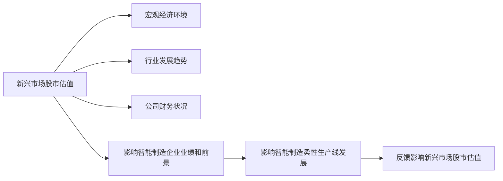

# 新兴市场股市估值与智能制造柔性生产线的互动

> 关键词：新兴市场股市估值、智能制造柔性生产线、互动关系、经济模型、市场影响

> 摘要：本文深入探讨了新兴市场股市估值与智能制造柔性生产线之间的互动关系。通过介绍相关背景知识，阐述核心概念及其联系，剖析核心算法原理，引入数学模型和公式，结合项目实战案例，分析实际应用场景等方面，全面展现了两者相互影响的机制。旨在帮助读者理解新兴市场股市和智能制造领域的内在联系，为投资者、企业管理者和研究人员提供有价值的参考，同时对未来发展趋势和挑战进行了展望，并解答了常见问题。

## 1. 背景介绍 
### 1.1 目的和范围
本研究旨在全面揭示新兴市场股市估值与智能制造柔性生产线之间的互动关系。通过对新兴市场股市估值的影响因素、智能制造柔性生产线的特点和发展趋势进行分析，探讨两者在经济活动中的相互作用机制。范围涵盖了新兴市场国家的股市情况以及智能制造领域中柔性生产线的相关技术、应用和市场动态。旨在为投资者、企业管理者和政策制定者提供决策依据，帮助他们更好地理解这两个领域之间的联系，把握市场机会，应对潜在风险。

### 1.2 预期读者
本文预期读者包括金融投资者、股票分析师、智能制造企业管理人员、相关领域的研究学者以及对新兴市场和智能制造感兴趣的人士。对于金融投资者和股票分析师，本文可以帮助他们更好地评估新兴市场股市中智能制造相关企业的价值，发现投资机会。智能制造企业管理人员可以从股市估值的角度了解市场对企业的预期，调整企业战略。研究学者可以在此基础上开展更深入的学术研究。而对相关领域感兴趣的人士则可以通过本文了解新兴市场股市和智能制造柔性生产线的基本知识和两者之间的互动关系。

### 1.3 文档结构概述
本文将按照以下结构进行阐述：首先介绍核心概念与联系，包括新兴市场股市估值和智能制造柔性生产线的定义、特点以及两者之间的关联；接着详细讲解核心算法原理和具体操作步骤，通过Python代码进行说明；然后引入数学模型和公式，并结合实际例子进行详细讲解；之后通过项目实战案例，介绍开发环境搭建、源代码实现和代码解读；再分析实际应用场景；推荐相关的工具和资源；最后对未来发展趋势与挑战进行总结，并解答常见问题，提供扩展阅读和参考资料。

### 1.4 术语表
#### 1.4.1 核心术语定义
- **新兴市场股市估值**：指对新兴市场国家或地区股票市场中上市公司股票价值的评估。新兴市场通常是指发展中国家或地区的股票市场，其具有较高的增长潜力，但也伴随着较高的风险。股市估值是通过各种方法和指标来确定股票的合理价格，以便投资者做出投资决策。
- **智能制造柔性生产线**：是一种将先进的信息技术、自动化技术和制造技术相结合的生产系统。它能够根据市场需求的变化，快速调整生产流程和产品类型，实现多品种、小批量的生产。具有高度的灵活性、自动化程度和智能化水平，能够提高生产效率、降低成本、提升产品质量。

#### 1.4.2 相关概念解释
- **股市估值方法**：常见的股市估值方法包括市盈率法（P/E）、市净率法（P/B）、现金流折现法（DCF）等。市盈率法是通过将股票价格除以每股收益来评估股票的相对价值；市净率法是将股票价格除以每股净资产；现金流折现法是通过预测企业未来的现金流，并将其折现到当前价值来评估股票的内在价值。
- **智能制造技术**：涵盖了人工智能、物联网、大数据、云计算等多种技术。人工智能技术可以实现生产过程的自动化决策和优化；物联网技术可以实现设备之间的互联互通和数据传输；大数据技术可以对生产过程中的大量数据进行分析和挖掘，为生产决策提供支持；云计算技术可以提供强大的计算能力和存储能力，支持智能制造系统的运行。

#### 1.4.3 缩略词列表
- **P/E**：市盈率（Price-to-Earnings Ratio）
- **P/B**：市净率（Price-to-Book Ratio）
- **DCF**：现金流折现法（Discounted Cash Flow）
- **AI**：人工智能（Artificial Intelligence）
- **IoT**：物联网（Internet of Things）

## 2. 核心概念与联系 

### 新兴市场股市估值
新兴市场股市估值是对新兴市场中上市公司股票价值的评估过程。其受到多种因素的影响，包括宏观经济环境、行业发展趋势、公司财务状况等。从宏观经济环境来看，新兴市场国家的经济增长速度、通货膨胀率、利率水平等都会对股市估值产生影响。例如，经济增长较快的新兴市场国家，企业的盈利预期通常较高，股市估值也会相应提高。行业发展趋势也是重要因素之一，如果某个行业在新兴市场中具有良好的发展前景，相关企业的股票估值也会上升。公司财务状况，如营业收入、净利润、资产负债表等，直接反映了公司的盈利能力和偿债能力，是股市估值的重要依据。

### 智能制造柔性生产线
智能制造柔性生产线是智能制造领域的核心技术之一。它由多个智能设备和系统组成，通过物联网技术实现设备之间的互联互通和数据共享。生产线可以根据生产任务的变化，自动调整生产流程和工艺参数，实现快速换产。例如，在汽车制造行业，智能制造柔性生产线可以根据不同车型的需求，快速调整生产线的布局和设备参数，生产出不同款式的汽车。智能制造柔性生产线具有高度的灵活性、自动化程度和智能化水平，能够提高生产效率、降低成本、提升产品质量。

### 两者的联系
新兴市场股市估值与智能制造柔性生产线之间存在着密切的联系。一方面，智能制造柔性生产线的发展会影响新兴市场中相关企业的业绩和前景，进而影响其股票估值。如果一家企业成功引入智能制造柔性生产线，提高了生产效率和产品质量，降低了成本，那么其盈利能力将得到提升，市场对该企业的预期也会提高，股票估值可能会上升。另一方面，新兴市场股市估值的变化也会影响智能制造柔性生产线的发展。如果股市估值较高，企业可以通过增发股票等方式筹集更多的资金，用于研发和引进智能制造柔性生产线，推动行业的发展。反之，如果股市估值较低，企业的融资难度会增加，可能会影响智能制造柔性生产线的推广和应用。

### 文本示意图
```plaintext
新兴市场股市估值
|
|-- 宏观经济环境影响
|-- 行业发展趋势影响
|-- 公司财务状况影响
|
|-- 影响智能制造企业业绩和前景
|   |
|   |-- 影响智能制造柔性生产线发展
|
|-- 受智能制造企业发展反馈影响
```

### Mermaid 流程图


## 3. 核心算法原理 & 具体操作步骤 

### 股市估值算法 - 市盈率法
市盈率法是一种常用的股市估值方法，其基本原理是通过比较股票的市盈率与同行业或市场平均市盈率，来判断股票的估值是否合理。市盈率（P/E）的计算公式为：

$$P/E = \frac{股票价格}{每股收益}$$

以下是使用Python实现市盈率法进行股市估值的代码示例：

```python
def calculate_pe_ratio(stock_price, earnings_per_share):
    """
    计算市盈率
    :param stock_price: 股票价格
    :param earnings_per_share: 每股收益
    :return: 市盈率
    """
    if earnings_per_share == 0:
        return None
    return stock_price / earnings_per_share

# 示例数据
stock_price = 50
earnings_per_share = 5

pe_ratio = calculate_pe_ratio(stock_price, earnings_per_share)
if pe_ratio is not None:
    print(f"该股票的市盈率为: {pe_ratio}")
else:
    print("每股收益为0，无法计算市盈率。")
```

### 操作步骤
1. **获取数据**：收集股票的当前价格和每股收益数据。可以通过金融数据提供商、证券交易所网站等渠道获取这些数据。
2. **计算市盈率**：使用上述代码中的`calculate_pe_ratio`函数，将股票价格和每股收益作为参数传入，计算出市盈率。
3. **比较分析**：将计算得到的市盈率与同行业或市场平均市盈率进行比较。如果该股票的市盈率低于同行业或市场平均市盈率，可能意味着该股票被低估，具有投资价值；反之，如果市盈率高于平均水平，可能意味着该股票被高估。

### 智能制造柔性生产线优化算法 - 遗传算法
遗传算法是一种模拟自然选择和遗传机制的优化算法，可用于智能制造柔性生产线的优化问题，如生产调度、设备布局等。以下是一个简单的遗传算法实现示例，用于解决生产调度问题：

```python
import random

# 定义问题参数
num_jobs = 5  # 作业数量
num_machines = 3  # 机器数量
population_size = 10  # 种群大小
generations = 20  # 迭代次数

# 生成初始种群
def generate_population():
    population = []
    for _ in range(population_size):
        individual = [i for i in range(num_jobs)]
        random.shuffle(individual)
        population.append(individual)
    return population

# 计算适应度函数
def calculate_fitness(individual):
    # 这里简单模拟一个适应度计算，实际应用中需要根据具体问题进行设计
    fitness = sum(individual)
    return fitness

# 选择操作
def selection(population):
    fitness_scores = [calculate_fitness(individual) for individual in population]
    total_fitness = sum(fitness_scores)
    probabilities = [score / total_fitness for score in fitness_scores]
    selected_indices = random.choices(range(population_size), weights=probabilities, k=2)
    return [population[i] for i in selected_indices]

# 交叉操作
def crossover(parent1, parent2):
    crossover_point = random.randint(1, num_jobs - 1)
    child1 = parent1[:crossover_point] + [job for job in parent2 if job not in parent1[:crossover_point]]
    child2 = parent2[:crossover_point] + [job for job in parent1 if job not in parent2[:crossover_point]]
    return child1, child2

# 变异操作
def mutation(individual):
    index1, index2 = random.sample(range(num_jobs), 2)
    individual[index1], individual[index2] = individual[index2], individual[index1]
    return individual

# 遗传算法主函数
def genetic_algorithm():
    population = generate_population()
    for _ in range(generations):
        new_population = []
        for _ in range(population_size // 2):
            parents = selection(population)
            child1, child2 = crossover(parents[0], parents[1])
            child1 = mutation(child1)
            child2 = mutation(child2)
            new_population.extend([child1, child2])
        population = new_population
    best_individual = max(population, key=calculate_fitness)
    return best_individual

# 运行遗传算法
best_schedule = genetic_algorithm()
print(f"最优生产调度方案: {best_schedule}")
```

### 操作步骤
1. **问题定义**：明确智能制造柔性生产线的优化问题，如生产调度、设备布局等，并确定问题的参数，如作业数量、机器数量等。
2. **初始化种群**：使用`generate_population`函数生成初始种群，每个个体表示一个可能的解决方案。
3. **计算适应度**：定义适应度函数`calculate_fitness`，用于评估每个个体的优劣。
4. **选择操作**：使用`selection`函数从当前种群中选择优秀的个体作为父代。
5. **交叉操作**：使用`crossover`函数对父代个体进行交叉操作，生成子代个体。
6. **变异操作**：使用`mutation`函数对子代个体进行变异操作，增加种群的多样性。
7. **更新种群**：将子代个体加入新的种群，替换旧的种群。
8. **迭代优化**：重复步骤3 - 7，直到达到指定的迭代次数。
9. **输出结果**：选择适应度最高的个体作为最优解决方案。

## 4. 数学模型和公式 & 详细讲解 & 举例说明 

### 股市估值模型 - 现金流折现法
现金流折现法（DCF）是一种基于企业未来现金流的股市估值方法。其基本原理是将企业未来的现金流折现到当前价值，以此来评估企业的内在价值。DCF模型的计算公式为：

$$V = \sum_{t=1}^{n} \frac{CF_t}{(1 + r)^t} + \frac{TV}{(1 + r)^n}$$

其中：
- $V$ 表示企业的内在价值
- $CF_t$ 表示第 $t$ 期的现金流
- $r$ 表示折现率
- $n$ 表示预测期数
- $TV$ 表示终值

### 详细讲解
1. **现金流预测**：首先需要预测企业未来各期的现金流。这需要对企业的业务模式、市场前景、竞争状况等进行深入分析，结合历史财务数据和行业趋势，对未来的营业收入、成本、利润等进行预测，从而得到各期的现金流。
2. **折现率确定**：折现率反映了投资者对投资回报的要求，通常可以使用加权平均资本成本（WACC）来确定。WACC的计算公式为：

$$WACC = E / V \times r_e + D / V \times r_d \times (1 - T_c)$$

其中：
- $E$ 表示股权价值
- $D$ 表示债务价值
- $V = E + D$ 表示企业总价值
- $r_e$ 表示股权成本
- $r_d$ 表示债务成本
- $T_c$ 表示企业所得税税率

3. **终值计算**：终值是指预测期结束后企业的价值。常见的终值计算方法有永续增长模型和退出倍数法。永续增长模型的计算公式为：

$$TV = \frac{CF_{n+1}}{r - g}$$

其中：
- $CF_{n+1}$ 表示预测期结束后下一期的现金流
- $g$ 表示永续增长率

### 举例说明
假设一家企业未来3年的现金流分别为100万元、120万元和150万元，预测期结束后企业的现金流以3%的增长率永续增长，折现率为10%。

1. **计算各期现金流的现值**：
    - 第1年现金流的现值：$PV_1 = \frac{100}{(1 + 0.1)^1} = 90.91$（万元）
    - 第2年现金流的现值：$PV_2 = \frac{120}{(1 + 0.1)^2} = 99.17$（万元）
    - 第3年现金流的现值：$PV_3 = \frac{150}{(1 + 0.1)^3} = 112.69$（万元）

2. **计算终值**：
    - 第4年现金流：$CF_4 = 150 \times (1 + 0.03) = 154.5$（万元）
    - 终值：$TV = \frac{154.5}{0.1 - 0.03} = 2207.14$（万元）
    - 终值的现值：$PV_{TV} = \frac{2207.14}{(1 + 0.1)^3} = 1659.23$（万元）

3. **计算企业的内在价值**：
    - $V = PV_1 + PV_2 + PV_3 + PV_{TV} = 90.91 + 99.17 + 112.69 + 1659.23 = 1962.00$（万元）

### 智能制造柔性生产线优化模型 - 线性规划模型
线性规划模型可用于解决智能制造柔性生产线的生产调度问题，目标是在满足各种约束条件的前提下，最大化生产效率或最小化生产成本。

假设我们有 $n$ 个作业需要在 $m$ 台机器上加工，$x_{ij}$ 表示作业 $i$ 在机器 $j$ 上的加工时间，$c_{ij}$ 表示作业 $i$ 在机器 $j$ 上的加工成本，$d_i$ 表示作业 $i$ 的交货期。我们的目标是最小化总成本，约束条件包括每个作业只能在一台机器上加工、每台机器在同一时间只能加工一个作业等。

**目标函数**：
$$\min \sum_{i=1}^{n} \sum_{j=1}^{m} c_{ij} x_{ij}$$

**约束条件**：
- 每个作业只能在一台机器上加工：$\sum_{j=1}^{m} x_{ij} = 1, \forall i = 1, \cdots, n$
- 每台机器在同一时间只能加工一个作业：$\sum_{i=1}^{n} x_{ij} \leq 1, \forall j = 1, \cdots, m$
- 加工时间约束：$x_{ij} \geq 0, \forall i = 1, \cdots, n, j = 1, \cdots, m$

### 详细讲解
1. **目标函数**：目标函数表示要最小化的总成本，即所有作业在各台机器上加工成本的总和。
2. **约束条件**：
    - 第一个约束条件保证每个作业只能在一台机器上加工。
    - 第二个约束条件保证每台机器在同一时间只能加工一个作业。
    - 第三个约束条件保证加工时间非负。

### 举例说明
假设有3个作业和2台机器，加工成本矩阵 $C$ 如下：

$$C = \begin{bmatrix}
10 & 12 \\
15 & 13 \\
11 & 14
\end{bmatrix}$$

使用线性规划求解器（如Python的`pulp`库）来求解该问题：

```python
from pulp import LpMinimize, LpProblem, LpVariable

# 定义问题
prob = LpProblem("Production_Scheduling", LpMinimize)

# 定义变量
n = 3  # 作业数量
m = 2  # 机器数量
x = [[LpVariable(f"x_{i}_{j}", lowBound=0, cat='Binary') for j in range(m)] for i in range(n)]

# 定义目标函数
prob += sum([C[i][j] * x[i][j] for i in range(n) for j in range(m)])

# 定义约束条件
for i in range(n):
    prob += sum([x[i][j] for j in range(m)]) == 1

for j in range(m):
    prob += sum([x[i][j] for i in range(n)]) <= 1

# 求解问题
prob.solve()

# 输出结果
for i in range(n):
    for j in range(m):
        if x[i][j].value() == 1:
            print(f"作业 {i+1} 分配到机器 {j+1}")
```

通过上述代码，我们可以得到最优的生产调度方案，即每个作业分配到哪台机器上进行加工。

## 5. 项目实战：代码实际案例和详细解释说明 

### 5.1  开发环境搭建
#### 安装Python
首先需要安装Python开发环境。可以从Python官方网站（https://www.python.org/downloads/）下载适合自己操作系统的Python安装包，按照安装向导进行安装。建议安装Python 3.x版本。

#### 安装必要的库
在本项目中，我们需要使用一些Python库，如`numpy`、`pandas`、`matplotlib`等。可以使用`pip`命令进行安装：

```bash
pip install numpy pandas matplotlib pulp
```

### 5.2  源代码详细实现和代码解读
#### 股市估值分析代码
以下是一个简单的股市估值分析代码示例，使用市盈率法和市净率法对股票进行估值：

```python
import pandas as pd

# 模拟股票数据
data = {
    '股票代码': ['000001', '000002', '000003'],
    '股票价格': [50, 60, 70],
    '每股收益': [5, 6, 7],
    '每股净资产': [20, 25, 30]
}

df = pd.DataFrame(data)

# 计算市盈率和市净率
df['市盈率'] = df['股票价格'] / df['每股收益']
df['市净率'] = df['股票价格'] / df['每股净资产']

# 输出结果
print(df)
```

#### 代码解读
1. **数据模拟**：使用字典`data`模拟了3只股票的相关数据，包括股票代码、股票价格、每股收益和每股净资产。
2. **数据处理**：使用`pandas`库的`DataFrame`将字典数据转换为表格形式。
3. **指标计算**：使用`DataFrame`的列运算功能，计算每只股票的市盈率和市净率。
4. **结果输出**：使用`print`函数输出计算结果。

#### 智能制造柔性生产线调度代码
以下是一个使用遗传算法进行智能制造柔性生产线调度的代码示例：

```python
import random
import numpy as np

# 定义问题参数
num_jobs = 5  # 作业数量
num_machines = 3  # 机器数量
population_size = 10  # 种群大小
generations = 20  # 迭代次数

# 生成初始种群
def generate_population():
    population = []
    for _ in range(population_size):
        individual = [i for i in range(num_jobs)]
        random.shuffle(individual)
        population.append(individual)
    return population

# 计算适应度函数
def calculate_fitness(individual):
    # 这里简单模拟一个适应度计算，实际应用中需要根据具体问题进行设计
    fitness = sum(individual)
    return fitness

# 选择操作
def selection(population):
    fitness_scores = [calculate_fitness(individual) for individual in population]
    total_fitness = sum(fitness_scores)
    probabilities = [score / total_fitness for score in fitness_scores]
    selected_indices = random.choices(range(population_size), weights=probabilities, k=2)
    return [population[i] for i in selected_indices]

# 交叉操作
def crossover(parent1, parent2):
    crossover_point = random.randint(1, num_jobs - 1)
    child1 = parent1[:crossover_point] + [job for job in parent2 if job not in parent1[:crossover_point]]
    child2 = parent2[:crossover_point] + [job for job in parent1 if job not in parent2[:crossover_point]]
    return child1, child2

# 变异操作
def mutation(individual):
    index1, index2 = random.sample(range(num_jobs), 2)
    individual[index1], individual[index2] = individual[index2], individual[index1]
    return individual

# 遗传算法主函数
def genetic_algorithm():
    population = generate_population()
    for _ in range(generations):
        new_population = []
        for _ in range(population_size // 2):
            parents = selection(population)
            child1, child2 = crossover(parents[0], parents[1])
            child1 = mutation(child1)
            child2 = mutation(child2)
            new_population.extend([child1, child2])
        population = new_population
    best_individual = max(population, key=calculate_fitness)
    return best_individual

# 运行遗传算法
best_schedule = genetic_algorithm()
print(f"最优生产调度方案: {best_schedule}")
```

#### 代码解读
1. **参数定义**：定义了作业数量、机器数量、种群大小和迭代次数等问题参数。
2. **初始种群生成**：使用`generate_population`函数生成初始种群，每个个体表示一个可能的生产调度方案。
3. **适应度计算**：定义了`calculate_fitness`函数，用于评估每个个体的优劣。
4. **选择操作**：使用`selection`函数从当前种群中选择优秀的个体作为父代。
5. **交叉操作**：使用`crossover`函数对父代个体进行交叉操作，生成子代个体。
6. **变异操作**：使用`mutation`函数对子代个体进行变异操作，增加种群的多样性。
7. **迭代优化**：在`genetic_algorithm`函数中，重复进行选择、交叉和变异操作，直到达到指定的迭代次数。
8. **结果输出**：选择适应度最高的个体作为最优生产调度方案并输出。

### 5.3  代码解读与分析
#### 股市估值代码分析
- **优点**：代码简单易懂，使用`pandas`库可以方便地进行数据处理和计算。通过市盈率和市净率的计算，可以快速对股票进行初步估值。
- **局限性**：该代码只是一个简单的示例，实际的股市估值需要考虑更多的因素，如宏观经济环境、行业发展趋势等。市盈率和市净率也只是相对估值指标，不能完全反映股票的内在价值。

#### 智能制造柔性生产线调度代码分析
- **优点**：使用遗传算法可以有效地解决生产调度问题，具有较好的全局搜索能力。代码结构清晰，易于理解和扩展。
- **局限性**：适应度函数的设计比较简单，实际应用中需要根据具体问题进行更复杂的设计。遗传算法的参数选择（如种群大小、迭代次数等）对结果有较大影响，需要进行合理的调整。

## 6. 实际应用场景 
### 新兴市场股市估值的应用场景
#### 投资决策
投资者可以根据新兴市场股市估值来判断股票的投资价值。如果某只股票的估值低于同行业或市场平均水平，可能意味着该股票被低估，具有投资潜力。投资者可以通过买入被低估的股票，等待其估值回归合理水平，从而获得投资收益。

#### 风险管理
股市估值可以帮助投资者评估投资风险。如果某只股票的估值过高，可能存在泡沫风险，投资者需要谨慎投资。同时，通过对不同股票的估值分析，投资者可以进行分散投资，降低投资组合的风险。

#### 企业融资
对于新兴市场中的企业来说，股市估值的高低直接影响其融资能力。如果企业的股票估值较高，企业可以通过增发股票等方式筹集更多的资金，用于扩大生产、研发等。反之，如果估值较低，企业的融资难度会增加。

### 智能制造柔性生产线的应用场景
#### 汽车制造行业
在汽车制造行业，智能制造柔性生产线可以根据不同车型的需求，快速调整生产线的布局和设备参数，实现多品种、小批量的生产。例如，宝马汽车公司的一些工厂采用了智能制造柔性生产线，可以在同一条生产线上生产不同型号的汽车，提高了生产效率和灵活性。

#### 电子制造行业
电子制造行业产品更新换代快，市场需求变化大。智能制造柔性生产线可以帮助企业快速响应市场需求，缩短产品上市时间。例如，苹果公司的代工厂采用了智能制造柔性生产线，能够快速调整生产流程，生产出不同型号的手机、平板电脑等产品。

#### 医疗器械制造行业
医疗器械制造行业对产品质量和安全性要求较高，同时产品种类繁多。智能制造柔性生产线可以通过自动化控制和质量检测系统，保证产品质量，同时实现多品种的生产。例如，一些医疗器械企业采用智能制造柔性生产线，生产不同类型的心脏起搏器、血糖仪等产品。

### 两者互动的应用场景
#### 投资智能制造企业
投资者可以通过分析新兴市场股市估值和智能制造柔性生产线的发展情况，选择具有潜力的智能制造企业进行投资。如果一家企业成功引入智能制造柔性生产线，提高了生产效率和产品质量，其股票估值可能会上升，投资者可以从中获得投资收益。

#### 企业战略决策
智能制造企业可以根据股市估值的变化来调整企业战略。如果股市估值较高，企业可以加大研发投入，进一步提升智能制造柔性生产线的水平；如果估值较低，企业可以考虑优化生产流程，降低成本，提高盈利能力。

#### 政策制定
政府可以根据新兴市场股市估值和智能制造柔性生产线的发展情况，制定相关政策，促进智能制造产业的发展。例如，政府可以通过税收优惠、财政补贴等政策，鼓励企业引入智能制造柔性生产线，同时引导投资者关注智能制造企业，提高企业的股市估值。

## 7. 工具和资源推荐
### 7.1 学习资源推荐
#### 7.1.1 书籍推荐
- 《金融市场与金融机构》：这本书系统介绍了金融市场的基本概念、运行机制和金融机构的业务活动，对于理解新兴市场股市估值有很大帮助。
- 《智能制造：趋势与对策》：详细阐述了智能制造的发展趋势、技术应用和实施策略，是学习智能制造柔性生产线的重要参考书籍。
- 《Python数据分析实战》：通过实际案例介绍了Python在数据分析领域的应用，对于使用Python进行股市估值分析和智能制造数据处理有很好的指导作用。

#### 7.1.2 在线课程
- Coursera上的“金融市场”课程：由知名大学教授授课，讲解了金融市场的理论和实践知识，包括股市估值方法等内容。
- edX上的“智能制造技术”课程：介绍了智能制造的核心技术和应用案例，帮助学习者了解智能制造柔性生产线的原理和实现方法。
- 网易云课堂上的“Python编程入门”课程：适合初学者学习Python编程，为后续的数据分析和算法实现打下基础。

#### 7.1.3 技术博客和网站
- 东方财富网：提供丰富的金融数据和股市分析文章，对于了解新兴市场股市动态和估值情况有很大帮助。
- 中国智能制造网：专注于智能制造领域的新闻、技术和应用案例分享，是了解智能制造柔性生产线发展的重要平台。
- 博客园：有很多技术开发者分享的Python编程、数据分析和算法实现等方面的文章，对于学习相关技术有很大的参考价值。

### 7.2 开发工具框架推荐
#### 7.2.1 IDE和编辑器
- PyCharm：是一款专业的Python集成开发环境，具有代码自动补全、调试、版本控制等功能，适合开发Python项目。
- Jupyter Notebook：是一个交互式的开发环境，支持Python代码的编写、运行和可视化展示，非常适合进行数据分析和算法实验。
- Visual Studio Code：是一款轻量级的代码编辑器，支持多种编程语言，具有丰富的插件扩展功能，可用于Python开发和项目管理。

#### 7.2.2 调试和性能分析工具
- Py-Spy：是一个Python性能分析工具，可以实时监测Python程序的运行状态，找出性能瓶颈。
- PDB：是Python自带的调试器，可以帮助开发者定位代码中的错误和问题。
- Memory Profiler：用于分析Python程序的内存使用情况，帮助开发者优化内存占用。

#### 7.2.3 相关框架和库
- Pandas：是一个强大的数据分析库，提供了高效的数据结构和数据处理功能，适用于股市估值分析和智能制造数据处理。
- Numpy：是Python的数值计算库，提供了高效的数组操作和数学函数，可用于算法实现和数据计算。
- Scikit-learn：是一个机器学习库，提供了丰富的机器学习算法和工具，可用于股市预测和智能制造质量控制等方面。

### 7.3 相关论文著作推荐
#### 7.3.1 经典论文
- Fama, E. F., & French, K. R. (1992). The cross-section of expected stock returns. Journal of Finance, 47(2), 427-465. 该论文提出了著名的Fama-French三因子模型，对股市估值和资产定价理论有重要影响。
- Lee, H. L., Padmanabhan, V., & Whang, S. (1997). Information distortion in a supply chain: The bullwhip effect. Management Science, 43(4), 546-558. 虽然主要讨论供应链管理问题，但其中关于信息传递和波动的思想对于理解智能制造柔性生产线中的生产调度和库存管理有一定的启示。

#### 7.3.2 最新研究成果
- 可以关注顶级学术期刊如《Journal of Financial Economics》、《Manufacturing & Service Operations Management》等上发表的关于新兴市场股市估值和智能制造柔性生产线的最新研究论文，了解该领域的前沿动态。

#### 7.3.3 应用案例分析
- 一些知名企业的案例研究报告，如宝马、苹果等公司在智能制造和股市表现方面的案例分析，对于理解新兴市场股市估值与智能制造柔性生产线的互动关系有实际的参考价值。可以通过企业官网、行业研究机构等渠道获取相关案例资料。

## 8. 总结：未来发展趋势与挑战
### 未来发展趋势
#### 新兴市场股市估值
- **数字化和智能化**：随着金融科技的发展，新兴市场股市估值将越来越多地采用数字化和智能化的方法。例如，利用大数据分析、人工智能算法等技术，更准确地预测企业的未来业绩和股市走势，提高估值的准确性和效率。
- **国际化和多元化**：新兴市场与全球金融市场的联系将越来越紧密，股市估值将受到国际经济形势、全球资本流动等因素的影响。同时，新兴市场内部的行业结构也将更加多元化，不同行业的股市估值方法和影响因素将更加复杂。

#### 智能制造柔性生产线
- **集成化和协同化**：智能制造柔性生产线将与企业的其他信息系统（如ERP、MES等）进行深度集成，实现生产过程的全面协同和优化。不同企业之间的生产线也将实现协同生产，形成智能制造生态系统。
- **绿色化和可持续发展**：随着环保意识的提高，智能制造柔性生产线将更加注重绿色制造和可持续发展。采用节能环保的设备和工艺，减少能源消耗和环境污染，实现经济效益和环境效益的双赢。

#### 两者互动关系
- **相互促进**：智能制造柔性生产线的发展将推动新兴市场中相关企业的业绩提升，进而提高其股票估值。而股市估值的上升又将为企业提供更多的资金支持，促进智能制造柔性生产线的进一步发展。
- **风险共担**：新兴市场股市的波动可能会影响智能制造企业的融资和发展，而智能制造领域的技术风险、市场风险等也可能会反映在股市估值上。两者将共同面临各种风险，需要加强风险管理和应对能力。

### 挑战
#### 新兴市场股市估值
- **数据质量和透明度**：新兴市场的金融数据质量和透明度相对较低，这给股市估值带来了一定的困难。投资者和分析师需要花费更多的精力来收集和验证数据，提高估值的准确性。
- **政策不确定性**：新兴市场的政策环境相对不稳定，政策的变化可能会对股市估值产生较大影响。投资者需要密切关注政策动态，及时调整投资策略。

#### 智能制造柔性生产线
- **技术创新和人才短缺**：智能制造柔性生产线涉及到多种先进技术，如人工智能、物联网、大数据等，技术创新的速度较快。企业需要不断投入研发资源，跟上技术发展的步伐。同时，相关领域的专业人才短缺也是制约智能制造发展的重要因素。
- **标准和规范不统一**：目前智能制造领域的标准和规范还不够完善，不同企业和地区的标准存在差异。这给智能制造柔性生产线的推广和应用带来了一定的障碍，需要加强标准和规范的制定和统一。

#### 两者互动关系
- **市场预期和实际情况的差异**：股市估值往往反映了市场对企业未来业绩的预期，但实际情况可能与预期存在差异。如果智能制造企业的实际业绩未能达到市场预期，可能会导致股市估值的大幅波动。
- **国际竞争和贸易摩擦**：新兴市场的智能制造企业面临着国际竞争的压力，贸易摩擦等因素也可能会影响企业的出口和市场份额，进而影响其股市估值。需要企业加强自身的竞争力，应对国际竞争和贸易风险。

## 9. 附录：常见问题与解答
### 新兴市场股市估值相关问题
#### 问：新兴市场股市估值与发达市场股市估值有什么区别？
答：新兴市场股市估值与发达市场股市估值存在一些区别。新兴市场通常具有较高的经济增长潜力，但也伴随着较高的政治、经济和市场风险。因此，新兴市场股市的估值波动相对较大，市盈率和市净率等估值指标可能会偏离发达市场的平均水平。此外，新兴市场的金融市场发展相对不成熟，数据质量和透明度较低，这也给估值带来了一定的困难。

#### 问：如何判断新兴市场股市估值是否合理？
答：判断新兴市场股市估值是否合理需要综合考虑多个因素。可以参考同行业或市场平均市盈率、市净率等估值指标，将目标股票的估值与这些指标进行比较。同时，还需要分析企业的基本面，如营业收入、净利润、资产负债表等，以及宏观经济环境、行业发展趋势等因素。此外，还可以关注市场情绪和投资者预期等因素对估值的影响。

### 智能制造柔性生产线相关问题
#### 问：智能制造柔性生产线的建设成本高吗？
答：智能制造柔性生产线的建设成本相对较高，主要包括设备采购、系统集成、软件研发、人员培训等方面的费用。但是，从长期来看，智能制造柔性生产线可以提高生产效率、降低生产成本、提升产品质量，带来显著的经济效益。此外，随着技术的不断发展和应用的普及，智能制造柔性生产线的建设成本也在逐渐降低。

#### 问：智能制造柔性生产线对企业员工有什么要求？
答：智能制造柔性生产线对企业员工的要求较高。员工需要具备一定的信息技术和自动化技术知识，能够操作和维护智能设备和系统。同时，员工还需要具备较强的创新能力和团队协作精神，能够适应快速变化的生产环境和工作任务。企业需要加强员工培训，提高员工的素质和技能水平。

### 两者互动关系相关问题
#### 问：新兴市场股市估值的变化会对智能制造企业的发展产生什么影响？
答：新兴市场股市估值的变化会对智能制造企业的发展产生重要影响。如果股市估值较高，企业可以通过增发股票等方式筹集更多的资金，用于研发和引进智能制造柔性生产线，推动企业的发展。同时，高估值也会提升企业的品牌形象和市场竞争力，吸引更多的人才和合作伙伴。反之，如果股市估值较低，企业的融资难度会增加，可能会影响智能制造柔性生产线的推广和应用，制约企业的发展。

#### 问：智能制造企业的发展如何影响新兴市场股市估值？
答：智能制造企业的发展会对新兴市场股市估值产生积极影响。如果企业成功引入智能制造柔性生产线，提高了生产效率和产品质量，降低了成本，那么其盈利能力将得到提升，市场对该企业的预期也会提高，股票估值可能会上升。此外，智能制造企业的发展还会带动相关产业链的发展，促进新兴市场的经济增长，从而对整个股市估值产生积极影响。

## 10. 扩展阅读 & 参考资料
### 扩展阅读
- 《金融炼金术》：乔治·索罗斯的经典著作，深入探讨了金融市场的运行机制和投资者的心理行为，对于理解新兴市场股市的波动和估值有很大的启发。
- 《工业4.0：即将来袭的第四次工业革命》：介绍了工业4.0的概念、技术和应用，帮助读者了解智能制造柔性生产线在工业革命中的重要地位和发展趋势。
- 《聪明的投资者》：本杰明·格雷厄姆的投资经典，阐述了价值投资的理念和方法，对于新兴市场股市投资和估值分析具有重要的指导意义。

### 参考资料
- 各国证券交易所官方网站：提供了新兴市场股市的实时数据和相关信息，是进行股市估值分析的重要数据来源。
- 国际货币基金组织（IMF）和世界银行的报告：包含了新兴市场国家的宏观经济数据和分析，对于了解新兴市场的经济形势和股市发展有重要参考价值。
- 智能制造领域的行业协会和研究机构发布的报告和研究成果，如中国智能制造系统解决方案供应商联盟、德国工业4.0平台等，提供了智能制造柔性生产线的技术动态、应用案例和发展趋势等信息。

作者：AI天才研究院/AI Genius Institute & 禅与计算机程序设计艺术 /Zen And The Art of Computer Programming