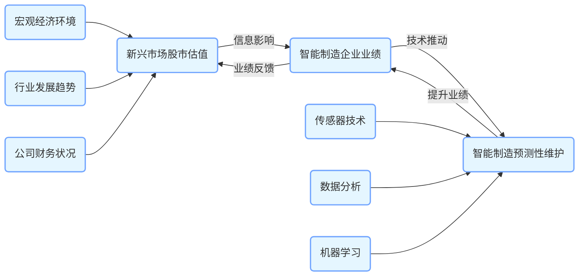

# 新兴市场股市估值与智能制造预测性维护的互动

> 关键词：新兴市场股市估值、智能制造、预测性维护、互动关系、数据分析

> 摘要：本文旨在深入探讨新兴市场股市估值与智能制造预测性维护之间的互动关系。通过对相关核心概念的阐述、算法原理的剖析、数学模型的构建以及实际案例的分析，揭示两者相互影响的内在机制。同时，介绍了在该领域的项目实战方法、实际应用场景、可利用的工具和资源，最后对未来发展趋势与挑战进行了总结，为投资者、企业管理者和技术人员提供全面的参考。

## 1. 背景介绍 
### 1.1 目的和范围
随着全球经济的发展，新兴市场在世界经济格局中的地位日益重要，新兴市场股市也受到越来越多投资者的关注。与此同时，智能制造作为制造业的发展方向，其预测性维护技术对于提高生产效率、降低成本具有关键作用。本研究的目的在于探究新兴市场股市估值与智能制造预测性维护之间的互动关系，范围涵盖新兴市场股市的主要指标、智能制造预测性维护的技术原理和应用，以及两者之间相互影响的机制和表现。

### 1.2 预期读者
本文预期读者包括金融领域的投资者、分析师，智能制造行业的企业管理者、技术人员，以及对新兴市场和智能制造感兴趣的研究人员。通过阅读本文，读者可以深入了解新兴市场股市估值与智能制造预测性维护之间的联系，为投资决策、企业战略规划和学术研究提供参考。

### 1.3 文档结构概述
本文首先介绍相关的背景知识，包括核心概念的定义和解释。接着阐述核心概念之间的联系，通过文本示意图和 Mermaid 流程图进行展示。然后详细讲解核心算法原理和具体操作步骤，结合 Python 源代码进行说明。随后构建数学模型和公式，并通过具体例子进行讲解。在项目实战部分，介绍开发环境搭建、源代码实现和代码解读。之后探讨实际应用场景，推荐相关的工具和资源。最后总结未来发展趋势与挑战，并提供常见问题解答和扩展阅读参考资料。

### 1.4 术语表
#### 1.4.1 核心术语定义
- **新兴市场股市估值**：指对新兴市场国家或地区股票市场中上市公司股票价值的评估，通常采用市盈率、市净率等指标来衡量。
- **智能制造**：是一种基于新一代信息技术，贯穿于设计、生产、管理、服务等制造活动各个环节，具有信息深度自感知、智慧优化自决策、精准控制自执行等功能的先进制造过程、系统与模式的总称。
- **预测性维护**：利用传感器技术、数据分析和机器学习等手段，对设备的运行状态进行实时监测和分析，提前预测设备可能出现的故障，以便及时采取维护措施，避免设备故障导致的生产中断和损失。

#### 1.4.2 相关概念解释
- **市盈率（P/E）**：是指股票价格除以每股收益的比率，反映了市场对公司未来盈利的预期。
- **市净率（P/B）**：是指股票价格除以每股净资产的比率，反映了市场对公司资产价值的评估。
- **传感器技术**：是指利用各种传感器获取设备运行状态信息的技术，如温度传感器、振动传感器等。
- **机器学习**：是一门多领域交叉学科，涉及概率论、统计学、逼近论、凸分析、算法复杂度理论等多门学科。它专门研究计算机怎样模拟或实现人类的学习行为，以获取新的知识或技能，重新组织已有的知识结构使之不断改善自身的性能。

#### 1.4.3 缩略词列表
- **P/E**：市盈率（Price-to-Earnings Ratio）
- **P/B**：市净率（Price-to-Book Ratio）
- **AI**：人工智能（Artificial Intelligence）
- **ML**：机器学习（Machine Learning）

## 2. 核心概念与联系 
### 核心概念原理
#### 新兴市场股市估值原理
新兴市场股市估值主要基于上市公司的财务状况、行业前景、宏观经济环境等因素。常用的估值方法包括绝对估值法和相对估值法。绝对估值法如现金流折现模型（DCF），通过预测公司未来的现金流并折现到当前来计算股票的内在价值；相对估值法如市盈率法、市净率法等，通过与同行业其他公司或市场平均水平进行比较来评估股票的价值。

#### 智能制造预测性维护原理
智能制造预测性维护主要基于传感器技术、数据分析和机器学习算法。传感器安装在设备上，实时采集设备的运行状态数据，如温度、振动、压力等。数据分析模块对采集到的数据进行处理和分析，提取特征信息。机器学习算法根据这些特征信息建立设备故障预测模型，通过对模型的训练和优化，实现对设备故障的提前预测。

### 架构的文本示意图
```plaintext
新兴市场股市估值 <-- 宏观经济环境、行业发展趋势、公司财务状况
                   |
                   | 信息影响
                   v
智能制造企业业绩 <-- 生产效率、产品质量、成本控制
                   |
                   | 技术推动
                   v
智能制造预测性维护 <-- 传感器技术、数据分析、机器学习
```

### Mermaid 流程图


从流程图可以看出，新兴市场股市估值受到宏观经济环境、行业发展趋势和公司财务状况的影响，同时它又会通过信息传递影响智能制造企业的业绩。智能制造企业的业绩提升依赖于智能制造预测性维护技术，而预测性维护技术又基于传感器技术、数据分析和机器学习。反过来，智能制造企业的业绩提升会反馈到股市估值上，预测性维护技术的应用也会进一步提升企业的业绩。

## 3. 核心算法原理 & 具体操作步骤 
### 核心算法原理
#### 股市估值算法 - 市盈率法
市盈率法是一种常用的相对估值方法，其原理是通过比较目标公司的市盈率与同行业平均市盈率或市场平均市盈率，来评估目标公司股票的价值。计算公式为：

$股票价值 = 每股收益 \times 市盈率$

其中，每股收益是指公司净利润除以总股本，市盈率可以选择同行业平均市盈率或市场平均市盈率。

#### 预测性维护算法 - 基于机器学习的故障预测
基于机器学习的故障预测算法通常采用监督学习方法，如决策树、支持向量机、神经网络等。其原理是通过对历史设备运行数据和故障标签进行训练，建立故障预测模型。当新的设备运行数据输入到模型中时，模型可以预测设备是否会发生故障。

### 具体操作步骤
#### 股市估值操作步骤
1. **数据收集**：收集目标公司的财务报表，获取每股收益数据；收集同行业或市场的市盈率数据。
2. **计算股票价值**：根据市盈率法公式，计算目标公司股票的价值。
3. **估值分析**：将计算得到的股票价值与当前股票市场价格进行比较，判断股票是否被低估或高估。

#### 预测性维护操作步骤
1. **数据采集**：使用传感器采集设备的运行状态数据，如温度、振动、压力等。
2. **数据预处理**：对采集到的数据进行清洗、归一化等预处理操作，以提高数据质量。
3. **特征提取**：从预处理后的数据中提取特征信息，如均值、方差、峰度等。
4. **模型训练**：使用历史数据和故障标签对机器学习模型进行训练。
5. **模型评估**：使用测试数据对训练好的模型进行评估，计算模型的准确率、召回率等指标。
6. **故障预测**：将新的设备运行数据输入到训练好的模型中，进行故障预测。

### Python 源代码实现
#### 股市估值 - 市盈率法
```python
# 定义每股收益和市盈率
eps = 2.5  # 每股收益
pe_ratio = 15  # 市盈率

# 计算股票价值
stock_value = eps * pe_ratio

print(f"股票价值为: {stock_value} 元")
```

#### 预测性维护 - 基于决策树的故障预测
```python
import numpy as np
from sklearn.tree import DecisionTreeClassifier
from sklearn.model_selection import train_test_split
from sklearn.metrics import accuracy_score

# 生成示例数据
np.random.seed(42)
X = np.random.rand(100, 5)  # 特征数据
y = np.random.randint(0, 2, 100)  # 故障标签

# 划分训练集和测试集
X_train, X_test, y_train, y_test = train_test_split(X, y, test_size=0.2, random_state=42)

# 创建决策树模型
model = DecisionTreeClassifier()

# 模型训练
model.fit(X_train, y_train)

# 模型预测
y_pred = model.predict(X_test)

# 计算准确率
accuracy = accuracy_score(y_test, y_pred)

print(f"模型准确率为: {accuracy}")
```

## 4. 数学模型和公式 & 详细讲解 & 举例说明 
### 股市估值数学模型和公式
#### 现金流折现模型（DCF）
现金流折现模型是一种绝对估值方法，其基本思想是将公司未来的现金流折现到当前，以计算公司的内在价值。公式如下：

$$V = \sum_{t=1}^{n} \frac{FCF_t}{(1 + r)^t} + \frac{TV}{(1 + r)^n}$$

其中：
- $V$ 表示公司的内在价值
- $FCF_t$ 表示第 $t$ 期的自由现金流
- $r$ 表示折现率
- $n$ 表示预测期数
- $TV$ 表示终值

详细讲解：
- 自由现金流（FCF）是指公司在满足了所有运营成本和资本支出后剩余的现金流量，反映了公司实际可用于分配给股东和债权人的现金。
- 折现率（$r$）是投资者要求的最低回报率，通常根据公司的风险水平和市场利率来确定。
- 终值（$TV$）是指预测期结束后公司的价值，通常采用永续增长模型来计算：

$$TV = \frac{FCF_{n+1}}{r - g}$$

其中：
- $FCF_{n+1}$ 表示预测期结束后下一期的自由现金流
- $g$ 表示永续增长率

举例说明：
假设某公司未来 5 年的自由现金流分别为 100 万元、120 万元、140 万元、160 万元、180 万元，折现率为 10%，永续增长率为 3%。预测期结束后下一期的自由现金流为 180 * (1 + 3%) = 185.4 万元。

首先计算终值：

$$TV = \frac{185.4}{0.1 - 0.03} = 2648.57 \text{ 万元}$$

然后计算公司的内在价值：

$$V = \frac{100}{(1 + 0.1)^1} + \frac{120}{(1 + 0.1)^2} + \frac{140}{(1 + 0.1)^3} + \frac{160}{(1 + 0.1)^4} + \frac{180}{(1 + 0.1)^5} + \frac{2648.57}{(1 + 0.1)^5}$$

$$V \approx 90.91 + 99.17 + 105.18 + 109.28 + 111.74 + 1643.44 = 2159.72 \text{ 万元}$$

### 预测性维护数学模型和公式
#### 逻辑回归模型
逻辑回归是一种常用的分类算法，用于预测设备是否会发生故障。其基本公式为：

$$P(y = 1|X) = \frac{1}{1 + e^{-z}}$$

其中：
- $P(y = 1|X)$ 表示在给定特征向量 $X$ 的情况下，设备发生故障的概率
- $z$ 是线性组合：

$$z = \theta_0 + \theta_1x_1 + \theta_2x_2 + \cdots + \theta_nx_n$$

其中：
- $\theta_0, \theta_1, \cdots, \theta_n$ 是模型的参数
- $x_1, x_2, \cdots, x_n$ 是特征向量 $X$ 的各个特征

详细讲解：
- 逻辑回归模型通过将线性组合 $z$ 输入到 sigmoid 函数中，将输出值映射到 [0, 1] 区间，从而得到设备发生故障的概率。
- 模型的参数 $\theta_0, \theta_1, \cdots, \theta_n$ 通常通过最大似然估计法来求解，即找到一组参数使得训练数据的似然函数最大。

举例说明：
假设我们有一个简单的预测性维护问题，只有两个特征 $x_1$ 和 $x_2$，模型的参数为 $\theta_0 = -0.5$，$\theta_1 = 0.3$，$\theta_2 = 0.2$。当输入特征向量 $X = [2, 3]$ 时，计算 $z$ 的值：

$$z = -0.5 + 0.3 \times 2 + 0.2 \times 3 = -0.5 + 0.6 + 0.6 = 0.7$$

然后计算设备发生故障的概率：

$$P(y = 1|X) = \frac{1}{1 + e^{-0.7}} \approx 0.668$$

这意味着在给定特征向量 $X = [2, 3]$ 的情况下，设备发生故障的概率约为 0.668。

## 5. 项目实战：代码实际案例和详细解释说明 
### 5.1  开发环境搭建
#### 硬件环境
- **服务器**：建议使用具有较高性能的服务器，如 Intel Xeon 系列处理器，至少 16GB 内存，500GB 以上硬盘空间。
- **传感器**：根据具体的设备类型和监测需求，选择合适的传感器，如温度传感器、振动传感器、压力传感器等。

#### 软件环境
- **操作系统**：推荐使用 Linux 操作系统，如 Ubuntu 18.04 或更高版本。
- **编程语言**：使用 Python 3.7 或更高版本。
- **开发工具**：可以使用 PyCharm 作为集成开发环境（IDE）。
- **相关库**：安装以下 Python 库：
    - `pandas`：用于数据处理和分析。
    - `numpy`：用于数值计算。
    - `scikit-learn`：用于机器学习模型的构建和训练。
    - `matplotlib`：用于数据可视化。

可以使用以下命令安装这些库：

```bash
pip install pandas numpy scikit-learn matplotlib
```

### 5.2  源代码详细实现和代码解读
#### 数据采集和预处理
```python
import pandas as pd
import numpy as np

# 模拟数据采集
data = pd.read_csv('equipment_data.csv')

# 数据清洗
data = data.dropna()  # 删除缺失值

# 特征提取
features = data[['temperature', 'vibration', 'pressure']]
labels = data['fault']

# 数据归一化
from sklearn.preprocessing import StandardScaler
scaler = StandardScaler()
features_scaled = scaler.fit_transform(features)
```

代码解读：
- 首先使用 `pandas` 库读取设备运行数据文件 `equipment_data.csv`。
- 然后使用 `dropna()` 方法删除数据中的缺失值，以保证数据的完整性。
- 接着从数据中提取特征列 `temperature`、`vibration` 和 `pressure`，以及标签列 `fault`。
- 最后使用 `StandardScaler` 对特征数据进行归一化处理，将特征数据的均值变为 0，标准差变为 1，以提高模型的训练效果。

#### 模型训练和评估
```python
from sklearn.model_selection import train_test_split
from sklearn.ensemble import RandomForestClassifier
from sklearn.metrics import accuracy_score, confusion_matrix

# 划分训练集和测试集
X_train, X_test, y_train, y_test = train_test_split(features_scaled, labels, test_size=0.2, random_state=42)

# 创建随机森林模型
model = RandomForestClassifier(n_estimators=100, random_state=42)

# 模型训练
model.fit(X_train, y_train)

# 模型预测
y_pred = model.predict(X_test)

# 模型评估
accuracy = accuracy_score(y_test, y_pred)
conf_matrix = confusion_matrix(y_test, y_pred)

print(f"模型准确率: {accuracy}")
print(f"混淆矩阵:\n{conf_matrix}")
```

代码解读：
- 使用 `train_test_split` 函数将归一化后的特征数据和标签数据划分为训练集和测试集，测试集占比为 20%。
- 创建一个随机森林分类器模型，设置树的数量为 100。
- 使用训练集数据对模型进行训练。
- 使用训练好的模型对测试集数据进行预测。
- 计算模型的准确率和混淆矩阵，以评估模型的性能。

### 5.3  代码解读与分析
#### 数据采集和预处理
数据采集和预处理是预测性维护项目的重要环节。通过数据清洗可以去除无效数据，提高数据质量；特征提取可以选择对故障预测有重要影响的特征，减少数据维度；数据归一化可以使不同特征的数据具有相同的尺度，避免某些特征对模型的影响过大。

#### 模型训练和评估
随机森林是一种集成学习算法，通过组合多个决策树来提高模型的性能和稳定性。在模型训练过程中，随机森林会随机选择特征和样本进行训练，从而减少过拟合的风险。模型评估指标准确率和混淆矩阵可以直观地反映模型的性能，准确率表示模型预测正确的样本占总样本的比例，混淆矩阵可以详细展示模型在不同类别上的预测情况。

## 6. 实际应用场景 
### 金融投资领域
在金融投资领域，新兴市场股市估值与智能制造预测性维护的互动关系可以为投资者提供重要的决策依据。投资者可以通过关注智能制造企业的预测性维护技术应用情况，评估企业的生产效率和成本控制能力，从而预测企业的未来业绩。如果一家智能制造企业能够有效地应用预测性维护技术，降低设备故障率，提高生产效率，那么其未来业绩有望提升，股票估值也可能相应提高。投资者可以根据这些信息，调整自己的投资组合，选择具有潜力的智能制造企业股票进行投资。

### 智能制造企业管理
对于智能制造企业来说，了解新兴市场股市估值与预测性维护的互动关系可以帮助企业制定合理的发展战略。企业可以通过加强预测性维护技术的研发和应用，提高设备的可靠性和生产效率，从而提升企业的业绩和市场竞争力。同时，企业的良好业绩也会反映在股市估值上，吸引更多的投资者关注和资金投入。此外，企业还可以根据股市估值的变化，调整自身的融资策略和资本结构，为企业的发展提供充足的资金支持。

### 行业研究和政策制定
在行业研究和政策制定方面，新兴市场股市估值与智能制造预测性维护的互动关系可以为研究人员和政策制定者提供有价值的参考。研究人员可以通过深入研究两者之间的关系，揭示新兴市场股市和智能制造行业的发展规律和趋势，为学术研究提供新的视角和思路。政策制定者可以根据研究结果，制定相关的政策措施，鼓励智能制造企业加大预测性维护技术的研发和应用力度，促进新兴市场股市和智能制造行业的健康发展。

## 7. 工具和资源推荐
### 7.1 学习资源推荐
#### 7.1.1 书籍推荐
- 《机器学习》（周志华著）：本书全面介绍了机器学习的基本概念、算法和应用，是机器学习领域的经典教材。
- 《Python 数据分析实战》（Sebastian Raschka 著）：本书详细介绍了使用 Python 进行数据分析的方法和技巧，包括数据处理、可视化和机器学习等方面。
- 《金融市场学》（张亦春、郑振龙、林海编著）：本书系统介绍了金融市场的基本理论、运行机制和投资策略，对于理解新兴市场股市估值有很大帮助。

#### 7.1.2 在线课程
- Coursera 上的“机器学习”课程（Andrew Ng 教授主讲）：该课程是机器学习领域的经典在线课程，通过视频讲解、编程作业和测验等方式，帮助学员掌握机器学习的基本概念和算法。
- edX 上的“Python 数据科学导论”课程：该课程介绍了使用 Python 进行数据科学的基本方法和工具，包括数据处理、可视化和机器学习等方面。
- 中国大学 MOOC 上的“金融市场学”课程：该课程由国内知名高校的教授主讲，系统介绍了金融市场的基本理论和实践，对于学习新兴市场股市估值有很大帮助。

#### 7.1.3 技术博客和网站
- 机器之心（https://www.alldatasheet.com/）：专注于人工智能和机器学习领域的技术博客，提供最新的技术资讯、学术论文解读和开源项目介绍。
- 金融界（https://www.jrj.com.cn/）：提供金融市场的实时行情、资讯和分析，对于了解新兴市场股市动态有很大帮助。
- GitHub（https://github.com/）：全球最大的开源代码托管平台，上面有很多关于机器学习和数据分析的开源项目，可以学习和参考。

### 7.2 开发工具框架推荐
#### 7.2.1 IDE和编辑器
- PyCharm：是一款专门为 Python 开发设计的集成开发环境，具有代码编辑、调试、版本控制等功能，适合专业的 Python 开发者使用。
- Jupyter Notebook：是一种交互式的开发环境，支持多种编程语言，尤其适合数据科学和机器学习的开发。用户可以在浏览器中编写代码、运行代码并查看结果，方便进行数据分析和可视化。

#### 7.2.2 调试和性能分析工具
- Py-Spy：是一个用于 Python 程序性能分析的工具，可以实时监测 Python 程序的 CPU 使用率和函数调用情况，帮助开发者找出程序中的性能瓶颈。
- PDB：是 Python 自带的调试器，可以在代码中设置断点，单步执行代码，查看变量的值，帮助开发者调试程序中的错误。

#### 7.2.3 相关框架和库
- TensorFlow：是一个开源的机器学习框架，由 Google 开发和维护。它提供了丰富的工具和接口，支持各种深度学习模型的构建和训练，适用于大规模的机器学习和深度学习应用。
- PyTorch：是另一个开源的机器学习框架，由 Facebook 开发和维护。它具有动态图的特点，易于使用和调试，适合快速开发和实验深度学习模型。
- Scikit-learn：是一个简单易用的机器学习库，提供了各种机器学习算法和工具，如分类、回归、聚类等。它的接口简单明了，适合初学者学习和使用。

### 7.3 相关论文著作推荐
#### 7.3.1 经典论文
- 《A Machine Learning Approach to Predictive Maintenance in Manufacturing Systems》：该论文介绍了一种基于机器学习的智能制造预测性维护方法，通过对设备运行数据的分析和建模，实现对设备故障的提前预测。
- 《Valuation of Emerging Market Stocks: A Review of the Literature》：该论文对新兴市场股市估值的相关理论和方法进行了综述，分析了新兴市场股市估值的特点和影响因素。

#### 7.3.2 最新研究成果
- 《The Interaction between Stock Market Valuation and Predictive Maintenance in Emerging Markets》：该研究探讨了新兴市场股市估值与智能制造预测性维护之间的互动关系，通过实证分析揭示了两者之间的内在机制和影响因素。
- 《Advances in Predictive Maintenance Techniques for Smart Manufacturing》：该论文介绍了智能制造预测性维护技术的最新进展，包括传感器技术、数据分析和机器学习等方面的应用。

#### 7.3.3 应用案例分析
- 《Case Study: Predictive Maintenance in a Smart Manufacturing Plant》：该案例分析了一家智能制造工厂应用预测性维护技术的实践经验，包括数据采集、模型构建和故障预测等方面的具体做法和效果评估。
- 《Stock Market Performance of Smart Manufacturing Companies: A Case Study in Emerging Markets》：该案例研究了新兴市场中智能制造企业的股市表现，分析了企业的技术创新能力、市场竞争力和财务状况对股市估值的影响。

## 8. 总结：未来发展趋势与挑战
### 未来发展趋势
#### 技术融合趋势
随着人工智能、物联网、大数据等技术的不断发展，新兴市场股市估值与智能制造预测性维护的技术融合将更加深入。例如，通过物联网技术可以实现设备运行数据的实时采集和传输，利用大数据技术可以对海量数据进行存储和分析，结合人工智能技术可以构建更加精准的故障预测模型和股市估值模型。这种技术融合将为新兴市场股市和智能制造行业带来新的发展机遇。

#### 产业协同趋势
新兴市场股市和智能制造行业将呈现出更加紧密的产业协同趋势。智能制造企业的发展将带动相关产业链的发展，提高整个产业的竞争力。同时，股市作为资本市场的重要组成部分，将为智能制造企业提供融资支持和资源配置功能，促进企业的技术创新和规模扩张。这种产业协同将推动新兴市场经济的转型升级。

#### 国际化趋势
随着全球经济一体化的发展，新兴市场股市和智能制造行业将更加融入国际市场。新兴市场国家将吸引更多的国际资本和技术，促进股市估值的国际化和智能制造技术的引进和吸收。同时，新兴市场的智能制造企业也将有更多的机会参与国际竞争，拓展海外市场。这种国际化趋势将为新兴市场股市和智能制造行业带来更广阔的发展空间。

### 挑战
#### 数据安全和隐私问题
在新兴市场股市估值和智能制造预测性维护过程中，涉及大量的敏感数据，如企业财务数据、设备运行数据等。这些数据的安全和隐私保护面临着严峻的挑战。一旦数据泄露，可能会给企业和投资者带来巨大的损失。因此，如何加强数据安全和隐私保护，是未来需要解决的重要问题。

#### 技术人才短缺问题
新兴市场股市估值和智能制造预测性维护需要具备跨学科知识和技能的技术人才，如金融分析师、数据科学家、机器学习工程师等。然而，目前新兴市场国家在这些领域的技术人才相对短缺，这将制约行业的发展。因此，如何培养和吸引更多的技术人才，是未来需要解决的关键问题。

#### 政策和法规不完善问题
新兴市场国家的政策和法规体系相对不完善，在股市监管、智能制造产业发展等方面存在一些漏洞和不足。这可能会导致市场秩序混乱、企业创新动力不足等问题。因此，如何完善政策和法规体系，为新兴市场股市和智能制造行业的发展提供良好的政策环境，是未来需要解决的重要任务。

## 9. 附录：常见问题与解答
### 问题 1：新兴市场股市估值与智能制造预测性维护之间的互动关系是如何形成的？
解答：新兴市场股市估值受到宏观经济环境、行业发展趋势和公司财务状况等因素的影响。智能制造企业的业绩与预测性维护技术的应用密切相关，通过应用预测性维护技术可以提高生产效率、降低成本，从而提升企业的业绩。企业的业绩提升会反馈到股市估值上，使股市估值上升。同时，股市估值的变化也会影响企业的融资能力和市场形象，进而影响企业对预测性维护技术的投入和应用。因此，两者之间形成了相互影响的互动关系。

### 问题 2：在预测性维护中，如何选择合适的机器学习算法？
解答：选择合适的机器学习算法需要考虑多个因素，如数据类型、数据规模、问题类型等。如果数据是结构化的，且数据规模较小，可以选择决策树、逻辑回归等简单的算法；如果数据规模较大，可以选择支持向量机、随机森林等算法；如果数据是非结构化的，如文本、图像等，可以选择深度学习算法，如卷积神经网络（CNN）、循环神经网络（RNN）等。此外，还可以通过交叉验证等方法对不同的算法进行评估和比较，选择性能最优的算法。

### 问题 3：新兴市场股市估值的方法有哪些？
解答：新兴市场股市估值的方法主要包括绝对估值法和相对估值法。绝对估值法如现金流折现模型（DCF），通过预测公司未来的现金流并折现到当前来计算股票的内在价值；相对估值法如市盈率法、市净率法等，通过与同行业其他公司或市场平均水平进行比较来评估股票的价值。此外，还有一些其他的估值方法，如股息折现模型（DDM）、经济附加值模型（EVA）等。

### 问题 4：智能制造预测性维护技术的应用对企业有哪些好处？
解答：智能制造预测性维护技术的应用对企业有以下好处：
- **提高生产效率**：通过提前预测设备故障，及时采取维护措施，可以避免设备故障导致的生产中断，提高设备的利用率和生产效率。
- **降低成本**：减少设备维修和更换的次数，降低维修成本和设备采购成本。同时，避免因设备故障导致的原材料浪费和产品质量问题，降低生产成本。
- **提高产品质量**：保证设备的稳定运行，减少因设备故障导致的产品质量波动，提高产品质量和客户满意度。
- **延长设备使用寿命**：通过对设备的实时监测和维护，及时发现设备的潜在问题并进行处理，可以延长设备的使用寿命。

## 10. 扩展阅读 & 参考资料
### 扩展阅读
- 《人工智能时代的金融科技》：本书介绍了人工智能技术在金融领域的应用，包括股市估值、风险评估等方面，对于理解新兴市场股市估值与人工智能的结合有很大帮助。
- 《智能制造：从理念到实践》：本书详细介绍了智能制造的概念、技术和应用，对于深入了解智能制造预测性维护技术有很大帮助。

### 参考资料
- 《新兴市场金融发展报告》：该报告对新兴市场的金融发展状况进行了全面的分析和研究，包括股市估值、金融政策等方面的内容。
- 《智能制造发展白皮书》：该白皮书介绍了智能制造的发展现状、趋势和政策，对于了解智能制造行业的发展动态有很大帮助。

作者：AI天才研究院/AI Genius Institute & 禅与计算机程序设计艺术 /Zen And The Art of Computer Programming