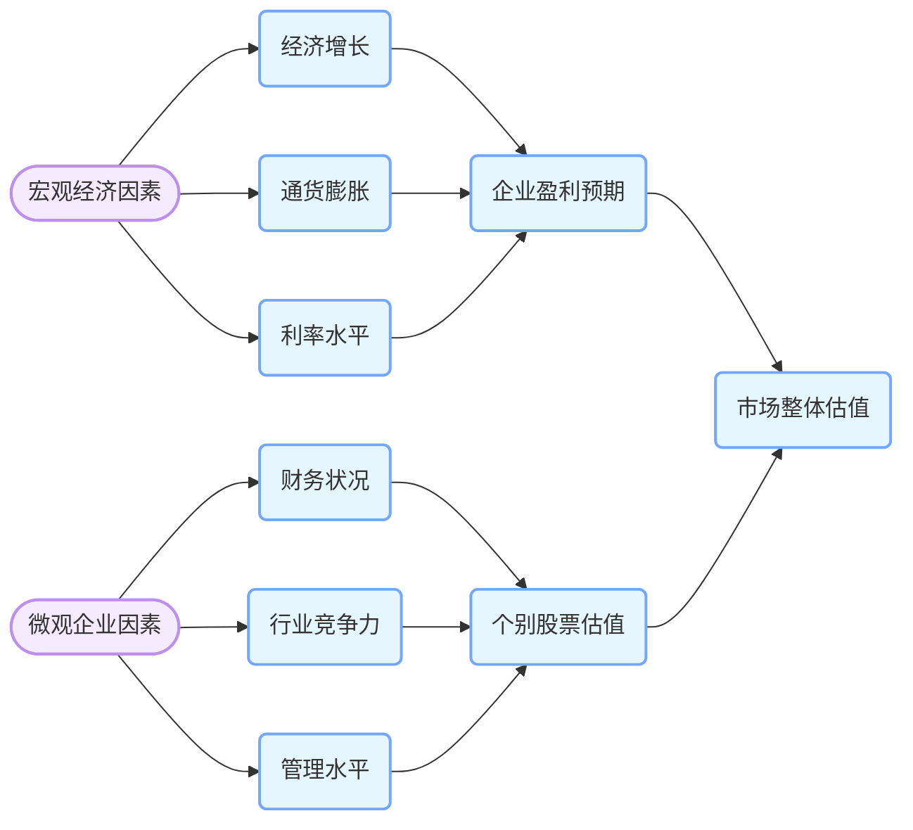
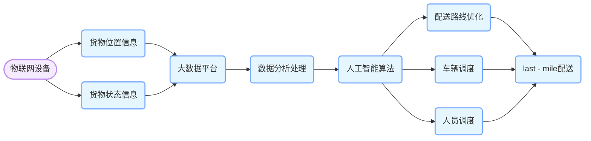

# 新兴市场股市估值与智能物流last-mile配送的互动

> 关键词：新兴市场股市估值、智能物流、last-mile配送、互动关系、经济影响

> 摘要：本文聚焦于新兴市场股市估值与智能物流last-mile配送之间的互动关系。首先介绍相关背景知识，明确目的、预期读者和文档结构。接着阐述核心概念，分析两者的联系。通过核心算法原理和具体操作步骤，结合数学模型与公式深入探究其互动机制。利用项目实战案例详细解释代码实现和分析。探讨实际应用场景，推荐相关工具和资源。最后总结未来发展趋势与挑战，解答常见问题并提供扩展阅读与参考资料，旨在为理解两者互动提供全面而深入的视角。

## 1. 背景介绍 
### 1.1 目的和范围
本研究旨在深入剖析新兴市场股市估值与智能物流last-mile配送之间的互动关系。新兴市场在全球经济格局中占据着日益重要的地位，其股市估值不仅反映了当地经济的发展状况，还受到多种内外因素的影响。智能物流的last-mile配送作为物流链条的最后一环，直接关系到客户体验和物流效率。研究两者的互动关系，有助于投资者更好地理解新兴市场股市的波动因素，也为物流企业制定战略提供参考。本研究的范围涵盖了新兴市场的主要经济体，分析相关数据和案例，以揭示两者之间的内在联系和影响机制。

### 1.2 预期读者
本文的预期读者包括金融投资者、物流行业从业者、经济研究人员以及对新兴市场和智能物流感兴趣的人士。对于金融投资者而言，了解新兴市场股市估值与智能物流last-mile配送的互动关系，有助于他们在投资决策中考虑更多的因素，提高投资的准确性和收益。物流行业从业者可以从中获取关于市场趋势和发展机遇的信息，优化物流配送策略。经济研究人员可以通过本文的数据和分析，深入研究新兴市场的经济结构和发展模式。而对新兴市场和智能物流感兴趣的人士则可以获得一个全面的视角，了解这两个领域的相互影响。

### 1.3 文档结构概述
本文将按照以下结构进行阐述：首先介绍背景知识，包括目的、预期读者和文档结构。接着深入探讨核心概念，分析新兴市场股市估值和智能物流last-mile配送的定义、特点以及两者之间的联系。通过核心算法原理和具体操作步骤，结合数学模型与公式，详细解释两者的互动机制。然后通过项目实战案例，展示代码实现和分析过程。探讨实际应用场景，为读者提供实际参考。推荐相关的工具和资源，帮助读者进一步学习和研究。最后总结未来发展趋势与挑战，解答常见问题并提供扩展阅读与参考资料。

### 1.4 术语表
#### 1.4.1 核心术语定义
- **新兴市场股市估值**：指对新兴市场中上市公司股票价值的评估，通常通过市盈率、市净率等指标来衡量。新兴市场是指那些经济发展较快、市场潜力较大但尚未达到发达市场水平的国家和地区的市场。
- **智能物流**：利用信息技术和智能化设备，实现物流过程的自动化、信息化和智能化，提高物流效率和服务质量。
- **last-mile配送**：物流配送过程中的最后一个环节，即从物流中心或配送站点将货物送到最终客户手中的过程。

#### 1.4.2 相关概念解释
- **市盈率（P/E Ratio）**：是指股票价格除以每股收益的比率，反映了投资者为获取公司每一元盈利所愿意支付的价格。
- **市净率（P/B Ratio）**：是指股票价格除以每股净资产的比率，用于评估股票的相对价值。
- **物联网（IoT）**：通过各种信息传感设备，如射频识别（RFID）、红外感应器、全球定位系统等，按约定的协议，把任何物品与互联网连接起来，进行信息交换和通信，以实现智能化识别、定位、跟踪、监控和管理的一种网络。

#### 1.4.3 缩略词列表
- **IoT**：Internet of Things（物联网）
- **RFID**：Radio Frequency Identification（射频识别）

## 2. 核心概念与联系 

### 新兴市场股市估值的原理和架构
新兴市场股市估值是一个复杂的过程，受到多种因素的影响。从宏观层面来看，经济增长、通货膨胀、利率水平等因素会影响整个市场的估值。例如，经济增长较快的新兴市场，企业的盈利预期通常较高，股市估值也会相应上升。从微观层面来看，公司的财务状况、行业竞争力、管理水平等因素会影响个别股票的估值。

下面是新兴市场股市估值的架构示意图：


### 智能物流last-mile配送的原理和架构
智能物流last-mile配送主要基于物联网、大数据、人工智能等技术，实现配送过程的智能化管理。首先，通过物联网设备实时获取货物的位置、状态等信息，将这些信息传输到大数据平台进行分析和处理。然后，利用人工智能算法优化配送路线、调度车辆和人员，提高配送效率和服务质量。

下面是智能物流last-mile配送的架构示意图：


### 两者之间的联系
新兴市场股市估值与智能物流last-mile配送之间存在着密切的联系。一方面，智能物流last-mile配送的发展状况会影响相关物流企业的业绩，进而影响新兴市场股市中物流板块的估值。例如，高效的last-mile配送可以提高客户满意度，增加企业的订单量和收入，从而提升企业的盈利能力和股市估值。另一方面，新兴市场股市的整体估值水平也会影响物流企业的融资能力和发展战略。当股市估值较高时，物流企业可以更容易地通过股权融资获得资金，用于扩大业务规模、升级技术设备等，进一步推动智能物流last-mile配送的发展。

## 3. 核心算法原理 & 具体操作步骤 

### 新兴市场股市估值算法原理及Python代码实现
新兴市场股市估值常用的方法之一是市盈率法。市盈率法的基本原理是根据同行业或可比公司的市盈率，结合目标公司的每股收益，计算出目标公司的股票价值。

```python
def pe_valuation(pe_ratio, eps):
    """
    市盈率法计算股票价值
    :param pe_ratio: 市盈率
    :param eps: 每股收益
    :return: 股票价值
    """
    return pe_ratio * eps

# 示例
pe_ratio = 20
eps = 2
stock_value = pe_valuation(pe_ratio, eps)
print(f"股票价值: {stock_value}")
```

### 智能物流last-mile配送路径优化算法原理及Python代码实现
智能物流last-mile配送路径优化问题可以抽象为旅行商问题（TSP）。TSP问题是指一个旅行商要遍历所有城市，每个城市只能访问一次，最后回到起始城市，求最短的旅行路径。这里我们使用模拟退火算法来解决TSP问题。

```python
import random
import math

def distance(point1, point2):
    """
    计算两点之间的欧几里得距离
    :param point1: 点1的坐标
    :param point2: 点2的坐标
    :return: 两点之间的距离
    """
    return math.sqrt((point1[0] - point2[0])**2 + (point1[1] - point2[1])**2)

def total_distance(path, points):
    """
    计算路径的总距离
    :param path: 路径
    :param points: 点的列表
    :return: 路径的总距离
    """
    dist = 0
    for i in range(len(path) - 1):
        dist += distance(points[path[i]], points[path[i + 1]])
    dist += distance(points[path[-1]], points[path[0]])
    return dist

def simulated_annealing(points, initial_temperature=1000, cooling_rate=0.99):
    """
    模拟退火算法求解TSP问题
    :param points: 点的列表
    :param initial_temperature: 初始温度
    :param cooling_rate: 冷却率
    :return: 最优路径和最小距离
    """
    num_points = len(points)
    current_path = list(range(num_points))
    random.shuffle(current_path)
    current_distance = total_distance(current_path, points)
    best_path = current_path.copy()
    best_distance = current_distance
    temperature = initial_temperature

    while temperature > 1e-8:
        new_path = current_path.copy()
        index1, index2 = random.sample(range(num_points), 2)
        new_path[index1], new_path[index2] = new_path[index2], new_path[index1]
        new_distance = total_distance(new_path, points)

        if new_distance < current_distance or random.random() < math.exp((current_distance - new_distance) / temperature):
            current_path = new_path
            current_distance = new_distance

            if current_distance < best_distance:
                best_path = current_path.copy()
                best_distance = current_distance

        temperature *= cooling_rate

    return best_path, best_distance

# 示例
points = [(0, 0), (1, 2), (3, 1), (4, 3)]
best_path, best_distance = simulated_annealing(points)
print(f"最优路径: {best_path}")
print(f"最小距离: {best_distance}")
```

### 具体操作步骤
1. **数据收集**：收集新兴市场股市的相关数据，如上市公司的财务报表、市盈率、市净率等，以及智能物流last-mile配送的相关数据，如配送站点的位置、货物的配送需求等。
2. **数据预处理**：对收集到的数据进行清洗、整理和转换，使其适合后续的分析和计算。
3. **算法应用**：根据上述算法原理，使用Python代码进行股市估值和路径优化计算。
4. **结果分析**：对计算结果进行分析，评估新兴市场股市估值和智能物流last-mile配送的状况，并分析两者之间的互动关系。

## 4. 数学模型和公式 & 详细讲解 & 举例说明 

### 新兴市场股市估值的数学模型和公式
#### 市盈率法
市盈率法计算股票价值的公式为：
$$V = P/E \times EPS$$
其中，$V$ 表示股票价值，$P/E$ 表示市盈率，$EPS$ 表示每股收益。

例如，某新兴市场上市公司的市盈率为20，每股收益为2元，则该公司的股票价值为：
$$V = 20 \times 2 = 40$$（元）

#### 市净率法
市净率法计算股票价值的公式为：
$$V = P/B \times BVPS$$
其中，$V$ 表示股票价值，$P/B$ 表示市净率，$BVPS$ 表示每股净资产。

例如，某新兴市场上市公司的市净率为3，每股净资产为5元，则该公司的股票价值为：
$$V = 3 \times 5 = 15$$（元）

### 智能物流last-mile配送路径优化的数学模型和公式
#### 旅行商问题（TSP）的数学模型
设 $n$ 个配送站点的坐标为 $(x_i, y_i)$，$i = 1, 2, \cdots, n$，路径为 $p = (p_1, p_2, \cdots, p_n)$，其中 $p_i$ 表示第 $i$ 个访问的站点编号。路径的总距离为：
$$D(p) = \sum_{i = 1}^{n - 1} d(p_i, p_{i + 1}) + d(p_n, p_1)$$
其中，$d(p_i, p_j)$ 表示站点 $p_i$ 和站点 $p_j$ 之间的距离，通常采用欧几里得距离：
$$d(p_i, p_j) = \sqrt{(x_{p_i} - x_{p_j})^2 + (y_{p_i} - y_{p_j})^2}$$

TSP问题的目标是找到一条路径 $p^*$，使得总距离 $D(p^*)$ 最小，即：
$$p^* = \arg\min_{p} D(p)$$

#### 模拟退火算法的公式
模拟退火算法中，判断是否接受新解的概率公式为：
$$P = \begin{cases}
1, & \text{if } \Delta E < 0 \\
e^{-\frac{\Delta E}{T}}, & \text{if } \Delta E \geq 0
\end{cases}$$
其中，$\Delta E$ 表示新解和当前解的能量差（在TSP问题中，能量差即为距离差），$T$ 表示当前温度。

例如，当前路径的总距离为 $D_1$，新路径的总距离为 $D_2$，则 $\Delta E = D_2 - D_1$。如果 $\Delta E < 0$，则直接接受新路径；如果 $\Delta E \geq 0$，则以概率 $e^{-\frac{\Delta E}{T}}$ 接受新路径。

## 5. 项目实战：代码实际案例和详细解释说明 

### 5.1  开发环境搭建
本项目使用Python进行开发，需要安装以下库：
- `numpy`：用于数值计算
- `matplotlib`：用于数据可视化

可以使用以下命令进行安装：
```sh
pip install numpy matplotlib
```

### 5.2  源代码详细实现和代码解读
#### 新兴市场股市估值模拟
```python
import numpy as np
import matplotlib.pyplot as plt

# 模拟不同市盈率和每股收益下的股票价值
pe_ratios = np.linspace(10, 30, 100)
eps_values = np.linspace(1, 5, 100)
pe_ratios, eps_values = np.meshgrid(pe_ratios, eps_values)

stock_values = pe_ratios * eps_values

# 绘制三维图
fig = plt.figure()
ax = fig.add_subplot(111, projection='3d')
ax.plot_surface(pe_ratios, eps_values, stock_values, cmap='viridis')
ax.set_xlabel('市盈率')
ax.set_ylabel('每股收益')
ax.set_zlabel('股票价值')
plt.show()
```
代码解读：
- 首先，使用 `np.linspace` 生成不同的市盈率和每股收益值。
- 然后，使用 `np.meshgrid` 创建二维网格，方便计算不同组合下的股票价值。
- 接着，根据市盈率法计算股票价值。
- 最后，使用 `matplotlib` 绘制三维图，直观展示市盈率、每股收益和股票价值之间的关系。

#### 智能物流last-mile配送路径优化模拟
```python
import random
import math
import matplotlib.pyplot as plt

# 生成随机配送站点坐标
num_points = 10
points = [(random.randint(0, 100), random.randint(0, 100)) for _ in range(num_points)]

# 模拟退火算法求解TSP问题
def distance(point1, point2):
    return math.sqrt((point1[0] - point2[0])**2 + (point1[1] - point2[1])**2)

def total_distance(path, points):
    dist = 0
    for i in range(len(path) - 1):
        dist += distance(points[path[i]], points[path[i + 1]])
    dist += distance(points[path[-1]], points[path[0]])
    return dist

def simulated_annealing(points, initial_temperature=1000, cooling_rate=0.99):
    num_points = len(points)
    current_path = list(range(num_points))
    random.shuffle(current_path)
    current_distance = total_distance(current_path, points)
    best_path = current_path.copy()
    best_distance = current_distance
    temperature = initial_temperature

    while temperature > 1e-8:
        new_path = current_path.copy()
        index1, index2 = random.sample(range(num_points), 2)
        new_path[index1], new_path[index2] = new_path[index2], new_path[index1]
        new_distance = total_distance(new_path, points)

        if new_distance < current_distance or random.random() < math.exp((current_distance - new_distance) / temperature):
            current_path = new_path
            current_distance = new_distance

            if current_distance < best_distance:
                best_path = current_path.copy()
                best_distance = current_distance

        temperature *= cooling_rate

    return best_path, best_distance

best_path, best_distance = simulated_annealing(points)

# 绘制路径图
x = [points[i][0] for i in best_path] + [points[best_path[0]][0]]
y = [points[i][1] for i in best_path] + [points[best_path[0]][1]]
plt.plot(x, y, 'o-')
plt.title(f'最优路径，最小距离: {best_distance:.2f}')
plt.show()
```
代码解读：
- 首先，生成随机的配送站点坐标。
- 然后，定义距离计算函数和总距离计算函数。
- 接着，实现模拟退火算法求解TSP问题，找到最优路径和最小距离。
- 最后，使用 `matplotlib` 绘制最优路径图，直观展示配送路径。

### 5.3  代码解读与分析
#### 新兴市场股市估值模拟
通过绘制三维图，我们可以直观地看到市盈率、每股收益和股票价值之间的关系。当市盈率和每股收益都较高时，股票价值也会相应较高。这表明投资者在评估新兴市场股市时，需要同时考虑公司的盈利能力（每股收益）和市场对公司的估值水平（市盈率）。

#### 智能物流last-mile配送路径优化模拟
模拟退火算法通过不断地尝试新的路径，并根据一定的概率接受更差的解，从而避免陷入局部最优解。最终找到的最优路径可以有效降低配送成本，提高配送效率。通过绘制路径图，我们可以直观地看到配送站点之间的连接顺序，为实际的物流配送提供参考。

## 6. 实际应用场景 
### 金融投资领域
投资者可以根据新兴市场股市估值与智能物流last-mile配送的互动关系，调整投资组合。当智能物流last-mile配送行业发展前景良好时，相关物流企业的业绩有望提升，从而带动股市中物流板块的估值上升。投资者可以适当增加对物流板块的投资。同时，新兴市场股市的整体估值水平也会影响投资者的风险偏好和投资策略。当股市估值较高时，投资者可能会更加谨慎，选择更具防御性的投资组合。

### 物流行业
物流企业可以根据新兴市场股市的估值情况，制定融资和发展战略。当股市估值较高时，企业可以通过股权融资获得资金，用于扩大业务规模、升级技术设备，提高智能物流last-mile配送的效率和服务质量。同时，物流企业也可以通过优化last-mile配送路径，降低成本，提高盈利能力，从而提升企业在股市中的估值。

### 政府政策制定
政府可以通过制定相关政策，促进新兴市场股市和智能物流last-mile配送的协同发展。例如，政府可以出台税收优惠政策，鼓励物流企业加大对智能物流技术的研发和应用，提高last-mile配送的效率。同时，政府也可以加强对新兴市场股市的监管，维护市场的稳定和健康发展，为物流企业的融资和发展提供良好的环境。

## 7. 工具和资源推荐
### 7.1 学习资源推荐
#### 7.1.1 书籍推荐
- 《新兴市场投资》：全面介绍了新兴市场的投资环境、风险和机会，对于理解新兴市场股市估值具有重要的参考价值。
- 《智能物流技术与应用》：详细讲解了智能物流的相关技术和应用案例，包括last-mile配送的优化方法。
- 《算法导论》：经典的算法书籍，对于理解和实现模拟退火算法等优化算法非常有帮助。

#### 7.1.2 在线课程
- Coursera上的“新兴市场经济学”课程：由知名教授授课，深入讲解新兴市场的经济发展和金融市场。
- edX上的“智能物流系统设计与管理”课程：系统介绍智能物流的设计原理和管理方法。
- Udemy上的“Python算法与数据结构”课程：帮助学习者掌握Python编程和算法实现。

#### 7.1.3 技术博客和网站
- 东方财富网：提供新兴市场股市的实时行情、分析报告等信息。
- 物流沙龙：专注于物流行业的资讯和技术分享，有很多关于智能物流的文章。
- GitHub：可以找到很多开源的算法实现和项目案例，对于学习和实践非常有帮助。

### 7.2 开发工具框架推荐
#### 7.2.1 IDE和编辑器
- PyCharm：功能强大的Python集成开发环境，提供代码编辑、调试、版本控制等功能。
- Jupyter Notebook：交互式的编程环境，适合进行数据分析和代码演示。

#### 7.2.2 调试和性能分析工具
- PDB：Python自带的调试工具，可以帮助开发者定位和解决代码中的问题。
- cProfile：Python的性能分析工具，可以分析代码的运行时间和资源消耗。

#### 7.2.3 相关框架和库
- NumPy：用于数值计算和数组处理，是Python科学计算的基础库。
- Pandas：用于数据处理和分析，提供了高效的数据结构和数据操作方法。
- Scikit-learn：机器学习库，提供了各种机器学习算法和工具，可用于股市估值预测等任务。

### 7.3 相关论文著作推荐
#### 7.3.1 经典论文
- “Emerging Markets and Global Financial Stability”：探讨了新兴市场在全球金融体系中的地位和影响。
- “Intelligent Logistics Systems: A Review”：对智能物流系统的发展现状和趋势进行了全面的综述。
- “The Traveling Salesman Problem: A Guided Tour of Combinatorial Optimization”：深入研究了旅行商问题的求解方法和理论。

#### 7.3.2 最新研究成果
- 可以通过学术数据库，如IEEE Xplore、ACM Digital Library等，搜索关于新兴市场股市估值和智能物流last-mile配送的最新研究论文。

#### 7.3.3 应用案例分析
- 一些行业报告和商业杂志会发布关于新兴市场股市和智能物流的应用案例分析，如麦肯锡、波士顿咨询等公司的报告。

## 8. 总结：未来发展趋势与挑战
### 未来发展趋势
#### 新兴市场股市估值
随着新兴市场国家经济的不断发展和金融市场的逐步完善，新兴市场股市的估值将更加合理和稳定。同时，随着科技的进步和创新，新兴市场中的科技企业和新兴产业将逐渐崛起，为股市带来新的增长点。

#### 智能物流last-mile配送
智能物流last-mile配送将朝着更加智能化、自动化和绿色化的方向发展。物联网、大数据、人工智能等技术将得到更广泛的应用，实现配送过程的实时监控和优化。同时，无人机、无人车等新型配送工具的应用也将逐渐普及，提高配送效率和服务质量。

### 挑战
#### 新兴市场股市估值
新兴市场股市面临着政策风险、汇率风险、市场波动等挑战。政策的不确定性可能会影响企业的经营和股市的估值。汇率波动可能会导致投资者的资产价值发生变化。市场波动可能会引发投资者的恐慌情绪，导致股市的大幅下跌。

#### 智能物流last-mile配送
智能物流last-mile配送面临着技术成本高、数据安全、法律法规等挑战。智能物流技术的研发和应用需要大量的资金投入，对于一些中小企业来说可能难以承受。数据安全问题可能会导致客户信息泄露和物流系统的瘫痪。法律法规的不完善可能会限制新型配送工具的应用和发展。

## 9. 附录：常见问题与解答
### 问题1：新兴市场股市估值与发达市场股市估值有什么区别？
解答：新兴市场股市估值通常受到经济发展速度、政治稳定性、市场成熟度等因素的影响，波动较大。相比之下，发达市场股市估值相对较为稳定，受到宏观经济因素的影响更为明显。此外，新兴市场股市的市盈率和市净率可能会高于或低于发达市场，具体取决于市场的供求关系和投资者的预期。

### 问题2：智能物流last-mile配送的优化算法有哪些？
解答：常见的智能物流last-mile配送优化算法包括旅行商问题（TSP）的求解算法，如模拟退火算法、遗传算法、蚁群算法等。此外，还有车辆路径规划算法（VRP），可以考虑车辆的容量、行驶时间等因素，进一步优化配送方案。

### 问题3：新兴市场股市估值与智能物流last-mile配送的互动关系是否会受到其他因素的影响？
解答：是的，两者的互动关系会受到多种因素的影响，如宏观经济环境、政策法规、技术创新等。例如，宏观经济环境的恶化可能会导致新兴市场股市估值下降，同时也会影响物流企业的业务需求和盈利能力。政策法规的变化可能会对智能物流last-mile配送的发展产生限制或促进作用，进而影响相关企业的股市估值。

## 10. 扩展阅读 & 参考资料
### 扩展阅读
- 《金融炼金术》：探讨了金融市场的运行规律和投资者的心理行为，对于理解新兴市场股市的波动具有一定的启示。
- 《物流管理》：全面介绍了物流管理的理论和实践，包括物流配送的各个环节。

### 参考资料
- World Bank: World Development Indicators
- International Monetary Fund: Global Financial Stability Report
- IEEE Transactions on Intelligent Transportation Systems
- ACM Transactions on Intelligent Systems and Technology

作者：AI天才研究院/AI Genius Institute & 禅与计算机程序设计艺术 /Zen And The Art of Computer Programming