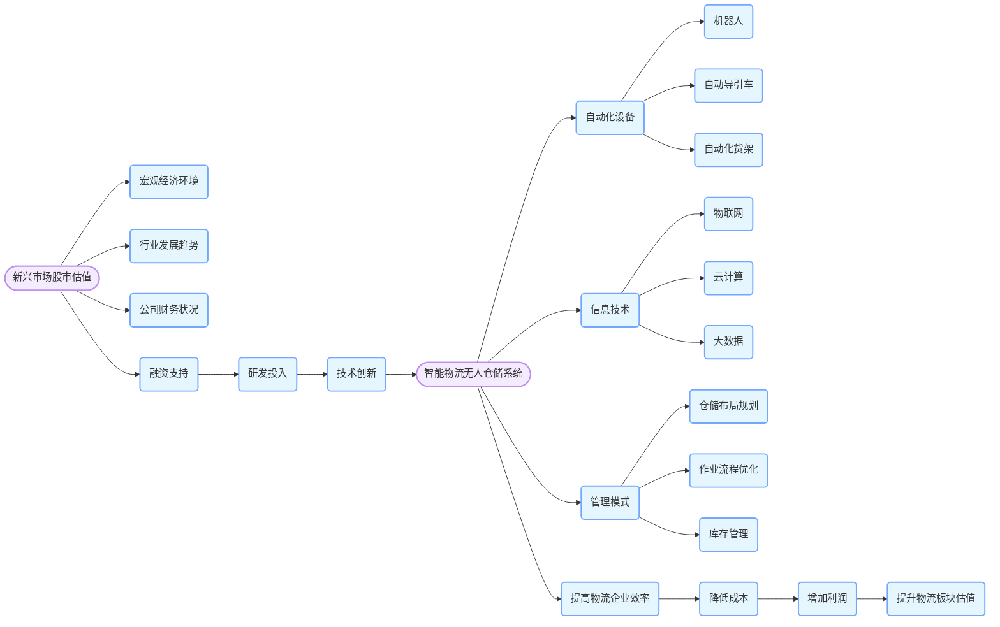

# 新兴市场股市估值与智能物流无人仓储系统的互动

> 关键词：新兴市场股市估值、智能物流、无人仓储系统、互动关系、金融科技、物流科技、经济趋势

> 摘要：本文聚焦于新兴市场股市估值与智能物流无人仓储系统之间的互动关系。首先介绍了研究的背景、目的、预期读者等内容。接着阐述了新兴市场股市估值和智能物流无人仓储系统的核心概念及联系，深入分析了相关的核心算法原理与操作步骤，通过数学模型和公式对二者关系进行量化解读。以实际项目案例展示二者互动的具体表现，并探讨了其在不同场景下的应用。推荐了相关的学习资源、开发工具框架以及论文著作。最后总结了未来发展趋势与挑战，解答常见问题并提供扩展阅读和参考资料，旨在全面深入地剖析二者的互动机制，为相关领域的研究和实践提供有价值的参考。

## 1. 背景介绍 
### 1.1 目的和范围
本研究的主要目的在于深入探究新兴市场股市估值与智能物流无人仓储系统之间的相互作用关系。新兴市场作为全球经济增长的重要力量，其股市估值的波动不仅反映了市场的经济状况，还受到众多行业发展的影响。智能物流无人仓储系统作为物流行业的前沿技术，正逐渐改变着传统物流的运作模式，对相关企业的业绩和市场竞争力产生重要影响，进而可能影响新兴市场股市的估值。

研究范围涵盖新兴市场的主要股市，包括亚洲、非洲、拉丁美洲等地区具有代表性的股票市场。同时，涉及智能物流无人仓储系统的各个环节，如自动化设备、信息技术、管理模式等方面的发展与变革。

### 1.2 预期读者
本文预期读者包括金融领域的投资者、分析师、研究人员，他们可以通过了解新兴市场股市估值与智能物流无人仓储系统的互动关系，更好地把握投资机会，进行风险评估和资产配置。物流行业的从业者、企业管理者能够从中获取关于技术发展对行业影响的信息，为企业战略决策提供参考。此外，对金融科技和物流科技交叉领域感兴趣的学者和学生也可以从本文中获得有价值的研究思路和知识。

### 1.3 文档结构概述
本文将按照以下结构展开：首先介绍背景信息，包括研究目的、预期读者和文档结构概述等。接着阐述新兴市场股市估值和智能物流无人仓储系统的核心概念及其联系，通过文本示意图和 Mermaid 流程图进行直观展示。然后深入分析核心算法原理和具体操作步骤，结合 Python 源代码进行详细说明。再运用数学模型和公式对二者的互动关系进行量化分析，并举例说明。通过项目实战案例展示二者互动的实际表现，包括开发环境搭建、源代码实现和代码解读。探讨实际应用场景，为相关行业的实践提供参考。推荐学习资源、开发工具框架和相关论文著作。最后总结未来发展趋势与挑战，解答常见问题并提供扩展阅读和参考资料。

### 1.4 术语表
#### 1.4.1 核心术语定义
- **新兴市场**：指发展中国家或地区的股票市场，通常具有较高的经济增长率、快速的工业化进程和不断增长的市场潜力，但也伴随着较高的风险和波动性。
- **股市估值**：对股票市场中上市公司的价值进行评估的过程和结果，常用的估值方法包括市盈率（P/E）、市净率（P/B）等。
- **智能物流**：利用信息技术、自动化技术和人工智能等手段，实现物流过程的智能化、自动化和高效化，提高物流服务的质量和效率。
- **无人仓储系统**：一种高度自动化的仓储管理系统，通过自动化设备（如机器人、自动导引车等）和信息技术实现货物的存储、搬运、分拣等操作，减少人工干预。

#### 1.4.2 相关概念解释
- **金融科技**：指利用科技手段创新金融业务模式、提高金融服务效率和降低金融风险的领域，涵盖了人工智能、区块链、大数据等多种技术在金融领域的应用。
- **物流科技**：指将科技手段应用于物流行业，推动物流行业的数字化、智能化和自动化发展的领域，包括物联网、机器人技术、云计算等技术在物流环节的应用。

#### 1.4.3 缩略词列表
- **P/E**：市盈率（Price-to-Earnings Ratio）
- **P/B**：市净率（Price-to-Book Ratio）
- **IoT**：物联网（Internet of Things）
- **AI**：人工智能（Artificial Intelligence）
- **AGV**：自动导引车（Automated Guided Vehicle）

## 2. 核心概念与联系 
### 新兴市场股市估值
新兴市场股市估值是对新兴市场中上市公司价值的综合评估。其受到多种因素的影响，包括宏观经济环境、行业发展趋势、公司财务状况等。宏观经济环境如 GDP 增长率、通货膨胀率、利率等会影响整个市场的资金供求和投资者信心，进而影响股市估值。行业发展趋势则决定了不同行业上市公司的增长潜力和盈利能力，例如科技、消费等行业的发展前景较好，其相关上市公司的估值可能相对较高。公司财务状况如营业收入、净利润、资产负债表等是评估公司价值的重要依据。

### 智能物流无人仓储系统
智能物流无人仓储系统是物流行业的创新技术，旨在提高仓储管理的效率和准确性。它主要由自动化设备、信息技术和管理模式三部分组成。自动化设备包括机器人、自动导引车、自动化货架等，能够实现货物的自动存储、搬运和分拣。信息技术如物联网、云计算、大数据等，用于实现设备的远程监控、数据的实时采集和分析。管理模式则涉及仓储布局规划、作业流程优化、库存管理等方面，确保整个仓储系统的高效运行。

### 二者的联系
智能物流无人仓储系统的发展对新兴市场股市估值具有重要影响。一方面，智能物流无人仓储系统的应用可以提高物流企业的运营效率，降低成本，增加利润，从而提升相关企业的市场竞争力和价值，进而影响新兴市场股市中物流板块的估值。另一方面，新兴市场股市的估值变化也会影响智能物流无人仓储系统的发展。当股市估值上升时，物流企业可以更容易地通过融资获得资金，加大对智能物流无人仓储系统的研发和应用投入，推动技术的发展和创新。

### 文本示意图
```plaintext
新兴市场股市估值
|-- 宏观经济环境
|   |-- GDP 增长率
|   |-- 通货膨胀率
|   |-- 利率
|-- 行业发展趋势
|   |-- 科技行业
|   |-- 消费行业
|   |-- 物流行业
|-- 公司财务状况
|   |-- 营业收入
|   |-- 净利润
|   |-- 资产负债表

智能物流无人仓储系统
|-- 自动化设备
|   |-- 机器人
|   |-- 自动导引车
|   |-- 自动化货架
|-- 信息技术
|   |-- 物联网
|   |-- 云计算
|   |-- 大数据
|-- 管理模式
|   |-- 仓储布局规划
|   |-- 作业流程优化
|   |-- 库存管理

互动关系
|-- 智能物流无人仓储系统 -> 新兴市场股市估值
|   |-- 提高物流企业效率
|   |-- 降低成本
|   |-- 增加利润
|-- 新兴市场股市估值 -> 智能物流无人仓储系统
|   |-- 融资支持
|   |-- 研发投入
|   |-- 技术创新
```

### Mermaid 流程图


## 3. 核心算法原理 & 具体操作步骤 
### 核心算法原理
为了分析新兴市场股市估值与智能物流无人仓储系统的互动关系，我们可以采用时间序列分析和回归分析的方法。时间序列分析可以用于分析二者随时间的变化趋势，找出潜在的周期性和趋势性特征。回归分析则可以建立二者之间的数学模型，量化它们之间的关系。

### Python 源代码实现
```python
import pandas as pd
import numpy as np
import matplotlib.pyplot as plt
from statsmodels.tsa.stattools import adfuller
from statsmodels.tsa.arima.model import ARIMA
from sklearn.linear_model import LinearRegression

# 模拟新兴市场股市估值数据
np.random.seed(0)
stock_valuation = np.random.randn(100).cumsum() + 100
# 模拟智能物流无人仓储系统发展指标数据
logistics_system = np.random.randn(100).cumsum() + 50

# 时间序列分析：平稳性检验
def test_stationarity(timeseries):
    # 执行 Dickey-Fuller 检验
    result = adfuller(timeseries)
    print('ADF Statistic: {}'.format(result[0]))
    print('p-value: {}'.format(result[1]))
    print('Critical Values:')
    for key, value in result[4].items():
        print('\t{}: {}'.format(key, value))
    if result[1] <= 0.05:
        print("数据平稳")
    else:
        print("数据不平稳")

print("新兴市场股市估值数据平稳性检验：")
test_stationarity(stock_valuation)
print("智能物流无人仓储系统数据平稳性检验：")
test_stationarity(logistics_system)

# 时间序列分析：ARIMA 模型拟合
def arima_fit(timeseries, p, d, q):
    model = ARIMA(timeseries, order=(p, d, q))
    model_fit = model.fit()
    return model_fit

stock_model_fit = arima_fit(stock_valuation, 1, 1, 1)
logistics_model_fit = arima_fit(logistics_system, 1, 1, 1)

# 回归分析：建立二者关系模型
X = logistics_system.reshape(-1, 1)
y = stock_valuation
model = LinearRegression()
model.fit(X, y)

# 输出回归模型参数
print("回归模型斜率：", model.coef_[0])
print("回归模型截距：", model.intercept_)

# 绘制数据和回归直线
plt.scatter(X, y)
plt.plot(X, model.predict(X), color='red')
plt.xlabel('智能物流无人仓储系统发展指标')
plt.ylabel('新兴市场股市估值')
plt.title('新兴市场股市估值与智能物流无人仓储系统关系')
plt.show()
```

### 具体操作步骤
1. **数据收集**：收集新兴市场股市估值数据和智能物流无人仓储系统发展指标数据。股市估值数据可以从金融数据提供商获取，如 Bloomberg、Wind 等。智能物流无人仓储系统发展指标数据可以通过行业报告、企业调研等方式收集。
2. **数据预处理**：对收集到的数据进行清洗、缺失值处理和异常值处理，确保数据的质量。
3. **时间序列分析**：对股市估值数据和智能物流无人仓储系统发展指标数据进行平稳性检验，若数据不平稳，则进行差分处理使其平稳。然后使用 ARIMA 模型对数据进行拟合，找出数据的变化趋势。
4. **回归分析**：将智能物流无人仓储系统发展指标数据作为自变量，新兴市场股市估值数据作为因变量，建立线性回归模型，量化二者之间的关系。
5. **模型评估**：使用均方误差（MSE）、决定系数（R²）等指标对回归模型进行评估，判断模型的拟合效果。
6. **结果分析**：根据回归模型的参数和评估结果，分析新兴市场股市估值与智能物流无人仓储系统之间的互动关系。

## 4. 数学模型和公式 & 详细讲解 & 举例说明 
### 时间序列分析模型
#### ARIMA 模型
ARIMA（Autoregressive Integrated Moving Average）模型是一种常用的时间序列预测模型，其数学表达式为：

$$
(1 - \sum_{i=1}^{p} \phi_i B^i)(1 - B)^d X_t = (1 + \sum_{j=1}^{q} \theta_j B^j) \epsilon_t
$$

其中，$X_t$ 是时间序列数据，$B$ 是滞后算子，$p$ 是自回归阶数，$d$ 是差分阶数，$q$ 是移动平均阶数，$\phi_i$ 是自回归系数，$\theta_j$ 是移动平均系数，$\epsilon_t$ 是白噪声序列。

#### 详细讲解
- **自回归部分（AR）**：表示当前时刻的值与过去若干时刻的值之间的线性关系，通过自回归系数 $\phi_i$ 来体现。
- **差分部分（I）**：用于处理非平稳时间序列，通过差分操作将非平稳序列转换为平稳序列。
- **移动平均部分（MA）**：表示当前时刻的值与过去若干时刻的白噪声之间的线性关系，通过移动平均系数 $\theta_j$ 来体现。

#### 举例说明
假设我们有一个时间序列数据 $X_t$，经过平稳性检验发现数据不平稳，进行一阶差分后数据平稳。我们可以选择 $p = 1$，$d = 1$，$q = 1$ 的 ARIMA 模型进行拟合。通过最大似然估计等方法估计出自回归系数 $\phi_1$ 和移动平均系数 $\theta_1$，就可以得到具体的 ARIMA 模型。

### 回归分析模型
#### 线性回归模型
线性回归模型的数学表达式为：

$$
y = \beta_0 + \beta_1 x + \epsilon
$$

其中，$y$ 是因变量（新兴市场股市估值），$x$ 是自变量（智能物流无人仓储系统发展指标），$\beta_0$ 是截距，$\beta_1$ 是斜率，$\epsilon$ 是误差项。

#### 详细讲解
- **截距 $\beta_0$**：表示当自变量 $x$ 为 0 时，因变量 $y$ 的取值。
- **斜率 $\beta_1$**：表示自变量 $x$ 每增加一个单位，因变量 $y$ 的平均变化量。
- **误差项 $\epsilon$**：表示模型无法解释的随机误差。

#### 举例说明
假设我们通过回归分析得到截距 $\beta_0 = 50$，斜率 $\beta_1 = 2$。这意味着当智能物流无人仓储系统发展指标为 0 时，新兴市场股市估值的预测值为 50。当智能物流无人仓储系统发展指标每增加 1 个单位，新兴市场股市估值平均增加 2 个单位。

## 5. 项目实战：代码实际案例和详细解释说明 
### 5.1  开发环境搭建
#### 安装 Python
首先需要安装 Python 环境，建议使用 Python 3.7 及以上版本。可以从 Python 官方网站（https://www.python.org/downloads/） 下载安装包，按照安装向导进行安装。

#### 安装必要的库
使用以下命令安装项目所需的库：
```sh
pip install pandas numpy matplotlib statsmodels scikit-learn
```

### 5.2  源代码详细实现和代码解读
```python
import pandas as pd
import numpy as np
import matplotlib.pyplot as plt
from statsmodels.tsa.stattools import adfuller
from statsmodels.tsa.arima.model import ARIMA
from sklearn.linear_model import LinearRegression

# 模拟新兴市场股市估值数据
np.random.seed(0)
stock_valuation = np.random.randn(100).cumsum() + 100
# 模拟智能物流无人仓储系统发展指标数据
logistics_system = np.random.randn(100).cumsum() + 50

# 时间序列分析：平稳性检验
def test_stationarity(timeseries):
    # 执行 Dickey-Fuller 检验
    result = adfuller(timeseries)
    print('ADF Statistic: {}'.format(result[0]))
    print('p-value: {}'.format(result[1]))
    print('Critical Values:')
    for key, value in result[4].items():
        print('\t{}: {}'.format(key, value))
    if result[1] <= 0.05:
        print("数据平稳")
    else:
        print("数据不平稳")

print("新兴市场股市估值数据平稳性检验：")
test_stationarity(stock_valuation)
print("智能物流无人仓储系统数据平稳性检验：