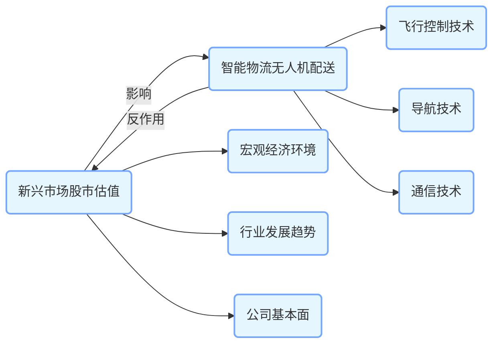

# 新兴市场股市估值与智能物流无人机配送的互动

> 关键词：新兴市场股市估值、智能物流、无人机配送、互动关系、金融科技、物流创新、市场趋势

> 摘要：本文聚焦于新兴市场股市估值与智能物流无人机配送之间的互动关系。首先阐述了新兴市场股市估值的重要性及其影响因素，以及智能物流无人机配送的发展现状与前景。接着深入分析两者之间的相互作用机制，包括无人机配送技术发展对新兴市场相关企业股市估值的影响，以及股市估值变化对无人机配送产业发展的反作用。通过数学模型、实际案例和算法原理的详细讲解，揭示了两者互动的内在逻辑。最后探讨了其实际应用场景、推荐了相关工具和资源，并对未来发展趋势与挑战进行了总结，旨在为投资者、物流从业者和相关研究人员提供全面且深入的参考。

## 1. 背景介绍 
### 1.1 目的和范围
本研究旨在深入探究新兴市场股市估值与智能物流无人机配送之间的互动关系。新兴市场在全球经济格局中扮演着日益重要的角色，其股市估值的波动不仅反映了市场的经济状况，还受到多种新兴产业发展的影响。智能物流无人机配送作为物流领域的创新技术，具有巨大的发展潜力，它的发展与新兴市场股市的表现存在着紧密的联系。本研究的范围涵盖了新兴市场的界定、股市估值的评估方法、无人机配送技术的原理与应用，以及两者之间相互影响的具体机制和实际案例分析。

### 1.2 预期读者
本文预期读者包括金融领域的投资者、分析师，他们可以通过了解新兴市场股市估值与无人机配送产业的互动关系，更好地把握投资机会，进行资产配置。物流行业的从业者，如物流企业的管理者、技术研发人员等，能够从股市估值的角度了解无人机配送技术的市场前景和发展趋势，为企业的战略决策提供参考。同时，对于研究金融与物流交叉领域的学者和研究人员，本文也提供了丰富的理论和实证分析内容，有助于他们深入开展相关研究。

### 1.3 文档结构概述
本文首先介绍了研究的背景、目的和预期读者，明确了研究的方向和受众范围。接着阐述了新兴市场股市估值和智能物流无人机配送的核心概念及其联系，通过文本示意图和 Mermaid 流程图直观展示其内在逻辑。然后详细讲解了相关的核心算法原理和具体操作步骤，使用 Python 源代码进行了详细阐述。随后，给出了数学模型和公式，并结合实际例子进行了详细讲解。在项目实战部分，通过具体的代码案例和详细解释，展示了两者互动在实际应用中的体现。之后探讨了实际应用场景，为读者提供了实际应用的参考。接着推荐了相关的工具和资源，包括学习资源、开发工具框架和相关论文著作。最后总结了未来发展趋势与挑战，并提供了常见问题与解答以及扩展阅读和参考资料，方便读者进一步深入学习和研究。

### 1.4 术语表
#### 1.4.1 核心术语定义
- **新兴市场**：指的是发展中国家或地区的金融市场，这些市场通常具有较高的经济增长率和发展潜力，但同时也伴随着较高的风险和不确定性。新兴市场的股市在全球金融市场中逐渐占据重要地位，吸引了大量的国际投资者。
- **股市估值**：是对股票市场中上市公司价值的评估，通过各种估值方法，如市盈率、市净率等，来判断股票价格是否合理，以及整个股市的投资价值。股市估值受到宏观经济环境、行业发展趋势、公司基本面等多种因素的影响。
- **智能物流**：利用现代信息技术实现物流信息的智能化管理和决策，提高物流运作的效率和效益。智能物流涵盖了物流的各个环节，包括仓储、运输、配送等，通过物联网、大数据、人工智能等技术实现物流的自动化、智能化和可视化。
- **无人机配送**：是智能物流的一种创新应用模式，利用无人机作为运输工具，实现货物的快速、高效配送。无人机配送具有不受地形限制、速度快、成本低等优势，在一些特定场景下具有广阔的应用前景。

#### 1.4.2 相关概念解释
- **金融科技**：是金融与科技的融合，通过利用现代信息技术创新金融业务模式和服务方式。在新兴市场股市估值与智能物流无人机配送的互动中，金融科技发挥着重要作用，如利用大数据分析技术来评估股市估值，利用区块链技术保障物流信息的安全和可追溯性。
- **物流创新**：指的是在物流领域中引入新的技术、方法和商业模式，以提高物流效率、降低成本、提升服务质量。智能物流无人机配送就是物流创新的典型代表，它打破了传统物流配送的局限，为物流行业带来了新的发展机遇。

#### 1.4.3 缩略词列表
- **AI**：Artificial Intelligence，人工智能
- **IoT**：Internet of Things，物联网
- **PE**：Price-to-Earnings Ratio，市盈率
- **PB**：Price-to-Book Ratio，市净率

## 2. 核心概念与联系 
### 新兴市场股市估值
新兴市场股市估值是对新兴市场中上市公司股票价值的评估。其影响因素主要包括宏观经济环境、行业发展趋势、公司基本面等。宏观经济环境方面，新兴市场的经济增长率、通货膨胀率、利率水平等都会对股市估值产生影响。例如，经济增长率较高时，企业的盈利预期增加，股市估值往往会上升；而通货膨胀率过高或利率上升可能会导致股市估值下降。行业发展趋势也是影响股市估值的重要因素，新兴产业如智能物流无人机配送等的发展前景会吸引投资者的关注，从而影响相关企业的股市估值。公司基本面包括公司的盈利能力、资产质量、管理水平等，良好的公司基本面会支撑较高的股市估值。

### 智能物流无人机配送
智能物流无人机配送是利用无人机技术实现货物配送的一种创新模式。其核心技术包括无人机的飞行控制技术、导航技术、通信技术等。无人机的飞行控制技术确保无人机能够稳定、安全地飞行，导航技术使其能够准确地到达目的地，通信技术则保证了无人机与地面控制中心之间的信息传输。智能物流无人机配送的优势在于能够提高配送效率、降低成本、减少人力依赖，尤其适用于一些交通不便或紧急配送的场景。

### 两者的联系
新兴市场股市估值与智能物流无人机配送之间存在着密切的联系。一方面，智能物流无人机配送技术的发展会影响新兴市场相关企业的股市估值。当无人机配送技术取得重大突破或应用范围扩大时，相关企业的盈利预期增加，投资者对其前景看好，会推动其股价上涨，从而提高股市估值。另一方面，新兴市场股市估值的变化也会对无人机配送产业的发展产生反作用。如果股市估值上升，相关企业能够获得更多的资金支持，用于技术研发、设备采购和市场拓展，从而促进无人机配送产业的发展；反之，如果股市估值下降，企业的融资难度增加，可能会影响无人机配送产业的发展进程。

### 文本示意图
```plaintext
新兴市场股市估值 <----> 智能物流无人机配送
|                      |
| 宏观经济环境        | 飞行控制技术
| 行业发展趋势        | 导航技术
| 公司基本面          | 通信技术
```

### Mermaid 流程图


## 3. 核心算法原理 & 具体操作步骤 
### 新兴市场股市估值算法原理
在评估新兴市场股市估值时，常用的方法之一是市盈率法。市盈率（PE）是指股票价格与每股收益的比率，计算公式为：

$PE = \frac{P}{EPS}$

其中，$P$ 表示股票价格，$EPS$ 表示每股收益。市盈率法的基本原理是通过比较不同股票或整个股市的市盈率水平，来判断其估值的高低。一般来说，市盈率较低的股票或股市可能被低估，具有投资价值；而市盈率较高的股票或股市可能被高估，存在投资风险。

### Python 代码实现
```python
# 定义计算市盈率的函数
def calculate_pe(stock_price, earnings_per_share):
    if earnings_per_share == 0:
        return None
    else:
        return stock_price / earnings_per_share

# 示例数据
stock_price = 50
earnings_per_share = 2

# 计算市盈率
pe = calculate_pe(stock_price, earnings_per_share)

if pe is not None:
    print(f"该股票的市盈率为: {pe}")
else:
    print("每股收益为 0，无法计算市盈率。")
```

### 智能物流无人机配送路径规划算法原理
在智能物流无人机配送中，路径规划是一个关键问题。常用的路径规划算法之一是 A* 算法。A* 算法是一种启发式搜索算法，它通过综合考虑从起点到当前节点的实际代价和从当前节点到目标节点的估计代价，来寻找最优路径。

### Python 代码实现
```python
import heapq

# 定义节点类
class Node:
    def __init__(self, x, y, g=float('inf'), h=float('inf'), parent=None):
        self.x = x
        self.y = y
        self.g = g  # 从起点到当前节点的实际代价
        self.h = h  # 从当前节点到目标节点的估计代价
        self.f = g + h  # 总代价
        self.parent = parent

    def __lt__(self, other):
        return self.f < other.f

# 定义 A* 算法函数
def a_star(start, goal, grid):
    rows, cols = len(grid), len(grid[0])
    open_list = []
    closed_set = set()

    start_node = Node(start[0], start[1], g=0)
    start_node.h = heuristic(start, goal)
    start_node.f = start_node.g + start_node.h
    heapq.heappush(open_list, start_node)

    while open_list:
        current_node = heapq.heappop(open_list)

        if (current_node.x, current_node.y) == goal:
            path = []
            while current_node:
                path.append((current_node.x, current_node.y))
                current_node = current_node.parent
            return path[::-1]

        closed_set.add((current_node.x, current_node.y))

        neighbors = get_neighbors(current_node, grid)
        for neighbor in neighbors:
            if (neighbor.x, neighbor.y) in closed_set:
                continue

            tentative_g = current_node.g + 1

            if tentative_g < neighbor.g:
                neighbor.parent = current_node
                neighbor.g = tentative_g
                neighbor.h = heuristic((neighbor.x, neighbor.y), goal)
                neighbor.f = neighbor.g + neighbor.h

                if neighbor not in open_list:
                    heapq.heappush(open_list, neighbor)

    return None

# 定义启发式函数（曼哈顿距离）
def heuristic(a, b):
    return abs(a[0] - b[0]) + abs(a[1] - b[1])

# 定义获取邻居节点的函数
def get_neighbors(node, grid):
    rows, cols = len(grid), len(grid[0])
    neighbors = []
    directions = [(0, 1), (0, -1), (1, 0), (-1, 0)]

    for dx, dy in directions:
        new_x, new_y = node.x + dx, node.y + dy
        if 0 <= new_x < rows and 0 <= new_y < cols and grid[new_x][new_y] == 0:
            neighbors.append(Node(new_x, new_y))

    return neighbors

# 示例网格地图
grid = [
    [0, 0, 0, 0],
    [0, 1, 1, 0],
    [0, 0, 0, 0],
    [0, 0, 0, 0]
]

start = (0, 0)
goal = (3, 3)

# 调用 A* 算法进行路径规划
path = a_star(start, goal, grid)

if path:
    print("找到路径:", path)
else:
    print("未找到路径。")
```

### 具体操作步骤
1. **新兴市场股市估值计算步骤**
    - 收集股票价格和每股收益数据。
    - 检查每股收益是否为 0，如果为 0 则无法计算市盈率，否则使用上述公式计算市盈率。
    - 根据市盈率水平判断股票或股市的估值高低。
2. **智能物流无人机配送路径规划步骤**
    - 定义网格地图，其中 0 表示可通行区域，1 表示障碍物。
    - 确定起点和目标点。
    - 初始化开放列表和关闭集合。
    - 将起点节点加入开放列表。
    - 循环执行以下操作，直到开放列表为空或找到目标节点：
        - 从开放列表中取出总代价最小的节点作为当前节点。
        - 如果当前节点是目标节点，回溯路径并返回。
        - 将当前节点加入关闭集合。
        - 计算当前节点的邻居节点。
        - 对于每个邻居节点，如果不在关闭集合中，计算其总代价并更新开放列表。

## 4. 数学模型和公式 & 详细讲解 & 举例说明 
### 新兴市场股市估值数学模型
除了市盈率法，还可以使用市净率法来评估新兴市场股市估值。市净率（PB）是指股票价格与每股净资产的比率，计算公式为：

$PB = \frac{P}{BVPS}$

其中，$P$ 表示股票价格，$BVPS$ 表示每股净资产。市净率法的基本原理是通过比较不同股票或整个股市的市净率水平，来判断其估值的高低。一般来说，市净率较低的股票或股市可能被低估，具有投资价值；而市净率较高的股票或股市可能被高估，存在投资风险。

### 举例说明
假设某新兴市场上市公司的股票价格为 30 元，每股净资产为 10 元，则该股票的市净率为：

$PB = \frac{30}{10} = 3$

如果该行业的平均市净率为 2，那么该股票的市净率高于行业平均水平，可能被高估。

### 智能物流无人机配送数学模型
在智能物流无人机配送中，需要考虑无人机的飞行时间和能耗。假设无人机的飞行速度为 $v$，从起点到目标点的距离为 $d$，则飞行时间 $t$ 可以表示为：

$t = \frac{d}{v}$

无人机的能耗 $E$ 与飞行时间和飞行功率 $P$ 有关，计算公式为：

$E = P \times t$

### 举例说明
假设无人机的飞行速度为 5 m/s，从起点到目标点的距离为 100 m，则飞行时间为：

$t = \frac{100}{5} = 20 s$

如果无人机的飞行功率为 100 W，则能耗为：

$E = 100 \times 20 = 2000 J$

## 5. 项目实战：代码实际案例和详细解释说明 
### 5.1  开发环境搭建
#### 安装 Python
首先需要安装 Python 开发环境。可以从 Python 官方网站（https://www.python.org/downloads/） 下载适合自己操作系统的 Python 版本，并按照安装向导进行安装。

#### 安装必要的库
在本项目中，需要使用一些 Python 库，如 `numpy`、`matplotlib` 等。可以使用以下命令进行安装：

```sh
pip install numpy matplotlib
```

### 5.2  源代码详细实现和代码解读
#### 新兴市场股市估值模拟
```python
import numpy as np
import matplotlib.pyplot as plt

# 模拟股票价格和每股收益数据
np.random.seed(42)
num_stocks = 100
stock_prices = np.random.uniform(10, 100, num_stocks)
earnings_per_share = np.random.uniform(1, 10, num_stocks)

# 计算市盈率
pe_ratios = stock_prices / earnings_per_share

# 绘制市盈率分布直方图
plt.hist(pe_ratios, bins=20, edgecolor='black')
plt.xlabel('市盈率')
plt.ylabel('股票数量')
plt.title('新兴市场股票市盈率分布')
plt.show()
```

**代码解读**：
- 首先，使用 `numpy` 库生成了 100 只股票的随机价格和每股收益数据。
- 然后，计算了每只股票的市盈率。
- 最后，使用 `matplotlib` 库绘制了市盈率分布的直方图，直观地展示了新兴市场股票市盈率的分布情况。

#### 智能物流无人机配送路径规划可视化
```python
import numpy as np
import matplotlib.pyplot as plt

# 示例网格地图
grid = np.array([
    [0, 0, 0, 0],
    [0, 1, 1, 0],
    [0, 0, 0, 0],
    [0, 0, 0, 0]
])

start = (0, 0)
goal = (3, 3)

# 调用 A* 算法进行路径规划
path = a_star(start, goal, grid)

# 可视化网格地图和路径
plt.imshow(grid, cmap='gray')
plt.title('智能物流无人机配送路径规划')

if path:
    path_x = [p[0] for p in path]
    path_y = [p[1] for p in path]
    plt.plot(path_y, path_x, 'r-', linewidth=2)

plt.show()
```

**代码解读**：
- 定义了一个示例网格地图和起点、目标点。
- 调用之前实现的 A* 算法进行路径规划。
- 使用 `matplotlib` 库可视化网格地图和规划的路径，其中红色线条表示无人机的飞行路径。

### 5.3  代码解读与分析
#### 新兴市场股市估值模拟分析
通过模拟股票价格和每股收益数据，并计算市盈率，我们可以直观地看到新兴市场股票市盈率的分布情况。这有助于投资者了解市场的估值水平，判断股票是否被高估或低估。如果市盈率分布集中在较低水平，说明市场整体估值较低，可能存在投资机会；反之，如果市盈率分布集中在较高水平，说明市场整体估值较高，投资风险可能较大。

#### 智能物流无人机配送路径规划分析
通过可视化网格地图和规划的路径，我们可以直观地看到无人机的飞行路径是否合理。如果路径能够避开障碍物，并且尽量缩短飞行距离，说明路径规划算法的效果较好。同时，我们还可以通过调整网格地图的参数和起点、目标点的位置，来测试路径规划算法的鲁棒性和适应性。

## 6. 实际应用场景 
### 金融投资领域
投资者可以通过分析新兴市场股市估值与智能物流无人机配送产业的互动关系，来调整自己的投资组合。当无人机配送技术取得重大突破或应用范围扩大时，相关企业的股市估值可能上升，投资者可以适时买入这些企业的股票，以获取投资收益。同时，投资者还可以关注新兴市场股市估值的变化对无人机配送产业的反作用，如果股市估值下降，相关企业的融资难度增加，可能会影响无人机配送产业的发展进程，投资者需要谨慎评估投资风险。

### 物流行业
物流企业可以根据新兴市场股市估值的变化来调整自己的发展战略。如果股市估值上升，企业可以获得更多的资金支持，用于技术研发、设备采购和市场拓展，加快无人机配送技术的应用和推广。同时，物流企业还可以通过优化无人机配送路径规划，提高配送效率，降低成本，从而提高企业的竞争力和市场估值。

### 政府政策制定
政府可以通过制定相关政策来促进新兴市场股市估值与智能物流无人机配送产业的良性互动。例如，政府可以出台税收优惠政策，鼓励企业加大对无人机配送技术的研发投入；可以加强对新兴市场股市的监管，维护市场的稳定和健康发展；还可以制定相关标准和规范，保障无人机配送的安全和可靠性。

## 7. 工具和资源推荐
### 7.1 学习资源推荐
#### 7.1.1 书籍推荐
- 《金融市场学》：系统介绍了金融市场的基本原理和运行机制，对于理解新兴市场股市估值具有重要的参考价值。
- 《物流技术与装备》：详细介绍了物流领域的各种技术和装备，包括无人机配送技术，有助于深入了解智能物流的发展趋势。
- 《Python 数据分析实战》：通过实际案例介绍了 Python 在数据分析中的应用，对于学习如何使用 Python 进行股市估值计算和无人机配送路径规划具有很大的帮助。

#### 7.1.2 在线课程
- Coursera 上的“金融市场分析”课程：由知名教授授课，系统讲解了金融市场的分析方法和工具，对于提升金融分析能力非常有帮助。
- edX 上的“智能物流与供应链管理”课程：介绍了智能物流的最新技术和应用，包括无人机配送技术，适合物流行业的从业者和相关研究人员学习。
- 慕课网上的“Python 数据分析入门”课程：从零开始介绍 Python 数据分析的基础知识和技能，适合初学者学习。

#### 7.1.3 技术博客和网站
- 金融界网站：提供了丰富的金融市场资讯和分析报告，对于了解新兴市场股市的动态非常有帮助。
- 物流时代周刊官网：专注于物流行业的报道和分析，涵盖了智能物流无人机配送等最新技术的发展动态。
- 博客园、CSDN 等技术博客平台：有很多关于 Python 编程和数据分析的技术文章，对于学习相关技术非常有帮助。

### 7.2 开发工具框架推荐
#### 7.2.1 IDE和编辑器
- PyCharm：一款功能强大的 Python 集成开发环境，提供了代码编辑、调试、版本控制等一系列功能，适合专业的 Python 开发者使用。
- Visual Studio Code：一款轻量级的代码编辑器，支持多种编程语言，通过安装相关插件可以实现 Python 开发的各种功能，具有很高的灵活性和扩展性。

#### 7.2.2 调试和性能分析工具
- PySnooper：一个简单易用的 Python 调试工具，可以自动记录函数的调用过程和变量的值，方便开发者进行调试和排查问题。
- cProfile：Python 自带的性能分析工具，可以分析程序的运行时间和函数调用次数，帮助开发者找出性能瓶颈。

#### 7.2.3 相关框架和库
- Pandas：一个强大的数据分析库，提供了数据结构和数据处理功能，适合处理和分析股市估值数据。
- Scikit-learn：一个常用的机器学习库，提供了各种机器学习算法和工具，可用于股市估值预测和无人机配送路径优化等问题。
- DroneKit：一个开源的无人机开发框架，提供了与无人机通信和控制的接口，方便开发者进行无人机配送系统的开发。

### 7.3 相关论文著作推荐
#### 7.3.1 经典论文
- Fama, E. F., & French, K. R. (1992). The cross-section of expected stock returns. The Journal of Finance, 47(2), 427-465. 该论文提出了著名的 Fama-French 三因子模型，对于理解股票收益率的影响因素具有重要的理论意义。
- Dijkstra, E. W. (1959). A note on two problems in connexion with graphs. Numerische Mathematik, 1(1), 269-271. 该论文提出了 Dijkstra 算法，是图论中经典的最短路径算法，为无人机配送路径规划提供了重要的理论基础。

#### 7.3.2 最新研究成果
- 近年来，关于新兴市场股市估值和智能物流无人机配送的研究不断涌现。例如，一些研究通过实证分析探讨了新兴市场股市估值的影响因素和变化趋势；另一些研究则关注无人机配送技术的优化和应用，如无人机的编队飞行、多目标路径规划等。这些最新研究成果可以通过学术数据库，如 IEEE Xplore、ACM Digital Library 等进行查找。

#### 7.3.3 应用案例分析
- 一些企业已经在智能物流无人机配送领域取得了成功的应用案例。例如，亚马逊的 Prime Air 项目，通过无人机实现了快速的货物配送；京东的无人机配送项目，在农村地区和偏远地区进行了试点应用，取得了良好的效果。这些应用案例可以通过企业的官方网站、新闻报道等渠道进行了解。

## 8. 总结：未来发展趋势与挑战
### 未来发展趋势
- **技术创新推动**：随着人工智能、物联网、区块链等技术的不断发展，智能物流无人机配送技术将不断创新和完善。例如，无人机的自主飞行能力将进一步提高，能够更好地适应复杂的环境；物流信息的管理和决策将更加智能化，提高物流运作的效率和效益。
- **市场需求增长**：随着电子商务的快速发展和消费者对配送效率的要求不断提高，智能物流无人机配送的市场需求将不断增长。特别是在一些交通不便或紧急配送的场景下，无人机配送具有广阔的应用前景。
- **产业融合加速**：新兴市场股市估值与智能物流无人机配送产业的融合将加速。一方面，无人机配送产业的发展将推动相关企业的股市估值上升；另一方面，股市估值的变化也将影响无人机配送产业的发展进程。两者之间的互动将更加紧密，形成良性循环。

### 挑战
- **技术难题**：智能物流无人机配送技术还面临一些技术难题，如无人机的飞行安全、通信稳定性、续航能力等。解决这些技术难题需要不断的研发投入和技术创新。
- **法律法规限制**：目前，各国对于无人机的使用都有严格的法律法规限制。智能物流无人机配送需要遵守相关的法律法规，解决空域管理、安全监管等问题，这给无人机配送的推广和应用带来了一定的挑战。
- **市场竞争激烈**：随着智能物流无人机配送市场的不断发展，市场竞争将日益激烈。企业需要不断提高自身的技术水平和服务质量，降低成本，以提高市场竞争力。

## 9. 附录：常见问题与解答
### 新兴市场股市估值受哪些因素影响？
新兴市场股市估值受宏观经济环境、行业发展趋势、公司基本面等多种因素影响。宏观经济环境包括经济增长率、通货膨胀率、利率水平等；行业发展趋势如新兴产业的发展前景会吸引投资者的关注；公司基本面包括公司的盈利能力、资产质量、管理水平等。

### 智能物流无人机配送有哪些优势和挑战？
优势包括提高配送效率、降低成本、减少人力依赖，尤其适用于交通不便或紧急配送的场景。挑战包括技术难题，如飞行安全、通信稳定性、续航能力等；法律法规限制，如空域管理、安全监管等；市场竞争激烈等。

### 如何计算新兴市场股市估值？
常用的方法有市盈率法和市净率法。市盈率（PE）是股票价格与每股收益的比率，市净率（PB）是股票价格与每股净资产的比率。计算公式分别为 $PE = \frac{P}{EPS}$ 和 $PB = \frac{P}{BVPS}$。

### 智能物流无人机配送路径规划有哪些算法？
常用的算法有 A* 算法、Dijkstra 算法等。A* 算法是一种启发式搜索算法，通过综合考虑从起点到当前节点的实际代价和从当前节点到目标节点的估计代价，来寻找最优路径。

## 10. 扩展阅读 & 参考资料
- [1] 博迪, 凯恩, 马库斯. 投资学[M]. 机械工业出版社, 2019.
- [2] 唐纳德·沃特斯. 物流管理[M]. 电子工业出版社, 2014.
- [3] 李航. 统计学习方法（第 2 版）[M]. 清华大学出版社, 2019.
- [4] IEEE  Transactions on Intelligent Transportation Systems. 该期刊发表了很多关于智能物流和无人机技术的研究论文。
- [5] ACM Transactions on Sensor Networks. 该期刊关注传感器网络和物联网技术，对于了解智能物流无人机配送的相关技术有很大的帮助。

作者：AI天才研究院/AI Genius Institute & 禅与计算机程序设计艺术 /Zen And The Art of Computer Programming