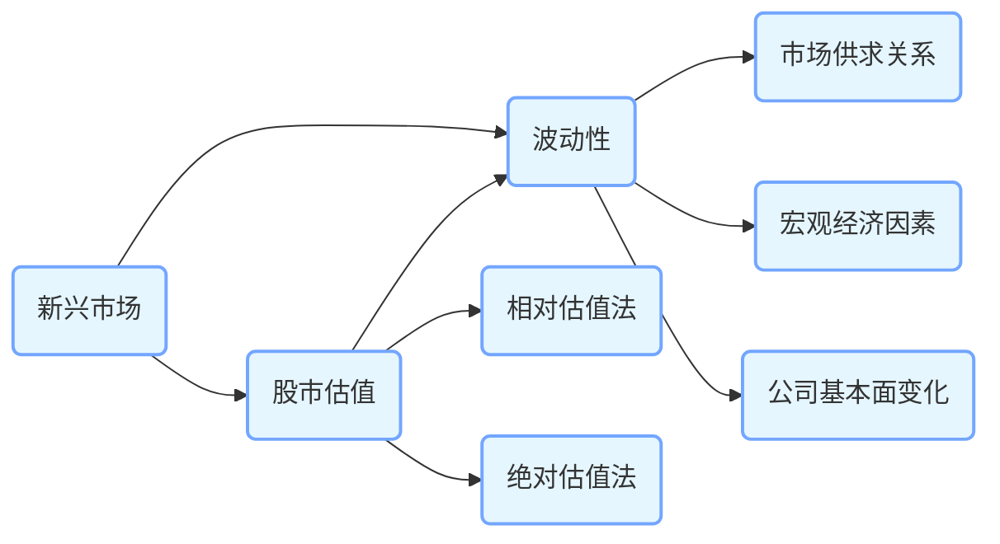

# 新兴市场股市估值的波动性研究

> 关键词：新兴市场股市、估值波动性、市场风险、影响因素、投资策略

> 摘要：本文聚焦于新兴市场股市估值的波动性研究。通过对新兴市场股市的背景介绍，明确研究的目的和范围，阐述核心概念与联系，深入剖析核心算法原理及具体操作步骤，运用数学模型和公式进行详细讲解并举例说明。结合项目实战，给出代码实际案例和详细解释。探讨新兴市场股市估值波动性在实际中的应用场景，推荐相关的工具和资源。最后总结未来发展趋势与挑战，提供常见问题与解答及扩展阅读和参考资料，旨在为投资者、研究者等提供全面且深入的关于新兴市场股市估值波动性的认识和分析。

## 1. 背景介绍 
### 1.1 目的和范围
新兴市场股市在全球金融体系中扮演着越来越重要的角色。然而，相较于成熟市场，新兴市场股市具有更高的估值波动性。本研究的目的在于深入探究新兴市场股市估值波动性的特征、成因以及影响，为投资者制定合理的投资策略、监管机构制定有效的监管政策提供理论支持和实践指导。

研究范围涵盖了全球主要的新兴市场国家和地区的股市，包括亚洲、非洲、拉丁美洲等地区的新兴经济体。通过对这些市场的历史数据进行分析，揭示新兴市场股市估值波动性的规律和特点。

### 1.2 预期读者
本文的预期读者包括金融投资者、金融分析师、金融监管机构人员、学术研究人员以及对新兴市场股市感兴趣的人士。投资者可以从本文中获取有关新兴市场股市估值波动性的信息，以优化投资组合和降低投资风险；金融分析师可以借助本文的研究方法和结论，进行更准确的市场分析和预测；金融监管机构人员可以参考本文的研究成果，制定更加有效的监管政策，维护金融市场的稳定；学术研究人员可以在本文的基础上开展进一步的研究工作；对新兴市场股市感兴趣的人士可以通过本文了解新兴市场股市的特点和风险。

### 1.3 文档结构概述
本文共分为十个部分。第一部分为背景介绍，阐述研究的目的、范围、预期读者和文档结构概述；第二部分介绍核心概念与联系，包括新兴市场、股市估值、波动性等核心概念的定义和相互关系，并给出相应的文本示意图和 Mermaid 流程图；第三部分讲解核心算法原理和具体操作步骤，通过 Python 源代码详细阐述如何计算股市估值的波动性；第四部分介绍数学模型和公式，对相关的数学模型进行详细讲解，并举例说明其应用；第五部分为项目实战，包括开发环境搭建、源代码详细实现和代码解读；第六部分探讨新兴市场股市估值波动性的实际应用场景；第七部分推荐相关的工具和资源，包括学习资源、开发工具框架和相关论文著作；第八部分总结未来发展趋势与挑战；第九部分为附录，提供常见问题与解答；第十部分列出扩展阅读和参考资料。

### 1.4 术语表
#### 1.4.1 核心术语定义
- **新兴市场**：指的是一些发展中国家或地区的金融市场，这些市场通常具有较高的经济增长率、较低的市场成熟度和较高的市场波动性。
- **股市估值**：是指对股票市场整体或个别股票的价值进行评估的过程和结果。常见的估值指标包括市盈率（P/E）、市净率（P/B）等。
- **波动性**：在金融领域中，波动性通常指资产价格在一定时期内的波动程度。常用的衡量指标包括标准差、方差等。

#### 1.4.2 相关概念解释
- **市盈率（P/E）**：是指股票价格与每股收益的比率，反映了投资者为获取每单位收益所愿意支付的价格。计算公式为：$P/E=\frac{股票价格}{每股收益}$。
- **市净率（P/B）**：是指股票价格与每股净资产的比率，反映了股票价格相对于每股净资产的溢价程度。计算公式为：$P/B=\frac{股票价格}{每股净资产}$。

#### 1.4.3 缩略词列表
- **P/E**：市盈率（Price-to-Earnings Ratio）
- **P/B**：市净率（Price-to-Book Ratio）
- **EMs**：新兴市场（Emerging Markets）

## 2. 核心概念与联系 
### 核心概念原理
#### 新兴市场
新兴市场是全球经济发展的重要组成部分。这些市场的经济通常处于快速发展阶段，具有较高的投资回报率潜力，但同时也伴随着较高的风险。新兴市场的股市往往受到国内经济政策、政治局势、国际资本流动等多种因素的影响，导致其估值具有较大的波动性。

#### 股市估值
股市估值是投资者评估股票投资价值的重要依据。合理的估值可以帮助投资者判断股票价格是否被高估或低估，从而做出明智的投资决策。常见的估值方法包括相对估值法和绝对估值法。相对估值法通过比较同行业或类似公司的估值指标来评估股票的价值，如市盈率、市净率等；绝对估值法通过预测公司未来的现金流并折现来计算股票的内在价值，如现金流折现模型（DCF）。

#### 波动性
波动性是金融市场的固有特征之一。在股市中，波动性反映了股票价格的不稳定程度。较高的波动性意味着股票价格的变化幅度较大，投资者面临的风险也相应增加。波动性的产生主要源于市场供求关系的变化、宏观经济因素的影响、公司基本面的变化等。

### 核心概念架构的文本示意图
```plaintext
新兴市场
|-- 经济快速发展
|-- 政策与政治影响
|-- 国际资本流动

股市估值
|-- 相对估值法（P/E、P/B 等）
|-- 绝对估值法（DCF 等）

波动性
|-- 市场供求关系
|-- 宏观经济因素
|-- 公司基本面变化

新兴市场与股市估值的关系：新兴市场的经济、政策等因素影响股市估值
新兴市场与波动性的关系：新兴市场的特点导致其股市具有较高的波动性
股市估值与波动性的关系：估值的变化会引起股价波动，进而影响市场波动性
```

### Mermaid 流程图


## 3. 核心算法原理 & 具体操作步骤 
### 核心算法原理
在研究新兴市场股市估值的波动性时，常用的方法是计算股票价格或估值指标的标准差或方差。标准差是衡量数据离散程度的统计量，它反映了数据相对于均值的偏离程度。方差是标准差的平方。

设 $x_1,x_2,\cdots,x_n$ 为一组数据，其均值为 $\bar{x}=\frac{1}{n}\sum_{i = 1}^{n}x_i$，则方差 $s^2$ 和标准差 $s$ 的计算公式分别为：

$$s^2=\frac{1}{n - 1}\sum_{i = 1}^{n}(x_i-\bar{x})^2$$

$$s=\sqrt{\frac{1}{n - 1}\sum_{i = 1}^{n}(x_i-\bar{x})^2}$$

### 具体操作步骤
1. **数据收集**：收集新兴市场股市的历史数据，包括股票价格、市盈率、市净率等估值指标。
2. **数据预处理**：对收集到的数据进行清洗和整理，去除缺失值和异常值。
3. **计算均值**：根据上述公式计算数据的均值。
4. **计算方差和标准差**：根据均值计算数据的方差和标准差。

### Python 源代码实现
```python
import numpy as np

# 示例数据：假设我们有一组市盈率数据
pe_ratios = [10, 12, 15, 18, 20, 22, 25]

# 计算均值
mean_pe = np.mean(pe_ratios)

# 计算方差
variance_pe = np.var(pe_ratios, ddof=1)

# 计算标准差
std_dev_pe = np.std(pe_ratios, ddof=1)

print(f"市盈率均值: {mean_pe}")
print(f"市盈率方差: {variance_pe}")
print(f"市盈率标准差: {std_dev_pe}")
```

### 代码解释
1. **导入 numpy 库**：numpy 是 Python 中用于科学计算的常用库，提供了丰富的数学函数和数据结构。
2. **定义示例数据**：定义了一组市盈率数据 `pe_ratios`。
3. **计算均值**：使用 `np.mean()` 函数计算市盈率数据的均值。
4. **计算方差**：使用 `np.var()` 函数计算市盈率数据的方差，`ddof=1` 表示使用样本方差的计算公式。
5. **计算标准差**：使用 `np.std()` 函数计算市盈率数据的标准差，同样 `ddof=1` 表示使用样本标准差的计算公式。
6. **输出结果**：打印计算得到的均值、方差和标准差。

## 4. 数学模型和公式 & 详细讲解 & 举例说明 
### 数学模型和公式
#### 标准差和方差
在前面的核心算法原理中已经介绍了标准差和方差的计算公式。标准差和方差是衡量数据波动性的常用指标。标准差越大，说明数据的离散程度越大，波动性也就越高；反之，标准差越小，说明数据越集中，波动性越低。

#### 夏普比率
夏普比率是另一个常用的衡量投资组合风险调整后收益的指标。它反映了投资组合在承担单位风险时所能获得的超额收益。夏普比率的计算公式为：

$$Sharpe Ratio=\frac{R_p - R_f}{\sigma_p}$$

其中，$R_p$ 是投资组合的预期收益率，$R_f$ 是无风险收益率，$\sigma_p$ 是投资组合的标准差。

### 详细讲解
#### 标准差和方差
标准差和方差的计算基于数据的均值。通过计算每个数据点与均值的差值的平方和，再除以数据点的数量减一（样本方差），可以得到方差。标准差是方差的平方根。标准差和方差可以帮助我们了解数据的分布情况和波动程度。

#### 夏普比率
夏普比率的分子是投资组合的预期收益率减去无风险收益率，即超额收益率。分母是投资组合的标准差，代表了投资组合的风险。夏普比率越高，说明投资组合在承担相同风险的情况下能够获得更高的超额收益，投资组合的表现也就越好。

### 举例说明
#### 标准差和方差
假设我们有两个新兴市场股市的市盈率数据序列：

序列 A：[10, 12, 15, 18, 20]
序列 B：[5, 15, 20, 25, 30]

我们可以使用 Python 计算它们的标准差和方差：

```python
import numpy as np

pe_a = [10, 12, 15, 18, 20]
pe_b = [5, 15, 20, 25, 30]

std_dev_a = np.std(pe_a, ddof=1)
std_dev_b = np.std(pe_b, ddof=1)

print(f"序列 A 的标准差: {std_dev_a}")
print(f"序列 B 的标准差: {std_dev_b}")
```

运行结果显示，序列 B 的标准差大于序列 A 的标准差，说明序列 B 的波动性更高。

#### 夏普比率
假设一个投资组合的预期收益率为 15%，无风险收益率为 3%，投资组合的标准差为 20%。则该投资组合的夏普比率为：

$$Sharpe Ratio=\frac{0.15 - 0.03}{0.2}=0.6$$

这意味着该投资组合每承担 1% 的风险，能够获得 0.6% 的超额收益。

## 5. 项目实战：代码实际案例和详细解释说明 
### 5.1 开发环境搭建
#### 安装 Python
首先，需要安装 Python 编程语言。可以从 Python 官方网站（https://www.python.org/downloads/）下载适合自己操作系统的 Python 安装包，并按照安装向导进行安装。

#### 安装必要的库
在 Python 中，我们需要使用一些第三方库来进行数据处理和分析。可以使用 `pip` 命令来安装这些库：

```bash
pip install numpy pandas matplotlib yfinance
```

- `numpy`：用于科学计算和数组操作。
- `pandas`：用于数据处理和分析。
- `matplotlib`：用于数据可视化。
- `yfinance`：用于从雅虎财经获取股票数据。

### 5.2 源代码详细实现和代码解读
```python
import yfinance as yf
import pandas as pd
import numpy as np
import matplotlib.pyplot as plt

# 定义新兴市场股票代码列表
emerging_market_stocks = ['PETR4.SA', 'BBDC4.SA', 'TCS.NS', 'HDFCBANK.NS']

# 下载股票数据
start_date = '2020-01-01'
end_date = '2023-01-01'
data = yf.download(emerging_market_stocks, start=start_date, end=end_date)['Close']

# 计算每日收益率
returns = data.pct_change().dropna()

# 计算收益率的标准差
std_dev_returns = returns.std()

# 绘制标准差柱状图
plt.figure(figsize=(10, 6))
std_dev_returns.plot(kind='bar')
plt.title('新兴市场股票收益率的标准差')
plt.xlabel('股票代码')
plt.ylabel('标准差')
plt.show()
```

### 代码解读与分析
1. **导入必要的库**：导入 `yfinance`、`pandas`、`numpy` 和 `matplotlib.pyplot` 库。
2. **定义新兴市场股票代码列表**：定义了一个包含巴西和印度等新兴市场股票代码的列表。
3. **下载股票数据**：使用 `yfinance` 库从雅虎财经下载指定时间段内的股票收盘价数据。
4. **计算每日收益率**：使用 `pct_change()` 方法计算每日收益率，并使用 `dropna()` 方法去除缺失值。
5. **计算收益率的标准差**：使用 `std()` 方法计算每日收益率的标准差。
6. **绘制标准差柱状图**：使用 `matplotlib` 库绘制收益率标准差的柱状图，直观地展示不同股票的波动性。

通过这个项目实战，我们可以清晰地看到不同新兴市场股票的收益率波动性情况，为投资决策提供参考。

## 6. 实际应用场景 
### 投资组合管理
投资者可以利用新兴市场股市估值的波动性研究结果来优化投资组合。通过分析不同新兴市场股票的波动性，投资者可以选择波动性较低的股票来降低投资组合的整体风险，或者选择波动性较高的股票来获取更高的潜在收益。同时，投资者还可以根据市场波动性的变化调整投资组合的权重，以适应市场的变化。

### 风险管理
金融机构和企业可以利用新兴市场股市估值的波动性研究结果来进行风险管理。通过对市场波动性的监测和预测，金融机构可以及时调整风险敞口，采取相应的风险对冲措施，如使用衍生品进行套期保值。企业可以根据市场波动性的变化调整融资策略和投资计划，降低市场风险对企业的影响。

### 政策制定
金融监管机构可以根据新兴市场股市估值的波动性研究结果制定相应的监管政策。例如，当市场波动性过高时，监管机构可以采取措施加强市场监管，如提高保证金要求、限制卖空等，以维护市场的稳定。政府可以根据市场波动性的变化调整宏观经济政策，如调整利率、税收政策等，以促进经济的稳定发展。

### 市场预测
分析师和投资者可以利用新兴市场股市估值的波动性研究结果进行市场预测。通过分析历史数据和市场趋势，分析师可以预测未来市场的波动性变化，为投资者提供投资建议。投资者可以根据市场预测结果调整投资策略，抓住投资机会。

## 7. 工具和资源推荐
### 7.1 学习资源推荐
#### 7.1.1 书籍推荐
- 《金融市场与金融机构》（*Financial Markets and Institutions*）：这本书全面介绍了金融市场和金融机构的基本概念、运作机制和风险管理等方面的知识，对于理解新兴市场股市的估值和波动性具有重要的参考价值。
- 《投资学》（*Investments*）：该书系统地阐述了投资理论和投资实践的各个方面，包括资产定价、投资组合管理、风险管理等，是学习投资领域的经典教材。
- 《行为金融学》（*Behavioral Finance*）：行为金融学研究投资者的心理和行为对金融市场的影响，对于解释新兴市场股市的波动性具有独特的视角。

#### 7.1.2 在线课程
- Coursera 上的“金融市场”（*Financial Markets*）课程：由耶鲁大学教授罗伯特·席勒（Robert Shiller）主讲，课程内容涵盖了金融市场的基本原理、资产定价、风险管理等方面的知识。
- edX 上的“投资分析与组合管理”（*Investment Analysis and Portfolio Management*）课程：该课程介绍了投资分析的基本方法和投资组合管理的策略，适合对投资领域感兴趣的学习者。

#### 7.1.3 技术博客和网站
- 雪球（https://xueqiu.com/）：雪球是一个专注于金融投资的社区，提供了丰富的股票行情、财经新闻、投资分析等内容，用户可以在上面交流投资经验和分享投资观点。
- 东方财富网（https://www.eastmoney.com/）：东方财富网是国内知名的财经网站，提供了全面的金融信息和数据服务，包括股票行情、基金数据、财经新闻等。

### 7.2 开发工具框架推荐
#### 7.2.1 IDE和编辑器
- PyCharm：PyCharm 是一款专门为 Python 开发设计的集成开发环境（IDE），具有强大的代码编辑、调试、自动完成等功能，适合专业的 Python 开发者使用。
- Jupyter Notebook：Jupyter Notebook 是一个交互式的开发环境，支持多种编程语言，如 Python、R 等。它可以将代码、文本、图表等内容整合在一个文档中，方便进行数据分析和可视化。

#### 7.2.2 调试和性能分析工具
- `pdb`：`pdb` 是 Python 自带的调试工具，可以帮助开发者在代码中设置断点、单步执行代码、查看变量值等，方便进行代码调试。
- `cProfile`：`cProfile` 是 Python 标准库中的性能分析工具，可以帮助开发者分析代码的运行时间和函数调用情况，找出代码中的性能瓶颈。

#### 7.2.3 相关框架和库
- `scikit-learn`：`scikit-learn` 是一个常用的机器学习库，提供了丰富的机器学习算法和工具，如分类、回归、聚类等。在新兴市场股市估值的波动性研究中，可以使用 `scikit-learn` 进行数据建模和预测。
- `statsmodels`：`statsmodels` 是一个用于统计建模和计量经济学分析的 Python 库，提供了多种统计模型和方法，如线性回归、时间序列分析等。可以使用 `statsmodels` 对新兴市场股市的波动性进行建模和分析。

### 7.3 相关论文著作推荐
#### 7.3.1 经典论文
- "The Cross - Section of Expected Stock Returns" by Eugene F. Fama and Kenneth R. French：这篇论文提出了著名的 Fama - French 三因子模型，该模型在资产定价领域具有重要的影响力，对于理解股票收益率的影响因素和波动性具有重要的参考价值。
- "Efficient Capital Markets: A Review of Theory and Empirical Work" by Eugene F. Fama：这篇论文是有效市场假说的经典文献，对金融市场的效率和信息传递进行了深入的探讨，对于理解新兴市场股市的有效性和波动性具有重要的启示作用。

#### 7.3.2 最新研究成果
- 可以通过学术数据库如 Web of Science、IEEE Xplore、ACM Digital Library 等搜索关于新兴市场股市估值波动性的最新研究论文。这些论文通常涵盖了最新的研究方法和研究成果，可以帮助读者了解该领域的前沿动态。

#### 7.3.3 应用案例分析
- 一些知名的金融研究机构和咨询公司会发布关于新兴市场股市的研究报告和应用案例分析，如麦肯锡、波士顿咨询集团等。这些报告和案例分析可以帮助读者了解新兴市场股市估值波动性在实际应用中的情况和解决方案。

## 8. 总结：未来发展趋势与挑战
### 未来发展趋势
#### 市场全球化趋势加强
随着全球经济一体化的深入发展，新兴市场与全球金融市场的联系将更加紧密。国际资本的流动将更加频繁，新兴市场股市的估值和波动性将受到全球经济和金融市场的影响更大。

#### 科技赋能金融创新
科技的快速发展将为新兴市场股市的发展带来新的机遇。例如，区块链技术可以提高交易的透明度和效率，人工智能和机器学习技术可以用于市场分析和预测，从而降低市场的波动性。

#### 可持续投资理念兴起
随着社会对可持续发展的关注度不断提高，可持续投资理念将在新兴市场股市中得到更广泛的应用。投资者将更加关注企业的环境、社会和治理（ESG）表现，这将对新兴市场股市的估值和波动性产生影响。

### 挑战
#### 宏观经济不确定性
新兴市场国家的宏观经济环境通常具有较高的不确定性，如通货膨胀、汇率波动、政治不稳定等。这些因素将增加新兴市场股市的估值和波动性，给投资者带来更大的风险。

#### 金融监管不完善
部分新兴市场国家的金融监管体系尚不完善，存在监管漏洞和监管不力的问题。这将导致市场操纵、内幕交易等违法行为时有发生，影响市场的公平性和稳定性，增加市场的波动性。

#### 数据质量和可得性问题
在新兴市场股市研究中，数据质量和可得性是一个重要的挑战。部分新兴市场国家的金融数据可能存在不准确、不完整、不及时等问题，这将影响研究的准确性和可靠性。

## 9. 附录：常见问题与解答
### 问题 1：如何选择合适的新兴市场股票进行投资？
解答：选择合适的新兴市场股票进行投资需要综合考虑多个因素。首先，要关注公司的基本面，如盈利能力、财务状况、市场竞争力等。其次，要分析市场的宏观经济环境和行业发展趋势。此外，还可以参考股票的估值指标，如市盈率、市净率等，选择估值合理的股票。同时，要注意分散投资，降低投资风险。

### 问题 2：新兴市场股市的波动性是否一定意味着高风险？
解答：新兴市场股市的波动性较高并不一定意味着高风险。波动性只是衡量市场价格变化的一个指标，高波动性可能带来更高的潜在收益，但也伴随着更大的风险。投资者可以通过合理的投资组合管理和风险管理策略来降低波动性带来的风险。例如，选择不同行业、不同地区的股票进行分散投资，或者使用衍生品进行套期保值。

### 问题 3：如何预测新兴市场股市的波动性？
解答：预测新兴市场股市的波动性是一个复杂的问题，目前还没有一种准确的方法可以完全预测市场的波动性。可以通过分析历史数据、宏观经济指标、政策变化等因素来对市场波动性进行预测。常用的方法包括时间序列分析、机器学习算法等。但需要注意的是，这些方法都存在一定的局限性，预测结果仅供参考。

## 10. 扩展阅读 & 参考资料
### 扩展阅读
- 《金融炼金术》（*The Alchemy of Finance*）：乔治·索罗斯（George Soros）的著作，探讨了金融市场的反身性理论，对于理解金融市场的波动性和不确定性具有重要的启示作用。
- 《黑天鹅：如何应对不可预知的未来》（*The Black Swan: The Impact of the Highly Improbable*）：纳西姆·尼古拉斯·塔勒布（Nassim Nicholas Taleb）的著作，介绍了黑天鹅事件的概念和影响，提醒人们要关注金融市场中的不确定性和风险。

### 参考资料
- Fama, E. F., & French, K. R. (1992). The cross - section of expected stock returns. *The Journal of Finance*, 47(2), 427 - 465.
- Fama, E. F. (1970). Efficient capital markets: A review of theory and empirical work. *The Journal of Finance*, 25(2), 383 - 417.
- Damodaran, A. (2012). *Investment valuation: Tools and techniques for determining the value of any asset*. John Wiley & Sons.

作者：AI天才研究院/AI Genius Institute & 禅与计算机程序设计艺术 /Zen And The Art of Computer Programming