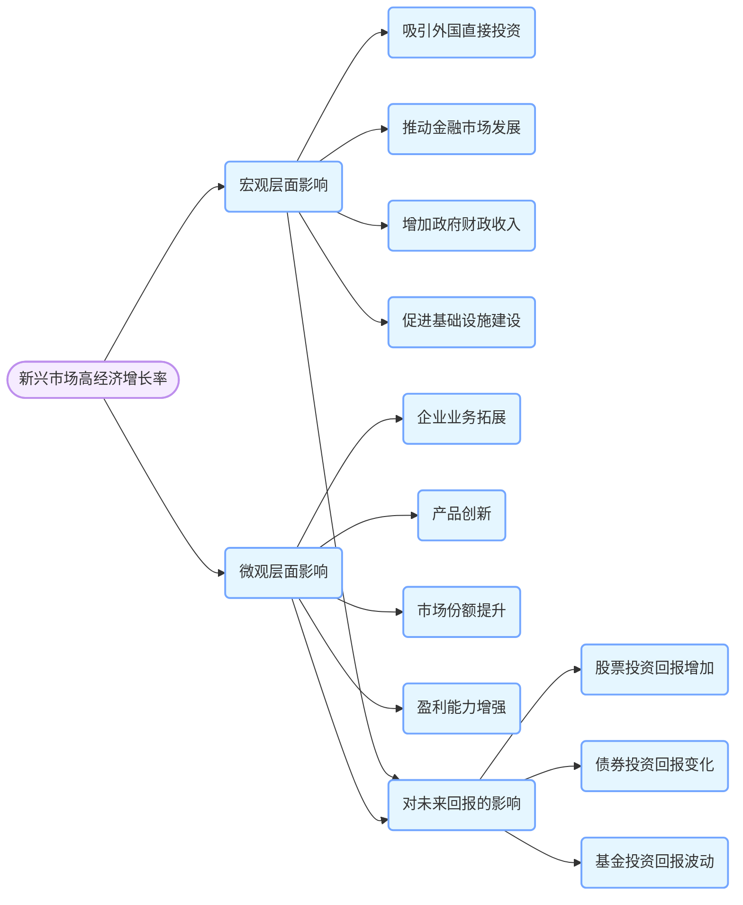

# 新兴市场高经济增长率对未来回报的影响

> 关键词：新兴市场、高经济增长率、未来回报、投资影响、经济趋势

> 摘要：本文旨在深入探讨新兴市场高经济增长率对未来回报的影响。通过对新兴市场的特点、经济增长机制的分析，阐述了高经济增长率与未来回报之间的内在联系。运用数学模型、实际案例等方式，详细研究了这种影响在不同领域和投资场景中的具体表现。同时，提供了相关的工具和资源推荐，最后对新兴市场未来发展趋势与挑战进行了总结，为投资者和经济研究者提供了全面而深入的参考。

## 1. 背景介绍 
### 1.1 目的和范围
本研究的主要目的是全面剖析新兴市场高经济增长率对未来回报产生的影响。具体范围涵盖了新兴市场的宏观经济层面，包括国内生产总值（GDP）增长、产业结构变化等因素；微观层面涉及企业的盈利状况、市场竞争力等。同时，将探讨这种影响在金融投资领域，如股票、债券、基金等市场中的体现，以及对不同行业和投资者的作用。

### 1.2 预期读者
本文预期读者包括金融投资者，他们希望通过了解新兴市场的经济增长与回报关系，优化投资组合，获取更高的收益；经济研究者，旨在深入研究新兴市场的经济发展规律和影响机制；企业管理者，需要根据新兴市场的经济趋势制定战略决策；以及对经济和投资领域感兴趣的普通读者，以增加对新兴市场的认识和理解。

### 1.3 文档结构概述
本文首先介绍相关的背景知识，包括目的、读者和文档结构。接着阐述新兴市场、高经济增长率和未来回报的核心概念及其联系，并通过流程图展示其逻辑关系。然后详细讲解核心算法原理和具体操作步骤，运用Python代码进行说明。之后给出数学模型和公式，并举例说明。再通过项目实战，介绍开发环境搭建、源代码实现和代码解读。随后探讨实际应用场景，推荐相关的工具和资源。最后总结未来发展趋势与挑战，提供常见问题解答和扩展阅读参考资料。

### 1.4 术语表
#### 1.4.1 核心术语定义
- **新兴市场**：指那些经济发展较快、市场潜力较大的发展中国家和地区的市场。通常具有较高的经济增长率、不断完善的基础设施和逐渐开放的金融市场。
- **高经济增长率**：一般指一个国家或地区的GDP在一定时期内保持较高的增长速度，通常高于世界平均水平。
- **未来回报**：指投资者在未来一段时间内从投资中获得的收益，包括股息、利息、资本增值等。

#### 1.4.2 相关概念解释
- **GDP增长**：国内生产总值的增长反映了一个国家或地区经济活动的总体规模和增长速度。它是衡量经济发展的重要指标之一。
- **产业结构升级**：指产业从低附加值向高附加值、从劳动密集型向技术密集型和知识密集型转变的过程。这通常伴随着新兴产业的崛起和传统产业的优化。
- **投资组合**：指投资者将资金分散投资于不同的资产类别，如股票、债券、基金等，以降低风险并实现预期回报的一种投资策略。

#### 1.4.3 缩略词列表
- **GDP**：国内生产总值（Gross Domestic Product）
- **FDI**：外国直接投资（Foreign Direct Investment）
- **ROI**：投资回报率（Return on Investment）

## 2. 核心概念与联系 

### 核心概念原理
新兴市场具有独特的经济特征和发展潜力。其高经济增长率通常源于多个因素，如人口红利、资源优势、政策支持和技术追赶等。高经济增长率意味着企业的市场需求增加，生产规模扩大，从而可能带来更高的盈利。这进而会影响到投资者的未来回报。

从宏观层面看，新兴市场的高经济增长会吸引更多的外国直接投资（FDI），促进资本流入，推动金融市场的发展。同时，政府的财政收入也会增加，有更多的资金用于基础设施建设和社会福利改善，进一步提升经济发展的质量和可持续性。

从微观层面看，企业在高经济增长环境下有更多的机会拓展业务、创新产品和提高市场份额。这将直接影响企业的盈利能力和股票价格，从而影响投资者的回报。

### 架构的文本示意图
```plaintext
新兴市场高经济增长率
|
|-- 宏观层面影响
|   |-- 吸引外国直接投资
|   |-- 推动金融市场发展
|   |-- 增加政府财政收入
|   |-- 促进基础设施建设
|
|-- 微观层面影响
|   |-- 企业业务拓展
|   |-- 产品创新
|   |-- 市场份额提升
|   |-- 盈利能力增强
|
|-- 对未来回报的影响
|   |-- 股票投资回报增加
|   |-- 债券投资回报变化
|   |-- 基金投资回报波动
```

### Mermaid 流程图


## 3. 核心算法原理 & 具体操作步骤 

### 核心算法原理
我们可以通过构建一个简单的经济增长与投资回报模型来分析新兴市场高经济增长率对未来回报的影响。假设一个新兴市场的经济增长率为 $g$，企业的盈利增长率与经济增长率成正比，比例系数为 $k$。投资者的投资回报 $R$ 由企业的盈利分红 $D$ 和资本增值 $V$ 组成。

企业的盈利 $E_t$ 在第 $t$ 期可以表示为：
$E_t = E_0(1 + k g)^t$

其中，$E_0$ 是初始盈利。

投资者的投资回报 $R$ 可以表示为：
$R = \sum_{t = 1}^{n} \frac{D_t}{(1 + r)^t} + \frac{V_n}{(1 + r)^n}$

其中，$D_t$ 是第 $t$ 期的分红，$r$ 是贴现率，$n$ 是投资期限。

### 具体操作步骤
以下是使用Python代码实现上述算法的具体步骤：

```python
# 初始化参数
E0 = 100  # 初始盈利
g = 0.08  # 经济增长率
k = 0.8  # 盈利增长率与经济增长率的比例系数
r = 0.1  # 贴现率
n = 5  # 投资期限

# 计算各期盈利
profits = []
for t in range(n):
    profit = E0 * (1 + k * g) ** t
    profits.append(profit)

# 假设分红率为 30%
dividend_rate = 0.3
dividends = [p * dividend_rate for p in profits]

# 假设资本增值为最后一期盈利的 2 倍
Vn = profits[-1] * 2

# 计算投资回报
R = 0
for t in range(n):
    R += dividends[t] / (1 + r) ** (t + 1)
R += Vn / (1 + r) ** n

print(f"投资回报: {R}")
```

### 代码解释
1. 首先，我们初始化了一些参数，包括初始盈利 $E_0$、经济增长率 $g$、比例系数 $k$、贴现率 $r$ 和投资期限 $n$。
2. 然后，使用循环计算各期的盈利，并将其存储在 `profits` 列表中。
3. 接着，根据假设的分红率计算各期的分红，并存储在 `dividends` 列表中。
4. 假设资本增值为最后一期盈利的 2 倍，计算 $V_n$。
5. 最后，使用循环计算投资回报 $R$，并将结果打印输出。

## 4. 数学模型和公式 & 详细讲解 & 举例说明 

### 数学模型和公式
#### 经济增长模型
我们使用的简单经济增长模型中，企业的盈利 $E_t$ 与经济增长率 $g$ 和比例系数 $k$ 相关，公式为：
$$E_t = E_0(1 + k g)^t$$

其中，$E_0$ 是初始盈利，$t$ 是时间期数。

#### 投资回报模型
投资者的投资回报 $R$ 由分红和资本增值组成，公式为：
$$R = \sum_{t = 1}^{n} \frac{D_t}{(1 + r)^t} + \frac{V_n}{(1 + r)^n}$$

其中，$D_t$ 是第 $t$ 期的分红，$r$ 是贴现率，$n$ 是投资期限，$V_n$ 是第 $n$ 期的资本增值。

### 详细讲解
- **经济增长模型**：该模型表明企业的盈利随着时间的推移，会按照与经济增长率成正比的速度增长。比例系数 $k$ 反映了企业盈利对经济增长的敏感程度。如果 $k$ 较大，说明企业的盈利增长受经济增长的影响较大。
- **投资回报模型**：投资回报是将各期的分红和最终的资本增值按照贴现率 $r$ 进行折现后求和。贴现率反映了资金的时间价值，即未来的资金在当前的价值。

### 举例说明
假设一个新兴市场的经济增长率 $g = 0.08$，企业的初始盈利 $E_0 = 100$ 万元，比例系数 $k = 0.8$，投资期限 $n = 5$ 年，贴现率 $r = 0.1$。

首先，计算各期的盈利：
- 第 1 年：$E_1 = 100(1 + 0.8 \times 0.08)^1 = 106.4$ 万元
- 第 2 年：$E_2 = 100(1 + 0.8 \times 0.08)^2 \approx 113.21$ 万元
- 第 3 年：$E_3 = 100(1 + 0.8 \times 0.08)^3 \approx 120.45$ 万元
- 第 4 年：$E_4 = 100(1 + 0.8 \times 0.08)^4 \approx 128.15$ 万元
- 第 5 年：$E_5 = 100(1 + 0.8 \times 0.08)^5 \approx 136.34$ 万元

假设分红率为 30%，则各期的分红分别为：
- $D_1 = 106.4 \times 0.3 = 31.92$ 万元
- $D_2 = 113.21 \times 0.3 \approx 33.96$ 万元
- $D_3 = 120.45 \times 0.3 \approx 36.14$ 万元
- $D_4 = 128.15 \times 0.3 \approx 38.45$ 万元
- $D_5 = 136.34 \times 0.3 \approx 40.90$ 万元

假设资本增值为最后一期盈利的 2 倍，即 $V_5 = 136.34 \times 2 = 272.68$ 万元。

计算投资回报：
$$
\begin{align*}
R &= \frac{31.92}{(1 + 0.1)^1} + \frac{33.96}{(1 + 0.1)^2} + \frac{36.14}{(1 + 0.1)^3} + \frac{38.45}{(1 + 0.1)^4} + \frac{40.90}{(1 + 0.1)^5} + \frac{272.68}{(1 + 0.1)^5}\\
&\approx 29.02 + 28.07 + 27.13 + 26.22 + 25.34 + 169.44\\
&\approx 305.22
\end{align*}
$$

这意味着在上述假设条件下，投资者的投资回报约为 305.22 万元。

## 5. 项目实战：代码实际案例和详细解释说明 

### 5.1  开发环境搭建
为了实现上述代码，我们需要搭建一个Python开发环境。以下是具体步骤：

1. **安装Python**：访问Python官方网站（https://www.python.org/downloads/），下载并安装适合你操作系统的Python版本。建议安装Python 3.7 及以上版本。
2. **安装开发工具**：可以选择使用集成开发环境（IDE），如PyCharm、Visual Studio Code等，或者使用文本编辑器，如Sublime Text、Atom等。这里以Visual Studio Code为例，下载并安装Visual Studio Code（https://code.visualstudio.com/）。
3. **安装Python扩展**：打开Visual Studio Code，在扩展面板中搜索“Python”，安装Microsoft提供的Python扩展。

### 5.2  源代码详细实现和代码解读
以下是完整的源代码：

```python
# 初始化参数
E0 = 100  # 初始盈利
g = 0.08  # 经济增长率
k = 0.8  # 盈利增长率与经济增长率的比例系数
r = 0.1  # 贴现率
n = 5  # 投资期限

# 计算各期盈利
profits = []
for t in range(n):
    profit = E0 * (1 + k * g) ** t
    profits.append(profit)

# 假设分红率为 30%
dividend_rate = 0.3
dividends = [p * dividend_rate for p in profits]

# 假设资本增值为最后一期盈利的 2 倍
Vn = profits[-1] * 2

# 计算投资回报
R = 0
for t in range(n):
    R += dividends[t] / (1 + r) ** (t + 1)
R += Vn / (1 + r) ** n

print(f"投资回报: {R}")
```

### 代码解读
1. **参数初始化**：定义了初始盈利 $E_0$、经济增长率 $g$、比例系数 $k$、贴现率 $r$ 和投资期限 $n$。
2. **计算各期盈利**：使用循环计算各期的盈利，并将结果存储在 `profits` 列表中。
3. **计算分红**：根据假设的分红率，计算各期的分红，并存储在 `dividends` 列表中。
4. **计算资本增值**：假设资本增值为最后一期盈利的 2 倍，计算 $V_n$。
5. **计算投资回报**：使用循环将各期的分红和最终的资本增值按照贴现率进行折现后求和，得到投资回报 $R$。
6. **输出结果**：使用 `print` 函数将投资回报输出。

### 5.3  代码解读与分析
通过上述代码，我们可以看到如何根据新兴市场的经济增长率和相关参数计算投资回报。代码的核心在于使用经济增长模型计算企业的盈利，然后根据盈利计算分红和资本增值，最后使用投资回报模型计算投资回报。

需要注意的是，这只是一个简化的模型，实际情况中，企业的盈利增长可能受到多种因素的影响，如市场竞争、技术创新、政策变化等。同时，分红率和资本增值的假设也可能与实际情况有所不同。因此，在实际应用中，需要根据具体情况进行调整和优化。

## 6. 实际应用场景 
### 股票投资
在新兴市场高经济增长率的环境下，股票市场通常具有较高的投资价值。企业的盈利增长会推动股票价格上涨，投资者可以通过购买股票获得资本增值和股息收入。例如，一些新兴市场的科技、消费、金融等行业的企业，在经济增长的带动下，业绩不断提升，股票价格也随之上涨。投资者可以通过分析企业的基本面和行业前景，选择具有潜力的股票进行投资。

### 债券投资
新兴市场的债券市场也会受到高经济增长率的影响。一方面，经济增长会提高政府和企业的信用评级，降低债券违约的风险，从而吸引更多的投资者购买债券。另一方面，经济增长可能导致通货膨胀上升，从而影响债券的实际收益率。投资者需要综合考虑经济增长、通货膨胀、利率等因素，选择合适的债券进行投资。

### 基金投资
基金是一种集合投资工具，投资者可以通过购买基金份额，间接投资于新兴市场的股票、债券等资产。在新兴市场高经济增长率的情况下，基金经理可以根据市场情况调整投资组合，选择具有潜力的资产进行投资，从而为投资者带来较高的回报。例如，一些新兴市场的股票型基金、混合型基金等，在过去几年中取得了较好的业绩。

### 企业战略决策
对于企业来说，新兴市场的高经济增长率意味着更多的市场机会和发展空间。企业可以根据经济增长的趋势，制定相应的战略决策。例如，扩大生产规模、拓展市场渠道、进行技术创新等。同时，企业也需要关注市场竞争和政策变化等因素，以应对可能的风险。

## 7. 工具和资源推荐
### 7.1 学习资源推荐
#### 7.1.1 书籍推荐
- 《新兴市场投资攻略》：本书详细介绍了新兴市场的投资特点、风险和机会，提供了实用的投资策略和方法。
- 《经济增长理论》：对经济增长的理论和模型进行了系统的阐述，有助于读者深入理解经济增长的机制和影响因素。
- 《投资学》：全面介绍了投资的基本概念、理论和方法，包括股票、债券、基金等投资工具的分析和选择。

#### 7.1.2 在线课程
- Coursera上的“新兴市场经济学”：由知名大学的教授授课，内容涵盖新兴市场的经济发展、政策环境、金融市场等方面。
- edX上的“投资分析与组合管理”：系统讲解了投资分析的方法和投资组合的构建原则，适合投资者和金融从业者学习。
- Udemy上的“新兴市场投资实战”：通过实际案例分析，介绍了在新兴市场进行投资的技巧和策略。

#### 7.1.3 技术博客和网站
- 新兴市场投资网：提供新兴市场的投资资讯、研究报告和市场分析，帮助投资者了解新兴市场的动态。
- 经济观察网：关注国内外经济形势和政策变化，对新兴市场的经济发展进行深入报道和分析。
- 雪球网：一个投资社区，投资者可以在上面交流投资经验、分享投资观点，了解新兴市场的投资机会。

### 7.2 开发工具框架推荐
#### 7.2.1 IDE和编辑器
- PyCharm：一款专业的Python集成开发环境，具有代码编辑、调试、自动补全、代码分析等功能，适合Python开发者使用。
- Visual Studio Code：一款轻量级的代码编辑器，支持多种编程语言，具有丰富的扩展插件，可用于Python开发。
- Jupyter Notebook：一个交互式的编程环境，适合数据探索、模型构建和可视化展示，常用于数据分析和机器学习领域。

#### 7.2.2 调试和性能分析工具
- pdb：Python自带的调试工具，可以帮助开发者定位代码中的错误和问题。
- cProfile：Python的性能分析工具，可以分析代码的运行时间和函数调用情况，帮助开发者优化代码性能。
- Py-Spy：一个跨平台的Python性能分析工具，可以实时监测Python程序的运行状态，找出性能瓶颈。

#### 7.2.3 相关框架和库
- Pandas：一个强大的数据处理和分析库，提供了高效的数据结构和数据操作方法，常用于数据清洗、数据分析和数据可视化。
- NumPy：一个基础的科学计算库，提供了高效的多维数组对象和数学函数，是许多数据分析和机器学习库的基础。
- Matplotlib：一个常用的数据可视化库，可以绘制各种类型的图表，如折线图、柱状图、散点图等，帮助开发者直观地展示数据。

### 7.3 相关论文著作推荐
#### 7.3.1 经典论文
- “Economic Growth in a Cross Section of Countries” by Robert J. Barro：该论文对不同国家的经济增长进行了实证研究，分析了影响经济增长的因素。
- “Finance and Growth: Schumpeter Might Be Right” by Ross Levine：探讨了金融发展与经济增长之间的关系，强调了金融体系在经济增长中的重要作用。
- “Emerging Markets and Globalization” by Guillermo A. Calvo：研究了新兴市场在全球化背景下的经济发展和金融稳定问题。

#### 7.3.2 最新研究成果
- 关注国际知名学术期刊，如《Journal of Economic Growth》、《Review of Financial Studies》、《Emerging Markets Finance and Trade》等，这些期刊会发表关于新兴市场经济增长和投资回报的最新研究成果。
- 参加相关的学术会议和研讨会，与国内外的学者和专家交流，了解最新的研究动态和前沿观点。

#### 7.3.3 应用案例分析
- 一些国际金融机构和咨询公司会发布关于新兴市场投资的案例分析报告，如麦肯锡、波士顿咨询集团等。这些报告可以帮助投资者了解实际的投资案例和经验教训。
- 上市公司的年报和财务报告也是重要的案例分析资源，通过分析上市公司的业绩和发展战略，可以了解新兴市场企业在高经济增长环境下的发展情况。

## 8. 总结：未来发展趋势与挑战
### 未来发展趋势
- **经济持续增长**：随着新兴市场国家不断推进经济改革和结构调整，加强基础设施建设，提高科技创新能力，未来新兴市场有望继续保持较高的经济增长率。
- **金融市场国际化**：新兴市场的金融市场将进一步开放，吸引更多的国际资本流入。同时，新兴市场的金融机构也将加强与国际金融机构的合作，提升自身的竞争力。
- **绿色发展**：在全球气候变化和可持续发展的背景下，新兴市场将更加注重绿色发展，加大对清洁能源、环保产业等领域的投资，推动经济的可持续增长。
- **数字化转型**：新兴市场国家将加快数字化转型的步伐，推动数字经济的发展。互联网、大数据、人工智能等技术将在新兴市场得到更广泛的应用，为经济增长带来新的动力。

### 挑战
- **外部风险**：新兴市场容易受到全球经济形势、国际贸易政策、汇率波动等外部因素的影响。例如，全球经济衰退可能导致新兴市场的出口需求下降，资本外流加剧。
- **内部结构问题**：一些新兴市场国家存在产业结构不合理、基础设施薄弱、贫富差距较大等问题，这些问题可能制约经济的可持续增长。
- **金融风险**：随着金融市场的开放和发展，新兴市场面临着金融风险增加的挑战，如资产泡沫、债务违约、银行危机等。
- **科技创新能力不足**：虽然新兴市场在科技创新方面取得了一定的进展，但与发达国家相比，仍存在较大的差距。科技创新能力不足可能影响新兴市场的产业升级和经济竞争力。

## 9. 附录：常见问题与解答
### 问题 1：新兴市场高经济增长率一定会带来高投资回报吗？
解答：不一定。虽然高经济增长率为投资提供了良好的环境，但投资回报还受到多种因素的影响，如企业的盈利能力、市场竞争、政策变化等。此外，投资者的投资策略和风险管理能力也会影响投资回报。

### 问题 2：如何选择新兴市场的投资标的？
解答：可以从以下几个方面考虑：一是分析行业前景，选择具有发展潜力的行业，如科技、消费、金融等；二是研究企业的基本面，包括财务状况、盈利能力、市场竞争力等；三是关注政策环境，政策支持的行业和企业通常具有更好的发展前景。

### 问题 3：新兴市场的投资风险如何控制？
解答：可以通过以下方法控制投资风险：一是分散投资，将资金分散投资于不同的资产类别、行业和国家，降低单一投资的风险；二是进行风险评估，了解投资标的的风险特征，制定合理的投资策略；三是关注市场动态，及时调整投资组合，应对市场变化。

### 问题 4：新兴市场的经济增长能持续多久？
解答：新兴市场的经济增长受到多种因素的影响，其持续时间难以准确预测。但如果新兴市场国家能够持续推进经济改革和结构调整，加强科技创新和人才培养，改善基础设施和营商环境，经济增长有望保持较长时间。

## 10. 扩展阅读 & 参考资料
### 扩展阅读
- 《新兴市场的崛起》：深入探讨了新兴市场国家的经济发展历程和未来趋势，分析了新兴市场在全球经济中的地位和作用。
- 《投资新兴市场的智慧》：分享了投资新兴市场的经验和教训，提供了实用的投资建议和策略。
- 《新兴市场金融市场发展研究》：对新兴市场的金融市场发展进行了系统的研究，包括股票市场、债券市场、外汇市场等。

### 参考资料
- World Bank. World Development Indicators.
- International Monetary Fund. World Economic Outlook.
- Bloomberg. Emerging Markets Data and Analysis.

作者：AI天才研究院/AI Genius Institute & 禅与计算机程序设计艺术 /Zen And The Art of Computer Programming