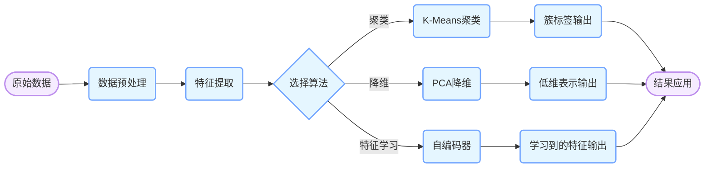

# 无监督AI训练:机遇与挑战并存

> 关键词：无监督AI训练、机遇、挑战、数据挖掘、特征学习

> 摘要：本文深入探讨了无监督AI训练这一前沿技术领域，详细阐述了其核心概念、算法原理、数学模型等基础知识。通过项目实战展示了无监督AI训练在实际中的应用，并分析了其在多个领域的实际应用场景。同时，提供了丰富的工具和资源推荐，包括学习资源、开发工具框架以及相关论文著作。最后，总结了无监督AI训练的未来发展趋势与挑战，并对常见问题进行了解答，旨在为读者全面呈现无监督AI训练的机遇与挑战。

## 1. 背景介绍 
### 1.1 目的和范围
无监督AI训练作为人工智能领域的重要分支，近年来受到了广泛的关注。本文章的目的在于全面深入地探讨无监督AI训练，包括其基本概念、算法原理、实际应用等方面。范围涵盖了无监督AI训练的理论基础、核心算法的Python实现、项目实战案例以及未来发展趋势等内容，旨在为读者提供一个系统、全面的无监督AI训练知识体系。

### 1.2 预期读者
本文预期读者包括对人工智能领域感兴趣的初学者、从事相关研究的专业人员以及希望将无监督AI训练应用于实际项目的开发者。无论您是刚刚踏入人工智能领域，还是已经有一定的技术积累，都能从本文中获取有价值的信息。

### 1.3 文档结构概述
本文将按照以下结构进行组织：首先介绍无监督AI训练的背景知识，包括目的、预期读者和文档结构等；接着阐述核心概念与联系，通过文本示意图和Mermaid流程图展示其原理和架构；然后详细讲解核心算法原理和具体操作步骤，并使用Python源代码进行阐述；之后介绍数学模型和公式，并通过举例说明；再通过项目实战展示代码实际案例和详细解释；分析实际应用场景；推荐相关的工具和资源；总结未来发展趋势与挑战；解答常见问题；最后提供扩展阅读和参考资料。

### 1.4 术语表
#### 1.4.1 核心术语定义
- **无监督AI训练**：是指在没有明确标注数据的情况下，让人工智能模型自动学习数据中的模式、结构和规律的训练方式。
- **聚类**：将数据集中相似的数据点划分为不同的组或簇的过程。
- **降维**：减少数据集中特征数量的过程，同时保留数据的主要信息。
- **特征学习**：自动从原始数据中提取有意义的特征的过程。

#### 1.4.2 相关概念解释
- **数据分布**：描述数据在特征空间中的分布情况，常见的有高斯分布、均匀分布等。
- **相似度度量**：用于衡量数据点之间的相似程度，常见的有欧几里得距离、余弦相似度等。
- **潜在变量**：在数据中未直接观测到，但对数据的生成和结构有重要影响的变量。

#### 1.4.3 缩略词列表
- **PCA**：主成分分析（Principal Component Analysis）
- **K-Means**：K均值聚类算法（K-Means Clustering Algorithm）
- **GMM**：高斯混合模型（Gaussian Mixture Model）

## 2. 核心概念与联系 
无监督AI训练的核心目标是在没有标注数据的情况下，让模型自动发现数据中的模式和结构。主要涉及聚类、降维和特征学习等核心概念。

### 核心概念原理
- **聚类**：聚类算法将数据集中的样本划分为不同的簇，使得同一簇内的样本相似度较高，不同簇之间的样本相似度较低。常见的聚类算法有K-Means、DBSCAN等。
- **降维**：降维算法通过减少数据的特征数量，保留数据的主要信息，从而降低数据的复杂度。常见的降维算法有PCA、t-SNE等。
- **特征学习**：特征学习算法自动从原始数据中提取有意义的特征，这些特征可以用于后续的分类、聚类等任务。常见的特征学习算法有自编码器、变分自编码器等。

### 架构的文本示意图
无监督AI训练的架构可以分为数据输入层、特征提取层、模型训练层和结果输出层。数据输入层接收原始数据，特征提取层使用降维或特征学习算法提取数据的特征，模型训练层使用聚类等算法对特征进行训练，结果输出层输出训练得到的簇标签、低维表示等结果。

### Mermaid流程图


## 3. 核心算法原理 & 具体操作步骤 
### K-Means聚类算法原理
K-Means聚类算法是一种基于距离的聚类算法，其目标是将数据集中的样本划分为K个簇，使得每个样本到其所属簇的质心的距离之和最小。

#### 算法步骤
1. 随机初始化K个质心。
2. 对于每个样本，计算其到每个质心的距离，将其分配到距离最近的质心所在的簇。
3. 重新计算每个簇的质心。
4. 重复步骤2和3，直到质心不再发生变化或达到最大迭代次数。

#### Python源代码实现
```python
import numpy as np

def kmeans(X, K, max_iterations=100):
    # 随机初始化K个质心
    centroids = X[np.random.choice(X.shape[0], K, replace=False)]
    
    for _ in range(max_iterations):
        # 分配样本到最近的质心
        distances = np.sqrt(((X - centroids[:, np.newaxis])**2).sum(axis=2))
        labels = np.argmin(distances, axis=0)
        
        # 重新计算质心
        new_centroids = np.array([X[labels == k].mean(axis=0) for k in range(K)])
        
        # 判断质心是否不再变化
        if np.allclose(centroids, new_centroids):
            break
        
        centroids = new_centroids
    
    return labels, centroids
```

### PCA降维算法原理
PCA降维算法的核心思想是找到数据的主成分，即数据方差最大的方向，通过将数据投影到这些主成分上，实现数据的降维。

#### 算法步骤
1. 对数据进行中心化处理，即减去数据的均值。
2. 计算数据的协方差矩阵。
3. 计算协方差矩阵的特征值和特征向量。
4. 选择前k个最大特征值对应的特征向量作为主成分。
5. 将数据投影到主成分上，得到降维后的数据。

#### Python源代码实现
```python
import numpy as np

def pca(X, k):
    # 中心化处理
    X_mean = np.mean(X, axis=0)
    X_centered = X - X_mean
    
    # 计算协方差矩阵
    cov_matrix = np.cov(X_centered.T)
    
    # 计算特征值和特征向量
    eigenvalues, eigenvectors = np.linalg.eig(cov_matrix)
    
    # 选择前k个最大特征值对应的特征向量
    idx = eigenvalues.argsort()[::-1][:k]
    eigenvectors_k = eigenvectors[:, idx]
    
    # 将数据投影到主成分上
    X_reduced = np.dot(X_centered, eigenvectors_k)
    
    return X_reduced
```

## 4. 数学模型和公式 & 详细讲解 & 举例说明 
### K-Means聚类算法的数学模型和公式
K-Means聚类算法的目标是最小化以下目标函数：
$$
J = \sum_{i=1}^{n} \sum_{k=1}^{K} r_{ik} \left\lVert \mathbf{x}_i - \boldsymbol{\mu}_k \right\rVert^2
$$
其中，$n$ 是样本数量，$K$ 是簇的数量，$\mathbf{x}_i$ 是第 $i$ 个样本，$\boldsymbol{\mu}_k$ 是第 $k$ 个簇的质心，$r_{ik}$ 是一个指示变量，如果样本 $\mathbf{x}_i$ 属于簇 $k$，则 $r_{ik} = 1$，否则 $r_{ik} = 0$。

#### 详细讲解
目标函数 $J$ 表示每个样本到其所属簇的质心的距离的平方和。K-Means算法通过迭代的方式不断更新质心，使得目标函数 $J$ 逐渐减小，直到收敛。

#### 举例说明
假设有一个二维数据集 $X = \begin{bmatrix} 1 & 2 \\ 2 & 3 \\ 8 & 9 \\ 9 & 10 \end{bmatrix}$，我们要将其划分为 $K = 2$ 个簇。

首先随机初始化两个质心 $\boldsymbol{\mu}_1 = \begin{bmatrix} 1 & 2 \end{bmatrix}$ 和 $\boldsymbol{\mu}_2 = \begin{bmatrix} 8 & 9 \end{bmatrix}$。

然后计算每个样本到两个质心的距离，将样本分配到距离最近的质心所在的簇。对于样本 $\begin{bmatrix} 1 & 2 \end{bmatrix}$，它到 $\boldsymbol{\mu}_1$ 的距离为 $0$，到 $\boldsymbol{\mu}_2$ 的距离为 $\sqrt{(1 - 8)^2 + (2 - 9)^2} \approx 9.899$，所以将其分配到簇 $1$。

接着重新计算每个簇的质心，重复上述步骤，直到质心不再发生变化。

### PCA降维算法的数学模型和公式
PCA降维算法的核心是计算数据的协方差矩阵 $\mathbf{C}$：
$$
\mathbf{C} = \frac{1}{n} \sum_{i=1}^{n} (\mathbf{x}_i - \overline{\mathbf{x}}) (\mathbf{x}_i - \overline{\mathbf{x}})^T
$$
其中，$\overline{\mathbf{x}}$ 是数据的均值向量。

然后求解协方差矩阵 $\mathbf{C}$ 的特征值 $\lambda_i$ 和特征向量 $\mathbf{v}_i$，满足：
$$
\mathbf{C} \mathbf{v}_i = \lambda_i \mathbf{v}_i
$$

选择前 $k$ 个最大特征值对应的特征向量 $\mathbf{V}_k = [\mathbf{v}_1, \mathbf{v}_2, \cdots, \mathbf{v}_k]$，将数据 $\mathbf{X}$ 投影到这些特征向量上，得到降维后的数据 $\mathbf{X}_{reduced}$：
$$
\mathbf{X}_{reduced} = \mathbf{X} \mathbf{V}_k
$$

#### 详细讲解
协方差矩阵 $\mathbf{C}$ 描述了数据各个特征之间的相关性。特征值表示数据在对应特征向量方向上的方差，选择前 $k$ 个最大特征值对应的特征向量作为主成分，可以保留数据的主要信息。

#### 举例说明
假设有一个二维数据集 $X = \begin{bmatrix} 1 & 2 \\ 2 & 3 \\ 3 & 4 \\ 4 & 5 \end{bmatrix}$。

首先计算数据的均值向量 $\overline{\mathbf{x}} = \begin{bmatrix} 2.5 & 3.5 \end{bmatrix}$。

然后计算协方差矩阵 $\mathbf{C}$：
$$
\mathbf{C} = \frac{1}{4} \begin{bmatrix}
(1 - 2.5)(1 - 2.5) + (2 - 2.5)(2 - 2.5) & (1 - 2.5)(2 - 3.5) + (2 - 2.5)(3 - 3.5) \\
(2 - 2.5)(1 - 2.5) + (3 - 2.5)(2 - 2.5) & (2 - 2.5)(2 - 3.5) + (3 - 2.5)(3 - 3.5) \\
(3 - 2.5)(1 - 2.5) + (4 - 2.5)(2 - 2.5) & (3 - 2.5)(2 - 3.5) + (4 - 2.5)(3 - 3.5) \\
(4 - 2.5)(1 - 2.5) + (5 - 2.5)(2 - 2.5) & (4 - 2.5)(2 - 3.5) + (5 - 2.5)(3 - 3.5)
\end{bmatrix} = \begin{bmatrix} 1.25 & 1.25 \\ 1.25 & 1.25 \end{bmatrix}
$$

求解协方差矩阵 $\mathbf{C}$ 的特征值和特征向量，得到特征值 $\lambda_1 = 2.5$，$\lambda_2 = 0$，对应的特征向量 $\mathbf{v}_1 = \begin{bmatrix} 0.707 \\ 0.707 \end{bmatrix}$，$\mathbf{v}_2 = \begin{bmatrix} -0.707 \\ 0.707 \end{bmatrix}$。

选择最大特征值 $\lambda_1$ 对应的特征向量 $\mathbf{v}_1$ 作为主成分，将数据 $X$ 投影到 $\mathbf{v}_1$ 上，得到降维后的数据 $\mathbf{X}_{reduced}$。

## 5. 项目实战：代码实际案例和详细解释说明 
### 5.1  开发环境搭建
本项目使用Python进行开发，需要安装以下库：
- `numpy`：用于数值计算。
- `matplotlib`：用于数据可视化。
- `scikit-learn`：用于机器学习算法的实现。

可以使用以下命令进行安装：
```sh
pip install numpy matplotlib scikit-learn
```

### 5.2  源代码详细实现和代码解读
```python
import numpy as np
import matplotlib.pyplot as plt
from sklearn.datasets import make_blobs
from sklearn.cluster import KMeans
from sklearn.decomposition import PCA

# 生成数据集
X, y = make_blobs(n_samples=300, centers=4, cluster_std=0.60, random_state=0)

# 使用K-Means进行聚类
kmeans = KMeans(n_clusters=4, random_state=0)
kmeans.fit(X)
labels = kmeans.labels_

# 使用PCA进行降维
pca = PCA(n_components=2)
X_reduced = pca.fit_transform(X)

# 可视化聚类结果
plt.figure(figsize=(12, 6))
plt.subplot(1, 2, 1)
plt.scatter(X[:, 0], X[:, 1], c=labels, cmap='viridis')
plt.title('K-Means Clustering')

# 可视化降维结果
plt.subplot(1, 2, 2)
plt.scatter(X_reduced[:, 0], X_reduced[:, 1], c=labels, cmap='viridis')
plt.title('PCA Dimensionality Reduction')

plt.show()
```

### 代码解读与分析
1. **数据生成**：使用 `make_blobs` 函数生成一个包含300个样本、4个簇的数据集。
2. **K-Means聚类**：使用 `KMeans` 类进行聚类，设置簇的数量为4。调用 `fit` 方法对数据进行训练，得到每个样本的簇标签。
3. **PCA降维**：使用 `PCA` 类进行降维，将数据的维度从原始的特征数量降低到2。调用 `fit_transform` 方法对数据进行降维和转换。
4. **可视化**：使用 `matplotlib` 库将聚类结果和降维结果进行可视化展示。

## 6. 实际应用场景 
### 客户细分
在市场营销中，无监督AI训练可以用于客户细分。通过对客户的购买行为、偏好等数据进行聚类分析，企业可以将客户划分为不同的群体，从而制定个性化的营销策略。

### 图像识别
在图像识别领域，无监督AI训练可以用于特征学习。通过自编码器等算法，模型可以自动学习图像的特征表示，从而提高图像分类、目标检测等任务的性能。

### 异常检测
在网络安全、金融等领域，无监督AI训练可以用于异常检测。通过对正常数据进行学习，模型可以识别出数据中的异常模式，从而及时发现潜在的安全威胁或欺诈行为。

### 自然语言处理
在自然语言处理中，无监督AI训练可以用于主题建模。通过对文本数据进行聚类或降维分析，模型可以发现文本中的主题结构，从而实现文本分类、信息检索等任务。

## 7. 工具和资源推荐
### 7.1 学习资源推荐
#### 7.1.1 书籍推荐
- 《机器学习》（周志华）：全面介绍了机器学习的基本概念、算法和应用，包括无监督学习部分。
- 《深度学习》（Ian Goodfellow、Yoshua Bengio、Aaron Courville）：深入探讨了深度学习的理论和实践，对无监督深度学习有详细的讲解。

#### 7.1.2 在线课程
- Coursera上的“机器学习”课程（Andrew Ng教授）：经典的机器学习课程，涵盖了无监督学习的基础知识和算法。
- edX上的“深度学习基础”课程：介绍了深度学习的基本概念和无监督学习的应用。

#### 7.1.3 技术博客和网站
- Medium：有很多关于人工智能和无监督学习的优质博客文章。
- Towards Data Science：专注于数据科学和机器学习领域，提供了丰富的无监督学习资源。

### 7.2 开发工具框架推荐
#### 7.2.1 IDE和编辑器
- PyCharm：功能强大的Python集成开发环境，适合进行机器学习项目的开发。
- Jupyter Notebook：交互式的开发环境，方便进行数据探索和模型实验。

#### 7.2.2 调试和性能分析工具
- TensorBoard：TensorFlow的可视化工具，可以用于监控模型的训练过程和性能。
- Scikit-learn的交叉验证工具：可以帮助评估模型的性能和选择合适的参数。

#### 7.2.3 相关框架和库
- Scikit-learn：提供了丰富的机器学习算法实现，包括无监督学习算法。
- TensorFlow和PyTorch：深度学习框架，支持无监督深度学习模型的开发。

### 7.3 相关论文著作推荐
#### 7.3.1 经典论文
- “A Tutorial on Principal Component Analysis”：详细介绍了主成分分析的原理和应用。
- “K-Means++: The Advantages of Careful Seeding”：提出了K-Means++算法，改进了K-Means算法的初始质心选择。

#### 7.3.2 最新研究成果
- 在arXiv上搜索“unsupervised learning”可以获取无监督学习领域的最新研究论文。

#### 7.3.3 应用案例分析
- 相关的学术会议（如NeurIPS、ICML等）的论文集包含了很多无监督学习在实际应用中的案例分析。

## 8. 总结：未来发展趋势与挑战
### 未来发展趋势
- **与深度学习的融合**：无监督学习将与深度学习更加紧密地结合，例如自监督学习的发展，通过设计巧妙的预训练任务，让模型在无监督的情况下学习到强大的特征表示。
- **处理复杂数据**：随着数据的复杂性不断增加，无监督学习将能够处理更多类型的数据，如多模态数据（图像、文本、音频等）。
- **强化学习中的应用**：无监督学习可以为强化学习提供更好的状态表示和探索策略，从而提高强化学习的性能。

### 挑战
- **评估指标的不完善**：由于无监督学习没有明确的标注数据，评估模型的性能比较困难，目前缺乏统一、有效的评估指标。
- **计算资源的需求**：一些无监督学习算法，特别是深度学习模型，需要大量的计算资源和时间进行训练。
- **数据的质量和规模**：无监督学习依赖于大量的数据，数据的质量和规模对模型的性能有很大影响，如何获取高质量、大规模的数据是一个挑战。

## 9. 附录：常见问题与解答
### 无监督学习和监督学习有什么区别？
监督学习需要有标注的数据，模型通过学习标注数据来进行预测；而无监督学习没有标注数据，模型自动发现数据中的模式和结构。

### 如何选择合适的聚类算法？
选择合适的聚类算法需要考虑数据的特点、聚类的目标和计算资源等因素。例如，如果数据具有明显的球形结构，可以选择K-Means算法；如果数据具有任意形状的簇，可以选择DBSCAN算法。

### 无监督学习可以用于分类任务吗？
无监督学习本身不能直接用于分类任务，但可以通过无监督学习得到的数据特征或簇标签，为后续的分类任务提供帮助。例如，可以将聚类结果作为特征输入到分类模型中。

## 10. 扩展阅读 & 参考资料
- Bishop, C. M. (2006). Pattern Recognition and Machine Learning. Springer.
- Murphy, K. P. (2012). Machine Learning: A Probabilistic Perspective. MIT Press.
- Scikit-learn官方文档：https://scikit-learn.org/stable/
- TensorFlow官方文档：https://www.tensorflow.org/
- PyTorch官方文档：https://pytorch.org/

作者：AI天才研究院/AI Genius Institute & 禅与计算机程序设计艺术 /Zen And The Art of Computer Programming