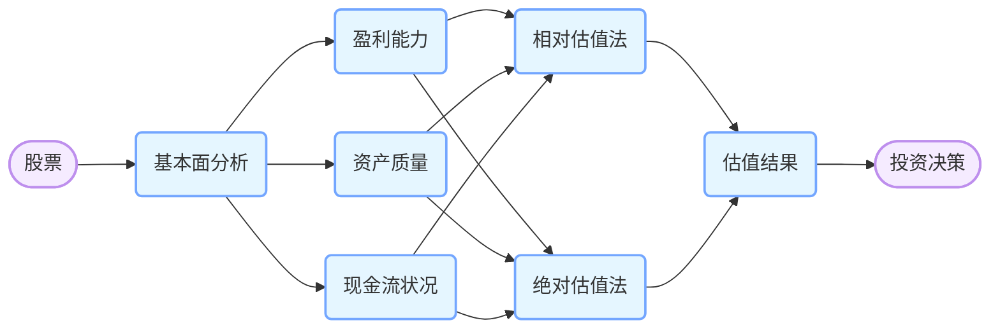

# 日本股市估值：成熟市场的特点与挑战

> 关键词：日本股市估值、成熟市场、特点、挑战、金融分析

> 摘要：本文聚焦于日本股市估值这一主题，深入剖析成熟市场的特点与面临的挑战。首先介绍了研究日本股市估值的目的、范围、预期读者以及文档结构等背景信息，接着阐述了股市估值的核心概念与联系，包括相关原理和架构，并通过 Mermaid 流程图进行直观展示。详细讲解了核心算法原理，运用 Python 代码进行具体说明，同时给出数学模型和公式并举例。通过项目实战，介绍开发环境搭建、源代码实现与解读。分析了日本股市估值在不同场景下的实际应用，推荐了相关的学习资源、开发工具框架以及论文著作。最后总结了未来发展趋势与挑战，解答常见问题，并提供扩展阅读与参考资料，旨在为投资者、金融研究者等提供全面深入的日本股市估值分析。

## 1. 背景介绍 
### 1.1 目的和范围
研究日本股市估值具有重要的现实意义。其目的在于深入了解日本作为成熟金融市场，股市估值的形成机制、影响因素以及其独特的特点和面临的挑战。这有助于投资者做出更明智的投资决策，为金融机构制定策略提供参考，也能为研究全球金融市场提供典型案例。

本研究的范围涵盖日本股市的整体估值情况，包括不同行业板块的估值差异，分析影响估值的宏观经济因素、公司基本面因素等。同时，对比日本股市与其他成熟市场以及新兴市场的估值特点，探讨其在国际金融市场中的地位和发展趋势。

### 1.2 预期读者
本文的预期读者主要包括以下几类人群：
- 投资者：无论是个人投资者还是机构投资者，都可以从本文中获取有关日本股市估值的信息，辅助其进行投资决策，评估投资风险和潜在收益。
- 金融分析师：为他们提供深入分析日本股市的思路和方法，有助于其进行更准确的市场研究和预测。
- 学术研究者：为研究金融市场、证券估值等领域的学者提供实证研究案例和理论分析基础。
- 金融从业者：如银行、券商等机构的从业人员，可通过了解日本股市估值特点，为客户提供更专业的金融服务和建议。

### 1.3 文档结构概述
本文将按照以下结构展开：
- 核心概念与联系：介绍股市估值的基本概念、原理和架构，通过文本示意图和 Mermaid 流程图进行直观展示。
- 核心算法原理 & 具体操作步骤：详细讲解用于日本股市估值的核心算法原理，并使用 Python 代码进行具体说明。
- 数学模型和公式 & 详细讲解 & 举例说明：给出相关的数学模型和公式，并进行详细解释和举例。
- 项目实战：介绍开发环境搭建，给出源代码详细实现和代码解读。
- 实际应用场景：分析日本股市估值在不同场景下的实际应用。
- 工具和资源推荐：推荐相关的学习资源、开发工具框架以及论文著作。
- 总结：总结日本股市估值的未来发展趋势与挑战。
- 附录：解答常见问题。
- 扩展阅读 & 参考资料：提供相关的扩展阅读和参考资料。

### 1.4 术语表
#### 1.4.1 核心术语定义
- **股市估值**：是指对股票市场整体或个别股票的价值进行评估的过程和结果。它通过一定的方法和指标，衡量股票价格相对于其内在价值的高低。
- **市盈率（P/E）**：是指股票价格除以每股收益（EPS）的比率，反映了投资者为获得公司每一元盈利所愿意支付的价格。
- **市净率（P/B）**：是指股票价格与每股净资产的比率，用于评估公司的市场价值相对于其账面价值的高低。
- **股息率**：是指股息与股票价格的比率，反映了股票投资的现金回报水平。

#### 1.4.2 相关概念解释
- **内在价值**：是指股票所代表的公司的真实价值，它基于公司的基本面因素，如盈利能力、资产状况、发展前景等。内在价值是股市估值的重要参考依据。
- **市场效率**：是指市场价格反映所有可用信息的程度。在有效市场中，股票价格能够及时、准确地反映公司的内在价值；而在无效市场中，股票价格可能会偏离其内在价值。

#### 1.4.3 缩略词列表
- **P/E**：市盈率（Price-to-Earnings Ratio）
- **P/B**：市净率（Price-to-Book Ratio）
- **EPS**：每股收益（Earnings Per Share）

## 2. 核心概念与联系 

### 股市估值原理
股市估值的核心原理是基于股票的内在价值。股票的内在价值取决于公司的基本面因素，如盈利能力、资产质量、现金流状况等。投资者通过对这些因素的分析，运用一定的估值方法，来评估股票的合理价值。

常见的估值方法包括相对估值法和绝对估值法。相对估值法是通过比较同行业或类似公司的估值指标，如市盈率、市净率等，来评估目标股票的价值。绝对估值法是通过预测公司未来的现金流，并将其折现到当前，来计算股票的内在价值。

### 架构示意图
以下是股市估值的基本架构示意图：



该流程图展示了股市估值的基本过程。首先对股票进行基本面分析，包括盈利能力、资产质量和现金流状况等方面。然后运用相对估值法和绝对估值法进行估值，最终得到估值结果，为投资决策提供依据。

### 日本股市估值的特点与联系
日本股市作为成熟市场，其估值具有一些独特的特点。与新兴市场相比，日本股市的估值相对较为稳定，波动幅度较小。这是因为日本经济发展较为成熟，企业的经营状况相对稳定，市场参与者也更加理性。

日本股市的估值还受到宏观经济因素的影响，如利率水平、通货膨胀率、经济增长率等。此外，日本企业的治理结构、行业竞争格局等也会对股市估值产生影响。

## 3. 核心算法原理 & 具体操作步骤 

### 相对估值法 - 市盈率法
市盈率法是最常用的相对估值法之一。其基本原理是通过比较目标股票的市盈率与同行业或市场平均市盈率，来评估目标股票的价值。

#### 算法原理
假设目标股票的价格为 $P$，每股收益为 $EPS$，同行业平均市盈率为 $P/E_{avg}$，则目标股票的合理价格 $P_{fair}$ 可以通过以下公式计算：

$$P_{fair} = EPS \times P/E_{avg}$$

#### Python 代码实现
```python
def pe_valuation(eps, pe_avg):
    """
    市盈率法估值函数
    :param eps: 每股收益
    :param pe_avg: 同行业平均市盈率
    :return: 目标股票的合理价格
    """
    return eps * pe_avg

# 示例数据
eps = 2.0  # 每股收益
pe_avg = 15  # 同行业平均市盈率

fair_price = pe_valuation(eps, pe_avg)
print(f"目标股票的合理价格为: {fair_price}")
```

### 绝对估值法 - 现金流折现法
现金流折现法是一种基于未来现金流的绝对估值法。其基本原理是将公司未来的现金流折现到当前，以计算公司的内在价值。

#### 算法原理
假设公司未来 $n$ 年的自由现金流分别为 $FCF_1, FCF_2, \cdots, FCF_n$，折现率为 $r$，则公司的内在价值 $V$ 可以通过以下公式计算：

$$V = \sum_{i=1}^{n} \frac{FCF_i}{(1 + r)^i} + \frac{TV}{(1 + r)^n}$$

其中，$TV$ 为公司的终值，通常可以采用永续增长模型计算：

$$TV = \frac{FCF_n \times (1 + g)}{r - g}$$

其中，$g$ 为永续增长率。

#### Python 代码实现
```python
def dcf_valuation(fcf_list, r, g):
    """
    现金流折现法估值函数
    :param fcf_list: 未来 n 年的自由现金流列表
    :param r: 折现率
    :param g: 永续增长率
    :return: 公司的内在价值
    """
    n = len(fcf_list)
    # 计算前 n 年现金流的现值
    present_value = 0
    for i in range(n):
        present_value += fcf_list[i] / ((1 + r) ** (i + 1))
    
    # 计算终值
    fcf_n = fcf_list[-1]
    tv = fcf_n * (1 + g) / (r - g)
    tv_present_value = tv / ((1 + r) ** n)
    
    # 计算公司的内在价值
    value = present_value + tv_present_value
    return value

# 示例数据
fcf_list = [100, 120, 140, 160, 180]  # 未来 5 年的自由现金流
r = 0.1  # 折现率
g = 0.03  # 永续增长率

company_value = dcf_valuation(fcf_list, r, g)
print(f"公司的内在价值为: {company_value}")
```

## 4. 数学模型和公式 & 详细讲解 & 举例说明 

### 市盈率法
#### 数学模型和公式
市盈率法的核心公式为：

$$P/E = \frac{P}{EPS}$$

其中，$P$ 为股票价格，$EPS$ 为每股收益。

通过变形可得目标股票的合理价格公式：

$$P_{fair} = EPS \times P/E_{avg}$$

#### 详细讲解
市盈率反映了投资者为获得公司每一元盈利所愿意支付的价格。同行业平均市盈率可以作为一个参考标准，当目标股票的市盈率低于同行业平均市盈率时，说明该股票可能被低估，具有投资价值；反之，则可能被高估。

#### 举例说明
假设某行业的平均市盈率为 20，某公司的每股收益为 3 元，则该公司股票的合理价格为：

$$P_{fair} = 3 \times 20 = 60 \text{ 元}$$

如果该公司股票的当前价格为 50 元，则说明该股票可能被低估，具有投资价值。

### 现金流折现法
#### 数学模型和公式
现金流折现法的核心公式为：

$$V = \sum_{i=1}^{n} \frac{FCF_i}{(1 + r)^i} + \frac{TV}{(1 + r)^n}$$

其中，$V$ 为公司的内在价值，$FCF_i$ 为第 $i$ 年的自由现金流，$r$ 为折现率，$n$ 为预测期数，$TV$ 为公司的终值。

终值的计算公式为：

$$TV = \frac{FCF_n \times (1 + g)}{r - g}$$

其中，$g$ 为永续增长率。

#### 详细讲解
现金流折现法的基本思想是将公司未来的现金流折现到当前，以反映其时间价值。折现率 $r$ 反映了投资者对资金的时间价值和风险的要求，通常可以采用加权平均资本成本（WACC）来计算。永续增长率 $g$ 表示公司在预测期结束后，将以一个稳定的增长率持续增长。

#### 举例说明
假设某公司未来 5 年的自由现金流分别为 100 万元、120 万元、140 万元、160 万元、180 万元，折现率为 10%，永续增长率为 3%。

首先，计算前 5 年现金流的现值：

$$PV_1 = \frac{100}{(1 + 0.1)^1} = 90.91 \text{ 万元}$$
$$PV_2 = \frac{120}{(1 + 0.1)^2} = 99.17 \text{ 万元}$$
$$PV_3 = \frac{140}{(1 + 0.1)^3} = 105.18 \text{ 万元}$$
$$PV_4 = \frac{160}{(1 + 0.1)^4} = 109.28 \text{ 万元}$$
$$PV_5 = \frac{180}{(1 + 0.1)^5} = 111.74 \text{ 万元}$$

前 5 年现金流的现值总和为：

$$PV_{total} = 90.91 + 99.17 + 105.18 + 109.28 + 111.74 = 516.28 \text{ 万元}$$

然后，计算终值：

$$TV = \frac{180 \times (1 + 0.03)}{0.1 - 0.03} = 2657.14 \text{ 万元}$$

终值的现值为：

$$PV_{TV} = \frac{2657.14}{(1 + 0.1)^5} = 1647.77 \text{ 万元}$$

最后，计算公司的内在价值：

$$V = 516.28 + 1647.77 = 2164.05 \text{ 万元}$$

## 5. 项目实战：代码实际案例和详细解释说明 

### 5.1  开发环境搭建
本项目使用 Python 进行开发，需要安装以下必要的库：
- `pandas`：用于数据处理和分析。
- `numpy`：用于数值计算。
- `matplotlib`：用于数据可视化。

可以使用以下命令进行安装：

```sh
pip install pandas numpy matplotlib
```

### 5.2  源代码详细实现和代码解读
以下是一个使用市盈率法对日本股市某公司股票进行估值的实际案例：

```python
import pandas as pd

def pe_valuation(eps, pe_avg):
    """
    市盈率法估值函数
    :param eps: 每股收益
    :param pe_avg: 同行业平均市盈率
    :return: 目标股票的合理价格
    """
    return eps * pe_avg

# 读取数据
data = pd.read_csv('japan_stock_data.csv')

# 提取目标公司的每股收益
target_eps = data[data['Company'] == 'Target Company']['EPS'].values[0]

# 提取同行业平均市盈率
industry_pe_avg = data[data['Company'] == 'Industry Average']['P/E'].values[0]

# 进行估值
fair_price = pe_valuation(target_eps, industry_pe_avg)

print(f"目标公司股票的合理价格为: {fair_price}")
```

#### 代码解读
1. **导入必要的库**：导入 `pandas` 库用于数据处理。
2. **定义市盈率法估值函数**：`pe_valuation` 函数接受每股收益和同行业平均市盈率作为参数，返回目标股票的合理价格。
3. **读取数据**：使用 `pandas` 的 `read_csv` 函数读取包含日本股市数据的 CSV 文件。
4. **提取目标公司的每股收益**：通过筛选数据，提取目标公司的每股收益。
5. **提取同行业平均市盈率**：同样通过筛选数据，提取同行业平均市盈率。
6. **进行估值**：调用 `pe_valuation` 函数进行估值，并打印结果。

### 5.3  代码解读与分析
该代码实现了一个简单的市盈率法估值模型。通过读取数据，提取必要的信息，然后使用市盈率法计算目标公司股票的合理价格。

在实际应用中，需要注意数据的准确性和可靠性。数据来源应该是权威的，并且需要对数据进行清洗和预处理，以确保估值结果的准确性。此外，市盈率法只是一种相对简单的估值方法，在实际投资决策中，还需要综合考虑其他因素，如公司的发展前景、行业竞争格局等。

## 6. 实际应用场景 
### 投资者决策
投资者可以利用日本股市估值的方法和结果，来评估股票的投资价值。当股票的市场价格低于其合理估值时，投资者可以考虑买入；反之，则可以考虑卖出或持币观望。例如，通过市盈率法和现金流折现法对某日本公司股票进行估值后，如果发现该股票被低估，投资者可以增加对该股票的持仓。

### 金融机构研究
金融机构可以对日本股市估值进行深入研究，为客户提供投资建议和研究报告。例如，证券公司可以通过对不同行业板块的估值分析，为客户推荐具有投资潜力的行业和公司。银行可以在进行信贷决策时，参考企业的股市估值情况，评估企业的信用风险。

### 政策制定参考
政府和监管机构可以根据日本股市估值的情况，制定相关的金融政策和监管措施。例如，当股市估值过高，存在泡沫风险时，政府可以采取加息、收紧货币政策等措施，以抑制股市泡沫的膨胀；当股市估值过低，市场信心不足时，政府可以采取降息、推出刺激政策等措施，以提振市场信心。

### 企业并购重组
在企业并购重组过程中，股市估值可以作为评估目标企业价值的重要依据。收购方可以通过对目标企业的估值，确定合理的收购价格，避免过高或过低的出价。同时，目标企业也可以通过了解自身的股市估值情况，在并购谈判中争取更有利的条件。

## 7. 工具和资源推荐
### 7.1 学习资源推荐
#### 7.1.1 书籍推荐
- 《证券分析》（Security Analysis）：由本杰明·格雷厄姆（Benjamin Graham）和戴维·多德（David Dodd）所著，是价值投资领域的经典著作，详细介绍了股票估值的基本方法和原理。
- 《聪明的投资者》（The Intelligent Investor）：同样是本杰明·格雷厄姆的著作，被巴菲特誉为“有史以来最伟大的投资著作”，书中包含了许多实用的投资策略和估值方法。
- 《估值：难点、解决方案及相关案例》（Valuation: Measuring and Managing the Value of Companies）：由蒂姆·科勒（Tim Koller）、马克·戈德哈特（Marc Goedhart）和戴维·威赛尔斯（David Wessels）所著，全面介绍了企业估值的各种方法和技术，包括相对估值法和绝对估值法。

#### 7.1.2 在线课程
- Coursera 上的“投资学原理”（Principles of Investments）课程：由知名高校教授授课，涵盖了股票估值、投资组合管理等投资学的核心内容。
- edX 上的“金融市场”（Financial Markets）课程：耶鲁大学教授罗伯特·席勒（Robert Shiller）主讲，深入讲解了金融市场的运行机制和股票估值的相关理论。
- 中国大学 MOOC 上的“证券投资学”课程：国内高校教师授课，结合中国和国际金融市场的实际情况，介绍股票估值的方法和应用。

#### 7.1.3 技术博客和网站
- Seeking Alpha：是一个知名的金融投资博客平台，提供大量关于股票估值、市场分析和投资策略的文章和研究报告。
- Bloomberg：全球领先的财经资讯提供商，提供实时的金融市场数据、分析和评论，有助于了解日本股市的最新动态和估值情况。
- 东方财富网：国内知名的财经网站，提供丰富的金融数据和分析工具，也有关于日本股市的相关信息和研究报告。

### 7.2 开发工具框架推荐
#### 7.2.1 IDE和编辑器
- PyCharm：是一款专业的 Python 集成开发环境，具有代码编辑、调试、代码分析等功能，适合进行股票估值的 Python 代码开发。
- Jupyter Notebook：是一个交互式的开发环境，支持 Python 等多种编程语言，方便进行数据探索、模型开发和结果展示。
- Visual Studio Code：是一款轻量级的代码编辑器，支持多种编程语言和插件扩展，可用于快速编写和调试股票估值代码。

#### 7.2.2 调试和性能分析工具
- pdb：Python 自带的调试工具，可以帮助开发者定位代码中的错误和问题。
- cProfile：Python 的性能分析工具，可以分析代码的运行时间和资源消耗情况，帮助优化代码性能。
- Py-Spy：一个用于分析 Python 程序性能的工具，可以实时监控 Python 程序的运行情况，找出性能瓶颈。

#### 7.2.3 相关框架和库
- pandas：是一个强大的数据处理和分析库，提供了丰富的数据结构和函数，可用于处理和分析股票市场数据。
- numpy：是 Python 的数值计算库，提供了高效的数组和矩阵运算功能，可用于股票估值模型的数值计算。
- scikit-learn：是一个机器学习库，提供了多种机器学习算法和工具，可用于股票估值模型的构建和预测。

### 7.3 相关论文著作推荐
#### 7.3.1 经典论文
- “The Capital Asset Pricing Model: Theory and Evidence”：由 Eugene F. Fama 和 Kenneth R. French 所著，是资本资产定价模型（CAPM）领域的经典论文，对股票估值和投资组合理论产生了深远影响。
- “Market Efficiency, Long-Term Returns, and Behavioral Finance”：同样是 Eugene F. Fama 和 Kenneth R. French 的论文，探讨了市场效率和投资者行为对股票估值和长期回报的影响。
- “Dividend Policy, Growth, and the Valuation of Shares”：由 Myron J. Gordon 和 Eli Shapiro 所著，提出了股息折现模型（DDM），是股票估值的重要方法之一。

#### 7.3.2 最新研究成果
- 可以关注《Journal of Finance》、《Review of Financial Studies》等国际顶级金融学术期刊，这些期刊发表了许多关于股票估值、金融市场和投资策略的最新研究成果。
- 国内的《金融研究》、《经济研究》等学术期刊也有关于股票估值和金融市场的相关研究论文。

#### 7.3.3 应用案例分析
- 可以参考一些专业的金融研究报告和案例分析书籍，如《金融案例分析》、《投资银行案例分析》等，这些资料中包含了许多实际的股票估值和投资决策案例，有助于深入理解股票估值的应用。

## 8. 总结：未来发展趋势与挑战
### 未来发展趋势
- **数字化和智能化**：随着科技的不断发展，日本股市估值将越来越多地采用数字化和智能化的方法和工具。例如，利用大数据分析、人工智能和机器学习等技术，对海量的市场数据进行分析和挖掘，提高估值的准确性和效率。
- **国际化和全球化**：日本股市作为全球金融市场的重要组成部分，将更加融入国际金融市场。跨国投资和并购活动将更加频繁，日本股市的估值也将受到国际市场因素的影响越来越大。因此，在进行日本股市估值时，需要考虑全球经济和金融市场的动态变化。
- **可持续发展和社会责任**：越来越多的投资者开始关注企业的可持续发展和社会责任，这将对日本股市估值产生影响。具有良好的环境、社会和治理（ESG）表现的企业，可能会获得更高的估值；而那些存在环境和社会问题的企业，可能会面临估值下降的压力。

### 挑战
- **宏观经济不确定性**：全球经济增长的不确定性、贸易摩擦、货币政策变化等宏观经济因素，将给日本股市估值带来挑战。例如，经济衰退可能导致企业盈利能力下降，从而影响股票估值；货币政策的调整可能会改变市场利率水平，进而影响股票的折现率和估值。
- **市场情绪和投资者行为**：市场情绪和投资者行为的非理性波动，可能会导致股票价格偏离其内在价值，增加估值的难度。例如，投资者的恐慌情绪可能会导致股市暴跌，而过度乐观的情绪可能会导致股市泡沫的形成。
- **数据质量和信息不对称**：准确的估值需要高质量的数据和充分的信息。然而，在实际应用中，可能会存在数据质量不高、信息不完整或信息不对称的问题，这将影响估值的准确性和可靠性。例如，一些企业可能会隐瞒或虚报财务信息，导致投资者无法准确评估其价值。

## 9. 附录：常见问题与解答
### 问题 1：市盈率法和现金流折现法哪种方法更准确？
答：两种方法各有优缺点，准确性取决于具体的应用场景和数据情况。市盈率法简单易懂，易于操作，适用于对同行业公司进行相对估值。但它没有考虑公司的未来增长潜力和现金流状况，可能会忽略一些重要的因素。现金流折现法考虑了公司未来的现金流和时间价值，理论上更加准确，但需要对未来现金流和折现率进行预测，预测的准确性会影响估值结果。在实际应用中，通常可以结合使用两种方法，以提高估值的准确性。

### 问题 2：如何确定同行业平均市盈率？
答：确定同行业平均市盈率可以通过以下几种方法：
- **行业研究报告**：参考专业的行业研究机构发布的报告，其中通常会提供同行业的平均市盈率数据。
- **金融数据平台**：使用 Bloomberg、Wind 等金融数据平台，查询同行业公司的市盈率数据，并计算平均值。
- **自己计算**：收集同行业多家公司的市盈率数据，去除异常值后，计算平均值。

### 问题 3：折现率如何确定？
答：折现率反映了投资者对资金的时间价值和风险的要求。通常可以采用加权平均资本成本（WACC）来计算折现率。WACC 的计算公式为：

$$WACC = E/V \times Re + D/V \times Rd \times (1 - Tc)$$

其中，$E$ 为股权价值，$D$ 为债务价值，$V = E + D$ 为公司总价值，$Re$ 为股权成本，$Rd$ 为债务成本，$Tc$ 为公司所得税税率。

股权成本可以采用资本资产定价模型（CAPM）来计算：

$$Re = Rf + \beta \times (Rm - Rf)$$

其中，$Rf$ 为无风险利率，$\beta$ 为股票的贝塔系数，$Rm$ 为市场收益率。

债务成本可以参考公司的债券利率或贷款利率。

## 10. 扩展阅读 & 参考资料
### 扩展阅读
- 《金融炼金术》（The Alchemy of Finance）：乔治·索罗斯（George Soros）的著作，探讨了金融市场的反身性原理和投资策略。
- 《非理性繁荣》（Irrational Exuberance）：罗伯特·席勒（Robert Shiller）的著作，分析了金融市场中的非理性行为和泡沫现象。
- 《漫步华尔街》（A Random Walk Down Wall Street）：伯顿·马尔基尔（Burton G. Malkiel）的著作，介绍了有效市场假说和随机漫步理论，对股票投资有重要的启示。

### 参考资料
- Bloomberg Terminal：提供全球金融市场的实时数据和分析。
- Yahoo Finance：提供股票市场数据、新闻和分析。
- 日本证券交易所官方网站：提供日本股市的相关信息和数据。

作者：AI天才研究院/AI Genius Institute & 禅与计算机程序设计艺术 /Zen And The Art of Computer Programming