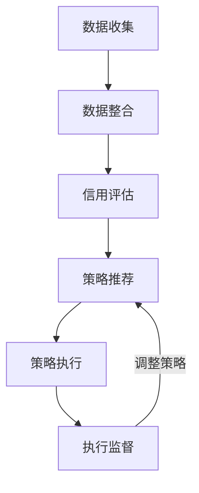

# 智能个人信用修复策略推荐与执行系统

> 关键词：个人信用修复、智能推荐、策略执行、信用评估、大数据分析

> 摘要：本文围绕智能个人信用修复策略推荐与执行系统展开深入探讨。详细介绍了该系统的背景、核心概念、算法原理、数学模型等内容。通过Python代码阐述了核心算法的实现，结合实际案例说明了系统的开发环境搭建、代码实现与解读。分析了系统在实际中的应用场景，推荐了相关的学习资源、开发工具和论文著作。最后总结了系统的未来发展趋势与挑战，并提供了常见问题解答和扩展阅读参考资料，旨在为个人信用修复领域提供全面且深入的技术指导。

## 1. 背景介绍 
### 1.1 目的和范围
在当今社会，个人信用在金融借贷、消费、就业等多个领域都起着至关重要的作用。然而，由于各种原因，部分个人可能会出现信用不良的情况。智能个人信用修复策略推荐与执行系统的目的就是为信用受损的个人提供个性化的信用修复策略，并协助他们执行这些策略，以帮助其恢复良好的信用状况。

本系统的范围涵盖了从收集个人信用数据、分析信用状况、生成修复策略到监督策略执行的全过程。系统将综合考虑多种因素，如信用报告中的逾期记录、欠款金额、还款历史等，为用户提供准确、可行的修复方案。

### 1.2 预期读者
本文的预期读者包括从事金融科技、信用管理、人工智能等领域的专业人士，如数据科学家、软件工程师、金融分析师等。同时，对于关注个人信用修复的普通用户，也可以通过本文了解该系统的基本原理和操作方法，从而更好地管理自己的信用。

### 1.3 文档结构概述
本文将按照以下结构进行组织：首先介绍系统的背景信息，包括目的、预期读者和文档结构概述；接着阐述系统的核心概念与联系，通过文本示意图和Mermaid流程图进行说明；然后详细讲解核心算法原理和具体操作步骤，并使用Python代码进行实现；随后介绍系统所涉及的数学模型和公式，并举例说明；再通过项目实战展示系统的开发环境搭建、源代码实现和代码解读；分析系统的实际应用场景；推荐相关的工具和资源；总结系统的未来发展趋势与挑战；提供常见问题解答；最后列出扩展阅读和参考资料。

### 1.4 术语表
#### 1.4.1 核心术语定义
- **个人信用修复**：指通过一系列合法、合规的措施，改善个人信用报告中的不良记录，提高个人信用评分的过程。
- **信用评估**：根据个人的信用历史、财务状况等信息，对其信用风险进行评估和预测的过程。
- **策略推荐**：根据用户的信用状况和需求，为其提供个性化的信用修复策略的过程。
- **策略执行**：用户按照推荐的策略进行实际操作，以实现信用修复的过程。

#### 1.4.2 相关概念解释
- **信用报告**：记录个人信用交易历史和信用状况的文件，是信用评估的重要依据。
- **信用评分**：根据个人的信用报告和信用评估模型，计算得出的一个数值，用于反映个人的信用风险程度。
- **逾期记录**：指个人在还款期限内未能按时偿还债务的记录，对信用评分有较大的负面影响。

#### 1.4.3 缩略词列表
- **API**：Application Programming Interface，应用程序编程接口
- **ML**：Machine Learning，机器学习
- **AI**：Artificial Intelligence，人工智能

## 2. 核心概念与联系 

### 核心概念原理
智能个人信用修复策略推荐与执行系统主要基于以下几个核心概念：

#### 数据收集与整合
系统需要收集用户的各种信用相关数据，包括信用报告、银行流水、消费记录等。这些数据来源广泛，可能来自不同的机构和平台。系统需要将这些数据进行整合，形成一个全面的用户信用数据集，以便后续的分析和处理。

#### 信用评估模型
通过机器学习和数据分析技术，系统建立信用评估模型。该模型根据用户的信用数据，对其信用状况进行评估，计算出信用评分和信用风险等级。信用评估模型是系统的核心组成部分，其准确性直接影响到后续策略推荐的有效性。

#### 策略推荐引擎
基于信用评估结果，策略推荐引擎为用户生成个性化的信用修复策略。策略推荐引擎会考虑多种因素，如用户的信用问题类型、还款能力、信用修复目标等，从预先定义的策略库中选择最合适的策略推荐给用户。

#### 策略执行监督
系统会对用户的策略执行情况进行监督和跟踪。通过与金融机构和相关平台的接口，系统可以实时获取用户的还款记录、信用报告更新等信息，及时了解策略的执行效果。如果发现用户在执行过程中遇到问题或策略效果不佳，系统会及时调整策略，确保信用修复目标的实现。

### 架构的文本示意图
```plaintext
+---------------------+
|     数据收集层      |
| （信用报告、银行流水等） |
+---------------------+
        |
        v
+---------------------+
|     数据整合层      |
| （数据清洗、特征提取） |
+---------------------+
        |
        v
+---------------------+
|    信用评估模型层   |
| （机器学习模型）    |
+---------------------+
        |
        v
+---------------------+
|   策略推荐引擎层    |
| （策略库、推荐算法） |
+---------------------+
        |
        v
+---------------------+
|   策略执行监督层    |
| （实时数据监测、调整） |
+---------------------+
```

### Mermaid流程图


## 3. 核心算法原理 & 具体操作步骤 

### 核心算法原理
本系统的核心算法主要包括信用评估算法和策略推荐算法。

#### 信用评估算法
我们可以使用逻辑回归算法进行信用评估。逻辑回归是一种常用的分类算法，它可以根据输入的特征变量，预测输出的概率。在信用评估中，我们可以将信用风险分为高、中、低三个等级，通过逻辑回归模型计算用户属于每个等级的概率。

逻辑回归的基本公式为：
$$P(y = 1|x) = \frac{1}{1 + e^{-(w_0 + w_1x_1 + w_2x_2 + \cdots + w_nx_n)}}$$
其中，$P(y = 1|x)$ 表示在给定特征向量 $x$ 的情况下，输出为 1 的概率；$w_0, w_1, \cdots, w_n$ 是模型的权重参数；$x_1, x_2, \cdots, x_n$ 是特征向量的各个分量。

#### 策略推荐算法
策略推荐算法可以采用基于规则的推荐方法。根据信用评估结果和用户的信用修复目标，我们可以定义一系列规则，例如：
- 如果用户的信用评分较低且有逾期记录，推荐优先偿还逾期欠款的策略。
- 如果用户的欠款金额较大，推荐制定合理的还款计划的策略。

### 具体操作步骤
#### 步骤 1：数据预处理
首先，我们需要对收集到的信用数据进行预处理，包括数据清洗、缺失值处理、特征提取等。以下是一个简单的Python代码示例：

```python
import pandas as pd
from sklearn.preprocessing import StandardScaler

# 读取信用数据
data = pd.read_csv('credit_data.csv')

# 处理缺失值
data = data.fillna(data.mean())

# 提取特征和标签
X = data.drop('credit_risk', axis=1)
y = data['credit_risk']

# 特征标准化
scaler = StandardScaler()
X_scaled = scaler.fit_transform(X)
```

#### 步骤 2：训练信用评估模型
使用预处理后的数据训练逻辑回归模型：

```python
from sklearn.linear_model import LogisticRegression
from sklearn.model_selection import train_test_split

# 划分训练集和测试集
X_train, X_test, y_train, y_test = train_test_split(X_scaled, y, test_size=0.2, random_state=42)

# 训练逻辑回归模型
model = LogisticRegression()
model.fit(X_train, y_train)

# 评估模型
accuracy = model.score(X_test, y_test)
print(f"模型准确率: {accuracy}")
```

#### 步骤 3：策略推荐
根据信用评估结果，实现基于规则的策略推荐：

```python
def recommend_strategy(credit_score, overdue_records, debt_amount):
    if credit_score < 600 and overdue_records > 0:
        return "优先偿还逾期欠款"
    elif debt_amount > 10000:
        return "制定合理的还款计划"
    else:
        return "保持良好的还款记录"

# 示例信用评估结果
credit_score = 550
overdue_records = 2
debt_amount = 15000

strategy = recommend_strategy(credit_score, overdue_records, debt_amount)
print(f"推荐策略: {strategy}")
```

## 4. 数学模型和公式 & 详细讲解 & 举例说明 

### 逻辑回归模型公式
如前所述，逻辑回归的基本公式为：
$$P(y = 1|x) = \frac{1}{1 + e^{-(w_0 + w_1x_1 + w_2x_2 + \cdots + w_nx_n)}}$$

其中，$P(y = 1|x)$ 表示在给定特征向量 $x = [x_1, x_2, \cdots, x_n]$ 的情况下，输出为 1 的概率。$w_0$ 是截距项，$w_1, w_2, \cdots, w_n$ 是特征的权重参数。

### 详细讲解
逻辑回归模型的核心思想是通过一个线性组合 $z = w_0 + w_1x_1 + w_2x_2 + \cdots + w_nx_n$ 来计算输入特征的得分，然后通过 sigmoid 函数将得分转换为概率值。sigmoid 函数的定义为：
$$\sigma(z) = \frac{1}{1 + e^{-z}}$$

sigmoid 函数的取值范围是 $(0, 1)$，它可以将任意实数 $z$ 映射到 $(0, 1)$ 区间内，因此非常适合用于表示概率。

### 举例说明
假设我们有一个简单的信用评估问题，只考虑两个特征：逾期次数 $x_1$ 和欠款金额 $x_2$。我们已经训练好的逻辑回归模型的参数为 $w_0 = -2$，$w_1 = 0.5$，$w_2 = 0.001$。

现在有一个用户，他的逾期次数 $x_1 = 3$，欠款金额 $x_2 = 5000$。我们可以计算该用户的得分 $z$：
$$z = w_0 + w_1x_1 + w_2x_2 = -2 + 0.5 \times 3 + 0.001 \times 5000 = -2 + 1.5 + 5 = 4.5$$

然后，我们可以通过 sigmoid 函数计算该用户信用风险为高（即 $y = 1$）的概率：
$$P(y = 1|x) = \frac{1}{1 + e^{-4.5}} \approx 0.98$$

这意味着该用户有 98% 的概率信用风险较高。

## 5. 项目实战：代码实际案例和详细解释说明 

### 5.1  开发环境搭建
#### 操作系统
本项目可以在 Windows、Linux 或 macOS 操作系统上进行开发。

#### Python 环境
建议使用 Python 3.7 及以上版本。可以通过 Anaconda 或官方 Python 安装包进行安装。

#### 依赖库安装
使用以下命令安装项目所需的依赖库：
```bash
pip install pandas numpy scikit-learn
```

### 5.2  源代码详细实现和代码解读
以下是一个完整的项目代码示例：

```python
import pandas as pd
from sklearn.preprocessing import StandardScaler
from sklearn.linear_model import LogisticRegression
from sklearn.model_selection import train_test_split

# 步骤 1：数据预处理
def preprocess_data(file_path):
    # 读取信用数据
    data = pd.read_csv(file_path)
    
    # 处理缺失值
    data = data.fillna(data.mean())
    
    # 提取特征和标签
    X = data.drop('credit_risk', axis=1)
    y = data['credit_risk']
    
    # 特征标准化
    scaler = StandardScaler()
    X_scaled = scaler.fit_transform(X)
    
    return X_scaled, y

# 步骤 2：训练信用评估模型
def train_model(X, y):
    # 划分训练集和测试集
    X_train, X_test, y_train, y_test = train_test_split(X, y, test_size=0.2, random_state=42)
    
    # 训练逻辑回归模型
    model = LogisticRegression()
    model.fit(X_train, y_train)
    
    # 评估模型
    accuracy = model.score(X_test, y_test)
    print(f"模型准确率: {accuracy}")
    
    return model

# 步骤 3：策略推荐
def recommend_strategy(credit_score, overdue_records, debt_amount):
    if credit_score < 600 and overdue_records > 0:
        return "优先偿还逾期欠款"
    elif debt_amount > 10000:
        return "制定合理的还款计划"
    else:
        return "保持良好的还款记录"

# 主函数
if __name__ == "__main__":
    # 数据预处理
    X, y = preprocess_data('credit_data.csv')
    
    # 训练模型
    model = train_model(X, y)
    
    # 示例信用评估结果
    sample_user = [[1, 2, 3, 4, 5]]  # 假设的特征向量
    credit_score = model.predict_proba(sample_user)[0][1] * 100
    overdue_records = 2
    debt_amount = 15000
    
    # 策略推荐
    strategy = recommend_strategy(credit_score, overdue_records, debt_amount)
    print(f"推荐策略: {strategy}")
```

### 5.3  代码解读与分析
#### 数据预处理函数 `preprocess_data`
该函数接受一个 CSV 文件路径作为输入，读取信用数据并进行预处理。具体步骤包括处理缺失值、提取特征和标签、特征标准化。最后返回标准化后的特征矩阵和标签向量。

#### 模型训练函数 `train_model`
该函数接受特征矩阵和标签向量作为输入，将数据划分为训练集和测试集，然后使用逻辑回归模型进行训练。训练完成后，评估模型的准确率并返回训练好的模型。

#### 策略推荐函数 `recommend_strategy`
该函数根据信用评分、逾期记录和欠款金额，基于规则进行策略推荐。如果信用评分低于 600 且有逾期记录，推荐优先偿还逾期欠款；如果欠款金额大于 10000，推荐制定合理的还款计划；否则，推荐保持良好的还款记录。

#### 主函数
主函数调用上述三个函数，完成数据预处理、模型训练和策略推荐的整个流程。最后输出推荐的信用修复策略。

## 6. 实际应用场景 
### 金融机构
金融机构可以使用智能个人信用修复策略推荐与执行系统来帮助信用受损的客户修复信用。通过为客户提供个性化的修复策略，金融机构可以提高客户的信用质量，降低信贷风险。同时，这也有助于增强客户的忠诚度，提高金融机构的市场竞争力。

### 信用服务机构
信用服务机构可以将该系统作为一项增值服务提供给客户。通过系统的信用评估和策略推荐功能，信用服务机构可以帮助客户了解自己的信用状况，制定合理的信用修复计划。这不仅可以为客户提供更好的服务，还可以为信用服务机构带来新的业务增长点。

### 个人用户
个人用户可以使用该系统来管理自己的信用。通过输入自己的信用信息，系统可以为用户提供个性化的信用修复策略，并监督策略的执行情况。这有助于个人用户提高自己的信用意识，主动改善自己的信用状况。

## 7. 工具和资源推荐
### 7.1 学习资源推荐
#### 7.1.1 书籍推荐
- 《Python 机器学习》：本书详细介绍了使用 Python 进行机器学习的方法和技巧，涵盖了数据预处理、模型选择、评估等方面的内容。
- 《信用评分模型技术与应用》：全面介绍了信用评分模型的原理、构建方法和应用场景，对于理解信用评估算法非常有帮助。

#### 7.1.2 在线课程
- Coursera 上的“机器学习”课程：由斯坦福大学教授 Andrew Ng 授课，是机器学习领域的经典课程，适合初学者入门。
- edX 上的“数据科学与人工智能”课程：提供了数据科学和人工智能的全面介绍，包括机器学习、深度学习等方面的内容。

#### 7.1.3 技术博客和网站
- Medium：上面有很多关于机器学习、人工智能和信用管理的技术文章和案例分享。
- Kaggle：是一个数据科学竞赛平台，上面有很多与信用评估相关的数据集和解决方案，可以供学习和参考。

### 7.2 开发工具框架推荐
#### 7.2.1 IDE和编辑器
- PyCharm：是一款专业的 Python 集成开发环境，提供了丰富的代码编辑、调试和项目管理功能。
- Jupyter Notebook：是一个交互式的开发环境，适合进行数据探索、模型实验和可视化展示。

#### 7.2.2 调试和性能分析工具
- PDB：Python 自带的调试工具，可以帮助开发者定位代码中的问题。
- Scikit-learn 的模型评估工具：可以用于评估机器学习模型的性能，如准确率、召回率、F1 值等。

#### 7.2.3 相关框架和库
- Pandas：是一个强大的数据处理和分析库，提供了高效的数据结构和数据操作方法。
- NumPy：是 Python 科学计算的基础库，提供了多维数组和矩阵运算的功能。
- Scikit-learn：是一个常用的机器学习库，提供了丰富的机器学习算法和工具。

### 7.3 相关论文著作推荐
#### 7.3.1 经典论文
- “Credit Scoring Using Neural Networks”：该论文介绍了使用神经网络进行信用评分的方法和实验结果。
- “A Survey of Credit Scoring: Methods and Applications”：对信用评分的方法和应用进行了全面的综述。

#### 7.3.2 最新研究成果
- 关注顶级学术会议如 KDD（Knowledge Discovery and Data Mining）、ICML（International Conference on Machine Learning）上的相关研究论文，了解信用评估和修复领域的最新技术和方法。

#### 7.3.3 应用案例分析
- 一些金融机构和信用服务机构会发布自己的信用修复案例分析报告，可以通过这些报告了解系统在实际应用中的效果和经验。

## 8. 总结：未来发展趋势与挑战
### 未来发展趋势
#### 智能化和自动化
随着人工智能和机器学习技术的不断发展，智能个人信用修复策略推荐与执行系统将变得更加智能化和自动化。系统可以自动收集和分析用户的信用数据，实时调整修复策略，提高修复效率和效果。

#### 多源数据融合
未来的系统将不仅仅依赖于传统的信用报告数据，还会融合更多的多源数据，如社交媒体数据、消费数据等。通过综合分析这些数据，可以更全面地了解用户的信用状况，提供更精准的修复策略。

#### 个性化服务
系统将更加注重个性化服务，根据用户的不同需求和信用状况，提供定制化的信用修复方案。同时，系统还可以为用户提供实时的信用监控和预警服务，帮助用户及时发现和解决信用问题。

### 挑战
#### 数据隐私和安全
系统需要收集和处理大量的用户信用数据，这些数据涉及用户的隐私和敏感信息。因此，如何保证数据的隐私和安全是系统面临的一个重要挑战。

#### 模型准确性和可靠性
信用评估模型的准确性和可靠性直接影响到策略推荐的效果。由于信用数据的复杂性和不确定性，如何提高模型的准确性和可靠性是一个亟待解决的问题。

#### 法律法规合规
个人信用修复涉及到一系列的法律法规，如《征信业管理条例》等。系统的开发和运营需要严格遵守相关法律法规，确保合法合规。

## 9. 附录：常见问题与解答
### 问题 1：系统的信用评估结果准确吗？
系统的信用评估结果是基于机器学习模型和大量的信用数据进行计算的，但由于信用数据的复杂性和不确定性，评估结果可能存在一定的误差。系统会不断优化模型和算法，提高评估结果的准确性。

### 问题 2：推荐的策略一定能修复我的信用吗？
推荐的策略是根据用户的信用状况和信用修复目标制定的，但信用修复是一个长期的过程，受到多种因素的影响。用户需要积极配合执行推荐的策略，并保持良好的信用行为，才能提高信用修复的成功率。

### 问题 3：系统会泄露我的个人信用信息吗？
系统非常重视用户的个人信用信息安全，采用了多种安全技术和措施来保护用户的数据。同时，系统严格遵守相关法律法规，不会将用户的个人信用信息泄露给任何第三方。

## 10. 扩展阅读 & 参考资料
### 扩展阅读
- 《人工智能时代的信用管理》
- 《大数据与信用评估》

### 参考资料
- 《征信业管理条例》
- 相关金融机构和信用服务机构的官方网站

作者：AI天才研究院/AI Genius Institute & 禅与计算机程序设计艺术 /Zen And The Art of Computer Programming