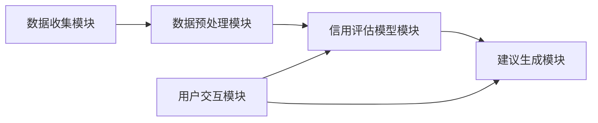

# 智能个人信用评分优化与修复建议系统

> 关键词：个人信用评分、智能优化、信用修复建议、系统架构、算法原理

> 摘要：本文聚焦于智能个人信用评分优化与修复建议系统，旨在深入探讨该系统的核心概念、算法原理、数学模型等内容。通过详细阐述系统的架构和实现步骤，结合实际案例进行分析，展现其在个人信用管理领域的重要应用价值。同时，介绍了相关的工具和资源，对未来发展趋势与挑战进行了总结，为相关研究和实践提供全面而深入的参考。

## 1. 背景介绍 
### 1.1 目的和范围
个人信用评分在现代金融和社会生活中扮演着至关重要的角色，它影响着个人的信贷申请、租房、就业等多个方面。然而，许多人由于缺乏对信用评分的了解，或者在信用管理过程中出现失误，导致信用评分不理想。本系统的目的在于开发一个智能系统，能够对个人信用评分进行分析，提供优化建议，并针对低信用评分者提供修复建议。系统的范围涵盖了从数据收集、信用评估模型构建到建议生成的整个流程，旨在为用户提供一站式的信用管理解决方案。

### 1.2 预期读者
本文的预期读者包括金融科技领域的从业者，如数据分析师、算法工程师、产品经理等，他们可以从系统的架构设计、算法实现等方面获取灵感和参考。同时，对于关注个人信用管理的普通用户，也可以通过本文了解信用评分的原理和优化修复方法，从而更好地管理自己的信用。此外，高校相关专业的学生和研究人员也可以将本文作为研究个人信用评分系统的参考资料。

### 1.3 文档结构概述
本文将按照以下结构进行阐述：首先介绍系统相关的核心概念和它们之间的联系，包括信用评分的基本原理和系统的架构；接着详细讲解核心算法原理和具体操作步骤，通过Python代码进行示例；然后介绍系统所涉及的数学模型和公式，并举例说明；之后通过实际项目案例，展示系统的开发环境搭建、源代码实现和代码解读；再介绍系统的实际应用场景；推荐相关的工具和资源；最后总结系统的未来发展趋势与挑战，并提供常见问题解答和扩展阅读参考资料。

### 1.4 术语表
#### 1.4.1 核心术语定义
- **个人信用评分**：是金融机构和信用评估机构根据个人的信用历史、还款能力、负债情况等多方面信息，通过特定的算法计算得出的一个数值，用于评估个人的信用风险。
- **信用优化**：指通过合理的信用管理行为，如按时还款、控制负债等，提高个人信用评分的过程。
- **信用修复**：针对信用评分较低的个人，采取一系列措施来改善其信用状况，使其信用评分逐步恢复到正常水平的过程。
- **信用报告**：记录个人信用历史信息的文件，包括信用卡使用情况、贷款记录、还款记录等，是信用评分的重要依据。

#### 1.4.2 相关概念解释
- **信用风险**：指个人或企业在信用交易中可能无法按时履行还款义务的风险。信用评分是评估信用风险的重要工具之一。
- **信用行为**：包括个人的借贷、还款、消费等与信用相关的行为，这些行为会直接影响个人的信用评分。
- **信用评估模型**：是一种数学模型，用于根据个人的信用数据计算信用评分。常见的信用评估模型有逻辑回归模型、决策树模型等。

#### 1.4.3 缩略词列表
- **FICO**：Fair Isaac Corporation，美国一家著名的信用评分公司，其开发的FICO评分系统在全球广泛应用。
- **API**：Application Programming Interface，应用程序编程接口，用于不同软件系统之间的交互和数据传输。

## 2. 核心概念与联系 

### 核心概念原理
个人信用评分的原理基于对个人信用相关数据的分析和建模。信用数据包括个人的基本信息（如年龄、收入等）、信用历史（如信用卡还款记录、贷款记录等）、负债情况等。通过对这些数据的挖掘和分析，信用评估机构使用特定的算法构建信用评估模型，将个人的信用信息转化为一个具体的信用评分。

信用优化和修复的原理则是基于对信用评分模型的理解，通过调整个人的信用行为，改变信用数据，从而影响信用评分。例如，按时还款可以增加信用评分的正向因素，而逾期还款则会降低信用评分。

### 系统架构
本系统的架构主要包括数据收集模块、数据预处理模块、信用评估模型模块、建议生成模块和用户交互模块。

数据收集模块负责从各种数据源收集个人的信用数据，如信用报告机构、金融机构等。数据预处理模块对收集到的数据进行清洗、转换和特征提取，以提高数据的质量和可用性。信用评估模型模块使用预处理后的数据，通过特定的算法计算个人的信用评分。建议生成模块根据信用评分和用户的信用数据，生成优化和修复建议。用户交互模块则提供用户界面，让用户可以方便地查询自己的信用评分和建议。

### 文本示意图
```plaintext
+-----------------+       +-----------------+       +-----------------+
|   数据收集模块  | ----> |  数据预处理模块  | ----> | 信用评估模型模块 |
+-----------------+       +-----------------+       +-----------------+
                                                         |
                                                         v
+-----------------+       +-----------------+
|  建议生成模块  | <---- |  用户交互模块  |
+-----------------+       +-----------------+
```

### Mermaid流程图


## 3. 核心算法原理 & 具体操作步骤 

### 核心算法原理
本系统采用逻辑回归算法作为信用评估模型的核心算法。逻辑回归是一种常用的分类算法，它可以将输入的特征数据映射到一个概率值，通过设定一个阈值，将概率值转换为分类结果。在信用评分系统中，我们可以将信用评分看作是一个二分类问题，即高信用风险和低信用风险。

逻辑回归的基本原理是通过一个逻辑函数（也称为Sigmoid函数）将线性回归的输出值映射到一个概率值。逻辑函数的公式如下：

$$
\sigma(z) = \frac{1}{1 + e^{-z}}
$$

其中，$z$ 是线性回归的输出值，$\sigma(z)$ 是逻辑函数的输出值，范围在 $[0, 1]$ 之间。

### 具体操作步骤
#### 步骤1：数据准备
首先，我们需要收集个人的信用数据，并将其转换为适合逻辑回归模型输入的格式。假设我们有一个包含 $n$ 个样本和 $m$ 个特征的数据集 $X$，以及对应的标签 $y$（0表示低信用风险，1表示高信用风险）。

```python
import numpy as np
from sklearn.model_selection import train_test_split

# 示例数据
X = np.random.rand(100, 5)  # 100个样本，5个特征
y = np.random.randint(0, 2, 100)  # 对应的标签

# 划分训练集和测试集
X_train, X_test, y_train, y_test = train_test_split(X, y, test_size=0.2, random_state=42)
```

#### 步骤2：模型训练
使用训练集数据对逻辑回归模型进行训练。

```python
from sklearn.linear_model import LogisticRegression

# 创建逻辑回归模型
model = LogisticRegression()

# 训练模型
model.fit(X_train, y_train)
```

#### 步骤3：模型预测
使用训练好的模型对测试集数据进行预测。

```python
# 预测
y_pred = model.predict(X_test)
```

#### 步骤4：建议生成
根据预测结果和用户的信用数据，生成优化和修复建议。例如，如果预测结果显示用户的信用风险较高，建议用户按时还款、减少负债等。

```python
def generate_advice(y_pred, X_test):
    advice_list = []
    for i in range(len(y_pred)):
        if y_pred[i] == 1:
            advice = "您的信用风险较高，建议您按时还款，减少负债。"
        else:
            advice = "您的信用状况良好，请继续保持。"
        advice_list.append(advice)
    return advice_list

# 生成建议
advice = generate_advice(y_pred, X_test)
print(advice)
```

## 4. 数学模型和公式 & 详细讲解 & 举例说明 

### 逻辑回归模型的数学模型
逻辑回归模型的数学模型可以表示为：

$$
P(y = 1 | x) = \sigma(\theta^T x) = \frac{1}{1 + e^{-\theta^T x}}
$$

其中，$P(y = 1 | x)$ 表示在给定特征向量 $x$ 的情况下，标签 $y$ 为 1 的概率；$\theta$ 是模型的参数向量；$\theta^T x$ 是特征向量 $x$ 和参数向量 $\theta$ 的内积。

### 损失函数
逻辑回归模型通常使用对数损失函数（也称为交叉熵损失函数）来衡量模型的预测误差。对数损失函数的公式如下：

$$
J(\theta) = -\frac{1}{m} \sum_{i=1}^{m} [y^{(i)} \log(P(y^{(i)} = 1 | x^{(i)})) + (1 - y^{(i)}) \log(1 - P(y^{(i)} = 1 | x^{(i)}))]
$$

其中，$m$ 是样本数量；$y^{(i)}$ 是第 $i$ 个样本的真实标签；$P(y^{(i)} = 1 | x^{(i)})$ 是模型对第 $i$ 个样本的预测概率。

### 优化算法
为了最小化损失函数 $J(\theta)$，我们通常使用梯度下降算法来更新模型的参数 $\theta$。梯度下降算法的更新公式如下：

$$
\theta_j := \theta_j - \alpha \frac{\partial J(\theta)}{\partial \theta_j}
$$

其中，$\alpha$ 是学习率，控制参数更新的步长；$\frac{\partial J(\theta)}{\partial \theta_j}$ 是损失函数 $J(\theta)$ 对参数 $\theta_j$ 的偏导数。

### 举例说明
假设我们有一个简单的数据集，包含两个特征 $x_1$ 和 $x_2$，以及对应的标签 $y$。我们使用逻辑回归模型对这个数据集进行训练。

```python
import numpy as np
from sklearn.linear_model import LogisticRegression

# 示例数据
X = np.array([[1, 2], [2, 3], [3, 4], [4, 5]])
y = np.array([0, 0, 1, 1])

# 创建逻辑回归模型
model = LogisticRegression()

# 训练模型
model.fit(X, y)

# 预测
new_X = np.array([[5, 6]])
y_pred = model.predict(new_X)
print("预测结果:", y_pred)
```

在这个例子中，我们使用逻辑回归模型对新的样本进行预测，得到预测结果为 1，表示该样本的信用风险较高。

## 5. 项目实战：代码实际案例和详细解释说明 

### 5.1  开发环境搭建
#### 安装Python
首先，需要安装Python环境。可以从Python官方网站（https://www.python.org/downloads/）下载适合自己操作系统的Python版本，并按照安装向导进行安装。

#### 安装必要的库
本项目需要使用一些Python库，如NumPy、Pandas、Scikit-learn等。可以使用以下命令进行安装：

```bash
pip install numpy pandas scikit-learn
```

### 5.2  源代码详细实现和代码解读
```python
import numpy as np
import pandas as pd
from sklearn.model_selection import train_test_split
from sklearn.linear_model import LogisticRegression
from sklearn.metrics import accuracy_score

# 读取数据
data = pd.read_csv('credit_data.csv')

# 数据预处理
# 假设数据集中包含特征列 'feature1', 'feature2',..., 'feature_n' 和标签列 'label'
X = data.drop('label', axis=1).values
y = data['label'].values

# 划分训练集和测试集
X_train, X_test, y_train, y_test = train_test_split(X, y, test_size=0.2, random_state=42)

# 创建逻辑回归模型
model = LogisticRegression()

# 训练模型
model.fit(X_train, y_train)

# 预测
y_pred = model.predict(X_test)

# 评估模型
accuracy = accuracy_score(y_test, y_pred)
print("模型准确率:", accuracy)

# 生成建议
def generate_advice(y_pred, X_test):
    advice_list = []
    for i in range(len(y_pred)):
        if y_pred[i] == 1:
            advice = "您的信用风险较高，建议您按时还款，减少负债。"
        else:
            advice = "您的信用状况良好，请继续保持。"
        advice_list.append(advice)
    return advice_list

# 生成建议
advice = generate_advice(y_pred, X_test)
print(advice)
```

### 代码解读与分析
#### 数据读取和预处理
使用 `pandas` 库的 `read_csv` 函数读取信用数据文件，并将特征数据和标签数据分离。然后使用 `train_test_split` 函数将数据集划分为训练集和测试集。

#### 模型训练和预测
创建逻辑回归模型，并使用训练集数据对模型进行训练。训练完成后，使用测试集数据进行预测。

#### 模型评估
使用 `accuracy_score` 函数计算模型的准确率，评估模型的性能。

#### 建议生成
根据预测结果和用户的信用数据，生成优化和修复建议。

## 6. 实际应用场景 
### 金融机构
金融机构可以使用本系统对贷款申请人的信用状况进行评估，根据信用评分和建议决定是否批准贷款申请，以及确定贷款的额度和利率。同时，对于已经发放的贷款，金融机构可以通过系统监控借款人的信用状况，及时发现风险并采取措施。

### 个人用户
个人用户可以使用本系统了解自己的信用评分，获取信用优化和修复建议，从而更好地管理自己的信用。例如，用户可以根据建议调整自己的消费和还款行为，提高自己的信用评分。

### 信用评估机构
信用评估机构可以使用本系统改进自己的信用评估模型，提高信用评分的准确性和可靠性。同时，系统可以为信用评估机构提供更多的分析工具和建议生成功能，为客户提供更全面的信用评估服务。

## 7. 工具和资源推荐
### 7.1 学习资源推荐
#### 7.1.1 书籍推荐
- 《Python机器学习》：本书详细介绍了Python在机器学习领域的应用，包括各种机器学习算法的原理和实现，是学习机器学习的经典书籍。
- 《信用评分模型技术与应用》：本书系统地介绍了信用评分模型的原理、方法和应用，对于深入了解信用评分系统有很大的帮助。

#### 7.1.2 在线课程
- Coursera上的“机器学习”课程：由斯坦福大学教授Andrew Ng主讲，是全球最受欢迎的机器学习课程之一，涵盖了机器学习的基本概念、算法和应用。
- edX上的“数据科学与机器学习微硕士”课程：该课程提供了全面的数据科学和机器学习知识体系，包括数据预处理、模型选择、评估等内容。

#### 7.1.3 技术博客和网站
- Kaggle：是一个全球知名的数据科学竞赛平台，上面有很多关于信用评分和机器学习的案例和讨论，可以从中学习到很多实际应用的经验。
- Towards Data Science：是一个专注于数据科学和机器学习的技术博客，上面有很多高质量的技术文章和教程。

### 7.2 开发工具框架推荐
#### 7.2.1 IDE和编辑器
- PyCharm：是一款专门为Python开发设计的集成开发环境，提供了丰富的代码编辑、调试、版本控制等功能，是Python开发者的首选工具之一。
- Jupyter Notebook：是一个交互式的编程环境，适合进行数据分析和机器学习实验。它可以将代码、文本、图表等内容整合在一起，方便进行数据分析和展示。

#### 7.2.2 调试和性能分析工具
- PDB：是Python自带的调试工具，可以帮助开发者调试代码，定位问题。
- cProfile：是Python的性能分析工具，可以分析代码的运行时间和内存使用情况，帮助开发者优化代码性能。

#### 7.2.3 相关框架和库
- Scikit-learn：是一个常用的机器学习库，提供了各种机器学习算法的实现，包括分类、回归、聚类等。
- TensorFlow：是一个开源的深度学习框架，广泛应用于图像识别、自然语言处理等领域。

### 7.3 相关论文著作推荐
#### 7.3.1 经典论文
- 《Credit Scoring Using Statistical and Machine Learning: Basic Concepts and Literature Review》：该论文对信用评分中使用的统计和机器学习方法进行了全面的综述，是信用评分领域的经典论文之一。
- 《Logistic Regression in Credit Scoring》：详细介绍了逻辑回归在信用评分中的应用，包括模型的构建、评估和优化等方面。

#### 7.3.2 最新研究成果
- 可以关注顶级学术会议和期刊上的相关研究成果，如ACM SIGKDD、IEEE ICDM等会议，以及Journal of Banking and Finance等期刊。

#### 7.3.3 应用案例分析
- 《Credit Scoring and Its Applications》：书中包含了很多信用评分系统的实际应用案例，通过分析这些案例可以了解信用评分系统在不同场景下的应用和优化方法。

## 8. 总结：未来发展趋势与挑战
### 未来发展趋势
#### 融合多源数据
未来的智能个人信用评分优化与修复建议系统将融合更多来源的数据，如社交媒体数据、消费行为数据等，以更全面地评估个人的信用状况。

#### 智能化和自动化
系统将越来越智能化和自动化，能够自动分析用户的信用数据，实时生成优化和修复建议，并通过智能客服等方式与用户进行交互。

#### 与区块链技术结合
区块链技术的去中心化、不可篡改等特点可以提高信用数据的安全性和可信度，未来的信用评分系统可能会与区块链技术相结合，构建更加可靠的信用体系。

### 挑战
#### 数据隐私和安全
随着系统融合的数据源越来越多，数据隐私和安全问题将变得更加突出。如何在保护用户数据隐私的前提下，有效地利用数据进行信用评估是一个亟待解决的问题。

#### 模型的可解释性
机器学习模型在提高信用评分准确性的同时，其可解释性也受到了质疑。金融机构和监管部门通常需要了解模型的决策过程，因此如何提高模型的可解释性是一个重要的挑战。

#### 法律法规的适应性
随着信用评分系统的不断发展，相关的法律法规也需要不断完善和更新。如何确保系统的开发和应用符合法律法规的要求，是一个需要关注的问题。

## 9. 附录：常见问题与解答
### 问题1：系统的信用评分准确吗？
答：系统的信用评分准确性取决于多个因素，包括数据的质量、模型的选择和训练等。我们采用了科学的算法和方法进行信用评估，并不断优化模型，以提高评分的准确性。但由于信用评分本身是一个复杂的问题，存在一定的不确定性，因此评分结果仅供参考。

### 问题2：如何提高信用评分？
答：可以通过按时还款、控制负债、合理使用信用卡等方式提高信用评分。系统会根据您的信用数据为您提供具体的优化建议。

### 问题3：系统会泄露我的个人信息吗？
答：我们非常重视用户的个人信息安全，采用了多种安全技术和措施来保护用户的信息。在数据传输和存储过程中，我们会对数据进行加密处理，确保用户信息的安全。

## 10. 扩展阅读 & 参考资料
- 《人工智能基础》
- 《金融科技前沿进展》
- 相关学术论文：《基于机器学习的个人信用风险评估模型研究》《大数据时代个人信用评分体系的创新与发展》等
- 行业报告：《中国个人信用市场发展报告》《金融科技信用评分应用研究报告》等

作者：AI天才研究院/AI Genius Institute & 禅与计算机程序设计艺术 /Zen And The Art of Computer Programming