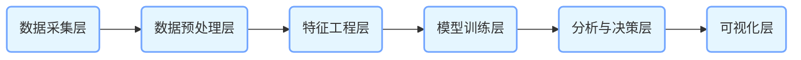

# 智能个人消费行为分析系统

> 关键词：智能消费分析、个人消费行为、数据挖掘、机器学习、数据分析、行为预测、系统架构

> 摘要：本文围绕智能个人消费行为分析系统展开，旨在深入剖析该系统的核心原理、技术实现及实际应用。首先介绍了系统的背景，包括目的、预期读者等信息。接着详细阐述了核心概念与联系，通过文本示意图和 Mermaid 流程图呈现其架构。深入探讨了核心算法原理，并使用 Python 源代码进行详细阐述，同时给出了相关的数学模型和公式。通过项目实战，展示了系统的开发环境搭建、源代码实现及代码解读。还介绍了该系统的实际应用场景，推荐了相关的工具和资源。最后对系统的未来发展趋势与挑战进行了总结，并提供了常见问题解答和参考资料，为读者全面了解智能个人消费行为分析系统提供了丰富而深入的内容。

## 1. 背景介绍 
### 1.1 目的和范围
智能个人消费行为分析系统的目的在于对个人的消费行为进行全面、深入且智能的分析。通过收集、整理和分析个人在不同场景下的消费数据，系统可以帮助个人更好地管理自己的财务，了解自己的消费习惯和偏好。对于商家而言，该系统能够提供有价值的市场信息，帮助他们更好地了解消费者需求，优化产品和服务，制定更有效的营销策略。

其范围涵盖了各种消费场景，包括线上购物、线下实体消费、餐饮娱乐、交通出行等。系统可以处理多种类型的数据，如消费金额、消费时间、消费地点、消费商品或服务的类别等。

### 1.2 预期读者
本文的预期读者包括对个人财务管理感兴趣的普通消费者，他们可以借助系统分析自己的消费行为，实现合理消费和财富规划；也包括从事市场营销、商业分析的专业人士，他们可以利用系统的分析结果制定商业策略；还包括对数据挖掘、机器学习等技术有研究需求的科研人员和技术开发者，他们可以从系统的实现原理和技术细节中获取灵感和知识。

### 1.3 文档结构概述
本文首先介绍智能个人消费行为分析系统的背景信息，包括目的、预期读者和文档结构等。接着详细阐述系统的核心概念与联系，通过文本示意图和 Mermaid 流程图展示其架构。然后深入讲解核心算法原理，并用 Python 源代码进行说明，同时给出相关的数学模型和公式。通过项目实战，展示系统的开发环境搭建、源代码实现和代码解读。介绍系统的实际应用场景，推荐相关的工具和资源。最后总结系统的未来发展趋势与挑战，提供常见问题解答和参考资料。

### 1.4 术语表
#### 1.4.1 核心术语定义
- **消费行为分析**：对个人或群体在消费过程中所表现出的行为特征、习惯、偏好等进行研究和分析的过程。
- **数据挖掘**：从大量的数据中发现潜在的、有价值的信息和知识的过程。
- **机器学习**：让计算机通过数据学习模式和规律，从而实现预测、分类等任务的技术。
- **特征工程**：从原始数据中提取和选择有意义的特征，以提高模型性能的过程。

#### 1.4.2 相关概念解释
- **聚类分析**：将数据对象划分为不同的组或簇，使得同一簇内的对象具有较高的相似性，不同簇的对象具有较高的差异性。
- **关联规则挖掘**：发现数据集中不同项目之间的关联关系，例如哪些商品经常被一起购买。
- **预测模型**：基于历史数据构建的模型，用于预测未来的消费行为或趋势。

#### 1.4.3 缩略词列表
- **AI**：Artificial Intelligence，人工智能
- **ML**：Machine Learning，机器学习
- **DM**：Data Mining，数据挖掘
- **KNN**：K-Nearest Neighbors，K近邻算法
- **SVM**：Support Vector Machine，支持向量机

## 2. 核心概念与联系 

### 核心概念原理
智能个人消费行为分析系统主要基于数据挖掘和机器学习技术。系统首先收集个人的消费数据，这些数据可以来自各种渠道，如银行交易记录、电商平台订单、线下消费小票等。然后对这些数据进行清洗和预处理，去除噪声和异常值，将数据转换为适合分析的格式。

接着，通过特征工程从预处理后的数据中提取有意义的特征，例如消费频率、消费金额的分布、消费时间的规律等。利用这些特征，系统可以应用不同的机器学习算法进行分析。例如，使用聚类算法将消费者分为不同的群体，每个群体具有相似的消费行为特征；使用关联规则挖掘算法发现不同消费项目之间的关联关系；使用预测模型预测消费者未来的消费行为。

### 架构的文本示意图
智能个人消费行为分析系统主要由以下几个部分组成：

1. **数据采集层**：负责从各种数据源收集个人的消费数据，包括线上和线下的消费记录。
2. **数据预处理层**：对采集到的数据进行清洗、转换和归一化等操作，以提高数据的质量。
3. **特征工程层**：从预处理后的数据中提取有意义的特征，为后续的分析提供输入。
4. **模型训练层**：使用机器学习算法对特征数据进行训练，构建各种分析模型，如聚类模型、关联规则模型、预测模型等。
5. **分析与决策层**：利用训练好的模型对个人的消费行为进行分析，生成分析报告和决策建议。
6. **可视化层**：将分析结果以直观的图表和报表形式展示给用户，方便用户理解和使用。

### Mermaid 流程图


## 3. 核心算法原理 & 具体操作步骤 

### 聚类算法（K-Means）原理
K-Means 是一种常用的聚类算法，其基本思想是将数据集中的对象划分为 $K$ 个簇，使得簇内的对象相似度较高，簇间的对象相似度较低。

算法步骤如下：
1. **初始化**：随机选择 $K$ 个对象作为初始的聚类中心。
2. **分配对象**：计算每个对象到各个聚类中心的距离，将对象分配到距离最近的聚类中心所在的簇。
3. **更新聚类中心**：计算每个簇内所有对象的均值，将均值作为新的聚类中心。
4. **重复步骤 2 和 3**：直到聚类中心不再发生变化或达到最大迭代次数。

### Python 代码实现
```python
import numpy as np
from sklearn.cluster import KMeans
import matplotlib.pyplot as plt

# 生成示例数据
X = np.array([[1, 2], [1, 4], [1, 0],
              [4, 2], [4, 4], [4, 0]])

# 创建 K-Means 模型
kmeans = KMeans(n_clusters=2, random_state=0)

# 训练模型
kmeans.fit(X)

# 获取聚类标签
labels = kmeans.labels_

# 获取聚类中心
centroids = kmeans.cluster_centers_

# 可视化结果
plt.scatter(X[:, 0], X[:, 1], c=labels, cmap='viridis')
plt.scatter(centroids[:, 0], centroids[:, 1], marker='X', s=200, c='red')
plt.show()
```

### 关联规则挖掘（Apriori 算法）原理
Apriori 算法是一种经典的关联规则挖掘算法，其核心思想是通过逐层搜索的迭代方法，从单个项集开始，不断生成更大的项集，直到无法生成更大的频繁项集为止。

算法步骤如下：
1. **生成候选项集**：生成所有可能的单个项集。
2. **计算支持度**：计算每个候选项集在数据集中的支持度（出现的频率）。
3. **筛选频繁项集**：选择支持度大于等于最小支持度阈值的项集作为频繁项集。
4. **生成更大的候选项集**：利用频繁项集生成更大的候选项集。
5. **重复步骤 2 - 4**：直到无法生成更大的频繁项集。
6. **生成关联规则**：从频繁项集中生成关联规则，并计算规则的置信度（规则的可信度）。选择置信度大于等于最小置信度阈值的规则作为最终的关联规则。

### Python 代码实现
```python
from mlxtend.preprocessing import TransactionEncoder
from mlxtend.frequent_patterns import apriori, association_rules
import pandas as pd

# 示例数据
dataset = [['Milk', 'Onion', 'Nutmeg', 'Kidney Beans', 'Eggs', 'Yogurt'],
           ['Dill', 'Onion', 'Nutmeg', 'Kidney Beans', 'Eggs', 'Yogurt'],
           ['Milk', 'Apple', 'Kidney Beans', 'Eggs'],
           ['Milk', 'Unicorn', 'Corn', 'Kidney Beans', 'Yogurt'],
           ['Corn', 'Onion', 'Onion', 'Kidney Beans', 'Ice cream', 'Eggs']]

# 数据编码
te = TransactionEncoder()
te_ary = te.fit(dataset).transform(dataset)
df = pd.DataFrame(te_ary, columns=te.columns_)

# 生成频繁项集
frequent_itemsets = apriori(df, min_support=0.6, use_colnames=True)

# 生成关联规则
rules = association_rules(frequent_itemsets, metric="confidence", min_threshold=0.7)

print(rules)
```

### 预测模型（线性回归）原理
线性回归是一种用于预测连续数值的机器学习算法，其基本思想是通过找到一条最佳的直线（或超平面）来拟合数据，使得数据点到直线的距离之和最小。

线性回归模型的数学表达式为：
$y = \theta_0 + \theta_1x_1 + \theta_2x_2 + \cdots + \theta_nx_n$

其中，$y$ 是预测值，$x_1, x_2, \cdots, x_n$ 是特征变量，$\theta_0, \theta_1, \cdots, \theta_n$ 是模型的参数。

### Python 代码实现
```python
from sklearn.linear_model import LinearRegression
from sklearn.model_selection import train_test_split
import numpy as np

# 生成示例数据
X = np.array([[1], [2], [3], [4], [5]])
y = np.array([2, 4, 6, 8, 10])

# 划分训练集和测试集
X_train, X_test, y_train, y_test = train_test_split(X, y, test_size=0.2, random_state=0)

# 创建线性回归模型
model = LinearRegression()

# 训练模型
model.fit(X_train, y_train)

# 预测
y_pred = model.predict(X_test)

print("预测值:", y_pred)
```

## 4. 数学模型和公式 & 详细讲解 & 举例说明 

### 聚类算法（K-Means）的数学模型
K-Means 算法的目标是最小化所有对象到其所属聚类中心的距离之和，即：
$$
J = \sum_{i=1}^{K} \sum_{x \in C_i} d(x, \mu_i)^2
$$

其中，$K$ 是聚类的数量，$C_i$ 是第 $i$ 个簇，$x$ 是簇 $C_i$ 中的对象，$\mu_i$ 是第 $i$ 个簇的聚类中心，$d(x, \mu_i)$ 是对象 $x$ 到聚类中心 $\mu_i$ 的距离，通常使用欧几里得距离：
$$
d(x, \mu_i) = \sqrt{\sum_{j=1}^{n} (x_j - \mu_{ij})^2}
$$

其中，$n$ 是特征的数量，$x_j$ 是对象 $x$ 的第 $j$ 个特征值，$\mu_{ij}$ 是聚类中心 $\mu_i$ 的第 $j$ 个特征值。

**举例说明**：假设有三个数据点 $x_1 = [1, 2]$，$x_2 = [4, 5]$，$x_3 = [7, 8]$，初始聚类中心 $\mu_1 = [2, 3]$，$\mu_2 = [6, 7]$。计算 $x_1$ 到 $\mu_1$ 的距离：
$$
d(x_1, \mu_1) = \sqrt{(1 - 2)^2 + (2 - 3)^2} = \sqrt{2}
$$

计算 $x_1$ 到 $\mu_2$ 的距离：
$$
d(x_1, \mu_2) = \sqrt{(1 - 6)^2 + (2 - 7)^2} = \sqrt{50}
$$

因为 $d(x_1, \mu_1) < d(x_1, \mu_2)$，所以 $x_1$ 被分配到 $\mu_1$ 所在的簇。

### 关联规则挖掘（Apriori 算法）的数学模型
- **支持度（Support）**：项集 $X$ 的支持度是指包含项集 $X$ 的事务在所有事务中所占的比例，即：
$$
\text{Support}(X) = \frac{\text{包含 } X \text{ 的事务数}}{\text{总事务数}}
$$

- **置信度（Confidence）**：关联规则 $X \Rightarrow Y$ 的置信度是指包含项集 $X$ 和 $Y$ 的事务在包含项集 $X$ 的事务中所占的比例，即：
$$
\text{Confidence}(X \Rightarrow Y) = \frac{\text{Support}(X \cup Y)}{\text{Support}(X)}
$$

- **提升度（Lift）**：关联规则 $X \Rightarrow Y$ 的提升度是指规则的置信度与项集 $Y$ 的支持度的比值，即：
$$
\text{Lift}(X \Rightarrow Y) = \frac{\text{Confidence}(X \Rightarrow Y)}{\text{Support}(Y)}
$$

**举例说明**：假设有 100 个事务，其中包含项集 $X$ 的事务有 30 个，包含项集 $Y$ 的事务有 40 个，包含项集 $X$ 和 $Y$ 的事务有 20 个。

- 项集 $X$ 的支持度：$\text{Support}(X) = \frac{30}{100} = 0.3$
- 项集 $Y$ 的支持度：$\text{Support}(Y) = \frac{40}{100} = 0.4$
- 关联规则 $X \Rightarrow Y$ 的置信度：$\text{Confidence}(X \Rightarrow Y) = \frac{20}{30} \approx 0.67$
- 关联规则 $X \Rightarrow Y$ 的提升度：$\text{Lift}(X \Rightarrow Y) = \frac{0.67}{0.4} \approx 1.67$

### 预测模型（线性回归）的数学模型
线性回归模型的目标是找到一组参数 $\theta_0, \theta_1, \cdots, \theta_n$，使得预测值 $\hat{y}$ 与真实值 $y$ 之间的误差最小。通常使用均方误差（Mean Squared Error，MSE）作为损失函数：
$$
\text{MSE} = \frac{1}{m} \sum_{i=1}^{m} (y^{(i)} - \hat{y}^{(i)})^2
$$

其中，$m$ 是样本的数量，$y^{(i)}$ 是第 $i$ 个样本的真实值，$\hat{y}^{(i)}$ 是第 $i$ 个样本的预测值。

通过最小化均方误差，可以得到最优的参数 $\theta$。对于简单线性回归（只有一个特征），可以使用最小二乘法求解参数：
$$
\theta_1 = \frac{\sum_{i=1}^{m} (x^{(i)} - \bar{x})(y^{(i)} - \bar{y})}{\sum_{i=1}^{m} (x^{(i)} - \bar{x})^2}
$$
$$
\theta_0 = \bar{y} - \theta_1\bar{x}
$$

其中，$\bar{x}$ 和 $\bar{y}$ 分别是 $x$ 和 $y$ 的均值。

**举例说明**：假设有以下数据点：$(x_1, y_1) = (1, 2)$，$(x_2, y_2) = (2, 4)$，$(x_3, y_3) = (3, 6)$。

- 计算均值：$\bar{x} = \frac{1 + 2 + 3}{3} = 2$，$\bar{y} = \frac{2 + 4 + 6}{3} = 4$
- 计算 $\theta_1$：
$$
\theta_1 = \frac{(1 - 2)(2 - 4) + (2 - 2)(4 - 4) + (3 - 2)(6 - 4)}{(1 - 2)^2 + (2 - 2)^2 + (3 - 2)^2} = \frac{2 + 0 + 2}{1 + 0 + 1} = 2
$$
- 计算 $\theta_0$：$\theta_0 = 4 - 2 \times 2 = 0$

所以，线性回归模型为 $y = 2x$。

## 5. 项目实战：代码实际案例和详细解释说明 

### 5.1  开发环境搭建
#### 安装 Python
首先，需要安装 Python 环境。可以从 Python 官方网站（https://www.python.org/downloads/） 下载适合自己操作系统的 Python 安装包，按照安装向导进行安装。

#### 安装必要的库
使用以下命令安装项目所需的库：
```sh
pip install numpy pandas scikit-learn matplotlib mlxtend
```

### 5.2  源代码详细实现和代码解读
#### 数据采集与预处理
```python
import pandas as pd

# 读取消费数据
data = pd.read_csv('consumer_data.csv')

# 查看数据基本信息
print(data.info())

# 处理缺失值
data = data.dropna()

# 数据标准化
from sklearn.preprocessing import StandardScaler
scaler = StandardScaler()
scaled_data = scaler.fit_transform(data[['amount', 'frequency']])
```
**代码解读**：首先使用 `pandas` 库读取消费数据文件。然后查看数据的基本信息，检查是否存在缺失值。使用 `dropna()` 方法删除包含缺失值的行。最后，使用 `StandardScaler` 对 `amount` 和 `frequency` 列进行标准化处理，使得数据具有零均值和单位方差。

#### 特征工程
```python
# 提取特征
features = data[['amount', 'frequency', 'category']]

# 对分类特征进行独热编码
features = pd.get_dummies(features, columns=['category'])
```
**代码解读**：从数据中提取 `amount`、`frequency` 和 `category` 列作为特征。对于 `category` 列这样的分类特征，使用 `get_dummies()` 方法进行独热编码，将其转换为数值特征。

#### 模型训练与分析
```python
from sklearn.cluster import KMeans

# 使用 K-Means 进行聚类
kmeans = KMeans(n_clusters=3, random_state=0)
kmeans.fit(scaled_data)

# 获取聚类标签
labels = kmeans.labels_

# 将聚类标签添加到原始数据中
data['cluster'] = labels

# 分析不同聚类的消费特征
cluster_analysis = data.groupby('cluster').mean()
print(cluster_analysis)
```
**代码解读**：使用 `KMeans` 算法对标准化后的数据进行聚类，设置聚类数量为 3。训练模型后，获取每个数据点的聚类标签，并将其添加到原始数据中。最后，使用 `groupby()` 方法按聚类标签分组，计算每个聚类的平均消费特征。

### 5.3  代码解读与分析
通过上述代码，我们完成了从数据采集、预处理、特征工程到模型训练和分析的整个流程。数据采集和预处理阶段确保了数据的质量，特征工程将原始数据转换为适合模型训练的特征。K-Means 聚类算法将消费者分为不同的群体，每个群体具有相似的消费特征。通过分析不同聚类的平均消费特征，我们可以了解不同消费者群体的消费习惯和偏好，为商家制定营销策略提供依据。

## 6. 实际应用场景 
### 个人财务管理
智能个人消费行为分析系统可以帮助个人更好地管理自己的财务。通过分析个人的消费数据，系统可以提供详细的消费报告，包括消费金额的分布、消费类别占比、消费时间规律等。个人可以根据这些报告了解自己的消费习惯，发现不必要的消费支出，制定合理的消费计划和预算。例如，系统发现个人在餐饮方面的支出过高，可以提醒个人适当控制餐饮消费，提高储蓄率。

### 市场营销
对于商家来说，该系统可以提供有价值的市场信息。通过分析消费者的消费行为，商家可以了解消费者的需求和偏好，从而优化产品和服务。例如，商家可以根据消费者的购买历史和偏好，推荐个性化的产品和服务，提高客户满意度和忠诚度。商家还可以利用系统发现不同消费群体之间的关联关系，制定交叉销售和捆绑销售策略，提高销售额。

### 风险评估
金融机构可以利用智能个人消费行为分析系统进行风险评估。通过分析个人的消费行为和信用记录，系统可以评估个人的信用风险和还款能力。例如，如果一个人的消费支出过高，且收入不稳定，可能存在较高的信用风险。金融机构可以根据评估结果，决定是否给予贷款以及贷款的额度和利率。

### 城市规划
政府部门可以利用该系统的分析结果进行城市规划。通过分析居民的消费行为和出行模式，政府可以了解城市的商业活动分布和交通流量情况。例如，如果某个区域的消费活动过于集中，可能导致交通拥堵和资源紧张。政府可以根据分析结果，合理规划商业设施和交通基础设施，提高城市的运行效率和居民的生活质量。

## 7. 工具和资源推荐
### 7.1 学习资源推荐
#### 7.1.1 书籍推荐
- 《Python 数据分析实战》：介绍了使用 Python 进行数据分析的基本方法和技巧，包括数据采集、清洗、分析和可视化等内容。
- 《机器学习实战》：通过实际案例详细介绍了各种机器学习算法的原理和实现，适合初学者入门。
- 《数据挖掘：概念与技术》：全面介绍了数据挖掘的基本概念、算法和应用，是数据挖掘领域的经典教材。

#### 7.1.2 在线课程
- Coursera 上的“机器学习”课程：由斯坦福大学教授 Andrew Ng 主讲，是机器学习领域的经典课程，涵盖了机器学习的基本概念、算法和应用。
- edX 上的“数据科学基础”课程：介绍了数据科学的基本概念、工具和技术，包括数据采集、清洗、分析和可视化等内容。
- 中国大学 MOOC 上的“Python 语言程序设计”课程：适合初学者学习 Python 编程语言，为后续的数据分析和机器学习打下基础。

#### 7.1.3 技术博客和网站
- 博客园：提供了大量的技术文章和经验分享，涵盖了数据分析、机器学习、人工智能等领域。
- 开源中国：关注开源技术和开源项目，提供了丰富的技术资源和资讯。
- Kaggle：是一个数据科学竞赛平台，提供了大量的数据集和优秀的数据分析案例，可以学习到不同的数据处理和建模方法。

### 7.2 开发工具框架推荐
#### 7.2.1 IDE和编辑器
- PyCharm：是一款专业的 Python 集成开发环境，提供了丰富的功能和插件，适合开发大型的 Python 项目。
- Jupyter Notebook：是一个交互式的开发环境，适合进行数据分析和机器学习的实验和演示。
- Visual Studio Code：是一款轻量级的代码编辑器，支持多种编程语言，通过安装插件可以实现 Python 开发的各种功能。

#### 7.2.2 调试和性能分析工具
- PDB：是 Python 自带的调试工具，可以帮助开发者逐步执行代码，查看变量的值和程序的执行流程。
- cProfile：是 Python 自带的性能分析工具，可以分析程序的运行时间和函数调用情况，帮助开发者找出性能瓶颈。
- Py-Spy：是一个用于分析 Python 程序性能的工具，可以实时查看程序的 CPU 使用率和函数调用情况。

#### 7.2.3 相关框架和库
- NumPy：是 Python 中用于科学计算的基础库，提供了高效的数组操作和数学函数。
- Pandas：是一个用于数据处理和分析的库，提供了丰富的数据结构和数据操作方法。
- Scikit-learn：是一个用于机器学习的库，提供了各种机器学习算法和工具，如分类、回归、聚类等。
- Matplotlib：是一个用于数据可视化的库，可以绘制各种类型的图表，如折线图、柱状图、散点图等。

### 7.3 相关论文著作推荐
#### 7.3.1 经典论文
- “A Fast Algorithm for Clustering Large Data Sets with Application to Genome Analysis”：介绍了一种快速的聚类算法，适用于处理大规模数据集。
- “Mining Association Rules between Sets of Items in Large Databases”：是关联规则挖掘领域的经典论文，提出了 Apriori 算法。
- “Least Squares Estimation of Non - Linear Relationships”：介绍了最小二乘法在非线性关系估计中的应用。

#### 7.3.2 最新研究成果
- “Deep Learning for Consumer Behavior Analysis”：探讨了深度学习在消费者行为分析中的应用，提出了一些新的模型和方法。
- “Unsupervised Learning for Personalized Marketing”：研究了无监督学习在个性化营销中的应用，通过聚类和降维等方法发现消费者的潜在需求。

#### 7.3.3 应用案例分析
- “Case Study: Using Data Mining to Improve Customer Retention in a Telecommunication Company”：通过实际案例介绍了如何使用数据挖掘技术提高电信公司的客户留存率。
- “Application of Machine Learning in Credit Risk Assessment”：分析了机器学习在信用风险评估中的应用，通过构建预测模型评估个人的信用风险。

## 8. 总结：未来发展趋势与挑战
### 未来发展趋势
- **多源数据融合**：未来的智能个人消费行为分析系统将融合更多来源的数据，如社交媒体数据、地理位置数据等，以更全面地了解个人的消费行为和生活习惯。
- **深度学习的应用**：深度学习技术将在消费行为分析中得到更广泛的应用，通过构建更复杂的模型，挖掘更深入的消费模式和规律。
- **实时分析**：随着数据处理技术的不断发展，系统将能够实现实时的消费行为分析，及时为用户提供决策建议。
- **个性化服务**：系统将更加注重个性化服务，根据用户的不同需求和偏好，提供定制化的消费分析报告和建议。

### 挑战
- **数据隐私和安全**：智能个人消费行为分析系统需要处理大量的个人敏感数据，如何保障数据的隐私和安全是一个重要的挑战。需要采取有效的数据加密、访问控制等措施，防止数据泄露和滥用。
- **数据质量问题**：由于数据来源的多样性和复杂性，数据质量可能存在问题，如数据缺失、错误、不一致等。如何提高数据质量，确保分析结果的准确性和可靠性是一个关键问题。
- **模型的可解释性**：深度学习等复杂模型在提高分析性能的同时，也带来了模型可解释性的问题。如何理解模型的决策过程和结果，让用户信任模型的分析结果是一个挑战。
- **算法的效率**：随着数据量的不断增加，算法的效率成为一个重要的问题。如何设计高效的算法，在短时间内处理大量的数据是一个需要解决的问题。

## 9. 附录：常见问题与解答
### 1. 智能个人消费行为分析系统需要哪些数据？
智能个人消费行为分析系统需要各种类型的消费数据，包括消费金额、消费时间、消费地点、消费商品或服务的类别等。数据可以来自银行交易记录、电商平台订单、线下消费小票等。

### 2. 如何保障数据的隐私和安全？
可以采取以下措施保障数据的隐私和安全：
- 数据加密：对敏感数据进行加密处理，防止数据在传输和存储过程中被泄露。
- 访问控制：设置严格的访问权限，只有授权人员才能访问和处理数据。
- 匿名化处理：在分析数据时，对个人身份信息进行匿名化处理，保护用户的隐私。

### 3. 系统的分析结果准确吗？
系统的分析结果的准确性取决于多个因素，如数据质量、算法选择、模型参数等。为了提高分析结果的准确性，需要确保数据的质量，选择合适的算法和模型，并进行充分的模型训练和评估。

### 4. 如何选择合适的聚类数量？
可以使用多种方法选择合适的聚类数量，如肘部法则（Elbow Method）、轮廓系数法（Silhouette Coefficient Method）等。肘部法则通过绘制不同聚类数量下的簇内误差平方和（SSE）曲线，选择曲线斜率变化较大的点作为合适的聚类数量。轮廓系数法通过计算每个样本的轮廓系数，选择轮廓系数最大的聚类数量。

### 5. 系统可以应用于哪些行业？
系统可以应用于多个行业，如金融、零售、餐饮、旅游等。在金融行业，可以用于风险评估和信用分析；在零售行业，可以用于市场营销和客户关系管理；在餐饮和旅游行业，可以用于了解消费者需求，优化产品和服务。

## 10. 扩展阅读 & 参考资料
- 《人工智能：一种现代的方法》
- 《Python 机器学习》
- 相关学术期刊：《Journal of Machine Learning Research》、《Data Mining and Knowledge Discovery》等
- 相关技术网站：https://www.analyticsvidhya.com、https://www.datacamp.com 等

作者：AI天才研究院/AI Genius Institute & 禅与计算机程序设计艺术 /Zen And The Art of Computer Programming