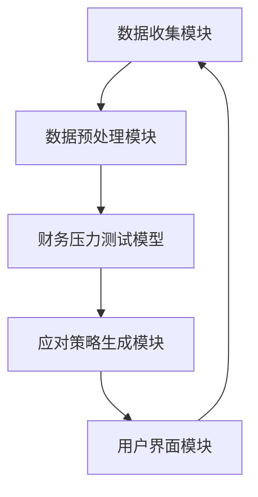

# 智能个人财务压力测试与应对策略生成

> 关键词：智能财务压力测试、个人财务、风险评估、应对策略、人工智能

> 摘要：本文聚焦于智能个人财务压力测试与应对策略生成这一重要领域。首先介绍相关背景，包括目的、预期读者等内容。接着阐述核心概念与联系，构建清晰的原理和架构。通过详细的算法原理及Python代码说明，深入讲解如何进行财务压力测试。同时给出数学模型和公式，并结合实例进行分析。在项目实战部分，提供开发环境搭建、源代码实现及解读。探讨实际应用场景，推荐相关工具和资源。最后总结未来发展趋势与挑战，解答常见问题，提供扩展阅读与参考资料，旨在为个人和相关从业者提供全面且深入的关于智能个人财务压力测试与应对策略生成的知识体系。

## 1. 背景介绍 
### 1.1 目的和范围
在当今复杂多变的经济环境下，个人面临着各种各样的财务风险和压力。智能个人财务压力测试与应对策略生成的目的在于帮助个人准确评估自身的财务状况，识别潜在的财务风险，并根据评估结果生成针对性的应对策略。其范围涵盖了个人收入、支出、债务、资产等多个方面的财务信息，通过综合分析这些信息，为个人提供全面的财务健康诊断和可行的解决方案。

### 1.2 预期读者
本文的预期读者包括普通个人，他们希望更好地管理自己的财务，了解自身的财务风险并制定合理的财务规划；金融从业者，如理财顾问、信贷分析师等，他们可以借助相关技术和方法提升服务质量和专业水平；以及对人工智能在金融领域应用感兴趣的研究人员和开发者，为他们提供技术思路和实践参考。

### 1.3 文档结构概述
本文将首先介绍相关背景知识，包括目的、预期读者等。接着深入探讨核心概念与联系，构建清晰的理论框架。然后详细阐述核心算法原理和具体操作步骤，通过Python代码进行演示。之后给出数学模型和公式，并结合实际例子进行讲解。在项目实战部分，介绍开发环境搭建、源代码实现及代码解读。探讨实际应用场景，推荐相关工具和资源。最后总结未来发展趋势与挑战，解答常见问题，提供扩展阅读与参考资料。

### 1.4 术语表
#### 1.4.1 核心术语定义
- **财务压力测试**：是一种评估个人在面临各种不利经济情况时财务状况稳定性的方法，通过模拟不同的压力情景，分析个人财务指标的变化，以识别潜在的风险。
- **应对策略生成**：根据财务压力测试的结果，结合个人的财务目标和实际情况，制定出一系列可行的措施和方案，以降低财务风险，实现财务稳定。
- **风险评估**：对个人财务状况中可能存在的风险进行识别、分析和量化的过程，确定风险的性质、程度和影响范围。

#### 1.4.2 相关概念解释
- **收入稳定性**：指个人收入来源的可靠性和持续性，包括工资收入、投资收益、兼职收入等。收入稳定性越高，个人的财务状况相对越稳定。
- **债务负担**：个人所承担的债务金额与收入的比例关系，反映了个人偿还债务的能力和压力。债务负担过重可能导致财务风险增加。
- **资产流动性**：资产能够以合理价格快速变现的能力，高流动性资产可以在需要时及时满足资金需求，增强个人的财务灵活性。

#### 1.4.3 缩略词列表
- **AI**：Artificial Intelligence，人工智能
- **ML**：Machine Learning，机器学习
- **RNN**：Recurrent Neural Network，循环神经网络
- **LSTM**：Long Short - Term Memory，长短期记忆网络

## 2. 核心概念与联系 
### 核心概念原理
智能个人财务压力测试与应对策略生成主要基于人工智能和数据分析技术。其原理是通过收集个人的财务数据，包括收入、支出、债务、资产等信息，利用机器学习算法对这些数据进行分析和建模。首先，对数据进行预处理，包括数据清洗、特征提取和标准化等操作，以提高数据的质量和可用性。然后，构建财务压力测试模型，通过模拟不同的压力情景，如收入减少、利率上升、资产贬值等，评估个人财务状况的变化。最后，根据压力测试的结果，结合个人的财务目标和风险偏好，生成相应的应对策略。

### 架构的文本示意图
智能个人财务压力测试与应对策略生成系统主要由以下几个部分组成：
1. **数据收集模块**：负责收集个人的财务数据，包括银行账户信息、信用卡账单、投资记录等。
2. **数据预处理模块**：对收集到的数据进行清洗、特征提取和标准化等操作，以提高数据的质量和可用性。
3. **财务压力测试模型**：利用机器学习算法构建模型，模拟不同的压力情景，评估个人财务状况的变化。
4. **应对策略生成模块**：根据压力测试的结果，结合个人的财务目标和风险偏好，生成相应的应对策略。
5. **用户界面模块**：提供用户与系统交互的界面，方便用户输入财务信息、查看测试结果和应对策略。

### Mermaid 流程图


## 3. 核心算法原理 & 具体操作步骤 
### 核心算法原理
在智能个人财务压力测试与应对策略生成中，常用的机器学习算法包括线性回归、逻辑回归、决策树、随机森林和神经网络等。这里以线性回归为例，介绍其原理。

线性回归是一种用于预测连续数值的机器学习算法，其基本思想是通过寻找一个线性函数来拟合数据，使得预测值与实际值之间的误差最小。线性回归的数学模型可以表示为：

$$y = \beta_0 + \beta_1x_1 + \beta_2x_2 + \cdots + \beta_nx_n + \epsilon$$

其中，$y$ 是预测值，$x_1, x_2, \cdots, x_n$ 是输入特征，$\beta_0, \beta_1, \beta_2, \cdots, \beta_n$ 是模型的参数，$\epsilon$ 是误差项。

### 具体操作步骤
1. **数据收集**：收集个人的财务数据，包括收入、支出、债务、资产等信息。
2. **数据预处理**：对收集到的数据进行清洗、特征提取和标准化等操作。
3. **特征选择**：选择与财务压力测试相关的特征，如收入稳定性、债务负担、资产流动性等。
4. **模型训练**：使用训练数据对线性回归模型进行训练，调整模型的参数，使得预测值与实际值之间的误差最小。
5. **压力情景模拟**：模拟不同的压力情景，如收入减少、利率上升、资产贬值等，将这些情景作为输入特征，输入到训练好的模型中，得到相应的预测结果。
6. **应对策略生成**：根据压力测试的结果，结合个人的财务目标和风险偏好，生成相应的应对策略。

### Python源代码实现
```python
import numpy as np
from sklearn.linear_model import LinearRegression
from sklearn.model_selection import train_test_split
from sklearn.preprocessing import StandardScaler

# 生成示例数据
np.random.seed(0)
n_samples = 100
n_features = 3
X = np.random.randn(n_samples, n_features)
y = 2 * X[:, 0] + 3 * X[:, 1] - 1 * X[:, 2] + np.random.randn(n_samples)

# 数据预处理
scaler = StandardScaler()
X_scaled = scaler.fit_transform(X)

# 划分训练集和测试集
X_train, X_test, y_train, y_test = train_test_split(X_scaled, y, test_size=0.2, random_state=0)

# 模型训练
model = LinearRegression()
model.fit(X_train, y_train)

# 压力情景模拟
stress_scenario = np.array([[1, 2, 3]])
stress_scenario_scaled = scaler.transform(stress_scenario)
prediction = model.predict(stress_scenario_scaled)

print("压力情景下的预测结果:", prediction)
```

## 4. 数学模型和公式 & 详细讲解 & 举例说明 
### 数学模型和公式
#### 线性回归模型
线性回归模型的数学表达式为：

$$y = \beta_0 + \beta_1x_1 + \beta_2x_2 + \cdots + \beta_nx_n + \epsilon$$

其中，$y$ 是预测值，$x_1, x_2, \cdots, x_n$ 是输入特征，$\beta_0, \beta_1, \beta_2, \cdots, \beta_n$ 是模型的参数，$\epsilon$ 是误差项。

模型的目标是找到一组最优的参数 $\beta_0, \beta_1, \beta_2, \cdots, \beta_n$，使得预测值与实际值之间的误差最小。通常使用最小二乘法来求解参数，最小二乘法的目标函数为：

$$J(\beta) = \sum_{i=1}^{m}(y_i - \hat{y}_i)^2$$

其中，$m$ 是样本数量，$y_i$ 是第 $i$ 个样本的实际值，$\hat{y}_i$ 是第 $i$ 个样本的预测值。

#### 风险评估指标
在财务压力测试中，常用的风险评估指标包括方差、标准差、夏普比率等。

- **方差**：衡量数据的离散程度，反映了数据的波动情况。方差的计算公式为：

$$\sigma^2 = \frac{1}{n}\sum_{i=1}^{n}(x_i - \bar{x})^2$$

其中，$n$ 是样本数量，$x_i$ 是第 $i$ 个样本的值，$\bar{x}$ 是样本的平均值。

- **标准差**：方差的平方根，也是衡量数据离散程度的指标。标准差的计算公式为：

$$\sigma = \sqrt{\frac{1}{n}\sum_{i=1}^{n}(x_i - \bar{x})^2}$$

- **夏普比率**：衡量投资组合的风险调整后收益，反映了投资组合在承担单位风险时所能获得的超额收益。夏普比率的计算公式为：

$$Sharpe Ratio = \frac{R_p - R_f}{\sigma_p}$$

其中，$R_p$ 是投资组合的预期收益率，$R_f$ 是无风险收益率，$\sigma_p$ 是投资组合的标准差。

### 详细讲解
线性回归模型通过寻找一个线性函数来拟合数据，使得预测值与实际值之间的误差最小。最小二乘法是一种常用的求解线性回归模型参数的方法，它通过最小化目标函数 $J(\beta)$ 来得到最优的参数。

风险评估指标用于衡量个人财务状况的风险程度。方差和标准差反映了数据的波动情况，方差和标准差越大，说明数据的波动越大，风险也就越高。夏普比率则考虑了投资组合的收益和风险，夏普比率越高，说明投资组合在承担单位风险时所能获得的超额收益越高。

### 举例说明
假设我们有一个投资组合，其预期收益率为 $10\%$，无风险收益率为 $2\%$，标准差为 $15\%$。则该投资组合的夏普比率为：

$$Sharpe Ratio = \frac{0.1 - 0.02}{0.15} = 0.533$$

这意味着该投资组合在承担单位风险时所能获得的超额收益为 $0.533$。

## 5. 项目实战：代码实际案例和详细解释说明 
### 5.1  开发环境搭建
1. **安装Python**：从Python官方网站（https://www.python.org/downloads/）下载并安装Python 3.x版本。
2. **安装必要的库**：使用pip命令安装必要的库，如numpy、pandas、scikit-learn等。

```bash
pip install numpy pandas scikit-learn
```

### 5.2  源代码详细实现和代码解读
```python
import numpy as np
import pandas as pd
from sklearn.linear_model import LinearRegression
from sklearn.model_selection import train_test_split
from sklearn.preprocessing import StandardScaler

# 读取数据
data = pd.read_csv('financial_data.csv')

# 数据预处理
# 处理缺失值
data = data.dropna()

# 提取特征和目标变量
X = data.drop('target_variable', axis=1)
y = data['target_variable']

# 特征标准化
scaler = StandardScaler()
X_scaled = scaler.fit_transform(X)

# 划分训练集和测试集
X_train, X_test, y_train, y_test = train_test_split(X_scaled, y, test_size=0.2, random_state=0)

# 模型训练
model = LinearRegression()
model.fit(X_train, y_train)

# 模型评估
train_score = model.score(X_train, y_train)
test_score = model.score(X_test, y_test)

print("训练集得分:", train_score)
print("测试集得分:", test_score)

# 压力情景模拟
stress_scenario = np.array([[1, 2, 3, 4, 5]])
stress_scenario_scaled = scaler.transform(stress_scenario)
prediction = model.predict(stress_scenario_scaled)

print("压力情景下的预测结果:", prediction)
```

### 5.3  代码解读与分析
1. **数据读取**：使用pandas库的`read_csv`函数读取存储在CSV文件中的财务数据。
2. **数据预处理**：处理缺失值，使用`dropna`函数删除包含缺失值的行。
3. **特征提取**：将数据分为特征变量`X`和目标变量`y`。
4. **特征标准化**：使用`StandardScaler`类对特征变量进行标准化处理，使得特征变量具有相同的尺度。
5. **划分训练集和测试集**：使用`train_test_split`函数将数据划分为训练集和测试集，其中测试集占总数据的20%。
6. **模型训练**：使用线性回归模型对训练数据进行训练，调整模型的参数。
7. **模型评估**：使用`score`方法计算模型在训练集和测试集上的得分，评估模型的性能。
8. **压力情景模拟**：定义一个压力情景，将其进行标准化处理后输入到训练好的模型中，得到预测结果。

## 6. 实际应用场景 
### 个人理财规划
个人可以使用智能个人财务压力测试与应对策略生成系统来评估自己的财务状况，识别潜在的财务风险，并根据系统生成的应对策略制定合理的理财规划。例如，系统可以根据个人的收入、支出、债务等信息，分析个人的财务压力水平，建议个人调整消费习惯、增加储蓄、优化投资组合等。

### 信贷审批
金融机构在进行信贷审批时，可以使用该系统对借款人的财务状况进行压力测试，评估借款人的还款能力和违约风险。例如，模拟不同的经济情景，如经济衰退、利率上升等，分析借款人在这些情景下的财务状况变化，从而做出更准确的信贷决策。

### 金融咨询服务
理财顾问可以借助该系统为客户提供更专业、个性化的金融咨询服务。通过对客户的财务数据进行分析和压力测试，理财顾问可以深入了解客户的财务状况和风险承受能力，为客户制定更合适的投资策略和财务规划。

## 7. 工具和资源推荐
### 7.1 学习资源推荐
#### 7.1.1 书籍推荐
- 《Python数据分析实战》：介绍了Python在数据分析领域的应用，包括数据处理、数据分析和数据可视化等方面的知识。
- 《机器学习实战》：通过实际案例介绍了机器学习的基本算法和应用，帮助读者快速掌握机器学习的实践技能。
- 《金融数学》：介绍了金融领域中的数学模型和方法，包括投资组合理论、期权定价理论等。

#### 7.1.2 在线课程
- Coursera上的“机器学习”课程：由斯坦福大学的Andrew Ng教授授课，是机器学习领域的经典课程。
- edX上的“Python for Data Science”课程：介绍了Python在数据科学领域的应用，包括数据处理、数据分析和数据可视化等方面的知识。
- Udemy上的“Financial Modeling and Valuation Analyst (FMVA)® Certification”课程：介绍了金融建模和估值分析的方法和技巧。

#### 7.1.3 技术博客和网站
- Medium：一个技术博客平台，上面有很多关于人工智能、机器学习和金融科技的文章。
- Towards Data Science：专注于数据科学和机器学习领域的技术博客，提供了很多实用的教程和案例。
- Kaggle：一个数据科学竞赛平台，上面有很多公开的数据集和优秀的数据分析案例，可以学习和借鉴。

### 7.2 开发工具框架推荐
#### 7.2.1 IDE和编辑器
- PyCharm：一款专业的Python集成开发环境，提供了丰富的功能和插件，方便Python开发。
- Jupyter Notebook：一个交互式的开发环境，适合进行数据探索和分析，支持Python、R等多种编程语言。
- Visual Studio Code：一款轻量级的代码编辑器，支持多种编程语言，具有丰富的插件和扩展功能。

#### 7.2.2 调试和性能分析工具
- pdb：Python自带的调试工具，可以帮助开发者定位和解决代码中的问题。
- cProfile：Python自带的性能分析工具，可以分析代码的执行时间和性能瓶颈。
- TensorBoard：一个可视化工具，用于监控和分析深度学习模型的训练过程和性能。

#### 7.2.3 相关框架和库
- NumPy：一个用于科学计算的Python库，提供了高效的数组操作和数学函数。
- Pandas：一个用于数据处理和分析的