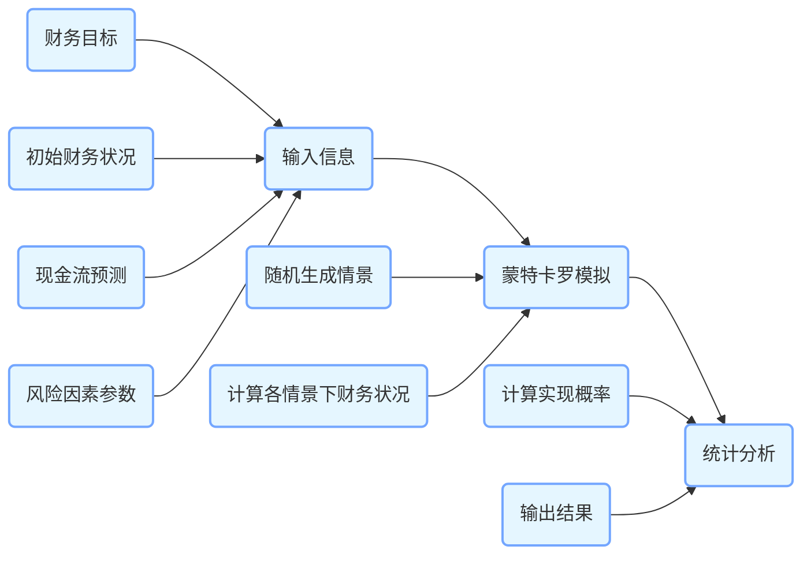

# 智能个人财务目标实现概率计算器

> 关键词：智能财务目标计算器、财务目标实现概率、现金流分析、蒙特卡罗模拟、个人财务管理

> 摘要：本文围绕智能个人财务目标实现概率计算器展开，详细介绍了其核心概念、算法原理、数学模型等内容。通过使用蒙特卡罗模拟等技术，该计算器能够综合考虑多种不确定因素，对个人财务目标的实现概率进行精准计算。文章还提供了项目实战案例，涵盖开发环境搭建、代码实现与解读等方面，阐述了其实际应用场景。此外，推荐了相关的学习资源、开发工具和论文著作，最后对未来发展趋势与挑战进行了总结，并解答了常见问题，为读者全面了解和应用智能个人财务目标实现概率计算器提供了深入且系统的指导。

## 1. 背景介绍 
### 1.1 目的和范围
在个人财务管理中，人们常常设定各种财务目标，如储蓄购房、储备教育金、规划退休生活等。然而，由于收入的不确定性、投资回报的波动、生活支出的变化等多种因素，很难准确判断这些目标是否能够实现以及实现的概率有多大。智能个人财务目标实现概率计算器的目的就是为了解决这一问题，通过综合考虑各种可能影响财务状况的因素，运用科学的算法和模型，计算出个人财务目标实现的概率，为个人理财决策提供有力支持。

本文章的范围主要包括智能个人财务目标实现概率计算器的核心概念、算法原理、数学模型、项目实战、实际应用场景、相关工具和资源推荐等方面，旨在让读者全面了解该计算器的原理、实现方法和应用价值。

### 1.2 预期读者
本文的预期读者包括对个人财务管理感兴趣的普通大众、金融从业者、数据分析师、程序员以及相关领域的研究人员。对于普通大众，本文可以帮助他们更好地规划个人财务，了解自己财务目标的可行性；金融从业者可以借助本文的内容，为客户提供更专业的财务规划建议；数据分析师和程序员可以从中学习到相关的算法和技术实现方法；研究人员则可以进一步深入探讨该领域的理论和应用。

### 1.3 文档结构概述
本文将按照以下结构进行阐述：
1. 背景介绍：说明智能个人财务目标实现概率计算器的目的、适用范围、预期读者以及文档的整体结构。
2. 核心概念与联系：介绍与计算器相关的核心概念，如财务目标、现金流、风险因素等，并展示它们之间的关系。
3. 核心算法原理 & 具体操作步骤：详细讲解实现计算器所使用的核心算法，如蒙特卡罗模拟，并给出具体的操作步骤和Python代码示例。
4. 数学模型和公式 & 详细讲解 & 举例说明：建立数学模型，给出相关公式，并通过具体例子进行详细说明。
5. 项目实战：代码实际案例和详细解释说明：从开发环境搭建开始，逐步实现智能个人财务目标实现概率计算器的代码，并对代码进行详细解读和分析。
6. 实际应用场景：介绍该计算器在不同场景下的实际应用，如购房规划、退休规划等。
7. 工具和资源推荐：推荐相关的学习资源、开发工具和论文著作，帮助读者进一步深入学习和研究。
8. 总结：未来发展趋势与挑战：对智能个人财务目标实现概率计算器的未来发展趋势进行展望，并分析可能面临的挑战。
9. 附录：常见问题与解答：解答读者在使用该计算器过程中可能遇到的常见问题。
10. 扩展阅读 & 参考资料：提供相关的扩展阅读材料和参考资料，方便读者进一步查阅。

### 1.4 术语表
#### 1.4.1 核心术语定义
- **财务目标**：个人或家庭在一定时期内期望达到的财务状态，如储蓄一定金额、购买房产、实现财务自由等。
- **现金流**：在一定时期内，个人或家庭的现金流入（如工资收入、投资收益等）和现金流出（如生活费用、贷款还款等）的情况。
- **风险因素**：可能影响个人财务状况的不确定因素，如市场波动、通货膨胀、失业等。
- **蒙特卡罗模拟**：一种通过随机抽样和统计试验来求解数学、物理和工程问题的数值方法，在财务领域常用于模拟不确定因素对财务目标的影响。
- **实现概率**：在考虑各种不确定因素的情况下，个人财务目标最终能够实现的可能性大小。

#### 1.4.2 相关概念解释
- **净现金流**：现金流入减去现金流出后的余额，反映了个人或家庭在一定时期内的资金盈余或短缺情况。
- **折现率**：将未来的现金流折算为当前价值的比率，考虑了资金的时间价值和风险因素。
- **投资组合**：个人或家庭将资金分配到不同的投资资产（如股票、债券、基金等）上的组合方式，以实现风险分散和收益最大化。

#### 1.4.3 缩略词列表
- **NPV**：Net Present Value，净现值，是指投资项目在未来各期现金流量的现值之和与初始投资之间的差额。
- **IRR**：Internal Rate of Return，内部收益率，是指使投资项目的净现值等于零时的折现率。

## 2. 核心概念与联系 
### 核心概念原理
智能个人财务目标实现概率计算器的核心在于综合考虑个人的财务状况、财务目标以及各种可能影响财务状况的风险因素，通过模拟不同的情景来计算财务目标实现的概率。以下是几个关键的核心概念及其原理：

#### 财务目标
财务目标是个人理财的核心，它可以分为短期目标（如一年内储蓄一定金额）、中期目标（如三到五年内购买房产）和长期目标（如退休后维持一定的生活水平）。财务目标通常具有明确的金额和时间要求，例如在五年内储蓄50万元用于购房首付。

#### 现金流
现金流是个人财务状况的重要体现，它反映了资金的流入和流出情况。稳定的现金流是实现财务目标的基础，现金流入主要包括工资收入、投资收益、租金收入等，现金流出主要包括生活费用、贷款还款、保险费用等。通过对现金流的分析，可以了解个人的资金盈余或短缺情况，为制定合理的理财计划提供依据。

#### 风险因素
风险因素是影响财务目标实现的不确定因素，如市场波动、通货膨胀、失业等。这些因素会导致现金流的不稳定和投资回报的不确定性。例如，股票市场的波动可能会导致投资组合的价值大幅波动，通货膨胀会使货币的购买力下降，失业会导致收入中断。因此，在计算财务目标实现概率时，需要考虑这些风险因素的影响。

#### 蒙特卡罗模拟
蒙特卡罗模拟是一种常用的风险分析方法，它通过随机抽样和统计试验来模拟不确定因素的变化。在智能个人财务目标实现概率计算器中，蒙特卡罗模拟可以用来模拟不同的市场情景、收入和支出情况，从而得到大量的可能结果。通过对这些结果的统计分析，可以计算出财务目标实现的概率。

### 架构的文本示意图
```plaintext
|---------------------|
| 输入信息            |
| - 财务目标          |
| - 初始财务状况      |
| - 现金流预测        |
| - 风险因素参数      |
|---------------------|
          |
          v
|---------------------|
| 蒙特卡罗模拟        |
| - 随机生成情景      |
| - 计算各情景下财务状况 |
|---------------------|
          |
          v
|---------------------|
| 统计分析            |
| - 计算实现概率      |
| - 输出结果          |
|---------------------|
```

### Mermaid 流程图


## 3. 核心算法原理 & 具体操作步骤 
### 核心算法原理 - 蒙特卡罗模拟
蒙特卡罗模拟是基于概率统计的思想，通过随机抽样来模拟不确定因素的变化。在智能个人财务目标实现概率计算器中，蒙特卡罗模拟的基本原理如下：

1. **定义随机变量**：确定影响财务状况的随机变量，如投资回报率、通货膨胀率、收入增长率等。这些随机变量通常服从一定的概率分布，如正态分布、对数正态分布等。
2. **生成随机样本**：根据随机变量的概率分布，使用随机数生成器生成大量的随机样本。每个样本代表一种可能的情景。
3. **计算各情景下的财务状况**：对于每个随机样本，根据个人的初始财务状况、现金流预测和财务目标，计算在该情景下的财务状况，如期末资产净值、是否达到财务目标等。
4. **统计分析**：对所有情景下的计算结果进行统计分析，计算财务目标实现的概率。例如，如果在1000次模拟中，有300次达到了财务目标，则财务目标实现的概率为30%。

### 具体操作步骤及Python代码示例
以下是一个简单的Python代码示例，演示了如何使用蒙特卡罗模拟计算个人储蓄目标实现的概率：

```python
import numpy as np

# 定义参数
initial_savings = 10000  # 初始储蓄
monthly_income = 5000  # 月收入
monthly_expenses = 3000  # 月支出
savings_goal = 100000  # 储蓄目标
investment_return_mean = 0.05  # 投资回报率均值
investment_return_std = 0.1  # 投资回报率标准差
num_simulations = 1000  # 模拟次数
num_years = 5  # 时间跨度（年）
num_months = num_years * 12  # 时间跨度（月）

# 初始化计数器
success_count = 0

# 蒙特卡罗模拟
for _ in range(num_simulations):
    current_savings = initial_savings
    for _ in range(num_months):
        # 随机生成每月投资回报率
        monthly_return = np.random.normal(investment_return_mean / 12, investment_return_std / np.sqrt(12))
        # 计算每月净现金流
        net_cashflow = monthly_income - monthly_expenses
        # 更新储蓄
        current_savings = current_savings * (1 + monthly_return) + net_cashflow
    
    # 判断是否达到储蓄目标
    if current_savings >= savings_goal:
        success_count += 1

# 计算实现概率
success_probability = success_count / num_simulations

print(f"储蓄目标实现的概率: {success_probability * 100:.2f}%")
```

### 代码解释
1. **参数定义**：定义了初始储蓄、月收入、月支出、储蓄目标、投资回报率均值和标准差、模拟次数以及时间跨度等参数。
2. **蒙特卡罗模拟**：使用`for`循环进行`num_simulations`次模拟。在每次模拟中，使用`np.random.normal`函数随机生成每月的投资回报率，计算每月的净现金流，并更新储蓄。
3. **统计分析**：在每次模拟结束后，判断是否达到储蓄目标，如果达到则计数器加1。最后，计算达到储蓄目标的次数占总模拟次数的比例，即为储蓄目标实现的概率。

## 4. 数学模型和公式 & 详细讲解 & 举例说明 
### 数学模型
在智能个人财务目标实现概率计算器中，主要涉及到两个方面的数学模型：现金流模型和投资收益模型。

#### 现金流模型
现金流模型用于描述个人在一定时期内的现金流入和流出情况。假设在第 $t$ 期，现金流入为 $I_t$，现金流出为 $O_t$，则净现金流 $CF_t$ 可以表示为：

$$CF_t = I_t - O_t$$

在整个时间跨度 $T$ 内，累计净现金流 $CF_{total}$ 为：

$$CF_{total} = \sum_{t=1}^{T} CF_t$$

#### 投资收益模型
投资收益模型用于描述投资资产在一定时期内的价值变化。假设在第 $t$ 期，投资资产的初始价值为 $V_{t-1}$，投资回报率为 $r_t$，则第 $t$ 期投资资产的价值 $V_t$ 可以表示为：

$$V_t = V_{t-1} (1 + r_t)$$

在整个时间跨度 $T$ 内，投资资产的最终价值 $V_T$ 为：

$$V_T = V_0 \prod_{t=1}^{T} (1 + r_t)$$

其中，$V_0$ 为投资资产的初始价值。

### 综合模型
将现金流模型和投资收益模型结合起来，可以得到个人在整个时间跨度 $T$ 内的期末资产净值 $A_T$：

$$A_T = A_0 + \sum_{t=1}^{T} CF_t \prod_{i=t+1}^{T} (1 + r_i)$$

其中，$A_0$ 为初始资产净值。

### 举例说明
假设小明初始有10万元的储蓄（$A_0 = 100000$），每月收入5000元（$I_t = 5000$），每月支出3000元（$O_t = 3000$），投资回报率每月平均为0.5%（$r_t = 0.005$），计划投资5年（$T = 5 \times 12 = 60$ 个月）。

#### 计算每月净现金流
每月净现金流 $CF_t$ 为：

$$CF_t = I_t - O_t = 5000 - 3000 = 2000$$

#### 计算累计净现金流
累计净现金流 $CF_{total}$ 为：

$$CF_{total} = \sum_{t=1}^{60} CF_t = 2000 \times 60 = 120000$$

#### 计算期末资产净值
根据综合模型，期末资产净值 $A_T$ 为：

$$A_T = A_0 + \sum_{t=1}^{60} CF_t \prod_{i=t+1}^{60} (1 + r_i)$$

由于投资回报率固定为0.005，我们可以简化计算：

$$A_T = 100000 + 2000 \sum_{t=1}^{60} (1 + 0.005)^{60 - t}$$

使用等比数列求和公式 $\sum_{k=1}^{n} a r^{n - k} = \frac{a (r^n - 1)}{r - 1}$，可得：

$$A_T = 100000 + 2000 \times \frac{(1 + 0.005)^{60} - 1}{0.005} \approx 265970.4$$

通过以上计算，我们可以预测小明在5年后的期末资产净值约为265970.4元。在实际应用中，投资回报率是不确定的，我们可以使用蒙特卡罗模拟来考虑这种不确定性，计算财务目标实现的概率。

## 5. 项目实战：代码实际案例和详细解释说明 
### 5.1  开发环境搭建
#### 安装Python
首先，确保你已经安装了Python。可以从Python官方网站（https://www.python.org/downloads/）下载并安装适合你操作系统的Python版本。建议安装Python 3.7及以上版本。

#### 安装必要的库
在本项目中，我们将使用`numpy`和`matplotlib`库。可以使用以下命令来安装这些库：

```sh
pip install numpy matplotlib
```

### 5.2  源代码详细实现和代码解读
以下是一个完整的智能个人财务目标实现概率计算器的Python代码示例：

```python
import numpy as np
import matplotlib.pyplot as plt

# 定义参数
initial_assets = 20000  # 初始资产
monthly_income = 6000  # 月收入
monthly_expenses = 4000  # 月支出
savings_goal = 150000  # 储蓄目标
investment_return_mean = 0.06  # 投资回报率均值
investment_return_std = 0.12  # 投资回报率标准差
num_simulations = 5000  # 模拟次数
num_years = 6  # 时间跨度（年）
num_months = num_years * 12  # 时间跨度（月）

# 初始化结果列表
final_assets_list = []

# 蒙特卡罗模拟
for _ in range(num_simulations):
    current_assets = initial_assets
    for _ in range(num_months):
        # 随机生成每月投资回报率
        monthly_return = np.random.normal(investment_return_mean / 12, investment_return_std / np.sqrt(12))
        # 计算每月净现金流
        net_cashflow = monthly_income - monthly_expenses
        # 更新资产
        current_assets = current_assets * (1 + monthly_return) + net_cashflow
    
    final_assets_list.append(current_assets)

# 计算实现概率
success_count = sum([1 for assets in final_assets_list if assets >= savings_goal])
success_probability = success_count / num_simulations

# 绘制直方图
plt.hist(final_assets_list, bins=50, edgecolor='k')
plt.axvline(x=savings_goal, color='r', linestyle='--', label='储蓄目标')
plt.xlabel('期末资产净值')
plt.ylabel('模拟次数')
plt.title(f'储蓄目标实现概率: {success_probability * 100:.2f}%')
plt.legend()
plt.show()

print(f"储蓄目标实现的概率: {success_probability * 100:.2f}%")
```

### 5.3  代码解读与分析
#### 参数定义
代码开始部分定义了一系列参数，包括初始资产、月收入、月支出、储蓄目标、投资回报率均值和标准差、模拟次数以及时间跨度等。这些参数可以根据实际情况进行调整。

#### 蒙特卡罗模拟
使用`for`循环进行`num_simulations`次模拟。在每次模拟中，使用`np.random.normal`函数随机生成每月的投资回报率，计算每月的净现金流，并更新资产。每次模拟结束后，将期末资产净值添加到`final_assets_list`中。

#### 计算实现概率
遍历`final_assets_list`，统计期末资产净值大于等于储蓄目标的次数，然后计算该次数占总模拟次数的比例，即为储蓄目标实现的概率。

#### 绘制直方图
使用`matplotlib`库绘制期末资产净值的直方图，直观展示模拟结果的分布情况。同时，使用`axvline`函数绘制一条红色的虚线，表示储蓄目标。

#### 输出结果
最后，打印储蓄目标实现的概率，并显示直方图。

通过这个代码示例，我们可以看到如何使用蒙特卡罗模拟来计算个人财务目标实现的概率，并通过可视化的方式展示模拟结果。

## 6. 实际应用场景 
### 购房规划
在购房规划中，人们通常需要设定一个储蓄目标，用于支付购房首付。智能个人财务目标实现概率计算器可以帮助购房者考虑各种不确定因素，如收入波动、投资回报的不确定性等，计算出在一定时间内达到首付目标的概率。购房者可以根据计算结果调整自己的储蓄计划、投资策略或购房预算，以提高购房目标实现的可能性。

例如，小李计划在5年内储蓄50万元用于购房首付。他目前有10万元的储蓄，每月收入8000元，每月支出5000元。通过使用智能个人财务目标实现概率计算器，他可以模拟不同的投资回报率和收入增长情况，计算出储蓄目标实现的概率。如果概率较低，他可以考虑增加每月的储蓄金额、调整投资组合或延长储蓄时间。

### 退休规划
退休规划是个人财务管理的重要组成部分。人们希望在退休后能够维持一定的生活水平，因此需要在工作期间进行储蓄和投资。智能个人财务目标实现概率计算器可以帮助人们评估自己的退休规划是否可行，考虑到通货膨胀、投资回报的不确定性等因素，计算出在退休时达到目标资产的概率。

例如，小张希望在60岁退休时拥有200万元的资产。他目前30岁，有50万元的储蓄，每月收入10000元，每月支出6000元。通过使用计算器，他可以模拟不同的投资回报率和通货膨胀率，计算出退休目标实现的概率。如果概率不理想，他可以考虑增加每月的储蓄金额、调整投资策略或延迟退休时间。

### 教育金规划
为子女储备教育金也是许多家庭的重要财务目标。智能个人财务目标实现概率计算器可以帮助家长考虑各种因素，如学费上涨、投资回报的不确定性等，计算出在子女上学时能够储备足够教育金的概率。家长可以根据计算结果调整自己的储蓄计划和投资策略。

例如，小王的孩子目前5岁，他希望在孩子18岁时能够储备50万元的教育金。他目前有10万元的储蓄，每月收入7000元，每月支出4000元。通过使用计算器，他可以模拟不同的学费上涨率和投资回报率，计算出教育金目标实现的概率。如果概率较低，他可以考虑增加每月的储蓄金额、选择更合适的投资产品。

## 7. 工具和资源推荐
### 7.1 学习资源推荐
#### 7.1.1 书籍推荐
- 《财务自由之路》：介绍了个人理财的基本原理和方法，帮助读者树立正确的理财观念，制定合理的财务规划。
- 《聪明的投资者》：被誉为投资领域的圣经，作者本杰明·格雷厄姆阐述了价值投资的理念和方法，对个人投资具有重要的指导意义。
- 《小狗钱钱》：以生动有趣的故事形式，向读者传授了基本的理财知识和技巧，适合初学者阅读。

#### 7.1.2 在线课程
- Coursera上的“Personal Finance”课程：由知名大学的教授授课，系统介绍了个人财务管理的各个方面，包括预算规划、投资策略、风险管理等。
- edX上的“Finance for Everyone: Smart Tools for Decision-Making”课程：帮助学习者掌握财务决策的基本工具和方法，提高个人财务决策能力。

#### 7.1.3 技术博客和网站
- 雪球网：国内知名的财经社区，提供股票、基金、债券等投资领域的资讯、分析和讨论，同时也有很多个人理财的经验分享。
- 理财巴士：专注于个人理财知识的普及和推广，提供丰富的理财文章、课程和工具，帮助读者提升理财能力。

### 7.2 开发工具框架推荐
#### 7.2.1 IDE和编辑器
- PyCharm：一款专业的Python集成开发环境，提供代码编辑、调试、版本控制等功能，适合Python项目的开发。
- Visual Studio Code：一款轻量级的代码编辑器，支持多种编程语言，具有丰富的插件扩展功能，可用于Python代码的开发和调试。

#### 7.2.2 调试和性能分析工具
- IPython：一个增强的Python交互式解释器，提供了丰富的调试和分析功能，方便开发者进行代码调试和性能测试。
- cProfile：Python标准库中的性能分析工具，可以帮助开发者找出代码中的性能瓶颈，优化代码性能。

#### 7.2.3 相关框架和库
- NumPy：Python中用于科学计算的基础库，提供了高效的多维数组对象和各种数学函数，在蒙特卡罗模拟中经常使用。
- Pandas：用于数据处理和分析的库，提供了灵活的数据结构和数据操作方法，方便对模拟结果进行处理和分析。
- Matplotlib：Python中常用的绘图库，可以绘制各种类型的图表，如折线图、柱状图、直方图等，用于可视化模拟结果。

### 7.3 相关论文著作推荐
#### 7.3.1 经典论文
- “A Random Walk Down Wall Street” by Burton G. Malkiel：该论文提出了随机漫步理论，认为股票价格的波动是随机的，无法通过技术分析或基本面分析来预测。
- “Portfolio Selection” by Harry Markowitz：该论文提出了现代投资组合理论，阐述了如何通过资产配置来实现风险分散和收益最大化。

#### 7.3.2 最新研究成果
- 关注金融领域的顶级学术期刊，如《Journal of Finance》、《Review of Financial Studies》等，这些期刊会发表关于个人理财、投资决策等方面的最新研究成果。

#### 7.3.3 应用案例分析
- 可以查阅一些金融机构或咨询公司发布的个人理财案例分析报告，了解实际应用中智能个人财务目标实现概率计算器的使用方法和效果。

## 8. 总结：未来发展趋势与挑战
### 未来发展趋势
#### 智能化和个性化
随着人工智能和大数据技术的不断发展，智能个人财务目标实现概率计算器将变得更加智能化和个性化。它可以根据个人的财务状况、风险偏好、消费习惯等因素，为用户提供更加精准的财务规划建议和目标实现概率计算。例如，通过分析用户的消费记录，计算器可以预测未来的支出情况，从而更准确地评估财务目标的可行性。

#### 与金融科技的融合
智能个人财务目标实现概率计算器将与金融科技的其他领域进行更深入的融合。例如，与在线投资平台相结合，用户可以直接在计算器中进行投资组合的模拟和优化；与移动支付平台相结合，计算器可以实时获取用户的收支信息，及时调整财务规划。

#### 跨领域应用
除了个人财务管理领域，智能个人财务目标实现概率计算器还可能在其他领域得到应用。例如，在保险行业中，保险公司可以使用该计算器评估客户的风险承受能力和保险需求，为客户提供更合适的保险产品；在教育领域中，学校可以使用该计算器帮助学生和家长制定合理的教育金规划。

### 挑战
#### 数据质量和隐私问题
智能个人财务目标实现概率计算器需要大量的个人财务数据来进行准确的计算和分析。然而，数据的质量和隐私问题是一个重要的挑战。一方面，数据可能存在错误、缺失或不准确的情况，影响计算结果的可靠性；另一方面，个人财务数据属于敏感信息，如何保护用户的数据隐私是一个亟待解决的问题。

#### 模型的准确性和适应性
蒙特卡罗模拟等算法虽然可以考虑多种不确定因素，但模型的准确性和适应性仍然存在一定的局限性。市场环境和个人财务状况是不断变化的，模型需要不断地进行更新和优化，以适应新的情况。此外，不同的用户可能具有不同的风险偏好和财务目标，如何设计出具有通用性和个性化的模型也是一个挑战。

#### 用户教育和接受度
智能个人财务目标实现概率计算器是一个相对复杂的工具，用户需要具备一定的财务知识和技术能力才能正确使用。因此，如何对用户进行有效的教育和培训，提高用户对该工具的接受度和使用效率，也是一个需要解决的问题。

## 9. 附录：常见问题与解答
### 1. 蒙特卡罗模拟的结果是否可靠？
蒙特卡罗模拟的结果是基于大量的随机抽样和统计分析得到的，具有一定的可靠性。但是，模拟结果的准确性受到多种因素的影响，如随机变量的概率分布假设、模拟次数等。一般来说，模拟次数越多，结果越接近真实情况。同时，随机变量的概率分布假设需要根据实际情况进行合理选择，否则会影响模拟结果的可靠性。

### 2. 如何确定投资回报率的均值和标准差？
投资回报率的均值和标准差可以根据历史数据进行估计。例如，可以收集过去一段时间内某种投资资产（如股票、基金等）的回报率数据，计算其均值和标准差。此外，也可以参考专业的金融机构或研究机构发布的统计数据和分析报告。需要注意的是，历史数据并不代表未来的情况，投资回报率具有不确定性，因此在使用这些参数时需要谨慎。

### 3. 计算器是否考虑了通货膨胀的影响？
在上述代码示例中，没有直接考虑通货膨胀的影响。但是，可以通过调整投资回报率和现金流等参数来间接考虑通货膨胀的影响。例如，可以将投资回报率减去通货膨胀率，得到实际投资回报率；将收入和支出按照通货膨胀率进行调整，得到实际的现金流。这样可以更准确地评估财务目标的实现情况。

### 4. 能否使用该计算器进行多种财务目标的计算？
可以对代码进行扩展，以支持多种财务目标的计算。例如，可以定义多个储蓄目标，在每次模拟结束后，分别判断是否达到每个目标，并统计达到不同目标的概率。同时，可以根据不同的财务目标设置不同的权重，综合评估财务规划的合理性。

## 10. 扩展阅读 & 参考资料
### 扩展阅读
- 《富爸爸穷爸爸》：通过对比富爸爸和穷爸爸不同的理财观念和方法，引导读者树立正确的金钱观和理财观。
- 《邻家的百万富翁》：研究了美国百万富翁的生活方式和理财习惯，揭示了普通人实现财富积累的方法和途径。
- 《财务自由之路2：三年内让你的个人资产翻一番》：提供了具体的投资策略和方法，帮助读者实现财务自由的目标。

### 参考资料
- Malkiel, Burton G. "A Random Walk Down Wall Street." W. W. Norton & Company, 2019.
- Markowitz, Harry. "Portfolio Selection." The Journal of Finance, Vol. 7, No. 1, 1952, pp. 77-91.
- Python官方文档：https://docs.python.org/3/
- NumPy官方文档：https://numpy.org/doc/
- Matplotlib官方文档：https://matplotlib.org/stable/contents.html

作者：AI天才研究院/AI Genius Institute & 禅与计算机程序设计艺术 /Zen And The Art of Computer Programming