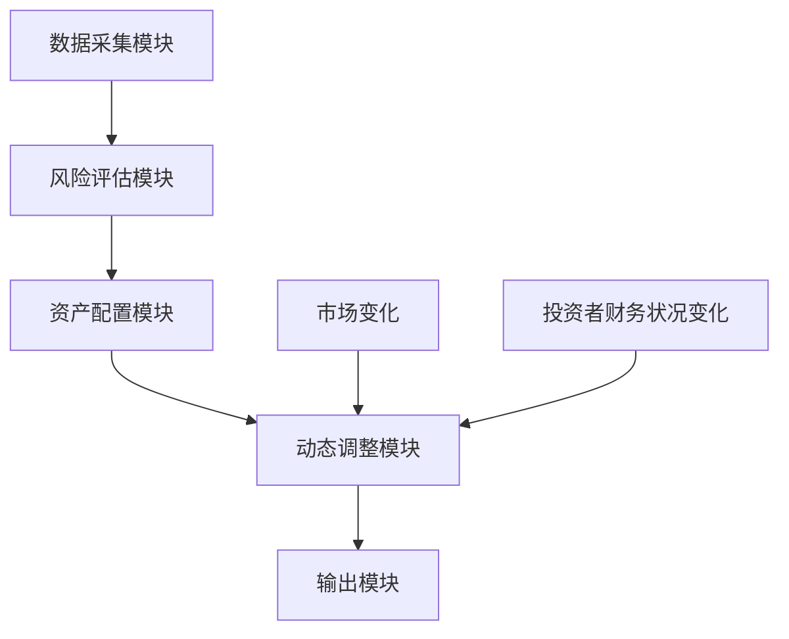

# 智能个人资产配置动态调整器

> 关键词：智能资产配置、动态调整、个人资产、投资策略、风险控制

> 摘要：本文围绕智能个人资产配置动态调整器展开深入探讨。首先介绍其背景信息，包括目的、预期读者等内容。接着阐述核心概念及相互联系，通过文本示意图和 Mermaid 流程图直观呈现。详细讲解核心算法原理和具体操作步骤，运用 Python 代码进行说明。分析相关数学模型和公式，并举例阐释。结合项目实战，给出代码实际案例及详细解释。探讨实际应用场景，推荐相关工具和资源，包括学习资料、开发工具、论文著作等。最后总结未来发展趋势与挑战，提供常见问题解答及扩展阅读参考资料，旨在为读者全面深入地了解智能个人资产配置动态调整器提供专业且详尽的知识。

## 1. 背景介绍 
### 1.1 目的和范围
在当今复杂多变的金融市场环境下，个人投资者面临着诸多挑战，如市场波动、投资品种繁多、信息不对称等。智能个人资产配置动态调整器的目的在于帮助个人投资者优化资产配置，根据市场变化和个人财务状况动态调整投资组合，以实现资产的稳健增长和风险的有效控制。

其范围涵盖了多种常见的投资资产，如股票、债券、基金、现金等。通过对这些资产的合理配置和动态调整，为不同风险偏好和投资目标的个人投资者提供个性化的投资解决方案。

### 1.2 预期读者
本文的预期读者主要包括以下几类人群：
- 个人投资者：希望通过智能工具优化资产配置，提高投资收益，降低投资风险的普通投资者。
- 金融从业者：如理财顾问、投资经理等，可借助本文深入了解智能资产配置技术，为客户提供更专业的服务。
- 技术开发者：对金融科技领域感兴趣，希望开发智能资产配置相关软件或系统的程序员和软件架构师。
- 研究人员：从事金融工程、投资学等相关领域研究的学者和科研人员。

### 1.3 文档结构概述
本文将按照以下结构进行阐述：
- 核心概念与联系：介绍智能个人资产配置动态调整器的核心概念，包括资产配置、动态调整等，并通过文本示意图和 Mermaid 流程图展示其原理和架构。
- 核心算法原理 & 具体操作步骤：详细讲解实现智能资产配置动态调整的核心算法，如现代投资组合理论、风险平价模型等，并给出具体的操作步骤，同时使用 Python 代码进行详细阐述。
- 数学模型和公式 & 详细讲解 & 举例说明：分析相关的数学模型和公式，如均值 - 方差模型、夏普比率等，并通过具体例子进行说明。
- 项目实战：代码实际案例和详细解释说明：结合实际项目，给出智能个人资产配置动态调整器的代码实现，并对代码进行详细解读和分析。
- 实际应用场景：探讨智能个人资产配置动态调整器在不同场景下的应用，如长期投资、短期投机等。
- 工具和资源推荐：推荐相关的学习资源、开发工具和论文著作，帮助读者进一步深入学习和研究。
- 总结：未来发展趋势与挑战：总结智能个人资产配置动态调整器的发展趋势，并分析其面临的挑战。
- 附录：常见问题与解答：提供常见问题的解答，帮助读者解决在学习和应用过程中遇到的问题。
- 扩展阅读 & 参考资料：列出相关的扩展阅读资料和参考书目，供读者进一步学习和研究。

### 1.4 术语表
#### 1.4.1 核心术语定义
- **资产配置**：指根据投资需求将投资资金在不同资产类别之间进行分配，通常是将资产在低风险、低收益证券与高风险、高收益证券之间进行分配。
- **动态调整**：根据市场变化、个人财务状况等因素，实时或定期对资产配置进行调整，以保持投资组合的最优状态。
- **投资组合**：由多种资产组成的集合，旨在通过分散投资降低风险，实现资产的稳健增长。
- **风险偏好**：投资者对风险的承受能力和意愿，通常分为保守型、稳健型、激进型等。
- **预期收益**：投资者对投资组合在未来一段时间内所能获得的收益的预期。

#### 1.4.2 相关概念解释
- **现代投资组合理论**：由哈里·马科维茨（Harry Markowitz）于 1952 年提出，该理论认为通过分散投资可以降低非系统性风险，投资者可以在风险和收益之间进行权衡，选择最优的投资组合。
- **风险平价模型**：一种资产配置模型，旨在通过平衡不同资产的风险贡献，实现投资组合的风险均衡。
- **夏普比率**：由威廉·夏普（William Sharpe）提出，用于衡量投资组合的风险调整后收益，计算公式为：$夏普比率 = \frac{投资组合预期收益率 - 无风险收益率}{投资组合收益率的标准差}$。

#### 1.4.3 缩略词列表
- **MPT**：Modern Portfolio Theory，现代投资组合理论
- **RP**：Risk Parity，风险平价模型
- **SR**：Sharpe Ratio，夏普比率

## 2. 核心概念与联系 
### 核心概念原理
智能个人资产配置动态调整器的核心概念基于资产配置和动态调整。资产配置是根据投资者的风险偏好、投资目标和财务状况，将资金分配到不同的资产类别中，以实现风险和收益的平衡。动态调整则是在资产配置的基础上，根据市场变化、投资者财务状况变化等因素，实时或定期对资产配置进行调整，以保持投资组合的最优状态。

### 架构的文本示意图
智能个人资产配置动态调整器主要由以下几个部分组成：
- **数据采集模块**：负责收集市场数据、投资者财务数据等信息。
- **风险评估模块**：根据投资者的风险偏好和财务状况，评估投资者的风险承受能力。
- **资产配置模块**：根据风险评估结果和市场数据，运用相关算法进行资产配置。
- **动态调整模块**：实时或定期监测市场变化和投资者财务状况变化，对资产配置进行动态调整。
- **输出模块**：将资产配置方案和调整建议输出给投资者。

### Mermaid 流程图


## 3. 核心算法原理 & 具体操作步骤 
### 核心算法原理
#### 现代投资组合理论（MPT）
现代投资组合理论的核心思想是通过分散投资降低非系统性风险。该理论假设投资者是风险厌恶的，他们在追求收益的同时希望降低风险。投资者可以通过选择不同的资产组合，在风险和收益之间进行权衡，选择最优的投资组合。

在 MPT 中，投资组合的预期收益和风险可以通过以下公式计算：
- 投资组合的预期收益：$E(R_p) = \sum_{i=1}^{n} w_i E(R_i)$，其中 $E(R_p)$ 是投资组合的预期收益，$w_i$ 是第 $i$ 种资产的权重，$E(R_i)$ 是第 $i$ 种资产的预期收益。
- 投资组合的方差：$\sigma_p^2 = \sum_{i=1}^{n} \sum_{j=1}^{n} w_i w_j \sigma_{ij}$，其中 $\sigma_p^2$ 是投资组合的方差，$\sigma_{ij}$ 是第 $i$ 种资产和第 $j$ 种资产的协方差。

#### 风险平价模型（RP）
风险平价模型的核心思想是通过平衡不同资产的风险贡献，实现投资组合的风险均衡。该模型认为，传统的资产配置方法往往过于注重资产的预期收益，而忽略了资产的风险贡献。风险平价模型通过调整资产的权重，使每种资产对投资组合的风险贡献相等。

### 具体操作步骤
#### 步骤 1：数据采集
收集市场数据，如股票价格、债券收益率、基金净值等，以及投资者的财务数据，如资产规模、收入水平、风险偏好等。

#### 步骤 2：风险评估
根据投资者的风险偏好和财务状况，评估投资者的风险承受能力。可以使用问卷调查、风险测评工具等方法进行评估。

#### 步骤 3：资产配置
根据风险评估结果和市场数据，运用相关算法进行资产配置。可以使用现代投资组合理论、风险平价模型等算法进行资产配置。

#### 步骤 4：动态调整
实时或定期监测市场变化和投资者财务状况变化，对资产配置进行动态调整。可以根据市场行情、经济数据等因素进行调整。

#### 步骤 5：输出结果
将资产配置方案和调整建议输出给投资者。可以通过报告、界面等方式进行输出。

### Python 代码实现
```python
import numpy as np
import pandas as pd
from scipy.optimize import minimize

# 步骤 1：数据采集
# 假设已经获取了股票和债券的历史收益率数据
stock_returns = np.array([0.1, 0.2, -0.1, 0.15])
bond_returns = np.array([0.05, 0.06, 0.04, 0.05])

# 步骤 2：风险评估
# 假设投资者的风险偏好为稳健型，风险承受能力中等
risk_preference = '稳健型'

# 步骤 3：资产配置
# 定义目标函数：最小化投资组合的方差
def portfolio_variance(weights, cov_matrix):
    return np.dot(weights.T, np.dot(cov_matrix, weights))

# 计算协方差矩阵
returns = np.vstack((stock_returns, bond_returns))
cov_matrix = np.cov(returns)

# 定义约束条件：权重之和为 1
constraints = ({'type': 'eq', 'fun': lambda x: np.sum(x) - 1})

# 定义边界条件：权重范围在 0 到 1 之间
bounds = ((0, 1), (0, 1))

# 初始权重
initial_weights = np.array([0.5, 0.5])

# 最小化目标函数
result = minimize(portfolio_variance, initial_weights, args=(cov_matrix,), constraints=constraints, bounds=bounds)

# 最优权重
optimal_weights = result.x

# 步骤 4：动态调整
# 假设市场发生变化，重新计算最优权重
# 这里简单模拟市场变化，更新收益率数据
new_stock_returns = np.array([0.12, 0.22, -0.08, 0.18])
new_bond_returns = np.array([0.06, 0.07, 0.05, 0.06])

new_returns = np.vstack((new_stock_returns, new_bond_returns))
new_cov_matrix = np.cov(new_returns)

new_result = minimize(portfolio_variance, optimal_weights, args=(new_cov_matrix,), constraints=constraints, bounds=bounds)

new_optimal_weights = new_result.x

# 步骤 5：输出结果
print("初始最优权重：", optimal_weights)
print("调整后最优权重：", new_optimal_weights)
```

## 4. 数学模型和公式 & 详细讲解 & 举例说明 
### 均值 - 方差模型
均值 - 方差模型是现代投资组合理论的核心模型，用于描述投资组合的预期收益和风险之间的关系。该模型的基本假设是投资者是风险厌恶的，他们在追求收益的同时希望降低风险。

#### 公式
- 投资组合的预期收益：$E(R_p) = \sum_{i=1}^{n} w_i E(R_i)$，其中 $E(R_p)$ 是投资组合的预期收益，$w_i$ 是第 $i$ 种资产的权重，$E(R_i)$ 是第 $i$ 种资产的预期收益。
- 投资组合的方差：$\sigma_p^2 = \sum_{i=1}^{n} \sum_{j=1}^{n} w_i w_j \sigma_{ij}$，其中 $\sigma_p^2$ 是投资组合的方差，$\sigma_{ij}$ 是第 $i$ 种资产和第 $j$ 种资产的协方差。

#### 详细讲解
均值 - 方差模型通过计算投资组合的预期收益和方差，帮助投资者在风险和收益之间进行权衡。投资者可以根据自己的风险偏好，选择不同的投资组合。例如，风险厌恶的投资者可以选择预期收益较低但方差也较低的投资组合；而风险偏好较高的投资者可以选择预期收益较高但方差也较高的投资组合。

#### 举例说明
假设投资者有两种资产可供选择：股票和债券。股票的预期收益为 $E(R_1) = 0.1$，标准差为 $\sigma_1 = 0.2$；债券的预期收益为 $E(R_2) = 0.05$，标准差为 $\sigma_2 = 0.1$。两种资产的相关系数为 $\rho_{12} = 0.2$。

投资者希望将资金分别投资于股票和债券，设股票的权重为 $w_1$，债券的权重为 $w_2 = 1 - w_1$。

- 投资组合的预期收益：$E(R_p) = w_1 E(R_1) + w_2 E(R_2) = w_1 \times 0.1 + (1 - w_1) \times 0.05 = 0.05 + 0.05w_1$
- 投资组合的方差：
$\sigma_p^2 = w_1^2 \sigma_1^2 + w_2^2 \sigma_2^2 + 2w_1 w_2 \rho_{12} \sigma_1 \sigma_2$
$= w_1^2 \times 0.2^2 + (1 - w_1)^2 \times 0.1^2 + 2w_1 (1 - w_1) \times 0.2 \times 0.1 \times 0.2$

通过求解上述公式，可以得到不同权重下投资组合的预期收益和方差。投资者可以根据自己的风险偏好，选择最优的投资组合。

### 夏普比率
夏普比率是用于衡量投资组合的风险调整后收益的指标，它反映了投资组合在承担单位风险时所能获得的超额收益。

#### 公式
$夏普比率 = \frac{投资组合预期收益率 - 无风险收益率}{投资组合收益率的标准差}$，即 $SR = \frac{E(R_p) - R_f}{\sigma_p}$，其中 $SR$ 是夏普比率，$E(R_p)$ 是投资组合的预期收益，$R_f$ 是无风险收益率，$\sigma_p$ 是投资组合收益率的标准差。

#### 详细讲解
夏普比率越高，说明投资组合在承担单位风险时所能获得的超额收益越高，投资组合的绩效越好。投资者可以通过比较不同投资组合的夏普比率，选择绩效最优的投资组合。

#### 举例说明
假设投资组合 A 的预期收益为 $E(R_A) = 0.1$，标准差为 $\sigma_A = 0.2$；投资组合 B 的预期收益为 $E(R_B) = 0.08$，标准差为 $\sigma_B = 0.15$。无风险收益率为 $R_f = 0.03$。

- 投资组合 A 的夏普比率：$SR_A = \frac{0.1 - 0.03}{0.2} = 0.35$
- 投资组合 B 的夏普比率：$SR_B = \frac{0.08 - 0.03}{0.15} = 0.33$

由于 $SR_A > SR_B$，说明投资组合 A 在承担单位风险时所能获得的超额收益更高，投资组合 A 的绩效更好。

## 5. 项目实战：代码实际案例和详细解释说明 
### 5.1  开发环境搭建
#### 操作系统
可以选择 Windows、Linux 或 macOS 操作系统。

#### Python 环境
建议使用 Python 3.7 及以上版本。可以从 Python 官方网站（https://www.python.org/downloads/）下载并安装 Python。

#### 依赖库安装
使用以下命令安装所需的依赖库：
```sh
pip install numpy pandas scipy matplotlib
```

### 5.2  源代码详细实现和代码解读
```python
import numpy as np
import pandas as pd
import matplotlib.pyplot as plt
from scipy.optimize import minimize

# 步骤 1：数据采集
# 假设已经获取了股票、债券和基金的历史收益率数据
stock_returns = np.array([0.1, 0.2, -0.1, 0.15, 0.08])
bond_returns = np.array([0.05, 0.06, 0.04, 0.05, 0.06])
fund_returns = np.array([0.08, 0.1, 0.06, 0.09, 0.07])

# 合并收益率数据
returns = np.vstack((stock_returns, bond_returns, fund_returns))

# 步骤 2：风险评估
# 假设投资者的风险偏好为稳健型，风险承受能力中等
risk_preference = '稳健型'

# 步骤 3：资产配置
# 定义目标函数：最小化投资组合的方差
def portfolio_variance(weights, cov_matrix):
    return np.dot(weights.T, np.dot(cov_matrix, weights))

# 计算协方差矩阵
cov_matrix = np.cov(returns)

# 定义约束条件：权重之和为 1
constraints = ({'type': 'eq', 'fun': lambda x: np.sum(x) - 1})

# 定义边界条件：权重范围在 0 到 1 之间
bounds = ((0, 1), (0, 1), (0, 1))

# 初始权重
initial_weights = np.array([1/3, 1/3, 1/3])

# 最小化目标函数
result = minimize(portfolio_variance, initial_weights, args=(cov_matrix,), constraints=constraints, bounds=bounds)

# 最优权重
optimal_weights = result.x

# 步骤 4：动态调整
# 假设市场发生变化，重新计算最优权重
# 这里简单模拟市场变化，更新收益率数据
new_stock_returns = np.array([0.12, 0.22, -0.08, 0.18, 0.1])
new_bond_returns = np.array([0.06, 0.07, 0.05, 0.06, 0.07])
new_fund_returns = np.array([0.09, 0.11, 0.07, 0.1, 0.08])

new_returns = np.vstack((new_stock_returns, new_bond_returns, new_fund_returns))
new_cov_matrix = np.cov(new_returns)

new_result = minimize(portfolio_variance, optimal_weights, args=(new_cov_matrix,), constraints=constraints, bounds=bounds)

new_optimal_weights = new_result.x

# 步骤 5：输出结果
print("初始最优权重：", optimal_weights)
print("调整后最优权重：", new_optimal_weights)

# 绘制权重变化图
labels = ['股票', '债券', '基金']
x = np.arange(len(labels))
width = 0.35

fig, ax = plt.subplots()
rects1 = ax.bar(x - width/2, optimal_weights, width, label='初始权重')
rects2 = ax.bar(x + width/2, new_optimal_weights, width, label='调整后权重')

ax.set_ylabel('权重')
ax.set_title('资产配置权重变化')
ax.set_xticks(x)
ax.set_xticklabels(labels)
ax.legend()

def autolabel(rects):
    for rect in rects:
        height = rect.get_height()
        ax.annotate('{:.2f}'.format(height),
                    xy=(rect.get_x() + rect.get_width() / 2, height),
                    xytext=(0, 3),
                    textcoords="offset points",
                    ha='center', va='bottom')

autolabel(rects1)
autolabel(rects2)

fig.tight_layout()
plt.show()
```

### 5.3  代码解读与分析
#### 数据采集
通过 `np.array` 定义了股票、债券和基金的历史收益率数据，并将它们合并到 `returns` 数组中。

#### 风险评估
这里简单假设投资者的风险偏好为稳健型，实际应用中可以通过问卷调查等方式进行更准确的评估。

#### 资产配置
- 定义了目标函数 `portfolio_variance`，用于计算投资组合的方差。
- 使用 `np.cov` 计算收益率数据的协方差矩阵。
- 定义了约束条件和边界条件，确保权重之和为 1 且权重范围在 0 到 1 之间。
- 使用 `scipy.optimize.minimize` 函数最小化目标函数，得到最优权重。

#### 动态调整
模拟市场变化，更新收益率数据，重新计算协方差矩阵，并再次使用 `scipy.optimize.minimize` 函数得到调整后的最优权重。

#### 输出结果
打印初始最优权重和调整后最优权重，并使用 `matplotlib` 库绘制权重变化图，直观展示资产配置的调整情况。

## 6. 实际应用场景 
### 长期投资
对于长期投资者来说，智能个人资产配置动态调整器可以帮助他们根据市场变化和个人财务状况，动态调整资产配置，实现资产的稳健增长。例如，在市场上涨时，适当增加股票等风险资产的配置比例；在市场下跌时，适当增加债券等稳健资产的配置比例。

### 短期投机
对于短期投机者来说，智能个人资产配置动态调整器可以帮助他们抓住市场短期波动的机会，实现快速获利。例如，在市场出现短期热点时，及时调整资产配置，增加相关资产的投资比例。

### 退休规划
在退休规划中，智能个人资产配置动态调整器可以根据投资者的退休目标和剩余工作年限，合理配置资产，确保退休后有足够的资金维持生活。例如，在接近退休时，逐渐减少风险资产的配置比例，增加稳健资产的配置比例。

### 教育规划
对于有子女教育需求的投资者来说，智能个人资产配置动态调整器可以帮助他们根据子女的教育阶段和教育费用需求，合理配置资产，确保子女有足够的资金接受教育。例如，在子女小学阶段，可以适当增加股票等风险资产的配置比例；在子女高中和大学阶段，逐渐减少风险资产的配置比例，增加稳健资产的配置比例。

## 7. 工具和资源推荐
### 7.1 学习资源推荐
#### 7.1.1 书籍推荐
- 《漫步华尔街》（A Random Walk Down Wall Street）：本书介绍了股票市场的基本原理和投资策略，是一本适合初学者的投资入门书籍。
- 《聪明的投资者》（The Intelligent Investor）：由本杰明·格雷厄姆（Benjamin Graham）所著，是价值投资的经典之作，对投资者的投资理念和方法有很大的启发。
- 《金融市场与金融机构基础》（Fundamentals of Financial Markets and Institutions）：本书系统介绍了金融市场和金融机构的基本知识，是学习金融投资的重要参考书籍。

#### 7.1.2 在线课程
- Coursera 上的“投资学原理”（Principles of Investing）课程：由知名教授授课，内容涵盖投资组合理论、资产定价模型等投资学的核心知识。
- edX 上的“金融科技基础”（Fintech Fundamentals）课程：介绍了金融科技的基本概念和应用，包括智能资产配置等方面的内容。

#### 7.1.3 技术博客和网站
- 雪球网（https://xueqiu.com/）：是一个投资者社区，提供股票、基金等投资品种的行情数据、分析报告和投资者交流平台。
- 集思录（https://www.jisilu.cn/）：专注于低风险投资领域，提供债券、可转债等投资品种的实时数据和分析工具。

### 7.2 开发工具框架推荐
#### 7.2.1 IDE和编辑器
- PyCharm：是一款专业的 Python 集成开发环境，提供代码编辑、调试、版本控制等功能，适合开发智能资产配置相关的 Python 程序。
- Jupyter Notebook：是一个交互式的编程环境，支持 Python 等多种编程语言，适合进行数据分析和模型开发。

#### 7.2.2 调试和性能分析工具
- PDB：Python 自带的调试工具，可以帮助开发者调试 Python 程序，定位和解决问题。
- cProfile：Python 自带的性能分析工具，可以分析 Python 程序的性能瓶颈，帮助开发者优化代码。

#### 7.2.3 相关框架和库
- NumPy：是 Python 中用于科学计算的基础库，提供了高效的数组操作和数学函数，在智能资产配置中可以用于数据处理和计算。
- Pandas：是 Python 中用于数据分析的库，提供了 DataFrame 等数据结构，方便进行数据清洗、处理和分析。
- Scipy：是 Python 中用于科学计算和优化的库，提供了各种优化算法，在智能资产配置中可以用于求解最优权重。

### 7.3 相关论文著作推荐
#### 7.3.1 经典论文
- Markowitz, H. M. (1952). Portfolio selection. The Journal of Finance, 7(1), 77-91. 该论文提出了现代投资组合理论，奠定了投资组合分析的基础。
- Sharpe, W. F. (1964). Capital asset prices: A theory of market equilibrium under conditions of risk. The Journal of Finance, 19(3), 425-442. 该论文提出了资本资产定价模型（CAPM），为资产定价提供了理论基础。

#### 7.3.2 最新研究成果
- Maillard, S., Roncalli, T., & Teïletche, J. (2010). The properties of equally weighted risk contributions portfolios. The Journal of Portfolio Management, 36(4), 60-70. 该论文研究了等风险贡献投资组合的性质，为风险平价模型的发展提供了理论支持。

#### 7.3.3 应用案例分析
- Fabozzi, F. J., Kolm, P. N., Pachamanova, D., & Focardi, S. M. (2007). Handbook of portfolio construction. John Wiley & Sons. 本书介绍了投资组合构建的理论和方法，并提供了大量的应用案例分析。

## 8. 总结：未来发展趋势与挑战
### 未来发展趋势
#### 智能化程度不断提高
随着人工智能技术的不断发展，智能个人资产配置动态调整器的智能化程度将不断提高。未来，它将能够更准确地理解投资者的需求和风险偏好，根据市场变化实时调整资产配置，提供更加个性化的投资建议。

#### 与其他金融科技技术融合
智能个人资产配置动态调整器将与其他金融科技技术，如区块链、大数据、云计算等深度融合。例如，利用区块链技术实现资产交易的透明化和安全性；利用大数据技术分析市场数据和投资者行为，提高资产配置的准确性；利用云计算技术提供高效的计算和存储服务。

#### 拓展应用场景
除了传统的投资领域，智能个人资产配置动态调整器还将拓展到更多的应用场景，如保险、养老、教育等。例如，在保险领域，根据投保人的风险状况和保险需求，动态调整保险产品的配置；在养老领域，为退休人员提供个性化的养老资产配置方案。

### 挑战
#### 数据质量和安全问题
智能个人资产配置动态调整器依赖大量的市场数据和投资者财务数据，数据的质量和安全直接影响到资产配置的准确性和投资者的利益。因此，如何保证数据的准确性、完整性和安全性是一个重要的挑战。

#### 模型的有效性和适应性
目前的资产配置模型大多基于历史数据和假设条件，在市场环境发生变化时，模型的有效性和适应性可能会受到影响。因此，如何开发更加有效的资产配置模型，提高模型的适应性和鲁棒性是一个亟待解决的问题。

#### 投资者教育和信任问题
智能个人资产配置动态调整器是一种新兴的投资工具，投资者对其了解和信任程度相对较低。因此，如何加强投资者教育，提高投资者对智能资产配置的认识和信任，是推广和应用智能个人资产配置动态调整器的关键。

## 9. 附录：常见问题与解答
### 问题 1：智能个人资产配置动态调整器是否适合所有投资者？
解答：智能个人资产配置动态调整器并不适合所有投资者。它更适合那些有一定投资知识和经验，希望通过科学的方法优化资产配置，实现资产稳健增长的投资者。对于缺乏投资知识和经验的投资者，建议在专业理财顾问的指导下使用。

### 问题 2：智能个人资产配置动态调整器的调整频率是多少？
解答：智能个人资产配置动态调整器的调整频率可以根据投资者的需求和市场情况进行设置。一般来说，可以设置为定期调整，如每月、每季度或每年调整一次；也可以设置为实时调整，根据市场变化实时调整资产配置。

### 问题 3：智能个人资产配置动态调整器的收益是否有保障？
解答：智能个人资产配置动态调整器并不能保证投资者获得固定的收益。投资收益受到市场行情、经济环境等多种因素的影响，具有不确定性。智能个人资产配置动态调整器的作用是通过优化资产配置，降低投资风险，提高投资收益的可能性。

### 问题 4：如何选择适合自己的智能个人资产配置动态调整器？
解答：在选择智能个人资产配置动态调整器时，需要考虑以下几个因素：
- 功能和性能：选择具有完善功能和良好性能的动态调整器，能够提供准确的资产配置建议和实时的市场监测。
- 安全性：确保动态调整器具有可靠的安全机制，保护投资者的个人信息和资金安全。
- 费用：了解动态调整器的收费标准，选择费用合理的产品。
- 用户评价：参考其他投资者的评价和使用经验，选择口碑良好的动态调整器。

## 10. 扩展阅读 & 参考资料
### 扩展阅读
- 《金融炼金术》（The Alchemy of Finance）：乔治·索罗斯（George Soros）所著，介绍了他的投资哲学和方法，对投资者的思维方式有很大的启发。
- 《黑天鹅》（The Black Swan）：纳西姆·尼古拉斯·塔勒布（Nassim Nicholas Taleb）所著，探讨了不可预测的重大事件对金融市场的影响，提醒投资者要注意风险。

### 参考资料
- Markowitz, H. M. (1952). Portfolio selection. The Journal of Finance, 7(1), 77-91.
- Sharpe, W. F. (1964). Capital asset prices: A theory of market equilibrium under conditions of risk. The Journal of Finance, 19(3), 425-442.
- Maillard, S., Roncalli, T., & Teïletche, J. (2010). The properties of equally weighted risk contributions portfolios. The Journal of Portfolio Management, 36(4), 60-70.
- Fabozzi, F. J., Kolm, P. N., Pachamanova, D., & Focardi, S. M. (2007). Handbook of portfolio construction. John Wiley & Sons.

作者：AI天才研究院/AI Genius Institute & 禅与计算机程序设计艺术 /Zen And The Art of Computer Programming