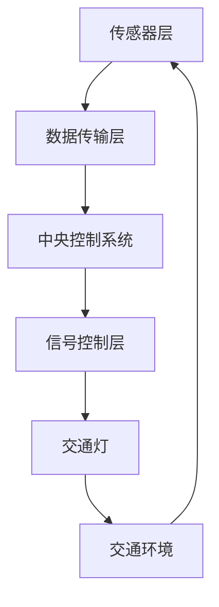

# 智能交通灯：AI Agent的实时流量控制

> 关键词：智能交通灯、AI Agent、实时流量控制、交通优化、强化学习

> 摘要：本文围绕智能交通灯利用AI Agent进行实时流量控制展开深入探讨。详细介绍了智能交通灯和AI Agent的核心概念及其联系，阐述了相关算法原理和具体操作步骤，运用数学模型和公式进行了理论分析。通过项目实战展示了代码实现和案例解读，探讨了实际应用场景。同时推荐了学习资源、开发工具框架以及相关论文著作。最后对智能交通灯未来发展趋势与挑战进行总结，并提供常见问题解答和扩展阅读参考资料，旨在为智能交通领域的研究和实践提供全面的技术指导。

## 1. 背景介绍 
### 1.1 目的和范围
智能交通系统是现代城市发展的重要组成部分，而交通灯作为交通管理的关键设施，其控制方式直接影响着交通流量的效率和安全性。传统的交通灯控制方式通常采用固定的时间间隔，无法根据实时交通流量进行动态调整，容易导致交通拥堵和资源浪费。因此，本文章的目的在于探讨如何利用AI Agent实现智能交通灯的实时流量控制，提高交通系统的运行效率和灵活性。

本文的范围涵盖了智能交通灯和AI Agent的核心概念、相关算法原理、数学模型、项目实战、实际应用场景、工具和资源推荐等方面，旨在为读者提供一个全面而深入的技术视角。

### 1.2 预期读者
本文预期读者包括交通工程领域的专业人士、人工智能研究者、软件开发者以及对智能交通系统感兴趣的技术爱好者。对于交通工程师来说，本文可以为他们提供新的交通控制思路和方法；对于人工智能研究者，有助于他们了解AI在交通领域的具体应用；软件开发者可以从中获取代码实现和开发工具的相关信息；而技术爱好者则可以通过阅读本文，拓宽对智能交通技术的认知。

### 1.3 文档结构概述
本文将按照以下结构进行组织：首先介绍智能交通灯和AI Agent的核心概念及其联系，通过文本示意图和Mermaid流程图进行直观展示；接着阐述核心算法原理和具体操作步骤，并使用Python源代码进行详细说明；然后运用数学模型和公式对相关原理进行分析，并举例说明；通过项目实战部分展示代码实际案例和详细解释；探讨智能交通灯在实际中的应用场景；推荐学习资源、开发工具框架以及相关论文著作；最后对智能交通灯未来发展趋势与挑战进行总结，并提供常见问题解答和扩展阅读参考资料。

### 1.4 术语表
#### 1.4.1 核心术语定义
- **智能交通灯**：一种能够根据实时交通流量信息自动调整信号灯时间的交通控制设备，通过传感器、通信技术和智能算法实现高效的交通管理。
- **AI Agent**：人工智能代理，是一种能够感知环境、做出决策并采取行动以实现特定目标的智能实体。在智能交通灯系统中，AI Agent可以根据交通流量数据动态调整交通灯的信号时间。
- **实时流量控制**：根据当前道路上的车辆和行人流量实时调整交通灯的信号时间，以优化交通流量，减少拥堵。
- **强化学习**：一种机器学习方法，智能体通过与环境进行交互，根据环境反馈的奖励信号来学习最优的行为策略。

#### 1.4.2 相关概念解释
- **交通流量数据**：包括车辆的数量、速度、行驶方向等信息，通常通过传感器（如摄像头、雷达、地磁传感器等）收集。
- **信号时间分配**：确定交通灯在不同相位的持续时间，以控制车辆和行人的通行。
- **环境感知**：AI Agent通过传感器获取交通环境的信息，如车辆排队长度、道路占有率等。

#### 1.4.3 缩略词列表
- **RL**：Reinforcement Learning，强化学习
- **Q - learning**：一种无模型的强化学习算法
- **AI**：Artificial Intelligence，人工智能

## 2. 核心概念与联系 
### 核心概念原理
#### 智能交通灯
智能交通灯是传统交通灯的智能化升级，它通过安装在道路上的各种传感器（如摄像头、雷达、地磁传感器等）实时收集交通流量数据，然后将这些数据传输到中央控制系统。中央控制系统根据预设的算法对数据进行分析和处理，动态调整交通灯的信号时间，以适应不同时段和不同道路的交通需求。

#### AI Agent
AI Agent是一种具有智能决策能力的实体，它可以感知环境状态，并根据预设的目标和规则做出相应的决策和行动。在智能交通灯系统中，AI Agent的主要任务是根据实时交通流量数据，选择最优的信号时间分配方案，以实现交通流量的优化。

#### 实时流量控制
实时流量控制是智能交通灯系统的核心功能之一，它通过实时监测交通流量的变化，动态调整交通灯的信号时间，使车辆和行人能够更加顺畅地通行。实时流量控制可以减少车辆的等待时间，降低交通拥堵，提高道路的通行效率。

### 架构的文本示意图
智能交通灯的AI Agent实时流量控制系统主要由以下几个部分组成：
1. **传感器层**：负责收集交通流量数据，包括车辆的数量、速度、行驶方向等信息。
2. **数据传输层**：将传感器收集到的数据传输到中央控制系统。
3. **中央控制系统**：包括AI Agent和算法模块，对交通流量数据进行分析和处理，做出信号时间分配决策。
4. **信号控制层**：根据中央控制系统的决策，控制交通灯的信号变化。

### Mermaid流程图


## 3. 核心算法原理 & 具体操作步骤 
### 核心算法原理 - 强化学习（Q - learning）
强化学习是一种通过智能体与环境进行交互来学习最优行为策略的机器学习方法。在智能交通灯系统中，我们可以使用Q - learning算法来实现实时流量控制。

Q - learning算法的核心思想是通过不断更新Q值（状态 - 动作价值函数）来找到最优的行为策略。Q值表示在某个状态下采取某个动作所获得的长期累积奖励。Q - learning算法的更新公式如下：

$$Q(s_t, a_t) \leftarrow Q(s_t, a_t) + \alpha [r_{t+1} + \gamma \max_{a} Q(s_{t+1}, a) - Q(s_t, a_t)]$$

其中：
- $s_t$ 表示当前状态
- $a_t$ 表示当前动作
- $r_{t+1}$ 表示执行动作 $a_t$ 后获得的即时奖励
- $\alpha$ 表示学习率，控制每次更新的步长
- $\gamma$ 表示折扣因子，衡量未来奖励的重要性

### 具体操作步骤
#### 步骤1：定义状态和动作
- **状态**：可以用车辆的排队长度、道路占有率等信息来表示。例如，将每个车道的车辆排队长度划分为几个区间，每个区间对应一个状态值。
- **动作**：表示交通灯的不同信号时间分配方案。例如，将绿灯时间划分为几个不同的时间段，每个时间段对应一个动作。

#### 步骤2：初始化Q表
Q表是一个二维数组，用于存储每个状态 - 动作对的Q值。初始时，Q表中的所有值都可以设置为0。

#### 步骤3：智能体与环境交互
智能体根据当前状态 $s_t$ 从Q表中选择一个动作 $a_t$，执行该动作后，环境会反馈一个即时奖励 $r_{t+1}$ 和下一个状态 $s_{t+1}$。

#### 步骤4：更新Q表
根据Q - learning算法的更新公式，更新Q表中 $(s_t, a_t)$ 对应的Q值。

#### 步骤5：重复步骤3和步骤4
不断重复步骤3和步骤4，直到智能体学习到最优的行为策略。

### Python源代码实现
```python
import numpy as np

# 定义状态和动作的数量
num_states = 10
num_actions = 5

# 初始化Q表
Q_table = np.zeros((num_states, num_actions))

# 定义超参数
alpha = 0.1  # 学习率
gamma = 0.9  # 折扣因子
epsilon = 0.1  # 探索率

# 定义奖励函数
def get_reward(state, action):
    # 这里简单假设奖励与状态和动作有关，实际应用中需要根据具体情况定义
    return np.random.randint(-10, 10)

# 定义选择动作的函数
def choose_action(state):
    if np.random.uniform(0, 1) < epsilon:
        # 探索：随机选择一个动作
        action = np.random.choice(num_actions)
    else:
        # 利用：选择Q值最大的动作
        action = np.argmax(Q_table[state, :])
    return action

# 训练过程
num_episodes = 1000
for episode in range(num_episodes):
    # 初始化状态
    state = np.random.randint(0, num_states)
    done = False
    while not done:
        # 选择动作
        action = choose_action(state)
        # 执行动作，获取奖励和下一个状态
        reward = get_reward(state, action)
        next_state = np.random.randint(0, num_states)
        # 更新Q表
        Q_table[state, action] = Q_table[state, action] + alpha * (reward + gamma * np.max(Q_table[next_state, :]) - Q_table[state, action])
        # 更新状态
        state = next_state
        # 判断是否结束
        if np.random.uniform(0, 1) < 0.1:
            done = True

print("训练完成后的Q表：")
print(Q_table)
```

## 4. 数学模型和公式 & 详细讲解 & 举例说明 
### 数学模型
在智能交通灯的实时流量控制中，我们可以将其建模为一个马尔可夫决策过程（MDP）。马尔可夫决策过程由以下几个要素组成：
- **状态空间 $S$**：表示交通系统的所有可能状态，例如车辆的排队长度、道路占有率等。
- **动作空间 $A$**：表示交通灯的所有可能信号时间分配方案。
- **转移概率 $P(s_{t+1} | s_t, a_t)$**：表示在状态 $s_t$ 下执行动作 $a_t$ 后转移到状态 $s_{t+1}$ 的概率。
- **奖励函数 $R(s_t, a_t, s_{t+1})$**：表示在状态 $s_t$ 下执行动作 $a_t$ 并转移到状态 $s_{t+1}$ 所获得的奖励。

### 公式详细讲解
#### Q - learning更新公式
$$Q(s_t, a_t) \leftarrow Q(s_t, a_t) + \alpha [r_{t+1} + \gamma \max_{a} Q(s_{t+1}, a) - Q(s_t, a_t)]$$

- **$Q(s_t, a_t)$**：表示在状态 $s_t$ 下采取动作 $a_t$ 的Q值。
- **$\alpha$**：学习率，控制每次更新的步长。$\alpha$ 越大，更新速度越快，但可能会导致不稳定；$\alpha$ 越小，更新速度越慢，但学习过程更加稳定。
- **$r_{t+1}$**：表示执行动作 $a_t$ 后获得的即时奖励。
- **$\gamma$**：折扣因子，衡量未来奖励的重要性。$\gamma$ 越接近1，表示更看重未来的奖励；$\gamma$ 越接近0，表示更看重即时奖励。
- **$\max_{a} Q(s_{t+1}, a)$**：表示在状态 $s_{t+1}$ 下所有动作的最大Q值。

#### 动作选择策略 - $\epsilon$ - 贪心策略
在Q - learning算法中，我们通常使用 $\epsilon$ - 贪心策略来选择动作。具体来说，以 $\epsilon$ 的概率随机选择一个动作进行探索，以 $1 - \epsilon$ 的概率选择Q值最大的动作进行利用。

### 举例说明
假设我们有一个简单的交通路口，有两个车道，每个车道的车辆排队长度可以分为三个区间：短（0 - 3辆车）、中（4 - 6辆车）、长（7辆车及以上）。因此，状态空间 $S$ 共有 $3 \times 3 = 9$ 个状态。

动作空间 $A$ 表示交通灯的绿灯时间，我们将绿灯时间分为三个级别：短（10秒）、中（20秒）、长（30秒），因此动作空间 $A$ 共有3个动作。

假设当前状态 $s_t$ 为两个车道的排队长度都为中，即状态编号为4。智能体根据 $\epsilon$ - 贪心策略选择一个动作 $a_t$，假设选择了中绿灯时间（动作编号为1）。执行该动作后，环境反馈一个即时奖励 $r_{t+1} = 5$，并转移到下一个状态 $s_{t+1}$，假设为一个车道短排队，另一个车道中排队，即状态编号为2。

根据Q - learning更新公式，更新Q表中 $(s_t, a_t)$ 对应的Q值：
$$Q(4, 1) \leftarrow Q(4, 1) + 0.1 [5 + 0.9 \max_{a} Q(2, a) - Q(4, 1)]$$

## 5. 项目实战：代码实际案例和详细解释说明 
### 5.1  开发环境搭建
#### 操作系统
建议使用Linux或Windows操作系统，本项目在Ubuntu 20.04和Windows 10上进行了测试。

#### 编程语言和库
- **Python**：建议使用Python 3.7及以上版本。
- **NumPy**：用于数值计算和数组操作。
- **Matplotlib**：用于可视化交通流量数据。

#### 安装步骤
```bash
# 创建虚拟环境
python -m venv traffic_env
# 激活虚拟环境
source traffic_env/bin/activate  # Linux/Mac
.\traffic_env\Scripts\activate  # Windows
# 安装依赖库
pip install numpy matplotlib
```

### 5.2  源代码详细实现和代码解读
```python
import numpy as np
import matplotlib.pyplot as plt

# 定义状态和动作的数量
num_states = 9
num_actions = 3

# 初始化Q表
Q_table = np.zeros((num_states, num_actions))

# 定义超参数
alpha = 0.1  # 学习率
gamma = 0.9  # 折扣因子
epsilon = 0.1  # 探索率

# 定义奖励函数
def get_reward(state, action):
    # 简单示例：奖励与状态和动作有关
    if state == 0 and action == 0:
        return 10
    elif state == 8 and action == 2:
        return 10
    else:
        return -1

# 定义选择动作的函数
def choose_action(state):
    if np.random.uniform(0, 1) < epsilon:
        # 探索：随机选择一个动作
        action = np.random.choice(num_actions)
    else:
        # 利用：选择Q值最大的动作
        action = np.argmax(Q_table[state, :])
    return action

# 训练过程
num_episodes = 1000
rewards = []
for episode in range(num_episodes):
    # 初始化状态
    state = np.random.randint(0, num_states)
    total_reward = 0
    done = False
    while not done:
        # 选择动作
        action = choose_action(state)
        # 执行动作，获取奖励和下一个状态
        reward = get_reward(state, action)
        next_state = np.random.randint(0, num_states)
        # 更新Q表
        Q_table[state, action] = Q_table[state, action] + alpha * (reward + gamma * np.max(Q_table[next_state, :]) - Q_table[state, action])
        # 更新状态
        state = next_state
        total_reward += reward
        # 判断是否结束
        if np.random.uniform(0, 1) < 0.1:
            done = True
    rewards.append(total_reward)

# 可视化奖励曲线
plt.plot(rewards)
plt.xlabel('Episode')
plt.ylabel('Total Reward')
plt.title('Training Rewards')
plt.show()

print("训练完成后的Q表：")
print(Q_table)
```

### 5.3  代码解读与分析
#### 代码结构
- **导入库**：导入NumPy和Matplotlib库，用于数值计算和可视化。
- **定义状态和动作的数量**：根据实际情况定义状态和动作的数量。
- **初始化Q表**：将Q表初始化为全零矩阵。
- **定义超参数**：设置学习率 $\alpha$、折扣因子 $\gamma$ 和探索率 $\epsilon$。
- **定义奖励函数**：根据状态和动作返回相应的奖励值。
- **定义选择动作的函数**：使用 $\epsilon$ - 贪心策略选择动作。
- **训练过程**：通过多个回合的训练，不断更新Q表，记录每个回合的总奖励。
- **可视化奖励曲线**：使用Matplotlib绘制训练过程中的奖励曲线。
- **输出Q表**：打印训练完成后的Q表。

#### 代码分析
- **奖励曲线**：通过观察奖励曲线可以了解智能体的学习过程。如果奖励曲线逐渐上升，说明智能体在不断学习和优化策略；如果奖励曲线波动较大，可能需要调整超参数。
- **Q表**：训练完成后的Q表记录了每个状态 - 动作对的Q值，智能体可以根据Q表选择最优的动作。

## 6. 实际应用场景 
### 城市交通路口
在城市的繁忙交通路口，智能交通灯的实时流量控制可以根据不同时段和不同方向的交通流量动态调整信号时间，减少车辆的等待时间，提高道路的通行效率。例如，在早晚高峰时段，增加主干道的绿灯时间，减少次干道的绿灯时间；在平峰时段，根据实际交通流量灵活调整信号时间。

### 高速公路入口匝道
在高速公路入口匝道处，智能交通灯可以根据高速公路的车流量和匝道上的车辆排队情况，控制匝道上车辆的进入速度，避免高速公路入口处的拥堵。例如，当高速公路车流量较大时，适当延长匝道上红灯时间，减少车辆进入高速公路的频率；当高速公路车流量较小时，缩短红灯时间，提高匝道上车辆的通行效率。

### 校园、园区等封闭区域
在校园、园区等封闭区域内，智能交通灯可以根据区域内的人员和车辆流量，合理分配交通信号时间，保障行人的安全和车辆的有序通行。例如，在学校上课和下课时间段，增加人行横道的绿灯时间，确保学生能够安全通过；在园区内车辆较多的时段，优化车辆通行的信号时间。

## 7. 工具和资源推荐
### 7.1 学习资源推荐
#### 7.1.1 书籍推荐
- 《强化学习：原理与Python实现》：详细介绍了强化学习的基本原理和算法，并提供了Python代码实现，适合初学者入门。
- 《智能交通系统原理与应用》：全面介绍了智能交通系统的各个方面，包括交通流量控制、智能交通灯等内容，为智能交通领域的学习提供了系统的知识体系。

#### 7.1.2 在线课程
- Coursera上的“Reinforcement Learning Specialization”：由顶尖大学的教授授课，深入讲解了强化学习的理论和实践，提供了丰富的案例和编程作业。
- edX上的“Intelligent Transportation Systems”：介绍了智能交通系统的前沿技术和应用，包括智能交通灯的实时流量控制等内容。

#### 7.1.3 技术博客和网站
- Medium上的“Towards Data Science”：有很多关于人工智能和强化学习的技术文章，其中不乏智能交通领域的应用案例和研究成果。
- IEEE Xplore：提供了大量的电气和电子工程领域的学术论文，包括智能交通系统方面的最新研究。

### 7.2 开发工具框架推荐
#### 7.2.1 IDE和编辑器
- PyCharm：功能强大的Python集成开发环境，提供了代码编辑、调试、版本控制等功能，适合Python项目的开发。
- Jupyter Notebook：交互式的编程环境，方便进行代码的编写、运行和可视化，适合进行数据分析和算法实验。

#### 7.2.2 调试和性能分析工具
- TensorBoard：用于可视化深度学习模型的训练过程和性能指标，在强化学习项目中可以用于观察奖励曲线、Q值变化等。
- cProfile：Python自带的性能分析工具，可以帮助我们找出代码中的性能瓶颈。

#### 7.2.3 相关框架和库
- OpenAI Gym：一个用于开发和比较强化学习算法的工具包，提供了各种模拟环境，方便我们进行算法的测试和验证。
- Stable Baselines3：基于PyTorch的强化学习库，提供了多种预训练的强化学习算法，方便我们快速实现和应用。

### 7.3 相关论文著作推荐
#### 7.3.1 经典论文
- “Q - learning”：由Watkins和Dayan于1992年发表的论文，首次提出了Q - learning算法，是强化学习领域的经典之作。
- “Reinforcement Learning in Traffic Signal Control”：探讨了强化学习在交通信号控制中的应用，为智能交通灯的研究提供了重要的理论基础。

#### 7.3.2 最新研究成果
- 关注IEEE Transactions on Intelligent Transportation Systems、Transportation Research Part C: Emerging Technologies等学术期刊，这些期刊发表了智能交通领域的最新研究成果。

#### 7.3.3 应用案例分析
- 一些实际的智能交通项目案例可以在相关的行业报告和会议论文中找到，例如国际智能交通系统协会（ITS World Congress）的会议论文集，包含了很多智能交通灯实时流量控制的应用案例。

## 8. 总结：未来发展趋势与挑战
### 未来发展趋势
#### 多智能体协同控制
未来的智能交通灯系统将不仅仅是单个交通灯的智能控制，而是多个交通灯之间的协同控制。通过多智能体技术，各个交通灯可以相互通信和协作，共同优化整个交通网络的流量。例如，相邻的交通灯可以根据彼此的交通流量信息，动态调整信号时间，实现交通流的平滑过渡。

#### 与其他智能交通系统的融合
智能交通灯将与其他智能交通系统（如智能车辆、智能公交系统等）进行深度融合。智能车辆可以与交通灯进行通信，提前获取交通信号信息，优化行驶路线和速度；智能公交系统可以根据交通灯的信号时间，调整发车时间和行驶速度，提高公交的准点率和运营效率。

#### 基于大数据和人工智能的优化
随着大数据技术和人工智能的不断发展，智能交通灯系统将能够收集和分析更多的交通数据，包括车辆的行驶轨迹、驾驶员的行为习惯等。通过对这些数据的挖掘和分析，可以进一步优化交通灯的控制策略，提高交通系统的整体性能。

### 挑战
#### 数据安全和隐私问题
智能交通灯系统需要收集大量的交通数据，这些数据包含了车辆和驾驶员的敏感信息。因此，如何保障数据的安全和隐私是一个重要的挑战。需要采用先进的加密技术和数据保护措施，防止数据泄露和滥用。

#### 算法的复杂性和可解释性
强化学习等人工智能算法在智能交通灯系统中具有很好的应用前景，但这些算法往往比较复杂，难以理解和解释。在实际应用中，需要确保算法的决策过程是可解释的，以便交通管理人员能够理解和信任系统的决策。

#### 系统的可靠性和稳定性
智能交通灯系统直接关系到交通的安全和顺畅，因此系统的可靠性和稳定性至关重要。需要对系统进行严格的测试和验证，确保在各种复杂的环境条件下都能正常运行。同时，需要建立完善的故障诊断和应急处理机制，及时应对系统故障和异常情况。

## 9. 附录：常见问题与解答
### 问题1：智能交通灯的实时流量控制需要哪些传感器？
解答：常见的传感器包括摄像头、雷达、地磁传感器等。摄像头可以实时监测车辆的数量和行驶方向；雷达可以测量车辆的速度和距离；地磁传感器可以检测车辆的存在和通过情况。不同的传感器具有不同的特点和适用场景，可以根据实际需求进行选择和组合。

### 问题2：强化学习算法在智能交通灯系统中的训练时间需要多长？
解答：训练时间取决于多个因素，包括状态和动作的数量、超参数的设置、环境的复杂度等。一般来说，训练时间可能从几个小时到几天不等。在实际应用中，可以通过优化算法和调整超参数来缩短训练时间。

### 问题3：智能交通灯系统的成本高吗？
解答：智能交通灯系统的成本主要包括传感器的采购和安装成本、中央控制系统的开发和维护成本等。与传统的交通灯系统相比，智能交通灯系统的成本相对较高。但从长期来看，智能交通灯系统可以提高交通效率，减少拥堵和能源消耗，带来显著的社会效益和经济效益。

### 问题4：如何评估智能交通灯系统的性能？
解答：可以从多个方面评估智能交通灯系统的性能，包括车辆的平均等待时间、道路的通行效率、交通拥堵程度等。可以通过实地测试和模拟实验等方法，收集相关数据，并进行分析和比较。

## 10. 扩展阅读 & 参考资料
### 扩展阅读
- 《交通流理论》：深入介绍了交通流的基本原理和模型，对于理解智能交通灯的实时流量控制具有重要的参考价值。
- 《人工智能：一种现代的方法》：全面介绍了人工智能的各个领域，包括机器学习、强化学习等，为智能交通灯系统的研究提供了理论基础。

### 参考资料
- IEEE Transactions on Intelligent Transportation Systems
- Transportation Research Part C: Emerging Technologies
- OpenAI Gym官方文档
- Stable Baselines3官方文档

作者：AI天才研究院/AI Genius Institute & 禅与计算机程序设计艺术 /Zen And The Art of Computer Programming