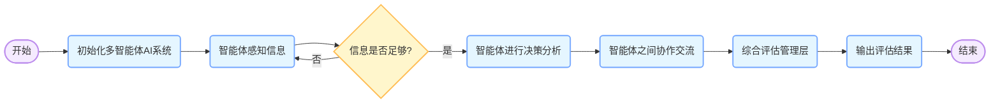

# 智能价值投资：多智能体AI系统的管理层评估

> 关键词：智能价值投资、多智能体AI系统、管理层评估、金融分析、人工智能应用

> 摘要：本文聚焦于智能价值投资领域，深入探讨利用多智能体AI系统进行管理层评估的相关技术与方法。首先介绍了该研究的背景，包括目的、预期读者和文档结构等。接着阐述了核心概念，如多智能体AI系统和管理层评估的原理及联系，并给出了相应的示意图和流程图。详细讲解了核心算法原理，通过Python代码进行说明，同时介绍了相关的数学模型和公式，并举例说明其应用。在项目实战部分，展示了开发环境搭建、源代码实现与解读。还探讨了实际应用场景，推荐了学习资源、开发工具和相关论文著作。最后总结了未来发展趋势与挑战，并提供了常见问题解答和扩展阅读参考资料。旨在为投资者和相关技术人员提供全面的关于多智能体AI系统在管理层评估中的应用知识。

## 1. 背景介绍 
### 1.1 目的和范围
在当今复杂多变的金融市场中，价值投资是一种备受关注的投资策略。而管理层的能力和素质对企业的发展和价值创造起着至关重要的作用。本研究的目的是构建一个多智能体AI系统，用于对企业管理层进行全面、客观、准确的评估，为投资者提供更有价值的决策依据。

研究范围涵盖了多智能体AI系统的构建、管理层评估指标体系的建立、算法的设计与实现，以及系统在实际投资场景中的应用等方面。通过对这些方面的深入研究，旨在提高管理层评估的效率和准确性，推动智能价值投资的发展。

### 1.2 预期读者
本文的预期读者主要包括以下几类人群：
1. **投资者**：希望借助先进的技术手段，更准确地评估企业管理层，从而做出更明智的投资决策。
2. **金融分析师**：需要深入了解企业管理层的情况，为投资建议提供有力支持。
3. **人工智能研究人员**：对多智能体系统在金融领域的应用感兴趣，希望从中获取相关的研究思路和方法。
4. **企业管理人员**：可以通过了解评估方法，反思自身管理水平，提升企业的竞争力。

### 1.3 文档结构概述
本文将按照以下结构进行组织：
1. **背景介绍**：阐述研究的目的、范围、预期读者和文档结构，为后续内容奠定基础。
2. **核心概念与联系**：介绍多智能体AI系统和管理层评估的核心概念，以及它们之间的联系，并通过示意图和流程图进行直观展示。
3. **核心算法原理 & 具体操作步骤**：详细讲解用于管理层评估的核心算法原理，并用Python代码实现具体操作步骤。
4. **数学模型和公式 & 详细讲解 & 举例说明**：建立数学模型和公式，对其进行详细讲解，并通过实际例子说明其应用。
5. **项目实战：代码实际案例和详细解释说明**：展示项目的开发环境搭建、源代码实现和代码解读，帮助读者更好地理解和应用相关技术。
6. **实际应用场景**：探讨多智能体AI系统在管理层评估中的实际应用场景，为读者提供实际参考。
7. **工具和资源推荐**：推荐学习资源、开发工具和相关论文著作，帮助读者进一步深入学习和研究。
8. **总结：未来发展趋势与挑战**：总结研究成果，分析未来发展趋势和面临的挑战。
9. **附录：常见问题与解答**：解答读者可能遇到的常见问题。
10. **扩展阅读 & 参考资料**：提供扩展阅读的建议和参考资料，方便读者进一步探索相关领域。

### 1.4 术语表
#### 1.4.1 核心术语定义
- **智能价值投资**：基于对企业内在价值的分析，利用先进的技术手段，寻找被低估的投资机会，以实现长期稳定的投资回报。
- **多智能体AI系统**：由多个智能体组成的系统，每个智能体具有一定的自主性和智能，能够通过相互协作和交互完成复杂的任务。
- **管理层评估**：对企业管理层的能力、素质、决策水平等方面进行综合评价，以了解管理层对企业发展的影响。
- **智能体**：具有感知、决策和行动能力的个体，能够根据环境信息自主地做出决策并采取行动。

#### 1.4.2 相关概念解释
- **金融市场**：进行金融资产交易的场所，包括股票市场、债券市场、期货市场等。
- **企业内在价值**：企业未来现金流量的现值，是评估企业投资价值的重要依据。
- **投资决策**：投资者根据对市场和企业的分析，做出是否投资以及投资多少的决策。

#### 1.4.3 缩略词列表
- **AI**：Artificial Intelligence，人工智能
- **MAB**：Multi - Agent Based，基于多智能体的

## 2. 核心概念与联系 

### 2.1 多智能体AI系统原理
多智能体AI系统是由多个智能体组成的分布式系统。每个智能体都有自己的目标、知识和能力，它们可以感知周围环境的信息，并根据这些信息做出决策和采取行动。智能体之间通过通信和协作机制相互作用，共同完成系统的整体任务。

智能体的基本结构通常包括感知模块、决策模块和行动模块。感知模块用于获取环境信息，决策模块根据感知到的信息和自身的知识进行推理和决策，行动模块则根据决策结果采取相应的行动。

### 2.2 管理层评估原理
管理层评估是一个复杂的过程，需要综合考虑多个因素。评估指标通常包括管理层的专业能力、领导能力、决策能力、团队协作能力等方面。通过对这些指标的量化分析，可以对管理层的整体水平进行评价。

评估方法可以分为定性评估和定量评估。定性评估主要通过专家意见、访谈等方式进行，定量评估则通过建立数学模型和指标体系，对相关数据进行分析和计算。

### 2.3 两者的联系
多智能体AI系统可以为管理层评估提供更高效、准确的方法。通过多个智能体的协作，可以从不同的角度对管理层进行评估，提高评估的全面性和客观性。例如，一个智能体可以负责收集管理层的公开信息，另一个智能体可以对管理层的决策行为进行分析，多个智能体之间相互协作，共同完成管理层评估的任务。

### 2.4 文本示意图
```plaintext
多智能体AI系统
|-- 智能体1
|   |-- 感知模块（收集管理层公开信息）
|   |-- 决策模块（分析信息，给出初步评估）
|   |-- 行动模块（与其他智能体通信）
|-- 智能体2
|   |-- 感知模块（监测管理层决策行为）
|   |-- 决策模块（评估决策合理性）
|   |-- 行动模块（与其他智能体协作）
|--...
|-- 智能体N
|   |-- 感知模块（收集其他相关信息）
|   |-- 决策模块（综合分析）
|   |-- 行动模块（输出最终评估结果）

管理层评估
|-- 评估指标体系
|   |-- 专业能力
|   |-- 领导能力
|   |-- 决策能力
|   |-- 团队协作能力
|   |--...
|-- 评估方法
|   |-- 定性评估
|   |-- 定量评估
```

### 2.5 Mermaid流程图


## 3. 核心算法原理 & 具体操作步骤 

### 3.1 核心算法原理
我们采用基于机器学习的算法来对管理层进行评估。具体来说，使用支持向量机（SVM）和神经网络（NN）相结合的方法。

支持向量机是一种二分类模型，它通过寻找最优的超平面来将不同类别的数据分开。在管理层评估中，我们可以将管理层分为优秀和一般两类，通过训练SVM模型来对新的管理层进行分类。

神经网络是一种模仿人类神经系统的计算模型，它可以自动从数据中学习特征和模式。我们使用多层感知机（MLP）作为神经网络的结构，将管理层的各项评估指标作为输入，输出管理层的评估得分。

### 3.2 具体操作步骤
1. **数据收集**：收集管理层的相关数据，包括教育背景、工作经验、决策记录等。
2. **数据预处理**：对收集到的数据进行清洗、归一化等处理，以便于模型的训练。
3. **特征选择**：从预处理后的数据中选择与管理层评估相关的特征。
4. **模型训练**：使用训练数据对SVM和NN模型进行训练。
5. **模型评估**：使用测试数据对训练好的模型进行评估，计算模型的准确率、召回率等指标。
6. **预测评估**：使用训练好的模型对新的管理层进行评估，输出评估结果。

### 3.3 Python源代码实现
```python
import numpy as np
from sklearn.svm import SVC
from sklearn.neural_network import MLPClassifier
from sklearn.model_selection import train_test_split
from sklearn.preprocessing import StandardScaler
from sklearn.metrics import accuracy_score

# 生成示例数据
np.random.seed(42)
X = np.random.rand(100, 5)  # 100个样本，每个样本有5个特征
y = np.random.randint(0, 2, 100)  # 标签，0或1

# 数据预处理
scaler = StandardScaler()
X = scaler.fit_transform(X)

# 划分训练集和测试集
X_train, X_test, y_train, y_test = train_test_split(X, y, test_size=0.2, random_state=42)

# 训练SVM模型
svm_model = SVC()
svm_model.fit(X_train, y_train)

# 训练神经网络模型
nn_model = MLPClassifier(hidden_layer_sizes=(10, 5), max_iter=1000)
nn_model.fit(X_train, y_train)

# 模型评估
svm_pred = svm_model.predict(X_test)
nn_pred = nn_model.predict(X_test)

svm_accuracy = accuracy_score(y_test, svm_pred)
nn_accuracy = accuracy_score(y_test, nn_pred)

print(f"SVM模型准确率: {svm_accuracy}")
print(f"神经网络模型准确率: {nn_accuracy}")

# 预测新数据
new_data = np.random.rand(5, 5)
new_data = scaler.transform(new_data)

svm_new_pred = svm_model.predict(new_data)
nn_new_pred = nn_model.predict(new_data)

print(f"SVM模型对新数据的预测结果: {svm_new_pred}")
print(f"神经网络模型对新数据的预测结果: {nn_new_pred}")
```

## 4. 数学模型和公式 & 详细讲解 & 举例说明 

### 4.1 支持向量机数学模型
支持向量机的目标是找到一个最优的超平面，使得不同类别的数据点到超平面的间隔最大。对于线性可分的数据集，超平面可以表示为：

$$w^T x + b = 0$$

其中，$w$ 是超平面的法向量，$b$ 是偏置项，$x$ 是数据点。

支持向量机的优化问题可以表示为：

$$\min_{w,b} \frac{1}{2} \| w \|^2$$

约束条件为：

$$y_i (w^T x_i + b) \geq 1, i = 1,2,\cdots,n$$

其中，$y_i$ 是数据点 $x_i$ 的标签，$n$ 是数据点的数量。

### 4.2 神经网络数学模型
多层感知机（MLP）是一种常见的神经网络结构，它由输入层、隐藏层和输出层组成。对于一个具有 $L$ 层的神经网络，第 $l$ 层的输出可以表示为：

$$a^{(l)} = f(z^{(l)})$$

其中，$a^{(l)}$ 是第 $l$ 层的激活值，$z^{(l)}$ 是第 $l$ 层的加权输入，$f$ 是激活函数。

加权输入 $z^{(l)}$ 可以表示为：

$$z^{(l)} = W^{(l)} a^{(l - 1)} + b^{(l)}$$

其中，$W^{(l)}$ 是第 $l$ 层的权重矩阵，$b^{(l)}$ 是第 $l$ 层的偏置向量。

### 4.3 详细讲解
支持向量机通过最大化间隔来找到最优的超平面，这样可以提高模型的泛化能力。在实际应用中，可能会遇到线性不可分的情况，此时可以通过引入核函数将数据映射到高维空间，使得数据在高维空间中线性可分。

神经网络通过多层的神经元结构，自动从数据中学习特征和模式。激活函数的作用是引入非线性因素，使得神经网络可以拟合复杂的函数关系。常见的激活函数有 sigmoid 函数、ReLU 函数等。

### 4.4 举例说明
假设我们有一个二维数据集，包含两类数据点：红色点和蓝色点。支持向量机的目标是找到一条直线（超平面），将红色点和蓝色点分开，并且使得两类数据点到直线的间隔最大。

对于神经网络，假设我们要对手写数字进行识别。输入层的神经元数量等于图像的像素数量，隐藏层可以有多个，每个隐藏层的神经元数量可以根据具体情况进行调整，输出层的神经元数量等于数字的类别数量（0 - 9）。通过训练神经网络，它可以自动学习到手写数字的特征，从而实现准确的识别。

## 5. 项目实战：代码实际案例和详细解释说明 

### 5.1  开发环境搭建
#### 5.1.1 安装Python
首先，需要安装Python编程语言。建议使用Python 3.7及以上版本，可以从Python官方网站（https://www.python.org/downloads/）下载并安装。

#### 5.1.2 安装必要的库
使用以下命令安装项目所需的库：
```sh
pip install numpy scikit-learn pandas matplotlib
```

#### 5.1.3 开发工具选择
可以使用 PyCharm、Jupyter Notebook 等开发工具。PyCharm 是一个功能强大的Python集成开发环境，适合大型项目的开发；Jupyter Notebook 则更适合交互式的开发和数据分析。

### 5.2  源代码详细实现和代码解读
```python
import numpy as np
import pandas as pd
from sklearn.svm import SVC
from sklearn.neural_network import MLPClassifier
from sklearn.model_selection import train_test_split
from sklearn.preprocessing import StandardScaler
from sklearn.metrics import accuracy_score
import matplotlib.pyplot as plt

# 读取数据
data = pd.read_csv('management_data.csv')

# 提取特征和标签
X = data.drop('label', axis=1).values
y = data['label'].values

# 数据预处理
scaler = StandardScaler()
X = scaler.fit_transform(X)

# 划分训练集和测试集
X_train, X_test, y_train, y_test = train_test_split(X, y, test_size=0.2, random_state=42)

# 训练SVM模型
svm_model = SVC()
svm_model.fit(X_train, y_train)

# 训练神经网络模型
nn_model = MLPClassifier(hidden_layer_sizes=(10, 5), max_iter=1000)
nn_model.fit(X_train, y_train)

# 模型评估
svm_pred = svm_model.predict(X_test)
nn_pred = nn_model.predict(X_test)

svm_accuracy = accuracy_score(y_test, svm_pred)
nn_accuracy = accuracy_score(y_test, nn_pred)

print(f"SVM模型准确率: {svm_accuracy}")
print(f"神经网络模型准确率: {nn_accuracy}")

# 可视化结果
labels = ['SVM', 'Neural Network']
accuracies = [svm_accuracy, nn_accuracy]

plt.bar(labels, accuracies)
plt.ylabel('Accuracy')
plt.title('Model Accuracy Comparison')
plt.show()
```

### 代码解读与分析
1. **数据读取**：使用 `pandas` 库读取存储管理层数据的 CSV 文件。
2. **特征提取和标签分离**：将数据集中的特征和标签分别提取出来。
3. **数据预处理**：使用 `StandardScaler` 对特征数据进行归一化处理，使得数据具有相同的尺度。
4. **数据集划分**：使用 `train_test_split` 函数将数据集划分为训练集和测试集，比例为 8:2。
5. **模型训练**：分别训练 SVM 模型和神经网络模型。
6. **模型评估**：使用 `accuracy_score` 函数计算模型在测试集上的准确率。
7. **结果可视化**：使用 `matplotlib` 库绘制柱状图，比较两个模型的准确率。

## 6. 实际应用场景 
### 6.1 投资决策
投资者在进行股票投资时，可以使用多智能体AI系统对企业管理层进行评估。评估结果可以作为投资决策的重要参考因素之一。如果管理层评估得分较高，说明企业的管理水平较好，企业未来的发展潜力较大，投资者可以考虑增加对该企业的投资；反之，如果评估得分较低，投资者则需要谨慎考虑是否投资该企业。

### 6.2 企业并购
在企业并购过程中，对目标企业管理层的评估至关重要。通过多智能体AI系统对目标企业管理层的能力、经验等方面进行评估，可以帮助并购方更好地了解目标企业的管理状况，评估并购的风险和收益。如果目标企业管理层能力较强，并购后可以更好地整合资源，实现协同效应；反之，如果管理层能力不足，可能会导致并购失败。

### 6.3 企业内部管理
企业内部也可以使用多智能体AI系统对管理层进行评估。评估结果可以为企业的人力资源管理提供参考，例如，用于管理层的绩效考核、晋升决策等。通过定期对管理层进行评估，企业可以及时发现管理层存在的问题，采取相应的措施进行改进，提高企业的管理水平和竞争力。

## 7. 工具和资源推荐
### 7.1 学习资源推荐
#### 7.1.1 书籍推荐
- 《人工智能：一种现代的方法》：这是一本经典的人工智能教材，涵盖了人工智能的各个领域，包括多智能体系统、机器学习等。
- 《Python机器学习实战》：通过实际案例介绍了Python在机器学习中的应用，适合初学者入门。
- 《价值投资：从格雷厄姆到巴菲特》：详细介绍了价值投资的理论和方法，对投资者有很大的帮助。

#### 7.1.2 在线课程
- Coursera上的“机器学习”课程：由斯坦福大学教授Andrew Ng授课，是一门非常受欢迎的机器学习课程。
- edX上的“人工智能基础”课程：介绍了人工智能的基本概念、算法和应用。
- Udemy上的“Python数据科学和机器学习实战”课程：通过实际项目学习Python在数据科学和机器学习中的应用。

#### 7.1.3 技术博客和网站
- Medium：有很多关于人工智能、金融科技等领域的优秀文章。
- Towards Data Science：专注于数据科学和机器学习领域的技术博客，提供了很多实用的教程和案例。
- 金融界网站：提供了丰富的金融市场信息和投资分析报告。

### 7.2 开发工具框架推荐
#### 7.2.1 IDE和编辑器
- PyCharm：功能强大的Python集成开发环境，提供了代码编辑、调试、版本控制等功能。
- Jupyter Notebook：交互式的开发环境，适合数据分析和机器学习项目的开发。
- Visual Studio Code：轻量级的代码编辑器，支持多种编程语言和插件扩展。

#### 7.2.2 调试和性能分析工具
- Py-Spy：用于分析Python程序的性能瓶颈。
- pdb：Python自带的调试工具，可以帮助开发者定位代码中的问题。
- TensorBoard：用于可视化深度学习模型的训练过程和性能指标。

#### 7.2.3 相关框架和库
- Scikit-learn：用于机器学习的Python库，提供了丰富的算法和工具。
- TensorFlow：谷歌开发的深度学习框架，广泛应用于图像识别、自然语言处理等领域。
- PyTorch：另一个流行的深度学习框架，具有动态图和易于使用的特点。

### 7.3 相关论文著作推荐
#### 7.3.1 经典论文
- “Support-Vector Networks”：介绍了支持向量机的基本原理和算法。
- “Learning Representations by Back-propagating Errors”：提出了神经网络的反向传播算法。
- “The Efficient Market Hypothesis and Its Critics”：讨论了有效市场假说及其争议。

#### 7.3.2 最新研究成果
- 关注顶级学术会议如NeurIPS、ICML等的论文，了解多智能体系统和金融科技领域的最新研究进展。
- 查阅相关学术期刊如《Journal of Financial Economics》、《Artificial Intelligence》等的文章。

#### 7.3.3 应用案例分析
- 分析一些知名投资机构的投资案例，了解他们在管理层评估和投资决策中的方法和经验。
- 研究一些企业并购案例，分析多智能体AI系统在其中的应用效果。

## 8. 总结：未来发展趋势与挑战
### 8.1 未来发展趋势
- **更复杂的多智能体系统**：未来的多智能体AI系统将更加复杂，智能体之间的协作和交互将更加灵活和高效。例如，智能体可以根据不同的任务和环境动态地调整协作策略。
- **融合更多的数据来源**：除了现有的数据，未来的系统将融合更多的数据来源，如社交媒体数据、物联网数据等，以更全面地了解企业管理层的情况。
- **与区块链技术结合**：区块链技术的去中心化、不可篡改等特点可以为管理层评估提供更可靠的数据和更安全的环境。两者结合可以提高评估结果的可信度。
- **智能决策支持**：多智能体AI系统将不仅仅提供评估结果，还将为投资者和企业提供智能决策支持，例如，根据评估结果自动生成投资建议或管理改进方案。

### 8.2 挑战
- **数据质量和隐私问题**：数据质量直接影响评估结果的准确性，而数据隐私问题也是一个重要的挑战。如何在保证数据质量的同时，保护数据的隐私是需要解决的问题。
- **模型可解释性**：深度学习等模型通常具有较高的准确率，但缺乏可解释性。在金融领域，投资者和监管机构通常需要了解模型的决策依据，因此提高模型的可解释性是一个重要的挑战。
- **技术集成难度**：将多智能体系统、机器学习、区块链等多种技术集成到一个系统中，面临着技术集成难度大、系统复杂度高等问题。
- **市场变化适应性**：金融市场变化快速，管理层的情况也会随着时间发生变化。如何使多智能体AI系统能够及时适应市场变化，准确评估管理层的动态变化是一个挑战。

## 9. 附录：常见问题与解答
### 9.1 多智能体AI系统的训练时间会很长吗？
多智能体AI系统的训练时间取决于多个因素，如数据量的大小、模型的复杂度等。如果数据量较大、模型较复杂，训练时间可能会较长。可以通过优化算法、使用并行计算等方法来缩短训练时间。

### 9.2 如何选择合适的评估指标？
选择合适的评估指标需要考虑评估的目的和管理层的特点。一般来说，可以从专业能力、领导能力、决策能力、团队协作能力等方面选择指标。同时，还可以参考相关的行业标准和专家意见。

### 9.3 多智能体AI系统的评估结果一定准确吗？
多智能体AI系统的评估结果并不是绝对准确的，它受到数据质量、模型选择、算法设计等多种因素的影响。评估结果只能作为参考，投资者和企业还需要结合其他信息进行综合判断。

### 9.4 如何保证多智能体AI系统的安全性？
可以采取以下措施保证多智能体AI系统的安全性：
- 对数据进行加密处理，防止数据泄露。
- 采用安全的通信协议，确保智能体之间的通信安全。
- 定期对系统进行安全审计和漏洞修复。

## 10. 扩展阅读 & 参考资料
### 10.1 扩展阅读
- 阅读关于多智能体系统在其他领域应用的书籍和论文，了解其不同的应用场景和方法。
- 关注金融科技领域的最新动态和发展趋势，了解相关技术的应用前景。
- 研究行为金融学，了解投资者的心理和行为对投资决策的影响。

### 10.2 参考资料
- 相关学术论文和研究报告，如IEEE Transactions on Neural Networks and Learning Systems、ACM Transactions on Intelligent Systems and Technology等期刊上的文章。
- 金融机构的研究报告和投资分析报告，如高盛、摩根大通等机构的报告。
- 开源代码库和项目，如GitHub上的相关项目，可以参考其代码实现和技术方案。

作者：AI天才研究院/AI Genius Institute & 禅与计算机程序设计艺术 /Zen And The Art of Computer Programming