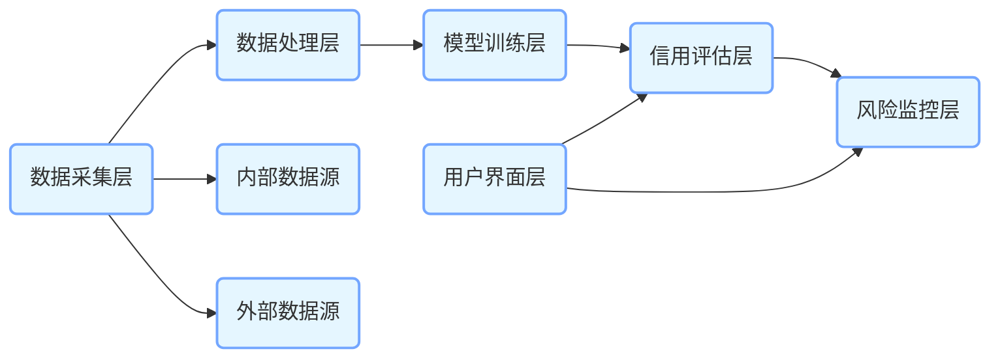

# 智能企业信用限额管理系统

> 关键词：智能企业信用限额管理系统、信用评估、风险控制、算法原理、实际应用

> 摘要：本文围绕智能企业信用限额管理系统展开，详细阐述了该系统的背景、核心概念、算法原理、数学模型、项目实战、实际应用场景等内容。通过深入分析系统的各个方面，旨在让读者全面了解智能企业信用限额管理系统的工作原理、实现方法以及其在企业信用管理中的重要作用，同时为相关领域的研究和实践提供有价值的参考。

## 1. 背景介绍 
### 1.1 目的和范围
随着市场经济的快速发展，企业之间的商业往来日益频繁，信用交易成为企业运营中的重要组成部分。然而，信用交易也伴随着一定的风险，如客户违约、欠款等问题。智能企业信用限额管理系统的目的在于帮助企业科学、合理地评估客户的信用状况，设定适当的信用限额，从而有效控制信用风险，提高企业的资金安全性和运营效率。

本系统的范围涵盖了企业信用信息的收集、整理、分析，信用评估模型的建立和优化，信用限额的动态调整以及相关风险预警等功能。通过对这些功能的集成和管理，实现对企业信用风险的全面监控和管理。

### 1.2 预期读者
本文的预期读者主要包括企业管理人员、信用管理人员、金融机构从业者、信息技术人员以及对企业信用管理和人工智能技术感兴趣的研究人员。企业管理人员可以通过本文了解如何利用智能系统提升企业的信用管理水平；信用管理人员可以深入学习系统的核心算法和评估模型，优化自身的信用管理工作；金融机构从业者可以借鉴系统的设计思路和方法，改进信贷审批流程；信息技术人员可以获取系统开发的相关技术和经验；研究人员可以在本文的基础上开展进一步的学术研究。

### 1.3 文档结构概述
本文将按照以下结构进行详细阐述：首先介绍智能企业信用限额管理系统的背景信息，包括目的、范围、预期读者和文档结构概述；接着讲解系统的核心概念与联系，通过文本示意图和 Mermaid 流程图展示系统的架构和原理；然后深入分析核心算法原理和具体操作步骤，并使用 Python 源代码进行详细阐述；之后介绍系统涉及的数学模型和公式，并结合实际例子进行说明；再通过项目实战，展示系统的开发环境搭建、源代码实现和代码解读；随后探讨系统的实际应用场景；接着推荐相关的工具和资源，包括学习资源、开发工具框架和论文著作；最后对系统的未来发展趋势与挑战进行总结，并提供常见问题与解答以及扩展阅读和参考资料。

### 1.4 术语表
#### 1.4.1 核心术语定义
- **智能企业信用限额管理系统**：利用人工智能技术和数据分析方法，对企业客户的信用状况进行评估和管理，自动设定和调整信用限额的系统。
- **信用评估**：根据客户的各种信息，如财务状况、经营业绩、信用历史等，对客户的信用风险进行综合评价的过程。
- **信用限额**：企业为客户设定的在一定时期内可以赊购商品或服务的最高金额。
- **风险控制**：通过各种手段和措施，降低企业面临的信用风险，保障企业的资金安全和正常运营。
- **数据挖掘**：从大量的数据中提取有价值的信息和知识的过程。

#### 1.4.2 相关概念解释
- **人工智能**：研究如何使计算机系统能够模拟人类的智能行为，如学习、推理、决策等。在智能企业信用限额管理系统中，人工智能技术可用于信用评估模型的训练和优化。
- **机器学习**：人工智能的一个重要分支，通过让计算机从数据中自动学习模式和规律，从而实现预测和决策。在系统中，机器学习算法可用于分析客户的信用数据，建立信用评估模型。
- **大数据**：指海量、多样、高增长速度和价值密度低的数据集合。在企业信用管理中，大数据可以提供丰富的客户信息，帮助更准确地评估客户的信用状况。

#### 1.4.3 缩略词列表
- **AI**：Artificial Intelligence，人工智能
- **ML**：Machine Learning，机器学习
- **API**：Application Programming Interface，应用程序编程接口

## 2. 核心概念与联系 

### 核心概念原理
智能企业信用限额管理系统的核心原理是基于数据驱动的信用评估和风险控制。系统通过收集企业客户的多源数据，包括财务报表、交易记录、信用报告等，利用数据分析和机器学习算法对这些数据进行处理和分析，建立信用评估模型。该模型可以对客户的信用风险进行量化评估，根据评估结果为客户设定合理的信用限额。同时，系统会实时监控客户的信用状况和交易行为，当发现风险因素时，及时调整信用限额并发出预警。

### 架构的文本示意图
智能企业信用限额管理系统主要由以下几个部分组成：
1. **数据采集层**：负责收集企业客户的各种信用相关数据，包括内部数据（如销售记录、应收账款数据等）和外部数据（如征信机构报告、行业数据等）。
2. **数据处理层**：对采集到的数据进行清洗、转换和整合，去除噪声数据，统一数据格式，为后续的分析提供高质量的数据。
3. **模型训练层**：利用机器学习算法对处理后的数据进行训练，建立信用评估模型。常见的算法包括逻辑回归、决策树、随机森林等。
4. **信用评估层**：根据训练好的模型，对客户的信用状况进行评估，计算信用得分，并根据得分设定信用限额。
5. **风险监控层**：实时监控客户的交易行为和信用状况，当发现异常情况时，及时调整信用限额并发出预警。
6. **用户界面层**：为企业管理人员和信用管理人员提供可视化的操作界面，方便他们进行系统配置、数据查询、信用评估结果查看等操作。

### Mermaid 流程图


该流程图展示了智能企业信用限额管理系统的主要流程。首先，数据采集层从内部和外部数据源收集数据，然后将数据传输到数据处理层进行处理。处理后的数据进入模型训练层进行模型训练，训练好的模型用于信用评估层对客户的信用状况进行评估和设定信用限额。风险监控层实时监控客户的情况，并根据需要进行调整。用户界面层为用户提供与系统交互的接口，方便用户进行操作和查看结果。

## 3. 核心算法原理 & 具体操作步骤 

### 核心算法原理
在智能企业信用限额管理系统中，常用的核心算法包括逻辑回归、决策树和随机森林。下面分别介绍这些算法的原理。

#### 逻辑回归
逻辑回归是一种常用的分类算法，用于预测二分类问题的概率。在信用评估中，我们可以将客户分为违约和不违约两类，逻辑回归可以计算客户违约的概率。

逻辑回归的基本原理是通过一个逻辑函数（也称为 sigmoid 函数）将线性回归的结果映射到 0 到 1 之间的概率值。逻辑函数的公式为：
$$\sigma(z)=\frac{1}{1 + e^{-z}}$$
其中，$z$ 是线性回归的结果，$z = \theta_0 + \theta_1x_1 + \theta_2x_2 + \cdots + \theta_nx_n$，$\theta_i$ 是模型的参数，$x_i$ 是输入特征。

逻辑回归的目标是找到一组最优的参数 $\theta$，使得模型对训练数据的预测概率与实际标签之间的误差最小。通常使用最大似然估计来求解参数。

#### 决策树
决策树是一种基于树结构进行决策的算法。在信用评估中，决策树可以根据客户的不同特征（如年龄、收入、信用历史等）进行分层划分，最终得到一个分类结果（违约或不违约）。

决策树的构建过程是一个递归的过程，每次选择一个最优的特征进行划分，使得划分后的子节点的纯度最高。常用的纯度度量指标包括信息增益、信息增益比和基尼指数等。

#### 随机森林
随机森林是一种集成学习算法，它由多个决策树组成。在随机森林中，每个决策树都是基于不同的随机子集和随机特征子集进行训练的。最终的预测结果是所有决策树预测结果的综合。

随机森林的优点是具有较高的准确性和稳定性，能够有效避免过拟合问题。

### 具体操作步骤及 Python 源代码实现

#### 数据准备
首先，我们需要准备用于训练和测试的数据集。假设我们已经有一个包含客户特征和信用标签（违约或不违约）的数据集，我们可以使用 Python 的 Pandas 库来读取和处理数据。

```python
import pandas as pd

# 读取数据集
data = pd.read_csv('credit_data.csv')

# 分离特征和标签
X = data.drop('label', axis=1)
y = data['label']

# 划分训练集和测试集
from sklearn.model_selection import train_test_split
X_train, X_test, y_train, y_test = train_test_split(X, y, test_size=0.2, random_state=42)
```

#### 逻辑回归模型训练和评估
```python
from sklearn.linear_model import LogisticRegression
from sklearn.metrics import accuracy_score

# 创建逻辑回归模型
logreg = LogisticRegression()

# 训练模型
logreg.fit(X_train, y_train)

# 预测测试集
y_pred = logreg.predict(X_test)

# 评估模型
accuracy = accuracy_score(y_test, y_pred)
print(f"逻辑回归模型的准确率: {accuracy}")
```

#### 决策树模型训练和评估
```python
from sklearn.tree import DecisionTreeClassifier

# 创建决策树模型
dtree = DecisionTreeClassifier()

# 训练模型
dtree.fit(X_train, y_train)

# 预测测试集
y_pred = dtree.predict(X_test)

# 评估模型
accuracy = accuracy_score(y_test, y_pred)
print(f"决策树模型的准确率: {accuracy}")
```

#### 随机森林模型训练和评估
```python
from sklearn.ensemble import RandomForestClassifier

# 创建随机森林模型
rforest = RandomForestClassifier()

# 训练模型
rforest.fit(X_train, y_train)

# 预测测试集
y_pred = rforest.predict(X_test)

# 评估模型
accuracy = accuracy_score(y_test, y_pred)
print(f"随机森林模型的准确率: {accuracy}")
```

通过以上步骤，我们可以使用不同的算法对企业客户的信用状况进行评估，并比较它们的性能。

## 4. 数学模型和公式 & 详细讲解 & 举例说明 

### 逻辑回归的数学模型和公式
逻辑回归的数学模型可以表示为：
$$P(y = 1|x)=\frac{1}{1 + e^{-(\theta_0 + \theta_1x_1 + \theta_2x_2 + \cdots + \theta_nx_n)}}$$
其中，$P(y = 1|x)$ 表示在给定特征 $x$ 的情况下，样本属于正类（违约）的概率。$\theta_0, \theta_1, \cdots, \theta_n$ 是模型的参数，需要通过训练数据进行估计。

为了估计这些参数，我们使用最大似然估计。假设训练数据集包含 $m$ 个样本，每个样本的特征向量为 $x^{(i)}$，标签为 $y^{(i)}$，则似然函数可以表示为：
$$L(\theta)=\prod_{i = 1}^{m}[P(y^{(i)} = 1|x^{(i)})]^{y^{(i)}}[1 - P(y^{(i)} = 1|x^{(i)})]^{1 - y^{(i)}}$$
为了方便计算，通常对似然函数取对数，得到对数似然函数：
$$\ell(\theta)=\sum_{i = 1}^{m}[y^{(i)}\log P(y^{(i)} = 1|x^{(i)})+(1 - y^{(i)})\log(1 - P(y^{(i)} = 1|x^{(i)}))]$$
我们的目标是最大化对数似然函数，即找到一组参数 $\theta$ 使得 $\ell(\theta)$ 最大。通常使用梯度上升法或牛顿法来求解这个优化问题。

#### 举例说明
假设我们有一个简单的信用评估问题，只有一个特征 $x$（如客户的年收入），我们要预测客户是否会违约（$y = 1$ 表示违约，$y = 0$ 表示不违约）。我们已经通过训练得到了逻辑回归模型的参数 $\theta_0 = -2$，$\theta_1 = 0.1$。现在有一个客户的年收入为 $x = 50$ 万元，我们可以计算该客户违约的概率：
$$z=\theta_0+\theta_1x=-2 + 0.1\times50 = 3$$
$$P(y = 1|x)=\frac{1}{1 + e^{-z}}=\frac{1}{1 + e^{-3}}\approx0.95$$
这意味着该客户违约的概率约为 0.95。

### 决策树的数学模型和公式
决策树的核心是如何选择最优的特征进行划分。常用的划分准则是信息增益、信息增益比和基尼指数。

#### 信息增益
信息增益是基于信息熵的概念。信息熵是用来衡量数据的不确定性的指标，其计算公式为：
$$H(D)=-\sum_{k = 1}^{K}p_k\log_2p_k$$
其中，$D$ 是数据集，$K$ 是数据集中的类别数，$p_k$ 是第 $k$ 类样本在数据集中所占的比例。

信息增益是指在使用某个特征进行划分后，数据集的信息熵减少的量。假设使用特征 $A$ 对数据集 $D$ 进行划分，得到 $V$ 个子数据集 $D_1, D_2, \cdots, D_V$，则信息增益的计算公式为：
$$Gain(D, A)=H(D)-\sum_{v = 1}^{V}\frac{|D_v|}{|D|}H(D_v)$$
其中，$|D|$ 表示数据集 $D$ 的样本数量，$|D_v|$ 表示子数据集 $D_v$ 的样本数量。

#### 信息增益比
信息增益比是对信息增益的一种改进，它考虑了特征的取值个数对划分的影响。信息增益比的计算公式为：
$$GainRatio(D, A)=\frac{Gain(D, A)}{IV(A)}$$
其中，$IV(A)$ 是特征 $A$ 的固有值，其计算公式为：
$$IV(A)=-\sum_{v = 1}^{V}\frac{|D_v|}{|D|}\log_2\frac{|D_v|}{|D|}$$

#### 基尼指数
基尼指数是另一种衡量数据纯度的指标，其计算公式为：
$$Gini(D)=1-\sum_{k = 1}^{K}p_k^2$$
在使用特征 $A$ 进行划分后，基尼指数的减少量可以表示为：
$$\Delta Gini(D, A)=Gini(D)-\sum_{v = 1}^{V}\frac{|D_v|}{|D|}Gini(D_v)$$

#### 举例说明
假设我们有一个数据集 $D$，包含 10 个样本，其中 6 个样本属于正类（违约），4 个样本属于负类（不违约）。则数据集 $D$ 的信息熵为：
$$H(D)=-\frac{6}{10}\log_2\frac{6}{10}-\frac{4}{10}\log_2\frac{4}{10}\approx0.97$$
假设我们使用一个特征 $A$ 对数据集 $D$ 进行划分，得到两个子数据集 $D_1$ 和 $D_2$，其中 $D_1$ 包含 3 个正类样本和 1 个负类样本，$D_2$ 包含 3 个正类样本和 3 个负类样本。则子数据集 $D_1$ 和 $D_2$ 的信息熵分别为：
$$H(D_1)=-\frac{3}{4}\log_2\frac{3}{4}-\frac{1}{4}\log_2\frac{1}{4}\approx0.81$$
$$H(D_2)=-\frac{3}{6}\log_2\frac{3}{6}-\frac{3}{6}\log_2\frac{3}{6}=1$$
使用特征 $A$ 进行划分后的信息增益为：
$$Gain(D, A)=H(D)-\frac{4}{10}H(D_1)-\frac{6}{10}H(D_2)=0.97-\frac{4}{10}\times0.81-\frac{6}{10}\times1\approx0.14$$

### 随机森林的数学模型和公式
随机森林是由多个决策树组成的集成模型。假设随机森林中有 $T$ 个决策树，对于一个样本 $x$，每个决策树的预测结果为 $y_1, y_2, \cdots, y_T$，则随机森林的最终预测结果可以通过投票的方式得到：
$$\hat{y}=\arg\max_{k}\sum_{t = 1}^{T}I(y_t = k)$$
其中，$I(\cdot)$ 是指示函数，当括号内的条件成立时，函数值为 1，否则为 0。

随机森林的优点在于它通过引入随机性（随机子集和随机特征子集），降低了模型的方差，提高了模型的泛化能力。

## 5. 项目实战：代码实际案例和详细解释说明 

### 5.1  开发环境搭建
为了实现智能企业信用限额管理系统，我们需要搭建相应的开发环境。以下是具体的步骤：

#### 安装 Python
Python 是一种广泛使用的编程语言，具有丰富的科学计算和机器学习库。我们可以从 Python 官方网站（https://www.python.org/downloads/）下载并安装适合自己操作系统的 Python 版本。建议安装 Python 3.7 及以上版本。

#### 安装必要的库
在命令行中使用以下命令安装所需的库：
```sh
pip install pandas numpy scikit-learn matplotlib
```
- **pandas**：用于数据处理和分析。
- **numpy**：用于数值计算。
- **scikit-learn**：提供了丰富的机器学习算法和工具。
- **matplotlib**：用于数据可视化。

#### 准备数据集
我们需要准备一个包含企业客户信用信息的数据集。数据集可以是 CSV 格式，包含客户的各种特征（如年龄、收入、信用历史等）和信用标签（违约或不违约）。将数据集保存到本地，并记录其文件路径。

### 5.2  源代码详细实现和代码解读

```python
import pandas as pd
import numpy as np
from sklearn.model_selection import train_test_split
from sklearn.linear_model import LogisticRegression
from sklearn.tree import DecisionTreeClassifier
from sklearn.ensemble import RandomForestClassifier
from sklearn.metrics import accuracy_score
import matplotlib.pyplot as plt

# 读取数据集
data = pd.read_csv('credit_data.csv')

# 分离特征和标签
X = data.drop('label', axis=1)
y = data['label']

# 划分训练集和测试集
X_train, X_test, y_train, y_test = train_test_split(X, y, test_size=0.2, random_state=42)

# 逻辑回归模型
logreg = LogisticRegression()
logreg.fit(X_train, y_train)
y_pred_logreg = logreg.predict(X_test)
accuracy_logreg = accuracy_score(y_test, y_pred_logreg)

# 决策树模型
dtree = DecisionTreeClassifier()
dtree.fit(X_train, y_train)
y_pred_dtree = dtree.predict(X_test)
accuracy_dtree = accuracy_score(y_test, y_pred_dtree)

# 随机森林模型
rforest = RandomForestClassifier()
rforest.fit(X_train, y_train)
y_pred_rforest = rforest.predict(X_test)
accuracy_rforest = accuracy_score(y_test, y_pred_rforest)

# 输出模型准确率
print(f"逻辑回归模型的准确率: {accuracy_logreg}")
print(f"决策树模型的准确率: {accuracy_dtree}")
print(f"随机森林模型的准确率: {accuracy_rforest}")

# 可视化模型准确率
models = ['逻辑回归', '决策树', '随机森林']
accuracies = [accuracy_logreg, accuracy_dtree, accuracy_rforest]

plt.bar(models, accuracies)
plt.xlabel('模型')
plt.ylabel('准确率')
plt.title('不同模型的准确率比较')
plt.show()
```

### 5.3  代码解读与分析
#### 数据读取和预处理
```python
data = pd.read_csv('credit_data.csv')
X = data.drop('label', axis=1)
y = data['label']
```
这部分代码使用 Pandas 库读取 CSV 格式的数据集，并将特征和标签分离。`drop('label', axis=1)` 表示删除数据集中的 `label` 列，得到特征矩阵 $X$；`data['label']` 表示提取数据集中的 `label` 列，得到标签向量 $y$。

#### 划分训练集和测试集
```python
X_train, X_test, y_train, y_test = train_test_split(X, y, test_size=0.2, random_state=42)
```
使用 `train_test_split` 函数将数据集划分为训练集和测试集，其中测试集占总数据集的 20%。`random_state=42` 是为了保证每次运行代码时划分的结果相同，方便进行比较。

#### 模型训练和预测
```python
logreg = LogisticRegression()
logreg.fit(X_train, y_train)
y_pred_logreg = logreg.predict(X_test)
```
这部分代码创建了一个逻辑回归模型，并使用训练集进行训练。`fit(X_train, y_train)` 表示使用训练集的特征矩阵 $X_train$ 和标签向量 $y_train$ 对模型进行训练。`predict(X_test)` 表示使用训练好的模型对测试集的特征矩阵 $X_test$ 进行预测，得到预测结果 $y_pred_logreg$。

#### 模型评估
```python
accuracy_logreg = accuracy_score(y_test, y_pred_logreg)
```
使用 `accuracy_score` 函数计算逻辑回归模型的准确率，即预测正确的样本数占总样本数的比例。

#### 可视化结果
```python
models = ['逻辑回归', '决策树', '随机森林']
accuracies = [accuracy_logreg, accuracy_dtree, accuracy_rforest]

plt.bar(models, accuracies)
plt.xlabel('模型')
plt.ylabel('准确率')
plt.title('不同模型的准确率比较')
plt.show()
```
使用 Matplotlib 库绘制柱状图，比较不同模型的准确率。

## 6. 实际应用场景 
智能企业信用限额管理系统在企业的信用管理中有着广泛的应用场景，以下是一些具体的例子：

### 销售业务中的信用管理
在企业的销售业务中，信用交易是常见的交易方式。通过智能企业信用限额管理系统，企业可以对客户的信用状况进行实时评估，为客户设定合理的信用限额。当客户提出赊购申请时，系统可以快速判断客户的信用额度是否足够，从而决定是否批准申请。这样可以有效降低企业的应收账款风险，提高资金回笼速度。

### 供应链金融中的风险控制
在供应链金融领域，核心企业通常会为上下游企业提供融资支持。智能企业信用限额管理系统可以帮助核心企业评估上下游企业的信用状况，为其设定合理的融资额度。同时，系统可以实时监控上下游企业的经营状况和信用变化，当发现风险时及时采取措施，如调整融资额度、要求提供担保等，从而保障供应链金融业务的安全。

### 信贷审批中的辅助决策
金融机构在进行信贷审批时，需要对借款人的信用状况进行全面评估。智能企业信用限额管理系统可以为金融机构提供多维度的信用评估数据和模型，辅助信贷审批人员做出更准确的决策。系统可以分析借款人的财务状况、经营业绩、信用历史等信息，预测借款人的违约概率，为信贷审批提供参考依据。

### 风险管理中的预警机制
智能企业信用限额管理系统可以实时监控企业客户的信用状况和交易行为，当发现异常情况时及时发出预警。例如，当客户的应收账款逾期时间过长、经营业绩下滑、信用评级下降等情况发生时，系统可以自动向企业管理人员发送预警信息，提醒他们采取相应的措施，如催收账款、调整信用限额等，从而降低企业的信用风险。

## 7. 工具和资源推荐
### 7.1 学习资源推荐
#### 7.1.1 书籍推荐
- 《Python 机器学习》（Sebastian Raschka 著）：这本书详细介绍了使用 Python 进行机器学习的方法和技巧，包括数据预处理、模型选择、评估和优化等内容，适合初学者入门。
- 《机器学习》（周志华 著）：这是一本经典的机器学习教材，系统地介绍了机器学习的基本概念、算法和应用，内容全面，讲解深入，适合有一定编程基础的读者。
- 《信用风险评估与管理》（菲利普·乔瑞 著）：该书专注于信用风险评估和管理的理论和实践，介绍了各种信用评估模型和方法，对智能企业信用限额管理系统的开发和应用具有重要的参考价值。

#### 7.1.2 在线课程
- Coursera 上的“机器学习”课程（Andrew Ng 教授）：这是一门非常经典的机器学习课程，通过视频讲解、编程作业和考试等方式，帮助学习者系统地掌握机器学习的基本概念和算法。
- edX 上的“数据科学与机器学习微硕士”课程：该课程涵盖了数据科学和机器学习的多个方面，包括数据处理、机器学习算法、深度学习等，适合有一定编程基础的学习者深入学习。
- 网易云课堂上的“Python 数据分析实战”课程：该课程主要介绍了使用 Python 进行数据分析的方法和技巧，包括数据清洗、可视化、建模等内容，对智能企业信用限额管理系统的数据处理和分析有很大的帮助。

#### 7.1.3 技术博客和网站
- 机器学习算法与自然语言处理（https://www.ai-start.com/）：该网站提供了丰富的机器学习和自然语言处理的教程、代码和案例，适合初学者和有一定经验的开发者学习和参考。
- Kaggle（https://www.kaggle.com/）：这是一个全球知名的数据科学竞赛平台，上面有很多关于信用评估、风险预测等方面的数据集和竞赛项目，通过参与竞赛可以学习到先进的数据分析和机器学习技术。
- Towards Data Science（https://towardsdatascience.com/）：这是一个专注于数据科学和机器学习的技术博客，上面有很多优秀的文章和教程，涵盖了从基础知识到前沿技术的各个方面。

### 7.2 开发工具框架推荐
#### 7.2.1 IDE和编辑器
- PyCharm：这是一款专门为 Python 开发设计的集成开发环境（IDE），具有代码自动补全、调试、版本控制等功能，能够提高开发效率。
- Jupyter Notebook：这是一个基于网页的交互式开发环境，适合进行数据分析和模型实验。用户可以在 Notebook 中编写代码、运行代码、展示结果，并添加文本说明，非常方便。
- Visual Studio Code：这是一款轻量级的代码编辑器，支持多种编程语言，具有丰富的插件和扩展功能。通过安装 Python 相关的插件，可以方便地进行 Python 开发。

#### 7.2.2 调试和性能分析工具
- PDB：Python 自带的调试工具，可以在代码中设置断点，逐行调试代码，查看变量的值和程序的执行流程。
- cProfile：Python 标准库中的性能分析工具，可以分析代码的运行时间和函数调用情况，帮助开发者找出代码中的性能瓶颈。
- TensorBoard：这是 TensorFlow 提供的可视化工具，也可以用于其他深度学习框架。它可以可视化模型的训练过程、损失函数的变化、模型的结构等信息，方便开发者进行模型调优。

#### 7.2.3 相关框架和库
- Scikit-learn：这是一个广泛使用的 Python 机器学习库，提供了丰富的机器学习算法和工具，包括分类、回归、聚类、降维等。在智能企业信用限额管理系统中，可以使用 Scikit-learn 实现各种信用评估模型。
- TensorFlow：这是一个开源的深度学习框架，由 Google 开发。它提供了高效的计算能力和丰富的深度学习模型，如神经网络、卷积神经网络、循环神经网络等。在处理复杂的信用评估问题时，可以使用 TensorFlow 构建深度学习模型。
- PyTorch：这是另一个流行的深度学习框架，具有动态图的特点，易于使用和调试。它在学术界和工业界都有广泛的应用，可以用于开发各种人工智能应用，包括智能企业信用限额管理系统。

### 7.3 相关论文著作推荐
#### 7.3.1 经典论文
- 《信用评分模型的统计分析方法》（Thomas L. Cook 等著）：该论文系统地介绍了信用评分模型的统计分析方法，包括逻辑回归、判别分析、决策树等，对智能企业信用限额管理系统的模型构建具有重要的指导意义。
- 《基于机器学习的信用风险评估模型研究》（李勇等著）：该论文研究了如何使用机器学习算法构建信用风险评估模型，并对不同算法的性能进行了比较和分析，为智能企业信用限额管理系统的算法选择提供了参考。
- 《信用风险度量：风险估值的新方法与其他范式》（菲利普·乔瑞 著）：这是一本关于信用风险度量的经典著作，介绍了各种信用风险度量方法和模型，对智能企业信用限额管理系统的风险评估和控制具有重要的参考价值。

#### 7.3.2 最新研究成果
- 《基于深度学习的企业信用评估模型研究》：该研究成果提出了一种基于深度学习的企业信用评估模型，通过引入神经网络和卷积神经网络，提高了信用评估的准确性和可靠性。
- 《多源数据融合的企业信用风险评估方法研究》：该研究成果探讨了如何融合多源数据（如财务数据、经营数据、社交数据等）进行企业信用风险评估，为智能企业信用限额管理系统的数据采集和处理提供了新的思路。
- 《区块链技术在企业信用管理中的应用研究》：该研究成果研究了如何利用区块链技术解决企业信用管理中的信息不对称和信任问题，为智能企业信用限额管理系统的安全和可靠性提供了保障。

#### 7.3.3 应用案例分析
- 《某银行智能信用风险管理系统的设计与实现》：该案例分析介绍了某银行如何设计和实现智能信用风险管理系统，包括系统的架构、功能模块、算法模型等，对智能企业信用限额管理系统的开发和应用具有一定的借鉴作用。
- 《供应链金融中智能信用评估系统的应用案例》：该案例分析展示了供应链金融中智能信用评估系统的实际应用情况，包括系统的使用效果、存在的问题和改进措施等，为智能企业信用限额管理系统在供应链金融领域的应用提供了参考。
- 《电商平台企业信用管理系统的实践与探索》：该案例分析介绍了电商平台如何构建企业信用管理系统，通过对商家的信用评估和管理，保障了平台的交易安全和用户权益，对智能企业信用限额管理系统在电商领域的应用具有启示意义。

## 8. 总结：未来发展趋势与挑战
### 未来发展趋势
#### 智能化程度不断提高
随着人工智能技术的不断发展，智能企业信用限额管理系统的智能化程度将不断提高。系统将能够自动学习和适应不同的业务场景和数据变化，实现更加精准的信用评估和风险控制。例如，系统可以利用深度学习算法对非结构化数据（如文本、图像、视频等）进行分析，挖掘更多有价值的信用信息。

#### 多源数据融合
未来的智能企业信用限额管理系统将更加注重多源数据的融合。除了传统的财务数据和信用记录外，系统还将整合社交数据、物流数据、物联网数据等多源数据，从多个维度对企业客户的信用状况进行评估。通过多源数据融合，可以提高信用评估的准确性和全面性。

#### 与区块链技术结合
区块链技术具有去中心化、不可篡改、安全可靠等特点，将其与智能企业信用限额管理系统结合，可以有效解决信用信息的真实性和共享问题。例如，企业的信用信息可以存储在区块链上，各个参与方可以实时共享和验证这些信息，提高信用管理的效率和透明度。

#### 实时动态监测
未来的系统将具备实时动态监测的能力，能够实时跟踪企业客户的信用状况和交易行为。一旦发现风险因素，系统可以立即发出预警，并自动调整信用限额，实现对信用风险的实时控制。

### 挑战
#### 数据质量和安全问题
智能企业信用限额管理系统依赖于大量的信用数据，数据的质量和安全直接影响系统的性能和可靠性。然而，目前数据质量参差不齐，存在数据缺失、错误、不一致等问题。同时，数据安全也是一个重要的挑战，如何保护企业和客户的敏感信息不被泄露和滥用，是系统开发和应用中需要解决的关键问题。

#### 算法的可解释性
虽然人工智能算法在信用评估中取得了很好的效果，但很多算法（如深度学习算法）是黑盒模型，其决策过程难以解释。在实际应用中，企业和监管机构往往需要了解算法的决策依据，以便做出合理的决策。因此，如何提高算法的可解释性是一个亟待解决的问题。

#### 法律法规和监管要求
随着智能企业信用限额管理系统的广泛应用，相关的法律法规和监管要求也越来越严格。企业需要遵守各种法律法规，如数据保护法、反洗钱法等，同时还需要满足监管机构的要求。如何在满足法律法规和监管要求的前提下，开发和应用智能企业信用限额管理系统，是企业面临的一个挑战。

#### 技术更新换代快
人工智能技术发展迅速，新的算法和模型不断涌现。智能企业信用限额管理系统需要不断更新和升级，以适应技术的发展和业务的需求。然而，技术更新换代快也给企业带来了一定的挑战，企业需要投入大量的人力、物力和财力进行技术研发和系统升级。

## 9. 附录：常见问题与解答
### 问题 1：智能企业信用限额管理系统需要哪些数据？
答：智能企业信用限额管理系统需要的数据包括企业客户的财务数据（如资产负债表、利润表、现金流量表等）、经营数据（如销售额、利润率、市场份额等）、信用记录（如逾期记录、违约记录等）、社交数据（如社交媒体活跃度、口碑评价等）、物流数据（如发货量、收货量、运输时间等）等。这些数据可以从企业内部系统、征信机构、第三方数据提供商等渠道获取。

### 问题 2：如何选择合适的信用评估算法？
答：选择合适的信用评估算法需要考虑多个因素，如数据特点、业务需求、算法性能等。一般来说，如果数据量较小且特征较少，可以选择逻辑回归、决策树等简单的算法；如果数据量较大且特征复杂，可以选择随机森林、深度学习等复杂的算法。同时，还可以通过交叉验证等方法对不同算法的性能进行比较和评估，选择最优的算法。

### 问题 3：系统如何保证数据的安全？
答：系统可以通过多种方式保证数据的安全，如数据加密、访问控制、备份恢复等。数据加密可以对敏感数据进行加密处理，防止数据在传输和存储过程中被泄露；访问控制可以对系统的访问权限进行管理，只有授权人员才能访问系统和数据；备份恢复可以定期对数据进行备份，当数据出现丢失或损坏时，可以及时恢复数据。

### 问题 4：系统能否与企业现有的业务系统集成？
答：系统可以与企业现有的业务系统集成，如 ERP 系统、CRM 系统等。通过集成，可以实现数据的共享和交互，提高企业的管理效率和决策水平。系统可以通过 API 接口与现有业务系统进行对接，实现数据的实时传输和同步。

### 问题 5：系统的实施和维护成本高吗？
答：系统的实施和维护成本取决于多个因素，如系统的规模、功能复杂度、数据量等。一般来说，系统的实施成本包括软件开发、硬件采购、数据采集和处理等方面的费用；系统的维护成本包括系统升级、数据更新、技术支持等方面的费用。企业可以根据自身的需求和预算，选择合适的系统解决方案，降低实施和维护成本。

## 10. 扩展阅读 & 参考资料
### 扩展阅读
- 《人工智能：现代方法》（Stuart Russell 等著）：这本书全面介绍了人工智能的基本概念、算法和应用，是人工智能领域的经典教材。通过阅读这本书，可以深入了解人工智能技术在智能企业信用限额管理系统中的应用原理和方法。
- 《大数据时代：生活、工作与思维的大变革》（维克托·迈尔 - 舍恩伯格 等著）：该书探讨了大数据对社会、经济和生活的影响，介绍了大数据的采集、存储、分析和应用等方面的知识。了解大数据技术可以帮助我们更好地处理和分析智能企业信用限额管理系统中的海量数据。
- 《区块链：技术驱动金融》（阿尔文德·纳拉亚南 等著）：这本书介绍了区块链技术的原理、应用和发展趋势，探讨了区块链技术在金融领域的应用前景。学习区块链技术可以为智能企业信用限额管理系统的安全和信任问题提供新的解决方案。

### 参考资料
- 相关行业报告和研究机构发布的研究成果，如中国人民银行征信中心发布的《企业征信行业发展报告》、艾瑞咨询发布的《中国信用管理行业研究报告》等。
- 学术期刊和会议论文，如《管理科学学报》、《计算机学报》、ACM SIGKDD 会议等发表的关于信用评估、风险管理、人工智能等方面的论文。
- 相关企业的官方网站和技术文档，如阿里巴巴、腾讯、百度等企业在信用管理和人工智能领域的实践经验和技术分享。

作者：AI天才研究院/AI Genius Institute & 禅与计算机程序设计艺术 /Zen And The Art of Computer Programming