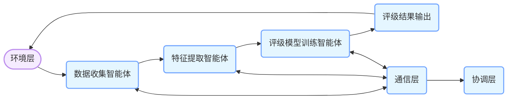

# 智能体协作实现全面的公司信用评级

> 关键词：智能体协作、公司信用评级、多智能体系统、信用评估算法、数据融合

> 摘要：本文聚焦于利用智能体协作实现全面的公司信用评级。首先介绍了公司信用评级的背景和重要性，以及智能体协作在该领域的应用潜力。接着详细阐述了智能体的核心概念、协作原理和架构，包括多智能体系统的组成和交互方式。通过Python代码讲解了核心算法原理和具体操作步骤，如数据收集、特征提取和评级模型训练。同时给出了相关的数学模型和公式，并结合实际案例进行说明。在项目实战部分，提供了开发环境搭建的步骤、源代码实现和代码解读。探讨了智能体协作在公司信用评级中的实际应用场景，推荐了学习资源、开发工具框架和相关论文著作。最后总结了未来发展趋势与挑战，并解答了常见问题，为读者深入了解和应用智能体协作进行公司信用评级提供了全面的指导。

## 1. 背景介绍 
### 1.1 目的和范围
公司信用评级是金融领域和商业活动中的重要环节，它为投资者、债权人、供应商等提供了关于公司信用状况的重要参考。传统的公司信用评级方法往往依赖于单一的数据源和有限的评估指标，难以全面、准确地反映公司的实际信用状况。随着信息技术的发展，智能体协作技术为实现全面的公司信用评级提供了新的途径。

本文的目的是探讨如何利用智能体协作技术实现全面的公司信用评级。具体范围包括智能体的核心概念和协作原理、核心算法原理和操作步骤、相关的数学模型和公式、项目实战案例以及实际应用场景等方面。

### 1.2 预期读者
本文的预期读者包括金融行业从业者，如信用分析师、投资经理、银行信贷人员等，他们可以通过本文了解智能体协作在公司信用评级中的应用，为实际工作提供新的思路和方法。同时，计算机科学领域的研究人员和开发者也可以从中获取关于智能体技术和信用评估算法的相关知识，为进一步的研究和开发提供参考。此外，对公司信用评级和人工智能技术感兴趣的学生和爱好者也可以阅读本文，了解该领域的前沿动态。

### 1.3 文档结构概述
本文将按照以下结构进行组织：
- 核心概念与联系：介绍智能体和公司信用评级的核心概念，以及它们之间的联系和协作原理。
- 核心算法原理 & 具体操作步骤：详细讲解利用智能体协作进行公司信用评级的核心算法原理，并给出具体的操作步骤和Python代码示例。
- 数学模型和公式 & 详细讲解 & 举例说明：给出相关的数学模型和公式，并结合实际案例进行详细讲解。
- 项目实战：代码实际案例和详细解释说明：通过一个实际的项目案例，介绍开发环境搭建、源代码实现和代码解读。
- 实际应用场景：探讨智能体协作在公司信用评级中的实际应用场景。
- 工具和资源推荐：推荐学习资源、开发工具框架和相关论文著作。
- 总结：未来发展趋势与挑战：总结智能体协作在公司信用评级中的发展趋势和面临的挑战。
- 附录：常见问题与解答：解答读者在阅读过程中可能遇到的常见问题。
- 扩展阅读 & 参考资料：提供相关的扩展阅读材料和参考资料。

### 1.4 术语表
#### 1.4.1 核心术语定义
- **智能体（Agent）**：是一个具有自主决策能力的实体，能够感知环境信息，并根据自身的目标和规则进行行动。在公司信用评级中，智能体可以是数据收集智能体、特征提取智能体、评级模型训练智能体等。
- **多智能体系统（Multi - Agent System, MAS）**：由多个智能体组成的系统，智能体之间通过交互和协作来完成共同的任务。在公司信用评级中，多智能体系统可以实现数据的收集、处理和分析，以及评级模型的训练和评估。
- **公司信用评级（Corporate Credit Rating）**：是对公司信用状况的评估和预测，通常用评级符号表示，如AAA、AA、A等。评级结果反映了公司偿还债务的能力和意愿。
- **数据融合（Data Fusion）**：将来自多个数据源的数据进行整合和处理，以获取更全面、准确的信息。在公司信用评级中，数据融合可以将财务数据、市场数据、舆情数据等进行融合，提高评级的准确性。

#### 1.4.2 相关概念解释
- **自主决策**：智能体能够根据自身的目标和规则，独立地做出决策，而不需要外部的干预。
- **交互和协作**：智能体之间通过通信和协调来实现信息的共享和任务的分配，以完成共同的目标。
- **特征提取**：从原始数据中提取出能够反映公司信用状况的特征，如财务比率、市场指标等。
- **评级模型**：用于根据特征数据对公司进行信用评级的数学模型，如逻辑回归模型、决策树模型、神经网络模型等。

#### 1.4.3 缩略词列表
- MAS：Multi - Agent System，多智能体系统
- PCA：Principal Component Analysis，主成分分析
- LR：Logistic Regression，逻辑回归
- DT：Decision Tree，决策树
- NN：Neural Network，神经网络

## 2. 核心概念与联系 

### 2.1 智能体的概念
智能体是一个具有自主决策能力的实体，它可以感知环境信息，并根据自身的目标和规则进行行动。智能体通常具有以下特点：
- **自主性**：能够独立地做出决策，不需要外部的干预。
- **反应性**：能够感知环境的变化，并及时做出反应。
- **社会性**：能够与其他智能体进行交互和协作，以完成共同的任务。

在公司信用评级中，智能体可以承担不同的任务，如数据收集、特征提取、评级模型训练等。例如，数据收集智能体可以从不同的数据源（如财务报表、市场数据平台、新闻媒体等）收集与公司信用相关的数据；特征提取智能体可以对收集到的数据进行处理，提取出能够反映公司信用状况的特征；评级模型训练智能体可以利用提取的特征数据对评级模型进行训练和评估。

### 2.2 多智能体系统的架构
多智能体系统由多个智能体组成，智能体之间通过通信和协调来实现信息的共享和任务的分配。一个典型的多智能体系统架构包括以下几个部分：
- **智能体层**：包含多个不同类型的智能体，如数据收集智能体、特征提取智能体、评级模型训练智能体等。每个智能体都有自己的功能和任务。
- **通信层**：负责智能体之间的信息传递和通信。智能体可以通过消息传递的方式进行通信，消息可以包含数据、任务请求、决策结果等信息。
- **协调层**：负责智能体之间的任务分配和协调。协调层可以根据任务的需求和智能体的能力，将任务分配给合适的智能体，并协调智能体之间的工作流程。
- **环境层**：是智能体所处的外部环境，包括数据源、评级结果的使用者等。智能体需要从环境中获取数据，并将评级结果反馈给环境。

以下是一个简单的多智能体系统架构的Mermaid流程图：


### 2.3 智能体协作与公司信用评级的联系
智能体协作在公司信用评级中具有重要的应用价值。通过智能体协作，可以实现以下几个方面的优势：
- **数据的全面性**：不同的智能体可以从多个数据源收集数据，如财务数据、市场数据、舆情数据等，从而实现数据的全面性。
- **处理的高效性**：智能体可以并行处理数据，提高数据处理的效率。例如，多个数据收集智能体可以同时从不同的数据源收集数据，多个特征提取智能体可以同时对不同类型的数据进行特征提取。
- **模型的准确性**：智能体协作可以实现数据的融合和特征的优化，从而提高评级模型的准确性。例如，通过数据融合智能体可以将不同类型的数据进行整合，通过特征选择智能体可以选择最具代表性的特征用于评级模型的训练。

## 3. 核心算法原理 & 具体操作步骤 

### 3.1 核心算法原理
利用智能体协作进行公司信用评级的核心算法主要包括数据收集算法、特征提取算法和评级模型训练算法。

#### 3.1.1 数据收集算法
数据收集算法的目的是从不同的数据源收集与公司信用相关的数据。常见的数据源包括财务报表、市场数据平台、新闻媒体等。数据收集智能体可以使用网络爬虫技术从网页上抓取数据，使用API接口从数据平台获取数据，或者从数据库中读取数据。

以下是一个简单的Python代码示例，使用`requests`库从网页上抓取公司财务数据：
```python
import requests
from bs4 import BeautifulSoup

def collect_financial_data(url):
    try:
        response = requests.get(url)
        if response.status_code == 200:
            soup = BeautifulSoup(response.text, 'html.parser')
            # 解析网页内容，提取财务数据
            financial_data = []
            # 这里需要根据具体的网页结构进行解析
            rows = soup.find_all('tr')
            for row in rows:
                cells = row.find_all('td')
                if len(cells) > 0:
                    data = [cell.text.strip() for cell in cells]
                    financial_data.append(data)
            return financial_data
        else:
            print(f"请求失败，状态码：{response.status_code}")
            return None
    except Exception as e:
        print(f"发生异常：{e}")
        return None

# 示例URL
url = 'https://example.com/financial_data'
financial_data = collect_financial_data(url)
if financial_data:
    print(financial_data)
```

#### 3.1.2 特征提取算法
特征提取算法的目的是从原始数据中提取出能够反映公司信用状况的特征。常见的特征包括财务比率、市场指标、舆情指标等。特征提取智能体可以使用统计分析方法、机器学习算法等进行特征提取。

以下是一个简单的Python代码示例，使用`pandas`库计算财务比率：
```python
import pandas as pd

def extract_financial_features(financial_data):
    df = pd.DataFrame(financial_data[1:], columns=financial_data[0])
    # 假设财务数据包含营业收入、净利润、总资产等列
    df['营业收入'] = pd.to_numeric(df['营业收入'], errors='coerce')
    df['净利润'] = pd.to_numeric(df['净利润'], errors='coerce')
    df['总资产'] = pd.to_numeric(df['总资产'], errors='coerce')
    # 计算毛利率
    df['毛利率'] = (df['营业收入'] - df['营业成本']) / df['营业收入']
    # 计算净利率
    df['净利率'] = df['净利润'] / df['营业收入']
    # 计算资产负债率
    df['资产负债率'] = df['总负债'] / df['总资产']
    return df[['毛利率', '净利率', '资产负债率']]

# 假设financial_data是前面收集到的财务数据
features = extract_financial_features(financial_data)
print(features)
```

#### 3.1.3 评级模型训练算法
评级模型训练算法的目的是利用提取的特征数据对评级模型进行训练和评估。常见的评级模型包括逻辑回归模型、决策树模型、神经网络模型等。评级模型训练智能体可以使用机器学习库（如`scikit - learn`、`tensorflow`等）进行模型的训练和评估。

以下是一个简单的Python代码示例，使用`scikit - learn`库训练逻辑回归模型：
```python
from sklearn.linear_model import LogisticRegression
from sklearn.model_selection import train_test_split
from sklearn.metrics import accuracy_score

def train_rating_model(features, labels):
    X_train, X_test, y_train, y_test = train_test_split(features, labels, test_size=0.2, random_state=42)
    model = LogisticRegression()
    model.fit(X_train, y_train)
    y_pred = model.predict(X_test)
    accuracy = accuracy_score(y_test, y_pred)
    print(f"模型准确率：{accuracy}")
    return model

# 假设features是前面提取的特征数据，labels是对应的信用评级标签
# labels可以是AAA、AA、A等，需要进行编码处理
from sklearn.preprocessing import LabelEncoder
label_encoder = LabelEncoder()
labels_encoded = label_encoder.fit_transform(labels)
model = train_rating_model(features, labels_encoded)
```

### 3.2 具体操作步骤
利用智能体协作进行公司信用评级的具体操作步骤如下：
1. **数据收集阶段**：
    - 多个数据收集智能体同时从不同的数据源收集与公司信用相关的数据。
    - 数据收集智能体将收集到的数据发送给数据融合智能体。
2. **数据融合阶段**：
    - 数据融合智能体将来自不同数据源的数据进行整合和清洗，去除重复数据和噪声数据。
    - 数据融合智能体将融合后的数据发送给特征提取智能体。
3. **特征提取阶段**：
    - 特征提取智能体对融合后的数据进行处理，提取出能够反映公司信用状况的特征。
    - 特征提取智能体将提取的特征数据发送给特征选择智能体。
4. **特征选择阶段**：
    - 特征选择智能体使用特征选择算法（如主成分分析、相关性分析等）选择最具代表性的特征。
    - 特征选择智能体将选择的特征数据发送给评级模型训练智能体。
5. **评级模型训练阶段**：
    - 评级模型训练智能体使用选择的特征数据对评级模型进行训练和评估。
    - 评级模型训练智能体将训练好的模型发送给评级结果输出智能体。
6. **评级结果输出阶段**：
    - 评级结果输出智能体使用训练好的模型对新的公司数据进行评级。
    - 评级结果输出智能体将评级结果反馈给环境，如投资者、债权人等。

## 4. 数学模型和公式 & 详细讲解 & 举例说明 

### 4.1 逻辑回归模型
逻辑回归模型是一种常用的分类模型，它可以用于公司信用评级。逻辑回归模型的基本公式如下：
$$P(y = 1|x) = \frac{1}{1 + e^{-z}}$$
其中，$P(y = 1|x)$ 表示在给定特征向量 $x$ 的情况下，公司信用评级为正（如AAA、AA等）的概率，$z$ 是线性组合：
$$z = w_0 + w_1x_1 + w_2x_2 + \cdots + w_nx_n$$
$w_0$ 是截距，$w_1, w_2, \cdots, w_n$ 是特征的权重，$x_1, x_2, \cdots, x_n$ 是特征向量的各个分量。

逻辑回归模型的训练目标是找到一组最优的权重 $w_0, w_1, \cdots, w_n$，使得模型的对数似然函数最大：
$$L(w) = \sum_{i = 1}^{m}[y_i\log(P(y_i = 1|x_i))+(1 - y_i)\log(1 - P(y_i = 1|x_i))]$$
其中，$m$ 是样本数量，$y_i$ 是第 $i$ 个样本的真实标签。

#### 举例说明
假设我们有一个简单的公司信用评级数据集，包含两个特征：毛利率和净利率，以及对应的信用评级标签（0表示低信用，1表示高信用）。我们可以使用逻辑回归模型对公司进行信用评级。

```python
import numpy as np
from sklearn.linear_model import LogisticRegression

# 特征数据
X = np.array([[0.2, 0.1], [0.3, 0.2], [0.1, 0.05], [0.4, 0.3]])
# 标签数据
y = np.array([1, 1, 0, 1])

model = LogisticRegression()
model.fit(X, y)

# 预测新的样本
new_sample = np.array([[0.35, 0.25]])
prediction = model.predict(new_sample)
print(f"预测结果：{prediction}")
```

### 4.2 主成分分析（PCA）
主成分分析是一种常用的特征选择和降维方法，它可以用于减少特征的维度，同时保留数据的主要信息。主成分分析的基本步骤如下：
1. **数据标准化**：将原始数据进行标准化处理，使得每个特征的均值为0，方差为1。
2. **计算协方差矩阵**：计算标准化后数据的协方差矩阵。
3. **计算特征值和特征向量**：对协方差矩阵进行特征值分解，得到特征值和特征向量。
4. **选择主成分**：根据特征值的大小选择前 $k$ 个主成分，$k$ 是需要保留的主成分的数量。
5. **数据投影**：将原始数据投影到选择的主成分上，得到降维后的数据。

主成分分析的数学公式如下：
- 标准化数据：
$$x_{ij}'=\frac{x_{ij}-\mu_j}{\sigma_j}$$
其中，$x_{ij}$ 是第 $i$ 个样本的第 $j$ 个特征，$\mu_j$ 是第 $j$ 个特征的均值，$\sigma_j$ 是第 $j$ 个特征的标准差。
- 协方差矩阵：
$$S=\frac{1}{m - 1}\sum_{i = 1}^{m}(x_i'-\bar{x}')(x_i'-\bar{x}')^T$$
其中，$m$ 是样本数量，$x_i'$ 是第 $i$ 个标准化后的样本，$\bar{x}'$ 是标准化后样本的均值向量。
- 特征值分解：
$$S = V\Lambda V^T$$
其中，$V$ 是特征向量矩阵，$\Lambda$ 是特征值矩阵。

#### 举例说明
假设我们有一个包含三个特征的数据集，我们可以使用主成分分析将其降维到两个特征。

```python
import numpy as np
from sklearn.decomposition import PCA

# 原始数据
X = np.array([[1, 2, 3], [4, 5, 6], [7, 8, 9], [10, 11, 12]])

# 创建PCA对象，指定降维后的维度为2
pca = PCA(n_components=2)
X_pca = pca.fit_transform(X)

print(f"降维后的数据：{X_pca}")
```

## 5. 项目实战：代码实际案例和详细解释说明 

### 5.1  开发环境搭建
为了实现智能体协作进行公司信用评级的项目，我们需要搭建以下开发环境：
- **操作系统**：可以选择Windows、Linux或macOS。
- **编程语言**：Python 3.x，Python是一种功能强大、易于学习的编程语言，拥有丰富的机器学习和数据处理库。
- **开发工具**：可以选择PyCharm、Jupyter Notebook等开发工具。
- **相关库**：需要安装`requests`、`beautifulsoup4`、`pandas`、`scikit - learn`等库。可以使用`pip`命令进行安装：
```bash
pip install requests beautifulsoup4 pandas scikit - learn
```

### 5.2  源代码详细实现和代码解读
以下是一个完整的项目代码示例，实现了智能体协作进行公司信用评级的基本功能：

```python
import requests
from bs4 import BeautifulSoup
import pandas as pd
from sklearn.linear_model import LogisticRegression
from sklearn.model_selection import train_test_split
from sklearn.metrics import accuracy_score
from sklearn.preprocessing import LabelEncoder

# 数据收集智能体
def collect_financial_data(url):
    try:
        response = requests.get(url)
        if response.status_code == 200:
            soup = BeautifulSoup(response.text, 'html.parser')
            financial_data = []
            rows = soup.find_all('tr')
            for row in rows:
                cells = row.find_all('td')
                if len(cells) > 0:
                    data = [cell.text.strip() for cell in cells]
                    financial_data.append(data)
            return financial_data
        else:
            print(f"请求失败，状态码：{response.status_code}")
            return None
    except Exception as e:
        print(f"发生异常：{e}")
        return None

# 特征提取智能体
def extract_financial_features(financial_data):
    df = pd.DataFrame(financial_data[1:], columns=financial_data[0])
    df['营业收入'] = pd.to_numeric(df['营业收入'], errors='coerce')
    df['净利润'] = pd.to_numeric(df['净利润'], errors='coerce')
    df['总资产'] = pd.to_numeric(df['总资产'], errors='coerce')
    df['毛利率'] = (df['营业收入'] - df['营业成本']) / df['营业收入']
    df['净利率'] = df['净利润'] / df['营业收入']
    df['资产负债率'] = df['总负债'] / df['总资产']
    return df[['毛利率', '净利率', '资产负债率']]

# 评级模型训练智能体
def train_rating_model(features, labels):
    X_train, X_test, y_train, y_test = train_test_split(features, labels, test_size=0.2, random_state=42)
    model = LogisticRegression()
    model.fit(X_train, y_train)
    y_pred = model.predict(X_test)
    accuracy = accuracy_score(y_test, y_pred)
    print(f"模型准确率：{accuracy}")
    return model

# 主函数
def main():
    # 示例URL
    url = 'https://example.com/financial_data'
    # 数据收集
    financial_data = collect_financial_data(url)
    if financial_data:
        # 特征提取
        features = extract_financial_features(financial_data)
        # 假设labels是对应的信用评级标签
        labels = ['AAA', 'AA', 'A', 'BBB']
        label_encoder = LabelEncoder()
        labels_encoded = label_encoder.fit_transform(labels)
        # 评级模型训练
        model = train_rating_model(features, labels_encoded)
        # 预测新的样本
        new_sample = features.iloc[0:1]
        prediction = model.predict(new_sample)
        prediction_label = label_encoder.inverse_transform(prediction)
        print(f"预测结果：{prediction_label}")

if __name__ == "__main__":
    main()
```

### 5.3  代码解读与分析
- **数据收集智能体**：`collect_financial_data`函数使用`requests`库从网页上抓取公司财务数据，并使用`BeautifulSoup`库进行网页解析。
- **特征提取智能体**：`extract_financial_features`函数使用`pandas`库对财务数据进行处理，计算毛利率、净利率和资产负债率等特征。
- **评级模型训练智能体**：`train_rating_model`函数使用`scikit - learn`库的`LogisticRegression`模型进行训练和评估，并返回训练好的模型。
- **主函数**：`main`函数调用数据收集、特征提取和评级模型训练函数，完成整个公司信用评级的流程。最后，使用训练好的模型对新的样本进行预测，并输出预测结果。

## 6. 实际应用场景 
智能体协作进行公司信用评级在以下实际应用场景中具有重要的价值：
- **金融机构**：银行、证券公司、保险公司等金融机构可以使用智能体协作技术进行公司信用评级，为信贷决策、投资决策等提供参考。例如，银行在发放贷款时，可以通过智能体协作获取公司的全面信用信息，评估公司的还款能力，降低信贷风险。
- **投资者**：个人投资者和机构投资者可以利用智能体协作提供的公司信用评级结果，进行投资决策。投资者可以根据评级结果选择信用状况良好的公司进行投资，提高投资回报率。
- **供应商**：供应商在与公司进行业务合作时，可以通过智能体协作了解公司的信用状况，决定是否提供赊销服务。如果公司的信用评级较高，供应商可以放心地提供赊销服务，促进业务合作。
- **监管机构**：政府监管机构可以使用智能体协作技术对公司的信用状况进行监管，及时发现潜在的风险。例如，监管机构可以通过智能体协作收集公司的财务数据、市场数据等，对公司的信用状况进行实时监测，防范金融风险。

## 7. 工具和资源推荐
### 7.1 学习资源推荐
#### 7.1.1 书籍推荐
- 《人工智能：一种现代的方法》：这是一本经典的人工智能教材，涵盖了智能体、多智能体系统等多个方面的内容，适合初学者和有一定基础的读者阅读。
- 《Python机器学习》：本书详细介绍了Python在机器学习中的应用，包括数据处理、特征提取、模型训练等方面的内容，对于学习利用Python实现公司信用评级非常有帮助。
- 《信用评级分析》：这本书专门介绍了公司信用评级的理论和方法，包括评级指标体系、评级模型等方面的内容，是金融从业者学习信用评级的重要参考书籍。

#### 7.1.2 在线课程
- Coursera上的“人工智能基础”课程：该课程由知名高校的教授授课，系统地介绍了人工智能的基本概念和方法，包括智能体和多智能体系统。
- edX上的“Python数据科学”课程：该课程重点介绍了Python在数据科学中的应用，包括数据处理、数据分析、机器学习等方面的内容，适合学习利用Python进行公司信用评级。
- 中国大学MOOC上的“信用风险管理”课程：该课程由国内高校的教授授课，详细介绍了信用风险管理的理论和方法，包括公司信用评级的相关内容。

#### 7.1.3 技术博客和网站
- 博客园：这是一个国内知名的技术博客平台，上面有很多关于人工智能、机器学习、数据科学等方面的技术文章，可以从中获取相关的知识和经验。
- Medium：这是一个国际知名的技术博客平台，上面有很多关于人工智能和金融科技的前沿文章，可以了解到最新的技术动态。
- Kaggle：这是一个数据科学竞赛平台，上面有很多关于信用评级的数据集和竞赛项目，可以通过参与竞赛来提高自己的实践能力。

### 7.2 开发工具框架推荐
#### 7.2.1 IDE和编辑器
- PyCharm：这是一款专门为Python开发设计的集成开发环境（IDE），具有代码编辑、调试、自动补全、版本控制等功能，非常适合Python项目的开发。
- Jupyter Notebook：这是一个交互式的开发环境，可以在浏览器中编写和运行Python代码，支持Markdown文本和可视化展示，非常适合数据探索和模型实验。
- Visual Studio Code：这是一款轻量级的代码编辑器，支持多种编程语言，具有丰富的插件生态系统，可以通过安装Python插件来进行Python开发。

#### 7.2.2 调试和性能分析工具
- pdb：这是Python自带的调试工具，可以在代码中设置断点，逐行调试代码，帮助开发者发现和解决问题。
- cProfile：这是Python的性能分析工具，可以统计代码的执行时间和函数调用次数，帮助开发者优化代码性能。
- Py-Spy：这是一个第三方的性能分析工具，可以实时监控Python程序的性能，找出性能瓶颈。

#### 7.2.3 相关框架和库
- scikit - learn：这是一个常用的机器学习库，提供了丰富的机器学习算法和工具，包括分类、回归、聚类等算法，以及数据预处理、模型评估等工具，非常适合用于公司信用评级模型的训练和评估。
- tensorflow：这是一个开源的深度学习框架，提供了强大的神经网络模型和工具，适用于处理复杂的公司信用评级问题。
- pandas：这是一个数据处理和分析库，提供了高效的数据结构和数据操作方法，非常适合用于公司信用评级数据的处理和分析。

### 7.3 相关论文著作推荐
#### 7.3.1 经典论文
- Altman, E. I. (1968). Financial ratios, discriminant analysis and the prediction of corporate bankruptcy. Journal of finance, 23(4), 589 - 609. 这篇论文提出了著名的Z - score模型，用于预测公司的破产风险，是公司信用评级领域的经典论文。
- Ohlson, J. A. (1980). Financial ratios and the probabilistic prediction of bankruptcy. Journal of accounting research, 18(1), 109 - 131. 这篇论文提出了O - score模型，也是一种常用的公司信用评级模型。

#### 7.3.2 最新研究成果
- 近年来，随着人工智能技术的发展，越来越多的研究将深度学习、多智能体系统等技术应用于公司信用评级领域。可以通过IEEE Xplore、ACM Digital Library等学术数据库搜索相关的最新研究成果。

#### 7.3.3 应用案例分析
- Moody's、Standard & Poor's等国际知名的信用评级机构会发布一些公司信用评级的应用案例分析报告，可以从中了解到实际应用中的经验和方法。

## 8. 总结：未来发展趋势与挑战
### 8.1 未来发展趋势
- **智能化和自动化**：未来，智能体协作技术将更加智能化和自动化。智能体可以自动感知环境变化，自主调整策略和行为，实现更加高效的协作。例如，智能体可以自动识别新的数据源，自动调整数据收集和处理策略，提高公司信用评级的准确性和及时性。
- **多源数据融合**：随着信息技术的发展，公司信用评级将越来越依赖于多源数据的融合。除了传统的财务数据和市场数据外，还将融合社交媒体数据、物联网数据等非结构化数据，以获取更全面、准确的公司信用信息。
- **深度学习和强化学习的应用**：深度学习和强化学习等人工智能技术将在公司信用评级中得到更广泛的应用。深度学习可以处理复杂的非线性关系，提高评级模型的准确性；强化学习可以让智能体在动态环境中学习最优的决策策略，提高智能体协作的效率。
- **跨领域融合**：公司信用评级将与金融科技、区块链、大数据等领域进行更深入的融合。例如，区块链技术可以保证数据的安全性和不可篡改，大数据技术可以提供更强大的数据处理和分析能力，金融科技可以创新信用评级的业务模式。

### 8.2 挑战
- **数据质量和隐私问题**：多源数据的融合带来了数据质量和隐私问题。不同数据源的数据格式、质量和准确性可能存在差异，需要进行有效的数据清洗和融合。同时，数据隐私保护也是一个重要的问题，需要遵守相关的法律法规，确保数据的安全和隐私。
- **智能体协作的复杂性**：智能体协作涉及到多个智能体之间的交互和协调，其复杂性较高。如何设计高效的智能体协作机制，解决智能体之间的冲突和竞争，是一个需要解决的问题。
- **模型可解释性**：深度学习等复杂模型在提高评级准确性的同时，也带来了模型可解释性的问题。金融领域对于模型的可解释性要求较高，需要开发可解释的人工智能模型，以便用户理解模型的决策过程和结果。
- **法律法规和监管**：随着智能体协作技术在公司信用评级中的应用，相关的法律法规和监管也需要进一步完善。需要制定相应的标准和规范，确保智能体协作技术的合法、合规应用。

## 9. 附录：常见问题与解答
### 9.1 智能体协作与传统信用评级方法有什么区别？
智能体协作与传统信用评级方法的主要区别在于：
- **数据来源**：传统信用评级方法主要依赖于单一的数据源，如财务报表；而智能体协作可以从多个数据源收集数据，包括财务数据、市场数据、舆情数据等，实现数据的全面性。
- **处理方式**：传统信用评级方法通常是人工进行数据处理和分析，效率较低；而智能体协作可以实现数据的自动化处理和分析，提高处理效率。
- **模型准确性**：智能体协作可以通过数据融合和特征优化，提高评级模型的准确性；而传统信用评级方法可能受到数据和模型的限制，准确性相对较低。

### 9.2 如何选择合适的评级模型？
选择合适的评级模型需要考虑以下几个因素：
- **数据特点**：不同的评级模型适用于不同的数据特点。例如，逻辑回归模型适用于线性可分的数据，而神经网络模型适用于处理复杂的非线性关系。
- **模型复杂度**：模型复杂度越高，通常可以处理更复杂的问题，但也容易出现过拟合的问题。需要根据数据量和问题的复杂程度选择合适的模型复杂度。
- **可解释性**：在金融领域，模型的可解释性非常重要。如果需要解释模型的决策过程和结果，可以选择可解释性较强的模型，如逻辑回归模型、决策树模型等。

### 9.3 智能体协作在公司信用评级中的应用有哪些限制？
智能体协作在公司信用评级中的应用存在以下限制：
- **数据质量**：智能体协作依赖于高质量的数据，如果数据存在噪声、缺失值等问题，会影响评级结果的准确性。
- **技术难度**：智能体协作涉及到多智能体系统的设计和开发，技术难度较高，需要具备一定的人工智能和编程知识。
- **成本问题**：实现智能体协作需要投入一定的人力、物力和财力，包括数据收集、处理和存储的成本，以及智能体开发和维护的成本。

## 10. 扩展阅读 & 参考资料
### 10.1 扩展阅读
- 《人工智能与金融科技》：本书介绍了人工智能在金融科技领域的应用，包括信用评级、风险评估等方面的内容，可以进一步了解智能体协作在金融领域的应用。
- 《多智能体系统原理与应用》：这本书系统地介绍了多智能体系统的原理和应用，对于深入理解智能体协作技术非常有帮助。

### 10.2 参考资料
- 相关的学术论文和研究报告，可以通过IEEE Xplore、ACM Digital Library、CNKI等学术数据库进行搜索。
- 国际知名信用评级机构（如Moody's、Standard & Poor's）的官方网站，可以获取最新的信用评级标准和方法。

作者：AI天才研究院/AI Genius Institute & 禅与计算机程序设计艺术 /Zen And The Art of Computer Programming