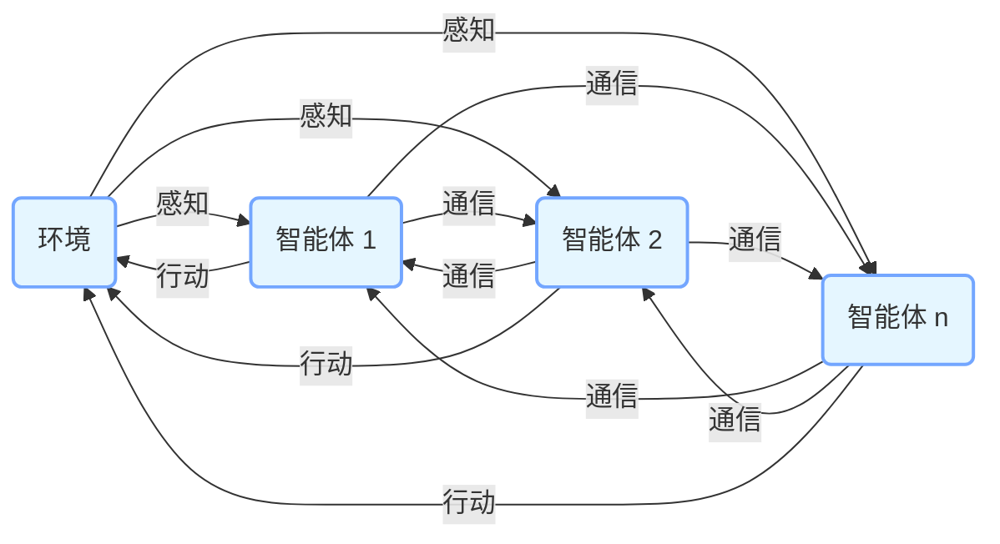

# 智能体协作实现全面的竞争优势分析

> 关键词：智能体协作、竞争优势、多智能体系统、协作机制、博弈论

> 摘要：本文围绕智能体协作实现全面的竞争优势展开深入分析。首先介绍了智能体协作的背景知识，包括目的、预期读者、文档结构和相关术语。接着阐述了智能体及智能体协作的核心概念与联系，给出了原理和架构的文本示意图及 Mermaid 流程图。详细讲解了核心算法原理，并用 Python 代码进行示例。通过数学模型和公式进一步剖析智能体协作的本质，并举例说明。在项目实战部分，给出了开发环境搭建、源代码实现和解读。探讨了智能体协作的实际应用场景，推荐了学习资源、开发工具框架和相关论文著作。最后总结了未来发展趋势与挑战，提供了常见问题解答和扩展阅读参考资料，旨在为读者全面理解智能体协作及获取竞争优势提供深入的技术和理论支持。

## 1. 背景介绍 
### 1.1 目的和范围
在当今数字化和智能化的时代，智能体技术正逐渐成为推动各行业发展的关键力量。智能体是一种能够感知环境、自主决策并采取行动的实体，多个智能体之间的协作可以实现更复杂、高效的任务执行。本文章的目的在于深入分析智能体协作如何为组织或系统带来全面的竞争优势。我们将探讨智能体协作的核心概念、算法原理、数学模型，通过项目实战展示其应用，并分析实际应用场景。范围涵盖了智能体协作的理论基础、技术实现以及实际应用等多个方面。

### 1.2 预期读者
本文预期读者包括计算机科学、人工智能领域的研究人员和学生，他们希望深入了解智能体协作的技术原理和最新进展；软件开发者和架构师，旨在将智能体协作技术应用到实际项目中；企业管理者和决策者，关注如何利用智能体协作提升企业的竞争力和效率。

### 1.3 文档结构概述
本文共分为十个部分。第一部分为背景介绍，阐述了文章的目的、预期读者、文档结构和相关术语。第二部分介绍智能体及智能体协作的核心概念与联系，给出原理和架构的示意图及流程图。第三部分详细讲解核心算法原理，并通过 Python 代码示例进行说明。第四部分运用数学模型和公式深入剖析智能体协作的本质，并举例说明。第五部分是项目实战，包括开发环境搭建、源代码实现和解读。第六部分探讨智能体协作的实际应用场景。第七部分推荐学习资源、开发工具框架和相关论文著作。第八部分总结未来发展趋势与挑战。第九部分为附录，提供常见问题解答。第十部分列出扩展阅读和参考资料。

### 1.4 术语表
#### 1.4.1 核心术语定义
- **智能体（Agent）**：是一种具有自主性、反应性、社会性和主动性的实体，能够感知环境并根据内部状态和目标做出决策和行动。
- **智能体协作（Agent Collaboration）**：指多个智能体为了实现共同或各自的目标，通过信息交互和协调行动，相互配合完成任务的过程。
- **多智能体系统（Multi - Agent System，MAS）**：由多个智能体组成的系统，这些智能体之间可以进行通信、协作和竞争。
- **竞争优势（Competitive Advantage）**：指组织或系统在市场竞争中相对于竞争对手所具有的优势，表现为更高的效率、更好的质量、更低的成本等。

#### 1.4.2 相关概念解释
- **自主性**：智能体能够在没有外部干预的情况下自主地感知环境、决策和行动。
- **反应性**：智能体能够对环境的变化及时做出反应。
- **社会性**：智能体能够与其他智能体进行通信和协作。
- **主动性**：智能体能够主动地采取行动以实现自己的目标。

#### 1.4.3 缩略词列表
- **MAS**：Multi - Agent System，多智能体系统
- **AI**：Artificial Intelligence，人工智能

## 2. 核心概念与联系 
### 核心概念原理
智能体协作的核心在于多个智能体之间的信息交互和协调行动。每个智能体都有自己的感知模块、决策模块和行动模块。感知模块用于感知环境信息，决策模块根据感知到的信息和自身的目标进行决策，行动模块则根据决策结果采取相应的行动。

在多智能体系统中，智能体之间通过通信机制进行信息共享。例如，一个智能体可以将自己感知到的环境信息发送给其他智能体，其他智能体可以根据这些信息调整自己的决策和行动。同时，智能体之间还需要进行协调，避免出现冲突和重复劳动。

### 架构的文本示意图
```plaintext
多个智能体组成多智能体系统（MAS）
|
|-- 智能体 1
|   |-- 感知模块（获取环境信息）
|   |-- 决策模块（根据信息和目标决策）
|   |-- 行动模块（执行决策行动）
|   |-- 通信模块（与其他智能体通信）
|
|-- 智能体 2
|   |-- 感知模块
|   |-- 决策模块
|   |-- 行动模块
|   |-- 通信模块
|
|--...
|
|-- 智能体 n
    |-- 感知模块
    |-- 决策模块
    |-- 行动模块
    |-- 通信模块
```

### Mermaid 流程图


这个流程图展示了多个智能体与环境之间的交互关系。智能体从环境中感知信息，然后通过通信模块与其他智能体进行信息共享，最后根据决策结果对环境采取行动。

## 3. 核心算法原理 & 具体操作步骤 
### 核心算法原理
智能体协作中常用的算法之一是基于博弈论的协作算法。博弈论是研究多个参与者在竞争或合作环境中如何做出最优决策的数学理论。在智能体协作中，每个智能体可以看作是一个参与者，它们的目标是通过协作实现自身利益的最大化。

以经典的囚徒困境博弈为例，假设有两个智能体 A 和 B，它们可以选择合作（C）或背叛（D）。不同的选择组合会导致不同的收益。以下是收益矩阵：

|  | A 合作（C） | A 背叛（D） |
| --- | --- | --- |
| B 合作（C） | (3, 3) | (0, 5) |
| B 背叛（D） | (5, 0) | (1, 1) |

在这个矩阵中，每个元素的第一个值是智能体 A 的收益，第二个值是智能体 B 的收益。例如，当 A 和 B 都选择合作时，它们的收益都是 3；当 A 背叛而 B 合作时，A 的收益是 5，B 的收益是 0。

### Python 代码示例
```python
import random

# 定义收益矩阵
PAYOFF_MATRIX = {
    ('C', 'C'): (3, 3),
    ('C', 'D'): (0, 5),
    ('D', 'C'): (5, 0),
    ('D', 'D'): (1, 1)
}

class Agent:
    def __init__(self, name):
        self.name = name
        self.strategy = None

    def choose_strategy(self):
        # 随机选择策略
        self.strategy = random.choice(['C', 'D'])
        return self.strategy

    def get_payoff(self, other_strategy):
        return PAYOFF_MATRIX[(self.strategy, other_strategy)][0]

# 创建两个智能体
agent_a = Agent('A')
agent_b = Agent('B')

# 智能体选择策略
strategy_a = agent_a.choose_strategy()
strategy_b = agent_b.choose_strategy()

# 计算收益
payoff_a = agent_a.get_payoff(strategy_b)
payoff_b = agent_b.get_payoff(strategy_a)

print(f"智能体 {agent_a.name} 选择策略: {strategy_a}, 收益: {payoff_a}")
print(f"智能体 {agent_b.name} 选择策略: {strategy_b}, 收益: {payoff_b}")
```

### 具体操作步骤
1. **定义收益矩阵**：根据具体的协作场景，定义不同策略组合下的收益矩阵。
2. **创建智能体类**：每个智能体具有选择策略和获取收益的方法。
3. **智能体选择策略**：智能体根据自身的算法（如随机选择）选择策略。
4. **计算收益**：根据两个智能体的策略组合，从收益矩阵中获取相应的收益。

## 4. 数学模型和公式 & 详细讲解 & 举例说明 
### 数学模型
在智能体协作中，我们可以使用效用函数来描述智能体的收益。设 $S_i$ 表示智能体 $i$ 的策略集合，$s_i \in S_i$ 表示智能体 $i$ 选择的具体策略。$u_i(s_1, s_2, \cdots, s_n)$ 表示智能体 $i$ 在所有智能体选择策略 $(s_1, s_2, \cdots, s_n)$ 时的效用。

对于两个智能体的情况，如上述囚徒困境博弈，设智能体 A 的策略为 $s_A$，智能体 B 的策略为 $s_B$，则智能体 A 的效用函数可以表示为：

$$u_A(s_A, s_B) = \begin{cases} 
3, & s_A = C, s_B = C \\
0, & s_A = C, s_B = D \\
5, & s_A = D, s_B = C \\
1, & s_A = D, s_B = D 
\end{cases}$$

智能体 B 的效用函数 $u_B(s_A, s_B)$ 同理。

### 详细讲解
效用函数是智能体决策的基础，智能体的目标是选择策略使得自己的效用最大化。在多智能体系统中，每个智能体的决策不仅取决于自身的目标，还受到其他智能体策略的影响。

例如，在囚徒困境博弈中，如果智能体 A 只考虑自身利益，它可能会选择背叛策略（D），因为无论智能体 B 选择什么策略，选择背叛都能获得相对较高的收益。但是，如果两个智能体能够协作，都选择合作策略（C），它们的总收益会更高。

### 举例说明
假设我们有三个智能体 A、B、C，它们的策略集合都是 $\{C, D\}$。收益矩阵如下：

|  | (C, C) | (C, D) | (D, C) | (D, D) |
| --- | --- | --- | --- | --- |
| (C, C) | (4, 4, 4) | (1, 6, 1) | (6, 1, 1) | (2, 2, 2) |
| (C, D) | (1, 1, 6) | (2, 2, 2) | (3, 3, 2) | (1, 3, 3) |
| (D, C) | (1, 6, 1) | (3, 3, 2) | (2, 2, 2) | (1, 3, 3) |
| (D, D) | (2, 2, 2) | (1, 3, 3) | (1, 3, 3) | (1, 1, 1) |

如果智能体 A 选择策略 $s_A = C$，智能体 B 选择策略 $s_B = D$，智能体 C 选择策略 $s_C = C$，则根据收益矩阵，智能体 A 的效用 $u_A(s_A, s_B, s_C) = 1$，智能体 B 的效用 $u_B(s_A, s_B, s_C) = 6$，智能体 C 的效用 $u_C(s_A, s_B, s_C) = 1$。

## 5. 项目实战：代码实际案例和详细解释说明 
### 5.1  开发环境搭建
- **操作系统**：推荐使用 Linux 系统，如 Ubuntu 18.04 或更高版本，也可以使用 Windows 10 或 macOS。
- **Python 版本**：使用 Python 3.7 或更高版本。可以从 Python 官方网站（https://www.python.org/downloads/）下载并安装。
- **开发工具**：推荐使用 PyCharm 作为集成开发环境（IDE），可以从 JetBrains 官方网站（https://www.jetbrains.com/pycharm/download/）下载社区版。

### 5.2  源代码详细实现和代码解读
以下是一个更复杂的智能体协作项目示例，模拟多个智能体在一个网格环境中协作完成任务。

```python
import random

# 定义网格环境大小
GRID_SIZE = 10

class Agent:
    def __init__(self, id, x, y):
        self.id = id
        self.x = x
        self.y = y
        self.target_x = random.randint(0, GRID_SIZE - 1)
        self.target_y = random.randint(0, GRID_SIZE - 1)

    def move(self):
        if self.x < self.target_x:
            self.x += 1
        elif self.x > self.target_x:
            self.x -= 1

        if self.y < self.target_y:
            self.y += 1
        elif self.y > self.target_y:
            self.y -= 1

    def is_at_target(self):
        return self.x == self.target_x and self.y == self.target_y

    def communicate(self, other_agents):
        # 简单的通信机制：交换目标信息
        for agent in other_agents:
            if agent.id!= self.id:
                if self.is_at_target():
                    agent.target_x = self.x
                    agent.target_y = self.y

class Environment:
    def __init__(self, num_agents):
        self.agents = []
        for i in range(num_agents):
            x = random.randint(0, GRID_SIZE - 1)
            y = random.randint(0, GRID_SIZE - 1)
            agent = Agent(i, x, y)
            self.agents.append(agent)

    def step(self):
        for agent in self.agents:
            agent.move()
            agent.communicate(self.agents)

    def all_at_target(self):
        for agent in self.agents:
            if not agent.is_at_target():
                return False
        return True

# 创建环境和智能体
env = Environment(num_agents=5)

# 模拟多步
step_count = 0
while not env.all_at_target():
    env.step()
    step_count += 1

print(f"所有智能体到达目标共花费 {step_count} 步。")
```

### 代码解读与分析
- **Agent 类**：
  - `__init__` 方法：初始化智能体的 ID、当前位置和目标位置。
  - `move` 方法：根据当前位置和目标位置，智能体向目标移动一步。
  - `is_at_target` 方法：判断智能体是否到达目标位置。
  - `communicate` 方法：智能体与其他智能体进行通信，当自己到达目标位置时，将目标位置信息传递给其他智能体。

- **Environment 类**：
  - `__init__` 方法：创建指定数量的智能体，并初始化它们的位置。
  - `step` 方法：每个时间步，所有智能体移动并进行通信。
  - `all_at_target` 方法：判断所有智能体是否都到达了目标位置。

通过这个项目，我们可以看到多个智能体如何通过移动和通信协作完成任务。

## 6. 实际应用场景 
### 物流配送
在物流配送领域，多个智能体（如无人机、自动驾驶车辆等）可以协作完成货物的配送任务。每个智能体负责不同的区域或任务，通过通信和协调，可以提高配送效率，降低成本。例如，无人机可以负责快速配送一些小型货物，自动驾驶车辆可以负责运输大型货物。它们可以根据实时交通信息和货物需求，动态调整配送路线和任务分配。

### 智能家居
在智能家居系统中，多个智能体（如智能家电、传感器等）可以协作实现家居的自动化控制。例如，温度传感器可以感知室内温度，智能空调可以根据温度信息自动调节温度。同时，智能门锁、摄像头等设备可以与手机等终端进行通信，实现远程控制和安全监控。

### 金融交易
在金融交易领域，多个智能体（如交易算法、风险评估模型等）可以协作进行交易决策。交易算法可以根据市场行情和历史数据进行分析，风险评估模型可以评估交易的风险。它们通过信息共享和协调，可以实现更优化的交易策略，提高交易收益。

### 工业生产
在工业生产中，多个智能体（如机器人、生产线控制系统等）可以协作完成生产任务。机器人可以负责物料搬运、加工等工作，生产线控制系统可以根据订单需求和生产进度进行任务调度。通过智能体协作，可以提高生产效率，降低生产成本，提高产品质量。

## 7. 工具和资源推荐
### 7.1 学习资源推荐
#### 7.1.1 书籍推荐
- 《多智能体系统：原理与编程》：全面介绍了多智能体系统的基本原理、算法和编程实现，适合初学者和有一定基础的读者。
- 《博弈论与经济模型》：详细讲解了博弈论的基本概念和应用，对于理解智能体协作中的决策机制有很大帮助。
- 《人工智能：一种现代的方法》：经典的人工智能教材，涵盖了智能体、机器学习、搜索算法等多个方面的内容。

#### 7.1.2 在线课程
- Coursera 上的“Artificial Intelligence for Robotics”：介绍了机器人领域中的人工智能技术，包括智能体设计和协作。
- edX 上的“Introduction to Multi - Agent Systems”：专门讲解多智能体系统的课程，由知名教授授课。

#### 7.1.3 技术博客和网站
- Medium 上的人工智能相关博客：有很多关于智能体协作的最新研究成果和实践经验分享。
- arXiv.org：可以找到大量关于智能体协作的学术论文。

### 7.2 开发工具框架推荐
#### 7.2.1 IDE和编辑器
- PyCharm：功能强大的 Python 集成开发环境，支持代码调试、自动补全、版本控制等功能。
- Visual Studio Code：轻量级的代码编辑器，具有丰富的插件生态系统，适合快速开发和调试。

#### 7.2.2 调试和性能分析工具
- PDB：Python 自带的调试器，可以帮助开发者定位代码中的问题。
- cProfile：Python 的性能分析工具，可以分析代码的运行时间和内存使用情况。

#### 7.2.3 相关框架和库
- Mesa：一个用于构建基于智能体的模型的 Python 框架，提供了丰富的工具和类库。
- PyMAS：一个多智能体系统开发框架，支持智能体的创建、通信和协作。

### 7.3 相关论文著作推荐
#### 7.3.1 经典论文
- “Reinforcement Learning in Multi - Agent Environments: Independent vs. Cooperative Agents”：研究了多智能体环境中强化学习的方法，比较了独立智能体和协作智能体的性能。
- “Distributed Constraint Optimization Problems: Algorithms and Applications”：介绍了分布式约束优化问题的算法和应用，对于智能体协作中的任务分配和协调有重要意义。

#### 7.3.2 最新研究成果
- 关注顶级人工智能会议（如 AAAI、IJCAI）上的相关论文，了解智能体协作领域的最新研究进展。
- 阅读知名学术期刊（如 Artificial Intelligence、Journal of Artificial Intelligence Research）上的论文。

#### 7.3.3 应用案例分析
- 研究一些实际应用案例的论文，如智能物流、智能家居等领域的智能体协作应用，了解如何将理论知识应用到实际项目中。

## 8. 总结：未来发展趋势与挑战
### 未来发展趋势
- **与其他技术的融合**：智能体协作将与物联网、大数据、云计算等技术深度融合，实现更广泛、更复杂的应用。例如，在智慧城市建设中，智能体可以与物联网设备相结合，实现城市交通、能源等方面的智能管理。
- **强化学习和深度学习的应用**：强化学习和深度学习技术将进一步提升智能体的决策能力和学习能力。智能体可以通过强化学习不断优化自己的策略，通过深度学习更好地理解环境信息。
- **多领域应用拓展**：智能体协作将在医疗、教育、农业等更多领域得到应用。例如，在医疗领域，智能体可以协助医生进行诊断和治疗方案制定。

### 挑战
- **通信和协调问题**：随着智能体数量的增加和应用场景的复杂化，智能体之间的通信和协调将变得更加困难。如何设计高效的通信协议和协调机制是一个重要的挑战。
- **安全性和可靠性**：智能体协作系统的安全性和可靠性至关重要。例如，在金融交易和工业控制等领域，智能体的错误决策可能会导致严重的后果。如何保证智能体系统的安全性和可靠性是一个亟待解决的问题。
- **伦理和法律问题**：智能体协作的发展也带来了一系列伦理和法律问题。例如，当智能体做出决策导致损害时，责任如何界定；智能体的行为是否符合伦理道德等。

## 9. 附录：常见问题与解答
### 问题 1：智能体协作与传统的分布式系统有什么区别？
解答：智能体协作强调智能体的自主性、社会性和主动性。智能体能够自主感知环境、决策和行动，并且能够与其他智能体进行通信和协作。而传统的分布式系统主要关注任务的分布和资源的共享，各个节点的自主性和智能性相对较低。

### 问题 2：如何选择合适的智能体协作算法？
解答：选择合适的智能体协作算法需要考虑多个因素，如应用场景、智能体数量、任务复杂度等。如果是竞争环境，可以考虑使用博弈论相关的算法；如果是合作环境，可以使用基于协商和协调的算法。同时，还可以根据智能体的学习能力和环境的动态性选择强化学习等算法。

### 问题 3：智能体协作系统的可扩展性如何保证？
解答：保证智能体协作系统的可扩展性可以从多个方面入手。首先，设计高效的通信协议，减少通信开销。其次，采用分层架构和模块化设计，使得系统可以方便地添加或删除智能体。此外，还可以使用分布式计算和云计算技术，提高系统的处理能力。

## 10. 扩展阅读 & 参考资料
### 扩展阅读
- 《智能体系统的软件工程》：深入探讨了智能体系统的设计、开发和管理方法。
- 《复杂系统中的智能体建模》：介绍了如何使用智能体建模来研究复杂系统的行为。

### 参考资料
- Shoham, Y., & Leyton - Brown, K. (2009). Multiagent Systems: Algorithmic, Game - Theoretic, and Logical Foundations. Cambridge University Press.
- Russell, S. J., & Norvig, P. (2016). Artificial Intelligence: A Modern Approach (3rd Edition). Pearson.

作者：AI天才研究院/AI Genius Institute & 禅与计算机程序设计艺术 /Zen And The Art of Computer Programming