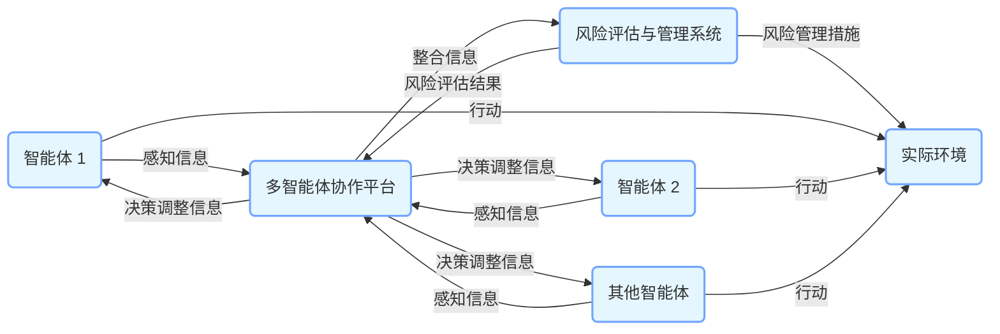

# 智能体协作实现全面的风险评估与管理

> 关键词：智能体协作、风险评估、风险分析、风险管理、多智能体系统

> 摘要：本文围绕智能体协作实现全面的风险评估与管理展开深入探讨。首先介绍了相关背景知识，包括目的、预期读者等内容。接着阐述了核心概念及联系，通过文本示意图和 Mermaid 流程图直观展示。详细讲解了核心算法原理与具体操作步骤，结合 Python 代码进行说明。给出了数学模型和公式，并通过举例加深理解。通过项目实战展示代码的实际应用与详细解读。分析了智能体协作在风险评估与管理中的实际应用场景。推荐了学习资源、开发工具框架以及相关论文著作。最后总结了未来发展趋势与挑战，并对常见问题进行解答，提供了扩展阅读与参考资料，旨在为相关领域的研究者和从业者提供全面的技术指导。

## 1. 背景介绍 
### 1.1 目的和范围
随着科技的飞速发展和社会经济环境的日益复杂，风险评估与管理变得愈发重要。传统的风险评估与管理方法往往难以应对复杂多变的情况，存在信息获取不全面、分析效率低下等问题。智能体协作技术的出现为解决这些问题提供了新的思路和方法。

本文的目的在于探讨如何利用智能体协作实现全面的风险评估与管理。具体范围包括智能体的基本概念、协作机制，风险评估与管理的流程和方法，以及如何将智能体协作应用于实际的风险评估与管理场景中。通过本文的研究，希望能够为相关领域的研究者和从业者提供理论支持和实践指导。

### 1.2 预期读者
本文的预期读者主要包括以下几类人群：
- 计算机科学领域的研究者和学生，对智能体技术、人工智能算法等方面感兴趣，希望了解智能体协作在风险评估与管理中的应用。
- 风险管理领域的从业者，如金融分析师、安全专家等，希望借助智能体协作技术提升风险评估与管理的效率和准确性。
- 企业管理人员，关注企业面临的各种风险，希望通过引入智能体协作技术优化企业的风险管理策略。

### 1.3 文档结构概述
本文将按照以下结构进行组织：
- 核心概念与联系：介绍智能体、风险评估与管理的核心概念，以及它们之间的联系，并通过文本示意图和 Mermaid 流程图进行直观展示。
- 核心算法原理 & 具体操作步骤：详细讲解智能体协作中涉及的核心算法原理，并给出具体的操作步骤，同时结合 Python 代码进行说明。
- 数学模型和公式 & 详细讲解 & 举例说明：给出风险评估与管理中的数学模型和公式，并进行详细讲解，通过具体例子加深理解。
- 项目实战：代码实际案例和详细解释说明：通过一个实际的项目案例，展示如何使用智能体协作实现风险评估与管理，包括开发环境搭建、源代码实现和代码解读。
- 实际应用场景：分析智能体协作在不同领域的实际应用场景。
- 工具和资源推荐：推荐相关的学习资源、开发工具框架和论文著作。
- 总结：未来发展趋势与挑战：总结智能体协作在风险评估与管理中的发展趋势和面临的挑战。
- 附录：常见问题与解答：解答读者在阅读过程中可能遇到的常见问题。
- 扩展阅读 & 参考资料：提供相关的扩展阅读材料和参考资料。

### 1.4 术语表
#### 1.4.1 核心术语定义
- **智能体（Agent）**：是一种能够感知环境、自主决策并采取行动以实现特定目标的实体。智能体可以是软件程序、机器人等。
- **多智能体系统（Multi - Agent System, MAS）**：由多个智能体组成的系统，这些智能体之间通过协作、竞争等方式相互作用，共同完成一个或多个任务。
- **风险评估（Risk Assessment）**：对可能影响目标实现的各种风险因素进行识别、分析和评价的过程。
- **风险管理（Risk Management）**：在风险评估的基础上，采取相应的措施来降低、转移或接受风险，以实现对风险的有效控制。

#### 1.4.2 相关概念解释
- **智能体协作**：多个智能体为了实现共同的目标，通过信息交流、协调行动等方式进行合作的过程。
- **风险因素**：可能导致风险发生的各种原因或条件，如市场波动、自然灾害、人为失误等。
- **风险等级**：根据风险发生的可能性和影响程度对风险进行的分类，通常分为高、中、低三个等级。

#### 1.4.3 缩略词列表
- MAS：Multi - Agent System（多智能体系统）
- AI：Artificial Intelligence（人工智能）

## 2. 核心概念与联系 
### 核心概念原理
#### 智能体原理
智能体是具有自主性、反应性、社会性和主动性的实体。自主性意味着智能体能够独立地感知环境并做出决策；反应性表示智能体能够对环境的变化做出及时的反应；社会性指智能体可以与其他智能体进行交互和协作；主动性则体现为智能体能够主动地采取行动以实现自己的目标。

智能体通常由感知模块、决策模块和执行模块组成。感知模块用于收集环境信息，决策模块根据感知到的信息进行分析和决策，执行模块则负责执行决策结果。

#### 风险评估与管理原理
风险评估的过程主要包括风险识别、风险分析和风险评价。风险识别是找出可能存在的风险因素；风险分析是对风险因素的发生可能性和影响程度进行评估；风险评价是根据风险分析的结果，确定风险的等级和优先级。

风险管理则是在风险评估的基础上，采取相应的措施来应对风险。常见的风险管理策略包括风险规避、风险降低、风险转移和风险接受。

### 架构的文本示意图
```plaintext
多智能体系统
├── 智能体 1
│   ├── 感知模块
│   ├── 决策模块
│   └── 执行模块
├── 智能体 2
│   ├── 感知模块
│   ├── 决策模块
│   └── 执行模块
└──...

风险评估与管理系统
├── 风险识别子系统
├── 风险分析子系统
├── 风险评价子系统
└── 风险管理子系统

智能体协作与风险评估管理联系
多智能体系统通过协作将感知信息传递给风险评估与管理系统，风险评估与管理系统的结果反馈给智能体用于调整决策
```

### Mermaid 流程图


## 3. 核心算法原理 & 具体操作步骤 
### 核心算法原理
#### 智能体协作算法 - 合同网协议
合同网协议是一种常用的智能体协作算法，其基本思想是将任务分解为多个子任务，通过招标、投标和中标等过程，将子任务分配给合适的智能体。

算法步骤如下：
1. **任务发布**：任务发起者（管理智能体）将任务分解为多个子任务，并发布招标信息。
2. **投标**：其他智能体（执行智能体）收到招标信息后，根据自身的能力和资源，评估是否能够承担子任务，并提交投标书。
3. **评标**：管理智能体收到投标书后，根据一定的评标标准（如成本、时间等）选择最合适的执行智能体。
4. **合同签订**：管理智能体向中标的执行智能体发送合同，执行智能体接受合同后开始执行子任务。
5. **任务执行与反馈**：执行智能体执行子任务，并将执行结果反馈给管理智能体。

#### 风险评估算法 - 层次分析法（AHP）
层次分析法是一种将定性和定量分析相结合的多准则决策方法，用于确定风险因素的权重。

算法步骤如下：
1. **建立层次结构模型**：将风险评估问题分解为目标层、准则层和方案层。目标层是风险评估的总体目标，准则层是影响风险的各种因素，方案层是不同的风险场景。
2. **构造判断矩阵**：对同一层次的元素进行两两比较，根据相对重要性程度给出判断矩阵。
3. **计算权重向量**：通过求解判断矩阵的特征值和特征向量，得到各元素的权重向量。
4. **一致性检验**：检验判断矩阵的一致性，确保权重向量的合理性。

### 具体操作步骤
#### 智能体协作操作步骤
```python
# 以下是一个简化的合同网协议的 Python 实现示例

# 定义智能体类
class Agent:
    def __init__(self, id):
        self.id = id
        self.capabilities = []

    def receive_tender(self, tender):
        # 评估是否参与投标
        if self.can_fulfill(tender):
            return self.submit_bid(tender)
        return None

    def can_fulfill(self, tender):
        # 简单示例：判断能力是否匹配
        for requirement in tender['requirements']:
            if requirement not in self.capabilities:
                return False
        return True

    def submit_bid(self, tender):
        # 提交投标书
        bid = {
            'agent_id': self.id,
            'price': 100,  # 简单示例，固定价格
            'time': 5  # 简单示例，固定时间
        }
        return bid

    def receive_contract(self, contract):
        # 接受合同并执行任务
        print(f"Agent {self.id} received contract and starts working.")


# 定义管理智能体类
class ManagerAgent:
    def __init__(self):
        self.agents = []

    def add_agent(self, agent):
        self.agents.append(agent)

    def publish_tender(self, tender):
        bids = []
        for agent in self.agents:
            bid = agent.receive_tender(tender)
            if bid:
                bids.append(bid)
        # 评标
        winning_bid = self.evaluate_bids(bids)
        if winning_bid:
            self.award_contract(winning_bid)

    def evaluate_bids(self, bids):
        # 简单示例：选择价格最低的投标
        if not bids:
            return None
        winning_bid = min(bids, key=lambda x: x['price'])
        return winning_bid

    def award_contract(self, winning_bid):
        contract = {
            'agent_id': winning_bid['agent_id'],
            'tender': tender
        }
        for agent in self.agents:
            if agent.id == winning_bid['agent_id']:
                agent.receive_contract(contract)


# 创建智能体
agent1 = Agent(1)
agent1.capabilities = ['task1', 'task2']
agent2 = Agent(2)
agent2.capabilities = ['task2', 'task3']

# 创建管理智能体
manager = ManagerAgent()
manager.add_agent(agent1)
manager.add_agent(agent2)

# 发布招标信息
tender = {
    'requirements': ['task2']
}
manager.publish_tender(tender)
```

#### 风险评估操作步骤
```python
import numpy as np

# 定义层次分析法类
class AHP:
    def __init__(self, criteria_matrix):
        self.criteria_matrix = criteria_matrix
        self.n = len(criteria_matrix)

    def calculate_weights(self):
        # 计算特征值和特征向量
        eigenvalues, eigenvectors = np.linalg.eig(self.criteria_matrix)
        max_eigenvalue = max(eigenvalues).real
        index = np.where(eigenvalues == max_eigenvalue)[0][0]
        weight_vector = eigenvectors[:, index].real
        weight_vector = weight_vector / weight_vector.sum()
        return weight_vector

    def consistency_check(self):
        RI = [0, 0, 0.58, 0.9, 1.12, 1.24, 1.32, 1.41, 1.45]
        max_eigenvalue = max(np.linalg.eig(self.criteria_matrix)[0]).real
        CI = (max_eigenvalue - self.n) / (self.n - 1)
        CR = CI / RI[self.n - 1]
        if CR < 0.1:
            print("Consistency check passed.")
        else:
            print("Consistency check failed. Please review the judgment matrix.")


# 示例判断矩阵
criteria_matrix = np.array([
    [1, 3, 5],
    [1/3, 1, 3],
    [1/5, 1/3, 1]
])

# 创建 AHP 对象
ahp = AHP(criteria_matrix)

# 计算权重向量
weights = ahp.calculate_weights()
print("Weights:", weights)

# 一致性检验
ahp.consistency_check()
```

## 4. 数学模型和公式 & 详细讲解 & 举例说明 
### 合同网协议相关数学模型
#### 评标模型
在合同网协议的评标过程中，通常需要根据一定的标准选择最合适的执行智能体。假设评标标准包括成本 $C$ 和时间 $T$，可以定义一个综合评价函数 $F$ 来评估每个投标的优劣：

$$F = \alpha C+\beta T$$

其中，$\alpha$ 和 $\beta$ 是权重系数，且 $\alpha+\beta = 1$，$\alpha,\beta\geq0$。

例如，假设有两个投标，投标 1 的成本 $C_1 = 100$，时间 $T_1 = 5$；投标 2 的成本 $C_2 = 120$，时间 $T_2 = 3$。设 $\alpha = 0.6$，$\beta = 0.4$，则：

投标 1 的综合评价得分：

$$F_1=\alpha C_1+\beta T_1=0.6\times100 + 0.4\times5=60 + 2=62$$

投标 2 的综合评价得分：

$$F_2=\alpha C_2+\beta T_2=0.6\times120+0.4\times3 = 72+1.2 = 73.2$$

由于 $F_1<F_2$，在这种情况下，投标 1 更优。

### 层次分析法相关数学模型
#### 判断矩阵
判断矩阵 $A=(a_{ij})_{n\times n}$ 是层次分析法中的核心概念，其中 $a_{ij}$ 表示元素 $i$ 相对于元素 $j$ 的重要性程度。通常采用 1 - 9 标度法来确定 $a_{ij}$ 的值，具体含义如下：

| 标度 $a_{ij}$ | 含义 |
| ---- | ---- |
| 1 | 元素 $i$ 与元素 $j$ 同等重要 |
| 3 | 元素 $i$ 比元素 $j$ 稍微重要 |
| 5 | 元素 $i$ 比元素 $j$ 明显重要 |
| 7 | 元素 $i$ 比元素 $j$ 强烈重要 |
| 9 | 元素 $i$ 比元素 $j$ 极端重要 |
| 2, 4, 6, 8 | 上述相邻判断的中间值 |
| $1/a_{ij}$ | 元素 $j$ 比元素 $i$ 的重要性程度 |

#### 特征值和特征向量
判断矩阵 $A$ 的最大特征值 $\lambda_{max}$ 及其对应的特征向量 $W$ 用于计算各元素的权重。根据矩阵理论，满足 $AW=\lambda_{max}W$。

#### 一致性指标
一致性指标 $CI$ 用于衡量判断矩阵的一致性，计算公式为：

$$CI=\frac{\lambda_{max}-n}{n - 1}$$

其中，$n$ 是判断矩阵的阶数。

#### 随机一致性比率
随机一致性比率 $CR$ 用于判断判断矩阵是否通过一致性检验，计算公式为：

$$CR=\frac{CI}{RI}$$

其中，$RI$ 是平均随机一致性指标，其值与判断矩阵的阶数有关，常见取值如下：

| 阶数 $n$ | 1 | 2 | 3 | 4 | 5 | 6 | 7 | 8 | 9 |
| ---- | ---- | ---- | ---- | ---- | ---- | ---- | ---- | ---- | ---- |
| $RI$ | 0 | 0 | 0.58 | 0.9 | 1.12 | 1.24 | 1.32 | 1.41 | 1.45 |

当 $CR<0.1$ 时，认为判断矩阵具有满意的一致性；否则，需要重新调整判断矩阵。

例如，在前面的层次分析法 Python 代码示例中，判断矩阵为：

$$A=\begin{bmatrix}
1 & 3 & 5\\
1/3 & 1 & 3\\
1/5 & 1/3 & 1
\end{bmatrix}$$

通过计算得到最大特征值 $\lambda_{max}\approx3.0385$，$n = 3$，则：

$$CI=\frac{\lambda_{max}-n}{n - 1}=\frac{3.0385 - 3}{3 - 1}=0.01925$$

$RI = 0.58$，则：

$$CR=\frac{CI}{RI}=\frac{0.01925}{0.58}\approx0.0332<0.1$$

所以该判断矩阵通过一致性检验。

## 5. 项目实战：代码实际案例和详细解释说明 
### 5.1  开发环境搭建
#### 操作系统
可以选择 Windows、Linux 或 macOS 操作系统，建议使用较新的稳定版本。

#### Python 环境
安装 Python 3.7 及以上版本。可以从 Python 官方网站（https://www.python.org/downloads/）下载安装包进行安装。

#### 依赖库安装
在项目中，我们使用了 `numpy` 库进行矩阵运算。可以使用以下命令进行安装：
```sh
pip install numpy
```

### 5.2  源代码详细实现和代码解读
#### 项目需求
我们将实现一个简单的智能体协作风险评估与管理系统。假设有多个智能体负责收集不同方面的风险信息，管理智能体将这些信息整合并进行风险评估，最后制定相应的风险管理策略。

#### 源代码实现
```python
import numpy as np

# 定义智能体类
class Agent:
    def __init__(self, id, capabilities):
        self.id = id
        self.capabilities = capabilities
        self.perceived_risk = None

    def perceive_risk(self):
        # 模拟感知风险信息
        self.perceived_risk = np.random.rand()
        print(f"Agent {self.id} perceived risk: {self.perceived_risk}")
        return self.perceived_risk

    def send_risk_info(self, manager):
        manager.receive_risk_info(self.id, self.perceived_risk)


# 定义管理智能体类
class ManagerAgent:
    def __init__(self):
        self.agents = []
        self.risk_info = {}

    def add_agent(self, agent):
        self.agents.append(agent)

    def receive_risk_info(self, agent_id, risk):
        self.risk_info[agent_id] = risk

    def aggregate_risk(self):
        # 简单示例：求平均风险值
        total_risk = sum(self.risk_info.values())
        average_risk = total_risk / len(self.risk_info)
        print(f"Aggregated risk: {average_risk}")
        return average_risk

    def risk_assessment(self, risk):
        # 简单的风险评估：根据风险值划分等级
        if risk < 0.3:
            risk_level = "Low"
        elif risk < 0.7:
            risk_level = "Medium"
        else:
            risk_level = "High"
        print(f"Risk level: {risk_level}")
        return risk_level

    def risk_management(self, risk_level):
        # 简单的风险管理策略
        if risk_level == "Low":
            strategy = "Monitor"
        elif risk_level == "Medium":
            strategy = "Reduce"
        else:
            strategy = "Avoid"
        print(f"Risk management strategy: {strategy}")
        return strategy


# 创建智能体
agent1 = Agent(1, ['market_risk'])
agent2 = Agent(2, ['credit_risk'])
agent3 = Agent(3, ['operational_risk'])

# 创建管理智能体
manager = ManagerAgent()
manager.add_agent(agent1)
manager.add_agent(agent2)
manager.add_agent(agent3)

# 智能体感知风险并发送信息
for agent in manager.agents:
    agent.perceive_risk()
    agent.send_risk_info(manager)

# 管理智能体聚合风险信息
aggregated_risk = manager.aggregate_risk()

# 进行风险评估
risk_level = manager.risk_assessment(aggregated_risk)

# 制定风险管理策略
manager.risk_management(risk_level)
```

#### 代码解读
1. **智能体类（Agent）**：
    - `__init__` 方法：初始化智能体的 ID、能力和感知到的风险信息。
    - `perceive_risk` 方法：模拟智能体感知风险信息，返回一个随机的风险值。
    - `send_risk_info` 方法：将感知到的风险信息发送给管理智能体。

2. **管理智能体类（ManagerAgent）**：
    - `__init__` 方法：初始化管理智能体的智能体列表和风险信息字典。
    - `add_agent` 方法：将智能体添加到管理智能体的列表中。
    - `receive_risk_info` 方法：接收智能体发送的风险信息，并存储在风险信息字典中。
    - `aggregate_risk` 方法：对收到的风险信息进行聚合，这里采用简单的求平均值的方法。
    - `risk_assessment` 方法：根据聚合后的风险值进行风险评估，将风险分为低、中、高三个等级。
    - `risk_management` 方法：根据风险等级制定相应的风险管理策略，如监控、降低或避免。

### 5.3  代码解读与分析
#### 优点
- **模块化设计**：代码采用了面向对象的设计方法，将智能体和管理智能体的功能封装在不同的类中，提高了代码的可维护性和可扩展性。
- **简单易懂**：代码实现了一个简单的智能体协作风险评估与管理系统，逻辑清晰，易于理解。

#### 缺点
- **模拟性强**：代码中使用了随机数模拟风险信息的感知，实际应用中需要根据具体情况进行修改。
- **评估和管理策略简单**：风险评估和管理策略采用了简单的阈值划分方法，实际应用中可能需要更复杂的算法和模型。

## 6. 实际应用场景 
### 金融领域
在金融领域，智能体协作可以用于全面的风险评估与管理。例如，不同的智能体可以负责收集市场风险、信用风险、流动性风险等方面的信息。管理智能体将这些信息整合后，进行综合的风险评估。根据评估结果，制定相应的风险管理策略，如调整投资组合、增加保证金等。

### 供应链领域
在供应链中，智能体协作可以帮助企业识别和管理各种风险。例如，供应商智能体可以实时监测原材料供应情况，物流智能体可以跟踪货物运输状态。管理智能体根据这些信息评估供应链中断、延迟等风险，并及时采取措施，如寻找替代供应商、调整运输路线等。

### 医疗领域
在医疗领域，智能体协作可以用于医疗风险评估与管理。例如，医生智能体可以收集患者的病历信息、症状表现等，检验智能体可以提供检验结果。管理智能体将这些信息整合后，评估手术风险、药物不良反应等风险，并为医生提供决策支持。

### 能源领域
在能源领域，智能体协作可以用于能源系统的风险评估与管理。例如，发电智能体可以监测发电设备的运行状态，电网智能体可以收集电网的负荷信息。管理智能体根据这些信息评估能源供应中断、电压波动等风险，并采取相应的措施，如调整发电计划、优化电网调度等。

## 7. 工具和资源推荐
### 7.1 学习资源推荐
#### 7.1.1 书籍推荐
- 《多智能体系统：原理与编程》：全面介绍了多智能体系统的基本概念、理论和编程方法，是学习智能体协作的经典教材。
- 《风险管理与金融机构》：系统阐述了金融领域的风险管理理论和实践，对理解风险评估与管理有很大帮助。
- 《人工智能：一种现代的方法》：涵盖了人工智能的各个方面，包括智能体技术，是人工智能领域的权威著作。

#### 7.1.2 在线课程
- Coursera 上的 “Multi - Agent Systems” 课程：由知名教授授课，详细讲解了多智能体系统的原理和应用。
- edX 上的 “Risk Management in Financial Institutions” 课程：介绍了金融机构的风险管理方法和技术。
- 中国大学 MOOC 上的 “人工智能基础” 课程：提供了人工智能的基础知识，包括智能体的相关内容。

#### 7.1.3 技术博客和网站
- AI Time：分享人工智能领域的最新研究成果和技术动态，包括智能体协作方面的内容。
- 机器之心：专注于人工智能技术的传播和解读，有很多关于智能体和风险管理的文章。
- ACM Digital Library：提供计算机科学领域的学术论文和研究报告，可查找智能体协作和风险评估管理的相关文献。

### 7.2 开发工具框架推荐
#### 7.2.1 IDE和编辑器
- PyCharm：功能强大的 Python 集成开发环境，支持代码编辑、调试、版本控制等功能，适合开发智能体协作和风险评估管理系统。
- Visual Studio Code：轻量级的代码编辑器，具有丰富的插件扩展功能，可用于快速开发和调试 Python 代码。

#### 7.2.2 调试和性能分析工具
- PDB：Python 自带的调试工具，可用于单步调试代码，查找程序中的错误。
- cProfile：Python 的性能分析工具，可用于分析代码的运行时间和资源消耗情况。

#### 7.2.3 相关框架和库
- Mesa：一个基于 Python 的多智能体建模框架，提供了丰富的智能体建模和仿真功能，可用于开发智能体协作系统。
- Scikit - learn：Python 的机器学习库，提供了多种机器学习算法和工具，可用于风险评估和预测。

### 7.3 相关论文著作推荐
#### 7.3.1 经典论文
- “Contract Net Protocol: High - Level Communication and Control in a Distributed Problem Solver”：介绍了合同网协议的基本原理和实现方法，是智能体协作领域的经典论文。
- “The Analytic Hierarchy Process”：提出了层次分析法的理论和方法，对风险评估和多准则决策有重要影响。

#### 7.3.2 最新研究成果
- 关注 AAAI（Association for the Advancement of Artificial Intelligence）、IJCAI（International Joint Conference on Artificial Intelligence）等顶级人工智能会议的论文，了解智能体协作和风险评估管理的最新研究动态。
- 查阅《Journal of Artificial Intelligence Research》《Artificial Intelligence》等学术期刊上的相关文章。

#### 7.3.3 应用案例分析
- 一些知名企业和研究机构会发布智能体协作在风险评估与管理方面的应用案例，可通过其官方网站或相关报告进行查阅。例如，金融机构会分享如何利用智能体技术进行风险防控的案例。

## 8. 总结：未来发展趋势与挑战
### 未来发展趋势
#### 智能化程度不断提高
随着人工智能技术的不断发展，智能体将具备更强的学习和推理能力，能够更加准确地感知环境和评估风险。例如，智能体可以通过深度学习算法从大量的数据中学习风险模式，提高风险评估的准确性。

#### 与物联网深度融合
物联网技术的发展使得各种设备和传感器能够实时收集大量的数据。智能体可以与物联网设备进行协作，获取更全面的风险信息。例如，在供应链中，智能体可以与物流设备上的传感器协作，实时监测货物的运输状态。

#### 跨领域应用拓展
智能体协作在风险评估与管理方面的应用将不再局限于传统领域，如金融、医疗等，还将拓展到更多的领域，如环境保护、城市管理等。例如，在环境保护中，智能体可以协作监测环境污染情况，并制定相应的治理策略。

### 面临的挑战
#### 数据隐私和安全问题
智能体协作需要大量的数据支持，而这些数据可能包含敏感信息。如何保障数据的隐私和安全是一个重要的挑战。例如，在金融领域，智能体处理的客户信息和交易数据需要严格保密。

#### 智能体间的协作协调问题
多个智能体之间的协作可能会出现冲突和协调困难的问题。如何设计有效的协作机制，确保智能体之间能够高效地协作是一个亟待解决的问题。例如，在合同网协议中，如何合理地分配任务和资源，避免智能体之间的竞争和冲突。

#### 算法的可解释性问题
一些复杂的人工智能算法，如深度学习算法，具有较高的预测准确性，但缺乏可解释性。在风险评估与管理中，决策者需要了解算法的决策依据。如何提高算法的可解释性是一个重要的挑战。

## 9. 附录：常见问题与解答
### 问题 1：智能体协作与传统的风险管理方法有什么区别？
解答：传统的风险管理方法通常依赖于人工分析和经验判断，信息获取和处理能力有限。而智能体协作可以通过多个智能体的协作，实时收集和处理大量的信息，提高风险评估的准确性和效率。此外，智能体可以根据环境的变化自动调整决策，具有更强的适应性。

### 问题 2：如何确保智能体之间的协作是有效的？
解答：可以通过设计合理的协作机制来确保智能体之间的有效协作。例如，采用合同网协议进行任务分配，通过评标和合同签订等过程，选择最合适的智能体执行任务。同时，智能体之间需要进行有效的信息交流和协调，以避免冲突和重复工作。

### 问题 3：在实际应用中，如何选择合适的风险评估算法？
解答：选择合适的风险评估算法需要考虑多个因素，如数据类型、问题复杂度、评估精度要求等。对于简单的风险评估问题，可以采用层次分析法、模糊综合评价法等方法；对于复杂的问题，可以考虑使用机器学习算法，如神经网络、支持向量机等。

### 问题 4：智能体协作系统的开发难度大吗？
解答：智能体协作系统的开发难度取决于系统的复杂度和功能需求。对于简单的系统，开发难度相对较低，可以使用现有的框架和工具进行开发。对于复杂的系统，需要涉及多方面的知识，如人工智能、网络通信等，开发难度较大。

## 10. 扩展阅读 & 参考资料
### 扩展阅读
- 《复杂系统与复杂性科学》：该期刊涵盖了复杂系统和复杂性科学的研究内容，对理解智能体协作和风险评估管理中的复杂问题有帮助。
- 《系统工程理论与实践》：发表系统工程领域的前沿研究成果，涉及风险评估、决策分析等方面的内容。

### 参考资料
- 相关的学术论文和研究报告，可从学术数据库如 IEEE Xplore、ACM Digital Library 等获取。
- 行业标准和规范，如金融行业的风险管理标准、供应链行业的物流标准等。

作者：AI天才研究院/AI Genius Institute & 禅与计算机程序设计艺术 /Zen And The Art of Computer Programming