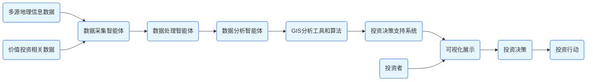

# 智能体协作提升价值投资的地理信息分析能力

> 关键词：智能体协作、价值投资、地理信息分析、数据融合、投资决策

> 摘要：本文聚焦于智能体协作如何提升价值投资中的地理信息分析能力。通过阐述智能体协作与地理信息分析在价值投资领域的核心概念及联系，深入剖析相关算法原理和数学模型，结合实际项目案例展示代码实现过程及分析。探讨智能体协作在不同价值投资场景中的应用，推荐相关学习资源、开发工具和论文著作。最后总结未来发展趋势与挑战，为价值投资中地理信息分析能力的提升提供全面且深入的技术指导和理论支持。

## 1. 背景介绍 
### 1.1 目的和范围
本文章的目的在于深入探讨智能体协作在提升价值投资地理信息分析能力方面的应用。随着价值投资理念的不断发展，地理信息因素在投资决策中扮演着愈发重要的角色。然而，传统的地理信息分析方法存在数据处理能力有限、分析效率低下等问题。智能体协作作为一种新兴的技术手段，能够整合多源地理信息数据，实现高效、准确的分析，为价值投资提供更有力的支持。

本文的范围涵盖智能体协作和地理信息分析的核心概念、算法原理、数学模型，通过实际项目案例展示其在价值投资中的应用，同时介绍相关的工具和资源，以及未来发展趋势和挑战。

### 1.2 预期读者
本文预期读者包括价值投资领域的专业人士，如投资经理、分析师等，他们希望借助智能体协作技术提升地理信息分析能力，为投资决策提供更科学的依据；计算机科学和人工智能领域的研究人员和开发者，对智能体协作和地理信息分析的技术原理和应用场景感兴趣；以及对金融科技和价值投资有一定了解，希望深入学习相关知识的爱好者。

### 1.3 文档结构概述
本文将按照以下结构进行组织：首先介绍核心概念与联系，阐述智能体协作和地理信息分析在价值投资中的基本概念和相互关系；接着详细讲解核心算法原理和具体操作步骤，包括使用Python代码实现；然后介绍数学模型和公式，并通过举例说明其应用；再通过实际项目案例展示代码实现和详细解释；之后探讨智能体协作在价值投资中的实际应用场景；推荐相关的学习资源、开发工具和论文著作；最后总结未来发展趋势与挑战，并提供常见问题解答和扩展阅读参考资料。

### 1.4 术语表
#### 1.4.1 核心术语定义
- **智能体（Agent）**：是一种能够感知环境、自主决策并执行相应动作的实体。在本文中，智能体可以是软件程序，用于处理和分析地理信息数据。
- **智能体协作（Agent Collaboration）**：多个智能体之间通过通信和协调，共同完成一个或多个任务的过程。在价值投资的地理信息分析中，智能体协作可以实现多源地理信息数据的整合和分析。
- **价值投资（Value Investing）**：一种投资策略，通过分析资产的内在价值，寻找被低估的资产进行投资。地理信息分析可以为价值投资提供有关资产地理位置、周边环境等方面的信息，辅助投资决策。
- **地理信息分析（Geographic Information Analysis）**：对地理数据进行收集、处理、分析和可视化的过程，旨在揭示地理现象的规律和关系。在价值投资中，地理信息分析可以帮助投资者了解投资目标的地理位置优势、市场潜力等。

#### 1.4.2 相关概念解释
- **多源地理信息数据**：来自不同数据源的地理信息数据，如卫星影像、地图数据、社交媒体数据等。这些数据具有不同的格式和特点，需要进行整合和处理。
- **数据融合（Data Fusion）**：将多源地理信息数据进行整合，消除数据之间的冗余和冲突，提取更准确、更全面的信息。智能体协作可以在数据融合过程中发挥重要作用。
- **投资决策支持系统（Investment Decision Support System）**：利用信息技术和数据分析方法，为投资者提供决策支持的系统。智能体协作和地理信息分析可以作为投资决策支持系统的重要组成部分。

#### 1.4.3 缩略词列表
- **GIS（Geographic Information System）**：地理信息系统，是一种用于管理和分析地理信息数据的软件平台。
- **AI（Artificial Intelligence）**：人工智能，是研究如何使计算机模拟人类智能的技术领域。
- **ML（Machine Learning）**：机器学习，是人工智能的一个分支，通过让计算机从数据中学习模式和规律，实现预测和决策。

## 2. 核心概念与联系 
### 核心概念原理
#### 智能体协作原理
智能体协作基于多智能体系统（Multi-Agent System，MAS）的理论。在多智能体系统中，每个智能体具有一定的自主性和智能性，能够感知环境并根据自身的目标和规则做出决策。智能体之间通过通信机制进行信息交换和协调，共同完成复杂的任务。

智能体协作的过程通常包括以下几个步骤：
1. **任务分解**：将复杂的任务分解为多个子任务，分配给不同的智能体。
2. **智能体选择**：根据子任务的要求和智能体的能力，选择合适的智能体执行任务。
3. **通信与协调**：智能体之间通过通信协议进行信息交换，协调彼此的行动，避免冲突和重复工作。
4. **结果整合**：各个智能体完成子任务后，将结果进行整合，得到最终的任务结果。

#### 地理信息分析原理
地理信息分析基于地理信息系统（GIS）的技术。GIS是一种用于存储、管理、分析和可视化地理信息数据的软件平台。地理信息分析的过程通常包括以下几个步骤：
1. **数据采集**：从各种数据源采集地理信息数据，如卫星影像、地图数据、传感器数据等。
2. **数据预处理**：对采集到的数据进行清洗、转换和集成，消除数据中的噪声和错误，统一数据格式。
3. **数据分析**：利用GIS的分析工具和算法，对预处理后的数据进行分析，如空间分析、统计分析、建模分析等。
4. **结果可视化**：将分析结果以地图、图表等形式进行可视化展示，便于用户理解和决策。

### 架构的文本示意图
智能体协作提升价值投资的地理信息分析能力的架构可以描述如下：

1. **数据层**：包含多源地理信息数据，如卫星影像、地图数据、社交媒体数据等，以及价值投资相关的数据，如公司财务数据、市场行情数据等。
2. **智能体层**：由多个智能体组成，每个智能体负责不同的任务，如数据采集、数据处理、数据分析等。智能体之间通过通信机制进行协作，共同完成地理信息分析任务。
3. **分析层**：利用GIS的分析工具和算法，对智能体处理后的数据进行深入分析，提取有价值的信息和知识。
4. **决策层**：根据分析层的结果，为价值投资提供决策支持，如投资建议、风险评估等。
5. **可视化层**：将分析结果和决策建议以地图、图表等形式进行可视化展示，便于投资者理解和操作。

### Mermaid 流程图


该流程图展示了智能体协作提升价值投资的地理信息分析能力的整个流程。从多源地理信息数据和价值投资相关数据的采集开始，经过智能体的处理和分析，利用GIS工具和算法进行深入挖掘，为投资决策支持系统提供数据和信息，最终将结果可视化展示给投资者，辅助其做出投资决策并采取行动。

## 3. 核心算法原理 & 具体操作步骤 
### 核心算法原理
#### 智能体协作算法
智能体协作算法主要包括任务分配算法和通信协调算法。

**任务分配算法**：常见的任务分配算法有合同网协议（Contract Net Protocol，CNP）。合同网协议是一种基于拍卖机制的任务分配算法，其基本思想是：任务发起者（管理者智能体）发布任务招标信息，各个智能体（投标者）根据自身的能力和资源对任务进行评估，并向管理者智能体提交投标信息。管理者智能体根据投标信息选择最合适的智能体执行任务，并向其发送任务分配信息。

**通信协调算法**：常见的通信协调算法有黑板模型（Blackboard Model）。黑板模型是一种基于共享数据结构的通信协调算法，其基本思想是：各个智能体通过一个共享的黑板进行信息交换和协调。黑板是一个全局的数据结构，存储了任务的相关信息和各个智能体的状态信息。智能体可以在黑板上读取和写入信息，根据黑板上的信息做出决策和行动。

#### 地理信息分析算法
地理信息分析算法主要包括空间分析算法和机器学习算法。

**空间分析算法**：常见的空间分析算法有缓冲区分析、叠加分析、网络分析等。缓冲区分析是指在地理要素周围创建一定距离的缓冲区，用于分析地理要素的影响范围。叠加分析是指将多个地理图层进行叠加，分析不同地理要素之间的空间关系。网络分析是指在地理网络中进行路径规划、资源分配等分析。

**机器学习算法**：常见的机器学习算法有决策树、支持向量机、神经网络等。机器学习算法可以用于地理信息数据的分类、预测和聚类等分析。例如，决策树算法可以用于对地理区域进行分类，支持向量机算法可以用于对房地产价格进行预测。

### 具体操作步骤
#### 任务分配步骤（以合同网协议为例）
```python
# 定义管理者智能体类
class ManagerAgent:
    def __init__(self, tasks):
        self.tasks = tasks
        self.bidders = []

    def publish_tasks(self):
        for task in self.tasks:
            print(f"管理者智能体发布任务: {task}")
            for bidder in self.bidders:
                bidder.receive_task(task)

    def receive_bids(self):
        bids = []
        for bidder in self.bidders:
            bid = bidder.send_bid()
            if bid:
                bids.append(bid)
        return bids

    def allocate_tasks(self, bids):
        for task in self.tasks:
            suitable_bids = [bid for bid in bids if bid['task'] == task]
            if suitable_bids:
                best_bid = max(suitable_bids, key=lambda x: x['score'])
                best_bidder = next((bidder for bidder in self.bidders if bidder.id == best_bid['bidder_id']), None)
                if best_bidder:
                    best_bidder.receive_allocation(task)
                    print(f"管理者智能体将任务 {task} 分配给智能体 {best_bidder.id}")

# 定义投标者智能体类
class BidderAgent:
    def __init__(self, id, capabilities):
        self.id = id
        self.capabilities = capabilities
        self.received_tasks = []

    def receive_task(self, task):
        self.received_tasks.append(task)

    def send_bid(self):
        bids = []
        for task in self.received_tasks:
            if task in self.capabilities:
                score = self.capabilities[task]
                bid = {
                    'task': task,
                    'bidder_id': self.id,
                    'score': score
                }
                bids.append(bid)
        if bids:
            best_bid = max(bids, key=lambda x: x['score'])
            return best_bid
        return None

    def receive_allocation(self, task):
        print(f"智能体 {self.id} 收到任务 {task} 的分配通知")

# 示例使用
tasks = ['数据采集', '数据处理', '数据分析']
manager = ManagerAgent(tasks)

bidder1 = BidderAgent(1, {'数据采集': 80, '数据处理': 60})
bidder2 = BidderAgent(2, {'数据处理': 90, '数据分析': 70})
manager.bidders = [bidder1, bidder2]

# 发布任务
manager.publish_tasks()

# 接收投标
bids = manager.receive_bids()

# 分配任务
manager.allocate_tasks(bids)
```

上述代码实现了合同网协议的任务分配过程。管理者智能体发布任务，投标者智能体接收任务并进行投标，管理者智能体根据投标信息分配任务。

#### 地理信息分析步骤（以缓冲区分析为例）
```python
import geopandas as gpd
from shapely.geometry import Point

# 读取地理数据
data = gpd.read_file('points.shp')

# 创建缓冲区
data['buffer'] = data.geometry.buffer(100)  # 缓冲区距离为100米

# 保存结果
data.to_file('buffered_points.shp')
```

上述代码使用`geopandas`库实现了缓冲区分析。首先读取地理数据，然后对地理要素创建缓冲区，最后保存结果。

## 4. 数学模型和公式 & 详细讲解 & 举例说明 
### 空间距离公式
在地理信息分析中，经常需要计算地理要素之间的距离。常见的空间距离公式有欧几里得距离和曼哈顿距离。

#### 欧几里得距离
欧几里得距离是指在二维平面上，两点之间的直线距离。其数学公式为：

$$d_{E}(p,q)=\sqrt{(x_{q}-x_{p})^{2}+(y_{q}-y_{p})^{2}}$$

其中，$p=(x_{p},y_{p})$ 和 $q=(x_{q},y_{q})$ 是两个点的坐标，$d_{E}(p,q)$ 是两点之间的欧几里得距离。

**举例说明**：假设有两个点 $p=(1,2)$ 和 $q=(4,6)$，则它们之间的欧几里得距离为：

$$d_{E}(p,q)=\sqrt{(4 - 1)^{2}+(6 - 2)^{2}}=\sqrt{9 + 16}=\sqrt{25}=5$$

#### 曼哈顿距离
曼哈顿距离是指在二维平面上，两点之间沿着坐标轴方向的距离之和。其数学公式为：

$$d_{M}(p,q)=\vert x_{q}-x_{p}\vert+\vert y_{q}-y_{p}\vert$$

其中，$p=(x_{p},y_{p})$ 和 $q=(x_{q},y_{q})$ 是两个点的坐标，$d_{M}(p,q)$ 是两点之间的曼哈顿距离。

**举例说明**：假设有两个点 $p=(1,2)$ 和 $q=(4,6)$，则它们之间的曼哈顿距离为：

$$d_{M}(p,q)=\vert 4 - 1\vert+\vert 6 - 2\vert=3 + 4=7$$

### 缓冲区分析模型
缓冲区分析是地理信息分析中的一种重要方法，用于分析地理要素的影响范围。缓冲区分析的数学模型可以表示为：

$$B(p,r)=\{q\in\mathbb{R}^{2}\vert d(p,q)\leq r\}$$

其中，$p$ 是地理要素的中心点，$r$ 是缓冲区的半径，$B(p,r)$ 是缓冲区的范围，$d(p,q)$ 是点 $p$ 和点 $q$ 之间的距离。

**举例说明**：假设有一个点 $p=(0,0)$，缓冲区半径 $r = 5$，则缓冲区的范围可以表示为：

$$B((0,0),5)=\{q=(x,y)\in\mathbb{R}^{2}\vert\sqrt{x^{2}+y^{2}}\leq 5\}$$

在实际应用中，可以使用GIS软件或编程语言（如Python）来实现缓冲区分析。

### 机器学习模型（以决策树为例）
决策树是一种常用的机器学习模型，用于分类和回归分析。决策树的基本思想是通过对数据的特征进行划分，构建一棵二叉树，每个内部节点表示一个特征的划分条件，每个叶子节点表示一个分类或回归结果。

决策树的构建过程通常包括以下几个步骤：
1. **特征选择**：选择一个最优的特征作为当前节点的划分条件。
2. **数据集划分**：根据选择的特征将数据集划分为两个子集。
3. **递归构建**：对每个子集递归地构建决策树。

决策树的数学模型可以表示为：

$$T=\{N_{1},N_{2},\cdots,N_{n}\}$$

其中，$T$ 是决策树，$N_{i}$ 是决策树的节点，$n$ 是节点的数量。

**举例说明**：假设有一个数据集，包含两个特征 $x_{1}$ 和 $x_{2}$，以及一个分类标签 $y$。使用决策树算法对数据集进行分类，构建的决策树如下：

```plaintext
           x1 <= 5
          /       \
     y = 0         x2 <= 3
                  /       \
             y = 1         y = 2
```

该决策树表示：如果 $x_{1}\leq 5$，则分类结果为 $y = 0$；如果 $x_{1}> 5$ 且 $x_{2}\leq 3$，则分类结果为 $y = 1$；如果 $x_{1}> 5$ 且 $x_{2}> 3$，则分类结果为 $y = 2$。

## 5. 项目实战：代码实际案例和详细解释说明 
### 5.1  开发环境搭建
#### 操作系统
本项目可以在Windows、Linux或macOS等操作系统上进行开发。建议使用Linux系统，因为Linux系统在数据处理和科学计算方面具有较好的性能和稳定性。

#### 编程语言和库
本项目使用Python作为开发语言，需要安装以下库：
- **geopandas**：用于地理信息数据的处理和分析。
- **shapely**：用于几何对象的创建和操作。
- **scikit-learn**：用于机器学习算法的实现。
- **matplotlib**：用于数据可视化。

可以使用以下命令安装这些库：
```bash
pip install geopandas shapely scikit-learn matplotlib
```

#### 数据准备
本项目需要准备地理信息数据和价值投资相关数据。地理信息数据可以从公开数据源（如OpenStreetMap）获取，也可以使用自己收集的数据。价值投资相关数据可以从金融数据提供商（如Wind、Bloomberg）获取。

### 5.2  源代码详细实现和代码解读
#### 数据采集和预处理
```python
import geopandas as gpd
import pandas as pd

# 读取地理信息数据
geo_data = gpd.read_file('geo_data.shp')

# 读取价值投资相关数据
investment_data = pd.read_csv('investment_data.csv')

# 数据预处理
# 合并地理信息数据和价值投资相关数据
merged_data = geo_data.merge(investment_data, on='id')

# 处理缺失值
merged_data = merged_data.dropna()

# 保存预处理后的数据
merged_data.to_file('merged_data.shp')
```

**代码解读**：
1. 使用`geopandas`库的`read_file`函数读取地理信息数据。
2. 使用`pandas`库的`read_csv`函数读取价值投资相关数据。
3. 使用`merge`函数将地理信息数据和价值投资相关数据按照`id`字段进行合并。
4. 使用`dropna`函数处理缺失值。
5. 使用`to_file`函数保存预处理后的数据。

#### 智能体协作和地理信息分析
```python
from sklearn.tree import DecisionTreeClassifier
from sklearn.model_selection import train_test_split
from sklearn.metrics import accuracy_score

# 提取特征和标签
X = merged_data[['feature1', 'feature2']]
y = merged_data['label']

# 划分训练集和测试集
X_train, X_test, y_train, y_test = train_test_split(X, y, test_size=0.2, random_state=42)

# 创建决策树分类器
clf = DecisionTreeClassifier()

# 训练模型
clf.fit(X_train, y_train)

# 预测
y_pred = clf.predict(X_test)

# 评估模型
accuracy = accuracy_score(y_test, y_pred)
print(f"模型准确率: {accuracy}")
```

**代码解读**：
1. 从预处理后的数据中提取特征和标签。
2. 使用`train_test_split`函数将数据集划分为训练集和测试集。
3. 创建决策树分类器。
4. 使用训练集对模型进行训练。
5. 使用测试集进行预测。
6. 使用`accuracy_score`函数评估模型的准确率。

### 5.3  代码解读与分析
#### 数据采集和预处理
数据采集和预处理是项目的基础步骤，其目的是将多源数据进行整合和清洗，为后续的分析提供高质量的数据。在本项目中，使用`geopandas`和`pandas`库进行数据的读取和处理，通过`merge`函数将地理信息数据和价值投资相关数据进行合并，使用`dropna`函数处理缺失值。

#### 智能体协作和地理信息分析
智能体协作和地理信息分析是项目的核心步骤，其目的是通过机器学习算法对地理信息数据和价值投资相关数据进行分析，为投资决策提供支持。在本项目中，使用决策树分类器对数据进行分类，通过`train_test_split`函数划分训练集和测试集，使用`fit`函数进行模型训练，使用`predict`函数进行预测，使用`accuracy_score`函数评估模型的准确率。

## 6. 实际应用场景 
### 房地产投资
在房地产投资中，地理信息分析可以帮助投资者了解房地产的地理位置、周边环境、交通状况等因素，从而评估房地产的价值和投资潜力。智能体协作可以整合多源地理信息数据，如卫星影像、地图数据、社交媒体数据等，为投资者提供更全面、准确的信息。例如，通过分析房地产周边的商业设施、学校、医院等配套设施的分布情况，以及交通流量、人口密度等数据，投资者可以判断房地产的市场需求和价格走势，做出更明智的投资决策。

### 基础设施投资
在基础设施投资中，地理信息分析可以帮助投资者了解基础设施项目的地理位置、建设条件、周边经济发展情况等因素，从而评估项目的可行性和投资回报率。智能体协作可以协调不同部门和机构的智能体，共同完成基础设施项目的规划、设计、建设和运营管理等任务。例如，通过分析基础设施项目周边的地形地貌、地质条件、水文情况等数据，以及当地的政策法规、市场需求等信息，投资者可以优化项目的选址和设计方案，降低项目的建设成本和风险。

### 农业投资
在农业投资中，地理信息分析可以帮助投资者了解农业用地的地理位置、土壤质量、气候条件等因素，从而评估农业项目的生产潜力和投资效益。智能体协作可以整合气象数据、土壤监测数据、农产品市场数据等多源信息，为投资者提供精准的农业生产指导和市场预测。例如，通过分析农业用地的土壤肥力、水分含量、光照时间等数据，以及农产品的市场价格、供求关系等信息，投资者可以选择合适的农作物品种和种植方式，提高农业生产的效率和质量。

## 7. 工具和资源推荐
### 7.1 学习资源推荐
#### 7.1.1 书籍推荐
- 《地理信息系统原理、方法和应用》：本书系统地介绍了地理信息系统的基本原理、方法和应用，是学习地理信息系统的经典教材。
- 《Python地理空间分析指南》：本书介绍了如何使用Python进行地理空间数据的处理和分析，适合有一定Python基础的读者。
- 《人工智能：一种现代的方法》：本书是人工智能领域的经典教材，介绍了人工智能的基本概念、算法和应用，对于理解智能体协作有很大的帮助。

#### 7.1.2 在线课程
- Coursera上的“Geographic Information Systems (GIS)”课程：该课程由宾夕法尼亚州立大学提供，介绍了地理信息系统的基本概念、方法和应用。
- edX上的“Python for Data Science”课程：该课程由IBM提供，介绍了如何使用Python进行数据分析和处理，对于学习地理信息分析有很大的帮助。
- Udemy上的“Artificial Intelligence A-Z™: Learn How To Build An AI”课程：该课程介绍了人工智能的基本概念、算法和应用，适合初学者学习。

#### 7.1.3 技术博客和网站
- GIS Stack Exchange：一个地理信息系统领域的问答社区，用户可以在这里提问、回答问题和分享经验。
- Towards Data Science：一个数据科学领域的技术博客，提供了很多关于数据分析、机器学习和人工智能的文章和教程。
- AI Shack：一个人工智能领域的技术博客，介绍了人工智能的最新研究成果和应用案例。

### 7.2 开发工具框架推荐
#### 7.2.1 IDE和编辑器
- PyCharm：一个专业的Python集成开发环境，提供了代码编辑、调试、版本控制等功能，适合Python开发。
- Visual Studio Code：一个轻量级的代码编辑器，支持多种编程语言和插件扩展，适合快速开发和调试。
- Jupyter Notebook：一个交互式的编程环境，适合数据探索和分析，支持Python、R等多种编程语言。

#### 7.2.2 调试和性能分析工具
- Py-Spy：一个Python性能分析工具，可以实时监测Python程序的CPU使用率和内存占用情况。
- cProfile：Python标准库中的一个性能分析模块，可以分析Python程序的运行时间和函数调用次数。
- PDB：Python标准库中的一个调试模块，可以对Python程序进行单步调试和断点调试。

#### 7.2.3 相关框架和库
- GeoPandas：一个用于地理信息数据处理和分析的Python库，提供了类似于Pandas的接口，方便用户进行地理数据的操作。
- Shapely：一个用于几何对象创建和操作的Python库，支持点、线、面等几何对象的创建和计算。
- Scikit-learn：一个用于机器学习的Python库，提供了多种机器学习算法和工具，如分类、回归、聚类等。

### 7.3 相关论文著作推荐
#### 7.3.1 经典论文
- “A Formal Basis for the Heuristic Determination of Minimum Cost Paths”：该论文提出了Dijkstra算法，是图论中求解最短路径问题的经典算法。
- “Multilayer Feedforward Networks are Universal Approximators”：该论文证明了多层前馈神经网络可以逼近任意连续函数，为神经网络的应用奠定了理论基础。
- “The Geographic Information Science and Technology Body of Knowledge (2nd Quarter 2014 Edition): An Update and Expanded Version”：该论文介绍了地理信息科学和技术的知识体系，是地理信息领域的重要文献。

#### 7.3.2 最新研究成果
- “Deep Learning for Geospatial Data Analysis: A Review”：该论文综述了深度学习在地理空间数据分析中的应用，介绍了最新的研究成果和发展趋势。
- “Multi-Agent Systems for Smart Cities: A Survey”：该论文综述了多智能体系统在智慧城市中的应用，分析了多智能体系统的优势和挑战。
- “Geospatial Big Data Analytics: A Review”：该论文综述了地理空间大数据分析的方法和技术，介绍了地理空间大数据的特点和应用场景。

#### 7.3.3 应用案例分析
- “Application of Geographic Information Systems in Real Estate Investment Analysis”：该论文介绍了地理信息系统在房地产投资分析中的应用案例，分析了地理信息系统在房地产投资决策中的作用。
- “Using Multi-Agent Systems for Infrastructure Project Management”：该论文介绍了多智能体系统在基础设施项目管理中的应用案例，分析了多智能体系统在基础设施项目规划、设计、建设和运营管理中的优势。
- “Geospatial Analysis in Agricultural Investment Decision-Making”：该论文介绍了地理空间分析在农业投资决策中的应用案例，分析了地理空间分析在农业生产潜力评估、市场预测和投资效益分析中的作用。

## 8. 总结：未来发展趋势与挑战
### 未来发展趋势
#### 智能化程度不断提高
随着人工智能技术的不断发展，智能体的智能化程度将不断提高。智能体将具备更强的感知能力、决策能力和学习能力，能够更好地适应复杂多变的环境。在价值投资的地理信息分析中，智能体将能够自动识别地理信息数据中的模式和规律，为投资者提供更精准的投资建议。

#### 多源数据融合更加深入
未来，智能体协作将能够更加深入地融合多源地理信息数据和价值投资相关数据。除了传统的地理信息数据和金融数据，还将融合社交媒体数据、物联网数据等多源数据，为投资者提供更全面、准确的信息。通过多源数据融合，投资者可以更好地了解投资目标的市场环境和发展趋势，做出更明智的投资决策。

#### 与区块链技术结合
区块链技术具有去中心化、不可篡改、安全可靠等特点，将与智能体协作和地理信息分析相结合，为价值投资提供更安全、可信的环境。例如，通过区块链技术可以实现地理信息数据和投资交易记录的安全存储和共享，防止数据篡改和欺诈行为。

### 挑战
#### 数据隐私和安全问题
在智能体协作和地理信息分析中，需要处理大量的敏感数据，如个人隐私信息、商业机密等。如何保障数据的隐私和安全是一个重要的挑战。需要采用先进的加密技术和安全机制，确保数据在传输和存储过程中的安全性。

#### 算法复杂度和计算资源需求
智能体协作和地理信息分析涉及到复杂的算法和大量的数据处理，对计算资源的需求较高。如何优化算法复杂度，提高计算效率，是一个需要解决的问题。可以采用分布式计算、云计算等技术，提高计算资源的利用率。

#### 跨领域知识融合
智能体协作和地理信息分析涉及到计算机科学、地理学、经济学等多个领域的知识。如何实现跨领域知识的融合，培养具有跨领域知识和技能的人才，是一个重要的挑战。需要加强跨学科的教育和研究，促进不同领域之间的交流与合作。

## 9. 附录：常见问题与解答
### 问题1：智能体协作和地理信息分析在价值投资中的应用有哪些优势？
智能体协作和地理信息分析在价值投资中的应用具有以下优势：
- **提供更全面的信息**：通过整合多源地理信息数据和价值投资相关数据，为投资者提供更全面、准确的信息，帮助投资者更好地了解投资目标的市场环境和发展趋势。
- **提高分析效率**：智能体协作可以实现多任务并行处理，提高地理信息分析的效率，快速为投资者提供分析结果。
- **辅助决策制定**：通过地理信息分析和机器学习算法，为投资者提供投资建议和风险评估，辅助投资者做出更明智的投资决策。

### 问题2：如何选择合适的智能体协作算法和地理信息分析算法？
选择合适的智能体协作算法和地理信息分析算法需要考虑以下因素：
- **任务需求**：根据具体的任务需求选择合适的算法。例如，如果任务需要进行任务分配和协调，可以选择合同网协议等任务分配算法；如果任务需要进行地理信息分析，可以选择缓冲区分析、叠加分析等空间分析算法。
- **数据特点**：根据数据的特点选择合适的算法。例如，如果数据具有高维、非线性等特点，可以选择神经网络等机器学习算法；如果数据具有空间相关性，可以选择空间自相关分析等算法。
- **算法复杂度**：考虑算法的复杂度和计算资源需求，选择合适的算法。例如，如果计算资源有限，可以选择复杂度较低的算法；如果计算资源充足，可以选择复杂度较高的算法。

### 问题3：智能体协作和地理信息分析在实际应用中可能会遇到哪些问题？
智能体协作和地理信息分析在实际应用中可能会遇到以下问题：
- **数据质量问题**：地理信息数据和价值投资相关数据可能存在噪声、缺失值等问题，影响分析结果的准确性。需要对数据进行预处理，提高数据质量。
- **通信协调问题**：智能体之间的通信协调可能会受到网络延迟、通信故障等因素的影响，导致任务执行效率低下。需要采用可靠的通信协议和协调机制，确保智能体之间的通信畅通。
- **模型泛化问题**：机器学习模型可能会出现过拟合或欠拟合的问题，影响模型的泛化能力。需要采用合适的模型选择和评估方法，提高模型的泛化能力。

## 10. 扩展阅读 & 参考资料
### 扩展阅读
- 《智能体系统原理与编程》：本书介绍了智能体系统的基本原理和编程方法，适合深入学习智能体协作的读者。
- 《地理信息科学前沿》：本书介绍了地理信息科学的最新研究成果和发展趋势，适合对地理信息分析感兴趣的读者。
- 《价值投资实战手册》：本书介绍了价值投资的基本理念和实战方法，适合对价值投资感兴趣的读者。

### 参考资料
- 维基百科：提供了智能体协作、地理信息分析、价值投资等相关概念的详细介绍。
- IEEE Xplore：一个电子电气工程师协会的数字图书馆，提供了大量关于人工智能、地理信息系统等领域的学术论文和研究报告。
- ACM Digital Library：一个计算机协会的数字图书馆，提供了大量关于计算机科学、人工智能等领域的学术论文和研究报告。

作者：AI天才研究院/AI Genius Institute & 禅与计算机程序设计艺术 /Zen And The Art of Computer Programming