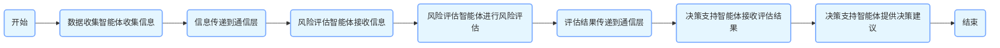

# 智能体协作提高价值投资的跨境并购风险分析

> 关键词：智能体协作、价值投资、跨境并购、风险分析、人工智能

> 摘要：本文聚焦于智能体协作在提高价值投资的跨境并购风险分析中的应用。随着全球经济一体化的发展，跨境并购活动日益频繁，然而其中蕴含的风险也不容忽视。传统的风险分析方法存在一定局限性，而智能体协作凭借其高效、准确、灵活等优势，为跨境并购风险分析带来了新的思路和方法。文章深入探讨了智能体协作的核心概念、算法原理、数学模型等内容，并通过项目实战展示其在实际中的应用，分析了其实际应用场景，推荐了相关工具和资源，最后对未来发展趋势与挑战进行了总结，旨在为跨境并购风险分析提供全面、深入的技术支持和理论参考。

## 1. 背景介绍 
### 1.1 目的和范围
跨境并购作为企业实现国际化战略、拓展市场、获取资源的重要手段，在全球经济中扮演着越来越重要的角色。然而，跨境并购涉及不同国家的政治、经济、法律、文化等多方面因素，其风险复杂多样。价值投资强调对目标企业内在价值的评估，在跨境并购中，准确分析风险对于实现价值投资的目标至关重要。本文的目的在于研究如何利用智能体协作技术提高跨境并购风险分析的准确性和效率，为价值投资提供更可靠的决策依据。本文的范围涵盖智能体协作的基本原理、相关算法、数学模型，以及在跨境并购风险分析中的具体应用，同时探讨其未来发展趋势和面临的挑战。

### 1.2 预期读者
本文预期读者包括从事跨境并购业务的投资机构、企业管理人员、金融分析师等相关从业人员，以及对人工智能、风险分析等领域感兴趣的研究人员和学者。对于从业人员，本文提供了智能体协作在跨境并购风险分析中的实际应用方法和案例，有助于他们提高工作效率和决策准确性；对于研究人员和学者，本文深入探讨了智能体协作的技术原理和理论模型，为进一步的研究提供了参考。

### 1.3 文档结构概述
本文共分为十个部分。第一部分为背景介绍，阐述了研究的目的、范围、预期读者和文档结构概述，并对相关术语进行了定义和解释。第二部分介绍了智能体协作的核心概念与联系，包括其原理和架构，并通过文本示意图和 Mermaid 流程图进行展示。第三部分详细讲解了智能体协作的核心算法原理和具体操作步骤，并使用 Python 源代码进行阐述。第四部分介绍了相关的数学模型和公式，并进行详细讲解和举例说明。第五部分通过项目实战，展示了智能体协作在跨境并购风险分析中的代码实际案例，并对代码进行详细解释和分析。第六部分分析了智能体协作在跨境并购风险分析中的实际应用场景。第七部分推荐了相关的学习资源、开发工具框架和论文著作。第八部分总结了智能体协作在跨境并购风险分析中的未来发展趋势与挑战。第九部分为附录，解答了常见问题。第十部分提供了扩展阅读和参考资料。

### 1.4 术语表
#### 1.4.1 核心术语定义
- **智能体（Agent）**：是指能够感知环境、自主决策并采取行动的实体。在本文中，智能体可以是软件程序、机器人或其他具有一定智能的系统，它们能够独立地收集信息、分析数据，并与其他智能体进行协作。
- **智能体协作（Agent Collaboration）**：多个智能体为了实现共同的目标，通过信息共享、协调行动等方式进行合作的过程。在跨境并购风险分析中，不同类型的智能体可以协作完成数据收集、风险评估、决策支持等任务。
- **价值投资（Value Investing）**：一种投资策略，强调通过对目标企业的财务状况、经营业绩、行业前景等因素进行深入分析，评估其内在价值，并在价格低于内在价值时进行投资。
- **跨境并购（Cross - border M&A）**：指企业跨越国界，通过收购、合并等方式取得其他国家企业的控制权或部分股权的行为。
- **风险分析（Risk Analysis）**：对可能影响项目或决策的不确定性因素进行识别、评估和量化的过程。在跨境并购中，风险分析包括政治风险、经济风险、法律风险、文化风险等多个方面。

#### 1.4.2 相关概念解释
- **多智能体系统（Multi - Agent System，MAS）**：由多个智能体组成的系统，这些智能体之间可以进行通信、协作和竞争。多智能体系统具有分布式、自主性、协作性等特点，能够适应复杂多变的环境。
- **机器学习（Machine Learning）**：一门多领域交叉学科，涉及概率论、统计学、逼近论、凸分析、算法复杂度理论等多门学科。它专门研究计算机怎样模拟或实现人类的学习行为，以获取新的知识或技能，重新组织已有的知识结构使之不断改善自身的性能。在智能体协作中，机器学习可以用于智能体的训练和决策。
- **大数据（Big Data）**：指无法在一定时间范围内用常规软件工具进行捕捉、管理和处理的数据集合，是需要新处理模式才能具有更强的决策力、洞察发现力和流程优化能力的海量、高增长率和多样化的信息资产。在跨境并购风险分析中，大数据可以提供丰富的信息来源。

#### 1.4.3 缩略词列表
- **MAS**：Multi - Agent System（多智能体系统）
- **AI**：Artificial Intelligence（人工智能）
- **ML**：Machine Learning（机器学习）

## 2. 核心概念与联系 

### 智能体协作原理
智能体协作的基本原理是基于多智能体系统的思想。每个智能体具有一定的自主性和智能，能够感知环境中的信息，并根据自身的目标和规则进行决策和行动。在协作过程中，智能体之间通过通信机制进行信息交换和协调，以实现共同的目标。

智能体协作的架构通常包括以下几个部分：
- **智能体层**：由多个不同类型的智能体组成，如数据收集智能体、风险评估智能体、决策支持智能体等。每个智能体负责完成特定的任务。
- **通信层**：提供智能体之间的通信机制，确保信息的传递和共享。通信协议可以是基于网络的协议，如 TCP/IP 协议，也可以是专门设计的智能体通信语言，如 KQML（Knowledge Query and Manipulation Language）。
- **协作管理层**：负责协调智能体之间的协作关系，解决冲突和矛盾。协作管理策略可以采用集中式或分布式的方式。

### 文本示意图
```plaintext
智能体协作架构
|-- 智能体层
|   |-- 数据收集智能体
|   |-- 风险评估智能体
|   |-- 决策支持智能体
|   |-- ...
|-- 通信层
|   |-- 通信协议（TCP/IP、KQML 等）
|-- 协作管理层
|   |-- 协作管理策略（集中式、分布式）
```

### Mermaid 流程图


## 3. 核心算法原理 & 具体操作步骤 

### 智能体协作算法原理
智能体协作的算法主要涉及智能体的决策算法和协作算法。决策算法用于智能体根据自身的目标和感知到的信息进行决策，常见的决策算法包括基于规则的决策算法、基于机器学习的决策算法等。协作算法用于协调智能体之间的行动，解决冲突和矛盾，常见的协作算法包括合同网协议、拍卖算法等。

### 基于规则的决策算法 Python 示例
```python
# 定义规则库
rules = [
    {
        "condition": lambda x: x["political_risk"] > 0.8,
        "action": "建议谨慎考虑并购，深入评估政治风险"
    },
    {
        "condition": lambda x: x["economic_risk"] > 0.7,
        "action": "关注经济形势，重新评估并购的财务可行性"
    }
]

# 风险评估智能体的决策函数
def decision_making(risk_info):
    for rule in rules:
        if rule["condition"](risk_info):
            return rule["action"]
    return "目前风险处于可接受范围，可以继续推进并购流程"

# 示例风险信息
risk_info = {
    "political_risk": 0.9,
    "economic_risk": 0.6
}

# 进行决策
result = decision_making(risk_info)
print(result)
```
### 具体操作步骤
1. **智能体初始化**：对每个智能体进行初始化，包括设置其目标、规则、初始状态等。
2. **数据收集**：数据收集智能体通过各种渠道收集与跨境并购相关的信息，如政治、经济、法律、文化等方面的信息。
3. **信息传递**：数据收集智能体将收集到的信息通过通信层传递给其他相关智能体，如风险评估智能体。
4. **风险评估**：风险评估智能体根据接收到的信息，运用决策算法进行风险评估，并得出评估结果。
5. **结果传递**：风险评估智能体将评估结果通过通信层传递给决策支持智能体。
6. **决策支持**：决策支持智能体根据评估结果，运用决策算法提供决策建议。
7. **协作管理**：协作管理层对智能体之间的协作过程进行监控和管理，解决可能出现的冲突和矛盾。

## 4. 数学模型和公式 & 详细讲解 & 举例说明 

### 风险评估数学模型
在跨境并购风险分析中，我们可以使用综合风险评估模型来评估各种风险因素的综合影响。假设我们考虑 $n$ 个风险因素 $x_1, x_2, \cdots, x_n$，每个风险因素的权重为 $w_1, w_2, \cdots, w_n$，且 $\sum_{i = 1}^{n} w_i = 1$。则综合风险值 $R$ 可以表示为：
$$R=\sum_{i = 1}^{n} w_i x_i$$

### 详细讲解
- **风险因素 $x_i$**：表示第 $i$ 个风险因素的量化值。例如，政治风险可以用政治稳定性指数来表示，经济风险可以用 GDP 增长率、通货膨胀率等指标来表示。
- **权重 $w_i$**：表示第 $i$ 个风险因素在综合风险评估中的重要程度。权重的确定可以通过专家评估、层次分析法（AHP）等方法来实现。

### 举例说明
假设我们考虑三个风险因素：政治风险 $x_1$、经济风险 $x_2$ 和法律风险 $x_3$，它们的权重分别为 $w_1 = 0.3$，$w_2 = 0.4$，$w_3 = 0.3$。政治风险的量化值为 $x_1 = 0.8$，经济风险的量化值为 $x_2 = 0.6$，法律风险的量化值为 $x_3 = 0.7$。则综合风险值为：
$$R=0.3\times0.8 + 0.4\times0.6+0.3\times0.7=0.69$$

## 5. 项目实战：代码实际案例和详细解释说明 

### 5.1  开发环境搭建
- **编程语言**：Python 3.x
- **开发工具**：PyCharm 或 VS Code
- **相关库**：`pandas`（用于数据处理）、`numpy`（用于数值计算）、`sklearn`（用于机器学习）

### 5.2  源代码详细实现和代码解读
```python
import pandas as pd
import numpy as np
from sklearn.preprocessing import MinMaxScaler

# 模拟风险数据
data = {
    "political_risk": [0.8, 0.6, 0.7, 0.9],
    "economic_risk": [0.6, 0.7, 0.8, 0.5],
    "legal_risk": [0.7, 0.8, 0.6, 0.9]
}
df = pd.DataFrame(data)

# 数据归一化
scaler = MinMaxScaler()
df_scaled = scaler.fit_transform(df)
df_scaled = pd.DataFrame(df_scaled, columns=df.columns)

# 定义权重
weights = {
    "political_risk": 0.3,
    "economic_risk": 0.4,
    "legal_risk": 0.3
}

# 计算综合风险值
def calculate_combined_risk(row):
    risk = 0
    for factor, weight in weights.items():
        risk += weight * row[factor]
    return risk

df_scaled["combined_risk"] = df_scaled.apply(calculate_combined_risk, axis=1)

# 输出结果
print(df_scaled)
```
### 代码解读与分析
1. **数据模拟**：使用 `pandas` 库创建一个包含政治风险、经济风险和法律风险的数据集。
2. **数据归一化**：使用 `MinMaxScaler` 对数据进行归一化处理，将数据缩放到 $[0, 1]$ 范围内，以消除不同风险因素之间的量纲差异。
3. **定义权重**：定义每个风险因素的权重，用于计算综合风险值。
4. **计算综合风险值**：定义一个函数 `calculate_combined_risk`，根据权重和风险因素的值计算综合风险值，并将结果添加到数据集中。
5. **输出结果**：打印包含综合风险值的数据集。

## 6. 实际应用场景 
### 并购前风险评估
在跨境并购之前，智能体协作可以帮助企业全面、准确地评估目标企业所在国家的政治、经济、法律、文化等方面的风险。数据收集智能体可以从新闻媒体、政府报告、专业数据库等渠道收集相关信息，风险评估智能体可以运用机器学习算法和数学模型对风险进行量化评估，决策支持智能体可以根据评估结果为企业提供决策建议，如是否进行并购、并购的价格范围等。

### 并购过程监控
在跨境并购过程中，智能体协作可以实时监控各种风险因素的变化。一旦发现风险因素发生重大变化，智能体可以及时发出预警，并提供相应的应对措施。例如，如果目标企业所在国家的政治局势突然动荡，数据收集智能体可以及时收集相关信息，风险评估智能体可以重新评估政治风险，决策支持智能体可以建议企业暂停并购或调整并购策略。

### 并购后整合管理
在跨境并购完成后，智能体协作可以帮助企业进行整合管理，降低整合风险。智能体可以分析企业在文化、管理、业务等方面的差异，提供整合方案和建议。例如，通过分析双方企业的文化特点，智能体可以建议采取文化融合的策略，促进员工之间的沟通和协作。

## 7. 工具和资源推荐
### 7.1 学习资源推荐
#### 7.1.1 书籍推荐
- 《多智能体系统：原理与编程》：全面介绍了多智能体系统的基本原理、设计方法和编程技术，是学习多智能体系统的经典教材。
- 《机器学习》（周志华著）：系统地介绍了机器学习的基本概念、算法和应用，对于理解智能体协作中的机器学习算法有很大帮助。
- 《价值投资：从格雷厄姆到巴菲特》：深入阐述了价值投资的理论和实践，对于从事跨境并购的投资者具有重要的参考价值。

#### 7.1.2 在线课程
- Coursera 上的“Artificial Intelligence”课程：由斯坦福大学教授讲授，涵盖了人工智能的基本概念、算法和应用，包括多智能体系统和机器学习等内容。
- edX 上的“Machine Learning Fundamentals”课程：提供了机器学习的基础知识和实践经验，有助于提高智能体协作中的数据处理和分析能力。

#### 7.1.3 技术博客和网站
- Medium 上的人工智能和机器学习相关博客：提供了最新的技术文章和研究成果，有助于了解智能体协作的前沿动态。
- arXiv 网站：可以搜索到关于多智能体系统、机器学习等领域的最新研究论文。

### 7.2 开发工具框架推荐
#### 7.2.1 IDE和编辑器
- PyCharm：一款专门为 Python 开发设计的集成开发环境，提供了丰富的代码编辑、调试和项目管理功能。
- VS Code：一款轻量级的代码编辑器，支持多种编程语言和插件，具有良好的扩展性。

#### 7.2.2 调试和性能分析工具
- Py-Spy：一个用于分析 Python 程序性能的工具，可以帮助开发者找出程序中的性能瓶颈。
- PDB（Python Debugger）：Python 内置的调试器，可以帮助开发者调试代码，找出程序中的错误。

#### 7.2.3 相关框架和库
- Mesa：一个用于构建多智能体系统的 Python 框架，提供了丰富的智能体模型和模拟工具。
- TensorFlow：一个开源的机器学习框架，广泛应用于深度学习和人工智能领域，可以用于智能体的训练和决策。

### 7.3 相关论文著作推荐
#### 7.3.1 经典论文
- “Multi - Agent Systems: A Modern Approach to Distributed Artificial Intelligence”：该论文系统地介绍了多智能体系统的基本