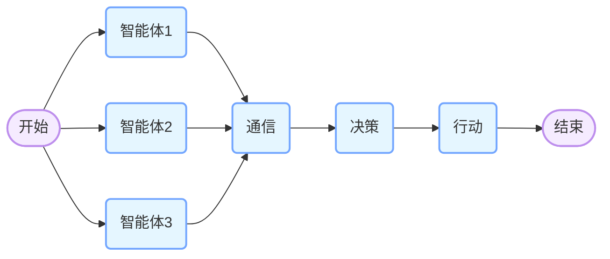

# 智能体协作评估公司的循环经济实践：可持续发展新视角

> 关键词：智能体协作、循环经济实践、可持续发展、评估公司、新视角

> 摘要：本文聚焦于智能体协作评估公司在循环经济实践中的应用，从可持续发展的新视角出发，深入探讨了相关核心概念、算法原理、数学模型等内容。通过详细的项目实战案例，展示了如何运用智能体协作对公司的循环经济实践进行有效评估。同时，介绍了实际应用场景、推荐了相关工具和资源，并对未来发展趋势与挑战进行了总结，旨在为推动循环经济的可持续发展提供理论和实践参考。

## 1. 背景介绍 
### 1.1 目的和范围
随着全球资源短缺和环境问题的日益严峻，循环经济作为一种可持续的经济发展模式受到了广泛关注。评估公司在循环经济实践中的表现对于推动循环经济的发展至关重要。本文章的目的在于探讨如何利用智能体协作的方法来评估公司的循环经济实践，为可持续发展提供新的视角和方法。范围涵盖了智能体协作的基本原理、评估公司循环经济实践的具体流程、相关的数学模型以及实际应用案例等方面。

### 1.2 预期读者
本文预期读者包括从事循环经济研究的学者、企业中负责可持续发展战略规划的管理人员、关注环境和资源问题的政策制定者以及对智能体技术和循环经济实践感兴趣的技术爱好者。

### 1.3 文档结构概述
本文首先介绍了相关的背景知识，包括目的、预期读者和文档结构。接着阐述了核心概念与联系，包括智能体协作和循环经济实践的原理及架构。然后详细讲解了核心算法原理和具体操作步骤，并给出了相应的 Python 代码。之后介绍了数学模型和公式，并通过举例进行了说明。随后通过项目实战展示了代码的实际应用和详细解释。再介绍了实际应用场景和推荐了相关的工具和资源。最后对未来发展趋势与挑战进行了总结，并提供了常见问题与解答以及扩展阅读和参考资料。

### 1.4 术语表
#### 1.4.1 核心术语定义
- **智能体（Agent）**：是一种能够感知环境、自主决策并采取行动以实现特定目标的实体。在本文中，智能体可以是软件程序或硬件设备，用于评估公司的循环经济实践。
- **循环经济（Circular Economy）**：是一种以资源的高效利用和循环利用为核心，以“减量化、再利用、资源化”为原则，以低消耗、低排放、高效率为基本特征的经济发展模式。
- **可持续发展（Sustainable Development）**：是指既满足当代人的需求，又不损害后代人满足其需求的能力的发展。

#### 1.4.2 相关概念解释
- **智能体协作（Agent Collaboration）**：多个智能体通过相互通信和协调，共同完成一个或多个任务的过程。在评估公司的循环经济实践中，智能体可以协作收集数据、分析数据和生成评估报告。
- **评估公司（Evaluation Company）**：专门从事对其他公司的各项业务进行评估的机构，在本文中主要关注对公司循环经济实践的评估。

#### 1.4.3 缩略词列表
- **AI**：Artificial Intelligence，人工智能
- **IoT**：Internet of Things，物联网

## 2. 核心概念与联系 

### 2.1 智能体协作原理
智能体协作是多智能体系统中的一个重要概念。每个智能体都有自己的感知能力、决策能力和行动能力。在协作过程中，智能体通过通信机制交换信息，根据自身的目标和其他智能体的信息进行决策和行动。例如，在评估公司的循环经济实践中，一个智能体可以负责收集公司的资源消耗数据，另一个智能体可以负责分析这些数据并生成评估指标。

智能体协作的架构可以分为集中式、分布式和混合式。集中式架构中，有一个中央控制智能体负责协调其他智能体的行动；分布式架构中，智能体之间平等地进行通信和协作；混合式架构则结合了集中式和分布式的特点。

以下是智能体协作架构的 Mermaid 流程图：


### 2.2 循环经济实践原理
循环经济实践的核心是实现资源的闭环流动。公司在生产和运营过程中，通过减少资源的使用量、提高资源的利用率、对废弃物进行再利用和资源化等方式，实现经济活动与环境影响的脱钩。例如，公司可以采用绿色设计理念，减少产品在生产和使用过程中的资源消耗；对生产过程中产生的废弃物进行回收和再加工，生产出新产品。

循环经济实践的架构可以分为微观、中观和宏观三个层面。微观层面主要涉及企业内部的循环经济实践；中观层面涉及产业园区内企业之间的资源循环利用；宏观层面涉及整个社会的资源循环和可持续发展。

### 2.3 智能体协作与循环经济实践的联系
智能体协作可以为循环经济实践的评估提供有效的手段。通过智能体的协作，可以实时、准确地收集公司的循环经济实践数据，如资源消耗、废弃物排放、产品回收等。然后，智能体可以对这些数据进行分析和处理，生成评估指标和报告，为公司的循环经济实践提供决策支持。同时，智能体协作还可以促进企业之间的资源共享和循环利用，推动循环经济的发展。

## 3. 核心算法原理 & 具体操作步骤 

### 3.1 核心算法原理
在评估公司的循环经济实践中，我们可以使用多智能体强化学习算法。强化学习是一种通过智能体与环境进行交互，不断学习最优策略的算法。在多智能体强化学习中，多个智能体共同学习，以实现整体的最优目标。

以下是一个简单的多智能体强化学习算法的 Python 代码示例：
```python
import numpy as np

# 定义智能体类
class Agent:
    def __init__(self, num_actions):
        self.num_actions = num_actions
        self.q_table = np.zeros((1, num_actions))

    def choose_action(self, state):
        action = np.argmax(self.q_table[state, :])
        return action

    def learn(self, state, action, reward, next_state):
        gamma = 0.9
        alpha = 0.1
        self.q_table[state, action] = (1 - alpha) * self.q_table[state, action] + alpha * (reward + gamma * np.max(self.q_table[next_state, :]))

# 定义环境类
class Environment:
    def __init__(self):
        self.state = 0
        self.num_actions = 2

    def step(self, action):
        if action == 0:
            reward = 1
            next_state = 0
        else:
            reward = -1
            next_state = 0
        return next_state, reward

# 初始化智能体和环境
agent = Agent(2)
env = Environment()

# 训练智能体
num_episodes = 100
for episode in range(num_episodes):
    state = 0
    for _ in range(10):
        action = agent.choose_action(state)
        next_state, reward = env.step(action)
        agent.learn(state, action, reward, next_state)
        state = next_state
```

### 3.2 具体操作步骤
1. **数据收集**：使用智能体收集公司的循环经济实践数据，如资源消耗、废弃物排放、产品回收等。
2. **数据预处理**：对收集到的数据进行清洗、归一化等预处理操作，以便后续分析。
3. **模型训练**：使用多智能体强化学习算法对数据进行训练，学习最优的评估策略。
4. **评估指标生成**：根据训练好的模型，生成公司的循环经济实践评估指标，如资源利用率、废弃物回收率等。
5. **评估报告生成**：根据评估指标，生成详细的评估报告，为公司的循环经济实践提供决策支持。

## 4. 数学模型和公式 & 详细讲解 & 举例说明 

### 4.1 多智能体强化学习数学模型
多智能体强化学习的数学模型可以用马尔可夫决策过程（MDP）来描述。一个 MDP 可以表示为一个五元组 $(S, A, P, R, \gamma)$，其中：
- $S$ 是状态空间，表示环境的所有可能状态。
- $A$ 是动作空间，表示智能体可以采取的所有可能动作。
- $P$ 是状态转移概率函数，表示在状态 $s$ 采取动作 $a$ 后转移到状态 $s'$ 的概率，即 $P(s'|s, a)$。
- $R$ 是奖励函数，表示在状态 $s$ 采取动作 $a$ 后获得的奖励，即 $R(s, a)$。
- $\gamma$ 是折扣因子，用于衡量未来奖励的重要性，取值范围为 $[0, 1]$。

智能体的目标是学习一个策略 $\pi$，使得在每个状态 $s$ 下采取动作 $a$ 的期望累积折扣奖励最大。策略 $\pi$ 可以表示为一个函数 $\pi: S \to A$，即对于每个状态 $s$，返回一个动作 $a$。

### 4.2 数学公式
在多智能体强化学习中，智能体的价值函数可以用贝尔曼方程来表示。对于一个策略 $\pi$，状态 $s$ 的价值函数 $V^{\pi}(s)$ 可以表示为：
$$V^{\pi}(s) = \mathbb{E}_{\pi}\left[\sum_{t=0}^{\infty}\gamma^{t}R(S_{t}, A_{t})|S_{0}=s\right]$$
其中，$\mathbb{E}_{\pi}$ 表示在策略 $\pi$ 下的期望，$S_{t}$ 表示时刻 $t$ 的状态，$A_{t}$ 表示时刻 $t$ 的动作。

动作价值函数 $Q^{\pi}(s, a)$ 可以表示为：
$$Q^{\pi}(s, a) = \mathbb{E}_{\pi}\left[\sum_{t=0}^{\infty}\gamma^{t}R(S_{t}, A_{t})|S_{0}=s, A_{0}=a\right]$$

贝尔曼方程可以表示为：
$$V^{\pi}(s) = \sum_{a \in A}\pi(a|s)\sum_{s' \in S}P(s'|s, a)[R(s, a) + \gamma V^{\pi}(s')]$$
$$Q^{\pi}(s, a) = \sum_{s' \in S}P(s'|s, a)[R(s, a) + \gamma \sum_{a' \in A}\pi(a'|s')Q^{\pi}(s', a')]$$

### 4.3 举例说明
假设一个公司的循环经济实践可以用两个状态 $S = \{s_1, s_2\}$ 来表示，智能体可以采取两个动作 $A = \{a_1, a_2\}$。状态转移概率函数 $P$ 和奖励函数 $R$ 如下：

| $s$ | $a$ | $s'$ | $P(s'|s, a)$ | $R(s, a)$ |
| --- | --- | --- | --- | --- |
| $s_1$ | $a_1$ | $s_1$ | 0.8 | 1 |
| $s_1$ | $a_1$ | $s_2$ | 0.2 | -1 |
| $s_1$ | $a_2$ | $s_1$ | 0.3 | -2 |
| $s_1$ | $a_2$ | $s_2$ | 0.7 | 2 |
| $s_2$ | $a_1$ | $s_1$ | 0.6 | 3 |
| $s_2$ | $a_1$ | $s_2$ | 0.4 | -3 |
| $s_2$ | $a_2$ | $s_1$ | 0.1 | -4 |
| $s_2$ | $a_2$ | $s_2$ | 0.9 | 4 |

假设折扣因子 $\gamma = 0.9$，策略 $\pi$ 为：$\pi(a_1|s_1) = 0.6$，$\pi(a_2|s_1) = 0.4$，$\pi(a_1|s_2) = 0.3$，$\pi(a_2|s_2) = 0.7$。

我们可以根据贝尔曼方程计算状态 $s_1$ 的价值函数 $V^{\pi}(s_1)$：
$$
\begin{align*}
V^{\pi}(s_1) &= \sum_{a \in A}\pi(a|s_1)\sum_{s' \in S}P(s'|s_1, a)[R(s_1, a) + \gamma V^{\pi}(s')]\\
&= 0.6\times(0.8\times(1 + 0.9V^{\pi}(s_1)) + 0.2\times(-1 + 0.9V^{\pi}(s_2))) + 0.4\times(0.3\times(-2 + 0.9V^{\pi}(s_1)) + 0.7\times(2 + 0.9V^{\pi}(s_2)))
\end{align*}
$$

同理，可以计算状态 $s_2$ 的价值函数 $V^{\pi}(s_2)$。通过迭代求解上述方程，可以得到 $V^{\pi}(s_1)$ 和 $V^{\pi}(s_2)$ 的值。

## 5. 项目实战：代码实际案例和详细解释说明 

### 5.1  开发环境搭建
在进行项目实战之前，需要搭建相应的开发环境。以下是具体的步骤：
1. **安装 Python**：建议使用 Python 3.7 及以上版本。可以从 Python 官方网站（https://www.python.org/downloads/）下载并安装。
2. **安装必要的库**：使用以下命令安装所需的库：
```sh
pip install numpy
```

### 5.2  源代码详细实现和代码解读
以下是一个完整的项目实战代码示例，用于评估公司的循环经济实践：
```python
import numpy as np

# 定义智能体类
class Agent:
    def __init__(self, num_states, num_actions):
        self.num_states = num_states
        self.num_actions = num_actions
        self.q_table = np.zeros((num_states, num_actions))

    def choose_action(self, state):
        # 选择动作，这里使用贪心策略
        if np.random.uniform(0, 1) < 0.1:
            action = np.random.choice(self.num_actions)
        else:
            action = np.argmax(self.q_table[state, :])
        return action

    def learn(self, state, action, reward, next_state):
        # 更新 Q 表
        gamma = 0.9
        alpha = 0.1
        self.q_table[state, action] = (1 - alpha) * self.q_table[state, action] + alpha * (reward + gamma * np.max(self.q_table[next_state, :]))

# 定义环境类
class Environment:
    def __init__(self):
        self.num_states = 3
        self.num_actions = 2
        self.state = 0

    def step(self, action):
        # 环境的状态转移和奖励计算
        if self.state == 0:
            if action == 0:
                next_state = 1
                reward = 1
            else:
                next_state = 2
                reward = -1
        elif self.state == 1:
            if action == 0:
                next_state = 0
                reward = -2
            else:
                next_state = 2
                reward = 2
        else:
            if action == 0:
                next_state = 0
                reward = 3
            else:
                next_state = 1
                reward = -3
        self.state = next_state
        return next_state, reward

# 初始化智能体和环境
agent = Agent(3, 2)
env = Environment()

# 训练智能体
num_episodes = 1000
for episode in range(num_episodes):
    state = env.state
    for _ in range(10):
        action = agent.choose_action(state)
        next_state, reward = env.step(action)
        agent.learn(state, action, reward, next_state)
        state = next_state

# 输出最终的 Q 表
print("Final Q-table:")
print(agent.q_table)
```

### 5.3  代码解读与分析
- **智能体类（Agent）**：
  - `__init__` 方法：初始化智能体的状态数、动作数和 Q 表。
  - `choose_action` 方法：根据贪心策略选择动作，以一定的概率随机选择动作，以探索新的状态和动作。
  - `learn` 方法：根据 Q 学习算法更新 Q 表。

- **环境类（Environment）**：
  - `__init__` 方法：初始化环境的状态数、动作数和当前状态。
  - `step` 方法：根据当前状态和智能体选择的动作，进行状态转移并计算奖励。

- **训练过程**：
  - 通过多次迭代，智能体与环境进行交互，不断学习最优的策略。
  - 最终输出智能体的 Q 表，Q 表中的值表示在每个状态下选择每个动作的价值。

## 6. 实际应用场景 
智能体协作评估公司的循环经济实践在多个实际应用场景中具有重要意义：
### 6.1 企业内部评估
企业可以利用智能体协作技术对自身的循环经济实践进行实时评估。通过在生产线上部署传感器和智能体，收集资源消耗、废弃物排放等数据，并利用多智能体强化学习算法进行分析和评估。企业可以根据评估结果及时调整生产策略，提高资源利用率，降低环境影响。

### 6.2 产业园区资源共享
在产业园区中，不同企业之间可以通过智能体协作实现资源的共享和循环利用。例如，一个企业产生的废弃物可以被另一个企业作为原材料进行再利用。智能体可以实时监测企业的资源需求和供应情况，协调企业之间的资源交换，提高整个产业园区的循环经济水平。

### 6.3 政府监管
政府部门可以利用智能体协作技术对企业的循环经济实践进行监管。通过建立智能体网络，收集企业的相关数据，并进行分析和评估。政府可以根据评估结果对企业进行激励或惩罚，推动企业积极开展循环经济实践。

## 7. 工具和资源推荐
### 7.1 学习资源推荐
#### 7.1.1 书籍推荐
- 《人工智能：一种现代的方法》：这本书全面介绍了人工智能的基本概念、算法和应用，对于理解智能体协作和强化学习有很大的帮助。
- 《循环经济：理论与实践》：详细阐述了循环经济的理论基础和实际应用案例，有助于深入了解循环经济的相关知识。

#### 7.1.2 在线课程
- Coursera 上的“人工智能基础”课程：由知名高校的教授授课，系统地介绍了人工智能的基础知识和算法。
- edX 上的“循环经济与可持续发展”课程：讲解了循环经济的原理、政策和实践，为从事循环经济研究和实践的人员提供了很好的学习资源。

#### 7.1.3 技术博客和网站
- Medium 上的人工智能和循环经济相关博客：有很多专业人士分享的最新研究成果和实践经验。
- 国际循环经济论坛的官方网站：提供了关于循环经济的最新动态和研究报告。

### 7.2 开发工具框架推荐
#### 7.2.1 IDE和编辑器
- PyCharm：是一款专门为 Python 开发设计的集成开发环境，具有强大的代码编辑、调试和项目管理功能。
- Jupyter Notebook：是一个交互式的开发环境，适合进行数据分析和模型训练。

#### 7.2.2 调试和性能分析工具
- PDB：Python 自带的调试工具，可以帮助开发者定位代码中的问题。
- cProfile：Python 的性能分析工具，可以分析代码的运行时间和内存使用情况。

#### 7.2.3 相关框架和库
- TensorFlow：是一个开源的机器学习框架，提供了丰富的工具和库，用于开发和训练深度学习模型。
- OpenAI Gym：是一个用于开发和比较强化学习算法的工具包，提供了多种环境和任务。

### 7.3 相关论文著作推荐
#### 7.3.1 经典论文
- “Reinforcement Learning: An Introduction”：这篇论文是强化学习领域的经典之作，系统地介绍了强化学习的基本概念、算法和应用。
- “Towards a Circular Economy: A Review of the Concept and Its Limitations”：对循环经济的概念和局限性进行了深入的探讨，为循环经济的研究提供了重要的理论基础。

#### 7.3.2 最新研究成果
- 在顶级学术期刊如《Nature》、《Science》上发表的关于智能体协作和循环经济的研究论文，反映了该领域的最新研究进展。

#### 7.3.3 应用案例分析
- 一些国际知名企业如宝马、苹果等的循环经济实践案例分析，为企业开展循环经济实践提供了借鉴和参考。

## 8. 总结：未来发展趋势与挑战
### 8.1 未来发展趋势
- **智能化和自动化程度提高**：随着人工智能和物联网技术的不断发展，智能体协作评估公司的循环经济实践将更加智能化和自动化。智能体可以自动收集、分析和处理数据，实时生成评估报告，为企业提供更加准确和及时的决策支持。
- **跨领域融合**：智能体协作将与其他领域如区块链、大数据等进行深度融合。例如，利用区块链技术可以确保数据的安全性和可信度，大数据技术可以提供更丰富的数据分析和挖掘能力。
- **全球合作加强**：循环经济是一个全球性的问题，需要各国和企业之间加强合作。未来，智能体协作将促进全球范围内的企业和组织之间的资源共享和循环利用，推动循环经济的全球化发展。

### 8.2 挑战
- **数据质量和安全问题**：智能体协作需要大量的数据支持，数据的质量和安全直接影响评估结果的准确性和可靠性。如何确保数据的准确性、完整性和安全性是一个亟待解决的问题。
- **算法复杂度和可解释性**：多智能体强化学习算法的复杂度较高，训练时间较长。同时，算法的可解释性较差，难以理解智能体的决策过程。如何提高算法的效率和可解释性是一个挑战。
- **标准和规范缺失**：目前，智能体协作评估公司的循环经济实践缺乏统一的标准和规范。不同的评估方法和指标可能导致评估结果的不一致性。如何建立统一的标准和规范是推动该领域发展的关键。

## 9. 附录：常见问题与解答
### 9.1 智能体协作评估公司的循环经济实践的准确性如何保证？
可以通过以下方法保证准确性：
- 确保数据的质量，对收集到的数据进行严格的清洗和预处理。
- 选择合适的算法和模型，根据实际情况进行调整和优化。
- 进行多次实验和验证，对比不同方法和模型的评估结果。

### 9.2 智能体协作需要哪些硬件设备支持？
智能体协作可以基于软件实现，也可以结合硬件设备。常见的硬件设备包括传感器、物联网设备等，用于收集公司的循环经济实践数据。

### 9.3 如何将智能体协作应用到实际企业中？
可以按照以下步骤进行：
- 明确企业的需求和目标，确定评估的指标和方法。
- 搭建开发环境，选择合适的算法和模型。
- 部署智能体和传感器，收集数据并进行分析和评估。
- 根据评估结果，为企业提供决策支持和改进建议。

## 10. 扩展阅读 & 参考资料
### 10.1 扩展阅读
- 《智能体系统：原理与应用》：深入介绍了智能体系统的原理和应用，对于理解智能体协作有很大的帮助。
- 《可持续供应链管理》：探讨了如何在供应链中实现可持续发展，与循环经济实践密切相关。

### 10.2 参考资料
- 相关的学术期刊和会议论文，如《Artificial Intelligence》、《Journal of Cleaner Production》等。
- 政府部门和国际组织发布的关于循环经济的政策文件和报告，如联合国环境规划署的相关报告。

作者：AI天才研究院/AI Genius Institute & 禅与计算机程序设计艺术 /Zen And The Art of Computer Programming