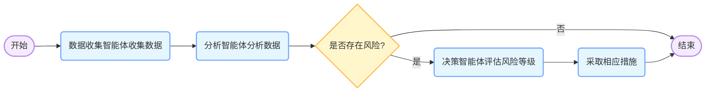

# 智能体协作评估公司的网络安全风险：数字时代的新考量

> 关键词：智能体协作、网络安全风险评估、数字时代、多智能体系统、风险量化

> 摘要：本文聚焦于在数字时代背景下，如何利用智能体协作来评估公司的网络安全风险。首先介绍了智能体协作评估网络安全风险的背景知识，包括目的、预期读者等内容。接着阐述了核心概念，如智能体和网络安全风险的定义及联系，并给出了相应的架构示意图和流程图。详细讲解了核心算法原理，通过Python代码进行了说明，同时介绍了相关的数学模型和公式。结合实际案例，展示了如何进行开发环境搭建、源代码实现和解读。探讨了该方法在不同场景下的实际应用，推荐了相关的学习资源、开发工具和论文著作。最后对未来发展趋势与挑战进行了总结，并提供了常见问题解答和扩展阅读参考资料，旨在为公司在数字时代评估网络安全风险提供全面且深入的指导。

## 1. 背景介绍 
### 1.1 目的和范围
在数字时代，公司面临着日益复杂和严峻的网络安全威胁。传统的网络安全风险评估方法往往难以应对海量的数据和多样化的攻击手段。智能体协作作为一种新兴的技术手段，具有分布式、自主性和协作性等特点，能够更全面、高效地评估公司的网络安全风险。本文的目的是深入探讨智能体协作在公司网络安全风险评估中的应用，包括核心概念、算法原理、数学模型以及实际案例等方面。范围涵盖了从理论基础到实际应用的各个环节，旨在为公司的网络安全管理人员、研究人员和相关从业者提供有价值的参考。

### 1.2 预期读者
本文的预期读者主要包括以下几类人群：
- 公司的网络安全管理人员：他们负责公司的网络安全防护工作，需要了解新的技术和方法来更准确地评估网络安全风险，以便制定有效的安全策略。
- 网络安全研究人员：对智能体技术和网络安全风险评估领域感兴趣的研究人员，希望通过本文了解相关的理论和实践进展。
- 计算机科学和信息技术专业的学生：他们正在学习网络安全和智能体相关课程，本文可以作为他们的学习参考资料，帮助他们深入理解相关概念和技术。
- 相关从业者：如网络安全咨询师、安全审计人员等，他们在工作中需要对公司的网络安全状况进行评估，本文提供的方法和案例可以为他们的工作提供指导。

### 1.3 文档结构概述
本文的结构如下：
- 核心概念与联系：介绍智能体和网络安全风险的核心概念，以及它们之间的联系，同时给出架构示意图和流程图。
- 核心算法原理 & 具体操作步骤：详细讲解智能体协作评估网络安全风险的核心算法原理，并通过Python代码进行说明。
- 数学模型和公式 & 详细讲解 & 举例说明：介绍相关的数学模型和公式，并通过具体例子进行详细讲解。
- 项目实战：代码实际案例和详细解释说明：结合实际案例，展示如何进行开发环境搭建、源代码实现和解读。
- 实际应用场景：探讨智能体协作评估网络安全风险在不同场景下的实际应用。
- 工具和资源推荐：推荐相关的学习资源、开发工具和论文著作。
- 总结：未来发展趋势与挑战：对智能体协作评估网络安全风险的未来发展趋势和面临的挑战进行总结。
- 附录：常见问题与解答：提供常见问题的解答，帮助读者更好地理解本文内容。
- 扩展阅读 & 参考资料：提供相关的扩展阅读资料和参考文献，方便读者进一步深入研究。

### 1.4 术语表
#### 1.4.1 核心术语定义
- **智能体（Agent）**：是一种具有自主性、反应性、社会性和主动性的实体，能够感知环境并根据自身的目标和知识采取行动。在网络安全风险评估中，智能体可以代表不同的安全检测设备、分析模块或决策单元。
- **网络安全风险评估**：是指对公司网络系统中存在的安全威胁、脆弱性以及可能造成的影响进行识别、分析和评估的过程，以确定网络系统的安全状况和风险等级。
- **多智能体系统（Multi - Agent System，MAS）**：由多个智能体组成的系统，这些智能体之间可以通过通信和协作来完成共同的任务。在网络安全风险评估中，多智能体系统可以利用各个智能体的优势，实现更全面、准确的风险评估。
- **风险量化**：将网络安全风险用具体的数值或等级来表示，以便于比较和决策。

#### 1.4.2 相关概念解释
- **自主性**：智能体能够独立地感知环境和做出决策，不需要外部的直接干预。
- **反应性**：智能体能够对环境的变化做出及时的反应，调整自己的行为。
- **社会性**：智能体能够与其他智能体进行通信和协作，共同完成任务。
- **主动性**：智能体能够主动地寻找机会和资源，实现自己的目标。

#### 1.4.3 缩略词列表
- **MAS**：Multi - Agent System，多智能体系统
- **CVE**：Common Vulnerabilities and Exposures，通用漏洞披露
- **IDS**：Intrusion Detection System，入侵检测系统
- **IPS**：Intrusion Prevention System，入侵防御系统

## 2. 核心概念与联系 
### 核心概念原理
#### 智能体
智能体是具有一定智能的实体，它可以是软件程序、硬件设备或两者的结合。智能体具有以下几个关键特性：
- **感知能力**：能够感知周围环境的信息，例如网络流量、系统日志等。
- **决策能力**：根据感知到的信息和自身的知识，做出合理的决策。
- **行动能力**：根据决策结果，采取相应的行动，例如发送警报、执行修复操作等。

在网络安全风险评估中，不同类型的智能体可以承担不同的任务。例如，数据收集智能体负责收集网络系统中的各种数据，分析智能体对收集到的数据进行分析和处理，决策智能体根据分析结果做出风险评估和决策。

#### 网络安全风险评估
网络安全风险评估是一个复杂的过程，主要包括以下几个步骤：
- **资产识别**：确定公司网络系统中的各种资产，如服务器、数据库、应用程序等。
- **威胁识别**：识别可能对资产造成威胁的因素，如黑客攻击、病毒感染等。
- **脆弱性识别**：找出资产中存在的安全漏洞和弱点。
- **风险分析**：分析威胁利用脆弱性对资产造成影响的可能性和后果。
- **风险评估**：根据风险分析的结果，对网络系统的安全风险进行量化和评估。

### 核心概念联系
智能体协作与网络安全风险评估之间存在着密切的联系。智能体可以通过协作的方式，完成网络安全风险评估的各个步骤。例如，多个数据收集智能体可以分布在网络的不同位置，收集更全面的网络数据；分析智能体可以对收集到的数据进行协同分析，提高分析的准确性和效率；决策智能体可以根据多个分析智能体的结果，做出更合理的风险评估和决策。

### 架构的文本示意图
```plaintext
+---------------------+
| 多智能体系统 (MAS)  |
+---------------------+
| 数据收集智能体      |
| 分析智能体          |
| 决策智能体          |
+---------------------+
| 通信模块            |
+---------------------+
| 知识库              |
+---------------------+
| 网络环境            |
| - 服务器            |
| - 数据库            |
| - 应用程序          |
| - 网络设备          |
+---------------------+
```

### Mermaid 流程图


## 3. 核心算法原理 & 具体操作步骤 
### 核心算法原理
智能体协作评估网络安全风险的核心算法主要包括数据融合算法、风险评估算法和协作决策算法。

#### 数据融合算法
数据融合算法的目的是将多个数据收集智能体收集到的数据进行整合和处理，以提高数据的准确性和完整性。常用的数据融合算法有加权平均法、贝叶斯融合法等。

以下是一个简单的加权平均法的Python代码示例：
```python
def weighted_average(data_list, weight_list):
    """
    加权平均法计算融合数据
    :param data_list: 数据列表
    :param weight_list: 权重列表
    :return: 融合后的数据
    """
    if len(data_list)!= len(weight_list):
        raise ValueError("数据列表和权重列表长度必须相同")
    total_weight = sum(weight_list)
    weighted_sum = 0
    for i in range(len(data_list)):
        weighted_sum += data_list[i] * weight_list[i]
    return weighted_sum / total_weight

# 示例数据
data = [10, 20, 30]
weights = [0.2, 0.3, 0.5]
result = weighted_average(data, weights)
print("融合后的数据:", result)
```

#### 风险评估算法
风险评估算法根据融合后的数据和知识库中的信息，对网络系统的安全风险进行评估。常用的风险评估算法有层次分析法（AHP）、模糊综合评价法等。

以下是一个简单的层次分析法的Python代码示例：
```python
import numpy as np

def ahp(matrix):
    """
    层次分析法计算权重
    :param matrix: 判断矩阵
    :return: 权重向量
    """
    n = matrix.shape[0]
    eigen_values, eigen_vectors = np.linalg.eig(matrix)
    max_eigen_value = max(eigen_values).real
    index = np.argmax(eigen_values)
    weight_vector = eigen_vectors[:, index].real
    weight_vector = weight_vector / weight_vector.sum()
    # 一致性检验
    ci = (max_eigen_value - n) / (n - 1)
    ri = [0, 0, 0.58, 0.90, 1.12, 1.24, 1.32, 1.41, 1.45]
    cr = ci / ri[n - 1]
    if cr < 0.1:
        print("一致性检验通过")
    else:
        print("一致性检验未通过，请调整判断矩阵")
    return weight_vector

# 示例判断矩阵
matrix = np.array([[1, 3, 5], [1/3, 1, 3], [1/5, 1/3, 1]])
weights = ahp(matrix)
print("权重向量:", weights)
```

#### 协作决策算法
协作决策算法根据各个分析智能体的评估结果，通过智能体之间的通信和协商，做出最终的决策。常用的协作决策算法有投票法、协商法等。

以下是一个简单的投票法的Python代码示例：
```python
def voting(decisions):
    """
    投票法进行协作决策
    :param decisions: 决策列表
    :return: 最终决策
    """
    decision_count = {}
    for decision in decisions:
        if decision in decision_count:
            decision_count[decision] += 1
        else:
            decision_count[decision] = 1
    max_count = 0
    final_decision = None
    for decision, count in decision_count.items():
        if count > max_count:
            max_count = count
            final_decision = decision
    return final_decision

# 示例决策列表
decisions = ['高风险', '中风险', '高风险', '低风险', '高风险']
final_decision = voting(decisions)
print("最终决策:", final_decision)
```

### 具体操作步骤
1. **数据收集**：多个数据收集智能体分布在网络的不同位置，收集网络流量、系统日志、漏洞信息等数据。
2. **数据融合**：将收集到的数据通过数据融合算法进行整合和处理，得到更准确、完整的数据。
3. **风险评估**：分析智能体根据融合后的数据和知识库中的信息，使用风险评估算法对网络系统的安全风险进行评估。
4. **协作决策**：决策智能体收集各个分析智能体的评估结果，通过协作决策算法做出最终的决策。
5. **执行决策**：根据最终决策，采取相应的措施，如加强安全防护、修复漏洞等。

## 4. 数学模型和公式 & 详细讲解 & 举例说明 
### 数据融合的数学模型和公式
#### 加权平均法
加权平均法的数学公式为：
$$
\bar{x}=\frac{\sum_{i = 1}^{n}w_ix_i}{\sum_{i = 1}^{n}w_i}
$$
其中，$\bar{x}$ 是融合后的数据，$x_i$ 是第 $i$ 个数据，$w_i$ 是第 $i$ 个数据的权重，$n$ 是数据的数量。

**举例说明**：假设有三个数据收集智能体分别收集到的数据为 $x_1 = 10$，$x_2 = 20$，$x_3 = 30$，对应的权重为 $w_1 = 0.2$，$w_2 = 0.3$，$w_3 = 0.5$。则融合后的数据为：
$$
\bar{x}=\frac{0.2\times10 + 0.3\times20 + 0.5\times30}{0.2 + 0.3 + 0.5}=\frac{2 + 6 + 15}{1}=23
$$

#### 贝叶斯融合法
贝叶斯融合法基于贝叶斯定理，其数学公式为：
$$
P(A|B)=\frac{P(B|A)P(A)}{P(B)}
$$
其中，$P(A|B)$ 是在事件 $B$ 发生的条件下事件 $A$ 发生的概率，$P(B|A)$ 是在事件 $A$ 发生的条件下事件 $B$ 发生的概率，$P(A)$ 是事件 $A$ 发生的先验概率，$P(B)$ 是事件 $B$ 发生的概率。

### 风险评估的数学模型和公式
#### 层次分析法（AHP）
层次分析法的主要步骤包括构建判断矩阵、计算特征值和特征向量、进行一致性检验等。

判断矩阵 $A=(a_{ij})_{n\times n}$ 满足 $a_{ij}>0$，$a_{ji}=\frac{1}{a_{ij}}$，$a_{ii}=1$。

最大特征值 $\lambda_{max}$ 满足：
$$
A\mathbf{w}=\lambda_{max}\mathbf{w}
$$
其中，$\mathbf{w}$ 是特征向量。

一致性指标 $CI$ 的计算公式为：
$$
CI=\frac{\lambda_{max}-n}{n - 1}
$$
随机一致性指标 $RI$ 是一个与矩阵阶数 $n$ 有关的常数。

一致性比率 $CR$ 的计算公式为：
$$
CR=\frac{CI}{RI}
$$
当 $CR<0.1$ 时，认为判断矩阵具有满意的一致性。

**举例说明**：假设有一个三层的层次结构，目标层为网络安全风险评估，准则层有三个准则：威胁程度、脆弱性程度、影响程度，方案层有三个方案：高风险、中风险、低风险。构建的判断矩阵如下：
$$
A=\begin{bmatrix}
1 & 3 & 5\\
\frac{1}{3} & 1 & 3\\
\frac{1}{5} & \frac{1}{3} & 1
\end{bmatrix}
$$
通过计算可得最大特征值 $\lambda_{max}\approx3.0385$，$CI=\frac{3.0385 - 3}{3 - 1}=0.01925$，$RI = 0.58$，$CR=\frac{0.01925}{0.58}\approx0.0332<0.1$，一致性检验通过。特征向量 $\mathbf{w}\approx[0.637, 0.258, 0.105]$，即三个准则的权重分别为 $0.637$，$0.258$，$0.105$。

#### 模糊综合评价法
模糊综合评价法的基本步骤包括确定因素集、评语集、权重集、单因素评价矩阵，然后进行模糊合成运算。

设因素集 $U=\{u_1,u_2,\cdots,u_n\}$，评语集 $V=\{v_1,v_2,\cdots,v_m\}$，权重集 $\mathbf{W}=(w_1,w_2,\cdots,w_n)$，单因素评价矩阵 $R=(r_{ij})_{n\times m}$。

模糊综合评价结果 $\mathbf{B}=\mathbf{W}\circ R$，其中 $\circ$ 是模糊合成算子，常用的有最大 - 最小合成算子、加权平均合成算子等。

## 5. 项目实战：代码实际案例和详细解释说明 
### 5.1  开发环境搭建
#### 操作系统
可以选择 Linux 系统（如 Ubuntu、CentOS）或 Windows 系统，建议使用 Linux 系统，因为它在网络编程和开发方面具有更好的性能和稳定性。

#### 编程语言
使用 Python 作为开发语言，Python 具有丰富的库和工具，适合进行数据处理、算法实现和网络编程。

#### 安装必要的库
在命令行中使用以下命令安装必要的库：
```sh
pip install numpy
```

### 5.2  源代码详细实现和代码解读
以下是一个简单的智能体协作评估网络安全风险的 Python 代码示例：
```python
import numpy as np

# 数据收集智能体类
class DataCollectionAgent:
    def __init__(self, id):
        self.id = id

    def collect_data(self):
        # 模拟收集数据
        return np.random.randint(1, 100)

# 分析智能体类
class AnalysisAgent:
    def __init__(self, id):
        self.id = id

    def analyze_data(self, data):
        # 模拟分析数据，简单判断数据是否大于 50
        if data > 50:
            return '高风险'
        else:
            return '低风险'

# 决策智能体类
class DecisionAgent:
    def __init__(self, id):
        self.id = id

    def make_decision(self, decisions):
        decision_count = {}
        for decision in decisions:
            if decision in decision_count:
                decision_count[decision] += 1
            else:
                decision_count[decision] = 1
        max_count = 0
        final_decision = None
        for decision, count in decision_count.items():
            if count > max_count:
                max_count = count
                final_decision = decision
        return final_decision

# 主函数
def main():
    # 创建数据收集智能体
    data_agents = [DataCollectionAgent(i) for i in range(3)]
    # 创建分析智能体
    analysis_agents = [AnalysisAgent(i) for i in range(3)]
    # 创建决策智能体
    decision_agent = DecisionAgent(0)

    # 数据收集
    collected_data = [agent.collect_data() for agent in data_agents]
    print("收集到的数据:", collected_data)

    # 数据分析
    analysis_results = [analysis_agents[i].analyze_data(collected_data[i]) for i in range(3)]
    print("分析结果:", analysis_results)

    # 决策
    final_decision = decision_agent.make_decision(analysis_results)
    print("最终决策:", final_decision)

if __name__ == "__main__":
    main()
```

### 5.3  代码解读与分析
#### 数据收集智能体类（DataCollectionAgent）
- `__init__` 方法：初始化智能体的 ID。
- `collect_data` 方法：模拟收集数据，返回一个 1 到 100 之间的随机整数。

#### 分析智能体类（AnalysisAgent）
- `__init__` 方法：初始化智能体的 ID。
- `analyze_data` 方法：对收集到的数据进行分析，简单判断数据是否大于 50，如果大于 50 则返回 '高风险'，否则返回 '低风险'。

#### 决策智能体类（DecisionAgent）
- `__init__` 方法：初始化智能体的 ID。
- `make_decision` 方法：根据各个分析智能体的评估结果，使用投票法做出最终的决策。

#### 主函数（main）
- 创建数据收集智能体、分析智能体和决策智能体。
- 调用数据收集智能体的 `collect_data` 方法收集数据。
- 调用分析智能体的 `analyze_data` 方法对数据进行分析。
- 调用决策智能体的 `make_decision` 方法做出最终的决策。

通过这个简单的示例，展示了智能体协作评估网络安全风险的基本流程。

## 6. 实际应用场景 
### 企业网络安全评估
在企业网络中，智能体协作可以用于全面评估网络的安全风险。数据收集智能体可以分布在企业网络的各个节点，收集网络流量、服务器日志、用户行为等数据。分析智能体对这些数据进行分析，识别潜在的安全威胁和漏洞。决策智能体根据分析结果，评估企业网络的安全风险等级，并提供相应的建议和措施，如加强访问控制、更新安全补丁等。

### 云计算环境安全评估
在云计算环境中，智能体协作可以帮助云服务提供商和用户评估云环境的安全风险。数据收集智能体可以收集云服务器的性能数据、虚拟机的运行状态、网络流量等信息。分析智能体对这些信息进行分析，检测是否存在异常行为和安全漏洞。决策智能体根据分析结果，评估云环境的安全风险，并提供相应的安全策略和措施，如加密数据传输、限制访问权限等。

### 物联网安全评估
在物联网环境中，智能体协作可以用于评估物联网设备和系统的安全风险。数据收集智能体可以收集物联网设备的传感器数据、通信数据等。分析智能体对这些数据进行分析，检测是否存在设备被攻击、数据泄露等安全问题。决策智能体根据分析结果，评估物联网系统的安全风险，并提供相应的安全解决方案，如更新设备固件、加强数据加密等。

## 7. 工具和资源推荐
### 7.1 学习资源推荐
#### 7.1.1 书籍推荐
- 《多智能体系统：原理与编程》：本书系统地介绍了多智能体系统的基本概念、理论和方法，以及在不同领域的应用，对于学习智能体协作非常有帮助。
- 《网络安全基础教程：应用与标准》：全面介绍了网络安全的基本概念、技术和方法，包括风险评估、漏洞扫描、入侵检测等内容，是学习网络安全风险评估的经典教材。
- 《Python 数据分析实战》：介绍了如何使用 Python 进行数据分析，包括数据处理、可视化、机器学习等方面的内容，对于实现智能体协作评估网络安全风险中的数据处理和分析非常有用。

#### 7.1.2 在线课程
- Coursera 上的“Multi - Agent Systems”课程：由知名高校的教授授课，系统地介绍了多智能体系统的理论和实践，提供了丰富的学习资源和案例。
- edX 上的“Network Security Fundamentals”课程：讲解了网络安全的基础知识和技术，包括风险评估、加密算法、访问控制等内容，适合初学者学习。
- 网易云课堂上的“Python 数据分析实战”课程：通过实际案例，介绍了如何使用 Python 进行数据分析和处理，对于提高编程能力和数据分析能力非常有帮助。

#### 7.1.3 技术博客和网站
- 安全客（https://www.anquanke.com/）：提供了丰富的网络安全技术文章和案例，包括风险评估、漏洞分析、安全防护等方面的内容，是网络安全从业者和爱好者的重要学习平台。
- 开源中国（https://www.oschina.net/）：提供了大量的开源项目和技术文章，包括智能体技术、网络安全技术等方面的内容，可以帮助读者了解最新的技术动态和发展趋势。
- Stack Overflow（https://stackoverflow.com/）：是一个知名的技术问答社区，用户可以在上面提问和回答各种技术问题，对于解决编程和开发过程中遇到的问题非常有帮助。

### 7.2 开发工具框架推荐
#### 7.2.1 IDE和编辑器
- PyCharm：是一款专业的 Python 集成开发环境，提供了丰富的代码编辑、调试、测试等功能，适合开发大型的 Python 项目。
- Visual Studio Code：是一款轻量级的代码编辑器，支持多种编程语言，具有丰富的插件和扩展功能，可以方便地进行 Python 开发。

#### 7.2.2 调试和性能分析工具
- pdb：是 Python 自带的调试工具，可以帮助开发者在代码中设置断点、单步执行、查看变量值等，方便调试代码。
- cProfile：是 Python 自带的性能分析工具，可以分析代码的运行时间和函数调用次数，帮助开发者找出代码中的性能瓶颈。

#### 7.2.3 相关框架和库
- NumPy：是 Python 中用于科学计算的基础库，提供了高效的数组操作和数学函数，对于实现智能体协作评估网络安全风险中的数据处理和分析非常有用。
- Pandas：是 Python 中用于数据处理和分析的库，提供了灵活的数据结构和数据操作方法，方便对网络安全数据进行处理和分析。
- Scikit - learn：是 Python 中用于机器学习的库，提供了丰富的机器学习算法和工具，如分类、回归、聚类等，对于实现智能体协作评估网络安全风险中的风险评估和预测非常有帮助。

### 7.3 相关论文著作推荐
#### 7.3.1 经典论文
- “Multi - Agent Systems: A Modern Approach to Distributed Artificial Intelligence”：该论文系统地介绍了多智能体系统的基本概念、理论和方法，是多智能体系统领域的经典论文。
- “A Survey of Network Security Risk Assessment Techniques”：该论文对网络安全风险评估技术进行了全面的综述，介绍了各种风险评估方法和模型，对于了解网络安全风险评估的发展历程和现状非常有帮助。

#### 7.3.2 最新研究成果
- 可以通过 IEEE Xplore、ACM Digital Library 等学术数据库搜索最新的关于智能体协作评估网络安全风险的研究论文，了解该领域的最新发展动态和研究成果。

#### 7.3.3 应用案例分析
- 可以在安全会议的论文集、行业报告等资料中查找智能体协作评估网络安全风险的应用案例分析，了解实际应用中的经验和教训，为自己的项目提供参考。

## 8. 总结：未来发展趋势与挑战
### 未来发展趋势
#### 智能化程度不断提高
随着人工智能技术的不断发展，智能体将具备更强的学习能力和推理能力，能够自动适应复杂多变的网络环境，更准确地评估网络安全风险。

#### 与区块链技术结合
区块链技术具有去中心化、不可篡改、安全可靠等特点，将智能体协作与区块链技术结合，可以提高网络安全风险评估的可信度和透明度，防止数据被篡改和伪造。

#### 跨领域融合应用
智能体协作评估网络安全风险将与物联网、云计算、大数据等技术进行更深入的融合，应用于更多的领域，如工业互联网、智能交通、医疗保健等，为这些领域的网络安全提供保障。

### 面临的挑战
#### 智能体的自主性和协作性问题
如何确保智能体在复杂的网络环境中具有良好的自主性和协作性，避免出现冲突和不协调的情况，是需要解决的一个重要问题。

#### 数据隐私和安全问题
在智能体协作评估网络安全风险的过程中，需要收集和处理大量的网络数据，如何保护这些数据的隐私和安全，防止数据泄露和滥用，是一个亟待解决的问题。

#### 标准和规范问题
目前，智能体协作评估网络安全风险还缺乏统一的标准和规范，不同的系统和方法之间可能存在兼容性和互操作性问题，需要制定相关的标准和规范来促进该领域的发展。

## 9. 附录：常见问题与解答
### 问题 1：智能体协作评估网络安全风险与传统的风险评估方法有什么区别？
解答：传统的风险评估方法通常是基于静态的规则和模型，难以应对复杂多变的网络环境和攻击手段。而智能体协作评估网络安全风险具有分布式、自主性和协作性等特点，能够实时感知网络环境的变化，通过多个智能体的协作，更全面、准确地评估网络安全风险。

### 问题 2：如何确保智能体之间的通信安全？
解答：可以采用加密技术对智能体之间的通信数据进行加密，如使用对称加密算法（如 AES）或非对称加密算法（如 RSA）。同时，建立身份认证和访问控制机制，确保只有合法的智能体才能进行通信和协作。

### 问题 3：智能体协作评估网络安全风险需要多少个智能体？
解答：智能体的数量取决于网络的规模和复杂度。一般来说，网络规模越大、复杂度越高，需要的智能体数量就越多。可以根据实际情况进行合理的规划和部署。

### 问题 4：如何验证智能体协作评估网络安全风险的准确性？
解答：可以采用模拟实验和实际应用相结合的方法进行验证。在模拟实验中，构建不同的网络场景和攻击模型，比较智能体协作评估结果与实际情况的差异。在实际应用中，通过长期的监测和分析，评估智能体协作评估结果的准确性和可靠性。

## 10. 扩展阅读 & 参考资料
### 扩展阅读
- 《人工智能：一种现代的方法》：全面介绍了人工智能的基本概念、理论和方法，包括智能体技术、机器学习、自然语言处理等方面的内容，对于深入理解智能体协作评估网络安全风险的理论基础非常有帮助。
- 《网络安全态势感知技术》：介绍了网络安全态势感知的基本概念、技术和方法，包括数据收集、分析、评估等方面的内容，对于了解如何利用智能体协作实现网络安全态势感知非常有帮助。

### 参考资料
- 《多智能体系统导论》
- 《网络安全风险评估指南》
- 相关的学术论文和研究报告

作者：AI天才研究院/AI Genius Institute & 禅与计算机程序设计艺术 /Zen And The Art of Computer Programming